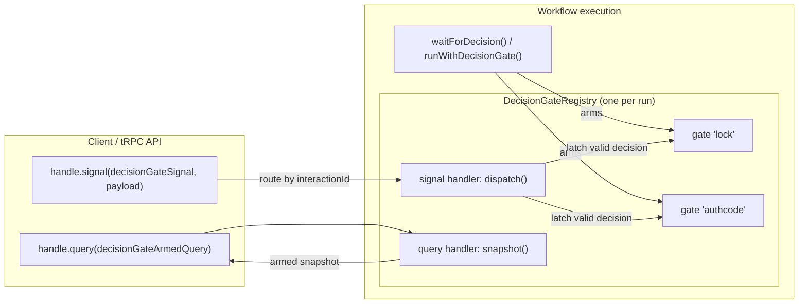
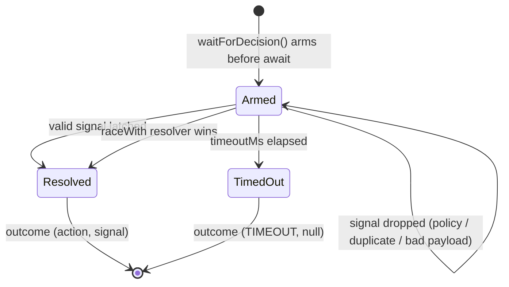
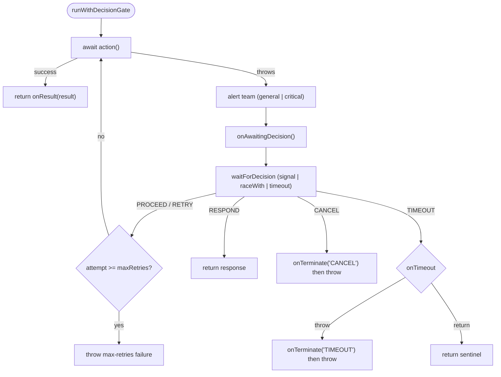
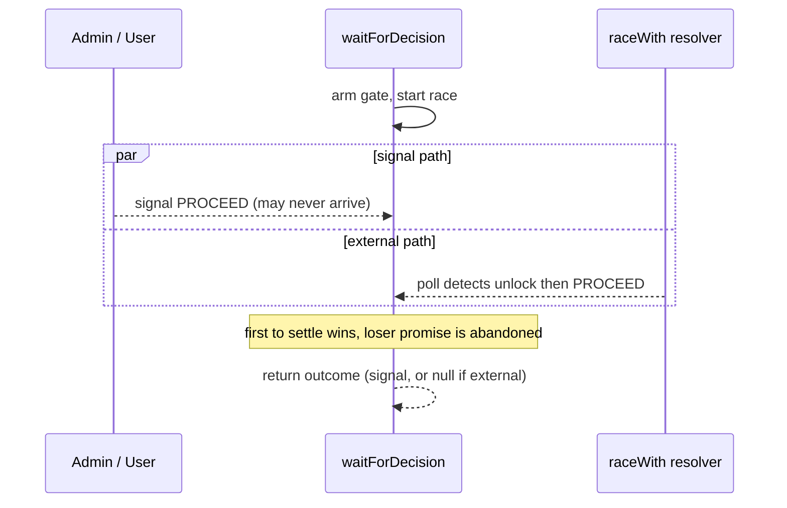
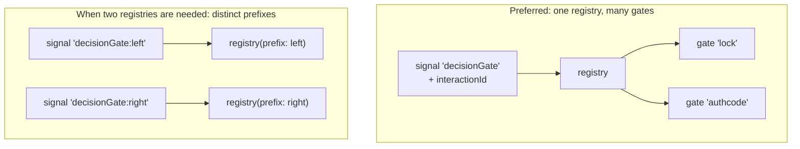

# Decision Gate

A reusable Temporal workflow helper for the pattern: **run an operation; when it
fails or hits a precondition, alert the team, then wait for an admin/user
decision (or a timeout, or an external condition) and branch on it.**

It generalizes the hand-rolled `createNextActionManager` that lived in
`epp-register-or-import.workflow.ts`, adds new decision types, makes the wait
multiplexable and observable, and fixes a lost-signal race.

- Code: [`decision-gate.ts`](./decision-gate.ts)
- Companion poller: [`escalating-poller.ts`](./escalating-poller.ts) (short → long → timeout)
- Tests: [`decision-gate.test.ts`](./decision-gate.test.ts) (time-skipping)

---

## Concepts

| Term | Meaning |
|---|---|
| **Registry** | One per workflow run (`createDecisionGateRegistry()`). Owns exactly one signal handler and one query handler. |
| **Gate** | A single armed wait-point. A registry can host many, distinguished by `interactionId`. |
| **Decision** | What resolves a gate: a signal, an external `raceWith` resolver, or a timeout. |
| **Action** | `PROCEED` · `CANCEL` · `RETRY` · `RESPOND` (+ the synthetic `TIMEOUT`). |

### Actions

| Action | Meaning | In `runWithDecisionGate` |
|---|---|---|
| `PROCEED` | Continue / the blocker is cleared | re-run the guarded action |
| `RETRY` | Explicitly retry | re-run the guarded action |
| `RESPOND` | Resolve with a caller-supplied JSON payload | return that payload |
| `CANCEL` | Abort | run `onTerminate`, throw a non-retryable failure |
| `TIMEOUT` | No decision before the deadline | run `onTerminate`, throw or return a sentinel |

### How the pieces fit



---

## Two layers of API

### 1. `waitForDecision` — low-level gate

Arms a gate and resolves on the first valid signal, an external resolver, or a
timeout. Use it directly for **precondition waits** (nothing failed; you are
waiting for an operator or an external state).

```ts
const registry = createDecisionGateRegistry();

const outcome = await registry.waitForDecision({
  interactionId: 'unlock',          // optional; defaults to the single armed gate
  allowedActors: ['ADMIN', 'USER'], // default ['ADMIN']
  allowedActions: ['PROCEED', 'CANCEL'],
  timeoutMs: 7 * 24 * 60 * 60 * 1000, // omit to wait forever
});

switch (outcome.action) {
  case 'PROCEED': /* ... */ break;
  case 'CANCEL':  /* ... */ break;
  case 'RESPOND': useTyped(outcome.response); break;
  case 'TIMEOUT': /* ... */ break;
}
```

`outcome.signal` is the `DecisionSignalPayload` that resolved the gate, or `null`
for a `TIMEOUT` or an external (`raceWith`) resolution.

A single gate's lifecycle:



### 2. `runWithDecisionGate` — failure-wrapping guard

Runs an action; **on failure** it alerts the team (with workflow id, run id,
error and your `alertDetails`), then opens a gate and branches:

```ts
const value = await runWithDecisionGate({
  registry,
  action: () => submitTransferOrThrow(),
  alertMessage: 'Domain transfer submission failed',
  alertSeverity: 'general',          // or 'critical' → Slack + ClickUp ticket + monitor
  allowedActors: ['ADMIN'],
  timeoutMs: 24 * 60 * 60 * 1000,
  maxRetries: 5,                      // caps PROCEED/RETRY re-runs
  onAwaitingDecision: async () => setOrderItemRequiredAction(/* notify user */),
  onTerminate: async ({ reason, signal }) => recordFailureReason(reason, signal),
  onTimeout: { kind: 'throw' },       // or { kind: 'return', value }
});
```

On success it returns `onResult(result)` (or the result). `PROCEED`/`RETRY`
re-run the action; `RESPOND` returns the payload; `CANCEL`/`TIMEOUT` terminate.



---

## Racing an external resolver (`raceWith`)

Sometimes a wait should also end when an **external condition** becomes true,
with no operator input. The canonical case is the EPP import lock: while we wait
for an admin/user to confirm the domain is unlocked, we also poll the registrar
— and the moment polling detects the unlock, we proceed.

```ts
const outcome = await registry.waitForDecision({
  allowedActors: ['ADMIN', 'USER'],
  allowedActions: ['PROCEED', 'CANCEL'],
  timeoutMs,
  raceWith: async () => {
    // Long-poll the registrar; resolves only once the domain is unlocked.
    await pollAndExpectEppLockStateChange(domain, { locked: false });
    return { action: 'PROCEED' }; // external resolution → outcome.signal === null
  },
});
```

`raceWith` returns a `GateResolution` (`PROCEED` / `CANCEL` / `RETRY` /
`RESPOND` + value). Whichever settles first — the signal/timeout wait or the
resolver — wins.



Caveats:
- If `raceWith` **rejects**, the rejection propagates out of `waitForDecision`.
- The **losing** branch's promise is *abandoned, not cancelled*. A long-poll
  activity used as `raceWith` keeps running in the background until it settles or
  the workflow closes. Wrap it in a `workflow.CancellationScope` if that matters.

`runWithDecisionGate` accepts the same `raceWith` (re-created per attempt).

---

## Multiple wait-points

**Preferred — one registry, many gates** distinguished by `interactionId`:

```ts
const registry = createDecisionGateRegistry();
const [a, b] = await Promise.all([
  registry.waitForDecision({ interactionId: 'lock' }),
  registry.waitForDecision({ interactionId: 'authcode' }),
]);
```

A signal routes by its `interactionId`; an un-routed signal resolves the single
armed gate (the legacy/back-compat path), else the `__default__` bucket.



**When you genuinely need more than one registry** in the same execution (e.g.
composed sub-flows), give each a distinct `prefix` so their signal/query handler
names don't collide:

```ts
const left  = createDecisionGateRegistry({ prefix: 'left' });  // signal 'decisionGate:left'
const right = createDecisionGateRegistry({ prefix: 'right' }); // signal 'decisionGate:right'
```

If you omit the prefix and one is already taken, a prefix is **auto-assigned**
from the workflow type (e.g. `decisionGate:myWorkflow`, then `…-2`, …) and a
`log.warn` is emitted nudging you to set an explicit one. Detection is tracked
per execution in workflow memo (`__decisionGateRegistryNames`), so it is
replay-deterministic.

> Note: true Temporal **child workflows** are separate executions with isolated
> handler namespaces — they never collide and never need a prefix. Prefixes only
> matter for multiple registries within **one** execution.

Each registry exposes its resolved identity: `registry.prefix`,
`registry.signalName`, `registry.armedQueryName`.

---

## Observability — the armed-gates query

Every registry registers a query so an operator/UI can ask a running workflow
"what are you blocked on?" without sending anything:

```ts
const snapshot = await handle.query(decisionGateArmedQuery); // default registry
// → { count, gates: [{ interactionId, allowedActors, allowedActions, requiresResponseValidation }] }
```

For a prefixed registry use `decisionGateArmedQueryFor(prefix)`. In-workflow,
`registry.getArmedGates()` returns the same snapshot.

---

## Sending a decision (client / API side)

Target the registry's signal by definition or by name:

```ts
import {
  decisionGateSignal,        // default registry ('decisionGate')
  decisionGateSignalFor,     // decisionGateSignalFor('left')
} from '.../decision-gate';

const handle = client.workflow.getHandle(workflowId);
await handle.signal(decisionGateSignal, {
  actor: 'ADMIN',
  actorId: ctx.user.id,
  action: 'PROCEED',
  interactionId: 'unlock',     // optional
  response: { /* ... */ },     // only for action: 'RESPOND'
});
```

`DecisionSignalPayload` is a strict superset of the legacy
`{ actor, actorId, action }`, so existing senders deserialize unchanged.

A signal is **ignored** (gate keeps waiting) when: the gate isn't armed, the
actor isn't in `allowedActors`, the action isn't in `allowedActions`, or a
`RESPOND` payload fails `validateResponse`.

---

## Correctness & determinism

- **One registry per run**, created as a local value — never a module-global
  singleton (that would leak state across concurrent runs and break replay).
- **Exactly one signal handler** per registry (plus one per legacy bridge).
- **Arm before await:** a gate is added to the registry *before* `waitForDecision`
  awaits, so a signal buffered just before the wait is still latched — fixing the
  old `if (!waitingForSignal) return` lost-signal bug.
- **Exactly-once / idempotent dispatch:** a resolved gate ignores further
  signals; handlers never throw (a throwing signal handler wedges the task).
- **No wall clock / randomness.** Timeouts are ms; the auto-prefix counter and
  memo writes are deterministic.

---

## Testing

Tests run against `@temporalio/testing`'s time-skipping environment with thin
harness workflows in
[`../../workflows/test-workflows/decision-gate-harness.workflow.ts`](../../workflows/test-workflows/decision-gate-harness.workflow.ts).
They cover timeout, every action, actor rejection, `RESPOND` validation,
interactionId routing, prefix isolation (explicit + auto), the armed-gates query,
and `raceWith` (external-wins and signal-wins).

```bash
bun run vitest run src/temporal/shared/workflow-helpers/decision-gate.test.ts
```

---

## Deprecations

- `legacySignals` / `LegacySignalBridge` are **transitional** — for migrating a
  workflow that still defines its own signal (e.g. EPP's `'nextAction'`) onto the
  gate without changing its senders. Once senders target `decisionGateSignal`
  directly, drop the bridge; the option is slated for removal.
