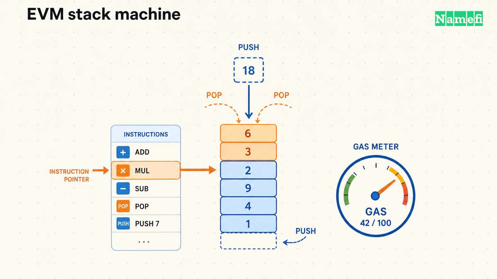
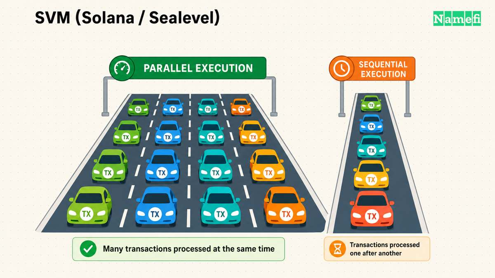
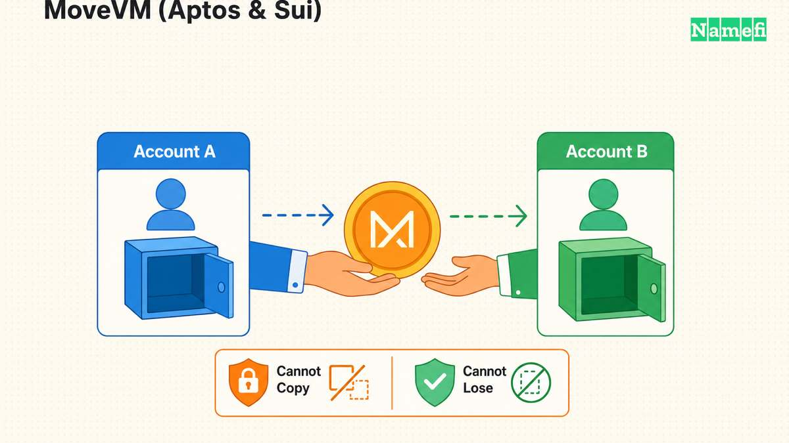

كل [عقد ذكي](/ar/glossary/smart-contract/) لازم يشتغل في مكان ما. و«المكان» ده هو آلة افتراضية للبلوكتشين (VM): برنامج معزول تنفّذه كل عقدة في الشبكة بالطريقة نفسها، بحيث ينتج عن المدخل نفسه المخرج نفسه مهما كان اللي يشغّله. والـ VM التي تبني عليها تشكّل تقريباً كل شيء في السلسلة: اللغات التي تقدر تكتب بها، وهل المعاملات تشتغل في الوقت نفسه أم واحدة وراء الثانية، وقدر ما يمكن توصيله من منظومة المطورين الحالية من أول يوم.

الدليل ده يستعرض خمسة تصاميم للـ VM تشغّل فيما بينها معظم نشاط العقود الذكية في [Web3](/ar/glossary/web3/) اليوم: [Ethereum Virtual Machine](/ar/glossary/ethereum-virtual-machine/) ‏(EVM)، وSVM الخاصة بـ Solana، وMoveVM كما تستخدمها Aptos وSui، والآلات المعتمدة على [WebAssembly](/ar/glossary/webassembly/) ‏(WASM) مثل CosmWasm وPolkaVM، وCairoVM الخاصة بـ Starknet.

---

## ما هي آلة البلوكتشين الافتراضية، ولماذا تهم؟

آلة البلوكتشين الافتراضية هي بيئة تنفيذ حتمية ومعزولة: كل عقدة كاملة تنزّل المعاملات نفسها، وتشغّلها عبر الـ VM نفسها، وتصل إلى الحالة [على السلسلة (On-chain)](/ar/glossary/on-chain/) نفسها الناتجة. تصف وثائق Ethereum نفسها EVM بأنها «بيئة افتراضية لامركزية تنفّذ الشيفرة باتساق وأمان عبر كل عقد Ethereum» ([ethereum.org](https://ethereum.org/en/developers/docs/evm/#:~:text=The%20EVM%20is%20a%20decentralized,mechanics%20of%20how%20they%20work))، وهو وصف ينطبق على كل VM في هذا الدليل.

خاصيتان تحددان مفاضلات تصميم الـ VM:

- **اللغة وسلسلة الأدوات.** بأي لغة يقدر المطورون يكتبوا العقود، وما حجم مكتبة الشيفرة المدققة والأدوات والمطورين المتاحين ممن يعرفونها بالفعل؟
- **نموذج التنفيذ.** هل تعالج الـ VM المعاملات واحدة في كل مرة وبشكل صارم (تنفيذ متسلسل)، أم يمكن للمعاملات المستقلة أن تعمل في وقت واحد على أنوية CPU متعددة (تنفيذ متوازٍ)؟ التنفيذ المتسلسل أبسط في التحليل؛ أما التنفيذ المتوازي فيرفع الإنتاجية النظرية لكنه يضيف تعقيداً في الجدولة.

تنتشر آثار هذه الخيارات إلى تكاليف الغاز وسلوك الازدحام وأي العقود والأدوات القائمة يمكن نقلها من غير إعادة كتابة؛ ولذلك فإن سؤال «أي VM؟» واحد من أول الأسئلة التي يتعين على أي سلسلة جديدة، أو أي أصل [مُرمَّز](/ar/glossary/tokenize/) مبني فوقها، الإجابة عنه.

---

## EVM ‏(Ethereum Virtual Machine)

تعد EVM أقدم آلة افتراضية للعقود الذكية وأكثرها انتشاراً، وقد قُدّمت مع [Ethereum](/ar/glossary/ethereum/) في 2015. وهي آلة **قائمة على المكدس**: تحدد وثائق Ethereum أنها تعمل «كآلة مكدس بعمق 1024 عنصراً»، حيث كل عنصر كلمة من 256 بت ([ethereum.org](https://ethereum.org/en/developers/docs/evm/#:~:text=The%20EVM%20executes%20as%20a,256%2Dbit%20word)). توجد حالة العقد في شجرة Merkle Patricia مرتبطة بكل حساب، كما تنظّم حالة السلسلة العامة في شجرة Merkle Patricia معدّلة تربط كل الحسابات بالتجزئات ([ethereum.org](https://ethereum.org/en/developers/docs/evm/#:~:text=Ethereum%20uses%20a%20modified%20Merkle,linked%20by%20hashes)).

**اللغة.** تُكتب العقود في الغالب بـ **Solidity**، التي تصفها وثائق Ethereum نفسها بأنها «لغة عالية المستوى وكائنية التوجه لتنفيذ العقود الذكية»، ومتأثرة بشدة ببنية C++ ([ethereum.org](https://ethereum.org/en/developers/docs/smart-contracts/languages/#:~:text=Solidity)). أما **Vyper**، وهي لغة «بطابع Python» تقلّص الميزات عمداً لتسهّل تدقيق العقود، فهي البديل الرئيسي ([ethereum.org](https://ethereum.org/en/developers/docs/smart-contracts/languages/#:~:text=Vyper)).

**نموذج التنفيذ.** تعالج EVM المعاملات داخل الكتلة **بشكل متسلسل**، واحدة تلو الأخرى وبترتيب ثابت، ما يُبقي منطق انتقال الحالة بسيطاً وسهل التدقيق، لكنه يضع سقفاً للإنتاجية على الطبقة الأساسية.

**الغاز.** كل عملية تكلّف [الغاز (رسوم المعاملات)](/ar/glossary/gas/)، وهي وحدة Ethereum لـ «الجهد الحاسوبي المطلوب للعمليات»، والتي تسعّر التنفيذ وتحمي الشبكة من الرسائل المزعجة أو الحلقات اللانهائية ([ethereum.org](https://ethereum.org/en/developers/docs/evm/#:~:text=Since%20each%20transaction%20is%20broadcast,uses%20gas)).

**القوة والانتشار المميزان.** الخندق الحقيقي لـ EVM هو منظومتها: إنها الـ VM الأكثر تطبيقاً في العملات المشفرة، وعشرات حلول Layer 2 والسلاسل المستقلة (Arbitrum وOptimism وBase وPolygon وBNB Chain وAvalanche C-Chain) تقدّم بيئات **متوافقة مع EVM** أو **مكافئة لـ EVM** حتى تُنشر عقود Solidity والمحافظ والأدوات القائمة بتغيير قليل أو من دونه.

---

## SVM ‏(Solana / Sealevel)

بيئة تشغيل Solana، **Sealevel**، مبنية على رهان محدد: معظم المعاملات تلمس أجزاء منفصلة من الحالة، لذا يمكن تنفيذها في الوقت نفسه بدلاً من واحدة في كل مرة. ويصف إعلان Solana نفسه Sealevel بأنها «بيئة التشغيل المتوازية للعقود الذكية في Solana» والقادرة على «معالجة آلاف العقود بالتوازي، باستخدام العدد المتاح من الأنوية لدى المدقّق» ([solana.com](https://solana.com/news/sealevel---parallel-processing-thousands-of-smart-contracts#:~:text=Sealevel%E2%80%94Parallel%20Smart%20Contracts%20Runtime)).

**كيف يعمل التوازي.** على معاملات Solana أن تعلن مسبقاً كل حساب ستقرأه أو تكتب إليه. وهذا الإعلان هو ما يجعل الجدولة ممكنة: يمكن لبيئة التشغيل أن «تفرز ملايين المعاملات المعلّقة» و«تجدول كل المعاملات غير المتداخلة بالتوازي»، بما فيها معاملات عدة لا تفعل سوى *قراءة* الحساب نفسه في الوقت نفسه ([solana.com](https://solana.com/news/sealevel---parallel-processing-thousands-of-smart-contracts#:~:text=Sort%20millions%20of%20pending%20transactions)). ولا تُنفّذ معاملتان بشكل متسلسل إحداهما مع الأخرى إلا إذا كانتا تكتبان كلتاهما إلى الحساب نفسه.

**اللغة وداخل الـ VM.** تُترجم برامج Solana (وهو اسمها للعقود الذكية) إلى نسخة من شيفرة Berkeley Packet Filter الثنائية؛ وتصف Solana Labs ذلك بأنها اختارت «نسخة من شيفرة Berkeley Packet Filter ‏(BPF) الثنائية» للـ VM على السلسلة ([solana.com](https://solana.com/news/sealevel---parallel-processing-thousands-of-smart-contracts#:~:text=Berkeley%20Packet%20Filter)). وغالباً ما تُكتب البرامج بـ **Rust**، مع دعم C وC++ أيضاً.

**القوة المميزة.** لأن التوازي على مستوى الحساب خاصية في بيئة التشغيل بدلاً من شيء يتعين على كاتب كل عقد برمجته يدوياً، تستطيع Solana الحفاظ على إنتاجية عالية من غير نقل التنفيذ خارج السلسلة، مقابل نموذج أكثر صرامة لإعلان الحسابات يغيّر طريقة كتابة العقود مقارنةً بتخزين EVM الحر الشكل.

---

## MoveVM ‏(Aptos وSui)

**Move** لغة عقود ذكية بُنيت في الأصل لمشروع Diem التابع لـ Meta، وأصبحت الآن الطبقة الأساسية لـ **Aptos** و**Sui**، وكل منهما يشغّل نسخة MoveVM الخاصة به. تصف وثائق Aptos لغة Move بأنها «لغة برمجة آمنة ومأمونة لـ Web3 تركّز على الندرة والتحكم في الوصول» ([aptos.dev](https://aptos.dev/en/network/blockchain/move#:~:text=Move%20is%20a%20safe%20and,scarcity%20and%20access%20control)).

**نموذج الموارد.** الفكرة المميزة في Move هي معاملة الأصول الرقمية باعتبارها **موارد**، أي أنواع struct خاصة يضمن نظام الأنواع في اللغة أنها «لا يمكن نسخها أو إسقاطها عرضاً» ([aptos.dev](https://aptos.dev/en/network/blockchain/move#:~:text=Resources%20cannot%20be%20copied%2C%20they,structs%20cannot%20be%20accidentally%20duplicated)). فلا يمكن فعلياً نسخ توكن أو NFT مصمم كمورد Move بعقد معيب كما قد يحدث إنفاق مزدوج لعدد صحيح ساذج يمثل رصيد حساب؛ بل يرفض المترجم البرنامج. وفقط هياكل البيانات التي وُسمت صراحةً بأنها قابلة للنسخ أو الإسقاط يمكن تكرارها أو التخلص منها.

**التنفيذ المتوازي.** تشغّل Aptos عقود Move عبر **Block-STM**، التي تصفها الوثائق بأنها تمكّن «التنفيذ المتزامن للمعاملات من دون أي مدخل من المستخدم»؛ إذ تستنتج بيئة التشغيل المعاملات المستقلة وقت التنفيذ بدلاً من طلب قوائم الحسابات المعلنة التي تستخدمها Solana ([aptos.dev](https://aptos.dev/en/network/blockchain/move#:~:text=Parallelism%20via%20Block,input%20from%20the%20user)).

**نموذج الكائنات في Sui.** تأخذ Sui فكرة موارد Move خطوة أبعد بطبقة تخزين تركز على الكائنات: «الكائن وحدة تخزين أساسية على الشبكة. كل مورد أو أصل أو جزء من البيانات على السلسلة هو كائن»، يمكن عنونته بمعرّف فريد بدلاً من أن يوجد في مخزن مفاتيح وقيم لحساب ([docs.sui.io](https://docs.sui.io/concepts/object-model#:~:text=An%20object%20is%20a%20fundamental,piece%20of%20data%20onchain%20is%20an%20object)). وتكون الكائنات إما ذات مالك واحد (**كائنات مملوكة**، يمكن تنفيذ معاملاتها بالتوازي من دون أي ترتيب توافق لأن أي معاملة أخرى لا تستطيع لمسها) أو **كائنات مشتركة** يمكن لأطراف عدة الوصول إليها، وبالتالي تحتاج إلى تسلسل توافق.

**القوة المميزة.** تجعل أنواع الموارد في Move فئات كاملة من أخطاء الأصول، مثل الإنفاق المزدوج والحرق غير المقصود، غير قابلة للتمثيل وقت الترجمة؛ وتقترن Aptos وSui كلتاهما بنموذج السلامة هذا بتنفيذ متوازٍ صُمم من البداية بدلاً من إضافته لاحقاً.

---

## الآلات المعتمدة على WASM ‏(CosmWasm وPolkaVM)

بدلاً من تعريف صيغة شيفرة ثنائية مصممة خصيصاً، تشغّل عائلة ثانية من السلاسل العقود الذكية عبر **WebAssembly**، وهي صيغة ثنائية عامة بُنيت أصلاً للمتصفح. يصف معيار WebAssembly ‏Wasm بأنها «صيغة تعليمات ثنائية لآلة افتراضية قائمة على المكدس»، ومصممة لتكون «هدف ترجمة محمولاً للغات البرمجة» و«تهدف إلى التنفيذ بسرعة أصلية» ([webassembly.org](https://webassembly.org/#:~:text=WebAssembly%20(abbreviated%20Wasm)%20is%20a,wide%20range%20of%20platforms)). استخدام Wasm كـ VM للعقود يعني أن أي لغة لديها هدف ترجمة إلى Wasm، مثل Rust وC وC++ وGo، يمكنها من حيث المبدأ إنتاج عقد قابل للنشر.

**CosmWasm.** منصة العقود الذكية المعتمدة على Wasm والأبرز في منظومة Cosmos، تصف CosmWasm نفسها بأنها «منصة عقود ذكية آمنة وعالية الأداء وقابلة للتشغيل البيني لعالم متعدد السلاسل» ([cosmwasm.com](https://www.cosmwasm.com/#:~:text=Secure%2C%20performant%2C%20interoperable%20smart%20contract,platform%20for%20the%20multi%2Dchain%20world)). تُكتب العقود بـ **Rust** وتعمل على «بيئة تشغيل Web Assembly محسّنة جداً» ([cosmwasm.com](https://www.cosmwasm.com/#:~:text=highly%20optimized%20Web%20Assembly%20runtime)). نُشرت CosmWasm عبر عشرات من سلاسل Cosmos SDK، بما فيها Osmosis وNeutron وInjective وSecret Network وTerra، وترث رسائل IBC الأصلية العابرة للسلاسل من Cosmos.

**PolkaVM.** اتخذت VM العقود الذكية الأحدث في Polkadot طريقاً مختلفاً: بدلاً من تنفيذ Wasm الخام، بنت Parity ‏PolkaVM التي يصفها مستودعها بأنها «آلة افتراضية عامة على مستوى المستخدم مبنية على RISC-V» ([github.com/paritytech/polkavm](https://github.com/paritytech/polkavm#:~:text=PolkaVM%20is%20a%20general%20purpose,level%20RISC%2DV%20based%20virtual%20machine)). والسبب، وفق وثائق العقود الذكية لـ ink!، هو الأداء: تنفيذ RISC-V «يرتبط بإنتاجية المعاملات وتكاليفها»، بما يوفّر تنفيذاً أسرع وأرخص من مفسر Wasm الذي كانت ink! تستخدمه سابقاً ([use.ink](https://use.ink/docs/v6/background/why-riscv-and-polkavm-for-smart-contracts/#:~:text=performance%20correlates%20with%20transaction%20throughput)). ومن اللافت أن حزمة PolkaVM في Polkadot، التي تحمل علامة «Revive»، تقدّم أيضاً طبقة مفسر EVM، ما يسمح لعقود Solidity بالعمل على الواجهة الخلفية نفسها المبنية على RISC-V.

**القوة المميزة.** تستبدل الآلات المعتمدة على WASM شيفرة ثنائية مصممة لغرض محدد بهدف ترجمة ناضج واسع التطبيق؛ وتمنح Rust خصوصاً ضمانات قوية لسلامة الذاكرة لشيفرة العقود، كما تستفيد بيئات تشغيل Wasm/RISC-V الأساسية من أدوات بُنيت لحالات استخدام غير بلوكتشين أكبر بكثير.

---

## CairoVM ‏(Starknet)

**Cairo** هي لغة العقود الذكية والـ VM المبنيتان تحديداً لتوليد إثباتات المعرفة الصفرية، وتشكلان أساس **Starknet**، وهي [Layer 2](/ar/glossary/layer-2/) لـ Ethereum. وتوضح وثائق Starknet هدف التصميم بصراحة: «Cairo هي بنية فون نيومان صديقة لـ STARK قادرة على إنشاء إثباتات صحة لأي عمليات حسابية» ([starknet.io](https://www.starknet.io/cairo-book/ch201-architecture.html#:~:text=Cairo%20is%20a%20STARK,for%20arbitrary%20computations)). وكونها «صديقة لـ STARK» يعني أن مجموعة التعليمات «محسّنة لنظام إثبات STARK، مع بقائها متوافقة مع واجهات خلفية لأنظمة إثبات أخرى» ([starknet.io](https://www.starknet.io/cairo-book/ch201-architecture.html#:~:text=Being%20STARK,other%20proof%20system%20backends))، وهي أولوية معاكسة لـ EVM أو SVM اللتين صُممتا أولاً للتنفيذ ثم أضيفت إليهما أنظمة الإثبات لاحقاً من أجل التوسع.

**نموذج التنفيذ.** تترجم Cairo إلى مجموعة تعليمات مكتملة تورنغ («آلة Cairo») تُحدد كمجموعة من التمثيلات الوسيطة الجبرية، بحيث يمكن تحويل أثر تنفيذ أي برنامج Cairo إلى إثبات STARK موجز قابل للتحقق على Ethereum L1 ([starknet.io](https://www.starknet.io/cairo-book/ch201-architecture.html#:~:text=At%20its%20core%2C%20Cairo%20is,arbitrary%20code%29%20through%20the%20Cairo%20machine)). وهذا ما يتيح لـ Starknet تجميع آلاف المعاملات خارج السلسلة ونشر إثبات واحد صغير للصحة إلى Ethereum، بدلاً من إعادة تنفيذ كل معاملة.

**القوة المميزة.** لأن قابلية إنشاء الإثبات كانت قيد التصميم الابتدائي لا فكرة لاحقة، يكون إثبات برامج Cairo أرخص من حساب مكافئ يُشغّل عبر VM عامة أُعيد تكييفها مع مُثبت zk ‏(«zkEVM»). والمقابل هو منظومة لغوية أحدث وأصغر ومنحنى تعلم أشد انحداراً من Solidity للمطورين القادمين من Ethereum.

---

## جدول المقارنة

| VM | لغة/لغات العقود | نموذج التنفيذ / الحالة | التنفيذ المتوازي | حجم المنظومة | متوافق مع EVM |
|---|---|---|---|---|---|
| **EVM** | Solidity، Vyper | آلة مكدس؛ حالة الحساب/التخزين في شجرة Merkle Patricia | لا، متسلسل داخل الكتلة | الأكبر؛ الهدف الافتراضي لحلول L2 وسلاسل التطبيقات | أصلي |
| **SVM ‏(Solana)** | Rust، C، C++ | شيفرة ثنائية مشتقة من BPF؛ حالة قائمة على الحسابات مع مجموعات قراءة/كتابة معلنة | نعم، تجدول Sealevel المعاملات غير المتداخلة بالتزامن | كبير وسريع النمو، ومعظمه خاص بـ Solana | لا (منظومة منفصلة) |
| **MoveVM ‏(Aptos/Sui)** | Move | كائنات بأنواع موارد؛ تستخدم Aptos ‏Block-STM وتستخدم Sui نموذج المملوك/المشترك للكائنات | نعم، يُستنتج وقت التشغيل (Aptos) أو عبر ملكية الكائن (Sui) | أصغر وينمو؛ منظومتان مستقلتان لـ Move | لا |
| **معتمدة على WASM ‏(CosmWasm، PolkaVM)** | Rust ‏(CosmWasm)؛ سلاسل أدوات Rust/C/RISC-V ‏(PolkaVM) | شيفرة Wasm الثنائية (CosmWasm) أو شيفرة RISC-V الثنائية (PolkaVM) | يعتمد على السلسلة؛ ليس خاصية عامة لتنفيذ Wasm | متوسط؛ موزع على كثير من سلاسل Cosmos ومجموعة parachains في Polkadot | تضيف PolkaVM/Revive طبقة مفسر EVM؛ أما CosmWasm فليست متوافقة مع EVM |
| **CairoVM ‏(Starknet)** | Cairo | آلة مكتملة تورنغ قائمة على AIR ومصممة لإثباتات STARK | ليس هدف التصميم الرئيسي؛ محسّنة لقابلية الإثبات لا للتزامن | الأصغر بين الخمسة، لكنه ينمو مع نشاط L2 في Starknet | لا (مشروعات zkEVM تربط عقود Solidity بها بشكل منفصل) |

---

## كيف يرتبط هذا بالنطاقات المُرمَّزة؟

تؤثر الـ VM التي تشغّلها السلسلة مباشرة في بنية [الدومين المُرمَّز](/ar/glossary/tokenized-domain/). فالدومين الممثّل على هيئة [NFT (رمز غير قابل للاستبدال)](/ar/glossary/nft/) هو في جوهره عقد ذكي يفرض من يملك التوكن وما الذي يستطيع فعله به، وهي الفئة نفسها من المنطق التي صُمم نموذج موارد Move لجعلها آمنة بطريقة قابلة للإثبات، والتي تجعلها أدوات EVM الناضجة سهلة التدقيق والدمج مع المحافظ والأسواق القائمة. يستهدف نموذج الترميز في Namefi منظومة EVM عمداً: فالتوافق مع EVM يعني أن NFT ملكية دومين `.com` أو `.ai` مُرمَّز يعمل مباشرةً مع عالم محافظ EVM والأسواق وبروتوكولات DeFi القائمة، بدلاً من أن يحتاج إلى تكامل مخصص مع كل VM جديدة. استكشف النطاقات المُرمَّزة على [namefi.io](https://namefi.io).

---

## المصادر وقراءة إضافية

- [Ethereum Virtual Machine ‏(EVM) — ethereum.org](https://ethereum.org/en/developers/docs/evm/)
- [لغات العقود الذكية — ethereum.org](https://ethereum.org/en/developers/docs/smart-contracts/languages/)
- [Sealevel — المعالجة المتوازية لآلاف العقود الذكية — Solana](https://solana.com/news/sealevel---parallel-processing-thousands-of-smart-contracts)
- [Move — وثائق Aptos](https://aptos.dev/en/network/blockchain/move)
- [نموذج الكائنات — وثائق Sui](https://docs.sui.io/concepts/object-model)
- [CosmWasm](https://www.cosmwasm.com/)
- [PolkaVM — GitHub ‏(paritytech)](https://github.com/paritytech/polkavm)
- [لماذا RISC-V وPolkaVM للعقود الذكية — وثائق ink!](https://use.ink/docs/v6/background/why-riscv-and-polkavm-for-smart-contracts/)
- [بنية Cairo — لغة برمجة Cairo / Starknet](https://www.starknet.io/cairo-book/ch201-architecture.html)
- [WebAssembly](https://webassembly.org/)
---
