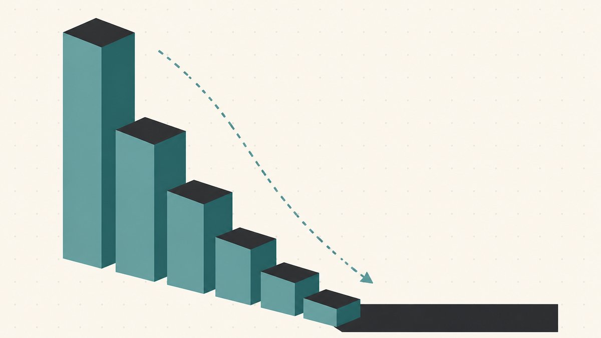

الرقم اللي كاتبه في إعلانك بيشتغل أكتر مما إنت فاكر بكتير. اتنين بيقلّبوا نطاقات ممكن يكون عندهم نفس الاسم، ويعرضوه في نفس السوق، وفي الآخر يمشي كل واحد بسعر يختلف عن التاني بمقدار خانة كاملة — مش لأن واحد فيهم فاوض بشراسة أكتر، لكن لأنه فهم إن *طريقة* تقديم السعر هي اللي بتشكّل المبلغ اللي المشتري هيدفعه. تسعير النطاق جزء منه حساب، وأغلبه سيكولوجية.

الدليل ده هو الطبقة النفسية اللي تحت الاختيارات الميكانيكية في [إزاي تبيع النطاقات وتكسب منها](/ar/blog/how-to-sell-domains-for-profit/)، وهو ركيزة البيع في سلسلة [تقليب النطاقات](/ar/blog/domain-flipping/) بتاعتنا. هنغطّي إيه اللي بيعمله التثبيت في التفاوض، وليه إنك تقول الرقم الأول دي فخ بيشتغل في الاتجاهين، وإزاي تدرّج السعر بدل ما تنهار، وإزاي اشتري الآن مقابل تقديم عرض بيحددوا النتيجة بهدوء قبل ما تتبعت ولا رسالة واحدة.

## التثبيت: أول رقم هو اللي بيكسب

نبدأ بالانحياز الإدراكي الواحد اللي بيتحكّم في كل تفاوض على سعر. تأثير التثبيت، زي ما ويكيبيديا بتعرّفه، هو [ظاهرة نفسية بتتأثر فيها أحكام الفرد أو قراراته بنقطة مرجعية أو "مرساة"](https://en.wikipedia.org/wiki/Anchoring_effect#:~:text=a%20psychological%20phenomenon%20in%20which%20an%20individual%27s%20judgments%20or%20decisions%20are%20influenced%20by%20a%20reference%20point)، والنقطة المرجعية دي ممكن تكون شبه عشوائية تماماً. أول ما يبقى في رقم على الطاولة، أي رقم بييجي بعده بيتقاس عليه. المشتري اللي سمع "25,000 دولار" الأول هيشوف إن 12,000 دولار ده مكسب؛ والمشتري اللي سمع "3,000 دولار" الأول هيشوف إن 4,500 دولار ده مبالغة. نفس الاسم، نفس المشتري، مرساة مختلفة، وسقف مختلف.

ده مش كلام فولكلور. زي ما نفس المقال بيوضّح، [العروض الأولية بيكون ليها تأثير أقوى على نتيجة التفاوض من العروض المضادة اللي بتيجي بعدها](https://en.wikipedia.org/wiki/Anchoring_effect#:~:text=initial%20offers%20have%20a%20stronger%20influence%20on%20the%20outcome%20of%20negotiations%20than%20subsequent%20counteroffers). أي حد بيحطّ المرساة بيلوي الكلام ناحيتها. بالنسبة للبايع، النتيجة الواحدة دي بتفسّر أغلب التكتيكات اللي تحت: السعر مش مجرد معلومة، ده بئر الجاذبية اللي بيقع فيه التفاوض كله.

## فخ الرقم الأول: لما تقول سعرك

طب مين المفروض يقول الرقم الأول؟ الإجابة الصريحة إن المسألة بتقطع في الاتجاهين، والشد ده هو اللعبة كلها.

قول سعر واطي أوي وتبقى ثبّتّ المرساة *ضد نفسك*. مش هتقدر تشيل اللي قلته: المشتري دلوقتي عرف إن الحد الأدنى بتاعك كان تحت ميزانيته، ومفيش "في ناس تانية مهتمة" هترجّع الموقف. في ناس كتير بتقلّب نطاقات سعّروا اسم بـ 1,500 دولار كان [المستخدم النهائي](/ar/glossary/end-user/) هيدفع فيه 15,000 دولار بكل سرور، لأنهم سعّروه زي مستثمر زميل بيشتري بضاعة في سوق [تداول النطاقات](/ar/glossary/domain-trading/)، مش زي شركة بتشتري أداة شغل. الفرق بين [الموزّع](/ar/glossary/reseller/) والمستخدم النهائي هو أغلى حاجة ممكن تغلط في تقديرها، وبنفكّكها في [إزاي تقيّم اسم نطاق](/ar/blog/how-to-value-a-domain-name/) و[مبيعات النطاقات الواردة مقابل الصادرة](/ar/blog/inbound-vs-outbound-domain-sales/).

قول سعر عالي أوي على *المشتري ده بالذات* وممكن تخوّف حد كان هيقدّم عرض حقيقي. المرساة الغلط ممكن تنهي الكلام قبل ما يبدأ.

في اختيار تالت المحترفين بيعتمدوا عليه: متقولش الرقم الأول. سؤال بسيط زي "إنت في بالك نطاق سعر كام؟" بيقلب الديناميكية فيبقى رقمه هو النقطة المرجعية، وتفاوض إنت طالع منه بدل ما تكون نازل من رقمك. ده الميزة اللي السمسار بيبيعها: مسافة تفاوض، علشان المشتري عمره ما يعرف إنت عايز البيعة أد إيه. وبنغطّي إمتى ده يستاهل عمولة في [الشغل مع سماسرة النطاقات](/ar/blog/working-with-domain-brokers/).

اللخبطة إن "خليه يقول الأول" بتشتغل بس لما المشتري ييجي وعنده نية حقيقية. في إيميل صادر بارد، السكوت معناه مفيش سعر، ومفيش سعر معناه مفيش بيعة. فلما المشتري يكون وارد ومتحمّس، سيبه يثبّت المرساة؛ لكن لما إنت اللي بتروح له، حطّ رقم معقول على الطاولة علشان تجيب رد من الأساس.

## ليه البايعين بيغالوا في السعر: تأثير التملّك

قبل التكتيكات، تحذير بخصوص دماغك إنت. اللي بيتاجروا في النطاقات بيغالوا بشكل منهجي في قيمة الأسماء اللي عندهم، وفي مصطلح للموضوع ده. تأثير التملّك هو الاكتشاف إن [الناس بتميل أكتر إنها تحتفظ بحاجة بتملكها أكتر من إنها تشتري نفس الحاجة دي وهي مش بتملكها](https://en.wikipedia.org/wiki/Endowment_effect#:~:text=people%20are%20more%20likely%20to%20retain%20an%20object%20they%20own): الملكية في حد ذاتها بتنفخ القيمة في عينيك. إنت اشتريت الاسم لأنك شُفت فيه حاجة، ونفس الاقتناع ده بقى دلوقتي ضريبة على حُكمك.

علشان كده إعلانات "تقديم عرض" المليانة بـ "اسم تجاري عظيم!!!" بتفضل سنين من غير ما تتباع: السعر المطلوب متثبّت على تعلّق البايع، مش على استعداد أي مشتري للدفع. الدفاع إنك تسعّر مقارنة بـ [المبيعات المشابهة](/ar/glossary/comparable-sales/) ومدى مباشرة حالة استخدام المشتري، مش مقارنة بإحساسك إنك كنت شاطر يوم ما سجّلت الاسم. الاسم بيسوى اللي المشتري هيدفعه، والمشتري عمره ما اتعرّف على مشاعرك.

## اشتري الآن مقابل تقديم عرض: الصيغة نفسها استراتيجية

صيغة الإعلان مش مجرد خانة تعلّم عليها. دي قرار بخصوص إنت بتصطاد أنهي مشتري، وعلى أنهي انحياز بتعتمد.

**[اشتري الآن](/ar/glossary/buy-it-now/) (سعر ثابت)** بيشيل الاحتكاك. المشتري المتحمّس بيتعامل في لحظة، من غير رايح جاي، وبيفلتر اللي بيتفرّجوا وبس واللي مبيردّوش غير لما يشمّوا ريحة تفاوض. التكلفة هي السقف: سعّر اسم بـ 2,000 دولار وكان المستخدم النهائي هيدفع فيه 20,000 دولار، والرقم الثابت ده هو أقصى حاجة هتشوفها في حياتك. "اشتري الآن" لعبة سرعة، كويسة للأسماء المتوسطة اللي فيها بيعة نضيفة وفورية أحسن من رحلة طويلة في البحث عن المشتري المثالي.

**[تقديم عرض](/ar/glossary/make-offer/) (تفاوض)** بيدعو المشتري إنه يكشف نيّته وبيخلّيك تقبض سعر مستخدم نهائي ما كنتش هتتخيّله أبداً. دي الصيغة الصح لاسم بريميوم بجد ومعاه مشتري أو اتنين واضحين، حيث المكسب المحتمل بيبرّر الاحتكاك. التكلفة حقيقية: "تقديم عرض" بيجذب اللي بيقدّموا عروض واطية، وبيعطّل البيعات على مدى أيام من الرسايل، وبيطلب منك إنك تفاوض فعلاً.

وهنا الجزء اللي أغلب المقالات بتفوّته: الصيغة نفسها بتثبّت المشتري قبل ما تقول كلمة. سعر "اشتري الآن" العالي بيثبّت المرساة عالي حتى للمشتري اللي ناوي يفاصل وينزّل — هو بيبدأ من رقمك إنت، مش من الصفر. أما "تقديم عرض" مجرّد من غير سعر بيثبّت المرساة *واطي*، لأن غريزة المشتري إنه يجرّبك بكسر صغير من اللي كان هيدفعه فعلاً. لو اخترت "تقديم عرض"، فكّر تكتب "أقل عرض مقبول" أو حد أدنى عالي؛ غياب أي رقم هو في حد ذاته مرساة، وغالباً بتشتغل ضدك. بالنسبة للأماكن اللي كل صيغة بتعيش فيها، شوف [فين تبيع النطاقات: مقارنة الأسواق](/ar/blog/where-to-sell-domains-marketplaces-compared/)، ولخطوة بخطوة لبيعة واحدة، شوف [إزاي تبيع اسم نطاق إنت بتملكه](/ar/blog/how-to-sell-a-domain-name-you-own/).

## تدريج السعر: متنهارش لأول عرض مضاد

أول ما تفاوض "تقديم عرض" يفتح، غلطة المبتدئ إنه يقفز على طول لحدّه الأدنى الحقيقي أول ما المشتري يضغط. ده بيسلّمه الفرق كله وبيعلّمه إن الضغط بيجيب نتيجة. البايعين المخضرمين بيدرّجوا بدل كده، بينزلوا في خطوات بتصغّر بتقول إن الأرضية قرّبت.

السلّم ممكن يبقى شكله كده. المشتري بيقدّم 2,000 دولار على اسم إنت مثبّت مرساته على 12,000 دولار. إنت تنزل لـ 9,500 دولار، بعدين 8,000 دولار، وبعدين تستقر عند 7,000 دولار، كل خطوة أصغر من اللي قبلها، وده بيقول من غير ما تقول إن مفيش مساحة كتير فاضلة. لو نزلت من 12,000 دولار لـ 6,500 دولار في حركة واحدة، تبقى قلت للمشتري إن الـ "12,000 دولار" بتاعتك كانت تمثيل وإن الرقم الحقيقي أقل كمان، فهيفضل يحفر.

في رافعتين سيكولوجيتين راكبين فوق السلّم. المشتري اللي بيطلّع خصم بيحسّ إنه كسب، والإحساس ده غالباً هو اللي بيقفل البيعة. والصبر بيتقري كقوة: رد بياخد يوم بيقول "عندي اهتمام تاني وأنا مش مستعجل". ارمي خصم في تسعين ثانية وتبقى بتذيع العكس.

## الأرقام المدوّرة، والتسعير الجذّاب، وإيه اللي الرقم بيقوله

شكل الرقم بيبعت رسالة لوحده. ده مجال التسعير النفسي، اللي ويكيبيديا بتوصفه كاستراتيجية [مبنية على نظرية إن أسعار معيّنة ليها تأثير نفسي](https://en.wikipedia.org/wiki/Psychological_pricing#:~:text=based%20on%20the%20theory%20that%20certain%20prices%20have%20a%20psychological%20impact). الاكتشاف الكلاسيكي إن المشترين بيشوفوا [الأسعار اللي تحت رقم مدوّر بشوية (واللي بتتسمّى كمان "الأسعار الفردية") على إنها أقل مما هي عليه فعلاً](https://en.wikipedia.org/wiki/Psychological_pricing#:~:text=just%2Dbelow%20prices%20%28also%20referred%20to%20as%20%22odd%20prices%22%29%20as%20being%20lower%20than%20they%20are) — وده السبب إن التجزئة بتمشي على 9.99 دولار، مدفوعة باللي سمّاه الباحثين [تأثير الرقم الأيسر](https://en.wikipedia.org/wiki/Psychological_pricing#:~:text=left%2Ddigit%20effect).

بالنسبة للنطاقات، الدرس أعقد من "خلّيه ينتهي بـ 9 على طول". شكل الرقم بيشير لمين إنت فاكر إن المشتري:

- رقم مدوّر ونضيف (25,000 دولار، 50,000 دولار) بيتقري كسعر مطلوب واثق وبريميوم موجّه لمستخدم نهائي جاد. بيقول "ده أصل حقيقي، ومسعّر زي ما الأصل المفروض يتسعّر".
- رقم دقيق بشكل غريب (24,750 دولار) ممكن يتقري كتقييم محسوب، أو على اسم أرخص، كإشارة خصم. لو استخدمته كويس، الدقة بتوحي إنك عملت الحسبة؛ لو استخدمته بإهمال، بيبان زي رفّ التخفيضات.
- رقم واطي أوي ومسعّر تسعير جذّاب (299 دولار، 499 دولار) بيشير لاسم اقتصادي وبيدعو المشترين أصحاب الميزانيات الصغيرة. كويس للسرعة، غلط لاسم إنت مصدّق إن شركة كبيرة هتعوزه.

الامتداد بيدخل في الحسبة كمان: نفس الكلمة على [`.com`](/ar/tld/com/) بتحمل سقف مختلف عن [`.io`](/ar/tld/io/) أو [`.co`](/ar/tld/co/)، فطابق الشكل مع الاسم والمشتري. السعر البريميوم المدوّر بيفلتر للمستخدمين النهائيين؛ والسعر الجذّاب بيفلتر للباحثين عن الصفقات والموزّعين الزملا في [السوق](/ar/glossary/marketplace/). التطابق الغلط بهدوء بيطفّش المشتري اللي إنت عايزه فعلاً.

## نجمّع كل ده مع بعض

تسعير النطاق قرار واحد بيتعمل مرتين: مرة لما تختار صيغة العرض، ومرة على كل رقم بتقوله جواها. اختار "اشتري الآن" لما السرعة والسقف النضيف يبقوا أحسن من رحلة البحث عن المشتري المثالي؛ واختار "تقديم عرض" لما مكسب اسم بريميوم يبرّر الاحتكاك، وحطّ تحته حد أدنى علشان "مفيش رقم" ما يثبّتكش ناحية تحت. سيب المشترين الواردين المتحمّسين يقولوا الرقم الأول. درّج تنازلاتك علشان كل خطوة تقول "قرّبنا". شكّل الرقم علشان يشير للمشتري اللي إنت عايزه. وراقب تأثير التملّك بتاعك إنت زي ما تراقب أي مسؤولية.

السعر رسالة. اتأكد إنها بتقول اللي إنت قاصده. أول ما البيعة تقفل، إنك تقبض بأمان — [الضمان](/ar/glossary/escrow/)، وتسليم [رمز التفويض](/ar/glossary/auth-code/)، واستمرارية [DNS](/ar/glossary/dns/) — ده فن بحاله؛ والقضبان المرمّزة زي [Namefi](https://namefi.io) هدفها إنها تخلّي التسوية أقل توتر علشان عدد أكبر من الصفقات المتفق عليها يخلّص. لكن الفلوس مبتوصلش للنقطة دي غير لو الرقم اللي في الإعلان عمل شغله الأول.

## إخلاء مسؤولية ودّي (اقرأني!)

> إحنا مش محامين، ولا محاسبين، ولا مستشارين ماليين، ولا دكاترة، و**مفيش حاجة في المقال ده تعتبر استشارة قانونية، أو مالية، أو ضريبية، أو محاسبية، أو طبية، أو أي نوع تاني من الاستشارات المهنية.** بنكتب البوستات دي علشان نعلّم نفسنا وكتسهيل لعملائنا. المعلومات هنا ممكن تكون قديمة، أو خاصة بمنطقة معيّنة، أو غلط ببساطة. إحنا كمان بنغلط.
>
> لأي قرار مهم، **من فضلك استشير محترف حقيقي (بجد!)**. أو لو ده مش على مزاجك، اسأل صاحبك، اسأل تويتر، اسأل ريديت، اسأل ذكاء اصطناعي، أو اسأل عرّاف. باختصار: **اعمل بحثك بنفسك — DOYR (Do Your Own Research)**. خلّينا نتعلّم ونبسط.

## مصادر وقراءة إضافية

- ويكيبيديا — [تأثير التثبيت](https://en.wikipedia.org/wiki/Anchoring_effect#:~:text=a%20psychological%20phenomenon%20in%20which%20an%20individual%27s%20judgments%20or%20decisions%20are%20influenced%20by%20a%20reference%20point) (التعريف؛ العروض الأولية بتفوق العروض المضادة اللي بعدها)
- ويكيبيديا — [تأثير التملّك](https://en.wikipedia.org/wiki/Endowment_effect#:~:text=people%20are%20more%20likely%20to%20retain%20an%20object%20they%20own) (الملكية بتنفخ القيمة في عين صاحبها)
- ويكيبيديا — [التسعير النفسي](https://en.wikipedia.org/wiki/Psychological_pricing#:~:text=based%20on%20the%20theory%20that%20certain%20prices%20have%20a%20psychological%20impact) (التسعير الجذّاب، الأسعار اللي تحت رقم مدوّر بشوية، تأثير الرقم الأيسر)
