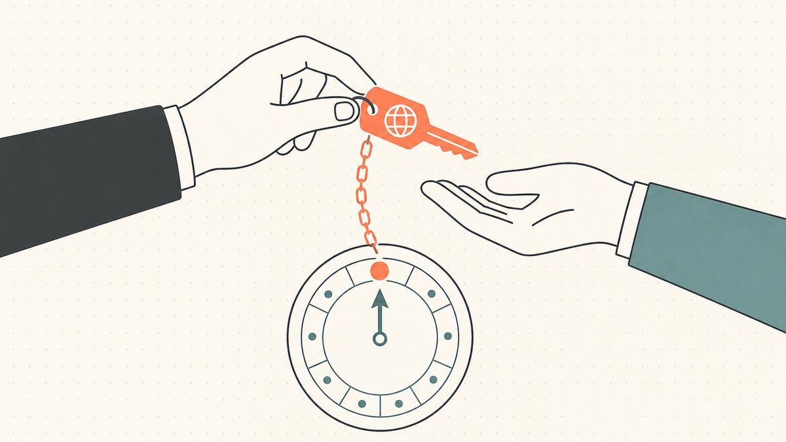
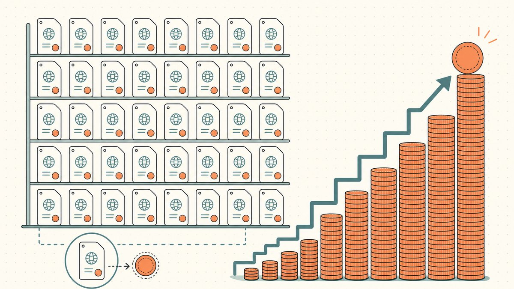
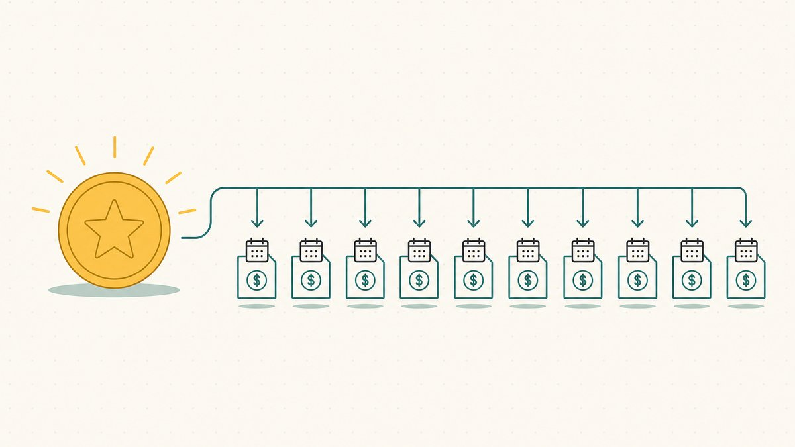

كل دومين بتحتفظ بيه بيبعتلك فاتورة مرة في السنة. الحقيقة دي لوحدها هي الجاذبية اللي كل مستثمر دومينات عايش تحتها، وهي الجزء اللي قصص النجاح بتسيبه برّه. بيعة بخمسة أرقام بتعمل عنوان حلو. أما الميتين اسم اللي ما اتباعوش، وكل واحد فيهم بيسحب رسم تجديد كل اتناشر شهر في صمت، دول عمرهم ما بيدخلوا الحكاية.

المقال ده عن النص الهادي ده من الدفتر. هنمشي على الرقمين اللي بيقرروا فعلاً هل [محفظة النطاقات](/ar/glossary/domain-portfolio/) هتكسب فلوس ولا لأ: تكلفة إنك *تشيل* الأسماء سنة ورا سنة، وكام واحد منهم تقدر بشكل واقعي تتوقع إنك *تبيعه*. كن صريح مع نفسك في الاتنين، وكل البيزنس هيبطّل يبان زي اللوتاري ويبدأ يبان على حقيقته — عملية مخزون لها تكلفة احتفاظ ثابتة وعدد صغير من المكاسب الضخمة. دي الحسابات اللي ورا [تقليب الدومينات](/ar/blog/domain-flipping/)، وهي الأساس اللي بتقوم عليه [إدارة محفظة النطاقات](/ar/blog/domain-portfolio-management/).

## إنت مش بتمتلك الدومين، إنت بتأجّره

ابدأ بالحاجة اللي بتخلّي [الدومينينج](/ar/glossary/domaining/) مختلف عن شراء كروت البيسبول أو اللوحات الفنية: إنت عمرك ما بتمتلك الدومين ملكية كاملة. إنت بتحتفظ بيه لمدة تسجيل معينة، وبتفضل محتفظ بيه طول ما إنت بتدفع علشان تجدّد. تفوّت التجديد، والاسم يخرج من سيطرتك على جدول زمني ثابت.

المدة ليها سقف. حسب ويكيبيديا، [أقصى مدة تسجيل لاسم نطاق من نوع gTLD هي 10 سنين](https://en.wikipedia.org/wiki/Domain_name_registrar#:~:text=The%20maximum%20period%20of%20registration%20for%20a%20gTLD%20domain%20name%20is%2010%20years)، يعني حتى لو دفعت لأبعد مدى يسمح بيه النظام، الساعة بتبدأ من الأول مرة كل عشر سنين على الأقل. أغلب المستثمرين بيجدّدوا سنوياً، يعني الفاتورة بتيجي كل سنة على كل اسم. وشغلانة إنك تقرر أنهي أسماء تستاهل سنة كمان هي المهمة اللي في قلب [امتى تسيب دومين](/ar/blog/when-to-drop-a-domain/) — ومبتقفش أبداً.

والتجديد مش إجراء شكلي كمان. سيبه يفوت، والاسم مش هيختفي في الحال، لكنه بيبدأ عدّ تنازلي إنت مش متحكم فيه. بعد انتهاء الصلاحية، الاسم عادةً بيدخل في فترة استرداد — اللي، زي ما أدبيات لقط الدومينات الساقطة بتقول، [بتختلف حسب الـ TLD، وعادةً بتكون حوالي 30 لـ 90 يوم](https://en.wikipedia.org/wiki/Domain_drop_catching#:~:text=usually%20around%2030%20to%2090%20days) وبتسمحلك تسترجعه برسم تقيل — وبعدها مرحلة أخيرة قصيرة قبل الإفراج عنه: [في آخر مرحلة "الحذف المعلّق" اللي مدتها 5 أيام، الدومين بيتشال من قاعدة بيانات ICANN](https://en.wikipedia.org/wiki/Domain_drop_catching#:~:text=the%20domain%20will%20be%20dropped%20from%20the%20ICANN%20database). وأول ما يسقط، أي حد يقدر يسجّله. الاسم اللي نسيت تجدّده ممكن يبقى اسم منافسك بيلقطه في [مزاد السقوط](/ar/glossary/auction/) في نفس الأسبوع.

## التجديد بيكلّف كام فعلاً

تجديد `.com` واحد بيبان تافه. ويكيبيديا بتحط نطاق سعر التجزئة بصراحة: من سنة 2023، [تكلفة التجزئة عموماً بتتراوح من حد أدنى حوالي 9.70 دولار في السنة لحوالي 35 دولار في السنة](https://en.wikipedia.org/wiki/Domain_name_registrar#:~:text=the%20retail%20cost%20generally%20ranges%20from%20a%20low%20of%20about%20%249.70%20per%20year) لتسجيل `.com` بسيط. عشر دولارات. حاجة تتنسى على اسم واحد.

بس مش حاجة تتنسى على تلاتميت اسم. نفس فاتورة العشر دولارات دي، مضروبة على محفظة حقيقية، بتبقى أكبر بند مفرد في العملية كلها — الرقم اللي كل مستثمر دومينات جاد بينظّم السنة كلها حواليه. دفتر فيه 300 اسم `.com` شغال قريّب من قاع النطاق ده بيطلع حوالي 3,000 دولار في السنة تجديدات بس، وده قبل ما تكون صرفت دولار واحد علشان تشتري أي حاجة جديدة. التكلفة بتزيد خطّياً مع عدد الأسماء اللي بتحتفظ بيها، ومش بتزيد ولا حبة مع عدد الأسماء الكويسة فيهم. عبء التجديد مبيهمّوش الاسم ده بيعة بخمسة أرقام في المستقبل ولا غلطة إملائية كان لازم تسيبها من سنتين.

في قوّتين بيدفعوا الرقم ده لفوق مع الوقت، والاتنين شغالين ضدك. الأولى، سعر الجملة اللي تحت سعر التجزئة بتاعك بيفضل طالع. لما Verisign أعلنت زيادة 2024، [السجل](/ar/glossary/registry/) [بياخد دلوقتي من المُسجِّلين 9.59 دولار في السنة لتسجيلات .com. وده هيزيد لـ 10.26](https://domainnamewire.com/2024/02/08/verisign-announces-com-price-hike-to-10-26/#:~:text=charges%20registrars%20%249.59%20per%20year%20for%20.com%20registrations.%20That%20will%20increase%20to%20%2410.26)، وبموجب عقد السجل، Verisign [مسموحلها تزوّد الأسعار بنسبة 7% في كل سنة من آخر أربع سنين](https://domainnamewire.com/2024/02/08/verisign-announces-com-price-hike-to-10-26/#:~:text=is%20allowed%20to%20increase%20prices%20by%207%25%20in%20each%20of%20the%20last%20four%20years) من مدة العقد. زيادة 7% مركّبة معناها إن القاع اللي تحت فاتورة التجديد بتاعتك بيطلع لفوق، سواء أي من أسماءك زادت قيمتها ولا لأ. التانية، الفاتورة بتكبر كل ما تشتري أسرع من ما تبيع — وأغلب المستثمرين بيشتروا أسرع من ما يبيعوا، علشان الشراء هو الجزء الممتع.

اختيار الامتداد بيغيّر الصورة كمان. قاع الـ `.com` التقليدي حاجة؛ والامتداد الفاخر زي [`.io`](/ar/blog/why-are-io-domains-expensive/) أو [`.ai`](/ar/tld/ai/) غالباً بيتجدّد بأضعاف ده، في حين إن الـ [`.xyz`](/ar/tld/xyz/) الرخيص ممكن يتجدّد بسعر رخيص بس نادراً ما يتباع تاني. المحفظة اللي امتداداتها غالية في التجديد محتاجة معدل بيع أعلى بنفس النسبة عشان توصل لنقطة التعادل بس. والـ [مُسجِّل](/ar/glossary/registrar/) اللي بتختاره بيفرق هو كمان على الحافة، علشان أسعار التجديد هي المكان اللي المُسجِّلين بيختلفوا فيه في صمت أكتر من غيره.

## معدل البيع الفعلي: الرقم اللي محدش يقدر يثبته

أهو النص التاني من الحسابات، والجزء الصادق. مقابل تكلفة التجديد الثابتة دي إنت بتحط **[معدل البيع الفعلي](/ar/glossary/sell-through-rate/)** بتاعك — نسبة المحفظة اللي بتتباع فعلاً في سنة معينة. ده المقياس اللي بيقرر كل حاجة، وهو كمان اللي مالوش مصدر موثوق.

اعتبر أي رقم محدد بتشوفه تقدير، مش إحصائية متقاسة. القاعدة التقريبية المتكررة كتير لمحفظة مسجّلة يدوياً هي معدل بيع فعلي في خانة الآحاد المنخفضة في السنة — غالباً بيتقال حوالي 1% لـ 2%. إحنا بنوضّح إن دي قاعدة تقريبية بين المجتمع، مش حقيقة بمصدر: مفيش سجل محايد بينشر معدل البيع الفعلي للمحافظ عبر كل مستثمري الدومينات، والرقم بيتأرجح بجنون حسب جودة الأسماء والقناة اللي معروضة عليها، والناس اللي بيقولوه عادةً بينقلوه عن بعض. أي حد بيدّيك نسبة بيع فعلي دقيقة كإنها كلام منزّل، فهو بيبيعلك ثقة هو نفسه مش عنده.

اللي *تقدر* تثق فيه هو شكل الرقم، اللي كل الناس في البيزنس متفقين عليه. معدل البيع الفعلي للأسماء المضاربية المسجّلة يدوياً **منخفض** — جزء صغير من المحفظة بيتحرك في أي سنة، والباقي بيقعد ويتجدّد. المعدل المنخفض ده بنيوي، مش علامة إنك بتعمل حاجة غلط. ده نتيجة مباشرة لطريقة شغل [السوق الثانوي](/ar/glossary/aftermarket/): أغلب الأسماء بتعجب مجموعة صغيرة جداً من المشترين، وفي أي سنة معينة أغلب المشترين دول مش بيتسوّقوا. الاسم ممكن يكون كويس فعلاً ومع ذلك ما يتباعش لسنين، ببساطة علشان الشركة الواحدة اللي محتاجاه لسه ما عملتش اجتماع التسمية بتاعها.

الحل مش إنك تجري ورا نسبة أعلى وإنت بتعرض زبالة. الحل إنك تعرف رقمك إنت. تابع كام اسم بعته فعلاً السنة اللي فاتت مقابل كام احتفظت بيه، وعندها يبقى معندك معدل بيع فعلي حقيقي للمحفظة *بتاعتك* ومصادر التوريد *بتاعتك* — قيمته أكبر من أي متوسط في الصناعة. المتابعة دي هي الانضباط اللي في قلب [إدارة المحفظة](/ar/blog/domain-portfolio-management/)، وهي المُدخَل اللي كل قرار تاني بيعتمد عليه.

## بيعة واحدة بتموّل تجديدات كتير

حط الرقمين مع بعض، وكل الاقتصاديات بتتلخّص في جملة واحدة مستثمري الدومينات المخضرمين بيرددوها زي اللازمة: **بيعة واحدة بتموّل تجديدات كتير.**

الحسبة قاسية بس بسيطة. لو محفظتك بتبيع 1% لـ 2% من أسماءها في السنة، إنت بتدفع تجديدات على 98% لـ 99% من دفتر ما طلّعش أي إيراد. الموديل بيعيش بس علشان *سعر* البيعة بعيد بجنون عن تكلفة التجديد. اسم واحد بيتباع تاني بـ 2,000 دولار بيغطّي التجديد السنوي لحوالي ميتين `.com` عند الحد الأدنى من نطاق التجزئة ده. بيعة واحدة بأربع أو خمس أرقام ممكن تشيل محفظة كبيرة لسنة أو أكتر — وده بالظبط ليه التجارة دي شغّالة من الأساس.

علشان كده الدومينينج لعبة محفظة، ومش رهان على اسم واحد أبداً. إنت مش بتحاول تكسب على كل اسم؛ إنت بتحاول تتأكد إن المكاسب النادرة كبيرة بما يكفي، ومتكررة بما يكفي، عشان تسبق عبء التجديد على كل حاجة ما بتتباعش. ضعها كنقطة تعادل والاختبار يبقى ملموس: إيراد مبيعاتك السنوي المتوقع لازم يعدّي فاتورة تجديدك السنوية كلها وفيه فاضل، وإلا ما يبقاش عندك استثمار — يبقى عندك اشتراك بتفضل تدفعه مقابل شرف إنك تتمنى.

التأطير ده بيشرح كمان ليه التسعير والبيع بيفرقوا أكتر من الشراء. المحفظة اللي معدل بيعها الفعلي متوسط بس تسعيرها منضبط — أسماء، لما تتباع، بتتباع بفلوس حقيقية — بتكسب على محفظة معدل إصابتها عالي في مبيعات قليلة القيمة. الرافعة في حجم المكاسب، وعلشان كده حرفة البيع في [كيفية بيع اسم نطاق تمتلكه](/ar/blog/how-to-sell-a-domain-name-you-own/) بتقعد في طرف الإيرادات من العملية كلها.

## شغّل الحسابات زي البيزنس

لو بتعامل الدومينينج كبيزنس مش كهواية، فيه تلات عادات بتخلّي الحسابات صادقة.

**اعرف أساس التكلفة و[تكلفة الاحتفاظ](/ar/glossary/holding-cost/) لكل اسم.** أساس التكلفة هو اللي دفعته عشان تشتري؛ تكلفة الاحتفاظ هي كل تجديد دفعته من ساعتها. الاسم اللي جدّدته لست سنين تكلفته الحقيقية أعلى بكتير من سعر التذكرة، وتكلفة الاحتفاظ المتراكمة دي هي اللي المفروض تحرّك قرار الاحتفاظ-أو-السيبان. ومتابعتها هي كمان اللي بتخلّي موسم الضرايب قابل للتعامل — شوف [الضرايب والمحاسبة لمستثمري الدومينات](/ar/blog/taxes-and-accounting-for-domain-investors/) عشان تعرف ليه أساس التكلفة ومدة الاحتفاظ هما الرقمين اللي محاسبك هيطلبهم منك الأول.

**قلّم بلا رحمة وعلى جدول.** أكبر حركة برافعة عالية ضد عبء التجديد هي إنك تسيب الأسماء اللي عمرها ما هتتباع، *قبل* ما التجديد ييجي، مش بعده. كل اسم بتسيبه هو تجديد مش هتدفعه للأبد. الغريزة إنك تحتفظ "سنة كمان بس" تحسّباً إن الاسم يتحرك أخيراً هي بالظبط إزاي محفظة بتتحوّل لبير فلوس. [امتى تسيب دومين](/ar/blog/when-to-drop-a-domain/) هو الانضباط اللي بيحمي مكاسبك من إنها تتدعّم في الخسارة بسبب مخزونك الميت.

**عوّض جزء من العبء لما تقدر، بس متعتمدش عليه.** بعض المستثمرين بيركنوا الأسماء اللي ما اتباعتش عشان يسترجعوا شوية من تكلفة التجديد. زي ما أدبيات الدومينينج بتقول، المُسجِّلين [بيسمحوا إن الدومينات الغير مستخدمة تتركن مع حصول صاحب التسجيل على نصيب من إيراد الـ PPC](https://en.wikipedia.org/wiki/Domain_name_speculation#:~:text=allow%20unused%20domains%20to%20be%20parked%20with%20the%20registrant%20receiving%20a%20share%20of%20the%20PPC%20revenue) المكتسب. بالنسبة للاسم العلامة-التجارية النموذجي اللي مالوش [حركة كتابة مباشرة](/ar/glossary/type-in-traffic/)، إيراد الركن فلوس خطأ تقريب ومش هيحرّك نقطة تعادلك — بس على الأسماء اللي فعلاً بتجيب حركة ممكن يغطّي شريحة من فاتورة التجديد في صمت. اعتبره تعويض صغير، مش استراتيجية.

اعمل التلاتة، وفاتورة التجديد بتبطّل تبقى رعب غامض وتبقى رقم مُدار تقدر تتنبأ بيه مقابل المبيعات المتوقعة. التنبؤ ده هو الفرق بين الاستثمار والاكتناز.

## فين الميكانيكا بتقابل الحسابات

الاقتصاديات اللي فوق بتقرر *هل* تحتفظ بالاسم. والنص التاني من كل عملية تقليب هو ميكانيكا نقله لما البيعة تيجي أخيراً — وده المكان اللي البيعة اللي اتعبت عشانها ممكن لسه تفلت منه. التحويلات عالية القيمة بتحمل المواجهة الكلاسيكية: البايع مش هيسلّم الاسم قبل الدفع، والمشتري مش هيدفع قبل التسليم، وده السبب الكامل في وجود [الضمان (Escrow)](/ar/glossary/escrow/). إحنا بنمشي على الـ workflow ده في [شرح الضمان في بيع الدومينات](/ar/blog/domain-escrow-explained/).

[Namefi](https://namefi.io) بتقلّل الاحتكاك ده عند خطوة التسوية. ملكية [مرمّزة](/ar/glossary/tokenize/) بتخلّي السيطرة على دومين [ICANN](/ar/glossary/icann/) حقيقي أسهل في التحقق والنقل، مع استمرارية [DNS](/ar/glossary/dns/) عشان الاسم الشغّال يفضل بيتحلّ خلال عملية التسليم. بالنسبة للحسابات في المقال ده، احتكاك تسوية أقل معناه إن البيعة النادرة اللي المفروض تموّل سنة من التجديدات بقت أكتر احتمالاً إنها تتقفل فعلاً — والبيعة اللي بتتقفل نضيف هي النوع الوحيد اللي بيدفع الفاتورة.

## إخلاء مسؤولية ودّي (اقرأني!)

> إحنا مش محامين، ولا محاسبين، ولا مستشارين ماليين، ولا دكاترة، و**مفيش أي حاجة في المقال ده تعتبر نصيحة قانونية أو مالية أو ضريبية أو محاسبية أو طبية أو أي نوع تاني من النصايح المهنية.** إحنا بنكتب البوستات دي عشان نتعلّم بنفسنا وكنوع من التيسير على عملائنا. المعلومات هنا ممكن تكون قديمة، أو خاصة بمنطقة جغرافية معينة، أو غلط ببساطة. إحنا بنغلط برضه.

> لأي قرار مهم، **من فضلك استشير محترف حقيقي (بجد!)**. أو لو ده مش على مزاجك، اسأل صاحبك، اسأل تويتر، اسأل ريديت، اسأل ذكاء اصطناعي، أو اسأل عرّافة. باختصار: **DOYR - اعمل بحثك بنفسك**. خلّينا نتعلم ونستمتع.

## مصادر وقراءات إضافية

- ويكيبيديا — [مُسجِّل أسماء النطاقات (أقصى مدة 10 سنين لـ gTLD؛ أسعار تجزئة تجديد `.com`)](https://en.wikipedia.org/wiki/Domain_name_registrar#:~:text=The%20maximum%20period%20of%20registration%20for%20a%20gTLD%20domain%20name%20is%2010%20years)
- ويكيبيديا — [لقط الدومينات الساقطة (فترة استرداد ~30–90 يوم؛ مرحلة حذف معلّق 5 أيام)](https://en.wikipedia.org/wiki/Domain_drop_catching#:~:text=usually%20around%2030%20to%2090%20days)
- Domain Name Wire — [زيادة سعر جملة `.com` من Verisign لـ 10.26 دولار (سقف زيادة سنوي 7% بموجب عقد السجل)](https://domainnamewire.com/2024/02/08/verisign-announces-com-price-hike-to-10-26/#:~:text=charges%20registrars%20%249.59%20per%20year%20for%20.com%20registrations.%20That%20will%20increase%20to%20%2410.26)
- ويكيبيديا — [المضاربة في أسماء النطاقات (الركن وتقاسم إيراد الـ PPC على الدومينات الغير مستخدمة)](https://en.wikipedia.org/wiki/Domain_name_speculation#:~:text=allow%20unused%20domains%20to%20be%20parked%20with%20the%20registrant%20receiving%20a%20share%20of%20the%20PPC%20revenue)
