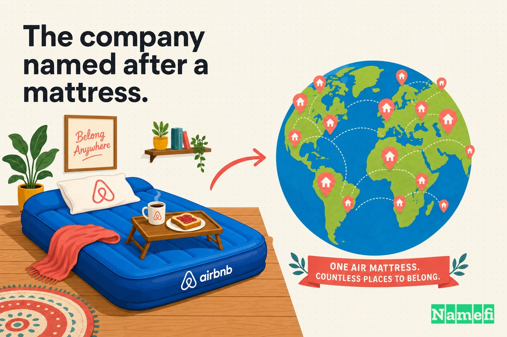
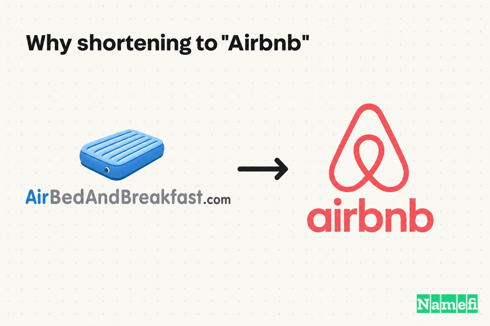
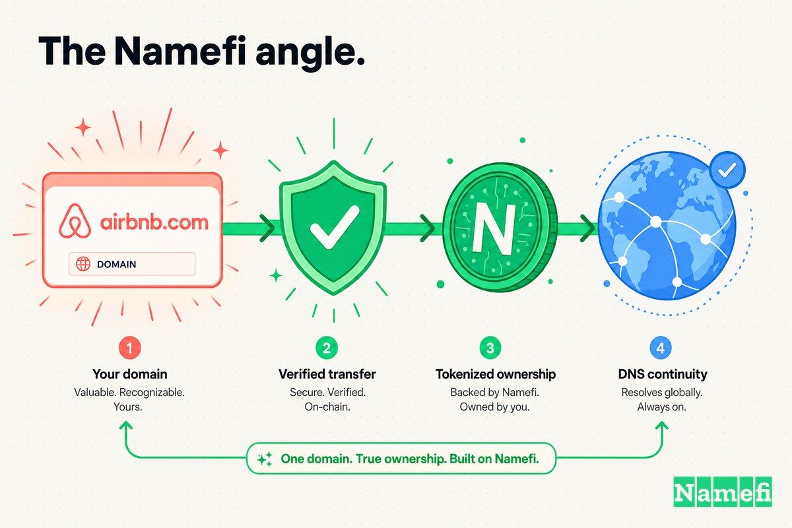

قبل ما Airbnb تبقى فعل في القاموس، وشركة مدرجة في البورصة، وجزء أساسي من طريقة السفر في العالم كله — كانت مجرد فكرة حرفية جداً: **AirBed & Breakfast**، ساكنة على **AirBedAndBreakfast.com**.

الاسم كان صادق لدرجة إنه يشبه مواصفات المنتج. لما Brian Chesky انتقل لسان فرانسيسكو في أكتوبر 2007 عشان يسكن مع صاحبه من مدرسة Rhode Island للتصميم Joe Gebbia، [ما كانش معاه فلوس تكفي الإيجار](https://en.wikipedia.org/wiki/Brian_Chesky#:~:text=Chesky%20did%20not%20have%20enough%20money%20to%20pay%20his%20rent)، فالاتنين فتحوا شقتهم للغرباء وقت مؤتمر تصميم، [وقدّموا لهم مراتب هوائية للنوم وـ Pop-Tarts لفطار الصبح](https://en.wikipedia.org/wiki/Brian_Chesky#:~:text=providing%20air%20mattresses%20for%20guests%20to%20sleep%20on%20and%20Pop-Tarts%20for%20breakfast) لما الفنادق ما كانتش متاحة. كلمة "air" في الاسم مش استعارة. زي ما بتقول إحدى قصص الشركة، [كلمة "Air" في Airbedandbreakfast.com، النسخة الأصلية من Airbnb، كانت حرفية](https://producthabits.com/how-two-designers-created-airbnb-and-turned-it-into-a-30-billion-company/#:~:text=The%20%E2%80%9CAir%E2%80%9D%20part%20of%20Airbedandbreakfast.com%2C%20the%20original%20incarnation%20of%20Airbnb%2C%20was%20literal).

بالنسبة للجمهور الأول ده، AirBedAndBreakfast.com كان مثالي. بيقولك بالظبط إيه اللي بتشتريه: مرتبة رخيصة على أرض حد وصحن كورن فليكس في الصبح.

بس طموح المنتج كبر أسرع من المرتبة بفترة قصيرة. في خلال سنتين، الشركة كانت بتسهل حجوزات لأوض فاضية، وشقق كاملة، وبيوت مميزة — وكان الدومين اللي باسم السرر الهوائية وصف لشركة مش هي دي بعد كده. فبالتالي في مارس 2009، الشركة اختصرت كل حاجة في كلمة واحدة وانتقلت لـ **Airbnb.com**.

ده مش كان مجرد تنظيم للـ URL. كان شركة ناشئة شابة بتتخلص باختيارها من أكتر نسخة حرفية من اسمها عشان العلامة التجارية تقدر تعني حاجة أكبر من قصة بدايتها.

## 2007–2008: الشركة اللي اتسمّت بالمرتبة

في البداية، الحرفية كانت ميزة.

اتنين مصممين مجهولين بيطلبوا من غرباء ينوموا في أوضة استقبالهم — كانوا محتاجين اسم يشرح نفسه على طول. "AirBed & Breakfast" عمل ده بالظبط. وصّل عرض غريب وجديد — تدفع عشان تنام على الأرض عند حد — لفكرة مألوفة وموثوقة هي فندق "bed and breakfast". أول تلات ضيوف [اتحسبلهم 80 دولار في الليلة](https://producthabits.com/how-two-designers-created-airbnb-and-turned-it-into-a-30-billion-company/#:~:text=They%20charged%20their%20first%20guests%20%2480%20per%20night)، والفكرة نجحت بما يكفي إنها تبقى شركة.

Gebbia وChesky بعدين طلبوا من شخص تالت يبني موقع حقيقي للشركة [اللي كانت اتعرفت بـ Airbed & Breakfast وقتها](https://en.wikipedia.org/wiki/Brian_Chesky#:~:text=Gebbia%20and%20Chesky%20asked%20Nathan%20Blecharczyk%20to%20work%20on%20a%20new%20website%20for%20the%20company%2C%20then%20known%20as%20Airbed%20%26%20Breakfast): هو Nathan Blecharczyk، صاحب أوضة Chesky السابق، اللي [انضم كمدير تكنولوجيا ومؤسس مشارك تالت](https://en.wikipedia.org/wiki/Airbnb#:~:text=Nathan%20Blecharczyk%2C%20Chesky%27s%20former%20roommate%2C%20joined%20as%20the%20chief%20technology%20officer%20and%20the%20third%20co-founder). الموقع العام، [Airbedandbreakfast.com، اتطلق في 11 أغسطس 2008](https://en.wikipedia.org/wiki/Airbnb#:~:text=The%20site%20Airbedandbreakfast.com%20was%20launched%20on%20August%2011%2C%202008)، وسجلات الدومين بتأكد إن airbnb.com نفسه [اتسجّل في: 2008-08-05](https://www.whois.com/whois/airbnb.com#:~:text=Registered%20On%3A%202008%2D08%2D05) — يعني المؤسسين كانوا بالفعل مسكوا الاسم الأقصر بأيام قبل ما الأطول يطلع للناس.

TechCrunch غطّت الشركة اليافعة دي سنة 2008 كـ [موقع لحجز أماكن نوم مؤقتة للمسافرين](https://techcrunch.com/2008/10/09/whats-for-breakfast-at-your-house-obama-os-or-capn-mccains/#:~:text=peer%2Dto%2Dpeer%20pad%20crashing%20site%20for%20travelers). ده كان الهوية كلها في الوقت ده: أرض، مراتب هوائية، وفطار.

## مارس 2009: نشيل المرتبة من الاسم

الانطلاقات الأولى كانت صعبة. في [مؤتمر SXSW 2008، الموقع ما استقبلش غير حجزين، واحد منهم كان Chesky نفسه](https://www.hostaway.com/blog/airbnb-founders/#:~:text=the%20website%20only%20received%20two%20bookings%2C%20one%20of%20which%20was%20Chesky%20himself). الشركة فضلت تطور وتعيد الإطلاق، وبالتدريج المنتج بطل يكون عن المراتب الهوائية خالص. الناس بدأت تدرج أوض حقيقية وشقق كاملة.

التناقض ده هو اللي أجبر على التغيير. في مارس 2009، [اسم الشركة اتقصّر لـ Airbnb.com عشان يتخلصوا من اللبس حول المراتب الهوائية](https://en.wikipedia.org/wiki/Airbnb#:~:text=the%20name%20of%20the%20company%20was%20shortened%20to%20Airbnb.com%20to%20eliminate%20confusion%20over%20air%20mattresses). الاسم الحرفي بقى عبء: كان بيقول للمستضيفين والضيوف الجدد إن دي خدمة للنوم على سرر نفخ، بالظبط في الوقت اللي الشركة كانت محتاجة فيه يصدقوا إنها خدمة لحجز أي نوع من الأماكن.

الكلمة الجديدة حافظت على التراث من غير الحمل الزايد. "Airbnb" خلّت [كلمة Air كإشارة لقصة نشأة الشركة ومفهوم المرتبة الهوائية الأولي](https://www.airroi.com/resources/tips-guides/why-is-it-called-airbnb#:~:text=Air%3A%20Retained%20as%20a%20nod%20to%20the%20company%27s%20origin%20story)، في حين إن "bnb" جابت فكرة "bed & breakfast" المفهومة عالمياً — اسم قصير بما يكفي للتوسع والكتابة والنطق بصوت عالي.

## زاوية البراند: اسم يتوسع مقابل اسم يشرح

السبب وراء التغيير مش كان جمالي. كان هيكلي.

بحلول 2009 الاسم الأصلي كان ببساطة بيعمل الشغل الغلط. مع تطور الشركة بعد المراتب الهوائية في شقتهم وبدأت تسهل حجوزات لأوض فاضية، وشقق كاملة، وبيوت مميزة من مستضيفين تانيين، [الحاجة لاسم أقصر وأكثر جذباً وقادر على التوسع بقت واضحة](https://www.airroi.com/resources/tips-guides/why-is-it-called-airbnb#:~:text=the%20need%20for%20a%20shorter%2C%20catchier%2C%20and%20more%20scalable%20name%20became%20apparent).

"AirBedAndBreakfast.com" عشرين حرف في شريط العنوان. صعب تقوله في مكالمة، محرج على كارت الزيارة، والأسوأ — بيعمل وعداً المنتج كان كسره بالفعل. كل ما مستضيف قراه، الدومين بيُلح بهدوء إن المنصة عن السرر الهوائية. "Airbnb.com" مش بيدّعي ده. هي كلمة مبتكرة تقدر تعني أي حاجة الشركة تكبر فيها: أوضة، شقة علوية، قلعة، "تجربة"، علامة تجارية سفر عالمية.

ده النمط المتكرر في ترقيات الدومين. الأسماء الأولى *بتشرح*. الأسماء العظيمة *بتملك*. الدومين الوصفي بيكون طريق دخول ممتاز لما حد ما يفهمش منتجك لسه، وسقف بعد ما يفهموه.

## الفلوس كانت مختلفة وقتها

مغري إنك تتعامل مع الريبراند كقرار واضح ومجاني. بنظرة الاستعادة، "طبعاً المفروض يبقوا Airbnb." بس في مارس 2009 الشركة ما كانتش معاها تقريباً أي فلوس وما كانتش متأكدة إنها هتعيش أصلاً.

المؤسسين كانوا مفلسين لدرجة إنه بعد المؤتمر الوطني الديمقراطي 2008 اللي خلّف على كل واحد منهم تقريباً عشرين ألف دولار ديون، موّلوا الشركة بإنهم باعوا كورن فليكس بثيمة انتخابية — أعادوا تغليف كورن فليكس تجاري في علب "Obama O's" و"Cap'n McCains"، بـ [39 دولار للعلبة](https://techcrunch.com/2008/10/09/whats-for-breakfast-at-your-house-obama-os-or-capn-mccains/#:~:text=each%20box%20costs%20%2439). مغامرة الكورن فليكس دي، مش نموذج العمل، هي اللي ساعدتهم يدخلوا Y Combinator في أوائل 2009، حيث إن البرنامج [قدّم 20,000 دولار أمريكي كتمويل أولي وتدريب من Paul Graham وغيره مقابل حصة ستة بالمية في الشركة](https://en.wikipedia.org/wiki/Brian_Chesky#:~:text=The%20course%20provided%20US%2420%2C000%20in%20seed%20money%20and%20training%20from%20Paul%20Graham).

بس [في أبريل 2009 الشركة استلمت 600,000 دولار كتمويل أولي من Sequoia Capital](https://en.wikipedia.org/wiki/Airbnb#:~:text=the%20company%20received%20%24600%2C000%20in%20seed%20money%20from%20Sequoia%20Capital). يعني إعادة التسمية لـ Airbnb.com حصلت *قبل* ما أول شيك استثماري حقيقي يتوصّل، لما العملية كلها كانت بضعة آلاف دولار من فلوس الكورن فليكس ومكافأة YC بعيداً عن الإغلاق. إن تختار تتخلى عن اسم كان عنده شوية شهرة — الصحافة كانت غطّت "AirBed & Breakfast"، والضيوف استخدموه — ده كان رهان في لحظة أقصى عدم اليقين، مش من أمان النجاح.

ده بالظبط الوقت اللي القرار فيه كان مهم. الشركة كانت صغيرة بما يكفي إن الاسم الأنظف يقدر يبقى هو الأساسي، وجادة بما يكفي في التوسع لدرجة إن الاسم الحرفي بقى عبء.

## ليه الاختصار لـ "Airbnb" كان مهم

المسافة بين AirBedAndBreakfast.com وAirbnb.com بضعة مقاطع في الكلام. استراتيجياً، هي الفرق بين وصف وعلامة تجارية.

**AirBedAndBreakfast.com** بيقولك إيه اللي المؤسسين عملوه في ويكند في 2007. **Airbnb.com** بيسمّي فئة كبيرة بما يكفي تحتوي كل حاجة جت بعد كده.

| قبل | بعد |
| --- | --- |
| AirBedAndBreakfast.com | Airbnb.com |
| بيصف المراتب الهوائية والفطار | بيسمّي علامة إقامة عالمية |
| بيعد بأرض للنوم عليها | بيعد بأي نوع من الأماكن |
| عشرين حرف، صعب النطق | كلمة مبتكرة واحدة، سهلة النطق |
| مرتبط بقصة نشأة 2007 | بيمتد لأوض وبيوت وتجارب |
| يشبه المنتج | يشبه الشركة |

في مارس 2009 المنصة [كان عندها 10,000 مستخدم و2,500 قائمة](https://en.wikipedia.org/wiki/Airbnb#:~:text=By%20March%202009%2C%20the%20site%20had%2010%2C000%20users%20and%202%2C500%20listings) — انتشار بما يكفي تعرف إن البراند مهم، بس بكير بما يكفي إن تقريباً محدش خارج دايرة صغيرة كان مرتبط بالاسم القديم. التوقيت كان قريب من المثالي: اترقّى بعد ما المنتج شغال بوضوح، بس قبل ما الاسم الضعيف يبقى ده اللي العالم بيتذكره.

## التوقيت: الدومين اللي اتحرك مع التحول

التسلسل ده هو الدرس كله.

- **أكتوبر 2007:** Chesky وGebbia بيأجّروا مراتب هوائية وقت مؤتمر تصميم في سان فرانسيسكو عشان يدفعوا الإيجار — الـ "AirBed & Breakfast" الحرفي.
- **أغسطس 2008:** بعد انضمام Blecharczyk كمؤسس مشارك تالت، [Airbedandbreakfast.com اتطلق في 11 أغسطس 2008](https://en.wikipedia.org/wiki/Airbnb#:~:text=The%20site%20Airbedandbreakfast.com%20was%20launched%20on%20August%2011%2C%202008) — وairbnb.com كان مسجّل بهدوء من 5 أغسطس.
- **أوائل 2009:** المؤسسين يدخلوا Y Combinator بـ 20,000 دولار وإرشاد Paul Graham بعد ما موّلوا أنفسهم بالكورن فليكس.
- **مارس 2009:** الشركة تتقصّر لـ Airbnb.com [عشان تتخلص من اللبس حول المراتب الهوائية](https://en.wikipedia.org/wiki/Airbnb#:~:text=the%20name%20of%20the%20company%20was%20shortened%20to%20Airbnb.com%20to%20eliminate%20confusion%20over%20air%20mattresses)، ومعاها 10,000 مستخدم على المنصة.
- **أبريل 2009:** Sequoia تستثمر 600,000 دولار — في شركة دلوقتي عندها الاسم الصح على بابها.

إعادة التسمية ما كانتش بعد نجاح الشركة. *سبقت* معظمه. الدومين النظيف كان موجود قبل التمويل الاستثماري، وقبل التوسع العالمي، وقبل ما العلامة التجارية تبقى معروفة للجميع — وده بالظبط سبب إن العالم ما اتعلّمش غير النسخة القصيرة.

## الدومين بقى جزء من نظام التشغيل

الدومينات المتميزة القابلة للبراند مش عشان الهيبة. هي عشان التكرار.

الدومين الأساسي للشركة بيظهر في أماكن فريق التسويق ما بيتحكمش فيها مباشرة أبداً:

- في كل قائمة مستضيف وكل إيميل تأكيد حجز للضيف.
- في أسماء متاجر التطبيقات ونتائج البحث.
- في عناوين الصحافة وعروض المستثمرين.
- في شريط المتصفح والروابط المشتركة.
- في كل توصية شفهية من مسافر لآخر.

كل تكرار من دول إما بيضيف احتكاك أو بيشيله. AirBedAndBreakfast.com كان بيخلي كل ذكر أطول وأصعب في التهجئة وغلط بهدوء — كان فاضل يقول إن المنتج عن المراتب الهوائية. Airbnb.com كان بيخلي كل ذكر قصير وسهل النطق وحر من أي فئة. اضرب ده في ملايين المستضيفين وميات ملايين الضيوف، وإعادة التسمية هتبطل تبدو تعديل براند في 2009 وتبدأ تبدو تخفيض دائم في المقاومة.

الدومين ما بناش سوق Airbnb. لكن بعد ما Airbnb.com بقى هو العنوان، كل تكرار مستقبلي للاسم اتضاعف على أساس أنظف.

## إيه اللي المؤسسين المفروض يتعلموه من الحالة دي

الدرس السهل — "ما تختارش اسم حرفي أبداً" — غلط. الاسم الحرفي كان القرار الصح في البداية. الدرس الأفضل مرحلي:

1. **استخدم دومين حرفي وصفي في الإطلاق لو بيخلي المنتج مفهوم على الفور.** AirBedAndBreakfast.com نجح لأن محدش كان يعرف "إيجار أرض غريب" يعني إيه؛ الاسم شرح العرض كله في أربع كلمات.
2. **راقب اللحظة اللي فيها الوصف بيبطل يتطابق مع الشركة.** الإشارة للترقية مش جمالية — هي لما الاسم يبدأ يعد بحاجة أصغر أو أضيق مما بتعمله فعلاً. بالنسبة لـ Airbnb، ده كان اليوم اللي القوائم بطلت تكون مراتب هوائية.
3. **تعامل مع الاسم الأقصر كبنية تحتية مش ديكور.** الاختصار لـ Airbnb.com اشترى قابلية للتوسع وسهولة النطق وعلامة تجارية تقدر تتمدد لأوض وبيوت وتجارب — مش مجرد URL أنيق.
4. **تحرك قبل ما الاسم الضعيف يترسّخ، حتى لو في أضيق أوقاتك المالية.** Airbnb عملت الريبراند وهي مفلسة، قبل تمويل المخاطرة، مع بضعة آلاف مستخدم فقط — بكير بما يكفي إن العالم ما اتعلّمش غير النسخة النظيفة.

ترقية الدومين ما خلّتش Airbnb تكسب. المنتج والتصميم والمثابرة اللامتناهية للمؤسسين والتوقيت ورأس المال كانوا أهم بكتير. لكن Airbnb.com خلّت الشركة *قابلة للتسمية* كحاجة أكبر بكتير من المراتب الهوائية اللي ابتدت منها.

## الزاوية من منظور Namefi

إعادة تسمية Airbnb كانت في جوهرها قرار أصل متنكر في هيئة قرار براند.

الجزء الصعب في معظم ترقيات الدومين نادراً ما يكون في قرار إن الاسم الأفضل مهم. هو في تنفيذ الانتقال بأمان: تأمين الدومين الجديد، وإثبات الملكية، ونقل السيطرة من غير ما تكسر الموقع الشغّال، وتضمن إن الأصل ما يبقاش هشاً وغير موثّق في حساب مسجّل لمؤسس واحد في أصعب سنة في حياة الشركة. Airbnb كانت محظوظة إنها سجّلت الدومين القصير بكير — بس معظم الشركات ما بتعرفش الاسم اللي عايزاه غير بعد ما حد تاني بقى يملكه.

[Namefi](https://namefi.io) متبنية على فكرة إن الدومينات المفروض تتصرف كأصول أصيلة للإنترنت. الملكية المرمّزة تقدر تخلي التحكم في الدومين أسهل في التحقق والنقل والتكامل مع سير العمل الحديثة مع الإبقاء على التوافق مع [DNS](/ar/glossary/dns/) — بتحوّل الجزء الأكثر فوضى في الريبراند، وهو إثبات مين بيملك إيه ونقله بنظافة، لحاجة أقرب لمعاملة قابلة للتدقيق.

Airbnb.com بيبدو حتمي دلوقتي لأن Airbnb بقت عملاقة. لكن الدرس بييجي قبل ما تبلغ الحجم ده بكتير: لما اسم هيحمل الشركة، الدومين مش ديكور. هو الجزء من البراند اللي يستاهل تقصّره وتأمنه وتعمله صح وانت لسه تقدر.

## المصادر وقراءة إضافية

- Wikipedia — [Airbnb](https://en.wikipedia.org/wiki/Airbnb#:~:text=The%20site%20Airbedandbreakfast.com%20was%20launched%20on%20August%2011%2C%202008)
- Wikipedia — [Brian Chesky](https://en.wikipedia.org/wiki/Brian_Chesky#:~:text=providing%20air%20mattresses%20for%20guests%20to%20sleep%20on%20and%20Pop-Tarts%20for%20breakfast)
- Product Habits — [كيف صمّم مصممان Airbnb](https://producthabits.com/how-two-designers-created-airbnb-and-turned-it-into-a-30-billion-company/#:~:text=The%20%E2%80%9CAir%E2%80%9D%20part%20of%20Airbedandbreakfast.com%2C%20the%20original%20incarnation%20of%20Airbnb%2C%20was%20literal)
- TechCrunch — [ما على مائدة فطارك: Obama O's ولا Cap'n McCain's؟](https://techcrunch.com/2008/10/09/whats-for-breakfast-at-your-house-obama-os-or-capn-mccains/#:~:text=peer%2Dto%2Dpeer%20pad%20crashing%20site%20for%20travelers)
- AirROI — [ليه بتتسمى Airbnb؟](https://www.airroi.com/resources/tips-guides/why-is-it-called-airbnb#:~:text=the%20need%20for%20a%20shorter%2C%20catchier%2C%20and%20more%20scalable%20name%20became%20apparent)
- Hostaway — [مؤسسو Airbnb: Brian Chesky وNathan Blecharczyk وJoe Gebbia](https://www.hostaway.com/blog/airbnb-founders/#:~:text=the%20website%20only%20received%20two%20bookings%2C%20one%20of%20which%20was%20Chesky%20himself)
- Whois.com — [سجل WHOIS الخاص بـ airbnb.com](https://www.whois.com/whois/airbnb.com#:~:text=Registered%20On%3A%202008%2D08%2D05)
- iGMS — [تاريخ Airbnb: من مرتبة هوائية لاسم يعرفه الجميع](https://www.igms.com/airbnb-history/)
- Knowledge at Wharton — [القصة الداخلية وراء صعود Airbnb غير المتوقع](https://knowledge.wharton.upenn.edu/podcast/knowledge-at-wharton-podcast/the-inside-story-behind-the-unlikely-rise-of-airbnb/)
- CNBC — [في 2009، Airbnb جمعت 734 دولار رسوم في أسبوع وكانت تكافح نحو 'ربحية الرامن'](https://www.cnbc.com/2020/11/17/airbnb-was-clawing-toward-ramen-profitability.html)
