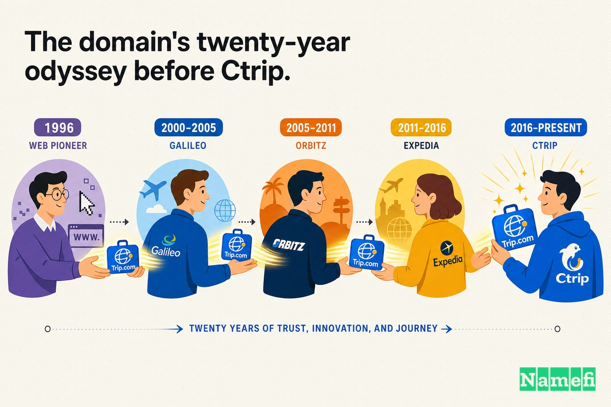

لقرابة عشرين سنة، كانت أكبر شركة سياحة أونلاين في العالم تشتغل باسم نجح بشكل ممتاز في بلد واحد وما انفعش تقريبًا في أي بلد تاني: **Ctrip.com**.

الاسم كان صادقًا. لما أسّس James Liang وتلاتة مؤسسين معاه الشركة في شنغهاي في يونيو 1999، كانت كلمة "Ctrip" — والـ C بتشير لـ China — وصف دقيق لما الشركة بتعمله: خدمة سفر صينية للمسافرين الصينيين. ويكيبيديا بتسجّل إن الشركة [تأسست باسم Ctrip.com على إيد James Liang و Neil Shen و Min Fan و Qi Ji في يونيو 1999](https://en.wikipedia.org/wiki/Trip.com_Group#:~:text=founded%20as%20Ctrip.com%20by%20James%20Liang%2C%20Neil%20Shen%2C%20Min%20Fan%2C%20and%20Qi%20Ji%20in%20June%201999). نمت بسرعة غير عادية، وفي 2003 [اتدرجت في بورصة NASDAQ](https://en.wikipedia.org/wiki/Trip.com_Group#:~:text=listed%20on%20the%20NASDAQ) في طرح عام أولي بقيادة Merrill Lynch جمع 75 مليون دولار أمريكي — كانت من أوائل موجة الطروحات الأولية للشركات الصينية على الإنترنت للمستهلكين.

جوّا في الصين، Ctrip.com كانت الاختيار الأوحد. كانت الخيار الافتراضي، والعلامة التي بيعرفها كل الناس، والمكان اللي المئات من الملايين بيروحوا عليه يحجزوا تذاكر الطيران والفنادق. بس لما الشركة بدأت تبص ورا حدود سوقها المحلي، الاسم اتحوّل لحاجز. "Ctrip" بتتقرأ بسلاسة لأي متكلم بالمندرين. بس لمسافر في لندن أو سيول، هي مجموعة حروف ساكنة غريبة بتوصل رسالة قبل أي حاجة تانية إن دي شركة *صينية* — واسم هيعاني يتكلمه أو يتذكره أو حتى يتهجاه.

فعشان كده في 2017، عملاق السياحة الصيني عمل حاجة بدت في الأول إنها أمر بسيط. اشترى دومين. مش منافس، مش سوق — كلمة إنجليزية مميزة واحدة بـ `.com` وراها: **Trip.com**. بعدها بسنتين، الدومين ده مش هيبقى منتج بس. هيبقى اسم الشركة كلها.

## 1999–2017: الشركة اللي سادت الصين وما ملكتش تقريبًا أي حاجة بره

في منتصف العقد الأول من الألفينات، كانت Ctrip قد سيطرت على سوقها المحلي لدرجة إنه ما بقيش فيه تقريبًا أي حاجة ممكن تكسبها. امتصّت أو تفوّقت على معظم منافسيها المحليين، وأصبحت — زي ما وصفتها مصادر كتيرة بعدها — أكبر وكالة سفر أونلاين في الصين، وبمقاييس معينة الأكبر في العالم. بس تقريبًا كل حجمها ده كان محصور جوّا حدود واحدة.

الأرقام كانت صادمة. زي ما نقلت South China Morning Post، Ctrip [بتخطط ترفع نسبة إيراداتها من العملاء خارج الصين من 2% لـ 20% على الأقل على مدى الخمس سنين الجايين، مستخدمةً علامتها التجارية Trip.com اللي اشترتها حديثًا](https://www.scmp.com/tech/article/2156222/china-travel-giant-ctrip-wants-book-bigger-seat-international-markets-tripcom#:~:text=plans%20to%20boost%20the%20proportion%20of%20total%20revenue%20it%20makes%20from%20overseas%20customers%20from%202%20per%20cent%20to%20at%20least%2020%20per%20cent%20over%20the%20next%20five%20years%2C%20using%20its%20recently-acquired%20Trip.com%20brand). اتنين بالمية. شركة بتسيطر على أكبر سوق سياحي في العالم كانت، دوليًا، رقم مهمل في الحساب.

الطموح كان عالميًا بالفعل حتى قبل ما الإيرادات تتعالميه. Liang صاغ الصناعة كلها كلعبة حجم: السياحة، زي ما قال، [هتبقى في النهاية لعبة الفايز بياخد كل حاجة](https://www.scmp.com/tech/article/2156222/china-travel-giant-ctrip-wants-book-bigger-seat-international-markets-tripcom#:~:text=travel%20will%20be%20a%20winner%20takes%20all%20game%20in%20the%20end). والهدف كان صريح: [الاستحواذ على شريحة كبيرة من سوق السياحة العالمية والتفوق على منافسين زي Expedia أصبح تركيزًا رئيسيًا لـ Ctrip](https://www.scmp.com/tech/article/2156222/china-travel-giant-ctrip-wants-book-bigger-seat-international-markets-tripcom#:~:text=Taking%20a%20big%20slice%20of%20the%20global%20tourism%20market%20and%20beating%20competitors%20like%20Expedia%20is%20now%20a%20key%20focus%20for%20Ctrip).

بس مش ممكن تتفوقي على Expedia.com و Booking.com بعلامة تجارية معظم العالم مش عارف ينطقها. الاسم الوصفي المرتبط بالصين اللي كان بوابة مثالية في بلده أصبح سقفًا في الخارج. Ctrip.com كان الدومين الصح للتمانية عشر سنة الأولى — والغلط للشركة اللي كانت على وشك تتحوّل لحاجة تانية تمامًا.

## 2017: شراء Trip.com من شركة ناشئة اسمها Gogobot

فـ Ctrip راحت وجابت اسمًا أحسن. استحوذت على واحد من أكتر الدومينات المرغوبة في صناعة السياحة كلها — `Trip.com` — عن طريق شرائها للشركة اللي صادفت إنها بتمسك الدومين ده.

الشركة دي كانت Gogobot، شركة ناشئة لتوصيات السفر في سان فرانسيسكو كانت عملت إعادة تسمية لنفسها مؤخرًا حول الدومين ده. ChinaTravelNews نقلت الصفقة بشكل مباشر: [Ctrip أنهت مؤخرًا استحواذها على منصة حجز سفر أمريكية Trip.com (المعروفة سابقًا بـ Gogobot) اللي بتقدم توصيات سفر مخصصة](https://www.chinatravelnews.com/article/118274/#:~:text=Ctrip%20has%20recently%20completed%20its%20acquisition%20of%20US%20travel%20booking%20platform%20Trip.com%20%28formerly%20Gogobot%29%20that%20offers%20personalized%20travel%20recommendations). السعر ما اتعلنش للعموم.

الأهم هو إن Ctrip في الحقيقة ما كانتش بتشتري محرك توصيات. كانت بتشتري العنوان. بامتلاك Trip.com، الشركة حيازت الآن علامتين تجاريتين إنجليزيتين نظيفتين عالميتين لتشغيلهم جنب بجنب — هيكل المحللون اعترفوا بيه فورًا. زي ما قال أحد المراقبين في الصناعة، Ctrip تقدر تستخدم [Skyscanner للبحث المقارن وTrip.com كـ OTA متكامل الخدمات](https://www.chinatravelnews.com/article/118274/#:~:text=Skyscanner%20for%20metasearch%20and%20Trip.com%20for%20full-service%20OTA): علامة البحث في السياحة اللي اشترتها في 2016، والآن علامة الحجز اللي استحوذت عليها للتو، الاتنين بأسماء مسافر غربي يقدر فعلًا يستخدمها.

## رحلة الدومين على مدى عشرين سنة قبل Ctrip

ده اللي بيخلي Trip.com أصلًا استثنائيًا: لما Ctrip اشترته، الدومين كان مرّ بتقريبًا ربع قرن من تاريخ صناعة السياحة. Skift تتبّع رحلته الكاملة، وسلسلة الملكية بتقرأ زي خريطة لحقبة السياحة الأونلاين كلها.

الدومين اتسجّل أول مرة في 1996، على إيد رجل تذكّره رائد الأعمال الأصلي Antoine Toffa بـ ["Mr. Trip" من Trip Software Systems](https://finance.yahoo.com/news/trip-com-nearly-quarter-century-063018580.html#:~:text=Mr.%20Trip%22of%20Trip%20Software%20Systems). Toffa بعدها [اشتراه منه في 1998 بـ 5,000 دولار](https://finance.yahoo.com/news/trip-com-nearly-quarter-century-063018580.html#:~:text=purchased%20it%20from%20him%20in%201998%20for%20%245%2C000)، وبنى عليه موقع سفر في مراحله الأولى. الفلوس الكبيرة جت بسرعة: شركة تقنيات السفر Galileo [استحوذت على باقي الشركة في 2000 بـ 214.4 مليون دولار نقدًا وأسهمًا](https://finance.yahoo.com/news/trip-com-nearly-quarter-century-063018580.html#:~:text=acquired%20the%20rest%20of%20the%20company%20in%202000%20for%20%24214.4%20million%20in%20cash%20and%20stock).

بعدها الدومين مرّ بدورة طويلة من الموت والبعث. بعد ما Cendant استحوذت على Galileo، [أغلقت Trip.com في 2003](https://finance.yahoo.com/news/trip-com-nearly-quarter-century-063018580.html#:~:text=shut%20down%20Trip.com%20in%202003) — أول موت للعلامة التجارية. في 2009، [أحيت Orbitz Worldwide علامة Trip.com](https://finance.yahoo.com/news/trip-com-nearly-quarter-century-063018580.html#:~:text=Orbitz%20Worldwide) كموقع بحث مقارن، قبل ما تموت تاني. Gogobot في النهاية اشترت الرابط من Expedia بسعر غير معلن و[غيّرت اسمها لتصبح Trip.com](https://finance.yahoo.com/news/trip-com-nearly-quarter-century-063018580.html#:~:text=Gogobot%20then%20rebranded%20to%20become%20Trip.com). وأخيرًا، [Ctrip استحوذت على Gogobot التي أصبحت Trip.com في 2017](https://finance.yahoo.com/news/trip-com-nearly-quarter-century-063018580.html#:~:text=Ctrip%20acquired%20Gogobot-turned%20Trip.com%20in%202017).

دومين بدأ بـ 5,000 دولار في 1998 كان، بحلول 2000، مضمّنًا في صفقة استحواذ بـ 214.4 مليون دولار. صمد أمام ثلاثة ملّاك مختلفين وعمليتي إغلاق. كلمة "Trip" زائد ".com" كانت ببساطة ذات قيمة عالية جدًا في السياحة لتفضل مدفونة — وشركة صينية تطارد السوق العالمي كانت بالظبط النوع من المشتري اللي عنده الدافع لتشغيلها أخيرًا للأبد.

## الأسعار كانت مختلفة في الزمن ده

من السهل تنظر لـ Trip.com النهارده — العلامة التجارية العالمية لشركة بعشرات المليارات من الدولارات — وتفترض إن شراءها كان واضحًا. ما كانش كده.

Ctrip ما أعلنتش أبدًا عن سعر شرائها لـ Gogobot، والصفقة اتهيكلت كاستحواذ على شركة مش كشراء دومين مباشر، وده بيعقّد أي سعر محدد. بس المقارنات التاريخية بتحكي قصة كيف دومين سياحي مميز بيتراكم في قيمته. نفس سلسلة الحروف دي غيّرت أيدي بـ 5,000 دولار في 1998 واتضمّنت في صفقة بـ 214.4 مليون دولار بعد سنتين. سعر "Trip.com" ما كانش يتعلق بتكلفة تسجيل دومين. كان يتعلق بمدى احتياج المشتري للكلمة الوحيدة اللي بتوضّح فئة كاملة.

وفي 2017، Ctrip كانت محتاجة بشدة. كانت شركة بحجم هائل في المنزل وحجم شبه معدوم في الخارج — 2% من الإيرادات من المبيعات الدولية — وبتراهن إنها تقدر توصل لـ 20% وتتحدى Expedia في الميدان المفتوح. إنفاق فلوس حقيقية على *اسم*، بدل البضائع أو التكنولوجيا أو التسويق، مش هيبقى منطقيًا غير لو اتعاملت مع الدومين كأساس يُبنى عليه كل حاجة. Ctrip كانت على وشك تطلب من العالم غير الصيني كله يتعلم علامة تجارية جديدة. أرخص طريقة تخلّي العلامة دي تتثبت في الذاكرة هي إنها تكون كلمة المسافرين يعرفوها أصلًا: trip.

## ليه الانتقال لـ Trip.com كان مهمًا

الفرق بين Ctrip.com وTrip.com حرف واحد. استراتيجيًا، هو الفرق بين بطل محلي وبطل عالمي.

**Ctrip.com** بتصرّح بأصلها قبل ما تصرّح بوظيفتها — الـ "C" علم، وعلم غريب. **Trip.com** ما بتصرّحش بحاجة غير الشيء اللي أنت جيت تعمله. هي عامة بأفضل طريقة ممكنة: اسم إنجليزي بسيط كل مسافر في الدنيا فاهمه بالفعل، بيمتلك `.com` بالتطابق الكامل، ومقدر يتهجاه من أول مرة. اسم واحد بيطلب من العالم يتعلم شركة صينية. التاني ببساطة بيعرض إنه يساعدك تسافر في رحلة.

| قبل | بعد |
| --- | --- |
| Ctrip.com | Trip.com |
| بتقرأ كـ "موقع سفر صيني" | بتقرأ كـ "موقع السفر" |
| الأصل أولًا: الـ "C" بتحدد البلد | الوظيفة أولًا: الكلمة *هي* الفئة |
| صعبة الهجاء والنطق والحفظ في الخارج | اسم إنجليزي كلنا نعرفه أصلًا |
| اسم بطل محلي | اسم فئة عالمية |

ده نفس النمط اللي بيتكرر في ترقيات الدومينات العظيمة: الأسماء المبكرة *بتشرح مين إنت*، والأسماء العظيمة *بتمتلك ما بتعمله*. Ctrip.com كان اسمًا مثاليًا لكسب الصين. Trip.com كان الاسم لكسب كل مكان تاني — والشركة ما كانتش تقدر يكون عندها الاستراتيجية التانية من غير ما تمتلك الدومين التاني الأول.

## علامة تجارية صينية بتهندس نفسها للخروج من هويتها الصينية

اللي بيخلي الحالة دي غير عادية هو كيف Ctrip عملت إعادة تسمية متعمدة ومدروسة لنفسها بعيدًا عن هويتها الوطنية. ده ما كانش ريبراندينج عرضي. ده كان، بتعبير الشركة نفسها، عملية جراحية.

بالتغطية لإعادة الإطلاق العالمي، Marketing-Interactive وصفت هدف Liang بكلماته الخاصة: أراد أن [يلغي أي إشارة لكونه مملوكًا صينيًا من خلال ما أسماه "ريبراندينج من الداخل للخارج"](https://www.marketing-interactive.com/ctrip-launches-global-rebrand-to-trip-com#:~:text=He%20wants%20to%20eliminate%20any%20reference%20to%20being%20Chinese-owned%20through%20what%20he%20called%20%E2%80%98an%20inside-out%20rebranding%E2%80%99). علامة Trip.com الجديدة حتى [شهدت إزالة الشركة لدلفينها الأيقوني من الشعار، وتغيير لون الشعار والخط](https://www.marketing-interactive.com/ctrip-launches-global-rebrand-to-trip-com#:~:text=removing%20its%20iconic%20dolphin%20from%20the%20logo%2C%20and%20changing%20the%20logo%E2%80%99s%20colour%20and%20font) — الهوية البصرية أعيد بناؤها لتتوافق مع الاسم الجديد المحايد جغرافيًا. الموقع المُعاد إطلاقه تم بناؤه لخدمة المسافرين الدوليين مباشرة: Yicai Global أبلغت إن [Trip.com ستقدم خدمات حجز سفر متكاملة بـ 13 لغة](https://www.yicaiglobal.com/news/china-leading-online-travel-services-provider-ctrip-goes-through-inside-out-rebranding-unveils-new-global-site#:~:text=Trip.com%20will%20provide%20one-stop%20travel%20booking%20services%20in%2013%20languages) عبر موقعها وتطبيقها الموبايل.

منطق الـ "ليه" كان دايمًا نفسه: الحجم. زي ما قال Liang لـ SCMP، سوق واحد ما بيكفيش للمنافسة — [سوق السفر هو سوق عالمي. لو أنت شغّال في سوق واحدة بس، مش هتقدر تحقق وفورات الحجم للمنافسة](https://www.scmp.com/tech/article/2156222/china-travel-giant-ctrip-wants-book-bigger-seat-international-markets-tripcom#:~:text=The%20travel%20market%20is%20a%20global%20market.%20If%20you%E2%80%99re%20just%20doing%20one%20market%2C%20you%20can%E2%80%99t%20realise%20the%20economies%20of%20scale%20to%20compete). اسم بيصرّح بـ "شركة صينية" لكل مستخدم غربي كان احتكاك في بالظبط الأسواق اللي Ctrip عايزة فيها وفورات الحجم. Trip.com محت الاحتكاك ده بالتصميم — كلمة إنجليزية عامة بتحسيس إنها لحد محدد خلّت شركة من شنغهاي تقدم نفسها لمسافر في لندن على إنها ببساطة مكان تحجز فيه رحلتك.

## 2019: الدومين أصبح الشركة نفسها

لمدة سنتين، Trip.com كان علامة تجارية الشركة تمتلكها. بعدين أصبح الاسم اللي الشركة *هي إياه*.

في أكتوبر 2019، خلال احتفال ذكرى الشركة العشرين، قدّمت الشركة الأم إعادة التسمية لتصويت المساهمين — واتقبلت. وكالة أنباء شينهوا أبلغت إن [Ctrip، أكبر وكالة سفر أونلاين في الصين، قررت تغيير اسمها الرسمي](http://www.xinhuanet.com/english/2019-10/29/c_138513249.htm#:~:text=China%E2%80%99s%20largest%20online%20travel%20agency%20Ctrip%20has%20decided%20to%20change%20its%20official%20name)، وإن [مساهمي الشركة وافقوا على تغيير اسم الشركة من "Ctrip.com International, Ltd." إلى "Trip.com Group Limited"](http://www.xinhuanet.com/english/2019-10/29/c_138513249.htm#:~:text=The%20company%E2%80%99s%20shareholders%20have%20approved%20the%20change%20of%20the%20company%20name%20from). ويكيبيديا بتسجّل نفس المحطة: [في أكتوبر 2019، وافق المساهمون على اقتراح الشركة بتغيير اسمها من "Ctrip.com International, Ltd." إلى "Trip.com Group Limited."](https://en.wikipedia.org/wiki/Trip.com_Group#:~:text=In%20October%202019%2C%20shareholders%20approved%20the%20company%E2%80%99s%20proposal%20to%20change%20its%20name%20from%20%E2%80%9CCtrip.com%20International%2C%20Ltd.%E2%80%9D%20to%20%E2%80%9CTrip.com%20Group%20Limited.%E2%80%9D)

المنطق كان بالكامل عن الوضوح العالمي. Caixin Global أبلغت إن Liang [قال إن الاسم الجديد "يقدر يتذكّره المستخدمون العالميون بسهولة"، معبّرًا عن طموح الشركة لتحقيق الاعتراف الواسع بالعلامة التجارية على مستوى المنافسين الدوليين زي Expedia و Priceline](https://www.caixinglobal.com/2019-10-30/ctrip-formalizes-name-change-as-it-eyes-global-expansion-101476945.html#:~:text=said%20the%20new%20name%20%22can%20be%20easily%20remembered%20by%20global%20users%2C%22%20reflecting%20the%20company%27s%20ambition%20to%20achieve%20the%20widespread%20brand%20recognition%20of%20international%20competitors%20like%20Expedia%20and%20Priceline). رمز التداول في البورصة اتغيّر ليتوافق مع الهوية الجديدة: زي ما أشار نفس التقرير، [رمز التداول هيتغير من "CTRP" لـ "TCOM."](https://www.caixinglobal.com/2019-10-30/ctrip-formalizes-name-change-as-it-eyes-global-expansion-101476945.html#:~:text=Its%20ticker%20will%20be%20changed%20from%20%22CTRP%22%20to%20%22TCOM.%22)

لاحظ التسلسل، لأنه الدرس كله. الدومين جه **أولًا** (2017). إعادة إطلاق المنتج جت **تانيًا** (2018). تغيير اسم الشركة جه **أخيرًا** (2019). مش تقدر تغير اسم شركتك المدرجة في البورصة لـ "Trip.com Group" لو ما بتمتلكش Trip.com — وCtrip أمضت سنتين تتأكد إنها مالكاه قبل ما تطلب من المساهمين التصويت. والمهم إن تغيير الاسم ما قتلش Ctrip: علامة Ctrip فضلت حية للسوق الصيني، بينما Trip.com بقت الرأس الهجومي في الخارج. المجموعة ببساطة اختارت الاسم الموجّه عالميًا للشركة الأم.

## الدومين أصبح جزءًا من نظام التشغيل

الدومينات المميزة مش عن الهيبة. هي عن التكرار — ولشركة بتتعالم، التكرار بلغة عملاءها بالفعل بيتكلموها.

الدومين الأساسي للشركة بيظهر في أماكن فريق التسويق ما بيتحكمش فيها مباشرة:

- في قوائم متاجر التطبيقات عبر عشرات الدول.
- في إيميلات تأكيد الطيران وقسائم الفنادق وجداول الرحلات.
- في عناوين الصحف وتقارير المحللين في كل سوق تدخله.
- في نتائج البحث وشريط العناوين في المتصفح وتوصيات الكلام بين المسافرين.
- في رمز التداول في البورصة والعروض التقديمية للمستثمرين واسم الشركة نفسه.

كل تكرار من دول ده إما بيضيف احتكاك أو بيلغيه. Ctrip.com كانت بتخلي كل ذكر دولي أصعب شوية في الهجاء، وأغرب شوية، وأكتر "موقع صيني." Trip.com خلّت كل ذكر كلمة إنجليزية عادية مسافر في أي من الـ 13 لغة دي يقدر يستوعبها من غير تفكير. اضرب ده في مئات الملايين من المستخدمين وكل سوق Ctrip عايزة تدخله، وهتلاقي الدومين المميز بطل يبدو زي شراء كمالي وبدأ يبدو زي تقليل دائم في المقاومة على النمو العالمي.

## اللي المؤسسين المفروض يتعلموه من الحالة دي

التيك أواي السهل — "اشتري .com عام" — بيفوّت الهيكل الحقيقي. الدروس المفيدة عن *إمتى* الاسم الوصفي بيتحوّل لحاجز، و*بأي ترتيب* تهدّه:

1. **الاسم المحلي الوصفي ميزة في البداية.** "Ctrip" — الـ C لـ China — كان الاسم الصح لكسب الصين. كان بيشير بالظبط لمين الشركة للجمهور اللي كانت تحتاجه بالظبط. الاسم المرتبط بجغرافيا أو الوصفي هو بوابة معقولة، مش غلطة.
2. **راقب اللحظة اللي الاسم فيها يوقف يوصفك ويبدأ يحددك.** بالنسبة لـ Ctrip الإشارة كانت هيكلية: 2% من الإيرادات من الخارج، اسم عملاء أجانب مش قادرين يتهجوه، وطموح معلن للوصول لـ 20% وتحدي Expedia. لما اسمك بيشتغل في سوق واحد بس وأنت عايز كلهم، الاسم هو السقف.
3. **اشتري الدومين قبل ما تراهن بالشركة عليه.** Ctrip اشترت Trip.com في 2017، وأعادت إطلاق العلامة التجارية للمستهلكين في 2018، وغيّرت اسم الشركة العامة في 2019 بس. الأصل البطيء الغالي المملوك خارجيًا — الدومين — لازم يتأمَّن *أولًا*. الهوية المؤسسية تقدر تيجي بعدين.
4. **كلمة عامة تقدر تعمل حاجة كلمة ذكية مش قادرة تعملها.** Trip.com بتنجح بالظبط لأنها *مش* مميزة في أصلها — هي الاسم البسيط لفئة كاملة، مملوك بشكل كامل عند `.com` بالتطابق الدقيق. للمنافسة العالمية، العام الممكن امتلاكه أحسن من المميز-لكن-الغريب.

ترقية الدومين ما خلّتش Trip.com Group تفوز. استراتيجية Liang، وعشرين سنة من القدرة التشغيلية، واستحواذ Skyscanner، والحجم الهائل — كل ده كان أكثر أهمية بكتير. بس Trip.com خلّت إعادة اختراع الشركة كعلامة تجارية *عالمية* — بدل كونها صينية — قابلة *للتسمية* فعلًا. وكان لازم يشترى الاسم ده بسنوات قبل ما أي حد خارج الصين يقدر يستخدمه.

## زاوية Namefi

لو شلنا دراما التسمية، الحالة دي في جوهرها هي مشكلة نقل وسابقة ملكية.

القرار الاستراتيجي ما كانش في شك حقيقي أبدًا — طبعًا شركة بتطارد سوق السياحة العالمي المفروض تمتلك Trip.com. الصعب كان كل حاجة حوالين الأصل. Trip.com مرّت بإيدين نص دستة أو أكتر من الملّاك على مدى عشرين سنة — مشتري بـ 5,000 دولار في 1998، واستحواذ بـ 214.4 مليون دولار في 2000، و Cendant وOrbitz وExpedia وGogobot — كل نقل ملكية مضمّن في صفقة شركة، وكل سعر متفاوض عليه بشكل خاص، وكل تسليم جولة جديدة من "أثبت مين مالك ده وانقله بأمان." دومين بتاريخ كده بيحمل كمية من الاحتكاك زي ده.

[Namefi](https://namefi.io) مبني حول فكرة إن الدومينات المفروض تتصرف كأصول أصيلة في الإنترنت. ملكية مُرمَّزة (tokenized) تقدر تخلي التحكم في الدومين أسهل في التحقق والنقل والتكامل في الطرق الحديثة للعمل مع الحفاظ على التوافق مع DNS — محوّلةً الجزء الأصعب في صفقة زي دي (تحديد ملكية نظيفة عبر سلسلة طويلة من الملّاك، والاتفاق على القيمة، ونقل التحكم من غير تعطيل موقع حي بيولّد إيرادات) لحاجة أقرب لمعاملة نظيفة قابلة للمراجعة. دومين غيّر أيدي ست مرات في خمسة وعشرين سنة هو بالظبط نوع الأصل اللي تاريخه المفروض يكون واضح بنظرة واحدة، مش بيتجمّع من تقارير صحفية قديمة.

Trip.com بتبدو حتمية دلوقتي لأن Trip.com Group أصبحت ضخمة. بس الدرس بيوصل قبل الحجم ده بكتير: لما اسم هيحمل شركة عبر الحدود، الدومين مش تزيين. هو الركيزة الأساسية — ولعلامة عايزة العالم كله، كان الجزء اللي استحق المطاردة لسنتين قبل ما تغيير الاسم يحصل أصلًا.

## المصادر وقراءات إضافية

- South China Morning Post — [حصريًا: عملاق السفر الصيني Ctrip يريد التوسع عالميًا بعلامة Trip.com](https://www.scmp.com/tech/article/2156222/china-travel-giant-ctrip-wants-book-bigger-seat-international-markets-tripcom#:~:text=plans%20to%20boost%20the%20proportion%20of%20total%20revenue%20it%20makes%20from%20overseas%20customers%20from%202%20per%20cent%20to%20at%20least%2020%20per%20cent)
- ChinaTravelNews — [Ctrip توسّع انتشارها العالمي باستحواذها على موقع السفر الأمريكي Trip.com](https://www.chinatravelnews.com/article/118274/#:~:text=Ctrip%20has%20recently%20completed%20its%20acquisition%20of%20US%20travel%20booking%20platform%20Trip.com%20%28formerly%20Gogobot%29)
- Skift (عبر Yahoo Finance) — [رحلة Trip.com على مدى ربع قرن كدومين سياحي لا يمكن خسارته](https://finance.yahoo.com/news/trip-com-nearly-quarter-century-063018580.html#:~:text=purchased%20it%20from%20him%20in%201998%20for%20%245%2C000)
- Marketing-Interactive — [Ctrip تطلق ريبراندينج عالمي إلى Trip.com](https://www.marketing-interactive.com/ctrip-launches-global-rebrand-to-trip-com#:~:text=He%20wants%20to%20eliminate%20any%20reference%20to%20being%20Chinese-owned%20through%20what%20he%20called%20%E2%80%98an%20inside-out%20rebranding%E2%80%99)
- Yicai Global — [Ctrip تجري "ريبراندينج من الداخل للخارج" وتكشف عن موقعها العالمي الجديد](https://www.yicaiglobal.com/news/china-leading-online-travel-services-provider-ctrip-goes-through-inside-out-rebranding-unveils-new-global-site#:~:text=Trip.com%20will%20provide%20one-stop%20travel%20booking%20services%20in%2013%20languages)
- شينهوا — [Ctrip الصينية تغير اسمها في إطار مسيرة العولمة](http://www.xinhuanet.com/english/2019-10/29/c_138513249.htm#:~:text=China%E2%80%99s%20largest%20online%20travel%20agency%20Ctrip%20has%20decided%20to%20change%20its%20official%20name)
- Caixin Global — [Ctrip تُرسّم تغيير الاسم مع توجهها للتوسع العالمي](https://www.caixinglobal.com/2019-10-30/ctrip-formalizes-name-change-as-it-eyes-global-expansion-101476945.html#:~:text=said%20the%20new%20name%20%22can%20be%20easily%20remembered%20by%20global%20users%2C%22)
- ويكيبيديا — [Trip.com Group](https://en.wikipedia.org/wiki/Trip.com_Group#:~:text=In%20October%202019%2C%20shareholders%20approved%20the%20company%E2%80%99s%20proposal%20to%20change%20its%20name)
