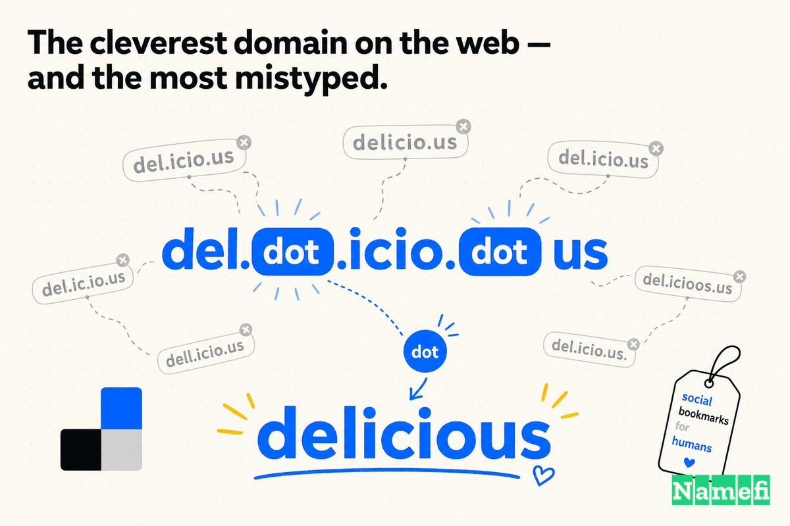

لمدة خمس سنين تقريبًا، كان واحد من أكتر المواقع تأثيرًا في حقبة Web 2.0 موجود على عنوان بالكاد تقدر تقوله بصوت عالي: **del.icio.us**.

الاسم ده كان ذكي. كان، في الحقيقة، أشهر مثال على الـ *domain hack* — وهي حيلة بيبقى فيها النطاق نفسه بيكتب كلمة عن طريق استعارة لاحقة دولة. Joshua Schachter سجّل `icio.us` على الـ [.us](/ar/tld/us/) [ccTLD](/ar/glossary/cctld/)، وحط `del` قدامها كـ subdomain، والسلسلة كلها اتقرت "delicious" يعني "لذيذ". زي ما وضّح شرح مبكر للتركيبة دي، [`del` هو في الأصل subdomain لـ `icio.us`](https://www.quickonlinetips.com/archives/2005/02/decoding-the-domain-name-delicious/#:~:text=del%20is%20actually%20a%20subdomain)، وإن تجميع الـ subdomain مع الـ ccTLD ده كان، بكلامهم، [طريقة عبقرية لتسجيل اسم نطاق](https://www.quickonlinetips.com/archives/2005/02/decoding-the-domain-name-delicious/#:~:text=an%20ingenious%20way%20to%20register%20a%20domain%20name).

بالنسبة لمشروع جانبي بيديره مهندس للمتعة، الذكاء ده كان هو الهدف. النقط كانت نكتة داخلية. كأنها بتقول: دي أداة هاكر، اتبنت من حد بيفكر إن طريقة شغل البنية التحتية للويب هي نفسها مساحة للإبداع.

لكن النكت الداخلية مش بتتوسع. كل نقطة في `del.icio.us` كانت مكان ممكن المستخدم الجديد يتوه فيه — فاصلة بدل نقطة، حرف ناقص، حرف زيادة. والموقع اللي تحت النقط دي مكنش باقي مشروع جانبي. ده ابتكر فئة كاملة، استقطب مئات الآلاف من المستخدمين، واتشترى بواسطة Yahoo. وفي 2008، تحت ملكية Yahoo، أذكى نطاق على الويب اتبدّل بالنطاق الممل الصح: **Delicious.com**.

دي قصة إمتى الـ domain hack بيوقف يبقى ظريف ويبدأ يبقى ضريبة — وإيه التكلفة إنك تصلحها بعد ما ملايين الناس اتعلموا إنهم بيغلطوا في كتابة اسمك.

## 2003: مشروع جانبي باسمه على كود دولة

في الأول، النقط كانت مجانية.

Schachter ماكنش بانيها شركة. بنى أداة لنفسه. لما [تجاوز 20,000 رابط في 2001](https://www.computerworld.com/article/1588198/del-icio-us-social-bookmarking-phenomenon.html#:~:text=When%20he%20topped%2020%2C000%20links%20in%202001)، كتب برنامج مستخدم واحد يدير بيه المفضلات المتراكمة عنده، وبعدين أعاد كتابته بشكل يقدر الناس يستخدموه. زي ما Computerworld حكت بعد كده، [أعاد كتابته من الصفر كنظام متعدد المستخدمين وأطلقه على الويب للآخرين. وسمّاه del.icio.us.](https://www.computerworld.com/article/1588198/del-icio-us-social-bookmarking-phenomenon.html#:~:text=he%20rewrote%20it%20from%20scratch%20as%20a%20multiuser%20system%20and%20launched%20it%20on%20the%20Web%20for%20others%20to%20use.%20He%20called%20it%20del.icio.us.) وحسب Wikipedia، [في سبتمبر 2003، أطلق Schachter النسخة الأولى من Delicious.](https://en.wikipedia.org/wiki/Delicious_(website)#:~:text=In%20September%202003%2C%20Schachter%20released%20the%20first%20version%20of%20Delicious.)

عمل ده في وقت فراغه. وحسب Computerworld، [كان Schachter بيديره في وقت فراغه، وهو بيشتغل وقت كامل كمحلل كمي في Morgan Stanley](https://www.computerworld.com/article/1588198/del-icio-us-social-bookmarking-phenomenon.html#:~:text=Schachter%20ran%20it%20in%20his%20spare%20time%2C%20while%20working%20full%20time%20as%20a%20quantitative%20analyst%20at%20Morgan%20Stanley) — النوع ده من البدايات بعد الدوام اللي فيها محدش بيعمل فحص علامات تجارية أو بيفكر في إزاي الاسم هيبان في شاشة التلفزيون. فكرة الـ tagging اللي خلّت الموقع مشهور ماكانتش أصلية فيه؛ حسب Wikipedia، كانت [نظام طوّره لتنظيم الروابط المقترحة لـ Memepool](https://en.wikipedia.org/wiki/Joshua_Schachter#:~:text=a%20system%20he%20developed%20for%20organizing%20links%20suggested%20to%20Memepool).

والمنتج نجح. من غير ميزانية تسويق، انتشر بالذكاء والكلام الشفاهي. Computerworld أفادت إن [من غير أي تسويق رسمي، del.icio.us بقى عنده حوالي 200,000 مستخدم مسجل](https://www.computerworld.com/article/1588198/del-icio-us-social-bookmarking-phenomenon.html#:~:text=With%20no%20formal%20marketing%2C%20today%20del.icio.us%20has%20about%20200%2C000%20registered%20users)، وWikipedia أخدت الخدمة عليها أكتر من مجرد المستخدمين: [الخدمة دي ابتكرت مصطلح social bookmarking](https://en.wikipedia.org/wiki/Joshua_Schachter#:~:text=The%20service%20coined%20the%20term%20social%20bookmarking).

يعني إيه الموقف. شركة *سمّت فئة كاملة* كانت لابسة نطاق متصمم لهواية شخص واحد. الاسم كان نكتة هاكر اتحولت بالصدفة لعلامة تجارية.

## أذكى نطاق على الويب — وأكتره أخطاء كتابة

`del.icio.us` هو، حتى دلوقتي، المثال الكتابي للـ domain hack. Wikipedia بتقولها صريحة: [اسم النطاق "del.icio[.us]" كان مثالًا معروفًا على الـ domain hack، وهو تركيبة غير تقليدية من الحروف لتكوين كلمة أو عبارة.](https://en.wikipedia.org/wiki/Delicious_(website)#:~:text=domain%20name%20was%20a%20well%2Dknown%20example%20of%20a%20domain%20hack)

الحيلة كانت أنيقة فعلًا. زي ما الشرح التفصيلي وضّح، [icio كان اسم النطاق المختار و.us كان كود الدولة المسجّل على مستوى النطاق الأعلى (ccTLD) واللي اتجمعوا عشان يكوّنوا icio.us](https://www.quickonlinetips.com/archives/2005/02/decoding-the-domain-name-delicious/#:~:text=icio%20was%20the%20selected%20domain%20name%20and%20.us%20was%20the%20registered%20country%20code%20level%20top%20level%20domain)، مع `del` فوقيهم كـ subdomain. العنوان ماكانش *بيشير* لكلمة. العنوان *نفسه* كان كلمة. لجمهور المهندسين، ده كان جذاب جدًا.

المشكلة إن بقية العالم مش بتقرأ DNS للمتعة. النقط الأربع دي حوّلت العلامة التجارية لاختبار إملاء، ومعظم الناس رسبوا فيه. لما الفريق أخيرًا فسّر نقلة 2008، حدّدوا الضرر: [شفنا ألف نوع من الارتباك والأخطاء الإملائية في "del.icio.us" على مر السنين (زي "de.licio.us" و"del.icio.us.com" و"del.licio.us")](https://domainnamewire.com/2008/08/01/delicious-rebrands-as-deliciouscom-a-lesson-for-entrepreneurs/#:~:text=zillion%20different%20confusions%20and%20misspellings). كل نقطة في المكان الغلط كانت مستخدم ماوصلش، ورابط اتشارك ماشتغلش، وتوصية ماتت في الفراغ بين سماع الاسم وكتابته.

Schachter كان عارف. كان عارف من تقريبًا الأول. زي ما Domain Name Wire لاحظت، من 2004 كان بيتكلم عن غلطة التسمية، وعزله مباشرةً: [أنا شوية بندم على استخدام اسم النطاق ده، لأنه يكاد يكون مستحيلًا تناقشه أو تتحقق منه من غير ما تبان مضحك.](https://domainnamewire.com/2008/08/01/delicious-rebrands-as-deliciouscom-a-lesson-for-entrepreneurs/#:~:text=I%20somewhat%20regret%20using%20the%20domain%20name)

الجملة دي فيها كل التوتر في الـ domain hack في جملة واحدة. *يكاد يكون مستحيلًا تناقشه أو تتحقق منه من غير ما تبان مضحك.* اسم بيعيش على الشاشة ممكن يكون ذكي وملتوي في نفس الوقت. اسم لازم يعيش بعد ما يتقال بصوت عالٍ — في مكالمة تليفون، في مطعم، في بودكاست، لزميل في الشغل — لازم يتنطق بسهولة. النقط اللي خلّت `del.icio.us` نكتة داخلية حلوة خلّته أسوأ حاجة تنصح بيها.

## 2005: Yahoo بتشتري الهواية

الهواية اتحولت لصفقة استحواذ.

في [9 ديسمبر 2005، Yahoo! استحوذت على Delicious بمبلغ لم يُكشف عنه](https://en.wikipedia.org/wiki/Joshua_Schachter#:~:text=On%20December%209%2C%202005%2C%20Yahoo%21%20acquired%20Delicious%20for%20an%20undisclosed%20sum) — سعر Wikipedia بتقول إنه كان [حسب Business 2.0 ... 30 مليون دولار](https://en.wikipedia.org/wiki/Joshua_Schachter#:~:text=According%20to%20Business%202.0%2C%20the%20acquisition%20price%20was%20%2430%20million). Delicious كانت في اللحظة دي جوهرة تاج Web 2.0. TechCrunch وصفت الحقبة بعد كده بحنين: [في يوم من الأيام (يمكن حوالي 2004)، خدمة الـ social bookmarking Delicious كانت الأحلى حاجة على الويب](https://techcrunch.com/2016/01/12/delicious-former-web-2-0-darling-is-now-managed-by-new-alliance-rolls-back-most-recent-changes/#:~:text=the%20social%20bookmarking%20service%20Delicious%20was%20the%20hottest%20thing%20on%20the%20web)، موقع [ضرب كل الكلمات الرنانة في الوقت ده (tagging تعاوني، folksonomy، AJAX)](https://techcrunch.com/2016/01/12/delicious-former-web-2-0-darling-is-now-managed-by-new-alliance-rolls-back-most-recent-changes/#:~:text=hit%20all%20the%20right%20buzzwords%20of%20the%20time).

Yahoo بقت مالكة منتج يعرّف فئة كاملة. واتملّكت كمان أكبر مشكلة في قابلية قراءة المنتج ده. مشروع جانبي جسور يقدر يلبس الـ domain hack كشارة. منتج استهلاكي رئيسي بتملكه شركة عامة عايزة *الجميع* يستخدمه ما يقدرش — كل نقطة هي احتكاك بين Yahoo والنمو الجماهيري اللي برّر سعر الشراء.

يعني السؤال اللي Yahoo ورثته ماكانش هل `del.icio.us` ذكي. الكل اتفق إنه ذكي. السؤال كان هل الذكاء يستاهل الملايين من المستخدمين اللي ما يقدروش يتهجّوه.

## 2008: استبدال النكتة بالكلمة

في صيف 2008، Yahoo اتخذت القرار. Delicious أطلق تصميم جديد والعلامة التجارية انتقلت بهدوء للعنوان اللي كان المفروض يبقى عندها من الأول. حسب Wikipedia، [التصميم الجديد انطلق في 31 يوليو 2008.](https://en.wikipedia.org/wiki/Delicious_(website)#:~:text=The%20new%20design%20went%20live%20on%20July%2031%2C%202008.)

Domain Name Wire وثّقت التحوّل بدقة: [موقع الـ social bookmarking Delicious قلب السويتش على علامته التجارية، وشجّع المستخدمين يزوروا Delicious.com السهلة الحفظ بدل del.icio.us اللي بيتكتب غلط كتير.](https://domainnamewire.com/2008/08/01/delicious-rebrands-as-deliciouscom-a-lesson-for-entrepreneurs/#:~:text=flipped%20the%20switch%20on%20its%20brand%2C%20encouraging%20users%20to%20visit%20the%20easy%2Dto%2Dremember%20Delicious.com%20instead%20of%20the%20often%20typod%20del.icio.us) لاحظوا طريقة الكلام: *سهلة الحفظ* مقابل *بيتكتب غلط كتير*. بعد خمس سنين وصفقة استحواذ واحدة، السبب الرسمي للتحوّل كان بالظبط المشكلة اللي Schachter سمّاها في 2004 — النقط تكلّف أكتر من قيمتها.

تفسير السبب ماكانش فيه عاطفة. زي ما Domain Name Wire نقلت كلام الفريق نفسه، الهدف الكامل من الانتقال لـ delicious.com إنه [هيسهّل على الناس يلاقوا الموقع ويشاركوه مع أصحابهم](https://domainnamewire.com/2008/08/01/delicious-rebrands-as-deliciouscom-a-lesson-for-entrepreneurs/#:~:text=will%20make%20it%20easier%20for%20people%20to%20find%20the%20site%20and%20share%20it%20with%20their%20friends). يلاقوه. يشاركوه. دول الفعلين اللي الـ domain hack بيكسرهم بصمت، وهم نفس الفعلين اللي منتج في مرحلة النمو بيعيش وبيموت بيهم.

دي الترقية النادرة اللي الشركة فيها اتحركت *ناحية* الـ `.com` البسيط وابتعدت عن السلسلة الذكية — الاتجاه المعاكس للمسار المعتاد من الاسم الوصفي للاسم المطابق بالظبط. لكنها نفس الحركة في الأساس: التخلص من اسم كان بيعبّر عن ذكاء المؤسس لصالح اسم السوق كله يقدر يستخدمه من غير تفكير.

## الفلوس كانت شايلة شكل تاني وقتها

سهل إنك من هنا تقول إن Schachter كان المفروض يشتري delicious.com في 2003 ويتفادى النقط. ده بيقرأ القرار من آخره.

في 2003، `del.icio.us` ماكانش قرار علامة تجارية. كان قرار *هواية*. Schachter ماكانش بيخصص ميزانية تسويق؛ كان بيسجل نطاق لأداة بيشغلها في الليل وعطل نهاية الأسبوع وهو محتفظ بوظيفة أساسية في Morgan Stanley. الحيلة ماكانتش خطأ استراتيجي — كانت متعة إبداعية صغيرة، النوع اللي بتعمله *عشان* هو لك أنت.

Domain Name Wire اتقبّلت الموقف ده بالظبط، وده الفهم المنصف: [لما الموقع Delicious بدأ كهواية، المؤسس Joshua Schachter يستاهل يُغفر له إنه ماستخدمش اسم نطاق كويس.](https://domainnamewire.com/2008/08/01/delicious-rebrands-as-deliciouscom-a-lesson-for-entrepreneurs/#:~:text=Since%20the%20Delicious%20site%20started%20as%20a%20hobby%2C%20founder%20Joshua%20Schachter%20can%20be%20forgiven%20for%20not%20using%20a%20good%20domain%20name.)

الفخ مش إنك تختار domain hack وإنت صغير. الفخ إنك *تفضل فيه* لما تكبر. تكلفة النقط كانت قريبة من الصفر لمشروع جانبي فيه بضعة آلاف من المستخدمين التقنيين اللي كانوا بيعتبروا الحيلة حلوة. التكلفة اتصاعدت كل مرة الجمهور اتوسع — فات المتبنّين الأوائل، فات 200,000 مستخدم مسجّل، فات صفقة Yahoo، ناحية الجمهور الرئيسي اللي Yahoo كانت عايزاه. الفاتورة على `del.icio.us` ماتدفعتيش في 2003. جت موعدها في 2008، محسوبة بكل مستخدم ماقدرش يلاقي موقع قيل له يجرّبه.

## ليه الانتقال لـ Delicious.com كان مهم

الفرق بين `del.icio.us` و`Delicious.com` يبان إنه مجرد علامات ترقيم. استراتيجيًا، هو الفرق بين اسم بيؤدي ذكاء وبين اسم بيوصّل مستخدمين.

**del.icio.us** هو لغز: أربع نقط، كود دولة مستعار، سلسلة محتاج تُفسّرها قبل ما تكتبها. **Delicious.com** هي بس كلمة. الأول بيطلب من السامع يتذكر هيكل غير عادي. التاني بيطلب منه يتذكر كلمة هو أصلًا عارف إزاي يتهجّاها.

| قبل | بعد |
| --- | --- |
| del.icio.us | Delicious.com |
| Domain hack (الـ .us ccTLD بتكتب كلمة) | كلمة .com عادية ومطابقة بالظبط |
| ذكي تقرأه على الشاشة | سهل تقوله بصوت عالٍ وتشاركه |
| أربع نقط = أربع أماكن للخطأ في الكتابة | كلمة واحدة، هجاء واحد |
| "de.licio.us"، "del.licio.us"، "del.icio.us.com" | delicious.com |
| بيعبّر عن مشروع جانبي لهاكر | بيعبّر عن منتج استهلاكي رئيسي |

دي نفس الدرس في كل ترقية نطاق، بس جاية من الجهة التانية. معظم الشركات بتتحرك من اسم *وصفي* (UberCab، TeslaMotors) لكلمة مطابقة نظيفة بالظبط. Delicious اتحركت من اسم *أذكى من اللازم* للكلمة المطابقة النظيفة بالظبط. الوجهة واحدة: نطاق بيختفي في العلامة التجارية بدل ما يطالب بالاهتمام. النطاق الكويس هو اللي المستخدمين مش محتاجين يفكروا فيه. `del.icio.us` خلّاهم يفكروا في النطاق في كل مرة.

والانتقال ده كان تحذير لكل اللي كانوا بيتفرجوا. Domain Name Wire قالت الدرس الأشمل بصراحة: [للأسف، عدد من رواد الويب 2.0 شافوا نجاح del.icio.us وفكروا إن من الهايل إنهم ييجوا بـ domain hacks خاصة بيهم، ما أدى لاختيار أسماء نطاقات ردية بعتت وفير من الزيارات لمكان غلط.](https://domainnamewire.com/2008/08/01/delicious-rebrands-as-deliciouscom-a-lesson-for-entrepreneurs/#:~:text=Sadly%2C%20a%20number%20of%20web%202.0%20entrepreneurs%20saw%20the%20success%20of%20del.icio.us) الحيلة اللي خلّت Delicious مشهورة خلّتها كمان نموذج تحذيري — قلّدها مؤسسون شافوا الذكاء ومفهمحوش التكلفة.

## التوقيت: إمتى "الذكاء" بقى "غالي"

السؤال المثير مش *ليه* Delicious انتقلت. السؤال *إمتى*.

الشكوى كانت مستمرة من الأول — Schachter سمّاها في 2004، السنة اللي بعد الإطلاق. لكن الانتقال ماحصلش إلا في 2008، بعد ما قاعدة المستخدمين انتفخت وYahoo دفعت 30 مليون دولار مُبلَّغ عنها للشركة. النقط ماتوخّرتش على مدار السنين دي. *الرهانات* اتغيّرت.

لما عندك بضعة آلاف من المستخدمين التقنيين، النطاق الصعب الكتابة ده طُرفة بيسامحوا عليها. لما إنت منتج Yahoo بيطارد التبنّي الجماهيري، نفس النطاق ده تسريب في أعلى القمع — كل "del-dot-إيه؟" هو مستخدم ما دخلش. معدل الضريبة على النقط ما اتغيّرش. حجم الحاجة اللي بيتضرب منها كبر لحد ما الفاتورة بقت مستحيل تتجاهلها. في 2008، الحساب كان واضح بشكل ماكانش موجود في 2003: تكلفة الانتقال مرة واحدة كانت أصغر من تكلفة الكتابة الغلط للأبد.

## النطاق بقى جزء من نظام التشغيل

النطاقات المميزة مش عن المكانة. هي عن التكرار — والـ domain hack بينكسر بالظبط في النقاط اللي التكرار بيحصل فيها.

عنوان الموقع الأساسي بيظهر في أماكن مش أي فريق تسويق بيتحكم فيها:

- في الكلام الشفاهي: "لازم تجرّب del-icio-us... لا، بيتكتب بنقط."
- في شريط المتصفح، حيث نقطة واحدة غلط توصّلك لا شيء.
- في الروابط المتشاركة بين الأصحاب، حيث خطأ إملائي بيفشل بصمت.
- في الصحافة والبودكاست والحوارات، حيث الاسم لازم يعيش بعد ما يُقال.
- في أول ثلاثين ثانية لكل مستخدم جديد، حيث إيجاد الموقع هو الخطوة الأولى.

كل لحظة من دول إما بتضيف احتكاك أو بتشيله. `del.icio.us` ضاف احتكاك في كلهم: الاسم كان مش ينقال من غير شرح، مش يتشارك بدون تدقيق، وما يُلاقاش لأي حد غلط في نقطة. `Delicious.com` شال الاحتكاك من كلهم: بتقول كلمة، بتكتب كلمة، وصلت. اضرب الفرق ده في مئات الآلاف من المستخدمين وكل توصية عملوها لصاحب، وذكاء الحيلة بيوقف يبان زي ميزة ويبدأ يبان زي كشك تحصيل رسوم الشركة بنت قدامه بابها.

النطاق ماعملش Delicious مشهور — الـ tagging والتوقيت والمنتج المفيد حقًا عملوا ده. لكن كل توصية عدت من الاسم، وعلى مدار خمس سنين الاسم كان بيسرّب.

## إيه اللي المؤسسين يتعلموه من الحالة 18 دي

الاستخلاص السهل — "ما تستخدمش domain hack أبدًا" — مش كافي. الدروس الأفيد هي عن *إنت بتسمّي لمين* و*إمتى النكتة بتوقف تستحق*:

1. **الاسم الذكي كويس لهواية.** `del.icio.us` كان اختيار جميل لأداة ليالي وعطل نهاية الأسبوع لجمهور تقني. Domain Name Wire اتصرفت صح لما قالت إن الأصل كهواية بيكسب المغفرة. لو جمهورك كله ناس هتقدّر الحيلة، الحيلة دي ميزة.
2. **راجع الاسم فور ما الجمهور يتوسع.** الإشارة للترقية مش جمالية؛ هي ديموغرافية. في اللحظة اللي مستخدميك بيوقفوا يبقوا ناس بتقرأ DNS للمتعة، الـ domain hack بيقلب من جذاب لمكلف. Schachter حسّ بيه من 2004. الحل ما جاش إلا في 2008.
3. **الاسم لازم يعيش بعد ما يتقال بصوت عالٍ.** أوضح اختبار للنطاق مش إزاي يبان — هو هل حد يسمعه يقدر يكتبه صح من أول مرة. لو توصيتك بموقعك بتحتاج تعليمات هجاء، الاسم ده ضريبة على نموك.
4. **انتقل قبل ما الفاتورة تتراكم.** تكلفة الانتقال مرة واحدة ثابتة. تكلفة الكتابة الغلط بتكبر مع كل مستخدم جديد. Delicious دفعت تكلفة الانتقال متأخرة، بعد سنين من حركة المرور المسرّبة. كل ما بدّلت النكتة بالكلمة بدري، كل ما خسرت أقل.

الانتقال لـ Delicious.com ماأنقذش الشركة — الإهمال اللاحق من Yahoo أثّر في مصيرها أكتر بكتير من أي علامة ترقيم. لكنه خلّ العلامة التجارية *تُوجَد*، وقابلية الوجود دي هي الشيء الوحيد اللي الـ domain hack الذكي بيسرقه بهدوء.

## زاوية Namefi

الحالة دي هي، تحت الذكاء ده كله، سؤال عن أي أصل هو اللي فعلًا بيحمل الأعمال.

Delicious كان عندها اسمان: الأنيق اللي مؤسسها بيحبه والعادي اللي مستخدميها محتاجينه. لمدة خمس سنين كانت شغّالة على الأنيق وبتدفع هادئًا ثمن الفرق — في أخطاء الكتابة، في مشاركات فشلت، في احتكاك اسم [يكاد يكون مستحيل تناقشه أو تتحقق منه من غير ما تبان مضحك](https://domainnamewire.com/2008/08/01/delicious-rebrands-as-deliciouscom-a-lesson-for-entrepreneurs/#:~:text=I%20somewhat%20regret%20using%20the%20domain%20name). إغلاق الفرق ده احتاج معاملة النطاق الصح مش كزينة بل كبنية تحتية أساسية: تأمينه، ونقل العلامة التجارية عليه بنظافة، والإبقاء على الخدمة حية أثناء الانتقال.

[Namefi](https://namefi.io) مبنية على فكرة إن النطاقات المفروض تتصرف كأصول أصيلة للإنترنت. الملكية المُرمَّزة ممكن تخلي التحكم في النطاق أسهل تتحقق منه وتنقله وتدمجه في سير العمل الحديث مع إنه مستمر متوافق مع DNS — بتحوّل الأجزاء المعقدة في ترقية زي دي (إثبات مين مالك إيه، نقل الاسم بأمان، إبقاء الموقع شغّال طول الوقت) لحاجة أقرب لعملية نظيفة قابلة للتدقيق. الذكاء في الـ domain hack حلو. الموثوقية المملة لاسم مستخدميك يقدروا يلاقوه ويشاركوه ويثقوا فيه هي اللي الأعمال فعلًا بتشتغل عليها.

`Delicious.com` واضح بنظرة تانية. دايمًا كده. لكن الدرس بيوصل قبل النظرة التانية بكتير: اسم بيؤدي ذكاء هو تسمية للمؤسس. اسم السوق كله يقدر يتهجّاه هو تسمية للأعمال. لما الجمهور يكبر عن النكتة، النطاق مش زينة — هو الجزء من العلامة التجارية اللي يستاهل تغيّره عشان تصلحه.

## المصادر وقراءات إضافية

- Wikipedia — [Delicious (website)](https://en.wikipedia.org/wiki/Delicious_(website)#:~:text=In%20September%202003%2C%20Schachter%20released%20the%20first%20version%20of%20Delicious.)
- Wikipedia — [Joshua Schachter](https://en.wikipedia.org/wiki/Joshua_Schachter#:~:text=The%20service%20coined%20the%20term%20social%20bookmarking)
- Computerworld — [Del.icio.us: Social bookmarking phenomenon](https://www.computerworld.com/article/1588198/del-icio-us-social-bookmarking-phenomenon.html#:~:text=With%20no%20formal%20marketing%2C%20today%20del.icio.us%20has%20about%20200%2C000%20registered%20users)
- Domain Name Wire — [Del.icio.us Rebrands as Delicious.com: A Lesson for Entrepreneurs](https://domainnamewire.com/2008/08/01/delicious-rebrands-as-deliciouscom-a-lesson-for-entrepreneurs/#:~:text=flipped%20the%20switch%20on%20its%20brand)
- QuickOnlineTips — [Decoding the Domain Name del.icio.us](https://www.quickonlinetips.com/archives/2005/02/decoding-the-domain-name-delicious/#:~:text=an%20ingenious%20way%20to%20register%20a%20domain%20name)
- TechCrunch — [Delicious, Former Web 2.0 Darling, Is Now Managed By New Alliance](https://techcrunch.com/2016/01/12/delicious-former-web-2-0-darling-is-now-managed-by-new-alliance-rolls-back-most-recent-changes/#:~:text=the%20social%20bookmarking%20service%20Delicious%20was%20the%20hottest%20thing%20on%20the%20web)
