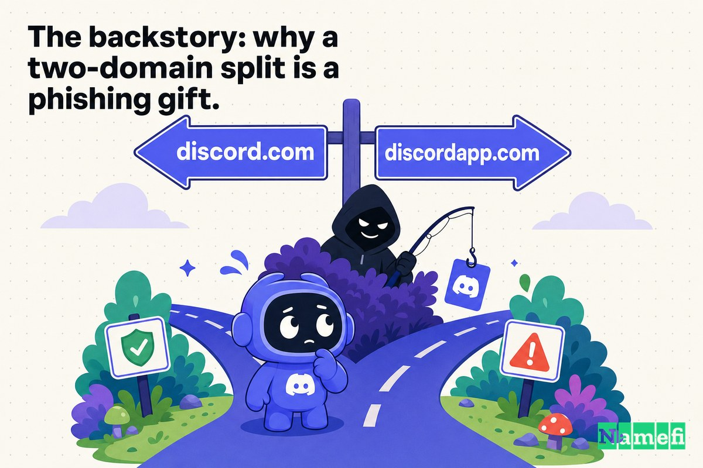
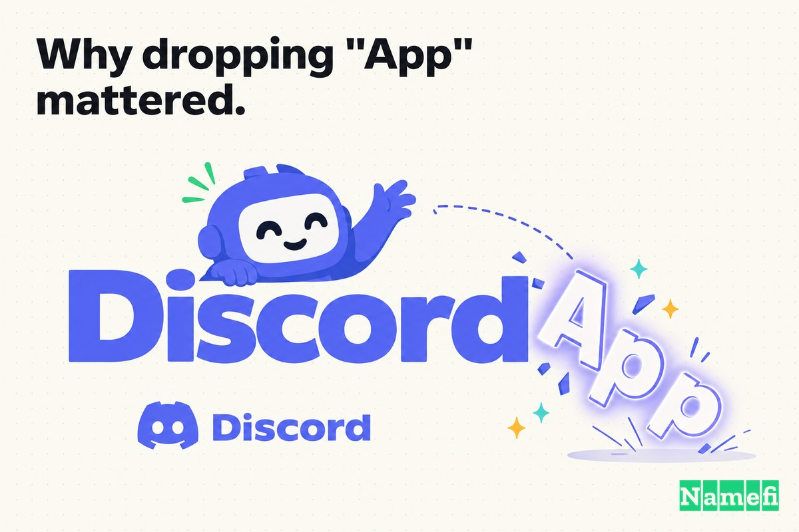
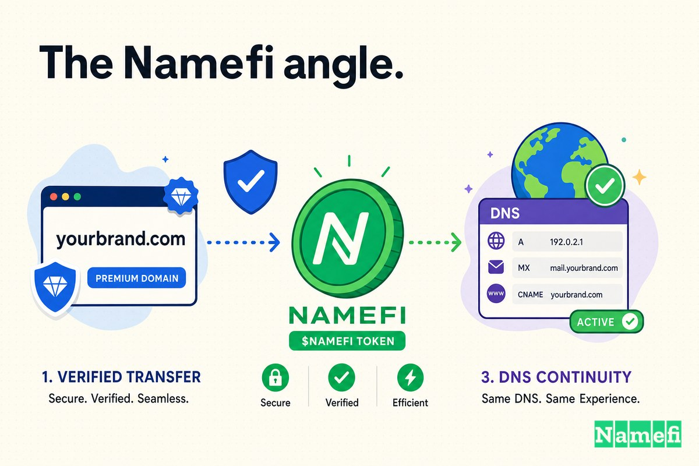

قبل أن يصبح Discord فعلًا نستخدمه يوميًا حين نقول "انضم للسيرفر"، كان يعيش على عنوان أطول بقليل: **DiscordApp.com**.

كلمة "App" دي ما كانتش اختيار تسويقي — كانت حلًا بديلًا مؤقتًا. لما أطلق Jason Citron و Stanislav Vishnevskiy أداة الصوت والدردشة بتاعتهم في مايو 2015، النطاق المطابق تمامًا — Discord.com — كان بالفعل ملكًا لشخص تاني، متسجل من زمن بداية الألفية. فالمنتج اتشحن على الإنترنت وهو شايل هذا المعدِّل الإضافي. وحسب ويكيبيديا، [انطلق Discord رسميًا في مايو 2015 تحت اسم النطاق discordapp.com](https://en.wikipedia.org/wiki/Discord_%28software%29#:~:text=Discord%20was%20publicly%20released%20in%20May%202015%20under%20the%20domain%20name%20discordapp.com). وإحدى الكتابات عن البدايات بتقوله صريح: [كان Discordapp.com هو الرابط الرسمي لـ Discord في سنته الأولى](https://www.remote.tools/discord/when-was-discord-made#:~:text=Discordapp.com).

الفجوة دي بين الاسم اللي الشركة عاوزاه والاسم اللي قدرت توصله — دي واحدة من أكتر المشاكل شيوعًا في تسمية الشركات الناشئة. المنتج كان اسمه Discord من الأول. بس العالم ما كانش يقدر يوصله على Discord.com لسه.

اللي بيخلي قصة Case 13 مختلفة عن قصة "اشتري نطاقك المطابق" العادية هو *الدرزة* اللي خلّفها الحل البديل ده. لمدة خمس سنين، كان Discord شغّال على عنوانين في نفس الوقت — العلامة اللي بيستخدمها (discordapp.com) والعلامة اللي عايزها (discord.com) — وهذا الانقسام بين النطاقين اتضح إنه بالظبط نوع الغموض اللي المحتالون والنصابون ومنتشرو البرامج الخبيثة بيتغذوا عليه. دي قصة ترقية نطاق كانت جزئيًا بسبب نظافة العلامة التجارية وجزئيًا بسبب سد ثغرة أمنية كانت الشركة تعيش معاها من يوم ما انطلقت.

## 2015: الأداة اللي احتاجت اسمًا ما قدرتش تاخده

Discord ما بدأتش كظاهرة استهلاكية واسعة. بدأت كحل لإزعاج محدد.

Citron جه للمشروع ده بفلوس وخبرة مكلّفة. كان أسّس شبكة الألعاب الاجتماعية OpenFeint، و— كما تسجّل ويكيبيديا — [باعها لـ GREE سنة 2011 بـ 104 مليون دولار، واستخدم الفلوس دي لتأسيس استوديو تطوير الألعاب Hammer & Chisel سنة 2012](https://en.wikipedia.org/wiki/Discord_%28software%29#:~:text=later%20sold%20it%20to%20GREE%20in%202011%20for%20%24104%20million%2C%20which%20he%20used%20to%20found%20Hammer%20%26%20Chisel). لعبة الاستوديو ما اشتغلتش، لكن أداة الدردشة اللي الفريق بناها علشان ينسّق الغارات — هي اللي نجحت. الحل البديل بقى هو المنتج.

الاسم اتحدد بدري، لأسباب عادية. حسب ويكيبيديا، [تم اختيار اسم "Discord" لأنه "يبدو كول وله علاقة بالكلام"، وسهل في النطق والتهجئة والحفظ، وكان متاحًا للعلامة التجارية والموقع الإلكتروني](https://en.wikipedia.org/wiki/Discord_%28software%29#:~:text=The%20name%20%22Discord%22%20was%20chosen%20because%20it%20%22sounds%20cool%20and%20has%20to%20do%20with%20talking%22). لاحظ الجزء الأخير — *متاح للعلامة التجارية والموقع الإلكتروني*. كلمة "متاح" بتشتغل كتير في صمت هنا. العلامة التجارية كانت واضحة. أما [.com](/ar/tld/com/) الصافية — فلا.

فالفريق عمل زي ما بتعمل استارتابات لا تُحصى: أضاف معدِّلًا وأطلق المنتج. "Discord" كعلامة تجارية انطلقت بـ "DiscordApp" كعنوان. وانشغلت. قاعدة المستخدمين تضخّمت تقريبًا فورًا. وحسب ويكيبيديا، [بحلول يناير 2016، أعلنت Hammer & Chisel أن Discord استخدمه 3 ملايين شخص، بمعدل نمو مليون شهريًا](https://en.wikipedia.org/wiki/Discord_%28software%29#:~:text=By%20January%202016%2C%20Hammer%20%26%20Chisel%20reported%20Discord%20had%20been%20used%20by%203%20million%20people%2C%20with%20growth%20of%201%20million%20per%20month)، وصل إلى 11 مليون في يوليو من نفس السنة و25 مليون في نهايتها.

هذا المنحنى هو المشكلة. كل واحد من هؤلاء الملايين تعلّم العلامة التجارية على إنها "discordapp.com." كل رابط دعوة، كل سكرين شوت متشارك، كل بوكمارك رسّخ الحل البديل أكتر وأكتر. كل ما معدِّل بيركب أطول، كل ما بيبقى أغلى تشيله — مش بالفلوس، لكن في ذاكرة العضلات لجمهور كتب الكلمة الغلط مية مرة.

## الانتقال إلى Discord.com

Discord ما احتاجتش تغيّر اسمها. المنتج كان دايمًا اسمه Discord. كان بس محتاج يغيّر عنوانه — من DiscordApp.com لـ Discord.com — وعلشان يعمل ده، كان لازم أول حاجة *يمتلك* Discord.com.

وده عمله، بهدوء، سنين قبل ما يستخدمها. النطاق كان [متسجل من سنة 2000](https://www.thedomains.com/2020/05/09/discord/#:~:text=registered%20in%202000)، قبل وجود الشركة بفترة طويلة. وحسب تغطيات صناعة النطاقات، الشركة [اشترت نطاق Discord.com في 2017](https://www.thedomains.com/2020/05/09/discord/#:~:text=acquired%20the%20domain%20Discord.com%20back%20in%202017) — لكنها ما غيّرتش. لفترة، [كان الـ .com بيعمل تحويل redirect لنطاق discordapp.com اللي كانوا بيستخدموه من الأول](https://www.thedomains.com/2020/05/09/discord/#:~:text=the%20.com%20was%20a%20redirect%20to%20the%20discordapp.com%20domain%20they%20have%20used%20since%20the%20start). الشركة كانت تمتلك الاسم النظيف لكنها استمرت في توجيهه للنطاق البديل.

التحول الحقيقي جه في 2020. وكما تلاحظ إحدى التحليلات، بينما بعض المصادر بتحدد الشراء في 2017، [الحقيقة الوحيدة الثابتة هي أن الانتقال للنطاق الجديد حصل في 4 مايو 2020](https://www.domainer.com/blog/discord-com-domain-sale#:~:text=the%20only%20factual%20statement%20is%20that%20the%20move%20to%20the%20new%20domain%20happened%20on%20May%204th%202020). Discord جعلت discord.com هي العنوان الأساسي و— بمنطق — [قررت تحتفظ بالنطاق القديم](https://www.domainer.com/blog/discord-com-domain-sale#:~:text=they%20decided%20to%20keep%20the%20old%20domain%20up) كـ redirect عشان الروابط القديمة ما تنكسرش. والأسماء على السوشيال ميديا تبعت العنوان: الشركة [غيّرت أسماءها على السوشيال من @discordapp لـ @discord فقط](https://www.domainer.com/blog/discord-com-domain-sale#:~:text=changed%20their%20social%20media%20handles%20from%20%40discordapp%20to%20%40discord%20only).

التحويل ما كانش بس شكلي — وصل للبنية التحتية الداخلية كمان. مطوّرو البوتات والمكتبات اضطروا يعدّلوا كودهم، لأن الـ API نفسه كان بيتنقل. القائمون على مكتبة discord.py الشهيرة فتحوا issue للمتابعة بيلاحظوا أن [Discord بتنتقل من discordapp.com لـ discord.com](https://github.com/Rapptz/discord.py/issues/4063#:~:text=Discord%20is%20moving%20from%20discordapp.com%20to%20discord.com)، مع موعد تحويل صارم: [لو النطاق المستخدم للاتصال بسيرفرات discord ما اتغيّرش قبل 7 نوفمبر 2020، العملاء اللي بيستخدموا المكتبة مش هيقدروا يتوصلوا](https://github.com/Rapptz/discord.py/issues/4063#:~:text=is%20not%20changed%20by%20November%207th%202020%20then%20clients%20using%20the%20library%20will%20be%20unable%20to%20connect). "ترقية" النطاق اللي معظم المستخدمين ما لاحظوهاش — بالنسبة للمطوّرين كانت deadline حقيقية.

## القصة الخلفية: ليه انقسام النطاقين هدية للمحتالين؟

هنا الجزء اللي بيخلي Case 13 أكتر من مجرد قصة علامة تجارية أنيقة.

لما شركة بتشتغل تحت نطاقين متشابهين تقريبًا لسنين، بتدرّب مستخدميها على قبول *الاتنين* كشرعيين. "هل discordapp.com هو Discord الحقيقي، ولا discord.com؟" معظم الناس ما تقدرش تقول بثقة — وهذا الغموض بالظبط هو التربة اللي التصيد الاحتيالي بينبت فيها. لو المستخدمين هيثقوا في نطاقين رسميين، هيثقوا في تالت يشبههم. الاختلافات الطفيفة في الاسم — حرف زيادة هنا، كلمة متبدّلة هناك — بتبقى تنكّرات سهلة، لأن الأصيل نفسه جه بأكتر من نكهة.

الخطر ده ما كانش افتراضيًا بالنسبة لـ Discord، وله ذيل طويل. شبكة توصيل المحتوى بتاعة Discord لسه عايشة على الاسم القديم، على **cdn.discordapp.com** — وهذا النطاق بقى واحد من أكتر الأماكن على الإنترنت استخدامًا *لاستضافة* البرامج الخبيثة، بالظبط لأنه يبدو موثوقًا. شركة الأمن Zscaler وثّقت كيف [يمكن للمهاجم رفع ملف خبيث على قناة Discord ومشاركة رابطه العام مع الآخرين — حتى غير مستخدمي Discord يقدروا يحمّلوه](https://www.zscaler.com/blogs/security-research/discord-cdn-popular-choice-hosting-malicious-payloads#:~:text=An%20attacker%20can%20upload%20a%20malicious%20file%20on%20a%20Discord%20channel%20and%20share%20its%20public%20link%20with%20others). والأسوأ، كما وجدوا، [أي ملف بيتبعت على Discord بيفضل موجودًا للأبد، فحتى لو المهاجم مسح الملف داخل Discord، رابطه بيفضل شغّال لتحميل الملف الخبيث](https://www.zscaler.com/blogs/security-research/discord-cdn-popular-choice-hosting-malicious-payloads#:~:text=a%20file%20sent%20from%20Discord%20is%20there%20forever).

شركة استخبارات التهديدات Intel 471 وضّحت ليه *النطاق* نفسه هو السلاح. بعد رفع الملف، [بيتولّد رابط مباشر من المنصة](https://www.intel471.com/blog/how-discord-is-abused-for-cybercrime#:~:text=a%20direct%20link%20is%20generated%20by%20the%20platform)، و[المهاجمون يقدروا بعد كده ينشروا هذه الروابط عن طريق إيميلات التصيد أو السوشيال ميديا أو قنوات تانية](https://www.intel471.com/blog/how-discord-is-abused-for-cybercrime#:~:text=Attackers%20then%20can%20choose%20to%20disseminate%20these%20links%20through%20phishing%20emails%2C%20social%20media%20or%20other%20channels). الرابط بياخد صيغة [https://cdn.discordapp.com/attachments/{channel ID}/{file ID}/{file name}](https://www.intel471.com/blog/how-discord-is-abused-for-cybercrime#:~:text=The%20Discord%20URL%20follows%20the%20https%3A%2F%2Fcdn.discordapp.com%2Fattachments) — نطاق Discord حقيقي، بشهادة TLS حقيقية، بيعدي فلاتر الأمان لأنه [لو نطاق Discord مش محجوب من أدوات الأمان، بيبقى طريقة فعّالة لإيصال المحتوى الضار](https://www.intel471.com/blog/how-discord-is-abused-for-cybercrime#:~:text=If%20the%20Discord%20domain%20isn%27t%20disallowed%20by%20security%20controls%2C%20it%27s%20an%20effective%20way%20to%20deliver%20harmful%20content). وفريق أبحاث Malwarebytes تتبّع نفس النمط، محذّرًا من [حملة تصيد جديدة بتستخدم Discord لإيصال الحمولة الخبيثة](https://www.threatdown.com/blog/new-phishing-campaign-uses-discord-for-payload-delivery/#:~:text=New%20phishing%20campaign%20uses%20Discord%20for%20payload%20delivery) ومنبّهًا إلى أن [المجرمين بيستغلوا Discord لاستضافة البرامج الخبيثة بسبب بنيتها التحتية القوية لـ CDN](https://www.threatdown.com/blog/new-phishing-campaign-uses-discord-for-payload-delivery/#:~:text=Criminals%20abuse%20Discord%20to%20host%20malware%20because%20of%20its%20robust%20CDN%20infrastructure).

تركيز العلامة التجارية المواجِهة للمستخدم على باب واحد وحيد — discord.com — ما بيحلّش استغلال الـ CDN. لكنه بيعمل الحاجة الوحيدة اللي التسويق *يقدر* يعملها للأمن: بيخلي إجابة سؤال "Discord الحقيقية شكلها إيه؟" كلمة واحدة. كل ما قلّت التهجئات الرسمية للعلامة، كل ما قلّت التنكّرات اللي المهاجم يقدر يتخبى وراها.

## الفلوس كانت بتتشال بشكل تاني

من السهل نتعامل مع شراء Discord لـ Discord.com على إنه أمر بديهي — طبعًا الشركة ستمتلك اسمها في النهاية. لكن القرارات اتاخدت في ضباب، مش برؤية استرجاعية واضحة.

اتفرّج على الجدول الزمني. الفريق اشترى Discord.com في 2017، لما كانت Discord تطبيق دردشة للألعاب ينمو بسرعة لكن غير مثبت، سنين قبل انتشاره الواسع في عصر الجائحة وتقييمه بمليارات الدولارات. ثم *احتفظ بالنطاق النظيف كـ redirect* لتلات سنين تقريبًا قبل ما يقلب المعادلة في 2020. هذا الصبر هو الجزء المثير للاهتمام. Discord امتلكت العنوان الأفضل واختارت مرارًا عدم تعطيل منتج شغّال علشان تستخدمه.

ده هو حساب التكلفة الحقيقي لترقية النطاق، وهو نادرًا ما يكون في سعر الشراء. الجزء الصعب هو الترحيل: إعادة توجيه التطبيقات والـ APIs ونطاقات OAuth والباسووردات المحفوظة وصلاحيات المتصفح والروابط العميقة ومنظومة البوتات الخارجية الضخمة — من غير ما تكسر الشيء الحيّ اللي ملايين من الناس بيستخدموه كل يوم. Discord قدرت تشتري Discord.com بفترة طويلة قبل ما تقدر تتنقل إليها. الشراء في 2017 أمّن الخيار؛ التحويل في 2020 نفّذه، لما المنتج بقى مستقرًا بما يكفي لاستيعاب الاضطراب وإلزام موعد نوفمبر 2020 للمطوّرين.

## ليه حذف "App" كان مهمًا

المسافة بين DiscordApp.com وDiscord.com هي تلات حروف. استراتيجيًا، هي المسافة بين *التطبيق* و*المكان*.

**DiscordApp.com** بيسمّي قطعة برمجيات — حاجة بتحمّلها، تطبيق وسط تطبيقات. **Discord.com** بيسمّي وجهة — مكان بتروح له، مجتمع بتنتمي له، فعل ناس بيستخدموه من غير تفكير. واحد بيشير لمنتج. التاني ببساطة *هو* العلامة التجارية. ولما Discord كبرت وعدّت حدود الألعاب لحاجة ناس بيستخدموها في النوادي والفصول الدراسية ومجموعات الأصدقاء، "App" بدأت تحس إنها بقايا من طريقة الشركة في وصف نفسها أول ما بدأت.

| قبل | بعد |
| --- | --- |
| DiscordApp.com | Discord.com |
| بيسمّي "التطبيق" — منتج قابل للتحميل | بيسمّي العلامة التجارية — مكان وفعل |
| يحمل معدِّلًا بديلًا | ما يحمل غير الكلمة نفسها |
| تهجئتان رسميتان على المستخدم الوثوق بهما | باب أمامي واحد أساسي |
| يترك درزة المحتالين يقدروا يقلّدوها | يغلق فجوة "أي واحدة الحقيقية؟" |

هذا هو النمط المتكرر في ترقيات النطاقات: الأسماء المبكّرة *تصف* أو *تؤهّل*؛ الأسماء العظيمة *تملك*. معدِّل زي "App" أو "HQ" أو "Cab" أو "The" هو مدخل معقول لما الاسم النظيف محجوز. يبقى عبئًا — وفي حالة Discord، مسؤولية أمنية صغيرة — في اللحظة اللي الشركة تبقى فيها كبيرة بما يكفي لتكون الكلمة المجرّدة هي الوجهة.

## التسلسل: امتلكه أول، انتقل له لما يبقى آمن

تسلسل العمليات ده يستحق إننا نتمهّل عنده، لأنه بيعكس النصيحة المعتادة للشركات الناشئة بـ "انتقل لنطاقك المطابق في اليوم اللي تحصل عليه."

Discord ما عملتش كده. التسلسل كان:

1. **الاسم اتحدد أول** — "Discord"، اتاخد لأنه سهل الحفظ والعلامة التجارية كانت [متاحة](https://en.wikipedia.org/wiki/Discord_%28software%29#:~:text=The%20name%20%22Discord%22%20was%20chosen%20because%20it%20%22sounds%20cool%20and%20has%20to%20do%20with%20talking%22)، حتى لو الـ .com الصريحة لم تكن كذلك.
2. **المنتج انطلق على معدِّل** — [discordapp.com](https://en.wikipedia.org/wiki/Discord_%28software%29#:~:text=Discord%20was%20publicly%20released%20in%20May%202015%20under%20the%20domain%20name%20discordapp.com)، لأن Discord.com كانت محجوزة من تسجيل يرجع لسنة 2000.
3. **النطاق المطابق اتشترى لكن ظلّ احتياطيًا** — Discord اشترت Discord.com في [2017](https://www.thedomains.com/2020/05/09/discord/#:~:text=acquired%20the%20domain%20Discord.com%20back%20in%202017) وشغّلته كـ [redirect](https://www.thedomains.com/2020/05/09/discord/#:~:text=the%20.com%20was%20a%20redirect%20to%20the%20discordapp.com%20domain%20they%20have%20used%20since%20the%20start)، مش بديلًا.
4. **التحويل حصل لما المنتج قدر يستوعبه** — [الانتقال للنطاق الجديد حصل في 4 مايو 2020](https://www.domainer.com/blog/discord-com-domain-sale#:~:text=the%20only%20factual%20statement%20is%20that%20the%20move%20to%20the%20new%20domain%20happened%20on%20May%204th%202020)، مع موعد تحويل للمطوّرين في 7 نوفمبر 2020.

الدرس مش "أخّر ترقيتك." الدرس إن امتلاك النطاق النظيف والانتقال إليه هما مشروعان منفصلان بمستويي مخاطرة مختلفين. Discord أمّنت الأصل بدري وبرخص، ثم اختارت لحظة الانتقال بعناية — محتفظة بالعنوان القديم كـ redirect عشان ما يتكسرش حاجة.

## النطاق بقى جزء من نظام التشغيل

النطاقات المميزة مهمة لسبب واحد غير مثير للإعجاب: التكرار.

النطاق الأساسي بيظهر في كل مكان الشركة ما تقدرش تتحكم فيه بالكامل — في روابط الدعوة وشاشات موافقة OAuth وعناوين الإيميل والتغطية الصحفية وشريط المتصفح ونتائج البحث وكل مرة حد يقول شفاهيًا "انضم للسيرفر بتاعي." كل تكرار إما بيضيف احتكاك أو يشيله. DiscordApp.com طلبت من الجميع يحملوا تلات حروف زيادة للأبد، *وكمان* علّمت المستخدمين في صمت إن Discord جاية بتهجئتين رسميتين. Discord.com ما طلبتش حاجة وردّت على سؤال الثقة بكلمة واحدة.

تطور العلامة التجارية عزّز العنوان. لما Discord أعادت تموضعها رسميًا بعيدًا عن الألعاب في منتصف 2020 — نفس السنة اللي غيّرت فيها النطاق — قالت لمجتمعها في [مدوّنتها](https://discord.com/blog/your-place-to-talk) إنها [بتطلق موقعًا جديدًا بشعار جديد: مكانك للكلام](https://discord.com/blog/your-place-to-talk#:~:text=we%27re%20launching%20a%20new%20website%20with%20a%20new%20tagline%3A%20Your%20place%20to%20talk). واعترفت إن [طريقتنا في الحديث عن أنفسنا بعتت رسالة غلط للعالم](https://discord.com/blog/your-place-to-talk#:~:text=the%20way%20we%20talked%20about%20ourselves%20sent%20the%20wrong%20signal%20to%20the%20world). اسم بيسمّي نفسه "App" بعت إشارة أضيق من شركة عايزة تكون [أكثر ترحيبًا وشمولية وجديرة بالثقة](https://discord.com/blog/your-place-to-talk#:~:text=more%20welcoming%2C%20more%20inclusive%2C%20and%20more%20trustworthy). "جديرة بالثقة" هو الكلمة المفتاحية — ونطاق أساسي واحد وحيد هو جزء من طريقة العلامة لتكسبها.

## إيه اللي المؤسسين لازم يتعلموه من Case 13

الدرس السهل — "امتلك الـ .com المطابق قبل الإطلاق" — هو الغلط، لأن Discord ما قدرتش. الدروس الأكثر فائدة بتتعلق بالمعدِّلات والتوقيت والأمان:

1. **المعدِّل مدخل ممتاز.** "App" سمحت لـ Discord تنطلق باسمها الحقيقي لما الكلمة المجرّدة كانت محجوزة لمسجِّل من سنة 2000. الإطلاق على DiscordApp.com ما كانش فشلًا؛ كان طريقة معقولة لشحن المنتج.
2. **شراء النطاق النظيف والانتقال إليه قرارين مختلفين.** Discord اشترت Discord.com في 2017 وما غيّرتش لحد 2020. تأمين الأصل اشترى خيارًا؛ تنفيذه قدر ينتظر اللحظة الآمنة.
3. **عُدّ الدرزات، مش بس الحروف.** تكلفة تشغيل نطاقين مش بس تلات حروف زيادة — هي الغموض. تهجئتان رسميتان بيعلّموا المستخدمين يثقوا في المتشابهات، والمتشابهات هي اللي المحتالون بيشحنوها.
4. **باب أمامي واحد هو ميزة أمنية.** التركيز على discord.com ما وقفش استغلال الـ CDN على cdn.discordapp.com، لكنه خلّى إجابة "Discord الحقيقية شكلها إيه؟" كلمة واحدة — وهذا الوضوح مش سهل على المهاجمين ينتحلوه.

ترقية النطاق ما خلّتش Discord تكسب. المنتج والتوقيت والجائحة ومجتمع متفجّر عملوا أكتر بكتير. لكن discord.com خلّت العلامة أنظف في الكتابة وأسهل في الثقة وأصعب في التزوير — وده بالنسبة لمنصة مبنية على روابط الغرباء بيضغطوا عليها، ليست حاجة صغيرة.

## زاوية Namefi

قصة Discord في جوهرها هي مشكلة *تحكّم واستمرارية*.

القرار الاستراتيجي ما كانش موضع شك أبدًا — طبعًا منصة اسمها Discord لازم تعيش على Discord.com. العمل الحقيقي كان في كل حاجة حوالين الأصل: الاستحواذ على نطاق مميز مسجَّل من قرنين، ثم إثبات الملكية، والاحتفاظ به بأمان كـ redirect، وأخيرًا ترحيل منتج حيّ — تطبيقات وAPIs وOAuth وبيانات اعتماد محفوظة ومنظومة بوتات خارجية — عليه من غير ما يكسر حاجة أو، والأهم، يفتح نافذة للمنتحلين أثناء التحويل. هذه النقطة الأخيرة هي الخيط الأمني الجاري في القضية كلها: الغموض حول *أي نطاق هو حقًا نطاقك* بالظبط هو اللي المهاجمون بيستغلوه.

[Namefi](https://namefi.io) مبنية على فكرة إن النطاقات لازم تتصرف كأصول أصيلة على الإنترنت. الملكية المُرمَّزة تقدر تجعل التحكم في النطاقات أسهل في التحقق والتحويل والتكامل مع سير العمل الحديثة مع البقاء متوافقة مع DNS — محوِّلة الأجزاء البطيئة والثقيلة على الثقة في صفقة زي دي (التأكد من ملكية من يملك ماذا، نقل الأصل، والحفاظ على الاستمرارية خلال الترحيل) لشيء أقرب لمعاملة نظيفة قابلة للتدقيق. لما ملكية اسم تبقى قابلة للإثبات ومحمولة، "هل دي Discord الحقيقية؟" بتبقى أسهل في الإجابة — للشركة ولكل واحد بيضغط على روابطها.

Discord.com تبدو حتمية دلوقتي لأن Discord بقت ضخمة. لكن الدرس بياجي قبل: لما اسم هيحمل الأعمال كلها — وخصوصًا لما نطاق بديل بيترك درزة النصابين يقدروا يتسللوا من خلالها — النطاق ما هوش ديكور. هو الباب الأمامي، ومحتاج يكون واحد بس.

## المصادر وقراءة إضافية

- ويكيبيديا — [Discord (software)](https://en.wikipedia.org/wiki/Discord_%28software%29#:~:text=Discord%20was%20publicly%20released%20in%20May%202015%20under%20the%20domain%20name%20discordapp.com)
- The Domains — [Discord now using Discord.com, the domain is no longer just a redirect](https://www.thedomains.com/2020/05/09/discord/#:~:text=acquired%20the%20domain%20Discord.com%20back%20in%202017)
- Domainer — [How the Discord.com Domain Sale Reshaped the App](https://www.domainer.com/blog/discord-com-domain-sale#:~:text=the%20only%20factual%20statement%20is%20that%20the%20move%20to%20the%20new%20domain%20happened%20on%20May%204th%202020)
- GitHub (discord.py) — [Change of Discord domain from discordapp.com to discord.com (Issue #4063)](https://github.com/Rapptz/discord.py/issues/4063#:~:text=Discord%20is%20moving%20from%20discordapp.com%20to%20discord.com)
- Discord Blog — [Your Place to Talk](https://discord.com/blog/your-place-to-talk#:~:text=we%27re%20launching%20a%20new%20website%20with%20a%20new%20tagline%3A%20Your%20place%20to%20talk)
- Zscaler — [Discord CDN: A Popular Choice for Hosting Malicious Payloads](https://www.zscaler.com/blogs/security-research/discord-cdn-popular-choice-hosting-malicious-payloads#:~:text=An%20attacker%20can%20upload%20a%20malicious%20file%20on%20a%20Discord%20channel%20and%20share%20its%20public%20link%20with%20others)
- Intel 471 — [How Discord is abused for cybercrime](https://www.intel471.com/blog/how-discord-is-abused-for-cybercrime#:~:text=The%20Discord%20URL%20follows%20the%20https%3A%2F%2Fcdn.discordapp.com%2Fattachments)
- ThreatDown by Malwarebytes — [New phishing campaign uses Discord for payload delivery](https://www.threatdown.com/blog/new-phishing-campaign-uses-discord-for-payload-delivery/#:~:text=Criminals%20abuse%20Discord%20to%20host%20malware%20because%20of%20its%20robust%20CDN%20infrastructure)
- Remote Tools — [When was Discord made?](https://www.remote.tools/discord/when-was-discord-made#:~:text=Discordapp.com)
- Discord Support — [Discordapp.com is now Discord.com](https://support.discord.com/hc/en-us/articles/360042987951-Discordapp-com-is-now-Discord-com)
