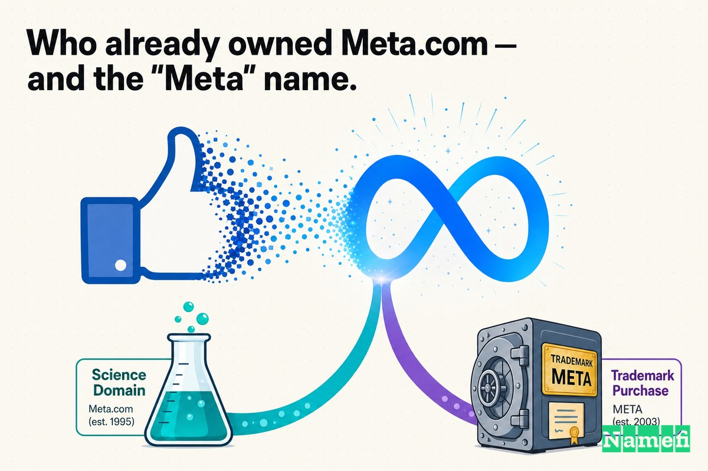
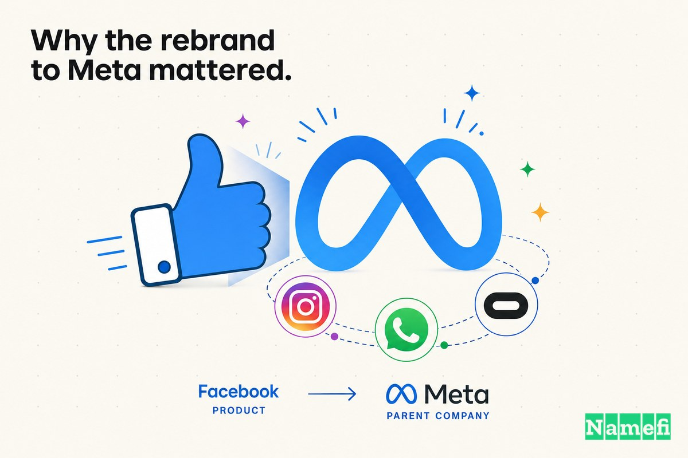
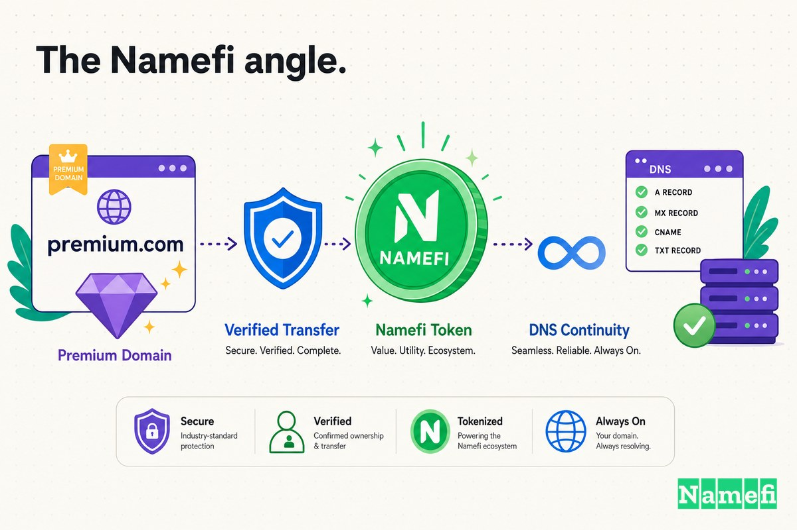

معظم قصص إعادة التسمية في هذه السلسلة بتبدأ بشركة بقت أكبر من اسمها. لكن الحالة السابعة معكوسة تماماً: شركة ضخمة لدرجة إن اسمها بقى فعلاً في اللغة اليومية وصداعاً للجهات التنظيمية ومصطلحاً شعبياً — قررت إنها محتاجة *اسم جديد* رغم كل ده، اسم أكبر بما يكفي ليحتوي مستقبلاً ما اتبنيش بعد.

في 28 أكتوبر 2021، في فعالية Connect، أعلنت الشركة المالكة لـ Facebook إنها لم تعد — على مستوى الشركة — Facebook. TechCrunch لخّصت الأمر ببساطة: [بعد 17 سنة باسم Facebook، الشركة الأم صاحبة Facebook وInstagram وWhatsApp وOculus ليها اسم جديد](https://techcrunch.com/2021/10/28/facebook-changes-its-corporate-branding-to-meta/#:~:text=After%2017%20years%20of%20being%20called%20Facebook). الاسم ده كان **Meta**، والعنوان كان **Meta.com**.

بس ده مش قصة تقاعد Facebook.com. ماكانش كده. التفصيلة الأساسية اللي كتير ناس بتفوتها هي إن **الشركة الأم بس هي اللي اتغيرت**. زي ما قال زوكربيرج في نفس الإعلان، [تطبيقاتنا وعلاماتنا التجارية — مش هتتغير](https://techcrunch.com/2021/10/28/facebook-changes-its-corporate-branding-to-meta/#:~:text=Our%20apps%20and%20our%20brands%20%E2%80%94%20they%E2%80%99re%20not%20changing%20either). تطبيق Facebook فضل Facebook. Facebook.com فضل Facebook.com. اللي انتقل كان *الهوية المؤسسية* — الشركة القابضة، ورمز السهم، والترويسة — إلى نطاق الشركة كانت بالفعل تتحكم فيه من خلال مشروع تاني لزوكربيرج تماماً.

الجزء ده هو القصة الحقيقية للنطاق. Meta.com ماكانش شراء عشوائي في آخر لحظة بملايين الدولارات. كان أصلاً مستعاراً من محرك بحث علمي، مقرون بصفقة *منفصلة* بـ60 مليون دولار لشراء كلمة "Meta" من بنك إقليمي في ساوث داكوتا.

## عصر Facebook باعتباره الشركة الأم

لمدة 17 سنة، كان "Facebook" هو المنتج والشركة الأم في نفس الوقت. تطبيق Facebook، وشركة Facebook، وسهم Facebook — كلها كلمة واحدة، ونطاق واحد. الشركة أنفقت فلوس كتير على مر السنين عشان تجعل الاسم ده هو الأصيل والكانوني، منها [الـ200,000 دولار اللي دفعتهم مقابل Facebook.com سنة 2005](https://www.informationweek.com/it-sectors/facebook-paid-8-5-million-for-fb-com#:~:text=Back%20in%20August%202005%2C%20TheFacebook%20purchased%20Facebook.com%20for%20%24200%2C000) (الحالة الأولى في السلسلة دي) و[الـ8.5 مليون دولار اللي دفعتهم لاحقاً مقابل FB.com](https://www.nbcbayarea.com/news/local/facebook-paid-big-bucks-to-farm-bureau/1913822/#:~:text=Farm%20Bureau%20officials%20said%20the%20organization%20earned%20%248.5%20million).

بحلول 2021، بقت الهوية المتكاملة دي مشكلة. تطبيق Facebook *كتطبيق* كان واحد من عدة منصات ضخمة — جنباً لجنب مع Instagram وWhatsApp وOculus — لكن اسمه كان مسيطر عليهم كلهم. لما التطبيق استقطب جدلاً، الجدل انتقل للشركة الأم. وكانت الشركة الأم عايزة تتكلم عن حاجة التطبيق ما يقدرش يحتويها: الميتافيرس.

شركة مش قادرة تقول بمصداقية "إحنا أكبر من منتجنا الأشهر" طالما اسم المنتج ده هو نفس اسم الشركة ونطاقها ورمز سهمها. عشان تفصل بينهم، احتاجت Facebook هوية على مستوى الشركة الأم تعيش في مكان غير Facebook.com.

## 28 أكتوبر 2021: إعادة التسمية للميتافيرس والانتقال إلى Meta.com

إعادة التسمية اتقدمت كتحول، مش تراجع. زوكربيرج صاغ مستقبل الشركة كله حول كلمة واحدة: [من دلوقتي، هنكون الميتافيرس-أولاً، مش Facebook-أولاً](https://techcrunch.com/2021/10/28/facebook-changes-its-corporate-branding-to-meta/#:~:text=From%20now%20on%2C%20we%E2%80%99re%20going%20to%20be%20metaverse-first%2C%20not%20Facebook-first). في الإعلان الرسمي، قالت الشركة إن [هدف Meta هيكون تحويل الميتافيرس لحقيقة](https://about.fb.com/news/2021/10/facebook-company-is-now-meta/#:~:text=Meta%E2%80%99s%20focus%20will%20be%20to%20bring%20the%20metaverse%20to%20life) ووصفت كيف [الميتافيرس هيحسسك إنه مزيج من التجارب الاجتماعية الأونلاين الحالية](https://about.fb.com/news/2021/10/facebook-company-is-now-meta/#:~:text=The%20metaverse%20will%20feel%20like%20a%20hybrid%20of%20today%E2%80%99s%20online%20social%20experiences). الاسم نفسه اتاختار عشان يعبر عن الطموح: Meta، من الكلمة الإغريقية بمعنى "ما وراء". حتى رمز السهم في البورصة كان مفروض يتغير — الشركة قالت إنها بتنوي [تبدأ التداول تحت رمز السهم الجديد المحجوز MVRS في 1 ديسمبر](https://about.fb.com/news/2021/10/facebook-company-is-now-meta/#:~:text=start%20trading%20under%20the%20new%20stock%20ticker%20we%20have%20reserved%2C%20MVRS%2C%20on%20December%201).

والهوية الإلكترونية للشركة انتقلت إلى Meta.com — وهو نطاق، في يوم الإعلان، غيّر بهدوء المكان اللي بيشاور عليه. Domain Name Wire رصدت الأمر في الوقت الحقيقي: [في لحظة ما اليوم، وقف Meta.com عن إعادة التوجيه إلى Meta.org](https://domainnamewire.com/2021/10/28/yes-facebook-chose-meta-for-its-new-name-and-forwards-meta-com/#:~:text=At%20some%20point%20today%2C%20Meta.com%20stopped%20forwarding%20to%20Meta.org)، وبدأ النطاق [يعيد التوجيه إلى صفحة داخل موقع Facebook.com](https://domainnamewire.com/2021/10/28/yes-facebook-chose-meta-for-its-new-name-and-forwards-meta-com/#:~:text=now%20forwards%20to%20a%20page%20within%20the%20Facebook.com%20website) عن الميتافيرس. التقرير نفسه أشار إلى الطُرفة اللي جعلت إعادة التسمية دي سلسة لوجستياً: [لأن كيان مرتبط بمارك زوكربيرج كان يمتلك Meta.com أصلاً، الأمر كان هيكون سهل جداً على Facebook تتسمى Meta](https://domainnamewire.com/2021/10/28/yes-facebook-chose-meta-for-its-new-name-and-forwards-meta-com/#:~:text=Because%20a%20Mark%20Zuckerberg%20related%20entity%20owned%20Meta.com%20already).

ده هو الفرق بين الحالة السابعة وتقريباً كل قصة نطاقات تانية: الشركة ماكانتش محتاجة *تدور* على مالك Meta.com تحت ضغط المواعيد. المالك كان، بشكل أو بآخر، من العيلة.

## مين كان يمتلك Meta.com أصلاً — واسم "Meta"

Meta.com عاش حياة طويلة غير مثيرة قبل ما يبقى الباب الرئيسي لشركة بتريليون دولار. النطاق [اتسجل سنة 1991](https://smartbranding.com/the-many-lives-of-a-domain-name/#:~:text=Registered%20in%201991)، وعلى مر السنين أشار لموقع أخبار عقارية، ثم لشركة فعاليات — تاريخ Smart Branding بيذكر فترة [إعادة التوجيه لـMeta Productions, LLC](https://smartbranding.com/the-many-lives-of-a-domain-name/#:~:text=redirecting%20users%20to%20Meta%20Productions%2C%20LLC). ثم، زي ما التاريخ بيسجل، [حصل تغيير مهم في أوائل 2017 لما Meta.com بدأ يشاور على منصة اكتشاف علمي معروفة باسم Meta](https://smartbranding.com/the-many-lives-of-a-domain-name/#:~:text=A%20significant%20change%20occurred%20in%20early%202017%20when%20Meta.com%20began%20pointing%20to%20a%20scientific%20discovery%20platform%20known%20as%20Meta).

المنصة العلمية دي هي المفتاح. في يناير 2017، أعلنت مبادرة تشان زوكربيرج — المنظمة الخيرية اللي أسسها مارك زوكربيرج وبريسيلا تشان — إنها [استحوذت على Meta، شركة ناشئة لمحرك بحث علمي مدعوم بالذكاء الاصطناعي](https://techcrunch.com/2017/01/23/chan-zuckerberg-initiative-meta/#:~:text=The%20Chan%20Zuckerberg%20Initiative%20is%20acquiring%20Meta%2C%20an%20AI-powered%20research%20search%20engine%20startup) بتساعد العلماء على [البحث وقراءة وربط أكتر من 26 مليون ورقة بحثية علمية](https://techcrunch.com/2017/01/23/chan-zuckerberg-initiative-meta/#:~:text=search%2C%20read%20and%20tie%20together%20more%20than%2026%20million%20science%20research%20papers). وعدت CZI بـ[إتاحة أداتها مجاناً للجميع](https://techcrunch.com/2017/01/23/chan-zuckerberg-initiative-meta/#:~:text=will%20make%20its%20tool%20free%20to%20all). الشركة الناشئة العلمية دي [كانت تتحكم في رابط meta.org](https://www.vice.com/en/article/zuckerbergs-foundation-kills-meta-science-company-on-day-of-facebook-rebrand/#:~:text=controls%20the%20URL%20meta.org) — وزي ما Domain Name Wire أكدت، [Meta.com كان بيعيد التوجيه إلى Meta.org، موقع مشروع اسمه Meta من مبادرة تشان زوكربيرج](https://domainnamewire.com/2021/10/28/yes-facebook-chose-meta-for-its-new-name-and-forwards-meta-com/#:~:text=Meta.com%20was%20forwarding%20to%20Meta.org%2C%20the%20website%20for%20a%20project%20called%20Meta).

يعني النطاق جه عن طريق الخيرية. أما *[العلامة التجارية](/ar/glossary/trademark/)* فجات عن طريق بنك. Meta.com وأسم العلم كانوا أصلاً مجاوراً لزوكربيرج، لكن الحقوق التجارية العالمية لكلمة "Meta" كانت مع **Meta Financial Group**، شركة مصرفية قابضة في ساو فولز، ساوث داكوتا (الشركة الأم لـMetaBank). رويترز كشفت المشتري: [Meta Platforms Inc، مالكة منصة التواصل الاجتماعي Facebook، وراء صفقة بـ60 مليون دولار لشراء أصول العلامة التجارية للبنك الإقليمي الأمريكي Meta Financial Group](https://kfgo.com/2021/12/13/exclusive-facebook-owner-is-behind-60-million-deal-for-meta-name-rights/#:~:text=Meta%20Platforms%20Inc%2C%20the%20owner%20of%20social%20media%20platform%20Facebook%2C%20is%20behind%20a%20%2460%20million%20deal). الصفقة مرّت عبر شركة وهمية في ديلاوير: [شركة ديلاوير اسمها Beige Key LLC وافقت على شراء الحقوق العالمية لأسماء الشركة بـ60 مليون دولار نقداً](https://kfgo.com/2021/12/13/exclusive-facebook-owner-is-behind-60-million-deal-for-meta-name-rights/#:~:text=a%20Delaware%20company%20called%20Beige%20Key%20LLC%20agreed%20to%20acquire%20the%20worldwide%20rights)، وأكد متحدث Meta إن [Beige Key تابعة لنا واستحوذنا على أصول العلامة التجارية دي](https://kfgo.com/2021/12/13/exclusive-facebook-owner-is-behind-60-million-deal-for-meta-name-rights/#:~:text=Beige%20Key%20is%20affiliated%20with%20us%20and%20we%20have%20acquired%20these%20trademark%20assets).

الـ60 مليون دولار دي اشترت أكتر من مجرد شعار. تغطية ساو فولز وضّحت الحجم الكامل للاتفاقية: Meta Financial ستُسند [أسماء الشركة وأسماؤها التجارية، بما فيها MetaBank، إلى Meta Platforms](https://siouxfalls.business/money-for-meta-facebook-paying-sioux-falls-company-60m-for-trademark-name/#:~:text=It%20will%20assign%20the%20company%E2%80%99s%20names%20and%20trade%20names%2C%20including%20MetaBank%2C%20to%20Meta%20Platforms)، بالإضافة إلى [أسماء النطاقات وحسابات التواصل الاجتماعي](https://siouxfalls.business/money-for-meta-facebook-paying-sioux-falls-company-60m-for-trademark-name/#:~:text=domain%20names%20and%20social%20media%20accounts) — و[الاتفاقية أتاحت سنة للتخلص التدريجي من اسم Meta](https://siouxfalls.business/money-for-meta-facebook-paying-sioux-falls-company-60m-for-trademark-name/#:~:text=The%20agreement%20allows%20a%20year%20for%20phasing%20out%20the%20Meta%20name) من جانب البنك. (البنك لاحقاً أعاد تسمية نفسه Pathward.)

## الأموال كانت تبدو مختلفة وقتها

مغري تقرأ "60 مليون دولار لاسم" وتحكم إن Facebook كانت بتعرض عضلاتها. لكن هيكل الصفقة بيكشف شركة بتدير مخاطر، مش بس بتنفق.

إيداع Meta Financial في هيئة الأوراق المالية الأمريكية وضّح الآليات، المنفّذة في 7 ديسمبر 2021: البنك هيستلم [50,000,000 دولار عند توقيع وتسليم الاتفاقية](https://www.sec.gov/Archives/edgar/data/907471/000110465921148898/tm2134686d1_8k.htm#:~:text=%2450%2C000%2C000%20upon%20execution)، مع [10,000,000 دولار محتجزة في حساب ضمان](https://www.sec.gov/Archives/edgar/data/907471/000110465921148898/tm2134686d1_8k.htm#:~:text=%2410%2C000%2C000%20will%20be%20paid%20to%20and%20held%20in%20escrow) عند وكيل طرف ثالث، ما تتحررش إلا بعد ما البنك يشهد إن فترة التخلص التدريجي اكتملت. بمعنى تاني، 10 ملايين دولار من السعر كانت مشروطة بإن Meta Financial توقف فعلاً استخدام الاسم — Meta ماكانتش بس بتشتري كلمة، كانت بتشتري الخروج الهادئ للكيان التجاري الوحيد البارز الآخر اسمه "Meta" في أمريكا.

قياساً بحجم الشركة، الـ60 مليون دولار كانت هامش خطأ. لكن *شكل* الإنفاق هو الدرس: هوية عالمية نظيفة تستحق فلوس حقيقية، والجزء المعقد مش السعر اللي بيتصدّر الأخبار — ده تنظيف كل مطالبة منافسة على الاسم عشان العلامة الجديدة تكون مرجعية وغير متنازع عليها في كل مكان في وقت واحد.

ده برضه السبب اللي خلّى شركة البحث العلمي "Meta" لازم تروح. في نفس يوم إعادة تسمية Facebook، نشرت Vice إن [المبادرة أعلنت إنها ستُغلق بحلول 2022](https://www.vice.com/en/article/zuckerbergs-foundation-kills-meta-science-company-on-day-of-facebook-rebrand/#:~:text=the%20Initiative%20announced%20it%20will%20shut%20down%20by%202022) — والمقال لاحظ بسخرية إن [Facebook — أو قصدي، Meta — يمتلك meta.com](https://www.vice.com/en/article/zuckerbergs-foundation-kills-meta-science-company-on-day-of-facebook-rebrand/#:~:text=Facebook%E2%80%94er%2C%20Meta%E2%80%94owns%20meta.com). النطاق تحرر بإغلاق المشروع اللي كان بيشاور عليه.

## ليه إعادة التسمية إلى Meta كانت مهمة

الفجوة بين Facebook.com وMeta.com مش ترقية من اسم أسوأ لاسم أحسن. الاتنين نطاقات ممتازة. التغيير *هيكلي*: بيفصل هوية المنتج عن هوية الشركة الأم اللي كانت متلاحمة لمدة 17 سنة.

| قبل | بعد |
| --- | --- |
| Facebook.com (الشركة + التطبيق) | Meta.com (الشركة) + Facebook.com (التطبيق) |
| الشركة الأم متسماة باسم منتج واحد | الشركة الأم متسماة باسم يمثّل كل المحفظة |
| الجدل على التطبيق بيلصق بعلامة الشركة | علامة الشركة الأم تقف طبقة فوق أي تطبيق منفرد |
| الهوية مرتبطة بالشبكات الاجتماعية | الهوية مرتبطة بـ"الميتافيرس"، مفتوحة الأفق |
| اسم واحد يحمل كل حاجة | اسم الشركة القابضة بيخلّي العلامات الفرعية تتنفس |

ده تحرك مختلف عن حذف كلمة "The" من TheFacebook.com أو "Cab" من UberCab.com. التحسينات دي جعلت علامة واحدة *أنظف*. إعادة تسمية Meta بنت *سقفاً* — اسم شركة أم يقدر يعلو فوق Facebook وInstagram وWhatsApp وOculus وأي حاجة جاية، من غير ما يبقى أي منها هو الحاجة اللي سُمّيت الشركة كلها باسمها.

للمؤسسين، الدرس مش "أعد تسمية شركتك بمقطع إغريقي." الدرس إن في مرحلة معينة يجب إن اسم المنتج واسم الشركة *يوقفوا* يبقوا نفس الكلمة — ولما اليوم ده يجي، الشركة محتاجة نطاقاً على مستوى الشركة الأم تقدر فعلاً تتحكم فيه.

## التسلسل: استعرت النطاق، ثم اشتريت الاسم

ترتيب العمليات هو اللي خلّى الحالة السابعة سلسة بشكل غير عادي.

Meta ماأعلنتش اسماً جديداً وبعدين اندفعت تبحث عن النطاق. القطع اتحضّرت أولاً، في تسلسل ما تقدرش تقدر تعيده معظم الشركات:

1. **النطاق كان في العيلة أصلاً.** Meta.com كان بيعيد التوجيه إلى meta.org، مشروع علم CZI — كيان مرتبط بزوكربيرج. السيطرة على العنوان كانت موجودة قبل ما إعادة التسمية تتصبح عامة.
2. **العلامة العلمية المنافسة اتقفّلت في وقتها.** أعلنت Meta العلمية إغلاقها في يوم إعادة التسمية، مُحرِّرةً الاسم ووجهة النطاق.
3. **العلامة التجارية اتشترت بشكل منفصل وسري.** شركة Beige Key الوهمية فاوضت بهدوء على صفقة Meta Financial بـ60 مليون دولار عشان إعادة التسمية ماتتكشفش بخلاف عام على الاسم.
4. **إعادة التوجيه اتقلبت في يوم الإعلان.** Meta.com وقف عن الإشارة لـmeta.org وبدأ يشاور على صفحة الميتافيرس — التبديل الظاهر اللي خلّى إعادة التسمية تبدو فورية.

لاحظ إن اللي عادةً بيكون مملوكاً خارجياً وبطيئاً في كل الحالات التانية في السلسلة دي — *النطاق* — كان هنا الجزء السهل. الجزء الصعب، المليان فلوس ومحامين، كان *العلامة التجارية*، المملوكة لبنك لا علاقة له بالموضوع. Meta كانت لازم تنهي الاتنين، لكنها رتّبتهم عشان الجمهور ما يشوفش غير تبديل واحد نظيف.

## النطاق أصبح جزءاً من نظام التشغيل

نطاق الشركة الأم مش زينة. بعد ما استقرت إعادة التسمية، بقى على Meta.com يعمل الشغل الهادئ اللا نهائي اللي بيعمله أي نطاق أساسي:

- هو ترويسة الاتصالات المؤسسية وغرفة الأخبار.
- هو الهوية اللي يخاطب بها المستثمرون والجهات التنظيمية الشركة.
- هو المظلة فوق Facebook.com وInstagram.com وWhatsApp.com وغيرهم.
- هو المكان اللي تتحكى فيه قصة "الميتافيرس-أولاً" من غير ما كلمة "Facebook" تكون في الرابط.

النقطة الأخيرة دي هي السبب الكامل للانتقال. كل مرة كانت الشركة عايزة تتكلم عن مستقبلها على ترويستها الخاصة، النطاق القديم كان بيجرّ اسم المنتج الأكتر جدلاً مرة تانية في الجملة. Meta.com أعطى الشركة الأم مكاناً تقف فيه ما يكونش متسمّى بأي تطبيق منفرد — بينما Facebook.com فضل يعمل شغله هو، من غير تغيير، لمليارات المستخدمين اللي ما احتاجوش يفكروا في إعادة التسمية أصلاً.

العبقرية مكانتش في دفع ثمن Meta.com. كانت في امتلاكه أصلاً. الشغل كان إن، في يوم واحد، تقدر الشركة الأكتر مراقبةً في العالم تغيّر اسمها المؤسسي من غير نزاع على نطاق، أو قضية علامة تجارية، أو إعادة توجيه متعطلة.

## اللي لازم يتعلمه المؤسسون من الحالة السابعة

النسخة السهلة من القصة دي — "Facebook أصبح Meta" — بتخبّي الدروس المفيدة. الدروس الحقيقية عن *الفصل* و*التسلسل*:

1. **عارف إمتى اسم المنتج لازم يوقف يبقى اسم الشركة.** لمدة 17 سنة كانوا كلمة واحدة. لما احتاجت الشركة الأم تكون أكبر من تطبيقها الأشهر، الأسماء — والنطاقات — كان لازم تنفصل. معظم الشركات تصطدم بنسخة أصغر من ده لما منتج ثاني يبقى بنفس أهمية الأول.
2. **نطاق الشركة الأم أصل مختلف عن نطاق المنتج.** Facebook.com بيسمّي التطبيق. Meta.com بيسمّي الشركة القابضة. المؤسسون اللي بيبنوا محفظة منتجات لازم يُؤمّنوا اسماً نظيفاً على مستوى الشركة الأم *قبل* ما يطلبه الهيكل التنظيمي، مش في أزمة.
3. **تنظيف الاسم أصعب من شراء النطاق.** Meta كانت تتحكم في Meta.com أصلاً. الجزء المكلف والبطيء كان العلامة التجارية — شراء حقوق البنك بـ60 مليون دولار وإغلاق العلامة العلمية. نطاق ممتاز بتملكه بلا قيمة لو حد تاني بيمتلك *الكلمة* تجارياً.
4. **رتّب الأجزاء المتحركة عشان الجمهور يشوف تبديلاً واحداً نظيفاً.** إعادة التوجيه، وصفقة العلامة التجارية، وإغلاق المشروع العلمي، والإعلان، كلها اتنسّقت عشان في 28 أكتوبر كل حاجة تبدو فورية. وراء ده شهور من الشغل غير العلني لتنظيف المطالبات.

Meta ماانتصرتش بسبب نطاق. كانت انتصرت أصلاً، على ظهر Facebook.com. إعادة التسمية كانت عشان تعطي *الرهان القادم* اسماً وعنواناً ما تقدرش العلامة القائمة تقيّده.

## زاوية Namefi

لو شلنا الميتافيرس جانباً، الحالة السابعة دي دراسة في كل حاجة بتخلّي صفقات النطاق-مع-الاسم صعبة — وتلميح لكيف ممكن تبقى أسهل.

شوف قد إيه خيوط منفصلة ومحمّلة باحتكاك لازم Meta تنسّق بينها: نطاق محتجز من كيان مملوك لمنظمة خيرية، بيعيد التوجيه لـ*نطاق ثاني* (meta.org)؛ علامة تجارية تجارية منافسة مملوكة لبنك، اتنظّفت عبر شركة وهمية سرية بـ60 مليون دولار مع 10 ملايين في حساب ضمان مشروط بإنهاء استخدام الاسم؛ إعادة توجيه لازم تتقلب في تاريخ محدد؛ وعلامة تجارية لازم تكون نظيفة عالمياً عشان الهوية الجديدة تكون آمنة في كل مكان. حتى لشركة عندها محامين بلا حدود، إثبات مين يمتلك إيه، والاتفاق على القيمة، وهيكلة حساب الضمان، ونقل السيطرة بنظافة، احتاج شركة LLC في ديلاوير وإيداع في هيئة الأوراق المالية عشان يظهر للعلن.

[Namefi](https://namefi.io) مبنية على فكرة إن النطاقات لازم تتصرف كأصول أصيلة للإنترنت. الملكية عبر الرمز الرقمي ممكنة تجعل التحكم في النطاق أسهل في التحقق والنقل والتكامل مع سير العمل الحديثة مع الاحتفاظ بالتوافق مع DNS — محوّلةً أعقد أجزاء صفقة زي دي (مين يمتلك فعلاً Meta.com، إيه قيمة الاسم، إزاي تنقله من غير ما تعطّل إعادة التوجيه، إزاي تُحرّر حساب الضمان بشرط قابل للتحقق) لحاجة أقرب لمعاملة نظيفة وقابلة للمراجعة والبرمجة.

Meta.com يبدو حتمياً دلوقتي لأن Meta أصبحت ضخمة. لكن الدرس بيوصل قبل كده: لما شركة تقرر إن هويتها الأم لازم تتجاوز منتجها الأشهر، النطاق والاسم اللي وراه مش زينة. هما الأساس اللي الفصل الجديد هيُبنى عليه — وهما يستحقوا التنظيف والضمان والتنسيق بنفس الاهتمام اللي أنفقته Meta عشان تجعل إعادة التسمية الواحدة تبدو تبديلاً واحداً سلساً.

## المصادر وللمزيد من القراءة

- Meta Newsroom — [The Facebook Company Is Now Meta](https://about.fb.com/news/2021/10/facebook-company-is-now-meta/#:~:text=Meta%E2%80%99s%20focus%20will%20be%20to%20bring%20the%20metaverse%20to%20life)
- TechCrunch — [Facebook changes its corporate branding to Meta](https://techcrunch.com/2021/10/28/facebook-changes-its-corporate-branding-to-meta/#:~:text=After%2017%20years%20of%20being%20called%20Facebook)
- NPR — [Facebook is changing its name to Meta, Zuckerberg announces](https://www.npr.org/2021/10/28/1049813246/facebook-new-name-meta-mark-zuckerberg)
- Domain Name Wire — [Yes, Facebook chose Meta for its new name and forwards Meta.com](https://domainnamewire.com/2021/10/28/yes-facebook-chose-meta-for-its-new-name-and-forwards-meta-com/#:~:text=Because%20a%20Mark%20Zuckerberg%20related%20entity%20owned%20Meta.com%20already)
- Smart Branding — [The many lives of a domain name](https://smartbranding.com/the-many-lives-of-a-domain-name/#:~:text=A%20significant%20change%20occurred%20in%20early%202017%20when%20Meta.com%20began%20pointing%20to%20a%20scientific%20discovery%20platform%20known%20as%20Meta)
- TechCrunch — [Chan Zuckerberg Initiative acquires and will free up science search engine Meta](https://techcrunch.com/2017/01/23/chan-zuckerberg-initiative-meta/#:~:text=The%20Chan%20Zuckerberg%20Initiative%20is%20acquiring%20Meta%2C%20an%20AI-powered%20research%20search%20engine%20startup)
- Vice — [Zuckerberg's Foundation Kills 'Meta' Science Company on Day of Facebook Rebrand](https://www.vice.com/en/article/zuckerbergs-foundation-kills-meta-science-company-on-day-of-facebook-rebrand/#:~:text=controls%20the%20URL%20meta.org)
- KFGO / Reuters — [Exclusive: Facebook owner is behind $60 million deal for Meta name rights](https://kfgo.com/2021/12/13/exclusive-facebook-owner-is-behind-60-million-deal-for-meta-name-rights/#:~:text=Meta%20Platforms%20Inc%2C%20the%20owner%20of%20social%20media%20platform%20Facebook%2C%20is%20behind%20a%20%2460%20million%20deal)
- SiouxFalls.Business — [Money for Meta: Facebook paying Sioux Falls company $60M for trademark, name](https://siouxfalls.business/money-for-meta-facebook-paying-sioux-falls-company-60m-for-trademark-name/#:~:text=It%20will%20assign%20the%20company%E2%80%99s%20names%20and%20trade%20names%2C%20including%20MetaBank%2C%20to%20Meta%20Platforms)
- U.S. SEC — [Meta Financial Group, Inc. Form 8-K (Dec. 7, 2021)](https://www.sec.gov/Archives/edgar/data/907471/000110465921148898/tm2134686d1_8k.htm#:~:text=%2450%2C000%2C000%20upon%20execution)
- DomainInvesting.com — [Facebook Rebrands as Meta; Using Meta.com](https://domaininvesting.com/facebook-rebrands-as-meta-using-meta-com/)
- InformationWeek — [Facebook Paid $8.5 Million For FB.com](https://www.informationweek.com/it-sectors/facebook-paid-8-5-million-for-fb-com#:~:text=Back%20in%20August%202005%2C%20TheFacebook%20purchased%20Facebook.com%20for%20%24200%2C000)
- NBC Bay Area — [Facebook Paid Big Bucks to Farm Bureau](https://www.nbcbayarea.com/news/local/facebook-paid-big-bucks-to-farm-bureau/1913822/#:~:text=Farm%20Bureau%20officials%20said%20the%20organization%20earned%20%248.5%20million)
- Wikipedia — [Meta Platforms](https://en.wikipedia.org/wiki/Meta_Platforms)
