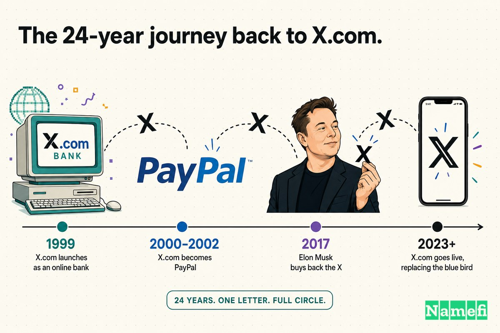
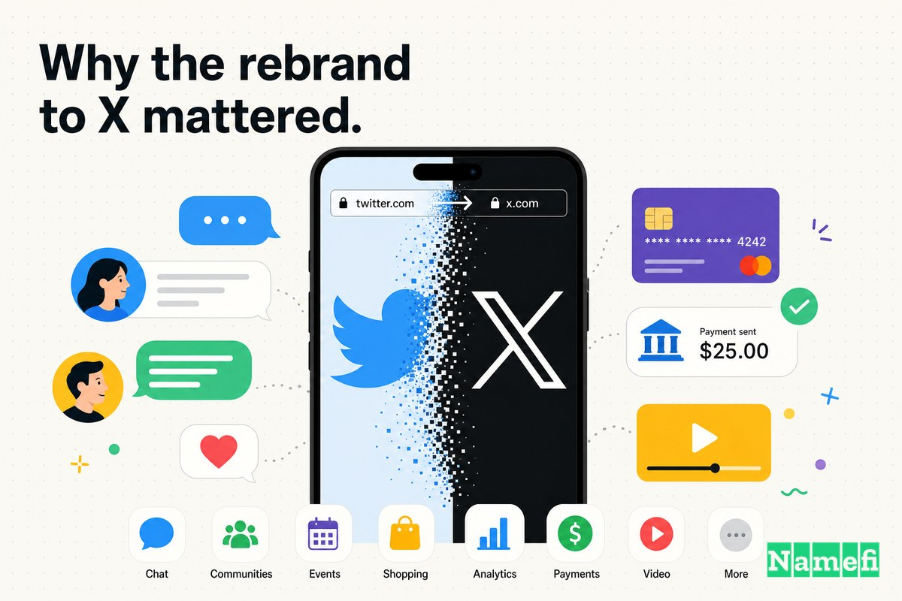
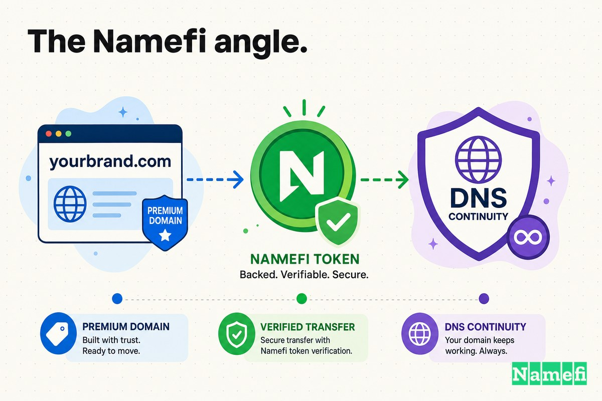

معظم قصص ترقية النطاقات بتسير في خط مستقيم: شركة بتبدأ باسم وصفي، بتكبر، وبتشتري النطاق الدقيق المطابق. **Twitter.com إلى X.com** أغرب من كده. دي رحلة ذهاب وإياب. النطاق المقصود — **X.com** — كان هو *الأول* في القصة، إيلون ماسك سجّله سنة 1999، وخسره لـPayPal بعد سنة، واشتراه تاني بعد عشرين سنة بدافع من النوستالجيا بس، وفي الآخر ربطه بشبكة تواصل اجتماعي عالمية سنة 2023.

لمدة سبعتاشر سنة، تويتر عاش في العنوان اللي هتتوقعه: **Twitter.com**. الاسم كان صادق والنطاق اتطابق معاه. "التغريدة" اتعملت على تويتر، في Twitter.com، تحت عصفور أزرق المستخدمين شافوه من أوائل أيام المنصة. مفيش صفة وصفية اتجاوزوها، ولا "App" أو "HQ" محتاجين يتخلصوا منه. على المنطق المعتاد لهذه السلسلة، Twitter.com كان بالفعل الوجهة.

وبعدين الملكية اتغيرت، واتغيرت الوجهة معاها.

في يوليو 2023، بعد تسعة أشهر من شرائه الشركة [بـ44 مليار دولار](https://www.aljazeera.com/news/2023/7/23/elon-musk-says-he-will-change-twitters-blue-bird-logo-to-an-x#:~:text=Musk%20bought%20the%20social%20media%20platform%20for%20%2444bn%20last%20year)، ماسك عمل حاجة ما عملهاش أي مؤسس تاني في هذه السلسلة: رمى نطاق مثالي مطابق للاسم واستبدله بعلامة تجارية من حرف واحد بيحملها بشكل شخصي من 24 سنة. تويتر بقى **X**، والموقع بدأ الهجرة الطويلة إلى **X.com** — نطاق تاريخه أقدم من تويتر نفسه.

## Twitter.com: الشركة الناشئة النادرة اللي انطلقت باسمها الحقيقي

في البداية، ما كانش فيه مشكلة نطاق تتحل.

لما تويتر انطلق سنة 2006، كان عنده الحاجة اللي معظم الشركات الناشئة في هذه السلسلة اتصرفت سنين وملايين وهي بتحاول توصلها: النطاق المطابق بالـ[.com](/ar/tld/com/) اللي بيطابق اسمها. Twitter.com *كان* تويتر. العصفور الأزرق، والفعل "tweet" (يغرد)، والرد بالـ@، والهاشتاق — كل مفردات كاملة نبتت على عنوان ما كانش محتاج تفسير. في معظم حياته، تويتر كان المثال المعاكس لكل درس "اشتري النطاق المطابق لاسمك"، لأنه ما احتاجش يعمل ده أبدًا.

ده هو اللي بيخلي الموضوع ده مختلف. الضغط لتغيير النطاق ما جاش لأن المنتج تجاوز الاسم، زي ما "Motors" تجاوزت Tesla أو "Cab" تجاوزت Uber. الضغط جه من مالك جديد عنده اسم تاني في دماغه — وكان فاضي له من زمان.

## يوليو 2023: وداعًا للعصفور

الشرارة ما كانتش جهة تنظيمية ولا بائع مترددة. كانت تغريدة في عطلة نهاية الأسبوع.

ماسك ألمح للتغيير يوم الأحد 23 يوليو 2023، وأعلن إن الشركة هتـ"[توداع علامة تويتر التجارية وكل العصافير بشكل تدريجي](https://www.aljazeera.com/news/2023/7/23/elon-musk-says-he-will-change-twitters-blue-bird-logo-to-an-x#:~:text=And%20soon%20we%20shall%20bid%20adieu%20to%20the%20Twitter%20brand%20and%2C%20gradually%2C%20all%20the%20birds)". في أقل من يوم، العصفور اختفى. الجزيرة الإنجليزية أفادت بإن [تويتر أطلق شعاره الجديد، متخلّيًا عن العصفور الأزرق على موقعه لصالح X](https://www.aljazeera.com/news/2023/7/23/elon-musk-says-he-will-change-twitters-blue-bird-logo-to-an-x#:~:text=Twitter%20has%20launched%20its%20new%20logo%2C%20dropping%20the%20blue%20bird%20on%20its%20website%20for%20an%20X)، ووصفت الشعار الجديد بوضوح: [موقع شبكة التواصل الاجتماعي أظهر يوم الاثنين الشعار الجديد للشركة: X أبيض على خلفية سوداء](https://www.aljazeera.com/news/2023/7/23/elon-musk-says-he-will-change-twitters-blue-bird-logo-to-an-x#:~:text=showed%20the%20company%E2%80%99s%20new%20logo%3A%20a%20white%20X%20on%20a%20black%20background).

والنطاق اتحرك برضو — بس، والطريف في الأمر، في *الاتجاه الغلط في الأول*. في اليوم الأول، [نطاق x.com أصبح يُعيد التوجيه إلى Twitter](https://www.aljazeera.com/news/2023/7/23/elon-musk-says-he-will-change-twitters-blue-bird-logo-to-an-x#:~:text=The%20domain%20x.com%20now%20redirects%20to%20Twitter). الاسم الجديد كان بيشير للقديم. أهم أصل في عملية إعادة العلامة التجارية — نطاق X.com — كان بيُستخدم كعنوان إعادة توجيه لـTwitter.com، مش العكس.

هذه التفصيلة هي كل التوتر في هذه القضية. ماسك كان النطاق المقصود في إيده من اليوم الأول. اللي *ما كانش* عنده، لسه، هو طريقة نظيفة ينقل بيها شبكة بمئات الملايين من المستخدمين — كل bookmark وكل رابط وكل "twitter.com" بيُكتب في شريط المتصفح — عليه من غير ما يكسر الإنترنت.

## الرحلة اللي امتدت 24 سنة للعودة لـX.com

عشان تفهم ليه ماسك أراد X.com لدرجة إنه تخلى عن Twitter.com، لازم ترجع لحقبة dot-com — لأن X.com هو المكان اللي بدأت منه مسيرته في عالم المال الرقمي.

في مارس 1999، ماسك شارك في تأسيس **X.com**، بنك إلكتروني. ويكيبيديا بتسجّل إن [X.com كان بنكًا إلكترونيًا أمريكيًا أسسه Ed Ho وHarris Fricker وإيلون ماسك وChristopher Payne سنة 1999 في بالو ألتو، كاليفورنيا](https://en.wikipedia.org/wiki/X.com_(bank)#:~:text=X.com%20was%20an%20American%20online%20bank%20founded%20by)، وإن [ماسك استثمر حوالي 12 مليون دولار في تأسيس X.com في مارس 1999](https://en.wikipedia.org/wiki/X.com_(bank)#:~:text=Musk%20invested%20about%20%2412%20million%20into%20co%2Dfounding%20X.com%20in%20March%201999). الطموح ما كانش أداة مدفوعات ضيقة. X.com [تصوّر كمنصة مالية إلكترونية شاملة، تقدّم خدمات مصرفية عبر الإنترنت ومدفوعات من شخص لشخص، مش مجرد منتج لتحويل المدفوعات](https://en.wikipedia.org/wiki/X.com_(bank)#:~:text=conceived%20as%20a%20broad%20online%20financial%2Dservices%20platform). فكرة "تطبيق كل شيء" اللي ماسك رّوج لها سنة 2022 كانت، في جوهرها، فكرة X.com سنة 1999.

نما بسرعة. [في أقل من شهرين، جذب X.com أكثر من 200,000 مسجّل](https://en.wikipedia.org/wiki/X.com_(bank)#:~:text=Within%20two%20months%2C%20X.com%20attracted%20over%20200%2C000%20signups). لكن في الجهة التانية من المدينة كانت فيه منافس: Confinity، [تأسست في ديسمبر 1998 بواسطة Max Levchin وPeter Thiel وLuke Nosek وKen Howery وYu Pan](https://en.wikipedia.org/wiki/Confinity#:~:text=It%20was%20founded%20in%20December%201998%20by%20Max%20Levchin%2C%20Peter%20Thiel)، واللي [أطلقت منتجها الأبرز، PayPal، في أواخر 1999](https://en.wikipedia.org/wiki/Confinity#:~:text=Confinity%20launched%20its%20milestone%20product%2C%20PayPal%2C%20in%20late%201999). في مارس 2000، الاتنين اتدمجوا: [X.com اندمجت مع منافستها Confinity](https://en.wikipedia.org/wiki/X.com_(bank)#:~:text=X.com%20merged%20with%20its%20competitor%20Confinity)، الشركة اللي بنت PayPal.

وبعدين ماسك خسر السيطرة على اسمه. [في سبتمبر 2000، لما كان ماسك في أستراليا في رحلة شهر العسل، مجلس إدارة X.com صوّت بتغيير الرئيس التنفيذي من ماسك لـPeter Thiel](https://en.wikipedia.org/wiki/X.com_(bank)#:~:text=In%20September%202000%2C%20when%20Musk%20was%20in%20Australia%20for%20a%20honeymoon%20trip%2C%20the%20X.com%20board%20voted%20for%20a%20change%20of%20CEO%20from%20Musk%20to%20Peter%20Thiel). القيادة الجديدة ما كانتش محبّة لعلامة X.com، و[في يونيو 2001، اتغيّر نطاق x.com لـPayPal.com](https://en.wikipedia.org/wiki/X.com_(bank)#:~:text=In%20June%202001%2C%20the%20x.com%20domain%20was%20changed%20to%20PayPal.com). الاسم اللي ماسك سجّله، والشركة اللي أسسها، والنطاق اللي اختاره — كلهم بقوا بيجاوبوا على اسم "PayPal"، ونطاق X.com فضل مع الشركة بعد ما هو راح.

## "ذو قيمة عاطفية كبيرة ليّ": شراؤه مجددًا سنة 2017

لستاشر سنة، X.com فضل داخل محفظة PayPal، خامدًا. وبعدين في يوليو 2017، ماسك اشتراه بهدوء من غير ضجة.

ما كانش فيه خطة عمل مرفقة. PYMNTS بلّغت ببساطة إن [رائد الفضاء إيلون ماسك، رئيس Tesla، اشترى نطاق X.com من PayPal](https://www.pymnts.com/news/merchant-innovation/2017/elon-musk-purchases-domain-from-paypal/#:~:text=Elon%20Musk%2C%20the%20head%20of%20Tesla%2C%20has%20purchased%20the%20X.com%20domain%20name%20from%20PayPal)، وإن [X.com كان الاسم التجاري اللي أنشأه ماسك لشركة ناشئة في الخدمات المالية، اندمجت لاحقًا مع Confinity لتصبح PayPal](https://www.pymnts.com/news/merchant-innovation/2017/elon-musk-purchases-domain-from-paypal/#:~:text=X.com%20was%20the%20brand%20name%20Musk%20created%20for%20a%20financial%20service%20startup%20that%20later%20merged%20with%20Confinity%20to%20become%20PayPal). ماسك نفسه وصف الأمر بالنوستالجيا الخالصة. Engadget نقلت عن تغريدته: "[شكرًا PayPal على السماح لي باسترداد X.com! مفيش خطط دلوقتي، لكنه ذو قيمة عاطفية كبيرة ليّ](https://www.engadget.com/2017-07-11-elon-musk-buys-his-old-x-com-domain-from-paypal.html#:~:text=Thanks%20PayPal%20for%20allowing%20me%20to%20buy%20back%20X.com!%20No%20plans%20right%20now%2C%20but%20it%20has%20great%20sentimental%20value%20to%20me)."

Engadget كمان كشفت الجرح اللي تحت عملية الشراء: [لما طردوا ماسك، النطاق (بشعاره الكلاسيكي، أعلاه) فضل مع PayPal](https://www.engadget.com/2017-07-11-elon-musk-buys-his-old-x-com-domain-from-paypal.html#:~:text=when%20Musk%20was%20pushed%20out%2C%20the%20domain%20%28with%20its%20aught%2Dtastic%20logo%2C%20above%29%20stayed%20behind%20with%20PayPal). استرداده، بعد سبعتاشر سنة، كان ماسك بيستعيد فيه القطعة الوحيدة من شركته الأولى اللي عاشت أكتر منه.

ده أندر دافع في السلسلة كلها. Tesla اشترت Tesla.com لأنها *احتاجت*. Uber دفعت أسهمًا مقابل Uber.com لأنها *احتاجت*. ماسك اشترى X.com سنة 2017 لأنه *أراد* — "مفيش خطط دلوقتي". النطاق كان إرثًا قبل ما يبقى استراتيجية.

## كانت الفلوس تبان مختلفة في الوقت ده

سهل، من عام 2026، تقرأ عملية الشراء سنة 2017 على إنها أول حركة في مخطط كبير انتهى بتويتر. على الأرجح ما كانتش.

الطرفان ما كشفاش السعر. [PayPal ما كشفتش كام دفع ماسك مقابل نطاق X.com](https://www.pymnts.com/news/merchant-innovation/2017/elon-musk-purchases-domain-from-paypal/#:~:text=PayPal%20did%20not%20disclose%20how%20much%20Musk%20paid%20for%20the%20X.com%20domain%20name)، والمراقبون فضلوا يخمّنوا. Engadget استخدمت مقارنة لتقدير الحجم: [محدش بيقول كام دفع، لكن كمرجع، Z.com اتباع بحوالي 6.8 مليون دولار من ثلاث سنين](https://www.engadget.com/2017-07-11-elon-musk-buys-his-old-x-com-domain-from-paypal.html#:~:text=Z.com%20sold%20for%20around%20%246.8%20million%20three%20years%20ago). نطاق من حرف واحد زي X.com بيقع في نفس الفئة النادرة — حفنة من أغلى النطاقات على الإنترنت.

لكن بالنظر للحظة اللي حصلت فيها، ما كانتش عملية استحواذ محسوبة قبل إعادة تسمية شبكة اجتماعية. في يوليو 2017، ماسك ما كانش مالك تويتر ولم يُلمّح علنًا لأي احتمال بده. كان بيدير Tesla وSpaceX. قال للعالم إن "مفيش خطط" لـX.com، وما فيش سبب نشك فيه. النطاق كان رخيصًا نسبةً لثروته، لا تُقدّر عاطفيًا، وخامد استراتيجيًا. هيفضل من غير استخدام لستة سنين تانية.

الدرس ده المؤسسون نادرًا ما يستوعبوه: النطاق اللي هيعرّف شركتك الجاية ممكن يكون واحد عندك من الأصل، اشتريته لأسباب ما كانتلهاش علاقة بالخطة. ماسك ما اشترش X.com *عشان* X. اشتراه لأنه كان ملكه. الاستراتيجية وصلت بعدين ولاقت الأصل جاهز في الدرج.

## ليه إعادة التسمية لـX كانت مهمة

استبدال "Twitter" بـ"X" ما كان *ترقية نطاق* بالمعنى المعتاد في هذه السلسلة. بكل المقاييس التقليدية، Twitter.com كان النطاق التجاري الأفضل: ينطق بسهولة، مشهور عالميًا، مرتبط بفعل بيستخدمه الناس من غير ما يفكروا. X.com حرف واحد غامض.

طيب ليه؟ لأن ماسك ما كانش بيحاول يسمّي شبكة تواصل اجتماعي. كان بيحاول يسمّي [تطبيق كل شيء](https://www.aljazeera.com/news/2023/7/23/elon-musk-says-he-will-change-twitters-blue-bird-logo-to-an-x#:~:text=buying%20Twitter%20is%20an%20accelerant%20to%20creating%20X%2C%20the%20everything%20app). "Twitter" بيوصف حاجة واحدة — رسائل عامة قصيرة. "X" ما بيوصفش حاجة بالذات، وده بالظبط هو المقصود: هو وعاء من غير منتج متضمّن فيه، فيه مساحة للمراسلات والمدفوعات والفيديو وأي حاجة تانية عايز يضمّها. نفس المنطق اللي نقل Tesla من "Motors" لـ"Tesla" شغّال هنا، بس بشكل أكثر تطرفًا. ماسك ما اتبادلش كلمة ضيقة بكلمة أوسع شوية. اتبادل كلمة محبوبة ومحددة بحرف عام إلى أقصى درجة.

| قبل | بعد |
| --- | --- |
| Twitter.com | X.com |
| بيسمّي منتجًا واحدًا: رسائل عامة 280 حرفًا | ما بيسمّيش حاجة محددة — وعاء فارغ |
| علامة تجارية معروفة عالميًا وفعل ("يغرد") | حرف واحد من غير معنى متضمّن |
| مرتبط بالتواصل الاجتماعي | مفتوح للمدفوعات والفيديو والمراسلات — "تطبيق كل شيء" |
| علامة تجارية مشهورة ورثها المالك | نطاق المالك حامله شخصيًا من 1999 |

ده أجرأ تحرك في السلسلة، وأكثرها شخصية. كل المؤسسين التانيين هنا ترقّوا *نحو* الوضوح. ماسك اتبادل الوضوح المعروف بالانفتاح المتعمد — وبالفرصة يرجع أقدم علامة تجارية عنده للواجهة.

## التسلسل: النطاق أولًا، وقصة إعادة التوجيه ثانيًا

ترتيب الأحداث بيفسّر ليه إعادة العلامة التجارية احتست فوضوية في العلن.

ماسك كان يمتلك النطاق المقصود من 2017، فالـ*علامة التجارية* قدرت تتقلب بين ليلة وضحاها — شعار الاثنين، العصفور راح آخر يوم الاثنين. لكن *هجرة النطاق* ما قدرتش تتعجّل، والإعادة التوجيه اشتغلت معكوسة قرابة سنة:

- **يوليو 2023:** إعادة العلامة التجارية حصلت. X الأبيض حلّ محل العصفور، وفي البداية [x.com أصبح يُعيد التوجيه لـTwitter](https://www.aljazeera.com/news/2023/7/23/elon-musk-says-he-will-change-twitters-blue-bird-logo-to-an-x#:~:text=The%20domain%20x.com%20now%20redirects%20to%20Twitter) — الاسم الجديد بيشير للقديم.
- **17 مايو 2024:** الاتجاه انعكس أخيرًا. Euronews أفادت بإن [منصة التواصل الاجتماعي المعروفة سابقًا بتويتر انتقلت رسميًا بعنوان موقعها من Twitter.com إلى X.com](https://www.euronews.com/next/2024/05/18/elon-musks-x-sheds-the-last-of-its-twitter-branding-by-changing-web-address-to-xcom#:~:text=has%20officially%20transitioned%20its%20website%20address%20from%20Twitter.com%20to%20X.com)، وماسك نشر إن [كل الأنظمة الأساسية دلوقتي على X.com](https://www.euronews.com/next/2024/05/18/elon-musks-x-sheds-the-last-of-its-twitter-branding-by-changing-web-address-to-xcom#:~:text=All%20core%20systems%20are%20now%20on%20X.com).

حوالي عشرة أشهر مرّت بين تغيير الشعار والنطاق وهو بيقود فعليًا. هذه الفجوة هي القصة الحقيقية للحالة دي: امتلاك X.com كان الجزء *السهل* — ماسك كانه في إيده. نقل قاعدة مستخدمين بحجم كوكب عليه، من غير ما يكسر الروابط والجلسات وكوكيز الأمان والعادة الحركية لمئات الملايين من البشر، كان الجزء الصعب. العلامة التجارية تتغير في ليلة. النطاق بياخد سنة.

## النطاق أصبح جزءًا من نظام التشغيل

النطاقات المميزة مش بس للهيبة. دي تكرار — وTwitter.com كان وراه عشر سنين ونص من التكرار اللازم X.com يورّثه.

النطاق الأساسي للمنصة بيظهر في أماكن ما يسيطر عليها أي فريق تسويقي:

- في كل رابط مشارك وكل تضمين عبر باقي الويب.
- في مليارات الـbookmarks وكلمات المرور المحفوظة المرتبطة بـ"twitter.com".
- في كل جلسة تسجيل دخول وكوكيز أمان وتحقق ثنائي.
- في عناوين الصحف وأشرطة المتصفح والمختصرات الشفهية.
- في فعل — "يغرد" — كان عايش جوه الاسم القديم.

كل ده كان لازم يعيش طول فترة الانتقال. عشان كده twitter.com لسه بيشتغل: لو أوقفت إعادة التوجيه هتكسر شريحة كبيرة من روابط الإنترنت المتراكمة. فـX.com ما *استبدلش* Twitter.com بقدر ما كان لازم يورّث كل حاجة Twitter.com حملها يومًا ما، والنطاق القديم فضل حيًا كطبقة توجيه دائمة ومحمية. النطاق الغالي والعاطفي من حرف واحد بقى الباب الرئيسي. والنطاق الوصفي القديم بقى مواسير — مواسير حاملة ما تُقفلش.

## اللي المؤسسون يتعلموه من الحالة 3

الاستنتاج السهل — "غيّر اسمك لحرف واحد زي ما عمل ماسك" — ده بالظبط الغلط. Twitter.com كان نطاقًا تجاريًا أفضل من X.com بكل مقياس موضوعي تقريبًا، وإعادة العلامة التجارية لسه واحدة من أكثر قرارات التسويق نقاشًا في العقد. الدروس المفيدة أدق من كده:

1. **النطاق المطابق تمامًا مش دايمًا هو الوجهة.** Twitter.com كان بالفعل المطابق المثالي — والمالك لسه تركه. النطاق بيخدم طموح الشركة، مش العكس. لما الطموح اتغيّر من "شبكة تواصل اجتماعي" لـ"تطبيق كل شيء"، النطاق المثالي للهدف القديم بقى غلط للهدف الجديد.
2. **النطاق اللي محتاجه الجاية ممكن يكون عندك من الأصل.** ماسك اشترى X.com سنة 2017 بـ"مفيش خطط"، للعواطف. بعد ستة سنين بقى أساس إعادة علامة تجارية. الاحتفاظ بنطاق رائع ما تعرفش تستخدمه لسه ده مش هدر؛ ده خيارات مفتوحة.
3. **العلامة التجارية بتتقلب في ليلة؛ هجرة النطاق بتاخد سنة.** ماسك كان يمتلك X.com كاملًا و*لسه* احتاج عشرة أشهر عشان يخلّي twitter.com بيشير إليه بشكل نظيف. خطّط للهجرة، مش بس للإعلان.
4. **ما تكسرش النطاق القديم أبدًا.** Twitter.com لسه بيُعيد التوجيه، ولازم يفضل كده. النطاق الوصفي أو الموروث بيبقى بنية تحتية في اللحظة اللي تبقى فيها العلامة التجارية مشهورة كفاية إن فيه روابط بتشير إليها من كل حتة.

إعادة العلامة التجارية لوحدها ما خلّتش X ينجح أو يفشل — المنتج والإشراف والمعلنين والتنفيذ أهم بكتير، والحكم لسه مش صدر. لكن الحالة دي بتوضّح حاجة التانيين ما بيوضحوهاش: أحيانًا الترقية بتسير *بعيدًا* عن النطاق الواضح، نحو واحد المؤسس بيحمله من ربع قرن.

## الزاوية من Namefi

اشيل الضجة جانبًا والحالة 3 هي، زي غيرها، مشكلة نقل واستمرارية — بس ممتدة على 24 سنة وعدة ملّاك.

X.com غيّر أيادي مرات: من شركة ماسك الناشئة، للكيان المندمج Confinity، لـPayPal، ورجع لماسك سنة 2017 — كل حركة مفاوضة وسعر غير معلن ونقل هادئ لأحد أكثر النطاقات أحادية الحرف قيمةً على الإنترنت. وبعدين جه الجزء الأصعب: مش *امتلاك* X.com، لكن *الانتقال إليه* — توجيه كل رابط وتسجيل دخول وـbookmark لمنصة عالمية على نطاق جديد، مع إبقاء القديم (twitter.com) حيًا كإعادة توجيه دائمة لا تنكسر. الملكية والتقييم والنقل واستمرارية DNS — كل نقطة احتكاك في القصة عايشة عند الحد الفاصل بين العلامة التجارية ونطاقها.

[Namefi](https://namefi.io) مبنية على فكرة إن النطاقات لازم تتصرف كأصول أصيلة في الإنترنت. الملكية المُرمّزة بتقدر تخلّي التحكم في النطاق أسهل للتحقق منه والنقل والتكامل مع سير العمل الحديث مع الحفاظ على التوافق مع DNS — وبتحوّل أكثر الأجزاء إرهاقًا في قصة زي دي (إثبات مين يملك نطاق على مدار عقود وملاك مؤسسيين، والاتفاق على القيمة من غير مقاييس عامة، ونقل السيطرة من غير الإخلال بالسجلات الحية) لحاجة أقرب لمعاملة نظيفة قابلة للتدقيق. نطاق يقدر يتنقل بنظافة بين كل مالك — ويحافظ على استمرارية الـDNS بتاعته بينما علامة تجارية جديدة بتكبر فوقه — هو بالظبط الاحتكاك اللي هذه الرحلة الممتدة لـ24 سنة اصطدمت بيه باستمرار.

X.com يبدو حتميًا دلوقتي بس لأن ماسك حامله من 1999. لكن الدرس يصل قبل إعادة العلامة التجارية بكتير: نطاق يقدر يعيش أطول من الشركة اللي سجّلته، والشركة اللي غيّرت اسمه، والشركة اللي تركته — ولسه يرجع يعرّف الجاية. لما اسم هيحمل الأعمال، النطاق مش زينة. هو الأصل الوحيد اللي يستاهل تحمله 24 سنة عشان تاخده تاني.

## المصادر وقراءة إضافية

- ويكيبيديا — [X.com (البنك)](https://en.wikipedia.org/wiki/X.com_(bank)#:~:text=X.com%20was%20an%20American%20online%20bank%20founded%20by)
- ويكيبيديا — [Confinity](https://en.wikipedia.org/wiki/Confinity#:~:text=Confinity%20launched%20its%20milestone%20product%2C%20PayPal%2C%20in%20late%201999)
- PYMNTS — [إيلون ماسك يشتري نطاق X.com من PayPal](https://www.pymnts.com/news/merchant-innovation/2017/elon-musk-purchases-domain-from-paypal/#:~:text=Elon%20Musk%2C%20the%20head%20of%20Tesla%2C%20has%20purchased%20the%20X.com%20domain%20name%20from%20PayPal)
- Engadget — [إيلون ماسك يسترد نطاق X.com القديم من PayPal](https://www.engadget.com/2017-07-11-elon-musk-buys-his-old-x-com-domain-from-paypal.html#:~:text=Thanks%20PayPal%20for%20allowing%20me%20to%20buy%20back%20X.com!)
- الجزيرة الإنجليزية — [تويتر يغيّر شعاره لـ'X' ويستبدل رمز العصفور الأزرق](https://www.aljazeera.com/news/2023/7/23/elon-musk-says-he-will-change-twitters-blue-bird-logo-to-an-x#:~:text=Twitter%20has%20launched%20its%20new%20logo%2C%20dropping%20the%20blue%20bird%20on%20its%20website%20for%20an%20X)
- Euronews — [X بتاع إيلون ماسك يتخلص من آخر ما تبقى من علامة تويتر بتغيير عنوان الويب لـx.com](https://www.euronews.com/next/2024/05/18/elon-musks-x-sheds-the-last-of-its-twitter-branding-by-changing-web-address-to-xcom#:~:text=has%20officially%20transitioned%20its%20website%20address%20from%20Twitter.com%20to%20X.com)
