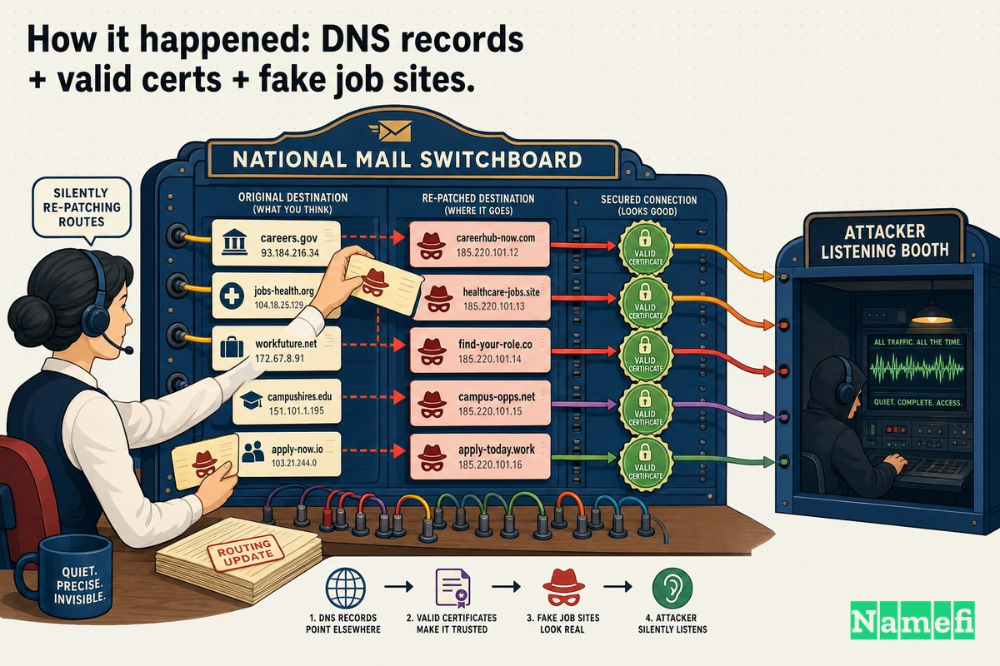

تتمحور معظم كوارث النطاقات حول مَن *يملك* الاسم. لكن هذه الكارثة كانت تدور حول مَن *يتحكم* فيه — ولبضعة أشهر في أواخر عام 2018، كانت الإجابة بالنسبة لعشرات النطاقات الحكومية في جميع أنحاء الشرق الأوسط هي: ليس الحكومات.

لم يكن هناك أي اختراق لخادم ويب. ولا برمجيات خبيثة على الصفحة الرئيسية. لم يحدث أي تشويه للموقع، ولم تُطلب فدية، ولم يُعثر على دليل قاطع في سجلات التطبيق. لم يحتج المهاجمون حتى لاقتحام المباني على الإطلاق. بل دخلوا من الباب الوحيد الذي لا يحرسه أحد تقريبًا: **سجل نظام أسماء النطاقات (DNS)** الذي يحدد الموقع الفعلي للبريد الإلكتروني ومواقع الويب الخاصة بالنطاق. لقد قاموا بتعديله — بهدوء، باستخدام بيانات اعتماد صالحة، وخلف شهادة TLS صالحة — واتبعت حركة المرور العالمية التعليمات الجديدة دون أي شكوى.

أطلقت شركة "سيسكو تالوس" (Cisco Talos) على هذه الحملة اسم **DNSpionage**. وتُعد هذه الحملة واحدة من أوضح الأدلة المسجلة على أن نظام أسماء النطاقات (DNS) ليس مجرد أداة توجيه تقنية، بل هو بنية تحتية أساسية للأمن القومي.

## نظام أسماء النطاقات (DNS) كسلاح من أسلحة الدولة

لفهم السبب الذي جعل حملة DNSpionage تثير ذعر الحكومات، يجب أن تتذكر ما يفعله نظام أسماء النطاقات (DNS) فعليًا.

في كل مرة ترسل فيها بريدًا إلكترونيًا إلى وزارة ما، أو تسجل الدخول إلى شبكة افتراضية خاصة (VPN) للشركات، أو تحمّل صفحة بريد ويب، يسأل جهازك أولاً نظام DNS سؤالاً: *ما هو عنوان IP الخاص بهذا الاسم؟* وأيًا كانت إجابة DNS، فإنك تثق بها. يتصل عميل البريد الإلكتروني الخاص بك هناك. وتقوم شبكة VPN بالمصادقة هناك. ويسلم متصفحك الجلسة هناك. فنظام DNS هو بمثابة دفتر العناوين للإنترنت بأكمله، ولا يوجد تقريبًا أي شيء يتحقق مما إذا كان قد تم تعديل دفتر العناوين هذا أم لا.

هذه هي الخاصية التي استغلتها حملة DNSpionage. إذا كان بإمكانك تغيير السجل — ليس بكسر التشفير، ولا باختراق ملف كلمات المرور، بل بمجرد تغيير *المؤشر* — يمكنك الوقوف بشكل غير مرئي بين الهدف والخدمات التي يثق بها. تتدفق رسائل البريد الإلكتروني من خلالك. وتتدفق عمليات تسجيل الدخول إلى شبكة VPN من خلالك. ونظرًا لأن اسم النطاق الخاص بالضحية لا يزال يظهر في شريط المتصفح، فلا يبدو أن هناك خطأ ما.

هذا هو التجسس في الطبقة التي تقع أسفل التطبيق. وهي أيضًا، وبشكل مثير للقلق، الطبقة التي تتعامل معها معظم برامج الأمان على أنها مشكلة محلولة بالفعل.

## حملة DNSpionage (2018–2019)

في **27 نوفمبر 2018**، نشرت سيسكو تالوس تقريرها الأول. كانت الجملة الافتتاحية محددة: "[اكتشفت Cisco Talos مؤخرًا حملة جديدة تستهدف لبنان والإمارات العربية المتحدة وتؤثر على نطاقات .gov، بالإضافة إلى شركة طيران لبنانية خاصة](https://blog.talosintelligence.com/dnspionage-campaign-targets-middle-east/#:~:text=Cisco%20Talos%20recently%20discovered%20a%20new%20campaign%20targeting%20Lebanon%20and%20the%20United%20Arab%20Emirates)."

كان للحملة وجهان. الأول كان عملية برمجيات خبيثة عادية إلى حد ما: "[تستخدم هذه الحملة بالتحديد موقعين إلكترونيين مزيفين وضارين يحتويان على إعلانات وظائف تُستخدم لاختراق الأهداف عبر مستندات Microsoft Office ضارة تحتوي على وحدات ماكرو مضمنة](https://blog.talosintelligence.com/dnspionage-campaign-targets-middle-east/#:~:text=This%20particular%20campaign%20utilizes%20two%20fake%2C%20malicious%20websites%20containing%20job%20postings)." انتحلت مواقع الطُعم صفة مسؤولي توظيف حقيقيين — "[hr-wipro[.]com (مع إعادة توجيه إلى wipro.com) و hr-suncor[.]com (مع إعادة توجيه إلى suncor.com)](https://blog.talosintelligence.com/dnspionage-campaign-targets-middle-east/#:~:text=hr%2Dwipro)" — وقامت بإسقاط أداة وصول عن بُعد مخصصة، والتي كانت تتميز بقدرتها على التحدث إلى خادم القيادة الخاص بها عبر نظام DNS نفسه.

لكن الوجه الثاني هو ما دخل التاريخ. على حد تعبير تالوس: "[في حملة منفصلة، استخدم المهاجمون نفس عنوان IP لإعادة توجيه نظام DNS لنطاقات .gov والشركات الخاصة المشروعة](https://blog.talosintelligence.com/dnspionage-campaign-targets-middle-east/#:~:text=the%20attackers%20used%20the%20same%20IP%20to%20redirect%20the%20DNS%20of%20legitimate)." تم توجيه خوادم أسماء (nameservers) حكومية حقيقية إلى أجهزة يمتلكها المهاجمون: "[يبدو أنه تم اختراق خوادم أسماء متعددة تابعة للقطاع العام في لبنان والإمارات، بالإضافة إلى بعض الشركات في لبنان، وتم توجيه أسماء المضيفين (hostnames) الخاضعة لسيطرتهم إلى عناوين IP يتحكم فيها المهاجمون](https://blog.talosintelligence.com/dnspionage-campaign-targets-middle-east/#:~:text=Multiple%20nameservers%20belonging%20to%20the%20public%20sector)."

كانت مواقع الوظائف المزيفة هي الجزء الذي بدا وكأنه جريمة إلكترونية عادية. أما إعادة توجيه DNS فكانت الجزء الذي بدا وكأنه عمل من أعمال الدولة.

بحلول الوقت الذي انتهى فيه الباحثون المستقلون من تتبع خيوط القضية، كان النطاق أكبر بكثير من مجرد دولتين. وجد برايان كريبس (Brian Krebs)، من خلال تتبع عناوين IP للمهاجمين عكسيًا، أنه "[في الأشهر القليلة الأخيرة من عام 2018، نجح القراصنة وراء حملة DNSpionage في اختراق مكونات رئيسية من البنية التحتية لنظام DNS لأكثر من 50 شركة ووكالة حكومية في الشرق الأوسط](https://krebsonsecurity.com/2019/02/a-deep-dive-on-the-recent-widespread-dns-hijacking-attacks/#:~:text=in%20the%20last%20few%20months%20of%202018%20the%20hackers%20behind%20DNSpionage%20succeeded)."

## مَن كان المستهدف، وما هي المخاطر

تبدو قائمة الضحايا وكأنها خريطة للجهاز العصبي في المنطقة: وزارات خارجية، الطيران المدني، شركات الاتصالات، البنية التحتية للإنترنت، وبريد الويب الخاص بوزارة المالية الوطنية. لم تكن هذه أهدافًا عشوائية. بل كانت الأماكن التي تمر عبرها أسرار الأمة عبر الأسلاك.

بعد شهرين من تقرير تالوس الأول، نشرت شركة فاير آي (FireEye - المعروفة الآن باسم Mandiant) تحليلها الخاص وحددت هوية الجناة بشكل صريح ولكن بحذر. وكما عبرت فاير آي، "[تشير الأبحاث الأولية إلى أن الفاعل أو الفاعلين المسؤولين لهم صلة بإيران](https://www.theregister.com/2019/01/10/fireeye_iran_dns_hijacking/#:~:text=initial%20research%20suggests%20the%20actor%20or%20actors%20responsible%20have%20a%20nexus%20to%20Iran)." وفي تقريرها عن نتائج فاير آي، أشارت مجلة (SecurityWeek) إلى أن الشركة قيّمت "[بثقة متوسطة](https://www.securityweek.com/iran-linked-dns-hijacking-attacks-target-organizations-worldwide/#:~:text=moderate%20confidence)" أن إيران كانت وراء الهجمات، بناءً على أدلة فنية وحقيقة أن الحملة توافقت مع مصالح الحكومة الإيرانية.

تنبع المخاطر بشكل مباشر من طبيعة الأهداف. عندما تتمكن من قراءة البريد الإلكتروني لوزارة خارجية بنص غير مشفر، فأنت لا تسرق بيانات فحسب — بل تقرأ أفكار حكومة في الوقت الفعلي تقريبًا. ولهذا السبب، فإن حملة جمع بيانات الاعتماد في طبقة DNS تُفهم بشكل صحيح ليس على أنها احتيال، بل على أنها عملية جمع معلومات استخباراتية ضد الدولة.

## كيف حدث ذلك: سجلات DNS + شهادات صالحة + مواقع وظائف مزيفة

هذا هو الجزء الذي يستحق التوقف عنده طويلاً، لأن التقنية المستخدمة كانت ذكية بأبشع الطرق. كانت هناك ثلاث خطوات رئيسية.

**الخطوة الأولى: الحصول على مفاتيح دفتر العناوين.** لم يقم المهاجمون بكسر تشفير نظام DNS. بل قاموا بتسجيل الدخول. وصفت شركة فاير آي (FireEye) مسارين: "[تتضمن إحدى الطرق تسجيل الدخول إلى واجهة الإدارة الخاصة بمزود DNS باستخدام بيانات اعتماد مخترقة وتغيير سجلات DNS A في محاولة لاعتراض حركة مرور البريد الإلكتروني. تتضمن الطريقة الأخرى تغيير سجلات DNS NS بعد اختراق حساب أمين سجل النطاق (registrar) الخاص بالضحية](https://www.securityweek.com/iran-linked-dns-hijacking-attacks-target-organizations-worldwide/#:~:text=One%20method%20involves%20logging%20into%20a%20DNS%20provider)." كانت بيانات الاعتماد المسروقة الخاصة بأمين السجل ومضيف DNS هي المفتاح الرئيسي. فمن يملك بيانات تسجيل الدخول لأمين السجل يملك النطاق — والنطاق يتحكم في كل شيء موجه إليه.

**الخطوة الثانية: إعادة توجيه حركة المرور بحيث تستمر في العمل.** إن توجيه خادم البريد الحكومي إلى عنوان IP الخاص بك سيؤدي عادةً إلى تعطل الأنظمة وإطلاق أجراس الإنذار. لذلك، استخدم المهاجمون وكيلًا (Proxy). تم ترحيل حركة المرور إلى الوجهة الحقيقية بعد التقاطها، بحيث رأى المستخدمون صندوق وارد يعمل وشبكة VPN تعمل بشكل طبيعي. وكما وصفت فاير آي متغيرًا ثالثًا: "[تمت إعادة توجيه المستخدمين إلى بنية تحتية يتحكم فيها المهاجم](https://www.securityweek.com/iran-linked-dns-hijacking-attacks-target-organizations-worldwide/#:~:text=users%20were%20redirected%20to%20attacker%2Dcontrolled%20infrastructure)." كان هذا الاعتراض بمثابة هجوم "رجل في المنتصف" (Man-in-the-Middle) يقوم بإعادة التوجيه بهدوء — وكان غير مرئي تمامًا لأنه لم يبدُ أن هناك أي خطأ قد حدث.

**الخطوة الثالثة: هزيمة القفل الأخضر.** تستخدم الخدمات الحديثة بروتوكول TLS، والذي يجب أن يصدر تحذيرًا بشأن الشهادة بمجرد هبوط حركة المرور على الخادم الخاطئ. سد المهاجمون هذه الفجوة عن طريق إصدار شهاداتهم المشروعة الخاصة. اكتشفت تالوس أنه "[أثناء كل عملية اختراق لنظام DNS، قام الفاعل بعناية بإنشاء شهادات Let's Encrypt للنطاقات المُعاد توجيهها](https://blog.talosintelligence.com/dnspionage-campaign-targets-middle-east/#:~:text=During%20each%20DNS%20compromise%2C%20the%20actor%20carefully%20generated)." ولأنهم سيطروا الآن على نظام DNS الخاص بالنطاق، كان بإمكانهم *إثبات* سيطرتهم لسلطة إصدار الشهادات (Certificate Authority) — وقامت عملية التحقق الآلي من النطاق بمنحهم شهادة صالحة. وأكدت فاير آي النمط نفسه عبر مختلف الأساليب: "[في كلتا الحالتين استخدم المهاجمون شهادات Let's Encrypt لتجنب إثارة الشبهات](https://www.securityweek.com/iran-linked-dns-hijacking-attacks-target-organizations-worldwide/#:~:text=in%20both%20cases%20the%20attackers%20used%20Let%E2%80%99s%20Encrypt%20certificates)."

كانت النتيجة، كما لخصها كريبس، شاملة: "[كما مهدت عمليات اختراق DNS هذه الطريق للمهاجمين للحصول على شهادات تشفير SSL للنطاقات المستهدفة (مثل webmail.finance.gov.lb)، مما سمح لهم بفك تشفير البريد الإلكتروني المعترض وبيانات اعتماد VPN وعرضها بنص عادي غير مشفر](https://krebsonsecurity.com/2019/02/a-deep-dive-on-the-recent-widespread-dns-hijacking-attacks/#:~:text=these%20DNS%20hijacks%20also%20paved%20the%20way%20for%20the%20attackers%20to%20obtain%20SSL%20encryption%20certificates)." تم التقاط رسائل البريد الإلكتروني وتسجيلات الدخول إلى VPN وأصبحت قابلة للقراءة، مع وجود قفل أخضر صالح طوال الوقت.

لاحظ ما *لم* يكن مطلوبًا. لم تكن هناك ثغرات يوم الصفر (Zero-day). لم تكن هناك برمجيات خبيثة على خوادم الضحية نفسها. لم يتم اختراق جدار الحماية. عاش الهجوم بالكامل في الفجوة بين "أنا أملك هذا النطاق" و"يمكنني إثبات من يتحكم حاليًا في سجلاته." هذه الفجوة هي المكان الذي سكنت فيه حملة DNSpionage — وهي فجوة أوسع بكثير مما تعتقده معظم المؤسسات.

## الاستجابة: توجيه الطوارئ 19-01 الصادر عن وكالة CISA

تركت الإفصاحات المشتركة لكل من تالوس وفاير آي صدىً مدويًا في واشنطن. في **22 يناير 2019**، أصدرت وكالة الأمن السيبراني وأمن البنية التحتية الأمريكية (CISA) **توجيه الطوارئ 19-01 بعنوان "التخفيف من التلاعب ببنية DNS التحتية"** — وهو أول توجيه طوارئ تصدره CISA على الإطلاق، وتعليمات نادرة ملزمة للحكومة الفيدرالية المدنية بأكملها.

تطابق تشخيص التوجيه تمامًا مع الأبحاث. وكما نُقل في التقارير المتزامنة، حذرت CISA من أن "[المهاجمين قاموا بإعادة توجيه واعتراض حركة مرور الويب والبريد، ويمكنهم القيام بذلك لخدمات شبكية أخرى](https://www.bleepingcomputer.com/news/security/dhs-issues-emergency-directive-to-prevent-dns-hijacking-attacks/#:~:text=redirected%20and%20intercepted%20web%20and%20mail%20traffic)"، وأن الفاعلين "[اخترقوا حسابات المسؤولين المكلفين بإدارة نطاقات DNS الحكومية](https://www.bleepingcomputer.com/news/security/dhs-issues-emergency-directive-to-prevent-dns-hijacking-attacks/#:~:text=compromised%20the%20accounts%20of%20administrators)."

بعد ذلك، أمرت الوكالة باتخاذ أربعة إجراءات، خلال إطار زمني مدته 10 أيام — وبدت هذه الإجراءات وكأنها دحض مباشر لكل خطوة من الخطوات الثلاث التي اتخذها المهاجم:

1. **تدقيق سجلات DNS الخاصة بك** — التحقق من عدم العبث بأي شيء على الخوادم الموثوقة والثانوية.
2. **تغيير كلمات مرور حسابات DNS** — تدوير (تغيير) كل بيانات اعتماد قادرة على تعديل نظام DNS.
3. **إضافة المصادقة متعددة العوامل (MFA)** إلى جميع حسابات مسؤولي DNS — بحيث لا تكون كلمة المرور المسروقة وحدها هي المفتاح الرئيسي.
4. **مراقبة سجلات شفافية الشهادات (Certificate Transparency)** — مراقبة الشهادات الصادرة لنطاقاتك والتي لم تطلبها أبدًا.

هذا العنصر الرابع هو الدليل القاطع. لم تكن CISA تطلب من الوكالات قفل الباب فحسب؛ بل كانت تطلب منهم مراقبة دفاتر الشهادات العامة بحثًا عن أدلة تثبت أن شخصًا ما قد استخدم بالفعل نسخة من المفتاح. لقد حولت حملة DNSpionage ميزة شفافية الشهادات من مجرد ميزة متخصصة في البنية التحتية للمفاتيح العامة (PKI) إلى أداة اكتشاف بالخطوط الأمامية لاختطاف نظام DNS من قبل الدول القومية.

لقد لخص كريبس (Krebs) غرابة تلك اللحظة بوضوح: "[أصدرت وزارة الأمن الداخلي الأمريكية توجيه طوارئ نادرًا يأمر جميع الوكالات المدنية الفيدرالية الأمريكية بتأمين بيانات تسجيل الدخول لسجلات نطاقات الإنترنت الخاصة بها](https://krebsonsecurity.com/2019/02/a-deep-dive-on-the-recent-widespread-dns-hijacking-attacks/#:~:text=issued%20a%20rare%20emergency%20directive%20ordering%20all%20U.S.%20federal%20civilian%20agencies)."

لم تكن حملة DNSpionage وحدها هي الدافع وراء ذلك. بل زادت عملية موازية، وأكثر عدوانية أطلقت عليها تالوس اسم **Sea Turtle (سلحفاة البحر)** — والتي وصفتها تالوس بأنها "[أول حالة معروفة لمنظمة مسؤولة عن سجلات أسماء النطاقات تتعرض للاختراق من أجل عمليات التجسس السيبراني](https://www.networkworld.com/article/967285/cisco-talos-details-exceptionally-dangerous-dns-hijacking-attack.html#:~:text=first%20known%20case%20of%20a%20domain%20name%20registry%20organization%20that%20was%20compromised)"، حيث ضربت "[حوالي 40 منظمة مختلفة في 13 دولة مختلفة](https://www.networkworld.com/article/967285/cisco-talos-details-exceptionally-dangerous-dns-hijacking-attack.html#:~:text=approximately%2040%20different%20organizations%20across%2013%20different%20countries)" — من حجم المخاطر بشكل أكبر. كانت تالوس حريصة على الفصل بين الحملتين؛ ففي تحديثها الصادر في أبريل 2019، أشارت إلى أن سلوك حملة DNSpionage "[من المرجح أن يستمر في تمييز هذا الفاعل عن الحملات الأكثر إثارة للقلق مثل Sea Turtle](https://blog.talosintelligence.com/dnspionage-brings-out-karkoff/#:~:text=will%20likely%20continue%20to%20distinguish%20this%20actor%20from%20more%20concerning%20campaigns%20like%20Sea%20Turtle)." معًا، أثبتت الحملتان نفس النقطة من زوايا مختلفة: أصبحت سلسلة التوريد لنظام DNS مسرحًا لصراع الدول.

## ماذا يعلمنا هذا عن نظام أسماء النطاقات (DNS) كبنية تحتية للأمن القومي

تفتقر حملة DNSpionage إلى دراما البرمجيات الخبيثة، لكنها مليئة بالدروس المزعجة. إليك بعض الدروس الجديرة بالاهتمام:

- **حساب أمين السجل (registrar) هو جوهرة التاج.** كل ما يتفرع عن النطاق — البريد، الويب، شبكات VPN، تسجيل الدخول الموحد، إصدار الشهادات — يرث الثقة من الشخص القادر على تعديل نظام DNS الخاص به. إن وجود كلمة مرور بدون عامل مصادقة ثانٍ على ذلك الحساب ليس مجرد فجوة صغيرة؛ بل يعادل ترك بوابة القلعة بأكملها مفتوحة. ولهذا السبب تحديدًا كانت تعليمات CISA الأولى تدور حول *بيانات الاعتماد*، وليس الجدران النارية، لهذا السبب بالضبط.
- **الشهادة الصالحة ليست دليلاً على الشرعية.** يُثبت القفل الأخضر أن حركة المرور مشفرة *لصالح مَن يتحكم في النطاق في هذه اللحظة*. إذا كان المهاجم يتحكم في نظام DNS، فإن عملية التحقق الآلي من النطاق ستصدر له بكل سرور شهادة حقيقية. الثقة في بروتوكول TLS مستمدة من الثقة في نظام DNS — ونظام DNS أضعف مما يفترضه معظم الناس.
- **هجمات DNS غير مرئية بطبيعتها.** نظرًا لأن الوكيل (proxy) يعيد توجيه حركة المرور الحقيقية، فإن خدمات الضحية تستمر في العمل. ولا يوجد أي انقطاع للتحقيق فيه. قد تكون الإشارة الخارجية الوحيدة هي ظهور شهادة في سجل CT عام — ولهذا السبب أصبحت مراقبة تلك السجلات إلزامية بين عشية وضحاها بعد أن كانت اختيارية.
- **التحكم في النطاق هو تحكم في الأمن القومي.** عندما تكون الجهة التي تُعدل نظام DNS لوزارة الخارجية هي دولة معادية، فإن التمييز بين "عمليات تكنولوجيا المعلومات" و"مكافحة التجسس" ينهار. دفتر عناوين الإنترنت هو تضاريس استراتيجية.

الخط الفاصل هو سؤال واحد لا تُجيب عليه تقريبًا أي أداة تشغيلية في الوقت الفعلي: **مَن يتحكم فعليًا في هذا النطاق الآن، وهل يمكنني إثبات أنه لم يتغير بهدوء؟** لقد نجحت حملة DNSpionage لأن الإجابة على هذا السؤال كانت صعبة للغاية لدرجة أن حكومات منطقة بأكملها لم تتمكن من ذلك.

## منظور Namefi

تُمثل حملة DNSpionage، في جوهرها، مشكلة في **إثبات المصدر (provenance)**. لم يمتلك المهاجمون النطاقات المستهدفة على الإطلاق. بل استعاروا السيطرة عليها من خلال سرقة بيانات الاعتماد التي سمحت للوحات تحكم أمين السجل ومضيف DNS بإجراء تعديلات صامتة لا يمكن التحقق منها — ولم يُشِر أي شيء في النظام إلى أن *الجهة المتحكمة* قد تغيرت.

تم بناء [Namefi](https://namefi.io) على فرضية أن ملكية النطاق والتحكم فيه يجب أن يكونا **قابلين للتحقق، وقابلين للنقل، ومقاومين للعبث** بدلاً من أن يكونا مقفلين داخل تسجيل دخول مبهم لأمين السجل. فعملية الملكية القائمة على الرموز الرقمية تجعل من "مَن يتحكم في هذا الاسم" حقيقة يمكنك التحقق منها وتدقيقها، وليست إعدادًا مدفونًا خلف كلمة مرور قد تكون بالفعل في أيدي شخص آخر. هذا لا يُغني عن النظافة الأمنية لحسابات أمناء السجلات أو المصادقة متعددة العوامل — فلا تزال نصيحة وكالة CISA صحيحة تمامًا — ولكنه يعالج الفجوة العميقة التي استغلتها حملة DNSpionage: ألا وهي صعوبة *إثبات*، بشكل مستقل ومستمر، أن الطرف الذي يتحكم في النطاق هو الطرف الذي يُفترض أن يكون كذلك.

إن الدرس المستفاد من حملة DNSpionage ليس أن نظام أسماء النطاقات (DNS) هش بطريقة غريبة. بل إن الحقيقة الأكثر أهمية حول النطاق — مَن يتحكم فيه — كانت لفترة طويلة جدًا تُحرس فقط بكلمة مرور عرضة للسرقة. إن جعل هذه الحقيقة قابلة للتحقق هو الهدف بأكمله.

## المصادر ومزيد من القراءة

- سيسكو تالوس — [حملة DNSpionage تستهدف الشرق الأوسط](https://blog.talosintelligence.com/dnspionage-campaign-targets-middle-east/) (27 نوفمبر 2018)
- سيسكو تالوس — [حملة DNSpionage تُظهر Karkoff](https://blog.talosintelligence.com/dnspionage-brings-out-karkoff/) (23 أبريل 2019)
- كريبس أون سكيوريتي (Krebs on Security) — [غوص عميق في هجمات اختطاف DNS واسعة النطاق الأخيرة](https://krebsonsecurity.com/2019/02/a-deep-dive-on-the-recent-widespread-dns-hijacking-attacks/) (18 فبراير 2019)
- السجل (The Register) — [ربط أشرار بإيران في عمليات اختطاف DNS لقراءة رسائل البريد الإلكتروني لأنظمة في الشرق الأوسط](https://www.theregister.com/2019/01/10/fireeye_iran_dns_hijacking/) (10 يناير 2019)
- أسبوع الأمن (SecurityWeek) — [هجمات اختطاف DNS المرتبطة بإيران تستهدف منظمات في جميع أنحاء العالم](https://www.securityweek.com/iran-linked-dns-hijacking-attacks-target-organizations-worldwide/) (10 يناير 2019)
- بليبينج كمبيوتر (BleepingComputer) — [وزارة الأمن الداخلي الأمريكية تصدر توجيه طوارئ لمنع هجمات اختطاف DNS](https://www.bleepingcomputer.com/news/security/dhs-issues-emergency-directive-to-prevent-dns-hijacking-attacks/) (يناير 2019)
- نتورك وورلد (Network World) — [سيسكو تالوس تفصل هجوم اختطاف DNS خطيرًا بشكل استثنائي](https://www.networkworld.com/article/967285/cisco-talos-details-exceptionally-dangerous-dns-hijacking-attack.html) (17 أبريل 2019)
- نتورك وورلد (Network World) — [سيسكو: هجوم DNSpionage يضيف أدوات جديدة ويغير تكتيكاته](https://www.networkworld.com/article/967303/cisco-dnspionage-attack-adds-new-tools-morphs-tactics.html)
- فريق الاستجابة لطوارئ الحاسب الآلي للقطاع الصناعي والخدمي (CERT-IST) — [حملة DNSpionage واختطاف بيانات DNS](https://www.cert-ist.com/public/en/SO_detail?format=html&code=dnspionage)
- وكالة الأمن السيبراني وأمن البنية التحتية (CISA) — [توجيه الطوارئ 19-01: التخفيف من التلاعب ببنية DNS التحتية](https://www.cisa.gov/news-events/directives/ed-19-01-mitigate-dns-infrastructure-tampering-closed) (22 يناير 2019)