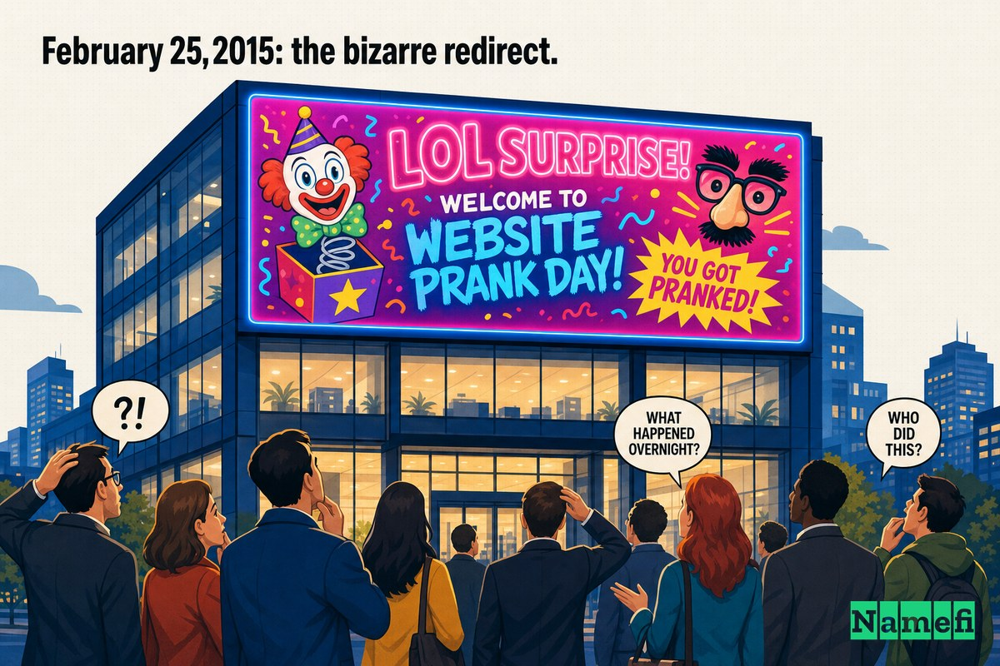
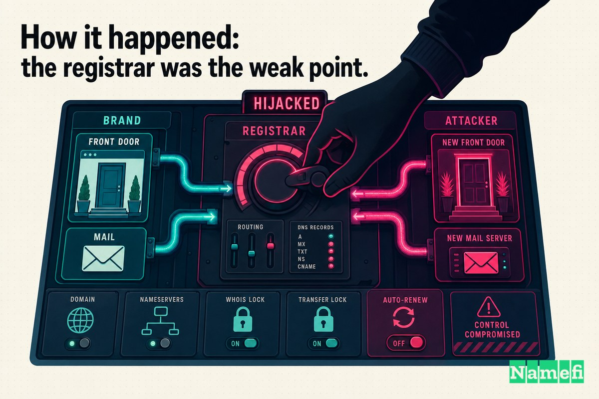
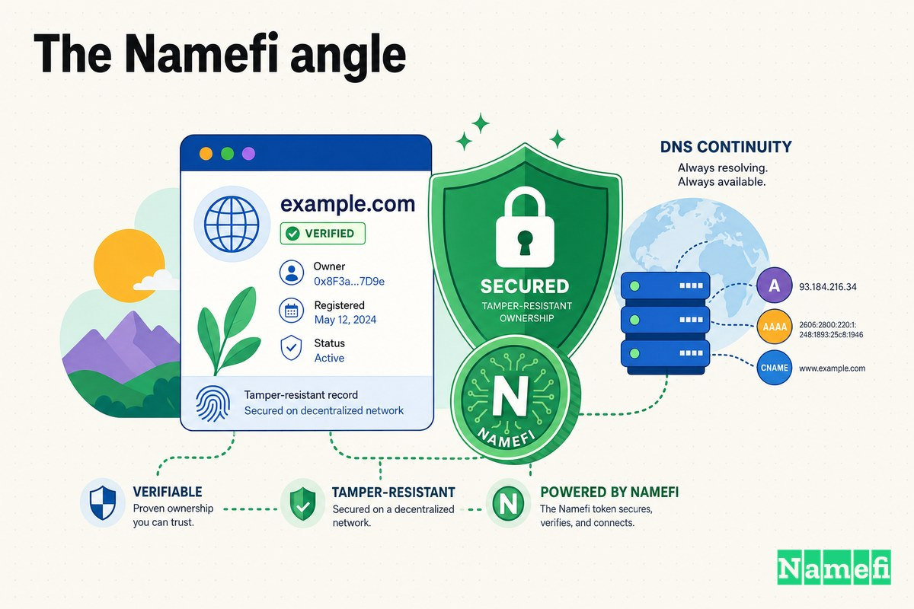

في صباح يوم 25 فبراير 2015، الرابط الأكثر نقرًا على الإنترنت لأكبر شركة لصناعة أجهزة الكمبيوتر في العالم كان بيوصّل المستخدمين لعرض صور شباب زهقانين بيبصوا في ويب كاميراتهم، على إيقاع أغنية من فيلم *High School Musical*. محدش اخترق أي سيرفر من سيرفرات Lenovo. محدش سرق أي كلمة مرور من Lenovo. المهاجمون ما لمسوش المبنى، ولا الشبكة، ولا الموقع نفسه.

غيّروا سجل واحد بس عند شركة تسجيل النطاق الخاصة بالشركة — وده كان كافي إنهم يسيطروا على باب Lenovo الأمامي، ويحوّلوا بريدها، ويحوّلوا [العلامة التجارية](/ar/glossary/trademark/) لمصدر سخرية طول فترة الظهيرة.

ده هو **Domain Mayday EP17**: [اختطاف DNS](/ar/glossary/dns-hijacking/) لـ Lenovo.com. القصة صغيرة من ناحية الأرقام — بضع ساعات انقطاع، مفيش أنظمة إنتاج انخترقت، مفيش قاعدة بيانات عملاء اتسربت. لكنها واحدة من أوضح العروض اللي اتعملت يومًا على درس معظم الشركات لسه بتفهمه غلط: نطاقك بالأمان بقدر أمان شركة التسجيل اللي بتحتفظ بيه، وشركة التسجيل دي غالبًا مش جزء من برنامج أمانك أصلًا.

## عملاق الأجهزة اللي نطاقه هو وجهه

بحلول 2015، كانت Lenovo [أكبر شركة لصناعة أجهزة الكمبيوتر في العالم](https://www.bankinfosecurity.com/lizard-squad-teases-lenovo-e-mail-grab-a-7953#:~:text=the%20world%27s%20largest%20PC%20manufacturer)، بتشحن لاب توب وديسك توب أكتر من أي حد تاني على وجه الأرض. لشركة بالحجم ده، lenovo.com مش مجرد أصل تسويقي. ده المركز اللي بيشيل العملية كلها: المكان اللي العملاء بيشتروا منه، والمكان اللي بتيجي عليه تذاكر الدعم، والمكان اللي بتمشي منه تسجيلات [الضمان](/ar/glossary/collateral/) — والأهم، النطاق اللي وراء كل عنوان `@lenovo.com` في الشركة.

لما علامة تجارية توصل لمستوى زي ده، النطاق بيبطّل يكون مجرد عنوان موقع ويصبح بنية تحتية. كل بيان صحفي، كل كرتون منتج، كل توقيع موظف، كل تأكيد طلب بيمشي عبره. وده معناه إن اللي بيتحكم في DNS النطاق ده، مش بس بيتحكم في الموقع — بيتحكم في *الحقيقة* عن المكان اللي lenovo.com بيشير ليه، للمتصفحات وسيرفرات البريد على حد سواء.

ده هو الجائزة اللي Lizard Squad راح ورايها. مش الموقع. البوصلة اللي بتشير ليه.

## 25 فبراير 2015: إعادة التوجيه الغريبة

بداية من ذلك الظهر، الزوار اللي كتبوا lenovo.com ما وصلوش لـ Lenovo. الموقع اتاستبدل [بعرض صور ويب كاميرا لشباب قاعدين على كمبيوتراتهم](https://www.engadget.com/2015-02-25-lenovo-com-hacked.html)، بيبصوا في الكاميرا بنظرة فاضية ومحرجة نوعًا ما، على أنغام أغنية ["Breaking Free"](https://www.engadget.com/2015-02-25-lenovo-com-hacked.html) من فيلم *High School Musical*. The Register وصف المشهد نفسه على إنه [عرض صور ويب كاميرا لشاب يبدو عليه الملل](https://www.theregister.com/2015/02/25/lenovo_hacked_lizard_squad/#:~:text=slideshow%20of%20webcam%20photos%20of%20a%20bored%2Dlooking%20youth) بدل منتجات الشركة الاعتيادية.

كان سخيفًا بشكل متعمد، والسخرية دي كانت هي الهدف. ده مكانش سرقة بيانات هادية هدفها إنها تفضل مخبية. ده كان إهانة علنية، منظمة على أكثر URL مرئي تمتلكه الشركة.

المصدر كان واضح للعيان. صفحة HTML البديلة نسبت بناءها "المُعاد تسمية والمحسّن" لـ [Ryan King و Rory Andrew Godfrey](https://www.engadget.com/2015-02-25-lenovo-com-hacked.html) — اسمين ربطهم المحققون على الإنترنت سريعًا بـ Lizard Squad، نفس الفرقة اللي قضت موسم الأعياد السابق في تعطيل PlayStation Network و Xbox Live. المجموعة أعلنت مسؤوليتها على Twitter، مقتبسةً كلمات أغنية *High School Musical* موجهةً إياها لـ Lenovo بلا مواربة.

وبعدين الأمور اتعقدت أكتر من كونها مجرد إحراج. لأن المهاجمين كانوا بيتحكموا في DNS الخاص بـ lenovo.com، ما كانوش بس بيمتلكوا الموقع — كانوا بيمتلكوا البريد كمان. كما قال أحد المصادر، الاختطاف [معناه إنهم قدروا يعترضوا بريد Lenovo الإلكتروني كمان](https://www.engadget.com/2015-02-25-lenovo-com-hacked.html)، لحين إيقاف إعادة التوجيه. لاحقًا نشر Lizard Squad رسالتين [أُرسلتا لموظفين في Lenovo](https://www.bankinfosecurity.com/lizard-squad-teases-lenovo-e-mail-grab-a-7953#:~:text=published%20two%20e%2Dmails) خلال الفترة اللي كانوا فيها متحكمين. واحدة منهم، في توقيت كوميدي سوداوي، [كانت بتتكلم عن لاب توب Lenovo Yoga اللي "بظ"](https://www.bankinfosecurity.com/lizard-squad-teases-lenovo-e-mail-grab-a-7953#:~:text=bricked) لما العميل حاول يستخدم أداة Lenovo الخاصة لإزالة برنامج اسمه Superfish.

التفصيلة دي هي الدافع كله في جملة واحدة.

## السياق: قصة Superfish

عشان تفهم ليه Lenovo تحديدًا، لازم ترجع خمس أيام للوراء.

Superfish كان برنامج إعلانات Lenovo كانت [بتحطه مع بعض أجهزتها من سبتمبر 2014](https://en.wikipedia.org/wiki/Superfish#:~:text=Lenovo%20began%20to%20bundle%20the%20software%20with%20some%20of%20its%20computers%20in%20September%202014). من الظاهر كان مجرد برنامج لحقن الإعلانات — برنامج بيدس إعلانات تسوق إضافية في متصفحك. لكن طريقة عمله كانت كارثية. عشان يحقن إعلانات في الصفحات المشفرة، Superfish نصّب شهادته الجذرية الخاصة عشان يقدر [يدس إعلانات حتى في الصفحات المشفرة](https://en.wikipedia.org/wiki/Superfish#:~:text=allows%20a%20man%2Din%2Dthe%2Dmiddle%20attack%20to%20introduce%20ads%20even%20on%20encrypted%20pages) — بمعنى إنه كسر القفل اللي بيحمي HTTPS.

الأسوأ من كده إن الشهادة استخدمت نفس [المفتاح الخاص](/ar/glossary/private-key/) على كل الأجهزة، وده المفتاح كان قابل للاختراق. أي مهاجم قدر يستخرجه كان يقدر ينتحل صفة *أي* موقع HTTPS لـ *أي* لاب توب Lenovo شغّال Superfish. ده مكانش عيبًا نظريًا. في [20 فبراير 2015، وزارة الأمن الداخلي الأمريكية نصحت بإلغاء تثبيته](https://en.wikipedia.org/wiki/Superfish#:~:text=the%20United%20States%20Department%20of%20Homeland%20Security%20advised%20uninstalling%20it) وشهادته الجذرية.

يعني في خلال أسبوع واحد، شركة بتبيع الأمان والثقة للمؤسسات كانت قد شحنت ملايين اللاب توبات بثغرة man-in-the-middle مدمجة فيها، وبعدين شافت أداة الإزالة الخاصة بيها تخرّب جهاز عميل واحد على الأقل. اختطاف Lizard Squad جه متأطَّرًا كاحتجاج — [جرعة من دواءها الخاص](https://www.theregister.com/2015/02/25/lenovo_hacked_lizard_squad/#:~:text=sparked%20online%20uproar%20following%20the%20discovery%20of%20adware%20called%20Superfish) بعد ضجة Superfish. عرض الويب كاميرا كان مسرحية. الرسالة كانت: *أنتم كسرتوا التشفير لعملاءكم، فاحنا هنكسر بابكم الأمامي عنكم.*

## إزاي حصل: شركة التسجيل كانت هي نقطة الضعف

هنا الجزء اللي المفروض يخلّي مديري أمن المعلومات صاحيين: البنية التحتية الخاصة بـ Lenovo ما انخترقتش أبدًا.

المهاجمون راحوا للمُسجِّل بدلًا من كده. محللو الأمن تتبعوا الاختطاف لاختراق **Web Commerce Communications** — المعروفة بـ **Webnic.cc**، مسجِّل مقره ماليزيا. كما قالت Help Net Security، القراصنة ما اخترقوش سيرفرات Lenovo؛ بدلًا من كده [اخترقوا سيرفرات Web Commerce Communications (Webnic.cc)](https://www.helpnetsecurity.com/2015/02/26/lenovocom-hijacking-made-possible-by-compromise-of-webnic-registrar/)، المسجِّل اللي كان مسجَّل عنده نطاق Lenovo.

مكانش ده أول أسبوع سيء لـ Webnic. قبلها بيومين بس، كان النطاق الفيتنامي لـ Google اتحوّل بنفس الطريقة. SecurityWeek لخّص الصلة بشكل صريح: Lizard Squad [اختطف سجلات DNS لـ Google Vietnam و Lenovo بعد اختراق أنظمة WebNIC](https://www.securityweek.com/lizard-squad-hijacks-lenovo-website-emails/)، المسجِّل المقيم في ماليزيا. Brian Krebs، مستشهدًا بالباحثين اللي حققوا في الموضوع، نقل إن [الاختطافين الاتنين كانوا ممكنين لأن المهاجمين سيطروا على Webnic.cc](https://krebsonsecurity.com/2015/02/webnic-registrar-blamed-for-hijack-of-lenovo-google-domains/#:~:text=both%20hijacks%20were%20possible%20because%20the%20attackers%20seized%20control%20over%20Webnic.cc) — مسجِّل كان بيخدم النطاقين دول و600,000 نطاق تاني.

الآليات، من تقرير Krebs، بتبدو زي كتاب دراسي عن ليه المسجِّل هدف جذاب:

- **طريقة الدخول.** Lizard Squad استخدم [ثغرة command injection في Webnic.cc عشان يرفع rootkit](https://krebsonsecurity.com/2015/02/webnic-registrar-blamed-for-hijack-of-lenovo-google-domains/#:~:text=command%20injection%20vulnerability%20in%20Webnic.cc%20to%20upload%20a%20rootkit) — مما أعطاهم وصولًا دائمًا ومخفيًا لأنظمة المسجِّل.
- **المفاتيح الرئيسية.** كمان [حصلوا على وصول لمخزن Webnic من](https://krebsonsecurity.com/2015/02/webnic-registrar-blamed-for-hijack-of-lenovo-google-domains/#:~:text=also%20gained%20access%20to%20Webnic%27s%20store%20of) "auth codes" — أسرار نقل EPP اللي بتقدر تنقل *أي* نطاق لمسجِّل تاني.
- **إعادة التوجيه.** بالتحكم في مستوى المسجِّل، غيّروا سجلات nameserver لـ lenovo.com. The Register لاحظ إن [إعدادات nameserver للنطاق اتحدّثت بشكل مريب لتشير لسيرفرات DNS تابعة لشركة الاستضافة CloudFlare](https://www.theregister.com/2015/02/25/lenovo_hacked_lizard_squad/#:~:text=nameserver%20settings%20were%20suspiciously%20updated%20today%20to%20point%20at%20DNS%20servers%20belonging%20to%20web%20hosting%20biz%20CloudFlare) — مستخدمين Cloudflare عشان يخفوا السيرفر الحقيقي للوجهة.
- **سرقة البريد.** والأهم إنهم ما وقفوش عند الموقع. [غيّروا سجلات سيرفر البريد مما سمح لهم باعتراض الرسائل](https://www.securityweek.com/lizard-squad-hijacks-lenovo-website-emails/) المُرسَلة لعناوين Lenovo. DNS بيتحكم في أكتر من مجرد سجل `A`؛ بيتحكم في سجل `MX` كمان. امتلاك النطاق معناه امتلاك البريد.

النقطة الأخيرة دي هي اللي الناس بتنساها. تشويه موقع ويب ضوضاء وواضح. اعتراض البريد الإلكتروني بصمت هو النصف الخطير من اختطاف DNS — وبيحصل كنتيجة طبيعية لنفس الفعل الواحد المتمثل في تغيير سجل واحد عند المسجِّل.

## الاستجابة والتداعيات

Lenovo تحركت بسرعة، لأنه ما كانش في شيء تاني تعمله — الإصلاح كان عند المسجِّل، مش على سيرفراتها هي. الشركة أكدت إنها [وقعت ضحية لهجوم إلكتروني](https://www.securityweek.com/lizard-squad-hijacks-lenovo-website-emails/) كان تأثيره تحويل الزيارات من موقع Lenovo، و[يبدو إنها استعادت الوصول الكامل لموقعها العام بحلول مساء 25 فبراير](https://www.bankinfosecurity.com/lizard-squad-teases-lenovo-e-mail-grab-a-7953#:~:text=restored%20complete%20access%20to%20its%20public%20website%20by%20the%20evening%20of%20Feb.%2025). Cloudflare، لما وجدت اسمها يُستخدم في سلسلة إعادة التوجيه، قطعت اتصال سيرفرات الأسماء الضارة، مما أنهى اعتراض البريد الإلكتروني كمان.

التنظيف الأكبر كان من نصيب Webnic. ثغرة command injection واحدة في مسجِّل واحد كانت كافية عشان تسلّم اتنين من أكثر النطاقات قيمة على الإنترنت — نطاق Lenovo ونطاق Google — لمجموعة قرصنة تعمل كل حاجة بقصد الإثارة، في غضون 48 ساعة. الحادثة أصبحت دراسة حالة ثابتة في مخاطر المسجِّل، وتذكير بإن "600,000 نطاق تاني" كانت وراء نفس النظام المخترق.

بالنسبة لـ Lenovo، الضرر الدائم كان في السمعة. بعد Superfish بأيام قليلة، الاختطاف حوّل فشلًا أمنيًا خطيرًا لقصة من فصلين: أول الشركة كسّرت الثقة مع عملاءها، بعدين خسرت السيطرة على اسمها بشكل مرئي للجميع. عرض الويب كاميرا هو اللي الناس فضلت فاكراه، لكن اختراق المسجِّل هو اللي مهمّ فعلًا.

## الدرس المستفاد: مسجِّلك هو خطك الدفاعي الحقيقي

الدرس المزعج من EP17 إن Lenovo اتصرفت صح في كل الحاجات اللي كانت بتتحكم فيها، ومع كده اتخطفت من خلال الجزء اللي ما كانتش بتتحكم فيه.

كذا نقطة قابلة للتعميم بعيدًا عن 2015:

1. **مسجِّلك داخل حدود ثقتك سواء تعاملت معاه كده ولا لأ.** تقدر تحصّن كل سيرفر بتمتلكه ومع كده تخسر النطاق عند طرف تالت على الأغلب ما راجعته أمنيًا أبدًا. المهاجم بياخد أسهل طريق — والمسجِّل في الغالب أضعف منك.
2. **التحكم في DNS هو التحكم في البريد.** الاختطاف مش مجرد صفحة رئيسية مشوّهة. نفس التغيير في [السجل](/ar/glossary/registry/) بيحوّل البريد الإلكتروني بصمت، مما يُتيح الاعتراض وإعادة تعيين كلمات المرور ضد نطاقك والانتحال. تعامل مع سجل `MX` كأصل حرج أمنيًا، مش مجرد سباكة.
3. **قفّل اللي ينقفل.** قفل المسجِّل (registrar-lock / `clientTransferProhibited`)، والوصول المحدود لأكواد EPP/auth، والقفل على مستوى السجل للنطاقات عالية القيمة موجودة بالتحديد عشان توقف التغييرات غير المصرح بها في nameserver والنقل. ده رخيص. العيب من تجاهله هو علامتك التجارية على عرض ويب كاميرا.
4. **[DNSSEC](/ar/glossary/dnssec/) بيرفع التكلفة.** ما كانش هيوقف سيطرة على حساب المسجِّل لوحده، لكن الزونات المُوقَّعة ومراقبة DNS بتخلي التلاعب الصامت أصعب في التنفيذ بدون كشف.
5. **راقب DNS الخاص بيك للانحراف.** تغيير nameservers لـ Lenovo لمزود غير متوقع كان هو العلامة الواضحة. المراقبة المستمرة لسجلات NS و MX بتحوّل "اتعرفنا لما العملاء شافوا العرض" لـ "اتنبّهنا لما تغيّر السجل".

القاسم المشترك: التحكم في النطاق هو نطاق أمان قائم بذاته، ومعظم الشركات فوّضته لمورّد ما بيظهرش في نموذج التهديد الخاص بيها.

## الزاوية من منظور Namefi

اختطاف Lenovo هو في جوهره مشكلة تحكم وإثبات المصدر. المهاجم ما احتاجش يكون *هو* Lenovo؛ كان محتاج بس يقنع النظام اللي بيتحكم في lenovo.com إنه يشير لمكان جديد. ما كانش في سجل قوي ومستقل وقابل للتحقق لمين يتحكم بشكل شرعي في النطاق — مجرد حساب مسجِّل ينقدر يُسيطر عليه بهدوء من خلال ثغرة محدش في Lenovo قدر يشوفها.

[Namefi](https://namefi.io) مبني على فكرة إن النطاقات المفروض تتصرف زي أصول أصيلة في الإنترنت بملكية قابلة للتحقق ومقاومة للتلاعب. لما التحكم في النطاق يكون مرتكزًا على ملكية مشفّرة قابلة للتدقيق وصعبة الإلغاء الصامت — بدلًا من حساب مسجِّل واحد بكود مصادقة قابل للاسترداد — عملية تبديل nameserver غير المصرح بها بتبطّل تكون مجرد تعديل خلفي هادئ وتبدأ تكون كسرًا مرئيًا وقابلًا للإثبات في سلسلة الحيازة. الملكية المرمّزة بتحافظ على توافق النطاق مع DNS مع إن "مين بيتحكم في هذا الاسم، وهل ده اتغيّر للتو؟" يبقى سؤال بيملك جواب قابل للتحقق.

Lizard Squad حوّل باب عملاق أجهزة لمزحة خلال ظهيرة واحدة باستغلال الحلقة الأضعف في سلسلة الملكية. الدفاع مش موقع ويب أعلى صوتًا. ده *جعل ملكية* الاسم نفسها حاجة مهاجم ما يقدرش يزيّفها بهدوء.

## المصادر وقراءة إضافية

- Krebs on Security — [Webnic Registrar Blamed for Hijack of Lenovo, Google Domains](https://krebsonsecurity.com/2015/02/webnic-registrar-blamed-for-hijack-of-lenovo-google-domains/)
- The Register — [Oh No, Lenovo! Lizard Squad on the attack, flashes swiped emails](https://www.theregister.com/2015/02/25/lenovo_hacked_lizard_squad/)
- Engadget — [Lenovo's website hijacked, apparently by Lizard Squad](https://www.engadget.com/2015-02-25-lenovo-com-hacked.html)
- SecurityWeek — [Lizard Squad Hijacks Lenovo Website, Emails](https://www.securityweek.com/lizard-squad-hijacks-lenovo-website-emails/)
- Help Net Security — [Lenovo.com hijacking made possible by compromise of Webnic registrar](https://www.helpnetsecurity.com/2015/02/26/lenovocom-hijacking-made-possible-by-compromise-of-webnic-registrar/)
- BankInfoSecurity — [Lenovo Website Hijacked](https://www.bankinfosecurity.com/lizard-squad-teases-lenovo-e-mail-grab-a-7953)
- IT Security Guru — [Lizard Squad domain hijack gives control of Google Vietnam and Lenovo website](https://www.itsecurityguru.org/2015/02/26/lizard-squad-domain-hijack-gives-control-of-google-vietnam-and-lenovo-website/)
- CNBC — [Lenovo website breached, hacker group Lizard Squad claims responsibility](https://www.cnbc.com/2015/02/25/lenovo-website-breached-hacker-group-lizard-squad-claims-responsibility.html)
- We Live Security (ESET) — [Lenovo website hacked, Lizard Squad claims responsibility](https://www.welivesecurity.com/2015/02/26/lenovo-website-hacked-lizard-squad-claims-responsibility/)
- Computing — [Lenovo website hijacked by Lizard Squad after Superfish debacle](https://www.computing.co.uk/news/2397084/lenovo-website-hijacked-by-lizard-squad-after-superfish-debacle)
- Wikipedia — [Superfish](https://en.wikipedia.org/wiki/Superfish)
- CISA — [Lenovo Superfish Adware Vulnerable to HTTPS Spoofing](https://www.cisa.gov/news-events/alerts/2015/02/20/lenovo-superfish-adware-vulnerable-to-https-spoofing)
