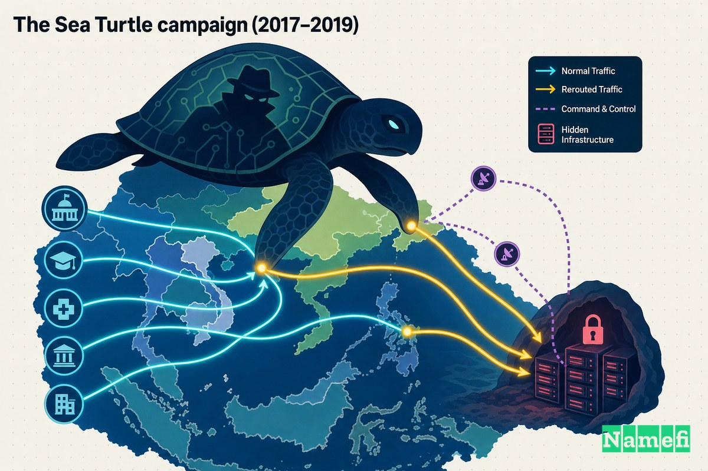
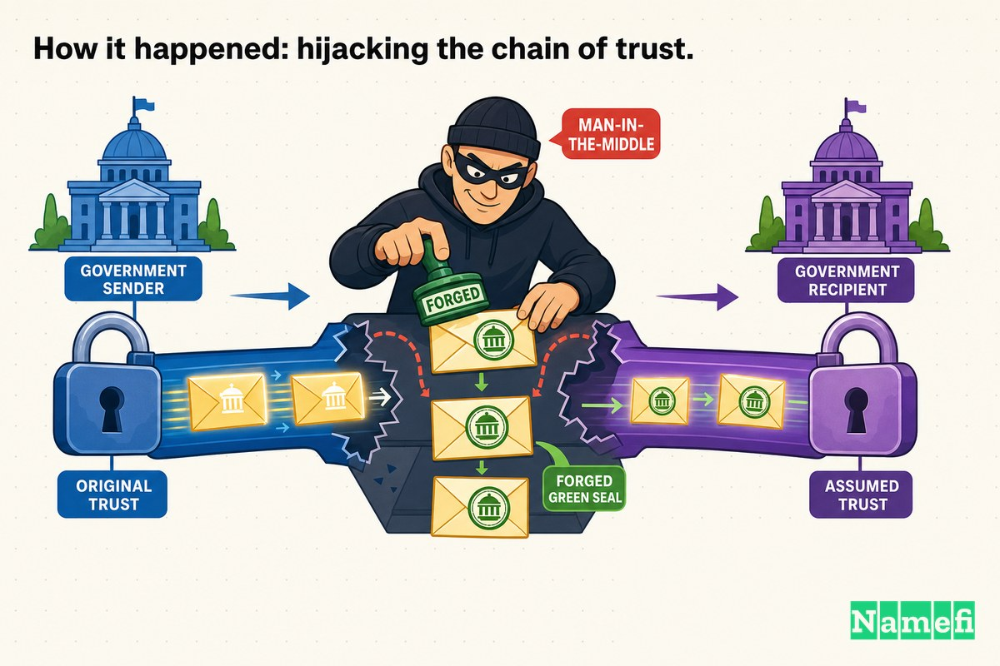
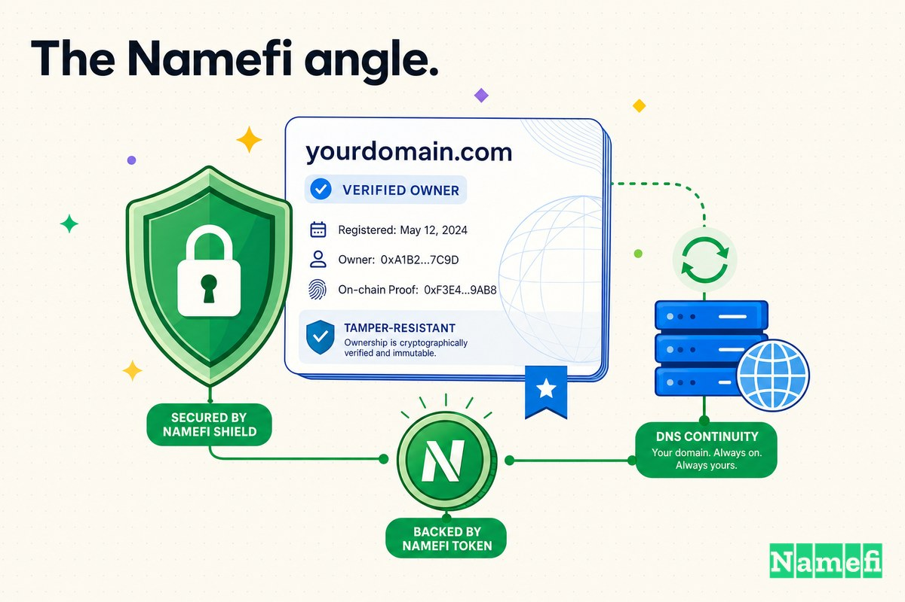

معظم الهجمات الإلكترونية بتحاول تتسلل *للداخل* بتاع الهدف. حملة Sea Turtle عملت حاجة أهدى من كده وأخطر بكتير: اخترقت **الخريطة** اللي بتقول للإنترنت كله فين الهدف ده موجود.

لما بتكتب عنوان موقع وزارة حكومية أو بتبعت إيميل لمسئوليها، الكمبيوتر بتاعك بيسأل أول حاجة [نظام أسماء النطاقات](/ar/glossary/dns/) — DNS — إنه يترجم الاسم ده للعنوان الرقمي للسيرفر الصح. عملية البحث دي أساسية لدرجة إن تقريباً محدش على الإنترنت بيتحقق منها. إحنا ببساطة بنثق إن الاسم ده هيوصلنا للمكان المفروض. المشغلون في Sea Turtle فهموا هذه الثقة كويس جداً، وقضوا أكتر من سنتين بيستغلوها للتجسس على حكومات في الشرق الأوسط وشمال أفريقيا.

الكشف عنها عن طريق Cisco Talos في أبريل 2019، Sea Turtle واحدة من أوضح دراسات الحالة اللي عندنا عن DNS نفسه وهو بيتحول لسلاح في أيد التجسس على مستوى الدول. المهاجمون ماعملوش تصيداً احتيالياً لموظفين فرديين وانتظروا. راحوا على جهات تسجيل النطاقات و[السجل](/ar/glossary/registry/)ات ومزودي DNS اللي قاعدين *فوق* أهدافهم — المؤسسات اللي بتتحكم في طريقة عمل الأسماء — ومن المنصة دي حولوا حركة مرور مؤسسات بأكملها، وجمعوا بيانات الدخول، وزوروا الشهادات التشفيرية اللي المفروض تخلي الانتحال مستحيل.

## DNS كهدف للتجسس على مستوى الدول

DNS بيُوصف أحياناً بأنه دليل التليفون للإنترنت، بس ده بيقلل من قيمته. أقرب تشبيه ليه هو نظام توجيه البريد: كل إيميل، وكل تسجيل دخول، وكل استدعاء API بيبدأ بحل اسم. لو أنت بتتحكم في الحل ده، بتتحكم في الوجهة — وتقدر تقعد مخفي في منتصف المحادثات اللي الطرفين مش عارفين إن حد تاني مستمع.

ده بيخلي DNS هدف تجسس مثالي تقريباً. اختراق مزود DNS واحد ممكن يكشف حركة مرور كل مؤسسة بتعتمد عليه. وبخلاف البرمجيات الخبيثة على جهاز نهاية، التلاعب في DNS ما بيلمسش أجهزة الضحية أصلاً: مفيش حاجة تتمسح أو تتعزل. السجلات ببساطة بتشير لمكان جديد.

Talos كانوا صريحين في وصف الآلية. زي ما قالوا في تقريرهم، [اختطاف DNS بيحصل لما المهاجم يقدر يعدل سجلات DNS بشكل غير مشروع عشان يوجه المستخدمين لسيرفرات تحت سيطرته](https://blog.talosintelligence.com/seaturtle/#:~:text=DNS%20hijacking%20occurs%20when%20the%20actor%20can%20illicitly%20modify%20DNS%20name%20records%20to%20point%20users%20to%20actor%2Dcontrolled%20servers). بسيطة في وصفها؛ مدمرة في التطبيق.

## حملة Sea Turtle (2017–2019)

Sea Turtle ما كانتش هجوم سريع واهرب. Talos قدّروا إن [العملية المستمرة دي على الأرجح بدأت من يناير 2017 واستمرت لحد الربع الأول من 2019](https://blog.talosintelligence.com/seaturtle/#:~:text=The%20ongoing%20operation%20likely%20began%20as%20early%20as%20January%202017%20and%20has%20continued%20through%20the%20first%20quarter%20of%202019) — أكتر من سنتين من العمليات الصابرة والمستمرة.

خلال الفترة دي، وعلى حسب عد Talos، [على الأقل 40 مؤسسة مختلفة في 13 دولة اتاخترقوا خلال الحملة دي](https://blog.talosintelligence.com/seaturtle/#:~:text=at%20least%2040%20different%20organizations%20across%2013%20different%20countries%20were%20compromised%20during%20this%20campaign). TechCrunch لخصت النطاق: المجموعة [استهدفت 40 وكالة حكومية واستخباراتية وشركات اتصالات وعمالقة إنترنت في 13 دولة لأكتر من سنتين](https://techcrunch.com/2019/04/17/sea-turtle-talos-dns-hijack/)، والضحايا اتلقوا في دول زي [أرمينيا، ومصر، وتركيا، والسويد، والأردن، والإمارات العربية المتحدة](https://techcrunch.com/2019/04/17/sea-turtle-talos-dns-hijack/).

Talos ما اتنسبتش علناً لحكومة بعينها، لكنهم كانوا واثقين من مستوى المشغل. Craig Williams من Cisco Talos قال لـ TechCrunch إن [دي مجموعة جديدة بتشتغل بطريقة فريدة نسبياً ما شفناهاش من قبل، بتستخدم أساليب وتقنيات وإجراءات جديدة](https://techcrunch.com/2019/04/17/sea-turtle-talos-dns-hijack/)، والفريق قدّر إن [الدوافع الرئيسية للمجموعة هي التجسس](https://techcrunch.com/2019/04/17/sea-turtle-talos-dns-hijack/).

## مين اتاستهدف، وإيه اللي كان على المحك

قائمة الضحايا زي قائمة متمنيات أي جهاز استخبارات. Talos حدد الأهداف الرئيسية على إنها [مؤسسات الأمن القومي، ووزارات الشؤون الخارجية، ومنظمات الطاقة البارزة](https://blog.talosintelligence.com/seaturtle/#:~:text=national%20security%20organizations%2C%20ministries%20of%20foreign%20affairs%2C%20and%20prominent%20energy%20organizations) — بالضبط المؤسسات اللي أي دولة معادية هتحب تقرا مراسلاتها الداخلية.

فئة ثانية من الضحايا كانت، بمعنى ما، أكتر دلالة. Talos لقى المهاجمين كمان ضربوا [عدداً من مسجلي DNS وشركات الاتصالات ومزودي خدمة الإنترنت](https://blog.talosintelligence.com/seaturtle/#:~:text=numerous%20DNS%20registrars%2C%20telecommunication%20companies%2C%20and%20internet%20service%20providers). دول ما كانوش الجوائز النهائية؛ كانوا *الوسيلة*. بامتلاك مزودي البنية التحتية، المهاجمون كسبوا النفوذ اللازم لتعديل DNS للأهداف الحقيقية في المراحل التالية.

ملخص BleepingComputer وصف الجائزة بوضوح: الأهداف الرئيسية كانت [وزارات الشؤون الخارجية، والمنظمات العسكرية، وأجهزة الاستخبارات، وشركات الطاقة](https://www.bleepingcomputer.com/news/security/sea-turtle-campaign-focuses-on-dns-hijacking-to-compromise-targets/). لما تقدر تعترض إيميلات وحركة تسجيل الدخول لوزارة خارجية بصمت، مش محتاج تكسر التشفير — ممكن ببساطة تجمع بيانات الدخول وتقرا الإيميلات وهي بتعدي.

## إزاي حصل ده: اختطاف سلسلة الثقة

ده اللي خلى Sea Turtle متطورة بشكل غير عادي: المهاجمون نادراً ما راحوا مباشرة على ضحاياهم. بدل ده، صعدوا سلسلة الثقة.

النمط، زي ما أعاد Talos تركيبه وأكده التحقيق المستقل، كان تقريباً كالتالي. أول حاجة: الحصول على موطئ قدم عند مزود DNS أو جهة تسجيل أو سجل — عادةً من خلال تصيد احتيالي موجه أو استغلال ثغرة معروفة. بهذا الوصول، [تعديل سجلات DNS عشان توجه المستخدمين الشرعيين للهدف نحو سيرفرات تحت سيطرة المهاجم](https://blog.talosintelligence.com/seaturtle/#:~:text=Modified%20DNS%20records%20to%20point%20legitimate%20users%20of%20the%20target%20to%20actor%2Dcontrolled%20servers). السيرفرات دي اتعملت كطبقة وسيطة: وفقاً لـ BleepingComputer، [مشغلو Sea Turtle أعدوا إطاراً للهجوم الوسيط (MitM) انتحل صفة الخدمات الشرعية اللي بيستخدمها الضحية بهدف سرقة بيانات الدخول](https://www.bleepingcomputer.com/news/security/sea-turtle-campaign-focuses-on-dns-hijacking-to-compromise-targets/). الضحايا كانوا بيسجلوا الدخول لما يبدو إنه بوابة الإيميل أو VPN العادية بتاعتهم، والمهاجمون [بيلتقطوا بيانات دخول المستخدمين الشرعيين لما بيتفاعلوا مع السيرفرات دي](https://blog.talosintelligence.com/seaturtle/#:~:text=Captured%20legitimate%20user%20credentials%20when%20users%20interacted%20with%20these%20actor%2Dcontrolled%20servers)، وبعدين بيمرروها للخدمة الحقيقية بهدوء عشان ما يحسسش حد بأي مشكلة.

الجزء الأذكى — والأكتر إثارة للقلق — كان إزاي تغلبوا على القفل. تحويل حركة المرور حاجة، لكن عملها من غير إطلاق تحذير شهادة المتصفح حاجة تانية. Sea Turtle حلت ده بالحصول على شهادات صالحة وحقيقية للنطاقات اللي كانوا بينتحلونها. Talos لقى إن المهاجمين [حصلوا على شهادة X.509 موقعة من جهة إصدار شهادات من مزود تاني لنفس النطاق](https://blog.talosintelligence.com/seaturtle/#:~:text=obtained%20a%20certificate%20authority%2Dsigned%20X.509%20certificate)، محيطين إن [المهاجمين دول بيستخدموا شهادات Let's Encrypt وComodo وSectigo وشهادات ذاتية التوقيع في سيرفرات الهجوم الوسيط بتاعتهم](https://blog.talosintelligence.com/seaturtle/#:~:text=use%20Let%27s%20Encrypts%2C%20Comodo%2C%20Sectigo%2C%20and%20self%2Dsigned%20certificates). لأنهم كانوا بيتحكموا في سجلات DNS، قدروا يعدوا فحوصات التحقق التلقائي من النطاق اللي جهات إصدار الشهادات المجانية بتعتمد عليها — ومشيوا بقفل أخضر شرعي لنطاق مش ملكهم.

Brian Krebs، وهو بيوثق الموجة الأولى السابقة المشابهة جداً، وصف نفس خطة اللعب: المهاجمون [يبدو إنهم غيروا سجلات DNS للنطاقات دي عشان النطاقات تشير لسيرفرات في أوروبا تحت سيطرتهم](https://krebsonsecurity.com/2019/02/a-deep-dive-on-the-recent-widespread-dns-hijacking-attacks/)، وبعدين [قدروا يحصلوا على شهادات SSL لهذه النطاقات من مزودي SSL Comodo و/أو Let's Encrypt](https://krebsonsecurity.com/2019/02/a-deep-dive-on-the-recent-widespread-dns-hijacking-attacks/). واحدة من الضحايا المذكورين كانت [mail.gov.ae، اللي بتعمل إيميلات المكاتب الحكومية في الإمارات العربية المتحدة](https://krebsonsecurity.com/2019/02/a-deep-dive-on-the-recent-widespread-dns-hijacking-attacks/).

### اختراقات السجلات

أعلى نقطة وصلتها الحملة كانت اختراق المؤسسات اللي ما بس بتستخدم DNS، لكن *بتشغله* لدول بأكملها.

أول حالة مؤكدة علناً كانت بتخص السويد Netnod. زي ما Krebs أفاد، المهاجمون [حصلوا على وصول لحسابات في جهة تسجيل نطاقات Netnod](https://krebsonsecurity.com/2019/02/a-deep-dive-on-the-recent-widespread-dns-hijacking-attacks/)، وNetnod نفسها أعلنت إنها [علمت بدورها في الهجوم في 2 يناير](https://krebsonsecurity.com/2019/02/a-deep-dive-on-the-recent-widespread-dns-hijacking-attacks/). الأهم إن Netnod ما كانتش الوجهة — كانت باب. BleepingComputer لاحظ إن Netnod قالت [إنهم ما كانوش هدف الهجمات لكن مسار للمهاجم لـ "التقاط بيانات تسجيل الدخول لخدمات الإنترنت"](https://www.bleepingcomputer.com/news/security/sea-turtle-campaign-focuses-on-dns-hijacking-to-compromise-targets/).

Talos وصف الأهمية الأشمل بكلمات صريحة: المشغلون [مسؤولون عن أول حالة مؤكدة علناً ضد مؤسسة تدير منطقة سيرفر جذري](https://blog.talosintelligence.com/seaturtle/#:~:text=responsible%20for%20the%20first%20publicly%20confirmed%20case%20against%20an%20organizations%20that%20manages%20a%20root%20server%20zone). لما الناس اللي بيشغلوا جزء من كتاب عناوين الإنترنت الأساسي ممكن يتاخد مكانهم بصمت، الافتراض إن DNS موثوق بشكل تلقائي بيوقف كده.

## الاستجابة والتداعيات: ما وقفوش

[اختطاف DNS](/ar/glossary/dns-hijacking/) على النطاق ده استدعى استجابة رسمية. في يناير 2019، وكالة الأمن السيبراني وأمن البنية التحتية الأمريكية أصدرت [التوجيه الطارئ 19-01، "التخفيف من التلاعب في بنية تحتية DNS"](https://www.cisa.gov/news-events/directives/ed-19-01-mitigate-dns-infrastructure-tampering-closed) — أول توجيه طارئ تصدره CISA على الإطلاق — أمرت فيه الوكالات الفيدرالية بمراجعة سجلات DNS بتاعتها، وتغيير بيانات الدخول لحسابات إدارة DNS، وتفعيل المصادقة متعددة العوامل على الحسابات دي. ده كان اعتراف ضمني بإن إدارة DNS أصبحت خط المواجهة الأمامي للأمن القومي.

اللي يلفت النظر أكتر في Sea Turtle، مع ذلك، هو اللي حصل *بعد* ما اتكشفت. معظم الحملات بتهدى لما مزود زي Talos ينشر أساليبهم. Sea Turtle عملت العكس.

في متابعة في يوليو 2019، Talos أفادوا بإن المجموعة لقت ضحايا جدد، من بينهم [سجل نطاق المستوى الأعلى لرمز دولة (ccTLD)، اللي بيدير سجلات DNS لكل نطاق بيستخدم رمز الدولة ده](https://blog.talosintelligence.com/sea-turtle-keeps-on-swimming/#:~:text=a%20country%20code%20top%2Dlevel%20domain%20%28ccTLD%29%20registry). بالتحديد، [معهد علوم الكمبيوتر التابع لمؤسسة البحث والتكنولوجيا - هيلاس (ICS-Forth)، سجل ccTLD لليونان](https://blog.talosintelligence.com/sea-turtle-keeps-on-swimming/#:~:text=The%20Institute%20of%20Computer%20Science%20of%20the%20Foundation%20for%20Research%20and%20Technology%20%2D%20Hellas%20%28ICS%2DForth%29%2C%20the%20ccTLD%20for%20Greece) — الهيئة اللي بتشغل نطاق `.gr` — اتاخترقت. SecurityWeek لاحظ إنه حتى بعد ما ICS-Forth أقرت علناً بالاختراق، [بيانات Cisco telemetry أكدت إن الاختراق استمر لمدة خمسة أيام على الأقل بعد كده](https://www.securityweek.com/sea-turtles-dns-hijacking-continues-despite-exposure/).

تقييم Talos للمجموعة كان غير عادي في حدته: [المجموعة دي تبدو جريئة بشكل غير عادي، ومن غير المرجح إنها هتتوقف في المستقبل](https://blog.talosintelligence.com/sea-turtle-keeps-on-swimming/#:~:text=this%20group%20appears%20to%20be%20unusually%20brazen%2C%20and%20will%20be%20unlikely%20to%20be%20deterred%20going%20forward). وكانوا محقين. Sea Turtle ما كانتش حادثة معزولة؛ كانت دليلاً على إن التجسس على مستوى DNS بيشتغل، وإن اللي بيعملوه مستعدين يكملوا في العلن.

## اللي بتعلمنا إياه عن DNS كبنية تحتية حيوية

لو شلنا السياسة الجيوسياسية، Sea Turtle تترك ورانا مجموعة من الدروس المزعجة عن طريقة عمل طبقة تسمية الإنترنت في الواقع.

1. **DNS سلسلة ثقة، وأنت مش بتتحكم في كلها.** ممكن يبقى أمانك ممتاز. لكن حل نطاقك بيمر عبر جهة تسجيل وسجل، ولو أي منهم اتاخترق، ممكن سجلاتك تتغير من غير ما حد يلمس شبكتك. Sea Turtle أثبتت إن المهاجمين هيستهدفوا عمداً الحلقة في السلسلة اللي عندك أقل رؤية فيها.

2. **الشهادة الصالحة مش دليل على وجهة شرعية.** القفل الأخضر بيشهد إن الاتصال مشفر لـ *أياً كان اللي بيتحكم في النطاق دلوقتي* — وإذا مهاجم اخطف DNS، ده هو اللي بيتحكم. الشهادات المتحقق منها عبر النطاق موثوقة بقدر DNS اللي بتتحقق منه.

3. **التلاعب في DNS تقريباً غير مرئي للضحية.** مفيش برمجيات خبيثة بتشتغل على أجهزة الضحية. ماسحات نقطة النهاية ما بتشوفش حاجة. الإشارة الوحيدة هي إن السجلات بتشير لمكان مش المفروض — وده بالضبط سبب أهمية مراقبة سجلات DNS لأي تغييرات غير متوقعة وقفلها.

4. **أمان حسابات جهة التسجيل والسجل هو بنية تحتية للأمن القومي.** أول توجيه طارئ CISA كان، في جوهره، عن بيانات الدخول لحسابات إدارة DNS. المصادقة متعددة العوامل، وأقفال السجل، والوصول المتحكم فيه بإحكام للحسابات اللي تقدر تغير سجلات DNS مش رفاهيات أمنية — دي الفرق بين امتلاك نطاق والمجرد إنه يبدو إنك بتمتلكه.

## الجانب المتعلق بـ Namefi

Sea Turtle في جوهرها حكاية عن *مين مسموح له يغير سجلات نطاق* — وإزاي صعب على بقية العالم يعرف لما هذه الصلاحية اتسرقت بهدوء.

النموذج التقليدي بيركز هذه الصلاحية في حسابات جهة التسجيل والسجل المحمية، غالباً، بأكتر من كلمة مرور وعنوان إيميل. لما الحسابات دي تسقط، التحكم في النطاق بيسقط معاها بصمت. ما فيش سجل مستقل قابل للتحقق لمن يحمل الاسم بشكل شرعي، ولا أثر واضح يظهر التلاعب لما يتغير التحكم.

[Namefi](https://namefi.io) بتتعامل مع [ملكية النطاق](/ar/glossary/domain-ownership/) على إنها حاجة المفروض تكون **قابلة للتحقق ومقاومة للتلاعب بالتصميم**، مع البقاء متوافقة مع DNS. رمجنة الملكية بتخلق سجلاً مدققاً ومثبتاً تشفيرياً لمن يتحكم في النطاق — بيخلي التحويلات غير المصرح بها والاستحواذ الصامت أصعب بكتير على ما يتنفذوا من غير ما يتركوا أثراً واضحاً. ده في حد ذاته مش بيمنع سجلاً من يتعرض للتصيد. لكن الدرس الأشمل اللي Sea Turtle بتوصله هو بالضبط اللي Namefi متبنيه: النطاقات بنية تحتية حيوية، وسؤال *مين اللي فعلاً مالك الاسم ده* يستحق إجابة أقوى من "أياً كان اللي يقدر يسجل الدخول لوحة التحكم."

الحملة حولت حركة الحكومات باستغلال الفجوة بين *حمل* النطاق و*إثبات* إنك حامله. إغلاق الفجوة دي — بجعل الملكية قابلة للتحقق، والتحويلات قابلة للمراجعة، واستمرارية التحكم قابلة للإثبات — هو بالضبط نوع المرونة اللي طبقة التسمية لسه محتاجاها.

## المصادر وقراءات إضافية

- Cisco Talos — [اختطاف DNS يستغل الثقة في خدمة إنترنت أساسية](https://blog.talosintelligence.com/seaturtle/)
- Cisco Talos — [Sea Turtle مستمرة في السباحة، تجد ضحايا جدداً وتقنيات اختطاف DNS](https://blog.talosintelligence.com/sea-turtle-keeps-on-swimming/)
- TechCrunch — [مجموعة قرصنة مدعومة من دولة تستهدف نطاقات حكومية بوتيرة غير مسبوقة](https://techcrunch.com/2019/04/17/sea-turtle-talos-dns-hijack/)
- Krebs on Security — [غوص عميق في هجمات اختطاف DNS الواسعة الانتشار مؤخراً](https://krebsonsecurity.com/2019/02/a-deep-dive-on-the-recent-widespread-dns-hijacking-attacks/)
- BleepingComputer — [حملة 'Sea Turtle' تركز على اختطاف DNS للوصول للأهداف](https://www.bleepingcomputer.com/news/security/sea-turtle-campaign-focuses-on-dns-hijacking-to-compromise-targets/)
- SecurityWeek — [اختطاف DNS لـ Sea Turtle مستمر رغم الكشف عنه](https://www.securityweek.com/sea-turtles-dns-hijacking-continues-despite-exposure/)
- BankInfoSecurity — [مجموعة اختطاف DNS 'Sea Turtle' تمارس التجسس: تقرير](https://www.bankinfosecurity.com/sea-turtle-dns-hijacking-group-conducts-espionage-report-a-12390)
- CISA — [التوجيه الطارئ 19-01: التخفيف من التلاعب في بنية تحتية DNS](https://www.cisa.gov/news-events/directives/ed-19-01-mitigate-dns-infrastructure-tampering-closed)
- SDxCentral — [Cisco Talos يقول إن دولة قومية وراء هجمات اختطاف DNS في Sea Turtle](https://www.sdxcentral.com/articles/news/cisco-talos-says-a-nation-state-is-behind-sea-turtle-dns-hijacking-attacks/2019/04/)
- SecurityWeek — [قراصنة مدعومون من دولة يستخدمون اختطاف DNS معقداً في هجمات مستمرة](https://www.securityweek.com/state-sponsored-hackers-use-sophisticated-dns-hijacking-ongoing-attacks/)
