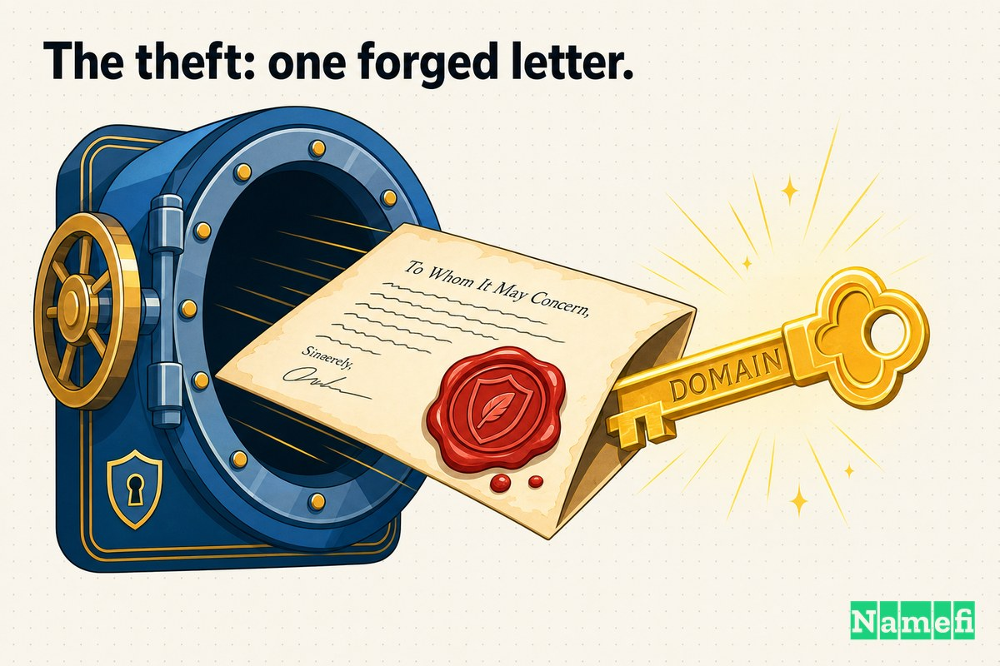
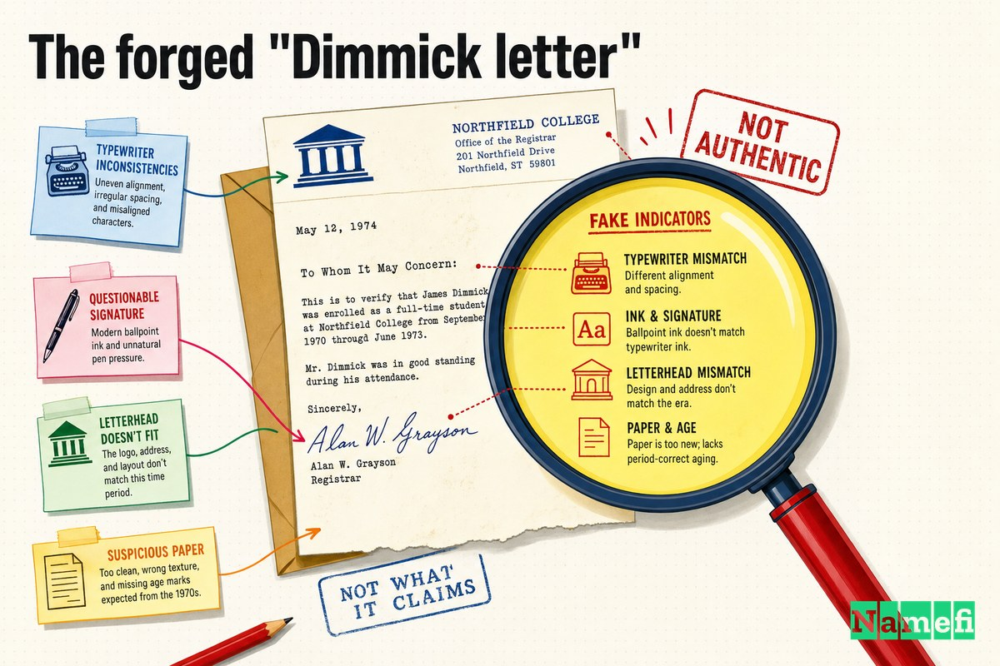
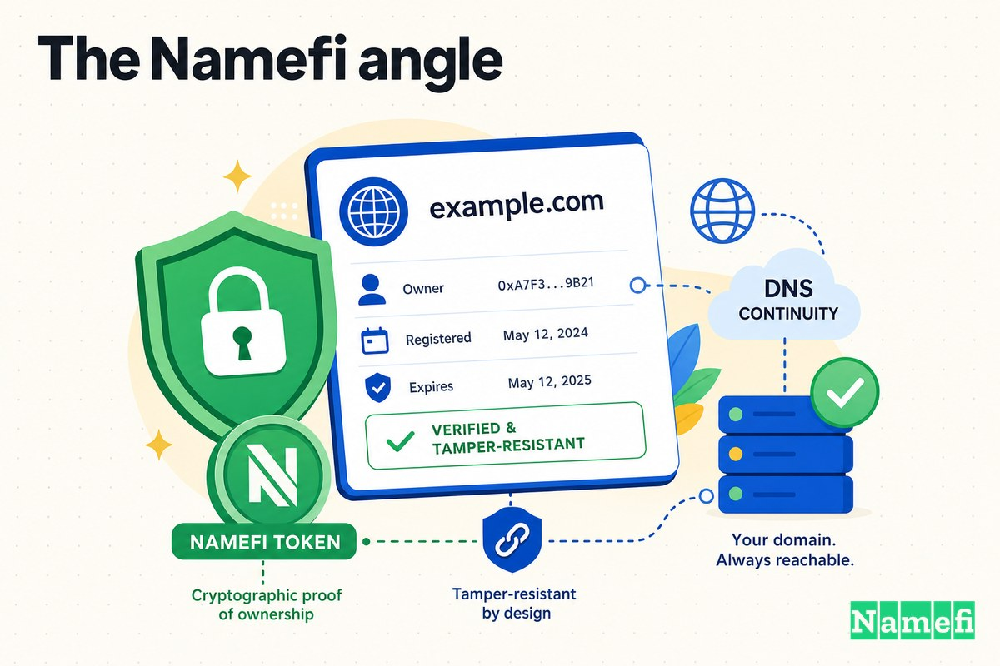

في 1995، أغلى عنوان على الإنترنت غيّر صاحبه بسبب ورقة واحدة.

مفيش اقتحام، مفيش فدية، مفيش اختراق تقني معقد. نصّاب كتب خطاب، وقّعه باسم مش بتاعه، وبعته على ماكينة فاكس لشركة تسجيل دومينات في فرجينيا. الشركة قرأته، صدّقته، وسلّمت **sex.com** — الدومين اللي اتحوّل بعد كده لتجارة بتتكلم عنها بمئات الملايين — لراجل مالوش أي حق فيه. وصاحبه الحقيقي معرفش إلا بعد ما الأمر خلص، وأمضى قرابة عشر سنين وهو بيحارب عشان يستردّه.

دي أولى سرقات الدومينات الكبرى في التاريخ، وهي لحد دلوقتي أوضح إجابة على سؤال لازم كل صاحب دومين يسأله لنفسه: *إيه اللي بيمنع حد ياخد اسمي؟* في 1995 كانت الإجابة: تقريباً لا حاجة.

أهلاً بيكم في **Domain Mayday / 域名浩劫** — الحلقات اللي بنغوص فيها جوه حوادث الأمن اللي شكّلت طريقة تفكيرنا في ملكية الأسماء على الإنترنت. الحلقة 02: الخطاب المزوّر اللي سرق sex.com.

## sex.com كانت تساوي قد إيه

في أوائل 1994، المقاول [Gary Kremen — المؤسس كمان لـ Match.com](https://en.wikipedia.org/wiki/Sex.com#:~:text=In%20early%201994%2C%20entrepreneur%20Gary%20Kremen%20%28who%20also%20founded%20Match.com) — بص على الإنترنت التجاري الجديد وشاف اللي يشوفه كل واحد عاقل. سجلات المحكمة بتحدد التاريخ بالضبط: [Gary Kremen سجّل الدومين sex.com في Network Solutions يوم 9 مايو 1994](https://www.morelaw.com/verdicts/case.asp?n=98-cv-20718&s=CA&d=11424). في الوقت ده، الدومينات كانت مجانية، بتتسجل بإيميل سريع، وتقريباً محدش كان فاهم هتبقى بأد إيه. محكمة الاستئناف التاسعة بعدين افتتحت رأيها في القضية بنكتة كانت بتتردد على طول السيرة: ["الجنس على الإنترنت؟" قالوا جميعاً. "ده مش هيجيب فلوس أبداً."](https://www.internetlibrary.com/pdf/kremen-cohen-9th-cir.pdf)

وجابت فلوس. بعد ما الدومين اتسرق، اللص حوّله لماكينة: [موقع إعلانات ثقيل كان بيستقبل لغاية 25 مليون زيارة في اليوم](https://en.wikipedia.org/wiki/Sex.com#:~:text=an%20advertising%2Dheavy%20site%20that%20received%20up%20to%2025%20million%20hits%20a%20day)، وبيجيب [من 50 ألف لـ 500 ألف دولار في الشهر](https://en.wikipedia.org/wiki/Sex.com#:~:text=making%20%2450%2C000%20to%20%24500%2C000%20per%20month) من الإعلانات. وعلى حسب بعض الروايات، الدومين المسروق أصبح أساس [تجارة بـ250 مليون دولار طول الفترة اللي كان فيها بيتحكم في sex.com بشكل غير قانوني](https://circleid.com/posts/domain_name_theft_fraud_and_regulations/#:~:text=may%20have%20created%20a%20%24250%2C000%2C000%20business%20during%20the%20years%20he%20had%20illicit%20control%20of%20the%20sex.com%20domain%20name). كان دومين عليه كلام إن [ممكن يكون أغلى دومين اتباع في التاريخ لحد النهارده](https://circleid.com/posts/domain_name_theft_fraud_and_regulations/#:~:text=by%20some%20accounts%20could%20be%20worth%20more%20than%20any%20domain%20name%20sold%20to%20date).

اسم بالقيمة دي، وراءه أمان شركة تسجيل من التسعينات — كان صندوق كنز بقفل ورق.

## السرقة: خطاب مزوّر واحد

الراجل اللي كسر القفل ده كان Stephen Michael Cohen، وده مش أول مرة يعمل حاجة زي كده. محكمة الاستئناف التاسعة وويكيبيديا كلاهم بيقولوا إنه جه لـ sex.com وهو طالع من السجن قريباً: [Stephen M. Cohen، اللي كان خارج للتو من حكم بالسجن بسبب إدانته بالاحتيال](https://en.wikipedia.org/wiki/Kremen_v._Cohen#:~:text=who%20had%20recently%20completed%20a%20prison%20sentence%20after%20being%20convicted%20of%20fraud). شاف sex.com وشاف نفس اللي شافه Kremen — ثروة — وقرر ياخدها.

الطريقة كانت بسيطة لدرجة مهينة. Cohen [خدع Network Solutions بخطاب مزوّر من مدير وهمي في شركة Kremen، Online Classifieds، بيطلب نقل Sex.com لـ Cohen](https://circleid.com/posts/domain_name_theft_fraud_and_regulations/#:~:text=hoodwinked%20Network%20Solutions%20with%20a%20phony%20letter). وبشكل مباشر، Cohen [سرق دومين Gary Kremen، sex.com، بمجرد إرساله خطاب نقل مزوّر بتوقيع مزيّف لشركة تسجيل الدومينات Network Solutions](https://circleid.com/posts/domain_name_theft_fraud_and_regulations/#:~:text=stole%20Gary%20Kremen%27s%20domain%20name%2C%20sex.com%2C%20simply%20by%20submitting%20a%20fake%20transfer%20letter).

في [18 أكتوبر 1995، Network Solutions نقلت الدومين بدون إذن لـ Stephen M. Cohen](https://en.wikipedia.org/wiki/Sex.com#:~:text=On%20October%2018%2C%201995%2C%20Network%20Solutions%20transferred%2C%20without%20permission%2C%20the%20domain%20to%20Stephen%20M.%20Cohen)، اللي كان، بكلام ويكيبيديا، [بيحاول يسيطر على الدومين من فترة بالخداع، باستخدام مكالمات تليفون وإيميلات وخطابات مزوّرة](https://en.wikipedia.org/wiki/Sex.com#:~:text=had%20been%20trying%20to%20gain%20control%20of%20the%20domain%20for%20some%20time%20by%20misrepresentation%2C%20using%20phone%20calls%2C%20e%2Dmails%20and%20forged%20letters). أغلى اسم على الإنترنت عنده "مالك" جديد، والمالك الحقيقي مش عارف بأي حاجة.

## خطاب "Dimmick" المزوّر

التزوير نفسه يستحق وقفة، لأنه مش كان تحفة فنية. كان فاكس، وفاكس هزيل.

بحسب سجلات المحكمة الابتدائية، [في خطاب مؤرخ في 15 أكتوبر 1995، Sharon Dimmick، بزعم باسم Online Classified، أخبرت Stephen Cohen بأن Online Classified "قررت التخلي عن الدومين sex.com."](https://www.morelaw.com/verdicts/case.asp?n=98-cv-20718&s=CA&d=11424) كاتب الخطاب كان عنده مشكلة حقيقية لازم يحلها: إزاي شركة "تتخلى" عن دومين عشان غريب ياخده؟ إجابة Cohen، بالاقتباس من رأي محكمة الاستئناف، كانت إن الخطاب بيشرح إن [بما أننا مش متصلين بالإنترنت مباشرة، بنطلب منك تخطر تسجيل الإنترنت نيابةً عنا بإزالة اسم الدومين sex.com بتاعنا](https://www.internetlibrary.com/pdf/kremen-cohen-9th-cir.pdf). شركة بتشغّل مواقع إنترنت بتقول إنها مش قادرة توصل للإنترنت — و Network Solutions ما تلفتتش لحاجة.

"Sharon Dimmick" اللي كان اسمها على الخطاب كانت موجودة فعلاً، بس هي مش عندها علاقة بالتخلي عن أي حاجة. زي ما The Globe and Mail بيقول، Network Solutions استلمت [خطاب في أواخر 1995 يبدو إنه موقّع من Sharyn Dimmick، اللي كانت وقتها روميت لـ Mr. Kremen](https://www.theglobeandmail.com/technology/the-fugitive-the-cupid-and-sexcom/article25701429/). Cohen استعار اسم شريكة Kremen في السكن وانتحل شخصية شركته.

وغلط في كتابة الاسم. زي ما ملخص القضية بيسجل ببساطة، [Cohen غلط في إملاء توقيع Dimmick على الخطاب المزوّر](https://www.studicata.com/case-briefs/case/kremen-v-cohen). الصحفي اللي كتب كتاباً عن القضية بعد كده كان أشد في وصفه، وقال إن الوثيقة كانت [الشخص المفروض إنها بعتته مش عارف يكتب اسمها صح؛ وترويسة الخطاب تبدو زي ما عملها طفل في حضانة مش عارف يقرا على آلة طباعة منزلية](https://www.theregister.com/2007/05/31/sex_dot_com_review/).

وده هو اللي بيوجع في الحكاية دي. القفل اللي كان بيحمي أغلى دومين على الإنترنت كان ضعيف لدرجة إن تزوير صاحبته المفروضة مش قادرة تكتب اسمها صح قدر يفتحه — وشركة التسجيل [اعتمدته وسلّمت السيطرة](https://www.theglobeandmail.com/technology/the-fugitive-the-cupid-and-sexcom/article25701429/).

## سنوات من الكفاح عشان يسترده

سرقة sex.com احتاجت خطاب واحد. استرداده احتاج سنوات من التقاضي، وكان على Kremen يحارب على جبهتين في نفس الوقت: ضد Cohen، وضد شركة التسجيل اللي سلّمت الدومين بتاعه.

ضد Cohen، الحقائق كانت مدمّرة، وCohen عرف ده. وعمل اللي بيعمله النصابين — لفّق المزيد من الأوراق. هو [زوّر وثائق عشان يثبت إنه كان دايماً صاحب الدومين وعنده علامة تجارية على sex.com](https://en.wikipedia.org/wiki/Kremen_v._Cohen)، وبنى تاريخاً وهمياً عشان يدافع عن السرقة. المحكمة ماتخدعتش. القاضي James Ware حكم ببطلان نقل الملكية: [المحكمة الابتدائية حكمت بأن Cohen ارتكب احتيالاً، واعتبرت ملكيته لـ sex.com باطلة لأنه حصل على الدومين بخطاب احتيالي](https://en.wikipedia.org/wiki/Kremen_v._Cohen). سجل الحكم في morelaw بيقول النتيجة ببساطة — [حكم لصالح المدعي بأمر برد sex.com إليه](https://www.morelaw.com/verdicts/case.asp?n=98-cv-20718&s=CA&d=11424). Kremen، [اللي القاضي حكم إنه الصاحب الحقيقي لـ sex.com](https://www.theglobeandmail.com/technology/the-fugitive-the-cupid-and-sexcom/article25701429/)، أخيراً استرد اسمه.

المعركة الأصعب كانت ضد Network Solutions، وهي الجزء اللي أثّر في الكل. Kremen قال إن شركة التسجيل المسؤولة عن *سرقة* ملكيته — لأنها سلّمتها. Network Solutions قالت إن الدومين مش "ملكية" أصلاً، مجرد خدمة بتقدّمها، ومحكمة أدنى درجة وافقتها في الأول. عند الاستئناف، القاضي Kozinski رفض واعتبر الدومينات ضمن القانون العقاري: [دومين Kremen محمي بقانون الاستيلاء في كاليفورنيا](https://www.internetlibrary.com/pdf/kremen-cohen-9th-cir.pdf). تشبيهه كان قاطعاً — تسليم دومين للشخص الغلط بناءً على خطاب مزوّر، كتب، [مش مختلف عن محاسبة شركة لما تسلّم أسهم شخص لحد تاني في نفس الظروف](https://www.internetlibrary.com/pdf/kremen-cohen-9th-cir.pdf). القضية اتسوّت بعدها، بس المبدأ فضل ثابتاً: الدومين ملكية ممكن تمتلكها، وتتسرق منك، وتتقاضى عليها.

## الحكم بـ65 مليون دولار — وهروب Cohen

الرقم اللي اتصاحب بالسرقة كان ضخم بمقياس وقته. المحكمة حكمت على Cohen بـ[احتيال وتزوير بإجمالي 40 مليون دولار تعويضاً عن الأرباح المفقودة و25 مليون دولار عقوبة](https://circleid.com/posts/domain_name_theft_fraud_and_regulations/#:~:text=the%20sum%20of%20%2440%20million%20in%20compensation%20for%20lost%20profits%20and%20%2425%20million%20in%20punitive%20damages) — مبلغ محكمة الاستئناف التاسعة لخّصته بإنه حكم [بـ40 مليون دولار تعويضات و25 مليون دولار تعويضات عقابية](https://www.internetlibrary.com/pdf/kremen-cohen-9th-cir.pdf). The Register قال النهاية بوضوح: المعركة [انتهت أخيراً في أبريل 2001 لما Kremen أخد الدومين راجع وحكم له بـ65 مليون دولار](https://www.theregister.com/2007/05/31/sex_dot_com_review/).

تحصيل الفلوس كان حكاية تانية. Cohen مكانش ناوي يدفع. هو [تجاهل الأمر وحوّل مبالغ كبيرة لحسابات خارجية](https://www.internetlibrary.com/pdf/kremen-cohen-9th-cir.pdf)، واللي خلّى القاضي، بكلام الرأي نفسه، يشلح القفازات: هو [أعلن Cohen فاراً من وجه العدالة، وأصدر أمر اعتقال وأرسل المارشالات الأمريكية وراءه](https://www.internetlibrary.com/pdf/kremen-cohen-9th-cir.pdf). بس Cohen كان راح. [لما صدر أمر الاعتقال، Cohen هرب للمكسيك](https://en.wikipedia.org/wiki/Sex.com#:~:text=When%20an%20arrest%20warrant%20was%20issued%2C%20Cohen%20fled%20to%20Mexico)، وبقى ما وصفته The Globe and Mail بإنه [أول فار من وجه العدالة في قضية دومين على الإنترنت، مطلوب من الشرطة في الولايات المتحدة والمكسيك](https://www.theglobeandmail.com/technology/the-fugitive-the-cupid-and-sexcom/article25701429/). هو [أعلن إفلاسه الشخصي وهرب للمكسيك، حيث التفّ على القبض عليه لسنوات إلى أن ترحّل عنه المسؤولون المكسيكيون بسبب مخالفات هجرة في 2005](https://en.wikipedia.org/wiki/Kremen_v._Cohen).

Kremen كسب الدومين والحكم. مجمعش ولا قريب من الـ65 مليون دولار. الدرس هنا مرير بس مهم: الحكم على الورق بس بقيمة قدر ما تقدر تنفّذه على شخص مستعد يجري.

## إزاي شركات التسجيل فضّلت الأمور تمشي كده في التسعينات

من السهل نقرا القصة دي ونقول: شركة تسجيل مهملة واحدة، وحادثة فريدة. بس مكانتش كده. كانت نتيجة متوقعة لطريقة ملكية الدومينات في 1995.

في العصر ده، "الدليل" إنك صاحب دومين كان سجل في قاعدة بيانات شركة التسجيل وجهة تواصل إدارية — والطريقة اللي بتغيّره بيها كانت *إنك تطلب*، عادةً بخطاب أو فاكس. مفيش توقيع تشفيري، مفيش تأكيد بخطوتين، مفيش إشعار تلقائي للمالك الحقيقي قبل ما النقل يتم. النظام كان قايم على الثقة وعلى افتراض إن محدش هيكذب ببساطة. Network Solutions، لما شافت خطاب Cohen، [مابذلتش أي مجهود لتتصل بـ Kremen](https://circleid.com/posts/domain_name_theft_fraud_and_regulations/)، وزي ما ويكيبيديا بتلخّص، [اعتمدت خطاب Cohen الاحتيالي بوجهه، ومامارستش أي عناية واجبة للكشف عن أخطاء في منطق Cohen أو الاتصال بـ Kremen للتحقق من إنه تخلى فعلاً عن الدومين](https://en.wikipedia.org/wiki/Kremen_v._Cohen#:~:text=took%20Cohen%27s%20fraudulent%20letter%20at%20face%20value).

فيه فشلين هيكليين فوق بعض هنا:

- **تفويض بانتحال الشخصية.** شركة التسجيل وثّقت *وثيقة*، مش *شخص*. أي حد يقدر يجيب خطاب يبدو معقول على ورق الشركة الصح يقدر ينقل دومين. الهوية كانت تنكّر.
- **مفيش إشعار للمالك الحقيقي.** الضابط الوحيد اللي كان ممكن يوقف الحادثة تماماً — إن Kremen يتبلّغ "فيه حد بيحاول ينقل دومينك" قبل ما يحصل أي حاجة — ببساطة مكانش موجوداً. الضحية كانت آخر واحد يعرف.

دي مش إخفاقات Cohen. دي إخفاقات نظام كان بيعامل أثمن أسماء في العالم زي كروت المكتبة.

## إيه اللي القصة دي بتعلمنا عن ملكية الدومين

سرقة sex.com حصلت من تلاتين سنة، بس دروسها مش بتتقدّم عمرها لأن البنية التحتية لملكية الدومينات اتغيّرت بأقل مما تتوقع.

1. **دومينك ملكية — والملكية بتتسرق.** أهم إرث لقضية *Kremen v. Cohen* هو الحكم بأن الدومين ملكية محمية بقانون الاستيلاء. ده خبر كويس (عندك حقوق) وتحذير (اللي بيكون عنده قيمة وصاحب بيبقى يستحق إنه يتسرق).
2. **الحلقة الأضعف هي عملية النقل، مش الباسوورد.** Cohen مالقاش باسوورد. هو هاجم المسار *الإداري* — الإجراء البشري اللي بيغيّر مين صاحب الاسم. معظم اختطافات الدومينات لحد دلوقتي بتستهدف نفس النقطة دي: دعم شركة التسجيل، تفويضات النقل، تغييرات بيانات التواصل.
3. **الورق مش أمان.** "بدت رسمية" هو السبب اللي خرج بيه أغلى دومين على الإنترنت من الباب. توقيع، ورق تجاري، وقصة معقولة — مش حاجة من دول بتثبت مين متفوّض فعلاً.
4. **الإشعار والتحقق مش اختياريين.** الضابط الوحيد اللي كان ممكن يمنع السرقة كاملة كان التأكيد من طلب النقل مع المالك الحقيقي قبل التصرف. أي نظام يقدر ينقل دومينك من غير ما تتأكد *أنت* بشكل قاطع هو نظام ممكن يضيّع دومينك.
5. **الحكم مش استرداد.** Kremen كسب 65 مليون دولار واسترد أقل بكتير. الوقاية أفضل من التقاضي في كل الأحوال، لأنك مش تقدر تتقاضى عشان ترجع دومين فار بقى يجني منه الفلوس ومحكمة مش لاقياه.

## الزاوية من Namefi

لو شلنا هروب المكسيك وأرباح الإمبراطورية الإباحية جانباً، قصة sex.com هي قصة عن حاجة واحدة: مكانش فيه سجل ملكية مقاوم للتلاعب ومتحكَّم فيه من صاحبه يثبت مين صاحب الاسم. الملكية كانت في قاعدة بيانات خاصة، وكان ممكن أي حد يخدع موظف بخطاب مزوّر موقّع باسم مغلوط يعيد كتابتها.

[Namefi](https://namefi.io) بيبدأ من عكس الفرضية دي. لما دومين بيتحوّل لتوكن، الملكية بتتربط بمفاتيح تشفير *أنت* بتتحكم فيها، وكل نقل بيبقى عملية على البلوك تشين معتمدة وظاهرة وقابلة للمراجعة — مش فاكس حد "بياخده بوجهه". مفيش موظف تخدعه، مفيش قناة خلفية إدارية لخطاب مقنع يتقدم على المالك الحقيقي، ومفيش نقل صامت يعرف عنه المالك بعد أشهر. السيطرة قابلة للإثبات، والنقل بيتوقّع توقيع المالك، وسجل المراجعة عام بطبيعته — مع الحفاظ على التوافق مع DNS اللي بقية الإنترنت بتعتمد عليه.

خطاب Cohen المزوّر نجح لأن الحاجة الوحيدة اللي كانت بين Cohen وبين sex.com كانت استعداد شخص تاني يصدّق ورقة. نقطة الملكية القابلة للتحقق والمقاومة للتلاعب هي إنها بتخلّي الهجوم ده مستحيل حتى يتجرّب: مش ممكن تنتحل شخصية مفتاح خاص بنفس الطريقة اللي تنتحل فيها توقيع. أهم درس في أعظم سرقة دومين في تاريخ الإنترنت هو إن *مين يملك الاسم ده* لازم يكون حقيقة تقدر تثبتها — مش قصة غريب يحكيها.

## المصادر والقراءة الإضافية

- ويكيبيديا — [Sex.com](https://en.wikipedia.org/wiki/Sex.com)
- ويكيبيديا — [Kremen v. Cohen](https://en.wikipedia.org/wiki/Kremen_v._Cohen)
- محكمة الاستئناف الأمريكية، الدائرة التاسعة — [Kremen v. Cohen / Online Classifieds v. Network Solutions, 325 F.3d 1035 (رأي المحكمة كاملاً، PDF)](https://www.internetlibrary.com/pdf/kremen-cohen-9th-cir.pdf)
- MoreLaw — [Gary Kremen v. Stephen Michael Cohen, et al. (سجل القضية)](https://www.morelaw.com/verdicts/case.asp?n=98-cv-20718&s=CA&d=11424)
- CircleID — [سرقة الدومينات والاحتيال والتشريعات](https://circleid.com/posts/domain_name_theft_fraud_and_regulations/)
- The Globe and Mail — [الفار والكيوبيد وsex.com](https://www.theglobeandmail.com/technology/the-fugitive-the-cupid-and-sexcom/article25701429/)
- The Register — [Sex.com: اقرأه لو جرأت (مراجعة كتاب Kieren McCarthy)](https://www.theregister.com/2007/05/31/sex_dot_com_review/)
- Studicata — [Kremen v. Cohen — ملخص القضية](https://www.studicata.com/case-briefs/case/kremen-v-cohen)
- Kieren McCarthy — [الحقيقة الكاملة عن قضية Sex.com](https://www.kierenmccarthy.co.uk/2006/12/09/the-lowdown-on-the-sexcom-case/)
- CircleID — [مراجعة كتاب: Sex.com بقلم Kieren McCarthy](https://circleid.com/posts/book_sex_com_by_kieren_mccarthy)
