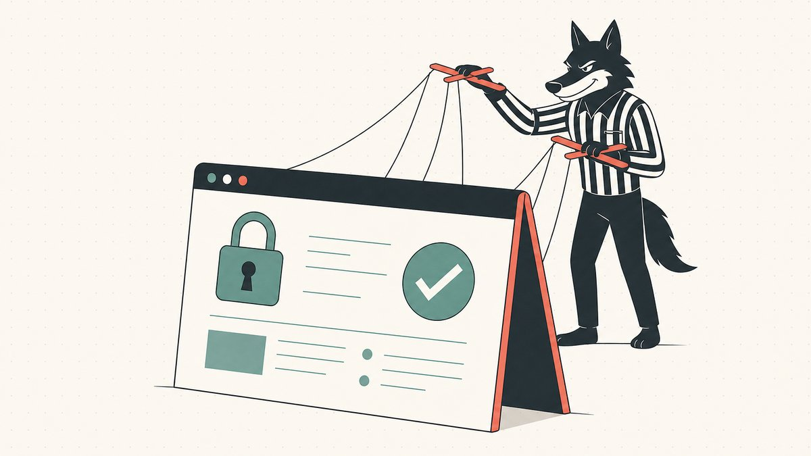
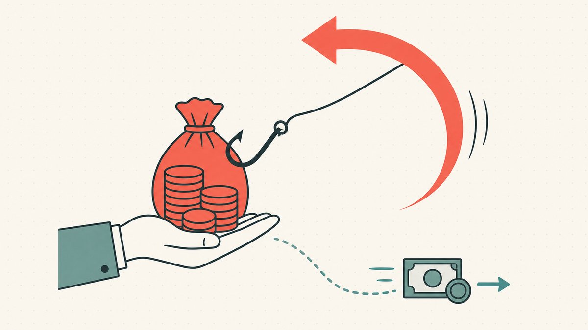

Beim [Domain-Flipping](/en/blog/domain-flipping/) wird das Geld erst verdient, wenn ein Name endlich verkauft wird. Genau das ist auch der Moment, in dem Betrüger auf den Plan treten. Ein aktives Verkaufsangebot ist eine offene Einladung für jeden, der bereit ist, sich als Käufer, Broker oder Treuhandunternehmen auszugeben. Der teuerste Fehler, den ein Flipper machen kann, ist nicht der Kauf eines falschen Namens. Es ist die Übergabe eines guten Namens an die falsche Person.

Fast jeder Betrug beim Domain-Verkauf ist eine Variation eines einzigen Schachzugs: Sie dazu zu bringen, entweder die Domain oder das Geld aufzugeben, bevor die Gegenseite tatsächlich geliefert hat. Sobald Sie diesen Schachzug erkennen, sind die Abwehrmaßnahmen einfach und verlangsamen ein legitimes Geschäft kaum. Dieser Leitfaden stellt die Betrugsmaschen vor, denen Sie tatsächlich begegnen werden, und anschließend die Gewohnheiten, die sie alle zunichtemachen. Er ist Teil der Serie [Domain-Flipping-Fähigkeiten](/en/blog/domain-flipping/) und eng mit der rechtlichen Seite verknüpft, die in [Domain-Flipping und das Gesetz](/en/blog/domain-flipping-and-the-law/) behandelt wird.

## Der eine Trick hinter jedem Betrug: Wer macht den ersten Schritt

Jeder Verkauf zwischen Fremden hat die gleiche Pattsituation. Der Käufer will nicht zahlen, bevor er die Domain erhält, und der Verkäufer will die Domain nicht übertragen, bevor er bezahlt wird. Jemand muss den ersten Schritt machen, und der erste Schritt bedeutet, der anderen Seite zu vertrauen. Das ist genau das Problem, für dessen Lösung [Treuhanddienste (Escrow)](/en/glossary/escrow/) erfunden wurden, und wir behandeln die Mechanismen in [Domain-Treuhanddienste erklärt](/en/blog/domain-escrow-explained/).

Betrügereien sind einfach Angriffe auf diese Pattsituation. Das einzige Ziel eines Betrügers ist es, einen Grund zu schaffen, damit *Sie* den ersten Schritt machen – den Namen übertragen, eine Rückerstattung senden oder eine „Gebühr“ zahlen –, bevor ein echter Wert den Besitzer gewechselt hat. Betrachten Sie jede Nachricht, die Sie erhalten, durch diese Brille, und die unten aufgeführten spezifischen Tricks werden Sie nicht mehr überraschen. Es ist immer derselbe Trick in unterschiedlichen Verkleidungen.

## Gefälschte Treuhand-Websites

Dies ist der Klassiker, und er ist effektiv, weil er genau das Werkzeug zur Waffe macht, dem Sie eigentlich vertrauen sollen. Ein Käufer stimmt Ihrem Preis begeistert zu, besteht dann aber darauf, „seinen“ Treuhanddienst zu nutzen und schickt Ihnen einen Link. Die Website sieht professionell aus. Sie zeigt Ihre Transaktion, Ihren Namen, den vereinbarten Betrag und einen beruhigenden Status „Zahlung erhalten“. Nichts davon ist echt.

Wikipedia beschreibt das Schema schlicht: [Der Betrug mit gefälschten Treuhandkonten ist ein einfacher Trickbetrug, bei dem ein Betrüger einen gefälschten Treuhanddienst betreibt](https://en.wikipedia.org/wiki/Bogus_escrow#:~:text=The%20bogus%20escrow%20scam%20is%20a%20straightforward%20confidence%20trick%20in%20which%20a%20scammer%20operates%20a%20bogus%20escrow%20service). Die gefälschte Seite existiert, um Sie genau in dem Moment zu belügen, in dem Sie am aufmerksamsten sind. Wie Wikipedia es ausdrückt, [versichert dieser gefälschte Treuhanddienst dem Opfer, dass der Betrüger seinen Artikel gesendet hat und dass das Opfer seinen Artikel an den Treuhanddienst senden sollte](https://en.wikipedia.org/wiki/Bogus_escrow#:~:text=This%20bogus%20escrow%20service%20assures%20the%20victim%20that%20the%20scammer%20has%20sent%20its%20item). Sie sehen „Käufer hat Treuhandkonto gefüllt“, übertragen die Domain, um den Handel abzuschließen, und das Geld war nie da. Die Website wird abgeschaltet und der Käufer verschwindet ebenfalls.

Das Anzeichen ist immer dasselbe: Der Käufer hat den Treuhanddienst gewählt, und Sie haben noch nie davon gehört. Ein echter Treuhanddienst schützt Sie nur, wenn *Sie* ihn ausgewählt haben. Ein Treuhandunternehmen, das von Ihrer Gegenpartei empfohlen, verlinkt und praktisch eingerichtet wurde, ist kein neutraler Schiedsrichter – es ist der Spieler des gegnerischen Teams im Schiedsrichterhemd.

## Schein-Käufer und Schein-Broker

Nicht jeder Betrug braucht eine gefälschte Website. Manche brauchen nur eine überzeugende Person. Ein „Käufer“ meldet sich per E-Mail mit ernsthaftem Interesse an einem Namen, erwähnt beiläufig ein Unternehmen, fügt vielleicht ein Logo an und steuert schnell auf eine Summe zu, die etwas zu gut ist. Der Druck ist das eigentliche Produkt. Das Ziel ist es, Sie emotional an einen fünfstelligen Verkauf zu binden, sodass Sie, wenn der „eine kleine Schritt“ kommt – eine Transfergebühr bezahlen, eine Treuhandeinlage decken, eine Rückerstattung senden –, dies ohne Nachdenken tun.

Eine häufige Variante ist der gefälschte Broker oder Marktplatz-Agent. Sie erhalten eine Nachricht, in der behauptet wird, ein hochwertiger Käufer sei bereit, aber das Geschäft müsse über einen bestimmten Bewertungsdienst, eine Zertifizierung oder eine „Freigabegebühr“ laufen, die Sie im Voraus bezahlen. Seriöse Broker und Marktplätze nehmen eine Provision aus einem abgeschlossenen Verkauf. Sie verlangen vom Verkäufer kein Geld im Voraus, um einen Käufer freizuschalten, der angeblich bereits existiert. Jedes Geschäft, bei dem Sie zuerst zahlen müssen, um später bezahlt zu werden, ist der Betrug, Punkt.

Diese Angriffe stützen sich darauf, dass ein Name seriöser aussieht, als er ist, was ein Grund dafür ist, warum es sich lohnt, Eigentumsregister zu lesen. Eine schnelle [WHOIS](/en/glossary/whois/)-Abfrage und eine Suche nach dem Unternehmen, das der „Käufer“ zu vertreten behauptet, bringen die Geschichte oft in weniger als einer Minute zum Einsturz. Echte Käufer überstehen eine Google-Suche. Erfundene nicht.

## Überzahlungs- und Rückbuchungsbetrug

Der Überzahlungsbetrug ist älter als Domains und passt sich perfekt an sie an. Der „Käufer“ sendet eine Zahlung, die *höher* ist als der vereinbarte Preis – ein Versehen, sagen sie, oder ein Fehler des Buchhalters – und bittet Sie, die Differenz zu erstatten. Sie sehen nun Geld, das scheinbar auf Ihrem Konto gelandet ist, daher fühlt es sich harmlos an, ein paar tausend Dollar „ihres“ Geldes zurückzuüberweisen. Dann wird die ursprüngliche Zahlung rückgängig gemacht, und Sie haben die Rückerstattung, die Sie aus eigenen Mitteln gesendet haben, verloren.

Der Motor hierbei ist die Rückbuchung (Chargeback). Wikipedia definiert sie als [eine Rückgabe von Geld an den Zahler einer Transaktion, insbesondere einer Kreditkartentransaktion](https://en.wikipedia.org/wiki/Chargeback#:~:text=A%20chargeback%20is%20a%20return%20of%20money%20to%20a%20payer). Entscheidend ist, [die Rückbuchung macht eine Geldüberweisung vom Bankkonto, der Kreditlinie oder der Kreditkarte des Verbrauchers rückgängig](https://en.wikipedia.org/wiki/Chargeback#:~:text=The%20chargeback%20reverses%20a%20money%20transfer). Diese Rückbuchung kann Tage oder Wochen nach dem scheinbar abgeschlossenen Zahlungseingang erfolgen und ist ein Standard-Käuferschutz, den Betrüger ausnutzen, indem sie mit einem gestohlenen oder anfechtbaren Zahlungsmittel bezahlen. Wenn die Rückbuchung erfolgt, haben Sie die Domain bereits übertragen und die „Überzahlung“ zurückerstattet. Sie verlieren beides.

Die Verteidigung besteht darin, niemals auf Geld zu reagieren, das noch zurückgefordert werden kann. Eine „erhalten“-Benachrichtigung ist nicht dasselbe wie freigegebenes, unwiderrufliches Guthaben, und eine Rückerstattungsanfrage zusätzlich zu einer frischen Zahlung ist eine schreiend rote Flagge und keine Höflichkeit.

## Übertragung vor Bezahlung

Manchmal überspringt der Betrug das Theater und appelliert einfach an Ihren Anstand. Der „Käufer“ erklärt, dass sein Unternehmen eine Rechnung erst *nach* Erhalt des Vermögenswerts bezahlen kann – Beschaffungsregeln, Buchhaltungsrichtlinien, ein Chef, der die Domain zuerst im Konto sehen muss. Könnten Sie sie jetzt übertragen, und sie würden die Zahlung sofort freigeben? Sie klingen vernünftig. Sie klingen fast verärgert, dass Sie an ihnen zweifeln.

Übertragen Sie nicht zuerst. Sobald eine Domain Ihre Kontrolle verlässt, ist Ihr Druckmittel weg, und sie zurückzubekommen bedeutet einen langsamen, unsicheren Streitfall statt einer Rückerstattung. Dies ist umso wichtiger, weil Transfers tatsächlich so funktionieren. Der Umzug einer Domain zu einem anderen [Registrar](/en/glossary/registrar/) erfordert die Übergabe des Autorisierungscodes – Wikipedia merkt an, der Käufer [erhält den Authentifizierungscode (EPP-Transfercode) vom alten Registrar](https://en.wikipedia.org/wiki/Domain_name_transfer#:~:text=obtains%20the%20authentication%20code%20%28EPP%20transfer%20code%29) – und sobald dieser Code herausgegeben und der Transfer abgeschlossen ist, gehört der Name ihnen. Dieselbe Quelle merkt an, [der Prozess kann etwa fünf Tage dauern](https://en.wikipedia.org/wiki/Domain_name_transfer#:~:text=The%20process%20may%20take%20about%20five%20days), und nach Abschluss gibt es eine Sperrfrist, bevor er erneut verschoben werden kann, die früher 60 Tage betrug und, laut Wikipedia, wurde diese [60-tägige Transfersperre abgeschafft und durch eine 30-tägige Sperrfrist ersetzt](https://en.wikipedia.org/wiki/Domain_name_transfer#:~:text=replaced%20with%20a%2030%2Dday%20lock%20period). Nichts davon hilft Ihnen, wenn Sie den Namen bereits einem Dieb übergeben haben.

Ein enger Verwandter dieses Betrugs zielt auf den Namen ab, den Sie *kaufen*, nicht verkaufen: Der Verkäufer nimmt die Zahlung entgegen und gibt den [Auth-Code](/en/glossary/auth-code/) nie frei oder gibt einen frei, der nicht funktioniert. Das Prinzip ist von beiden Seiten identisch. Wer zuerst handelt, ohne dass eine neutrale Partei die andere Hälfte des Geschäfts hält, ist derjenige, der sich exponiert.

## Die Gewohnheiten, die sie alle besiegen

Die oben genannten Betrugsmaschen sind vielfältig. Die Abwehrmaßnahmen sind es nicht. Eine kurze, langweilige Checkliste neutralisiert fast jeden Angriff beim Domain-Verkauf, und eine legitime Gegenpartei wird bei allem gerne mitmachen.

**Nutzen Sie immer eine echte, treuhandgestützte Abwicklung und wählen Sie diese selbst aus.** Bestehen Sie auf einem seriösen Treuhanddienst oder [Marktplatz](/en/glossary/marketplace/), den *Sie* vorschlagen. Die Neutralität funktioniert nur, wenn Sie den Schiedsrichter gewählt haben. Wenn ein Käufer Ihren Treuhanddienst ablehnt und auf seinem besteht, ist das Geschäft geplatzt – diese Weigerung ist die Diagnose. Unsere vollständige Anleitung, wie das aussehen sollte, finden Sie in [Domain-Treuhanddienste erklärt](/en/blog/domain-escrow-explained/) und in der Verkäufer-Checkliste unter [Wie man eine Domain verkauft, die man besitzt](/en/blog/how-to-sell-a-domain-name-you-own/).

**Überprüfen Sie die Gegenseite, bevor Sie dem Geschäft vertrauen.** Führen Sie eine [WHOIS](/en/glossary/whois/)-Abfrage durch, überprüfen Sie das Unternehmen, das der Käufer vorgibt zu sein, bestätigen Sie, dass die E-Mail-Domains übereinstimmen, und seien Sie misstrauisch gegenüber kostenlosen Webmail-Adressen, die sich als Unternehmensbeschaffung ausgeben. Eine zweiminütige Identitätsprüfung entschärft die Betrügereien mit Schein-Käufern und Schein-Brokern fast vollständig.

**Niemals zuerst übertragen und niemals auf nicht freigegebenes Geld reagieren.** Geben Sie die Domain oder den Auth-Code erst frei, wenn der Treuhanddienst eine echte, unwiderrufliche Zahlung bestätigt. Erstatten Sie keine „Überzahlung“. Behandeln Sie einen „Zahlung erhalten“-Bildschirm nicht als Beweis für irgendetwas. Die Zeit ist immer auf der Seite der ehrlichen Partei, also lassen Sie die Uhr laufen.

**Zahlen Sie niemals eine Vorauszahlung, um einen Verkauf freizuschalten.** Seriöse Broker und Marktplätze werden aus einer abgeschlossenen Transaktion bezahlt. Eine Forderung nach Vorauszahlungen, „Bewertungen“ oder „Freigabegebühren“, um Zugang zu einem Käufer zu erhalten, ist der Betrug selbst.

**Verlangsamen Sie, wenn die Dringlichkeit zunimmt.** Druck, Schmeicheleien und ein Geschäft, das etwas zu gut ist, sind die Hauptwerkzeuge des Betrügers, denn sie alle drängen Sie dazu, die oben genannten Schritte zu überspringen. Je mehr ein Käufer Sie drängt, desto vorsichtiger sollten Sie vorgehen.

Wenn ein Name wertvoll genug ist, um einen Betrüger anzulocken, ist er auch wertvoll genug, um ihn ordnungsgemäß zu verkaufen. Der Sinn dieser Gewohnheiten ist nicht Paranoia. Es geht darum, dass Sie den Lohn Ihrer Arbeit behalten, anstatt ihn jemandem mit einer überzeugenden E-Mail zu schenken.

## Die Namefi-Perspektive

Der größte Teil dieses Leitfadens befasst sich mit der Absicherung des Übergabemoments – dem Nachweis, dass die Zahlung echt ist, bevor der Name den Besitzer wechselt, und dem Nachweis, dass der Name echt ist, bevor das Geld den Besitzer wechselt. Diese ganze Pattsituation existiert, weil im traditionellen System Eigentum und Zahlung an zwei getrennten Orten leben, die von einem vertrauenswürdigen Vermittler in Einklang gebracht werden müssen.

[Namefi](https://namefi.io) verkleinert diese Lücke, indem es das Eigentum an echten ICANN-Domains tokenisiert, sodass die Kontrolle über den Namen und die Abwicklung des Geschäfts gemeinsam verifiziert und ausgetauscht werden können, mit DNS-Kontinuität, damit der Name während der Übergabe weiterhin auflösbar bleibt. Wenn der Vermögenswert prüfbar und die Übertragung atomar ist, hat das „Wer macht den ersten Schritt“-Problem – das, was jeder Betrug in diesem Leitfaden angreift – viel weniger Raum, sich zu verstecken. Wir gehen auf diesen Wandel in [wie tokenisierte Marktplätze Treuhanddienste ersetzen](/en/blog/how-tokenized-marketplaces-replace-escrow/) näher ein.

## Freundlicher Haftungsausschluss (Lesen Sie mich!)

> Wir sind keine Anwälte, Buchhalter, Finanzberater oder Ärzte, und **nichts in diesem Artikel stellt eine rechtliche, finanzielle, steuerliche, buchhalterische, medizinische oder sonstige Form von professioneller Beratung dar.** Wir schreiben diese Beiträge, um uns selbst weiterzubilden und als Service für unsere Kunden. Die hier enthaltenen Informationen können veraltet, ortsspezifisch oder einfach falsch sein. Auch wir machen Fehler.
>
> Für jede wichtige Entscheidung **konsultieren Sie bitte einen echten Fachmann (ernsthaft!)**. Oder wenn das nicht Ihr Ding ist, fragen Sie einen Freund, fragen Sie Twitter, fragen Sie Reddit, fragen Sie eine KI oder fragen Sie ein Medium. In kurz: **DOYR - Do Your Own Research**. Lassen Sie uns lernen und Spaß haben.

## Quellen und weiterführende Literatur

- Wikipedia – [Gefälschter Treuhanddienst (Definition und Mechanismen des Betrugs mit gefälschten Treuhanddiensten)](https://en.wikipedia.org/wiki/Bogus_escrow#:~:text=The%20bogus%20escrow%20scam%20is%20a%20straightforward%20confidence%20trick%20in%20which%20a%20scammer%20operates%20a%20bogus%20escrow%20service)
- Wikipedia – [Rückbuchung (Chargeback) (Definition und wie eine Rückbuchung eine Zahlung rückgängig macht)](https://en.wikipedia.org/wiki/Chargeback#:~:text=A%20chargeback%20is%20a%20return%20of%20money%20to%20a%20payer)
- Wikipedia – [Domain-Namen-Transfer (EPP-Auth-Code, ~5-tägiger Transfer, 30-tägige Sperre)](https://en.wikipedia.org/wiki/Domain_name_transfer#:~:text=obtains%20the%20authentication%20code%20%28EPP%20transfer%20code%29)
- Namefi-Ressourcen – [Domain-Treuhanddienste erklärt](/en/blog/domain-escrow-explained/) · [Wie man eine Domain verkauft, die man besitzt](/en/blog/how-to-sell-a-domain-name-you-own/) · [Wie Domain-Hijacking tatsächlich passiert](/en/blog/how-domain-hijacking-actually-happens/)