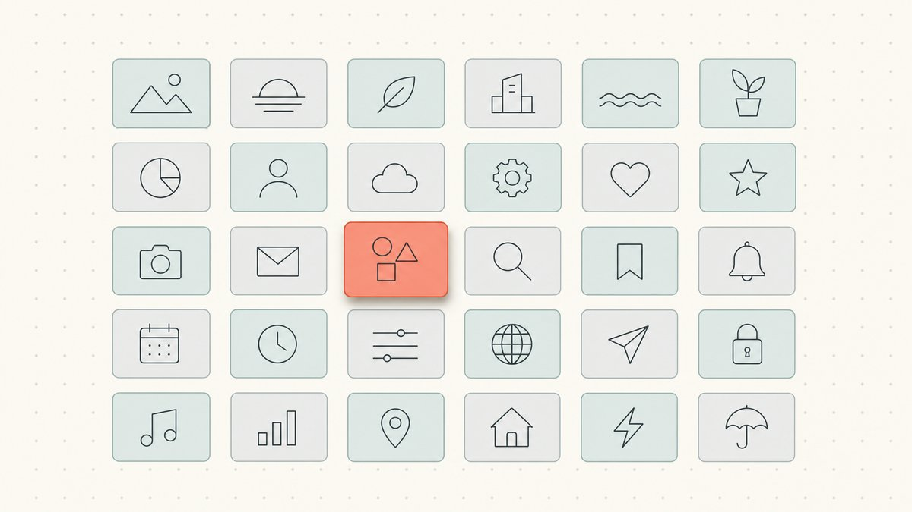
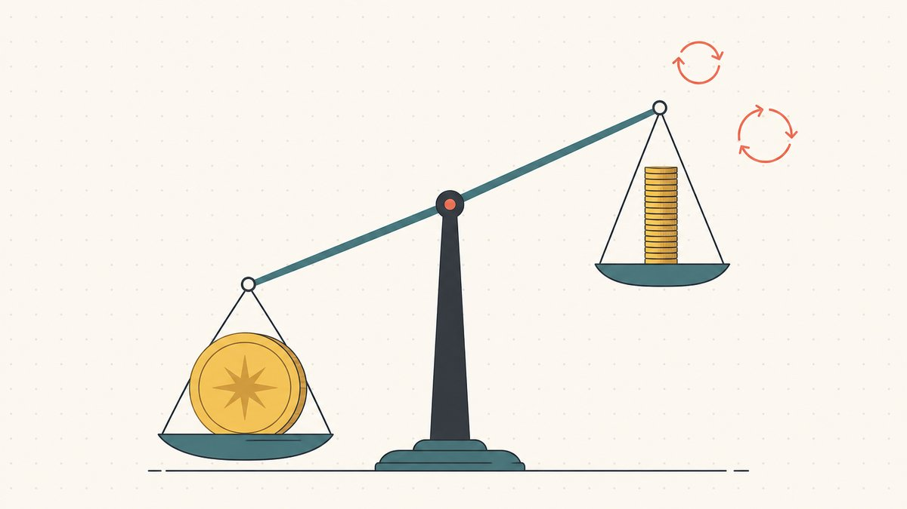
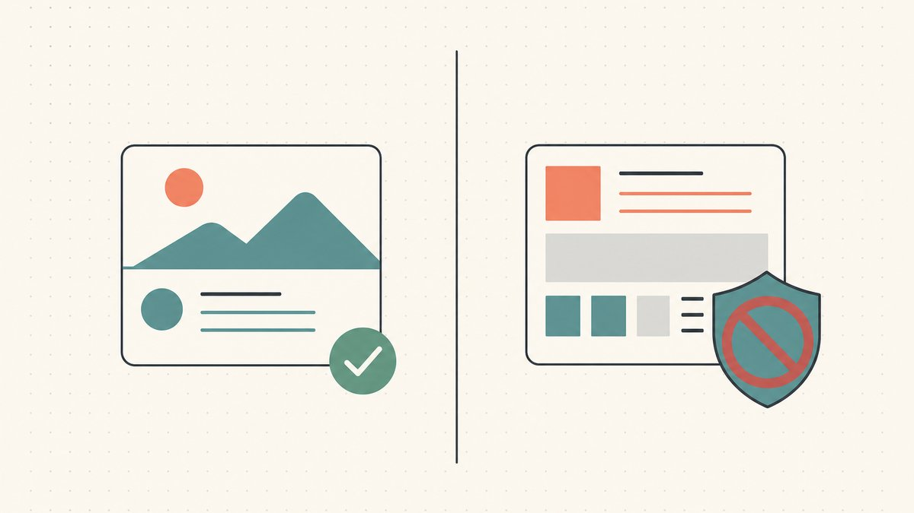

Das Verkaufsargument ist das älteste im Handel: günstig kaufen, teuer verkaufen. Registrieren oder erwerben Sie einen Domainnamen für ein paar Dollar, finden Sie jemanden, der ihn dringender braucht als Sie, und verkaufen Sie ihn für ein Vielfaches Ihres Einsatzes. Gut gemacht, sieht es mühelos aus – ein cleverer Name günstig gekauft, ein fünfstelliger Scheck Monate später. Diese Geschichte ist wahr. Aber sie ist auch nur der Zuschnitt der Höhepunkte.

Hinter diesem „einfachen“ Handel verbirgt sich ein Bündel echter Fähigkeiten, und die Kluft zwischen denjenigen, die mit dem Flippen von Domains Geld verdienen, und denen, die jedes Jahr stillschweigend einen Friedhof von Domains verlängern, ist fast ausschließlich eine Kluft in diesen Fähigkeiten. Dieser Leitfaden ist die Landkarte. Er erklärt, was Domain-Flipping wirklich ist, gibt Ihnen einen ehrlichen Realitätscheck zu den Erfolgsaussichten und führt Sie dann durch den gesamten Prozess des Handwerks – Beschaffung, Bewertung, Namensgebung, rechtlicher Schutz, Verkauf, Portfoliomanagement und Marketing – und verweist Sie dabei für jede Phase auf einen weiterführenden Leitfaden.

## Was Domain-Flipping ist (und ein ehrlicher Realitätscheck)

Domain-Flipping ist der Bereich des Domain-Investings mit kurzer Umschlagzeit. Die übergeordnete Praxis hat eine genaue Definition: Wie Wikipedia es formuliert, ist [die Spekulation mit Domainnamen ... die Praxis, generische Internet-Domainnamen als Investition zu identifizieren und zu registrieren oder zu erwerben, mit der Absicht, sie später mit Gewinn zu verkaufen](https://en.wikipedia.org/wiki/Domain_name_speculation#:~:text=is%20the%20practice%20of%20identifying%20and%20registering%20or%20acquiring%20generic%20Internet%20domain%20names%20as%20an%20investment). Flipping ist die schnelle Version davon: [Ein schneller Umschlag beim Wiederverkauf von Domains wird oft als Domain-Flipping bezeichnet](https://en.wikipedia.org/wiki/Domain_name_speculation#:~:text=Quick%20turnaround%20in%20the%20resale%20of%20domains%20is%20often%20called%20domain%20flipping). Sie sind ein Vermittler auf dem [Domain-Zweitmarkt](/en/glossary/domain-trading/) – Sie kaufen Domains, die Sie für unterbewertet halten, und verkaufen sie an einen Käufer, der sie mehr schätzt.

Die Schlagzeilen lassen es wie eine Lotterie aussehen, die man gewinnen könnte. Die berühmteste ist echt: 2019 verkaufte MicroStrategy `Voice.com` an das Blockchain-Unternehmen Block.one, und laut der offiziellen `.nl`-Registrierungsstelle SIDN [zahlte der Blockchain-Anbieter Block.one 30 Millionen US-Dollar für den Domainnamen voice.com](https://www.sidn.nl/en/news-and-blogs/voice-com-sold-for-usd-30-million#:~:text=blockchain%20provider%20Block.one%20paid%2030%20million%20US%20dollars%20for%20the%20domain%20name%20voice.com) – immer noch, wie SIDN anmerkt, [die höchste öffentlich bekannt gegebene Summe, die jemals für einen Domainnamen bezahlt wurde](https://www.sidn.nl/en/news-and-blogs/voice-com-sold-for-usd-30-million#:~:text=the%20highest%20publicly%20disclosed%20sum%20ever%20paid%20for%20a%20domain%20name). Damit wurde der bisherige Rekord aus dem Jahr 2010 gebrochen, als, wie Wikipedia festhält, [Sedo Berichten zufolge die Auktion ... für 13 Millionen Dollar abschloss](https://en.wikipedia.org/wiki/Sex.com#:~:text=Sedo%20reportedly%20completed%20the%20auction) für `Sex.com`.

Jetzt der Realitätscheck. Das sind Ein-Wort-`.com`-Domains von Wörterbuchqualität, die an zahlungskräftige Käufer mit einem existenziellen Bedarf an dem Namen verkauft wurden. Sie sind kein Geschäftsmodell – sie sind die Ausreißer, die es gerade deshalb in die Schlagzeilen schaffen, weil sie so selten sind. Eine ehrliche Betrachtung des Domain-Flippings ist, dass es ein **Portfoliospiel ist, kein Lotterielos**. Die unglamouröse Wahrheit, die in der Branche allgemein bekannt ist: Die meisten Domains, die Sie auf Spekulation registrieren, werden sich nie verkaufen. Diejenigen, die sich nicht verkaufen, bleiben in Ihrem Konto und kosten Sie jedes Jahr Verlängerungsgebühren. Flipping funktioniert, wenn es funktioniert, weil eine kleine Anzahl guter Verkäufe die Haltungskosten einer viel größeren Anzahl von Domains, die zu nichts führen, mehr als deckt. Wenn Sie sich mit dieser Konstellation – viele kleine Verluste, gelegentliche übergroße Gewinne – nicht wohlfühlen, ist dies das falsche Hobby, um es für ein garantiertes Einkommen zu halten.

Die gute Nachricht ist, dass die Chancen nicht zufällig sind. Jede der folgenden Phasen des Handwerks ist ein Hebel, den Sie betätigen können, um sie zu Ihren Gunsten zu verschieben.

## Finden: Domains aufspüren, die es wert sind, geflippt zu werden

Alles Weitere hängt davon ab, was Sie kaufen, daher ist die Beschaffung die erste wirkliche Fähigkeit. Es gibt mehrere Beschaffungskanäle – die manuelle Registrierung brandneuer Namen, das Abfangen auslaufender oder gelöschter Domains, der Kauf bei Auktionen und der Erwerb von anderen Inhabern auf dem [Zweitmarkt](/en/glossary/marketplace/) – und jeder hat ein völlig anderes Risiko- und Preisprofil. Eine frisch manuell registrierte Domain kostet eine Registrierungsgebühr, konkurriert aber mit einem praktisch unendlichen Angebot anderer unregistrierter Zeichenketten; eine ältere Domain, die bei einer Drop-[Auktion](/en/glossary/auction/) erworben wird, kann bestehenden Traffic oder Backlinks haben, kostet aber mehr und erfordert eine sorgfältigere Prüfung.

Die Disziplin hierbei ist, Nein zu sagen. Der schnellste Weg, beim Flippen Geld zu verlieren, ist, sich in Namen zu verlieben, die niemand jemals kaufen wird. Unser detaillierter Leitfaden [wie man Domains zum Flippen findet](/en/blog/how-to-find-domains-to-flip/) behandelt jeden Kanal und die Filter, die eine echte Chance von einem teuren Impulskauf trennen.

## Bewerten: Wissen, was eine Domain wirklich wert ist

Die Beschaffung zeigt Ihnen, was verfügbar ist; die Bewertung sagt Ihnen, was es wert ist, und beides zusammen definiert Ihre Marge. Die Bewertung von Domains ist wirklich schwierig, da Domains keine Standardware sind – es gibt keinen Börsenkurs für „eine fünfstellige `.com`“, und dieselbe Domain kann für einen Käufer wertlos und für einen anderen strategisch entscheidend sein.

Eine vertretbare Zahl ergibt sich aus Vergleichsverkäufen, der Stärke und Liquidität der [Endung](/en/tld/com/), der Direktheit des Anwendungsfalls für den Käufer und jedem bestehenden Wert wie Traffic oder Alter – nicht von einem automatisierten Bewertungstool, das Sie als unfehlbar ansehen. Schätzen Sie dies falsch ein, zahlen Sie beim Kauf zu viel oder verlangen beim Verkauf zu wenig, und jeder dieser Fehler vernichtet den gesamten Gewinn. Unser Leitfaden zur [Bewertung eines Domainnamens](/en/blog/how-to-value-a-domain-name/) schlüsselt die Einflussfaktoren und die häufigsten Fallen auf.

## Namensgebung: Verstehen, was eine Domain wertvoll macht

Unter der Bewertung liegt eine grundlegendere Frage: Warum ist eine Zeichenkette Tausende wert und eine fast identische wertlos? Dies ist das grundlegende Verständnis, das alles andere ermöglicht. Die Grundlagen sind erlernbar – Länge, Einprägsamkeit, ob der Name sich wie ein echtes Wort liest, wie leicht er buchstabiert und ausgesprochen werden kann, die Keyword-Nachfrage dahinter und die Glaubwürdigkeit seiner Endung. Unser Erklärtext darüber, [was eine Domain wertvoll macht](/en/blog/what-makes-a-domain-valuable/), legt diese Treiber dar.

Hier existiert ein ganzes Unterhandwerk: der [Domain-Hack](/en/blog/domain-hacks-explained/), bei dem die Endung selbst zur letzten Silbe eines Wortes wird – `del.icio.us`, `youtu.be`, `bit.ly`. Diese cleveren, kurzen Namen werden von Marken und Flippern gleichermaßen geschätzt, aber sie bergen ihre eigenen Ländercode-Risiken – die langjährige Diskussion um die [`.io`-Endung](/en/tld/io/) ist ein aktuelles Beispiel –, weshalb das Verständnis des *Namens* als Anlageklasse eine eigene Fähigkeit ist. Und für den positiven Fall – eine großartige Domain, die ein Unternehmen durch ein Rebranding trägt – zeigt der Wechsel [von teslamotors.com zu tesla.com](/en/blog/from-teslamotors-com-to-tesla-com/), was eine saubere, kurze Domain einem Käufer wert ist, der aus seiner alten herausgewachsen ist.

## Schützen: Auf der richtigen Seite des Gesetzes bleiben

Nicht jede Domain, die flippbar *aussieht*, ist auch sicher zu flippen. Die wichtigste Grenze in diesem Geschäft ist die Linie zwischen legitimem Domaining und Cybersquatting. Die Registrierung eines generischen Wörterbuchworts zum Weiterverkauf ist eine gewöhnliche Investition; die Registrierung von etwas, das auf der Marke eines bestimmten Unternehmens aufbaut, ist ein schneller Weg, die Domain und möglicherweise Schlimmeres zu verlieren.

Dies wird durch eine echte Richtlinie mit Durchsetzungskraft geregelt, und es lohnt sich, diese zu verinnerlichen, bevor Sie auch nur einen Dollar ausgeben. Wir behandeln den rechtlichen Rahmen – und wie Sie Ihr Portfolio sauber halten – in [Domain-Flipping und das Gesetz](/en/blog/domain-flipping-and-the-law/). Es ist der Abschnitt, der alles andere schützt, was Sie aufbauen.

## Verkaufen: Eine Domain in einen Scheck verwandeln

Eine Domain, die Sie nicht verkaufen können, ist eine Domain, die Sie nicht wirklich besitzen – Sie mieten sie nur von einem Registrar. Verkaufen ist eine eigene Disziplin, die sich von der Bewertung unterscheidet: Sie müssen zwischen Inbound (die Domain auffindbar machen und abwarten) und Outbound (wahrscheinliche Käufer recherchieren und kontaktieren) wählen, das richtige Preisformat festlegen, eine Kontaktaufnahme verfassen, die nicht wie Spam wirkt, und das Geschäft abschließen, ohne betrogen zu werden.

Das meiste Geld beim Flippen wird in dieser Phase verdient oder verloren, denn eine mittelmäßige Domain, die gut verkauft wird, ist besser als eine großartige Domain, die niemand findet. Unser spezielles Playbook ist [wie man Domains mit Gewinn verkauft](/en/blog/how-to-sell-domains-for-profit/), und für eine praktische Schritt-für-Schritt-Checkliste für einen einzelnen Verkauf, siehe [wie man eine Domain verkauft, die man besitzt](/en/blog/how-to-sell-a-domain-name-you-own/). Wenn ein Geschäft zustande kommt, erfolgt die Übergabe in der Regel über einen neutralen [Escrow](/en/glossary/escrow/)-Prozess, sodass keine Seite den ersten Schritt machen muss – wir erklären diesen Mechanismus in [Domain-Escrow erklärt](/en/blog/domain-escrow-explained/).

## Verwalten: Das Portfolio als Geschäft führen

Sobald Sie mehr als eine Handvoll Domains halten, ist das Flippen keine Reihe von Einzelgeschäften mehr, sondern wird zur Bestandsverwaltung. Die Kernentscheidungen sind unglamourös und unerbittlich: welche Domains verlängert, welche aufgegeben werden sollen, wie Anschaffungskosten und Haltedauer zu verfolgen sind und wie man verhindert, dass [DNS](/en/glossary/dns/) und Verlängerungen bei einer Domain, die ein Käufer gerade prüfen will, unbemerkt ausfallen. Portfoliodisziplin verhindert, dass die Belastung durch Verlängerungsgebühren (mehr dazu im nächsten Abschnitt) Ihre Gewinne auffrisst. Unser Leitfaden zum [Domain-Portfoliomanagement](/en/blog/domain-portfolio-management/) behandelt die Systeme, die verhindern, dass ein wachsender Bestand an Domains zu einem Geldgrab wird.

## Vermarkten: Die richtige Domain dem richtigen Käufer präsentieren

Eine großartige Domain ohne Publikum ist nur eine Verlängerungsrechnung. Marketing ist der Weg, um die Zeit vom Erwerb bis zum Verkauf zu verkürzen – durch Landingpages, die signalisieren, dass die Domain zum Verkauf steht, Einträge auf den richtigen Marktplätzen und gezielte Kontaktaufnahme mit der kleinen Gruppe von Käufern, für die die Domain ein echtes Problem löst. Die Fähigkeit liegt in der Präzision, nicht im Volumen: Das Bombardieren einer auf Keywords abgestimmten Mailingliste macht die Kontaktaufnahme zu Spam, während eine gut recherchierte Nachricht an einen Käufer mit einem offensichtlichen Bedarf ein Geschäft abschließen kann. Sehen Sie sich [die Vermarktung Ihrer Domains zum Verkauf](/en/blog/marketing-your-domains-for-sale/) an, um mehr über die Kanäle und die Etikette zu erfahren.

## Ein realistischer Blick auf die Wirtschaftlichkeit

Lässt man die Schlagzeilen beiseite, ist Domain-Flipping ein Bestandsgeschäft mit stetigen Haltungskosten. Die größte Belastung ist die Verlängerungsgebühr. Eine Domain wird nicht endgültig gekauft; sie wird für eine bestimmte Laufzeit registriert und muss verlängert werden, um sie zu behalten, und die Registrierung von gTLDs ist laut Wikipedia auf [die maximale Registrierungsdauer für einen gTLD-Domainnamen von 10 Jahren](https://en.wikipedia.org/wiki/Domain_name_registrar#:~:text=The%20maximum%20period%20of%20registration%20for%20a%20gTLD%20domain%20name%20is%2010%20years) begrenzt. Die Endkundenpreise für eine einfache `.com` sind bescheiden, aber real – Wikipedia stellt fest, dass ab 2023 [die Einzelhandelskosten im Allgemeinen von etwa 9,70 $ pro Jahr bis zu etwa 35 $ pro Jahr](https://en.wikipedia.org/wiki/Domain_name_registrar#:~:text=the%20retail%20cost%20generally%20ranges%20from%20a%20low%20of%20about%20%249.70%20per%20year) für eine einfache `.com`-Registrierung reichen. Multipliziert mit einigen hundert Domains werden die jährlichen Kosten zur zentralen Kenngröße, um die sich jeder Flipper organisiert.

Hier wird die Betrachtung als „Portfoliospiel“ zur reinen Arithmetik. Die Faustregel der Branche – und es ist eine Faustregel, keine gemessene Statistik, also betrachten Sie sie als Schätzung – besagt, dass die jährliche **Verkaufsquote** (der Anteil Ihrer Domains, die tatsächlich in einem Jahr verkauft werden) eines manuell registrierten Portfolios niedrig ist, oft im niedrigen einstelligen Prozentbereich. Die Rechnung geht nur auf, weil der *Preis* der Verkäufe so verzerrt ist: Ein guter vier- oder fünfstelliger Verkauf kann die Verlängerungen von Hunderten von Domains für Jahre finanzieren. Das Denkmodell, nach dem erfahrene Domainer leben, lautet: „Ein Verkauf finanziert viele Verlängerungen.“ Wenn die erwarteten Verkäufe Ihres Portfolios die jährlichen Verlängerungsgebühren nicht bequem decken können, haben Sie keine Investition – Sie haben ein Abonnement. Die Kenntnis Ihrer realen Zahlen (Anschaffungskosten, Haltungskosten, realistische Verkaufsquote) ist es, was Investieren vom Horten unterscheidet, und es ist der Grund, warum die oben genannte Disziplin des [Portfoliomanagements](/en/blog/domain-portfolio-management/) nicht optional ist.

## Ist es legal und ethisch?

Ja – mit einer klaren Grenze, die Sie nicht überschreiten dürfen. Der Kauf und Verkauf von generischen, beschreibenden oder erfundenen Namen ist ein legitimes, seit langem etabliertes Geschäft; der [Leitfaden zur Domain-Terminologie](/en/blog/domain-terminology-guide/) ist eine gute Einführung in das Vokabular, falls Ihnen etwas davon neu ist. Was *nicht* legitim ist, ist Cybersquatting, was Wikipedia als [die Praxis des Registrierens, Handelns oder Verwendens eines Internet-Domainnamens mit der böswilligen Absicht, vom guten Ruf einer Marke zu profitieren, die jemand anderem gehört](https://en.wikipedia.org/wiki/Cybersquatting#:~:text=is%20the%20practice%20of%20registering%2C%20trafficking%20in%2C%20or%20using%20an%20Internet%20domain%20name%2C%20with%20a%20bad%20faith%20intent%20to%20profit) definiert.

Diese Grenze ist durchsetzbar. Gemäß der Uniform Domain-Name Dispute-Resolution Policy (UDRP) von ICANN, wie von Wikipedia zusammengefasst, kann ein Markeninhaber Ihnen eine Domain abnehmen, indem er nachweist, dass [der Domainname mit einer Marke oder Dienstleistungsmarke, an der der Beschwerdeführer Rechte hat, identisch ist oder zu Verwechslungen führen kann](https://en.wikipedia.org/wiki/Uniform_Domain-Name_Dispute-Resolution_Policy#:~:text=identical%20or%20confusingly%20similar%20to%20a%20trademark%20or%20service%20mark), dass der Registrant kein legitimes Interesse daran hat und dass er in böswilliger Absicht registriert und genutzt wurde. Die praktische Konsequenz: Flippen Sie generische und markenfähige Namen, niemals Namen, die sich an die Marke eines anderen anlehnen. Wir erläutern den gesamten rechtlichen Rahmen in [Domain-Flipping und das Gesetz](/en/blog/domain-flipping-and-the-law/).

## Der Namefi-Ansatz

Der oben beschriebene Fähigkeitsstapel befasst sich hauptsächlich mit der Entscheidung, *was* gekauft und verkauft werden soll. Die andere Hälfte jedes Flips ist die Mechanik der eigentlichen Übertragung der Domain – und hier werden hochwertige Transaktionen heikel. Die klassische Pattsituation ist einfach: Der Verkäufer will nicht übertragen, bevor er bezahlt wird, und der Käufer will nicht bezahlen, bevor er die Domain erhält. Diese Reibung ist der ganze Grund, warum Escrow-Dienste existieren, und sie wird umso größer, je mehr eine Domain wert ist.

Dies ist die Lücke, die [Namefi](https://namefi.io) schließen will. Tokenisierter Besitz macht die Kontrolle über eine echte ICANN-Domain leichter überprüfbar und übertragbar, mit DNS-Kontinuität, sodass die Domain während der Übergabe sauber weiter auflöst – keine Ausfallzeiten, in denen eine Live-Website mitten im Geschäft offline geht. Für einen Flipper bedeutet weniger Abwicklungsreibung mehr Geschäfte, die tatsächlich zustande kommen, bei Domains, deren Besitz nachprüfbar ist, anstatt auf Vertrauen zu basieren.

## Freundlicher Haftungsausschluss (Bitte lesen!)

> Wir sind keine Anwälte, Steuerberater, Finanzberater oder Ärzte, und **nichts in diesem Artikel stellt eine rechtliche, finanzielle, steuerliche, buchhalterische, medizinische oder irgendeine andere Art von professioneller Beratung dar.** Wir schreiben diese Beiträge, um uns selbst weiterzubilden und als Service für unsere Kunden. Die hierin enthaltenen Informationen können veraltet, ortsspezifisch oder schlichtweg falsch sein. Auch wir machen Fehler.
>
> Für jede wichtige Entscheidung, **konsultieren Sie bitte einen echten Fachmann (ernsthaft!)**. Oder wenn das nicht Ihr Stil ist, fragen Sie einen Freund, fragen Sie Twitter, fragen Sie Reddit, fragen Sie eine KI oder fragen Sie einen Hellseher. Kurz gesagt: **DOYR – Do Your Own Research (recherchieren Sie selbst)**. Lassen Sie uns lernen und Spaß haben.

## Quellen und weiterführende Lektüre

- Wikipedia — [Domain name speculation (Definition von Domaining und Domain-Flipping)](https://en.wikipedia.org/wiki/Domain_name_speculation#:~:text=is%20the%20practice%20of%20identifying%20and%20registering%20or%20acquiring%20generic%20Internet%20domain%20names%20as%20an%20investment)
- SIDN — [Voice.com sold for USD 30 million (Block.one, 2019; höchster öffentlich bekannter Verkauf)](https://www.sidn.nl/en/news-and-blogs/voice-com-sold-for-usd-30-million#:~:text=blockchain%20provider%20Block.one%20paid%2030%20million%20US%20dollars%20for%20the%20domain%20name%20voice.com)
- Wikipedia — [Sex.com ($13-Millionen-Verkauf, 2010)](https://en.wikipedia.org/wiki/Sex.com#:~:text=Sedo%20reportedly%20completed%20the%20auction)
- Wikipedia — [Domain name registrar (maximale Laufzeit 10 Jahre; Endkundenpreise für `.com`-Verlängerungen)](https://en.wikipedia.org/wiki/Domain_name_registrar#:~:text=The%20maximum%20period%20of%20registration%20for%20a%20gTLD%20domain%20name%20is%2010%20years)
- Wikipedia — [Cybersquatting (Definition)](https://en.wikipedia.org/wiki/Cybersquatting#:~:text=is%20the%20practice%20of%20registering%2C%20trafficking%20in%2C%20or%20using%20an%20Internet%20domain%20name%2C%20with%20a%20bad%20faith%20intent%20to%20profit)
- Wikipedia — [Uniform Domain-Name Dispute-Resolution Policy (die drei Elemente einer UDRP-Beschwerde)](https://en.wikipedia.org/wiki/Uniform_Domain-Name_Dispute-Resolution_Policy#:~:text=identical%20or%20confusingly%20similar%20to%20a%20trademark%20or%20service%20mark)
