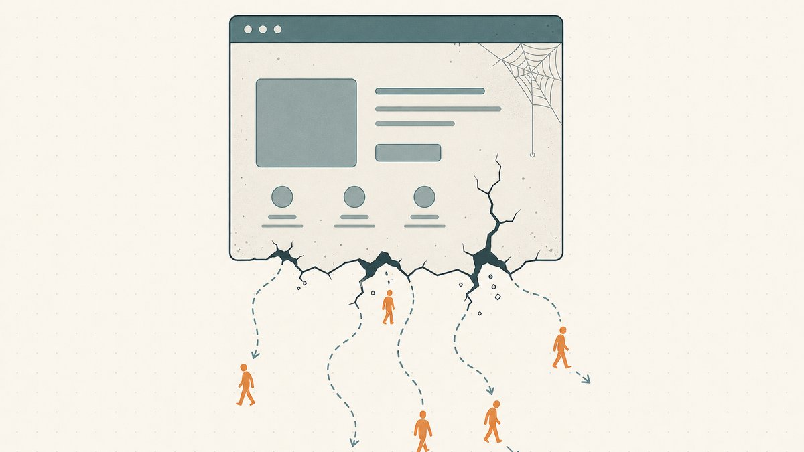

Ein Käufer, der deinen Namen will, kommt selten über dein Marketing. Er tippt den Namen in den Browser, um zu sehen, ob er vergeben ist, die Domain löst auf, und eine Seite lädt. Was auch immer diese Seite sagt, ist dein gesamter Pitch. Wenn es eine Standardseite des [Registrars](/de/glossary/registrar/) ist, eine mit Werbung vollgestopfte Parking-Seite oder schlicht gar nichts, hast du gerade den einen Besucher verloren, der bereits überzeugt war, dass der Name eine Rolle spielt. Die Verkaufs-Landingpage ist das Schaufenster für den wertvollsten Traffic, den du je bekommen wirst: Menschen, die dich gefunden haben, indem sie genau das eingetippt haben, was du verkaufst.

Dieser Leitfaden behandelt, was ein Verkaufs-Lander leisten muss, die drei Dinge, die jede konvertierende Seite richtig macht (ein klarer Preis oder Angebotsweg, echte Vertrauenssignale und ein reibungsloser Weg zur Transaktion), und die Fehler, die Deals leise abwürgen. Er ergänzt [So vermarktest du deine Domains zum Verkauf](/de/blog/marketing-your-domains-for-sale/), wo es um die Kanäle geht, die Traffic bringen; hier geht es darum, was passiert, wenn dieser Traffic ankommt. Beide gehören zur Serie [Domain-Flipping](/de/blog/domain-flipping/).

## Der Lander ist der Traffic mit der höchsten Kaufabsicht, den du hast

Beginne damit, wer da auftaucht. [Type-in-Traffic](/de/glossary/type-in-traffic/) auf einem Namen, den du verkaufst, ist in einem Maße selbstselektiert, das keine Werbekampagne erreichen kann: Der Besucher kennt die exakte Zeichenfolge bereits, hat sich die Mühe gemacht, sie einzutippen, und prüft die Verfügbarkeit. Das ist eine Person ganz unten im Funnel, und die Seite, auf der sie landet, übernimmt die Aufgabe einer Landingpage im Marketing-Sinne. Die Definition von Wikipedia passt exakt: Eine Landingpage ist [eine einzelne Webseite, die als Reaktion auf das Klicken auf ein suchmaschinenoptimiertes Suchergebnis, eine Marketing-Aktion, eine Marketing-E-Mail oder eine Online-Werbung erscheint](https://en.wikipedia.org/wiki/Landing_page#:~:text=a%20single%20web%20page%20that%20appears%20in%20response%20to%20clicking). Bei einer Domain ist der Klick das Eintippen deines Namens durch den Besucher, und die eine Seite muss alles leisten, was sonst ein Verkaufsgespräch leisten würde.

Also behandle sie auch so. Die hier anwendbare Disziplin ist die Conversion-Rate-Optimierung — was Wikipedia als [den systematischen Prozess bezeichnet, den Prozentsatz der Nutzer oder Website-Besucher zu erhöhen, die eine gewünschte Aktion abschließen](https://en.wikipedia.org/wiki/Conversion_rate_optimization#:~:text=the%20systematic%20process%20of%20increasing%20the%20percentage%20of%20users%20or%20website%20visitors%20who%20complete%20a%20desired%20action). Deine gewünschte Aktion ist eng gefasst: jetzt kaufen oder ein ernsthaftes Angebot abgeben. Alles auf der Seite bewegt den Besucher entweder in Richtung dieser Aktion oder steht im Weg. Eine Seite, die „schön aussieht“, aber den Preis verbirgt, den Kontaktweg versteckt oder den Besucher rätseln lässt, ob du den Namen überhaupt besitzt, ist eine Seite, die in die falsche Richtung konvertiert.

## Die drei Dinge, die jeder konvertierende Lander richtig macht

Eine Verkaufsseite muss nicht clever sein. Sie braucht drei Dinge, und den meisten unterdurchschnittlichen Landern fehlt mindestens eines davon.

### 1. Ein klarer Preis oder ein klarer Angebotsweg

Die größte Einzelentscheidung ist, ob du eine Zahl zeigst. Die zwei ehrlichen Optionen:

- **[Sofortkauf](/de/glossary/buy-it-now/) (Festpreis).** Ein ausgewiesener Preis beseitigt die größte Reibungsquelle in jedem Verkauf: die Unsicherheit darüber, ob der Deal überhaupt im Budget des Käufers liegt. Er lässt einen motivierten Käufer ohne Verhandlung abschließen und filtert Schnäppchenjäger heraus, die deine Untergrenze ohnehin nie erreichen würden. Der Preis dafür ist, dass du dein Aufwärtspotenzial deckelst, denn ein Käufer, der mehr gezahlt hätte, zahlt jetzt genau deine Zahl. Festpreise funktionieren am besten bei Namen mit einem verteidigbaren Vergleichswert, bei denen du lieber zehn Deals schnell abschließt, als auf einen einzelnen Ausreißer zu warten.
- **Angebot abgeben (kein ausgewiesener Preis).** Den Preis zurückzuhalten lädt zum Gespräch ein und bewahrt deine Obergrenze. Das ist vor allem bei Namen wichtig, deren Wert vollständig davon abhängt, welcher Käufer auftaucht, etwa bei einem einwortigen Brandable, bei dem ein Endnutzer mit echtem Bedarf ein Vielfaches jedes „Markt“-Vergleichswerts zahlen könnte. Der Preis dafür sind Reibung und Lärm: Du wirst Lowball-Angebote bekommen, und manche ernsthaften Käufer ziehen weiter, statt eine Verhandlung kalt zu beginnen.

Es gibt keine universell richtige Antwort, und die Wahl hängt eng damit zusammen, wie du den Namen überhaupt bepreist hast; siehe [So bewertest du einen Domainnamen](/de/blog/how-to-value-a-domain-name/). Sie hängt außerdem von der Endung ab: Eine liquide [`.com`](/de/tld/com/) mit klaren Vergleichswerten passt zu einem ausgewiesenen Preis, während eine knappere [`.co`](/de/tld/co/) als Brandable möglicherweise besser mit Angeboten fährt. Die unverzeihliche Variante ist die Seite, die weder das eine noch das andere bietet, ohne Preis *und* ohne offensichtlichen Weg, ein Angebot abzugeben. Diese Seite konvertiert niemanden. Wenn du den Preis zurückhältst, muss der Angebotsweg laut, offensichtlich und sofort verfügbar sein. Die Aufforderung sollte sich wie ein Marketing-Call-to-Action lesen, was Wikipedia als [eine Anweisung an das Publikum beschreibt, die darauf ausgelegt ist, eine unmittelbare Reaktion hervorzurufen](https://en.wikipedia.org/wiki/Call_to_action_(marketing)#:~:text=an%20instruction%20to%20the%20audience%20designed%20to%20provoke%20an%20immediate%20response), meist um ein Verb im Imperativ herum aufgebaut. „Angebot abgeben“ als Button schlägt „Kontaktieren Sie uns“ als nachträglichen Gedanken.

### 2. Vertrauenssignale, die die Frage „Ist das echt?“ beantworten

Der leise Killer von Domain-Deals ist der Zweifel. Ein Besucher, dem der Name gefällt, muss vor dem Handeln trotzdem drei Dinge glauben: dass die Seite tatsächlich mit der Domain verknüpft ist, dass der Verkäufer sie wirklich kontrolliert und dass die Übergabe von Geld nicht in einem Betrug endet. Käufer haben recht, wenn sie misstrauisch sind. Namensdiebstahl und Verkaufsbetrug sind häufig genug, dass wir einen ganzen Leitfaden zum [Vermeiden von Domain-Verkaufsbetrug](/de/blog/avoiding-domain-sale-scams/) geschrieben haben, und die Mechanik, wie Namen gestohlen werden, behandeln wir in [Wie Domain-Hijacking tatsächlich abläuft](/de/blog/how-domain-hijacking-actually-happens/).

Konkrete Vertrauenssignale, die etwas bewirken:

- **Der Name als Überschrift.** Naheliegend, aber die Seite sollte klar sagen, dass *genau diese Domain* zum Verkauf steht. Ein Besucher sollte nie raten müssen, ob er auf einer Parking-Seite für einen anderen Namen ist.
- **Ein benannter, erreichbarer Verkäufer oder eine benannte Plattform.** Ein echter Kontaktkanal, eine konsistente Identität und idealerweise ein erkennbarer Marktplatz oder Broker hinter dem Inserat. Anonymität wird als Risiko gelesen.
- **Eine neutrale Abwicklungsmethode, gleich vorab genannt.** Dem Käufer zu sagen, dass der Deal über [Treuhand](/de/glossary/escrow/) abgeschlossen wird, leistet mehr als jeder „vertrauenswürdiger Verkäufer“-Text. Treuhand ist, in den Worten von Wikipedia, [eine vertragliche Vereinbarung, bei der eine dritte Partei (der Treuhänder oder Escrow-Agent) Geld oder Vermögen für die primären Transaktionsparteien entgegennimmt und auszahlt](https://en.wikipedia.org/wiki/Escrow#:~:text=a%20contractual%20arrangement%20in%20which%20a%20third%20party), wobei die Freigabe an die vereinbarten Bedingungen geknüpft ist. Sie zu benennen sagt dem Käufer, dass keine Seite in Vorleistung gehen muss. Den Mechanismus erläutern wir in [Domain-Treuhand erklärt](/de/blog/domain-escrow-explained/).
- **Überprüfbares Eigentum.** Alles, was einem Käufer erlaubt zu bestätigen, dass du den Namen hältst (konsistentes [WHOIS](/de/glossary/whois/), ein Marktplatz-Badge oder [On-Chain](/de/glossary/on-chain/)-Nachweis des [Domain-Eigentums](/de/glossary/domain-ownership/)), überzeugt Skeptiker, die geschliffene Texte nie überzeugen werden.

### 3. Ein reibungsloser Weg zum Kauf oder zur Kontaktaufnahme

Jeder zusätzliche Schritt zwischen „Ich will das“ und „erledigt“ verliert Käufer. Die Seite sollte einen entschlossenen Käufer in einer einzigen Bewegung handeln lassen: ein einziger Button, um zum ausgewiesenen Preis zu kaufen, oder ein einziges Formular, um ein Angebot abzugeben, das dich sofort erreicht. Lange Formulare, Konto-Anmeldungen, Pflicht-Telefonnummern und „Wir melden uns innerhalb von 5 Werktagen“ sind allesamt Reibungssteuern, die in verlorenen Deals bezahlt werden.

Wohin der Besucher nach dem Klick geht, ist genauso wichtig wie der Klick selbst. Wenn die Seite von einem [Marktplatz](/de/glossary/marketplace/) gehostet wird, ist der Kauf- oder Angebots-Flow integriert und die Übergabe wird für dich erledigt; das richtige Verkaufsumfeld zu wählen ist eine eigene Entscheidung, behandelt in [Wo man Domains verkauft: Marktplätze im Vergleich](/de/blog/where-to-sell-domains-marketplaces-compared/). Wenn du den Deal selbst abwickelst, weise den Käufer auf einen konkreten nächsten Schritt hin (ein vermitteltes Angebot, einen Treuhand-Link oder einen Checkout) statt auf einen vagen Posteingang. Die vollständige Mechanik, einen einzelnen Verkauf bis zum Abschluss zu führen, findest du in [So verkaufst du einen Domainnamen, der dir gehört](/de/blog/how-to-sell-a-domain-name-you-own/).

## Die Seite parken vs. die Seite zum Landen bringen

Nicht jede Verkaufsseite ist dasselbe Tier. Eine **Parking-Seite** monetarisiert Traffic mit Werbung, während der Name unverkauft daliegt; ein **Verkaufs-Lander** ist darauf gebaut, diesen Traffic in einen Verkauf umzuwandeln. Die beiden Ziele ziehen gegeneinander: Werbung lenkt von deinem Angebot ab, und eine aufgeräumte Verkaufsseite verdient keine Werbeklicks. Bei einem Namen, den du aktiv flippst, gewinnt der Verkaufs-Lander — Werbeeinnahmen sind neben einem einzelnen abgeschlossenen Verkauf meist Rundungsfehler-Geld. Bei einem Namen, den du auf unbestimmte Zeit hältst, kann Monetarisierung die Verlängerungskosten abfedern. Den Zielkonflikt, und wie man beides betreibt, behandelt [Domain-Parking und Monetarisierung](/de/blog/domain-parking-and-monetization/).

Eines haben beide Seiten gemeinsam: Sie sind auffindbar. Ein Lander, den kein Käufer je erreicht, kann nicht konvertieren, deshalb hilft grundlegende On-Page-[SEO](/de/glossary/seo/)-Hygiene — der Name als Überschrift, ein crawlbarer Titel, eine klare Beschreibung — der Seite, aufzutauchen, wenn jemand nach der Zeichenfolge sucht, statt sie direkt einzutippen. Das überschneidet sich mit [Marktplatz-SEO für Domain-Inserate](/de/blog/marketplace-seo-for-domain-listings/), wo dieselben Instinkte auf Inseratsseiten auf Drittplattformen zutreffen.

## Fehler, die Conversions leise abwürgen

Die meisten Verkaufs-Lander scheitern auf vorhersehbare Weise:

- **Die Registrar-Standardseite.** Den Namen auf einem generischen Platzhalter „diese Domain ist geparkt“ ohne Verkaufsangebot zu belassen, verschwendet jeden Type-in-Besucher. Wenn der Name zum Verkauf steht, muss die Seite das sagen.
- **Werbung, wo das Angebot stehen sollte.** Eine Wand aus Pay-per-Click-Werbung sagt einem ernsthaften Käufer, dass es dir mit dem Verkauf nicht ernst ist, und gibt ihm etwas zum Klicken, das nicht dein Angebot ist.
- **Kein Preis und kein Angebot-Button.** Das häufigste Eigentor. Wähle einen Weg und mach ihn offensichtlich.
- **Reibung im Kontaktweg.** Pflicht-Konten, Captchas auf langen Formularen gestapelt und langsame menschliche Rückmeldung verwandeln allesamt „kaufbereit“ in „weitergezogen“.
- **Nichts, was Seriosität signalisiert.** Kein benannter Verkäufer, keine Erwähnung von Treuhand, kein Eigentumsnachweis. Die Standardannahme des Käufers ist „Betrug“, und Schweigen bestätigt sie.
- **Eine Seite, die verlassen wirkt.** Kaputtes Styling, ein Name, der nicht sauber auflöst, oder [DNS](/de/glossary/dns/), das zeitweise versagt, lesen sich alle als „dieser Verkäufer ist nicht erreichbar“. Ein Name, der genau in dem Fenster offline flackert, in dem ein Käufer ihn prüft, ist ein Deal, von dem du nie erfahren wirst, dass du ihn verloren hast.

## Wo der Lander übergibt

Die Aufgabe des Landers endet in dem Moment, in dem der Käufer sich entscheidet. Was als Nächstes passiert — Bedingungen vereinbaren, Zahlung abwickeln, den Namen übertragen — ist der Punkt, an dem hochwertige Deals angespannt werden, denn der Käufer zahlt nicht, bevor er die Domain erhält, und der Verkäufer überträgt nicht, bevor er bezahlt wird. Diese Pattsituation ist der Grund, warum es Treuhand gibt, und warum das Benennen eines sauberen Abwicklungswegs auf dem Lander die Reibung reduziert, noch bevor der Käufer überhaupt klickt.

Dies ist die Nahtstelle, die [Namefi](https://namefi.io) glätten soll. Tokenisiertes Eigentum macht die Kontrolle über eine echte [ICANN](/de/glossary/icann/)-Domain leichter überprüf- und übertragbar, mit DNS-Kontinuität, sodass der Name während der Übergabe weiter auflöst — keine dunklen Stunden, in denen eine Live-Website mitten im Deal ausfällt. Ein Lander, der konvertiert, ist nur wertvoll, wenn der Deal dahinter abgeschlossen wird; das neuere Abwicklungsmodell behandelt [Wie tokenisierte Marktplätze Treuhand ersetzen](/de/blog/how-tokenized-marketplaces-replace-escrow/). Ein großartiges Schaufenster verdient den Klick. Ein sauberer, prüfbarer Transfer verwandelt den Klick in einen Scheck.

## Freundlicher Haftungsausschluss (Lies mich!)

> Wir sind keine Anwälte, Steuerberater, Finanzberater oder Ärzte, und **nichts in diesem Artikel ist eine rechtliche, finanzielle, steuerliche, buchhalterische, medizinische oder irgendeine andere Art von professioneller Beratung.** Wir schreiben diese Beiträge, um uns selbst weiterzubilden, und als Service für unsere Kunden. Informationen hier können veraltet, geografisch spezifisch oder schlicht falsch sein. Auch wir machen Fehler.
>
> Für jede wichtige Entscheidung **konsultiere bitte einen echten Profi (im Ernst!)**. Oder, wenn das nicht dein Ding ist, frag einen Freund, frag Twitter, frag Reddit, frag eine KI oder frag eine Wahrsagerin. Kurz gesagt: **DOYR — Do Your Own Research** (Mach deine eigene Recherche). Lass uns lernen und Spaß haben.

## Quellen und weiterführende Literatur

- Wikipedia — [Landing page (Definition)](https://en.wikipedia.org/wiki/Landing_page#:~:text=a%20single%20web%20page%20that%20appears%20in%20response%20to%20clicking)
- Wikipedia — [Conversion rate optimization (Definition)](https://en.wikipedia.org/wiki/Conversion_rate_optimization#:~:text=the%20systematic%20process%20of%20increasing%20the%20percentage%20of%20users%20or%20website%20visitors%20who%20complete%20a%20desired%20action)
- Wikipedia — [Call to action (marketing) (Definition)](https://en.wikipedia.org/wiki/Call_to_action_(marketing)#:~:text=an%20instruction%20to%20the%20audience%20designed%20to%20provoke%20an%20immediate%20response)
- Wikipedia — [Escrow (Definition)](https://en.wikipedia.org/wiki/Escrow#:~:text=a%20contractual%20arrangement%20in%20which%20a%20third%20party)
