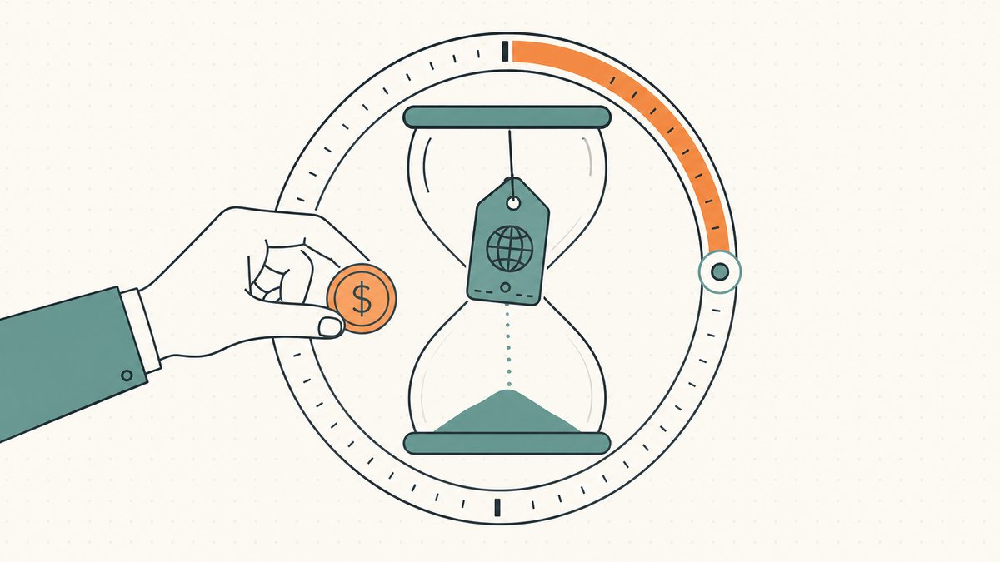

Die meisten Menschen nehmen an, dass eine Domain, deren Registrierung ausläuft, einfach am Tag nach dem Ablauf verschwindet und am nächsten Morgen wieder auf dem freien Markt landet. So ist es nicht. Ein Name, den niemand verlängert, durchläuft eine feste, mehrwöchige Abfolge von Haltezuständen — jeder mit eigenen Regeln dazu, wer ihn zurückholen kann und zu welchem Preis —, bevor die [Registry](/de/glossary/registry/) ihn schließlich wieder in den verfügbaren Pool freigibt. Diese endgültige Freigabe ist „der [Drop](/de/glossary/pending-delete/)", und einen Namen in dem Moment zu registrieren, in dem er landet, ist eine anerkannte Praxis: Wie Wikipedia es formuliert, ist [Domain Drop Catching, auch bekannt als Domain Sniping, die Praxis, einen Domainnamen zu registrieren, sobald die Registrierung abgelaufen ist, unmittelbar nach Ablauf](https://en.wikipedia.org/wiki/Domain_drop_catching#:~:text=is%20the%20practice%20of%20registering%20a%20domain%20name%20once%20registration%20has%20lapsed%2C%20immediately%20after%20expiry).

Flipper interessieren sich für diese Ecke des Marktes, weil gedroppte Namen keine unbeschriebenen Blätter sind. Ein Name erreicht den Drop nur, weil ihn jemand registriert, genutzt und dann aufgegeben hat — er kann also Alter, eingehende Links, Resttraffic oder eine Zeichenfolge mitbringen, die an dem Tag belegt war, an dem Sie ihn sonst per Hand registriert hätten. Der Zyklus ist ein Recyclingstrom für Namen, von denen schon einmal jemand bewiesen hat, dass er sie wollte — ein anderes Risikoprofil als bei einer brandneuen Zeichenfolge und einer der Beschaffungskanäle, die wir in [wie man Domains zum Flippen findet](/de/blog/how-to-find-domains-to-flip/) kartieren. Dieser Erklärartikel geht den Lebenszyklus Stufe für Stufe durch und behandelt dann, wo gedroppte Namen auftauchen und wie sich Flipper positionieren, um sie zu fangen.

## Stufe eins: das aktive Registrierungs- und Verlängerungsfenster

Eine Domain wird nie endgültig besessen. Sie wird für eine Laufzeit registriert und muss verlängert werden, um behalten zu werden — eine [gTLD](/de/glossary/gtld/)-Registrierung läuft über eine Laufzeit, die laut Wikipedia eine Obergrenze hat: [Die maximale Registrierungsdauer für einen gTLD-Domainnamen beträgt 10 Jahre](https://en.wikipedia.org/wiki/Domain_name_registrar#:~:text=The%20maximum%20period%20of%20registration%20for%20a%20gTLD%20domain%20name%20is%2010%20years). Wenn die Laufzeit endet und der Inhaber nicht verlängert hat, beginnt die Uhr für den Drop-Zyklus zu ticken.

Das Erste, was man verstehen muss: „abgelaufen" bedeutet nicht „verfügbar". Am Ablaufdatum hat der [Registrant](/de/glossary/registrant/) noch immer den stärksten Anspruch von allen. Die Registry löscht den Namen nicht einmal sofort: Sie verlängert die Registrierung automatisch und gibt dem Registrar ein Zeitfenster, um die Zahlung einzuziehen oder zu stornieren. Im [`.com`](/de/tld/com/)-Namensraum heißt dies **Auto-Renew Grace Period**, und Verisigns verbindlicher Registry-Vertrag legt deren Länge fest — [der aktuelle Wert der Auto-Renew Grace Period beträgt 45 Kalendertage](https://www.icann.org/en/registry-agreements/com/com-registry-agreement-appendix-7-1-12-2012-en#:~:text=The%20current%20value%20of%20the%20Auto%2DRenew%20Grace%20Period%20is%2045%20calendar%20days). Andere gTLDs folgen demselben Muster, auch wenn eine bestimmte Registry abweichende Werte festlegen kann; behandeln Sie `.com` daher als Referenzfall und nicht als universelles Gesetz.

Die meisten Registrare verhindern während dieses Fensters, dass die Website auflöst, und stellen einen Platzhalter dar, doch der Name wird für den ursprünglichen Eigentümer gehalten, der ihn in der Regel zum oder nahe dem normalen Preis verlängern kann (die Mahngebühr neigt dazu, zu steigen, je tiefer man hineingerät). Das Prinzip gilt: Unmittelbar nach dem Ablauf hat der säumige Eigentümer das Vorkaufsrecht, und ein Name, der in einem Tool als „abgelaufen" angezeigt wird, ist meist noch nicht fangbar. Das ist auch der Grund, warum der günstigste Weg, einen Namen zu behalten, die rechtzeitige Verlängerung ist — die Standard-Verlängerungsgebühr für eine schlichte `.com` ist bescheiden; Wikipedia merkt an, dass [die Endkundenkosten generell von etwa 9,70 US-Dollar pro Jahr bis etwa 35 US-Dollar pro Jahr reichen](https://en.wikipedia.org/wiki/Domain_name_registrar#:~:text=the%20retail%20cost%20generally%20ranges%20from%20a%20low%20of%20about%20%249.70%20per%20year) für eine einfache Registrierung. Alles, was folgt, ist das, was passiert, wenn niemand diese Rechnung bezahlt.

## Stufe zwei: die Redemption Grace Period

Schließt sich das Grace-Fenster ohne Verlängerung, löscht der Registrar den Namen in ein Rückhol-Fenster namens **[Redemption Grace Period](/de/glossary/grace-period/)** (Sie werden auch „[Redemption Period](/de/glossary/redemption-period/)" oder `redemptionPeriod` im [WHOIS](/de/glossary/whois/) und im EPP-Status sehen). Dies ist die Stufe, die die Menschen am häufigsten überrascht, denn der alte Eigentümer kann den Namen noch zurückbekommen, auch wenn das nun echtes Geld kostet und eine formale Statusänderung auslöst. Die [ICANN](/de/glossary/icann/) selbst spricht von der [30-tägigen Redemption Grace Period (RGP)](https://www.icann.org/resources/pages/grace-2013-05-03-en#:~:text=30%2Dday%20Redemption%20Grace%20Period%20%28RGP%29), und ihr Registranten-FAQ bestätigt, dass ein gelöschter Name folgendes durchläuft: [die Domain tritt für 30 Tage in eine Redemption Period ein](https://www.icann.org/resources/pages/domain-name-renewal-expiration-faqs-2018-12-07-en#:~:text=the%20domain%20name%20will%20enter%20into%20a%20redemption%20period%20for%2030%20days). Der verbindliche `.com`-Vertrag fixiert dieselbe Zahl — [die aktuelle Länge dieser Redemption Period beträgt 30 Kalendertage](https://www.icann.org/en/registry-agreements/com/com-registry-agreement-appendix-7-1-12-2012-en#:~:text=The%20current%20length%20of%20this%20Redemption%20Period%20is%2030%20calendar%20days).

Zwei praktische Details sind hier für einen Flipper wichtig. Erstens ist die 30-Tage-Angabe der Ausgangswert für gängige gTLDs, keine universelle Konstante. Laut Wikipedia [variiert diese Zeitspanne je nach TLD und liegt meist bei etwa 30 bis 90 Tagen](https://en.wikipedia.org/wiki/Domain_drop_catching#:~:text=usually%20around%2030%20to%2090%20days). Zweitens ist die Rückholung während der Redemption absichtlich teuer. Es ist kein Ein-Klick-Verlängern; ICANNs Regeln verlangen, dass [Domainnamen, die sich in der 30-tägigen Redemption Grace Period befinden, eingelöst (oder verlängert) werden können](https://www.icann.org/resources/pages/domain-name-renewal-expiration-faqs-2018-12-07-en#:~:text=Domain%20names%20that%20are%20in%20the%2030%2Dday%20Redemption%20Grace%20Period%20can%20be%20redeemed), bevor sich das Fenster schließt, doch der Registrar berechnet zusätzlich zur Verlängerung in der Regel eine saftige Redemption-Gebühr — Wikipedia beziffert sie auf ein Niveau, bei dem der Eigentümer [möglicherweise eine Gebühr (typischerweise rund 100 US-Dollar) zahlen muss, um die Domain wieder zu aktivieren und neu zu registrieren](https://en.wikipedia.org/wiki/Domain_drop_catching#:~:text=may%20be%20required%20to%20pay%20a%20fee%20%28typically%20around%20US%24100%29). Diese Gebühr existiert mit Absicht: Sie gibt einem wirklich vergesslichen Eigentümer eine letzte Chance und macht es zugleich kostspielig, mit dem Zyklus zu spielen.

Für einen Käufer, der einen Namen durch die Redemption beobachtet, lautet die Lehre: Geduld. Eine Domain in der Redemption ist nicht fangbar und auf dem freien Markt nicht zu verkaufen — sie steht rechtlich noch dem säumigen Eigentümer zur Rückholung zu. Zahlreiche Namen, die „fast geschenkt" aussehen, sitzen in diesem Fenster, und der Registrant holt sich einen beträchtlichen Anteil der guten Namen zurück, bevor sie überhaupt droppen. Das Fell des Bären während der Redemption zu verteilen ist der häufigste Weg, vom Drop enttäuscht zu werden.

## Stufe drei: Pending Delete

Endet die Redemption ohne Rückholung, tritt der Name in den letzten Haltezustand vor der Freigabe ein: Pending Delete. Dies ist eine kurze, starre Sperre, in der niemand den Namen registrieren oder zurückholen kann — weder der alte Eigentümer noch Sie. Der `.com`-Vertrag benennt den Auslöser und die Sperre ausdrücklich: [Ein Domainname wird in den Status PENDING DELETE versetzt, wenn er während der Redemption Grace Period nicht wiederhergestellt wurde](https://www.icann.org/en/registry-agreements/com/com-registry-agreement-appendix-7-1-12-2012-en#:~:text=A%20domain%20name%20is%20placed%20in%20PENDING%20DELETE%20status%20if%20it%20has%20not%20been%20restored%20during%20the%20Redemption%20Grace%20Period), und alle Registrar-Anfragen, einen Namen in diesem Status zu ändern, werden abgelehnt. Er existiert einzig dazu, der Registry einen sauberen Countdown bis zur Löschung zu geben.

Die Dauer ist hier die festeste Zahl im gesamten Zyklus. ICANNs Registranten-FAQ besagt, dass ein nicht wiederhergestellter Name [für 5 Tage in den Status PendingDelete eintritt](https://www.icann.org/resources/pages/domain-name-renewal-expiration-faqs-2018-12-07-en#:~:text=will%20enter%20into%20PendingDelete%20status%20for%205%20days), und der `.com`-Registry-Vertrag bestätigt, [die aktuelle Länge dieser Pending Delete Period beträgt fünf Kalendertage](https://www.icann.org/en/registry-agreements/com/com-registry-agreement-appendix-7-1-12-2012-en#:~:text=The%20current%20length%20of%20this%20Pending%20Delete%20Period%20is%20five%20calendar%20days); Wikipedia nennt dasselbe Fenster, nach dem [die Domain aus der ICANN-Datenbank gedroppt wird](https://en.wikipedia.org/wiki/Domain_drop_catching#:~:text=phase%20of%205%20days%2C%20the%20domain%20will%20be%20dropped%20from%20the%20ICANN%20database). Diese fünf Tage sind das nützlichste Signal für den Flipper, denn Pending Delete ist die eine Stufe mit einem berechenbaren Ende. Sobald ein Name, den Sie wollen, in sie eintritt, können Sie auf die Stunde genau berechnen, wann er freigegeben wird. Diese Vorhersehbarkeit macht aus dem Drop statt einer Lotterie etwas, um das herum man planen kann: Die jagdwürdigen Namen kündigen ihr eigenes Freigabedatum fünf Tage im Voraus an.

## Stufe vier: Freigabe und das Gerangel, sie zu fangen

Am Ende von Pending Delete wird der Name aus der Registry gelöscht und kehrt in den verfügbaren Pool zurück. ICANNs Leitlinie ist eindeutig: Nach der Redemption- und der Pending-Delete-Periode [wird der Domainname freigegeben und nach dem Prinzip „first come, first served" zur Registrierung verfügbar gemacht](https://www.icann.org/resources/pages/domain-name-renewal-expiration-faqs-2018-12-07-en#:~:text=the%20domain%20name%20will%20be%20released%20and%20made%20available%20for%20registration%20on%20a%20first%2Dcome%2Dfirst%2Dserved%20basis). Theoretisch ist das der Moment, in dem ihn jeder zur Standardgebühr registrieren kann. In der Praxis erreichen die begehrtesten Namen fast nie einen Menschen, der etwas in das Suchfeld eines Registrars tippt, denn die Freigabe wird von automatisierten Systemen umkämpft, die genau für diesen Augenblick gebaut sind.

Hier kommen [Drop-Catching](/de/glossary/backorder/)-Dienste ins Spiel. Statt eine Suche zu aktualisieren und zu hoffen, richten diese Betreiber Infrastruktur auf die Registry aus, um in der Mikrosekunde, in der ein Name freigegeben wird, Registrierungsanfragen abzufeuern. Wie Wikipedia sie beschreibt, [bieten diese Dienste an, ihre Server der Sicherung eines Domainnamens zu widmen, sobald er verfügbar wird, üblicherweise zu einem Auktionspreis](https://en.wikipedia.org/wiki/Domain_drop_catching#:~:text=These%20services%20offer%20to%20dedicate%20their%20servers%20to%20securing%20a%20domain%20name%20upon%20its%20availability) — und sie gewinnen beständig gegen jeden, der es von Hand versucht. Wikipedia benennt die Asymmetrie unverblümt: [Einzelpersonen mit ihren begrenzten Ressourcen finden es schwierig, mit diesen Drop-Catching-Firmen zu konkurrieren](https://en.wikipedia.org/wiki/Domain_drop_catching#:~:text=Individuals%20with%20their%20limited%20resources%20find%20it%20difficult%20to%20compete%20with%20these%20drop%20catching%20firms) um die begehrten Namen. Wenn mehr als ein Dienst denselben Namen für verschiedene Kunden fängt, geht er in eine private [Auktion](/de/glossary/auction/) unter ihnen, sodass das „Fangen" eines umkämpften Namens meist bedeutet, ein Gebot zu gewinnen, statt eine Registrierungsgebühr zu zahlen.

Die ehrliche Einordnung für einen Flipper: Bei wirklich guten Namen fangen Sie den Drop nicht wirklich selbst — Sie engagieren den Fang. Das Verständnis des Zyklus sagt Ihnen, *wann* ein Name zu gewinnen ist und *was er wert ist*; die eigentliche Erfassung läuft über einen Backorder- oder Drop-Catch-Dienst, den wir in [Domain-Backorders und Drop Catching](/de/blog/domain-backorders-and-drop-catching/) behandeln.

## Wo gedroppte Namen auftauchen

Den Zyklus zu kennen hilft nur, wenn Sie wissen, wo Sie ihn beobachten müssen. Gedroppte und droppende Namen tauchen an einigen vorhersehbaren Orten auf, und eine funktionierende Beschaffungsroutine zieht meist aus mehreren zugleich:

- **Drop-Listen und Datenbanken abgelaufener Domains.** Öffentliche und kostenpflichtige Listen veröffentlichen täglich Namen, die in Pending Delete eintreten, oft filterbar nach Länge, [TLD](/de/glossary/tld/), Keyword, Alter und Link-Metriken — der Rohstrom für eine Beobachtungsliste von Namen, die kurz vor der Freigabe stehen.
- **Backorder- und Drop-Catch-Plattformen.** Statt den Kalender selbst zu beobachten, platzieren Sie eine Backorder, und ein Dienst konkurriert bei der Freigabe in Ihrem Namen um den Namen. Das ist der praktische Weg zu allem, was gefragt ist — siehe [Domain-Backorders und Drop Catching](/de/blog/domain-backorders-and-drop-catching/).
- **Auktionen für abgelaufene Domains.** Viele Registrare lassen wertvollen ablaufenden Bestand gar nicht erst in den öffentlichen Drop gelangen; sie leiten ihn während oder nach dem Grace-Fenster in ihre eigenen Auktionen für abgelaufene Domains, sodass der Name verkauft statt freigegeben wird. Das überschneidet sich mit dem breiteren Kanal in [wie man Domain-Auktionen gewinnt](/de/blog/how-to-win-domain-auctions/).
- **Aftermarket-Marktplätze.** Namen, die jemand anderes gefangen hat oder die zurückgeholt und neu gelistet wurden, tauchen zum Wiederverkauf auf dem [Aftermarket](/de/glossary/aftermarket/) wieder auf. Nicht der Drop selbst, aber der Ort, an dem ein Großteil des Post-Drop-Bestands landet.

Der Vorteil des Flippers liegt darin, den Kanal auf den Namen abzustimmen — eine Zeichenfolge mit geringer Konkurrenz auf einer öffentlichen Drop-Liste ist ein guter handregistrierungsnaher Zug, während ein Premium-Einwortname eine Backorder und vermutlich ein Auktionsbudget verlangt. Wenn Ihr Instinkt eher dazu rät, frische Zeichenfolgen zu registrieren, ist das ein legitimer und anderer Weg, beschritten in [Domains zum Flippen per Hand registrieren](/de/blog/hand-registering-domains-to-flip/).

## Den Zyklus als Flipper lesen

Fügt man die Stufen zusammen, hört der Drop-Zyklus auf, ein Mysterium zu sein, und wird zu einem Fahrplan, nach dem man handeln kann. Zwei Regeln fallen direkt aus der Mechanik heraus.

**Beobachten Sie Pending Delete, nicht das Ablaufdatum.** „Abgelaufen" ist nicht „verfügbar": Der säumige Eigentümer behält durch das [Auto-Renew](/de/glossary/domain-renewal/)-Fenster hindurch den ersten Anspruch und kann den Namen, teuer, über die gesamte Redemption hinweg noch zurückholen. Die meisten lohnenswerten Namen werden dort zurückgeholt, sobald die Eigentümer den Lapsus bemerken, sodass das, was bis zu Pending Delete übrig bleibt, in Richtung jener Namen tendiert, die der Eigentümer wirklich aufgegeben hat. Weil dieses 5-Tage-Fenster fest ist, ist es die eine Stufe, die man präzise terminieren kann — weshalb Backorder-Dienste ihren gesamten Betrieb daran ausrichten.

**Die Sorgfaltsprüfung reist mit dem Namen.** Ein gedroppter Name erbt seine Geschichte, und nicht jede Geschichte ist gut. Bevor Sie auf einen gealterten Namen bieten, prüfen Sie seine frühere Nutzung, seine [WHOIS](/de/glossary/whois/)- und Eigentümerspur, etwaige [Registrar](/de/glossary/registrar/)-Sperren und ob er je etwas gehostet hat, das ihn belastet. Ein Name, der zuvor eine Marke verletzt hat, kann in Ihren Händen noch immer eine [UDRP](/de/glossary/udrp/)-Beschwerde anziehen; bestehende Backlinks können ebenso gut Spam wie Gold sein. Der Drop übergibt Ihnen das Asset *und* seinen Ballast.

Der Zyklus belohnt Menschen, die ihn als Installation behandeln statt als Glück. Die Zeitfenster sind veröffentlicht, die Stufen sind fest, und die Namen fallen nach Plan heraus. Was einen Beschaffungsvorteil von einem Verlängerungsfriedhof trennt, ist das Wissen, welche droppenden Namen es wert sind, gefangen zu werden — eine Bewertungsfähigkeit, keine Timing-Fähigkeit. Es ist der vorgelagerte Angebotsschritt in dem größeren Handwerk, das wir in der Serie [Domain Flipping](/de/blog/domain-flipping/) kartieren.

## Der Namefi-Blickwinkel

Einen großartigen gedroppten Namen zu fangen ist nur die halbe Arbeit; beim nächsten Eigentümerwechsel stoßen Sie auf dieselbe Reibung, auf die jeder hochwertige [Domain-Handel](/de/glossary/domain-trading/) stößt. Der Käufer zahlt nicht, bevor der Name umzieht, der Verkäufer zieht ihn nicht um, bevor er bezahlt wird, und die Übergabe des [Auth-Codes](/de/glossary/auth-code/) zwischen Registraren hinterlässt eine nervöse Lücke in der Mitte. Diese Pattsituation ist der Grund, warum es [Treuhand](/de/glossary/escrow/) gibt, und sie wird umso schärfer, je mehr ein gealterter, linkreicher Name wert ist.

Das ist die Lücke, die [Namefi](https://namefi.io) verkleinern soll. Tokenisiertes Eigentum macht die Kontrolle über eine echte ICANN-Domain leichter überprüf- und übertragbar, mit [DNS](/de/glossary/dns/)-Kontinuität, damit ein am Drop gefangener Name sauber weiter auflöst, wenn Sie ihn weiterflippen. Für einen Flipper, der aus dem Drop-Zyklus beschafft, bedeutet weniger Abwicklungsreibung am Ausgang, dass mehr dieser hart erkämpften Fänge tatsächlich zu abgeschlossenen Verkäufen werden.

## Freundlicher Haftungsausschluss (Bitte lesen!)

> Wir sind keine Anwälte, Steuerberater, Finanzberater oder Ärzte, und **nichts in diesem Artikel ist eine rechtliche, finanzielle, steuerliche, buchhalterische, medizinische oder sonstige Art von professioneller Beratung.** Wir schreiben diese Beiträge, um uns selbst weiterzubilden, und als Service für unsere Kunden. Die Informationen hier können veraltet, geografisch spezifisch oder schlicht falsch sein. Auch wir machen Fehler.
>
> Für jede wichtige Entscheidung **konsultieren Sie bitte einen echten Fachmann (im Ernst!)**. Oder, wenn das nicht Ihr Ding ist, fragen Sie einen Freund, fragen Sie Twitter, fragen Sie Reddit, fragen Sie eine KI oder fragen Sie eine:n Hellseher:in. Kurz gesagt: **DOYR — Do Your Own Research (Recherchieren Sie selbst).** Lassen Sie uns lernen und Spaß haben.

## Quellen und weiterführende Literatur

- ICANN — [.com Registry Agreement, Anhang 7 (Auto-Renew Grace Period 45 Tage; Redemption Period 30 Tage; Pending Delete 5 Tage)](https://www.icann.org/en/registry-agreements/com/com-registry-agreement-appendix-7-1-12-2012-en#:~:text=The%20current%20value%20of%20the%20Auto%2DRenew%20Grace%20Period%20is%2045%20calendar%20days)
- ICANN — [FAQs for Registrants: Domain Name Renewals and Expiration (30-tägige Redemption, 5-tägiges PendingDelete, Freigabe nach „first come, first served")](https://www.icann.org/resources/pages/domain-name-renewal-expiration-faqs-2018-12-07-en#:~:text=the%20domain%20name%20will%20enter%20into%20a%20redemption%20period%20for%2030%20days)
- ICANN — [About Redeeming a Domain Name in Redemption Grace Period (30-tägige RGP)](https://www.icann.org/resources/pages/grace-2013-05-03-en#:~:text=30%2Dday%20Redemption%20Grace%20Period%20%28RGP%29)
- Wikipedia — [Domain drop catching (Definition von Drop/Sniping; Redemption meist 30–90 Tage und ~100-US-Dollar-Gebühr; 5-tägiges Pending Delete; Drop-Catch-Dienste)](https://en.wikipedia.org/wiki/Domain_drop_catching#:~:text=is%20the%20practice%20of%20registering%20a%20domain%20name%20once%20registration%20has%20lapsed%2C%20immediately%20after%20expiry)
- Wikipedia — [Domain name registrar (10 Jahre maximale gTLD-Laufzeit; Endkundenpreise für `.com`)](https://en.wikipedia.org/wiki/Domain_name_registrar#:~:text=The%20maximum%20period%20of%20registration%20for%20a%20gTLD%20domain%20name%20is%2010%20years)
- Wikipedia — [Domain name speculation (Domaining und Domain Flipping)](https://en.wikipedia.org/wiki/Domain_name_speculation#:~:text=is%20the%20practice%20of%20identifying%20and%20registering%20or%20acquiring%20generic%20Internet%20domain%20names%20as%20an%20investment)
