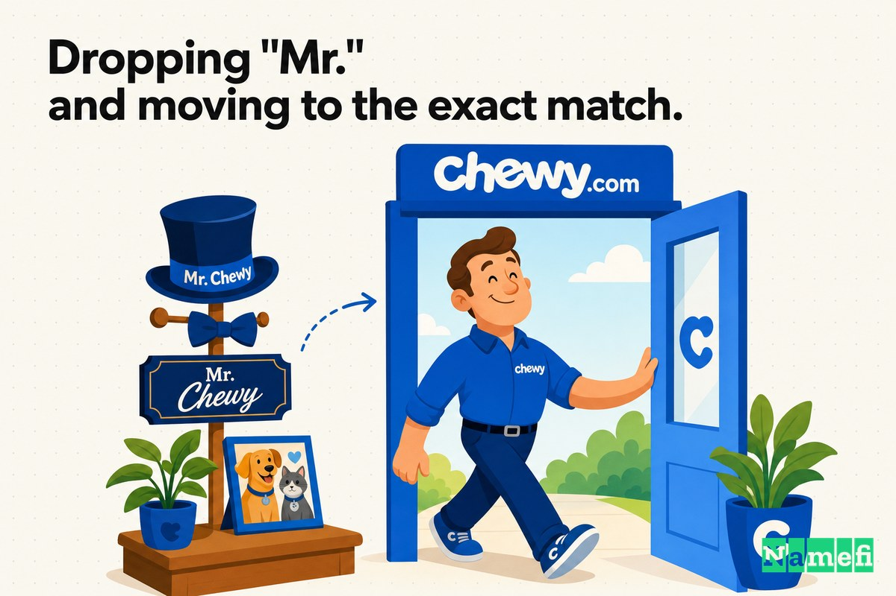
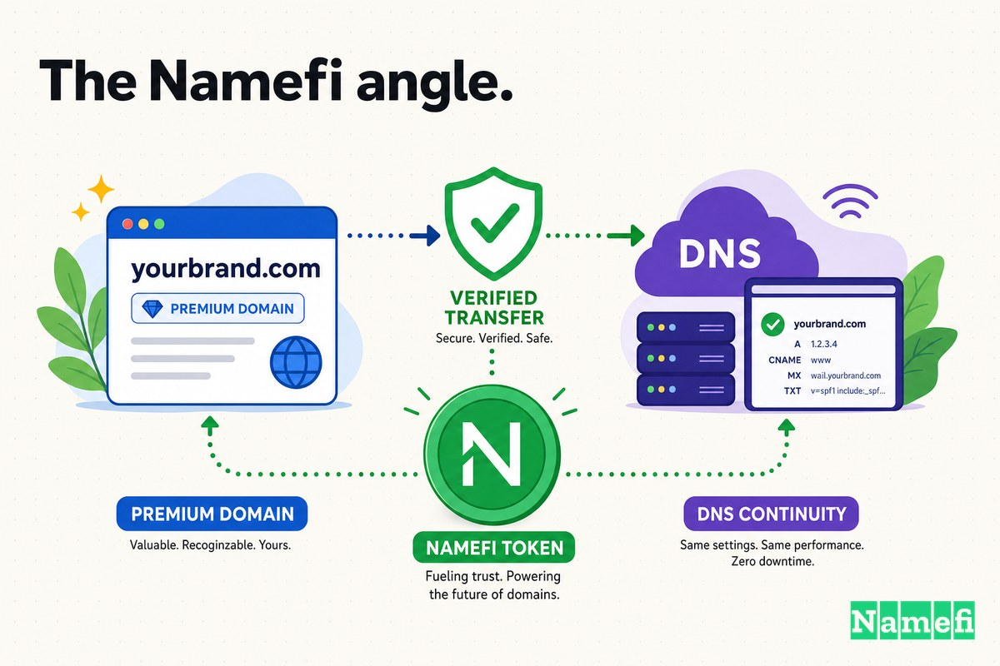

Bevor Chewy zur Legende im Kundenservice des Haustier-E-Commerce wurde – bevor die handgeschriebenen Karten, die Kondolenzblumen und der 3,35-Milliarden-Dollar-Exit – trug es einen etwas liebenswürdigeren, vorsichtigeren Namen. Es hieß **Mr. Chewy** und war unter **MrChewy.com** zu finden.

Die Anrede machte damals Sinn. Im Jahr 2011 baten zwei Freunde Ende zwanzig Fremde, Hundefutter von einer Website zu kaufen, die niemand kannte – in einer Kategorie, die bereits eine der bekanntesten Pleiten der Dotcom-Ära hervorgebracht hatte. „Mr. Chewy" war freundlich. Es war zugänglich. Es klang wie eine Figur, nicht wie ein Konzern – ein höflicher, persönlicher Ladenbesitzer für Ihr Haustier. Für einen brandneuen Shop, der Vertrauen aufbauen musste, leistete das „Mr." echte emotionale Arbeit.

Doch ein Name, der wie ein Maskottchen klingt, ist etwas anderes als ein Name, der wie eine Kategorie klingt. Als das Unternehmen über sein erstes Publikum hinauswuchs, wirkte das „Mr." weniger wie Wärme und mehr wie Stützräder. Die Gründer ließen es fallen. Der Shop wurde einfach **Chewy**, und die Adresse wurde zur exakt passenden **Chewy.com** – einer Ein-Wort-Domain, die von einem der bekanntesten Domain-Investoren der Welt Jahre vor der Gründung eines Haustier-Startups von Hand registriert worden war.

Sechs Jahre nach dem Start [zahlten PetSmarts Eigentümer 3,35 Milliarden Dollar für Chewy](https://hbr.org/2020/01/the-founder-of-chewy-com-on-finding-the-financing-to-achieve-scale) – das Unternehmen, nicht die Domain – in dem, was damals die größte E-Commerce-Akquisition aller Zeiten war. Die Domain war nicht der Grund. Aber zu diesem Zeitpunkt war der klare, einfache Ein-Wort-Name tragend – die Adresse, die auf jeder Box, jedem Beleg und jeder „wir haben es bei Chewy bestellt"-Empfehlung zwischen Tierbesitzern stand.

## 2011: Das „Mr.", das einem neuen Shop ein sicheres Gefühl gab

Am Anfang war „Mr. Chewy" ein Feature, kein Bug.

Das Unternehmen wurde [im Juni 2011 unter dem Namen „Mr. Chewy" von Ryan Cohen und Michael Day gegründet](https://en.wikipedia.org/wiki/Chewy_(company)#:~:text=Chewy%20was%20founded%20with%20the%20name%20%22Mr.%20Chewy%22%20in%20June%202011%20by%20Ryan%20Cohen%20and%20Michael%20Day). Es wäre beinahe nicht dazu gekommen. Cohen und Day standen nach eigenen Angaben kurz davor, etwas völlig anderes zu starten. Wie die Gründungsgeschichte erzählt, [waren Cohen und Day eine Woche davon entfernt, ihr Schmuckunternehmen zu starten. Stattdessen verkauften sie den Lagerbestand und den Tresor und vertieften sich in die Tiernahrungsbranche](https://www.businessofbusiness.com/articles/if-you-own-a-pet-youve-heard-of-chewy-heres-why-the-31-billion-site-succeeded-where-petscom-failed/#:~:text=Cohen%20and%20Day%20were%20a%20week%20away%20from%20launching%20their%20jewelry%20business). Der Schwenk kam aus einem kleinen, persönlichen Moment: [Cohen stand mit seinem Pudel in einem Tierfutterladen und sprach mit einem Mitarbeiter über Futteroptionen, als er eine Erleuchtung hatte](https://www.businessofbusiness.com/articles/if-you-own-a-pet-youve-heard-of-chewy-heres-why-the-31-billion-site-succeeded-where-petscom-failed/#:~:text=co%2Dfounder%20Ryan%20Cohen%20was%20standing%20in%20a%20pet%20food%20store%20with%20his%20poodle).

Sie [starteten Chewy.com im Jahr 2011 mit eigenem Kapital und einigen kleinen Darlehen](https://www.businessofbusiness.com/articles/if-you-own-a-pet-youve-heard-of-chewy-heres-why-the-31-billion-site-succeeded-where-petscom-failed/#:~:text=Cohen%20and%20Day%20launched%20Chewy.com%20in%202011%20using%20their%20own%20cash%20and%20several%20small%20loans) – aber unter dem Banner „Mr. Chewy" auf MrChewy.com. Die Anrede tat genau das, was eine junge [Marke](/de/glossary/trademark/) von einem Namen braucht: Sie ließ eine unerprobte Website wie einen freundlichen Nachbarn statt wie eine gesichtslose Verkaufsfläche wirken. In einer Kategorie, die noch immer vom spektakulären Zusammenbruch von Pets.com heimgesucht wurde, war ein Name, der warm und menschlich wirkte, ein bewusstes Gegenmittel gegen die kalte, Sockenpuppen-Erinnerung an den letzten Haustierzubehör-Goldrausch.

Das „Mr." war die Auffahrtsrampe. Es war nicht das Ziel.

## Das „Mr." ablegen und zur exakten Übereinstimmung wechseln

Irgendwann in seinen frühen Jahren ließ das Unternehmen die Anrede fallen. „Mr. Chewy" wurde zu **Chewy**, und die Marke konsolidierte sich auf der exakt passenden **Chewy.com**.

Branchenbeobachter von Domain-Upgrades behandeln den Schritt als Musterbeispiel einer Vereinfachung. Smart Branding, das ein Jahrzehnt der Namensverkürzungen von Marken zusammenfasste, stellt fest, dass [Chewy unter dem Namen „Mr. Chewy" gegründet wurde](https://smartbranding.com/2010-2020-a-decade-in-domains-part-1-brands-simplified-their-names/#:~:text=Chewy%20was%20founded%20under%20the%20name%20%22Mr.%20Chewy%22), bevor es auf den kürzeren Namen konsolidierte. Und die Domain selbst lag nicht einfach frei herum. Der exakt passende Name hatte einen bekannten Vorbesitzer: [Die Domain Chewy.com scheint von Frank Schillings Name Administration verkauft worden zu sein](https://smartbranding.com/2010-2020-a-decade-in-domains-part-1-brands-simplified-their-names/#:~:text=The%20domain%20Chewy.com%20appears%20to%20have%20been%20sold%20by%20Frank%20Schilling%27s%20Name%20Administration), einem der größten und renommiertesten Domain-Portfolios im Internet. Chewy.com war keine frische Registrierung – sie war [im April 2004 registriert worden](https://secureyourtrademark.com/blog/the-chewy-com-trademark/#:~:text=The%20domain%20chewy.com%20was%20registered%20in%20April%20of%202004), sieben Jahre bevor Mr. Chewy jemals einen Beutel Trockenfutter verkauft hatte.

Wie viel kostete das Upgrade? Hier schweigt die öffentliche Aufzeichnung. Mehrere Quellen bestätigen, dass das Unternehmen [den Namen vom Domain-Investor Frank Schilling für einen nicht genannten Betrag erwarb](https://smartbranding.com/mychewy-com-upgrade-to-chewy-com/#:~:text=They%20acquired%20the%20name%20from%20domain%20investor%20Frank%20Schilling%20for%20an%20undisclosed%20amount), und dieselben Chroniken bestätigen direkt, dass [der Preis der Domain privat gehalten wurde](https://smartbranding.com/2010-2020-a-decade-in-domains-part-1-brands-simplified-their-names/#:~:text=The%20price%20of%20the%20domain%20was%20kept%20private). Die Zahl, die in dieser Geschichte *tatsächlich* bekannt ist, ist also nicht der Domain-Preis – es ist die am anderen Ende des Bogens: [Im Jahr 2017 erwarb PetSmart Chewy.com für 3,35 Milliarden Dollar in der größten E-Commerce-Akquisition](https://smartbranding.com/2010-2020-a-decade-in-domains-part-1-brands-simplified-their-names/#:~:text=In%202017%2C%20PetSmart%20acquired%20Chewy.com%20for%20%243.35%20billion%20in%20the%20largest%20e%2Dcommerce%20acquisition) bis zu diesem Datum. Die Domain, an der PetSmart einen Anteil erwarb, war die klare, einfache Ein-Wort-Version – nicht die mit Anrede.

## Die Vorgeschichte: Ein Java-Chatroom, ein Schmuck-Schwenk und 100 Absagen

Die Gründer sahen nicht wie Menschen aus, die dazu bestimmt waren, eine Kategorie gegen Amazon zu gewinnen.

Cohen und Day [trafen sich in einem Java-Chatroom](https://www.aol.com/article/finance/2017/04/20/meet-the-young-founders-of-chewy-com-which-petsmart-just-bought/22048014#:~:text=launched%20the%20company%20in%202011%2C%20after%20meeting%20in%20a%20Java%20chat%20room) – Cohen arbeitete im Affiliate-Marketing, Day war Programmierer. Vor dem Haustierbereich [investierten die beiden 150.000 Dollar eigenes Geld in ein Online-Schmuck-Startup](https://www.aol.com/article/finance/2017/04/20/meet-the-young-founders-of-chewy-com-which-petsmart-just-bought/22048014#:~:text=the%20two%20put%20%24150%2C000%20of%20their%20own%20money%20into%20an%20online%20jewelry%20startup), das Vorhaben, das sie eine Woche vor dem Start aufgaben.

Dann kam die Wand aus „Nein". [Cohen flog von seinem Heimatort in Florida nach Silicon Valley und sprach bei Dutzenden von Risikokapitalfirmen vor. Alle lehnten ab, weil sie nicht glaubten, dass Chewy gegen Amazon bestehen könnte](https://www.businessofbusiness.com/articles/if-you-own-a-pet-youve-heard-of-chewy-heres-why-the-31-billion-site-succeeded-where-petscom-failed/#:~:text=Cohen%20flew%20from%20his%20home%20base%20in%20Florida%20to%20Silicon%20Valley%20and%20approached%20dozens%20of%20VC%20firms.%20Everyone%20turned%20him%20down). Der Durchbruch kam von einem Investor, der zurückkam: [Ende September 2013 warf ein Investor, der zunächst abgelehnt hatte, einen zweiten Blick](https://www.businessofbusiness.com/articles/if-you-own-a-pet-youve-heard-of-chewy-heres-why-the-31-billion-site-succeeded-where-petscom-failed/#:~:text=in%20late%20September%202013%2C%20an%20investor%20who%20had%20initially%20passed%20took%20a%20second%20look), nachdem er gehört hatte, dass das Unternehmen seine Prognosen weit übertroffen hatte, und [schrieb sofort einen Scheck über 15 Millionen Dollar an Cohen und Day, um in Chewy zu investieren](https://www.businessofbusiness.com/articles/if-you-own-a-pet-youve-heard-of-chewy-heres-why-the-31-billion-site-succeeded-where-petscom-failed/#:~:text=immediately%20wrote%20a%20%2415%20million%20check%20to%20Cohen%20and%20Day%20to%20invest%20in%20Chewy).

Als das Geld eintraf, musste die Marke bereit sein zu skalieren – und eine Marke, die skaliert, möchte kein Maskottchen-Titelwort haben, das jede Erwähnung beschwert.

## Das Geld sah damals anders aus

Es ist verlockend, „Chewy" und „Chewy.com" zu betrachten und anzunehmen, dass der Ein-Wort-Name immer offensichtlich, immer günstig, immer unvermeidlich war. Das war er nicht.

In den Jahren 2011 und 2012 war Chewy ein selbstfinanziertes Startup, das von dem eigenen Kapital der Gründer und kleinen Darlehen lebte, in einer Kategorie, die Investoren aktiv mieden. Eine Premium-Exact-Match-Ein-Wort-[.com](/de/tld/com/) – von Hand im Jahr 2004 registriert und in einem erstklassigen [Domain-Portfolio](/de/glossary/domain-portfolio/) geparkt – ist nicht die Art von Asset, die ein geldknappes Tiergeschäft beiläufig kauft. Was auch immer der nicht genannte Preis war, er wurde gegen Lohnkosten, Lagerbestand und die Kundenservice-Infrastruktur abgewogen, die tatsächlich zum Burggraben des Unternehmens werden sollte.

Das ist der richtige Rahmen für jede Domain-Entscheidung: nicht „Was ist dieser Name am Ende der Geschichte wert?", sondern „Was ist er für ein Unternehmen wert, das noch nicht weiß, ob es das Jahr überleben wird?" Chewy entschied sich, früh auf den sauberen Namen zu konsolidieren, solange es noch klein genug war, dass die Entscheidung echte Kosten bedeutete – und das, mehr als Rückblick, machte es zu einer strategischen statt einer eitelkeitsbedingten Entscheidung.

## Warum das Weglassen von „Mr." wichtig war

Der Unterschied zwischen MrChewy.com und Chewy.com ist ein Wort – und wohl nicht einmal ein Wort, nur ein Titel. Strategisch ist es der Unterschied zwischen einer *Figur* und einer *Kategorie*.

**MrChewy.com** klingt wie eine Persönlichkeit: ein einzelner, freundlicher Ladenbesitzer, charmant aber klein. **Chewy.com** klingt nach dem Ort, an dem man Dinge für sein Haustier kauft, basta. Das eine ist ein Maskottchen, das man besucht; das andere ist eine Standardoption, nach der man greift. Die Anrede, die den Shop 2011 sicher wirken ließ, wurde zu dem, was ihn kleiner klingen ließ, als er wurde.

| Vorher | Nachher |
| --- | --- |
| MrChewy.com | Chewy.com |
| Klingt wie ein Maskottchen / eine Figur | Klingt wie die Kategorie selbst |
| Freundlich, aber klein und persönlich | Freundlich *und* groß genug, um die Standardoption zu sein |
| Zweiteiliger Name auf jeder Box und jedem Beleg | Ein sauberes Wort, leicht zu sagen und zu buchstabieren |
| „Besuchen Sie Mr. Chewy" | „Holen Sie es bei Chewy" |

Das ist dasselbe Muster, das sich bei Domain-Upgrades immer wieder zeigt: Frühe Namen *beruhigen*, großartige Namen *besitzen*. Die beruhigende Version hilft, solange ein neues Unternehmen noch Vertrauen verdienen muss. Die Exact-Match-Version hilft, sobald das Unternehmen bereit ist, das Ding zu sein, das die Menschen reflexartig benennen. Das Weglassen von „Mr." hat nicht nur eine URL verkürzt – es hat das Diminutiv entfernt, das in die Marke eingebacken war.

## Die Kundenservice-Marke, die kein „Mr." brauchte

Hier liegt die Ironie, die das Weglassen von „Mr." besonders treffend macht: Chewy brauchte keine Anrede, um menschlich zu wirken, denn es baute Menschlichkeit in das Unternehmen selbst ein.

Von Anfang an [glaubten Cohen und Day, dass Kundenservice das Wichtigste in ihrem Geschäft sein musste](https://www.businessofbusiness.com/articles/if-you-own-a-pet-youve-heard-of-chewy-heres-why-the-31-billion-site-succeeded-where-petscom-failed/#:~:text=Cohen%20and%20Day%20believed%20that%20customer%20service%20had%20to%20be%20king%20in%20their%20business). Sie [investierten reichlich Ressourcen in ihr Call-Center-Team, Live-Chat-Mitarbeiter und Angestellte, die auf Kunden-E-Mails antworteten](https://www.businessofbusiness.com/articles/if-you-own-a-pet-youve-heard-of-chewy-heres-why-the-31-billion-site-succeeded-where-petscom-failed/#:~:text=They%20poured%20resources%20into%20their%20call%20center%20team%2C%20live%20chat%20representatives%2C%20and%20employees%20who%20responded%20to%20customer%20emails). Das meisterzählte Beispiel für die Wärme der Marke ist real und leise bewegend: [Kunden, die ihre automatischen Bestellungen wegen des Todes eines Haustieres kündigen, erhalten Kondolenzblumen vom Händler](https://www.businessofbusiness.com/articles/if-you-own-a-pet-youve-heard-of-chewy-heres-why-the-31-billion-site-succeeded-where-petscom-failed/#:~:text=people%20who%20cancel%20their%20auto%2Dship%20orders%20because%20of%20the%20death%20of%20a%20pet%20receive%20condolence%20flowers%20from%20the%20retailer).

Wenn ein Unternehmen echte Blumen an trauernde Tierbesitzer schickt und ans Telefon geht, als ob es das wirklich meint, steckt die Wärme *im Service*. Sie muss nicht mehr in den Namen verkleidet werden. „Mr." war ein Versprechen von Freundlichkeit, das das junge Unternehmen noch nicht eingelöst hatte. Als Chewy eine Legende im Kundenservice war, hatte es dieses Versprechen wirklich eingelöst – und der Name konnte es sich leisten, selbstbewusst, schlicht und ein Wort lang zu sein. Die reflektierende Aussage des Gründers erfasst die Dimension, die diese Wärme schließlich erreichte: [Die meisten Menschen nehmen an, dass der Höhepunkt meiner beruflichen Karriere am 18. April 2017 kam, als die Eigentümer von PetSmart 3,35 Milliarden Dollar für Chewy.com bezahlten, den Tiereinzelhändler, den ich sechs Jahre zuvor mitgegründet hatte](https://hbr.org/2020/01/the-founder-of-chewy-com-on-finding-the-financing-to-achieve-scale).

## Timing: Vereinfachen, bevor die Welt Ihren Namen millionenfach sagt

Die Reihenfolge der Schritte ist die Lektion.

Chewy konsolidierte seinen sauberen Namen und seine Exact-Match-Domain, *solange es noch klein war* – bevor die Marke auf Millionen von Boxen gedruckt war, bevor die Wachstumsrunde über [15 Millionen Dollar](https://www.businessofbusiness.com/articles/if-you-own-a-pet-youve-heard-of-chewy-heres-why-the-31-billion-site-succeeded-where-petscom-failed/#:~:text=immediately%20wrote%20a%20%2415%20million%20check%20to%20Cohen%20and%20Day%20to%20invest%20in%20Chewy) eine Skalierung erzwang, und lange bevor PetSmart das Ganze mit [3,35 Milliarden Dollar](https://hbr.org/2020/01/the-founder-of-chewy-com-on-finding-the-financing-to-achieve-scale) bewertet hatte. Diese Abfolge machte das Upgrade im Aufwand günstig, auch wenn es echtes Geld kostete: Einen Namen zu ändern ist trivial, wenn ihn tausend Kunden kennen, und brutal, wenn es zehn Millionen sind.

Stellen Sie sich die Alternative vor. Ein Chewy, das gewartet hätte – das MrChewy.com zu nationaler Bekanntheit hochskaliert hätte, „Mr. Chewy" auf jede Verpackung gedruckt hätte, eine Generation von Tierbesitzern gelehrt hätte, laut „Mr. Chewy" zu sagen – und *dann* versucht hätte, das „Mr." zu streichen. Diese Umbenennung hätte bedeutet, den gesamten Markt umzuschulen, alles neu zu drucken und genau die Kunden zu verwirren, für die man jahrelang geworben hatte. Durch ein frühes Upgrade zahlte Chewy die Wechselkosten einmal, als es noch klein war.

## Die Domain wurde Teil des Betriebssystems

Premium-Domains gehen nicht um Prestige. Sie gehen um Wiederholung.

Die Kern-Domain eines Tier-Händlers taucht an Stellen auf, die das Marketing-Team nie direkt kontrolliert:

- Auf jeder Versandbox, die an einer Haustür ankommt.
- Auf jedem Beleg, jeder automatischen Erinnerung, jeder Bestellbestätigungs-E-Mail.
- In der Kondolenz-Karte, der Begrüßung im Call Center, der Live-Chat-Kopfzeile.
- In Suchergebnissen und Browser-Leisten.
- In jeder gesprochenen Empfehlung – „hol es einfach bei Chewy" – die von einem Tierbesitzer zum nächsten weitergegeben wird.

Jede einzelne dieser Wiederholungen erzeugt entweder Reibung oder beseitigt sie. **MrChewy.com** machte jede Erwähnung ein bisschen länger, ein bisschen niedlicher, ein bisschen kleiner. **Chewy.com** machte jede Erwähnung kürzer, schlichter und kategoriegerecht. Multipliziert man das über Dutzende Millionen Bestellungen und eine täglich in Tierhaushalten erwähnte Marke, hört das Ein-Wort-Upgrade auf, wie eine kosmetische Wahl auszusehen, und beginnt wie eine dauerhafte Widerstandsreduzierung auszusehen.

Die Domain hat Chewys Marke nicht aufgebaut – das hat der Service getan. Aber sobald Chewy.com die Adresse war, verstärkte jede zukünftige Wiederholung des Namens ein saubereres, selbstbewussteres Fundament, ohne ein „Mr.", das erklärt oder überwunden werden müsste.

## Was Gründer aus Fall 10 lernen sollten

Die einfache Schlussfolgerung – „Lass den niedlichen Zusatz fallen und sichere dir deine Exact-Match-.com" – ist zu plump. Die nützlicheren Lehren handeln davon, *warum* der Zusatz half und *wann* man ihn loslassen sollte:

1. **Ein beruhigender Name ist eine gute Auffahrtsrampe.** „Mr. Chewy" war kein Fehler. In einer Kategorie, die von Pets.com gezeichnet war, senkte ein warmer, menschlicher, fast-Maskottchen-Name die Vertrauenshürde für einen brandneuen Shop. Ein Zusatz wie „Mr.", „App" oder „HQ" kann eine clevere Möglichkeit sein, am ersten Tag zugänglich zu wirken.
2. **Achten Sie auf den Moment, in dem der Zusatz Sie kleiner macht.** Das Signal zum Upgrade ist nicht ästhetisch – es ist dann, wenn Ihr Name etwas Kleineres beschreibt als das, was Sie werden. Ein Maskottchen-Name begrenzt Sie auf „charmantes kleines Unternehmen". Ein Kategorie-Name tut das nicht.
3. **Bauen Sie die Substanz auf, die der Name nur vortäuschte.** „Mr." versprach Freundlichkeit; Chewys Call Center, Live-Chat und Kondolenzblumen *lieferten* sie. Sobald die Wärme im Unternehmen lebt, muss der Name sie nicht mehr verkleiden – und kann es sich leisten, schlicht und selbstbewusst zu sein.
4. **Upgraden Sie, solange Sie klein sind.** Die Wechselkosten einer Umbenennung wachsen mit jedem Kunden, der den alten Namen gelernt hat. Chewy konsolidierte auf Chewy.com, bevor die Marke auf Millionen von Boxen gedruckt war. Das teure, extern besessene Stück – die Exact-Match-Domain, 2004 von Hand in einem großen Portfolio registriert – war es wert, frühzeitig zu sichern.

Das Domain-Upgrade hat Chewy nicht zum Sieger gemacht. Service, Logistik, Kapital und unerbittliche Umsetzung waren weitaus wichtiger. Aber das Weglassen von „Mr." und die Konsolidierung auf Chewy.com machte das Wachstum des Unternehmens *nennbar* – und das wurde getan, solange die Kosten dafür noch gering waren.

## Die Namefi-Perspektive

Dieser Fall ist im Kern ein Transfer-Problem, das als Branding-Verkleidung auftritt.

Die strategische Entscheidung stand nie wirklich in Frage – natürlich sollte ein Tiergeschäft namens Chewy Chewy.com besitzen statt MrChewy.com. Das Schwierige war alles rund um das Asset: ein geldknappes Startup, das um eine Premium-Ein-Wort-.com verhandelt, die seit 2004 in einem erstklassigen Domain-Portfolio saß; Einigung auf einen Preis, der privat blieb; und die Übertragung der Kontrolle über einen Namen, von dem die gesamte Marke bald abhängen würde – alles ohne den laufenden Shop zu unterbrechen. Die folgenreichsten Teile dieser Geschichte sind die, die die öffentliche Aufzeichnung nicht einmal sehen kann: der nicht genannte Preis, die Konditionen, der Nachweis einer sauberen Eigentumsübertragung.

[Namefi](https://namefi.io) ist auf der Idee aufgebaut, dass Domains sich wie internet-native Assets verhalten sollten. Tokenisiertes Eigentum kann die Kontrolle über Domains einfacher verifizierbar, übertragbar und in moderne Workflows integrierbar machen, während die Kompatibilität mit DNS erhalten bleibt – und so die unübersichtlichsten Teile eines solchen Deals (beweisen, wer was besitzt, sich auf den Wert einigen und es sicher übertragen) in etwas verwandeln, das einer sauberen, prüfbaren Transaktion ähnelt. Der nächste Gründer, der von einer niedlichen, mit Zusätzen beladenen Launch-Domain zur selbstbewussten Exact-Match-Domain wechseln muss, sollte das nicht durch einen privaten, nicht verifizierbaren Handschlag tun müssen.

Chewy.com sieht heute unvermeidlich aus, weil Chewy riesig wurde. Aber die Lektion greift lange vor dieser Größe: Wenn ein Name auf jeder Box stehen wird, die man versendet, ist die Domain keine Dekoration – sie ist der Teil der Marke, der es sich lohnt, frühzeitig zu vereinfachen und sauber zu sichern, damit das Unternehmen in einen Namen hineinwachsen kann, anstatt aus einem heraus.

## Quellen und weiterführende Lektüre

- Wikipedia — [Chewy (Unternehmen)](https://en.wikipedia.org/wiki/Chewy_(company)#:~:text=Chewy%20was%20founded%20with%20the%20name%20%22Mr.%20Chewy%22%20in%20June%202011%20by%20Ryan%20Cohen%20and%20Michael%20Day)
- Harvard Business Review — [The Founder of Chewy.com on Finding the Financing to Achieve Scale](https://hbr.org/2020/01/the-founder-of-chewy-com-on-finding-the-financing-to-achieve-scale)
- The Business of Business — [Warum Chewy erfolgreich war, wo Pets.com scheiterte](https://www.businessofbusiness.com/articles/if-you-own-a-pet-youve-heard-of-chewy-heres-why-the-31-billion-site-succeeded-where-petscom-failed/#:~:text=Cohen%20and%20Day%20believed%20that%20customer%20service%20had%20to%20be%20king%20in%20their%20business)
- AOL / Business Insider — [Meet the young founders of Chewy.com, which PetSmart just bought for $3.35 billion](https://www.aol.com/article/finance/2017/04/20/meet-the-young-founders-of-chewy-com-which-petsmart-just-bought/22048014#:~:text=launched%20the%20company%20in%202011%2C%20after%20meeting%20in%20a%20Java%20chat%20room)
- Smart Branding — [2010–2020, ein Jahrzehnt in Domains: Marken vereinfachten ihre Namen](https://smartbranding.com/2010-2020-a-decade-in-domains-part-1-brands-simplified-their-names/#:~:text=The%20domain%20Chewy.com%20appears%20to%20have%20been%20sold%20by%20Frank%20Schilling%27s%20Name%20Administration)
- Smart Branding — [MyChewy.com wechselt zu Chewy.com](https://smartbranding.com/mychewy-com-upgrade-to-chewy-com/#:~:text=They%20acquired%20the%20name%20from%20domain%20investor%20Frank%20Schilling%20for%20an%20undisclosed%20amount)
- Secure Your Trademark — [The Chewy.com Trademark](https://secureyourtrademark.com/blog/the-chewy-com-trademark/#:~:text=The%20domain%20chewy.com%20was%20registered%20in%20April%20of%202004)
