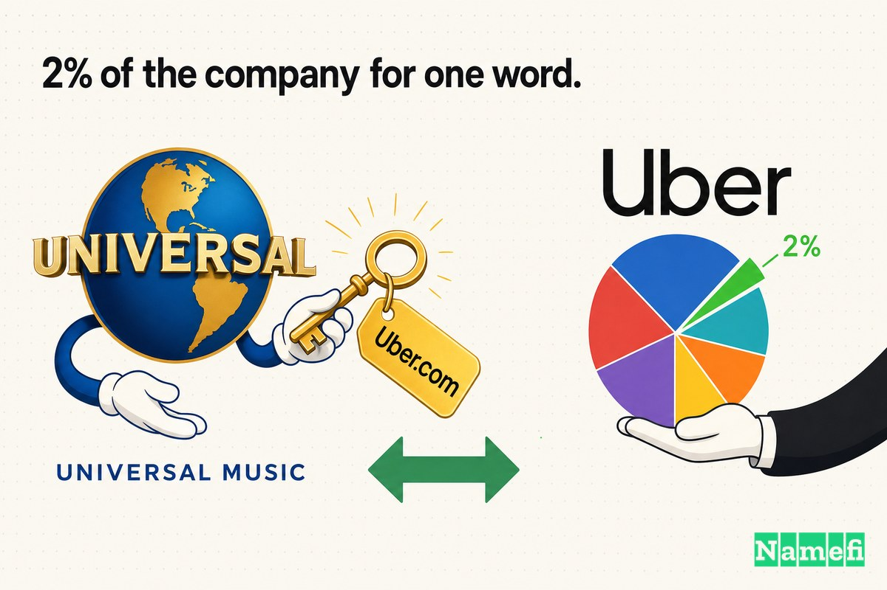
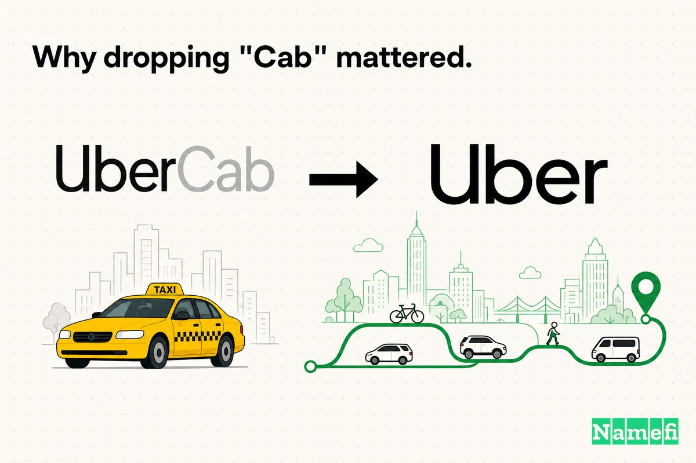
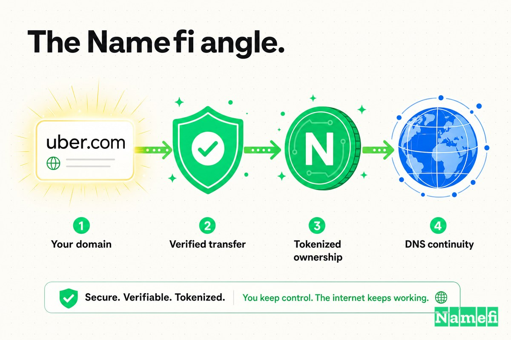

Bevor „Uber" zu einem Verb, einem Logistikimperium und einem Synonym für eine gesamte Kategorie von On-Demand-Diensten wurde, war es etwas Wörtlicheres, Vorsichtigeres: **UberCab.com**.

Der ursprüngliche Name ergab Sinn. Als Garrett Camp und Travis Kalanick den Dienst aufbauten, tat er eine einzige Sache: Man drückte einen Knopf und bestellte sich einen schwarzen Wagen. TechCrunch beschrieb das frühe Produkt als [eine App, mit der Nutzer einen Fahrdienst anfordern können, der sie abholt, wo immer sie sich gerade befinden](https://techcrunch.com/2010/10/15/ubercab-closes-uber-angel-round#:~:text=an%20app%20that%20lets%20users%20request%20a%20car%20service%20to%20pick%20them%20up%20wherever%20they%20are%20right%20now). Das Wort „Cab" (Taxi) sagte genau, was man bekam. Es übertrug eine neue, verwirrende Idee – ein Auto per Smartphone bestellen – auf ein vertrautes Objekt aus dem Alltag, das jeder kannte.

Für das erste Publikum war UberCab.com verständlich. Es erklärte das Produkt.

Doch der Name hatte ein Problem, das die Gründer nicht gewählt hatten. Im Oktober 2010 lasen San Franciscos Verkehrsregulierungsbehörden das Wort „Cab" wörtlich – und entschieden, dass UberCab ein unlizenziertes Taxiunternehmen betreibe. Das Startup erhielt eine Unterlassungsaufforderung. Und innerhalb eines Tages verschwand das Wort „Cab" aus dem Logo.

Dieser regulatorische Unfall drängte Uber zu einer Entscheidung, die es ohnehin hätte treffen müssen: Das Unternehmen brauchte die exakt passende Domain, **Uber.com**. Das Problem: Uber.com gehörte bereits jemand anderem – einem Musiklabel – und Uber hatte kaum Bargeld. Also zahlte es mit etwas anderem.

In einem Deal, der heute wie einer der unausgewogensten Tauschhandel der Startup-Geschichte wirkt, erwarb Uber Uber.com von Universal Music Group [im Tausch gegen einen 2-%-Anteil am Unternehmen](https://www.snagged.com/post/uber-com-the-3-46b-domain-that-universal-music-let-go#:~:text=Uber%20offered%20UMG%202%25%20equity%20in%20the%20company%20in%20exchange%20for%20the%20domain%20name) – einen Anteil, der zu diesem Zeitpunkt [gerade einmal 107.000 USD wert war](https://www.snagged.com/post/uber-com-the-3-46b-domain-that-universal-music-let-go#:~:text=that%20stake%20was%20worth%20just%20%24107%2C000).

## 2009–2010: Das „Cab" im Namen, das echte Arbeit leistete

Am Anfang war „Cab" ein Feature, kein Fehler.

Ein brandneues Unternehmen, das Fremde dazu bringen wollte, das Auto eines Fremden per App zu bestellen, brauchte jeden erdenklichen Verständnis-Kurzschluss. „UberCab" leistete diese Arbeit in einer Silbe. Es sagte: Das ist wie ein Taxi, aber besser – eben *uber*. Produkt und Name stimmten Wort für Wort überein. Als die App auf den Markt kam, berichtete TechCrunch, dass [jeder in San Francisco die App auf sein iPhone oder iPad herunterladen und damit jederzeit ein Auto rufen konnte](https://techcrunch.com/2010/10/15/ubercab-closes-uber-angel-round#:~:text=anyone%20in%20San%20Francisco%20could%20download%20the%20app%20to%20their%20iPhone%20or%20iPad%20and%20use%20it%20to%20call%20up%20a%20car%20at%20any%20time).

Die frühen Erfolge waren real. Bis Mitte Oktober 2010 hatte UberCab [eine Angel-Finanzierungsrunde über 1,25 Millionen USD abgeschlossen](https://techcrunch.com/2010/10/15/ubercab-closes-uber-angel-round#:~:text=closed%20a%20%241.25%20million%20angel%20financing%20round), angeführt von First Round Capital, mit Beteiligung von Lowercase Capital, Founder Collective und mehr als einem Dutzend Einzel-Angels.

Doch der Ehrgeiz war bereits größer als der Name. Die Gründer wollten keine etwas bessere Taxilinie in einer Stadt aufbauen. Sie bauten eine Logistikschicht. Und „Cab" – das Wort, das das Produkt am ersten Tag verständlich machte – sollte schon bald zum Wort werden, das eine Behörde aufhorchen ließ und gleichzeitig die Identität des Unternehmens auf eine Kategorie deckte.

UberCab.com war die richtige Domain für die erste Phase. Es war die falsche Domain für das Unternehmen dahinter.

## Oktober 2010: Die Unterlassungsaufforderung, die die Frage erzwang

Der Auslöser kam von der Regierung, nicht aus der Marketingabteilung.

Am 20. Oktober 2010 wurde UberCab persönlich eine Unterlassungsaufforderung zugestellt. TechCrunch berichtete, dass [die San Francisco Metro Transit Authority und die Public Utilities Commission of California das Startup angewiesen haben, den Betrieb einzustellen](https://techcrunch.com/2010/10/24/ubercab-ordered-to-cease-and-desist/#:~:text=the%20San%20Francisco%20Metro%20Transit%20Authority%20%26%20the%20Public%20Utilities%20Commission%20of%20California%20have%20ordered%20the%20startup%20to%20cease%20and%20desist). Die Einsätze waren nicht trivial. Die Anordnungen sahen [Bußgelder von bis zu 5.000 USD pro Betriebsfall von Ubercab vor](https://techcrunch.com/2010/10/24/ubercab-ordered-to-cease-and-desist/#:~:text=up%20to%20%245%2C000%20fee%20per%20instance%20of%20Ubercab%E2%80%99s%20operation) und [potenziell 90 Tage Gefängnis für jeden weiteren Betriebstag nach den Anordnungen](https://techcrunch.com/2010/10/24/ubercab-ordered-to-cease-and-desist/#:~:text=potentially%2090%20days%20in%20jail%20per%20each%20day%20the%20company%20remains%20in%20operation%20past%20the%20orders).

Ein zentraler Einwand war das Wort selbst. Indem es sich „Cab"-Unternehmen nannte, lud UberCab Regulierungsbehörden ein, es wie ein lizenziertes Taxiunternehmen zu behandeln – was es nicht war. Der schnellste Weg, dieses Ziel zu entfernen, war, das Wort zu entfernen.

Das tat Uber. Fast sofort änderte sich das Logo. TechCrunch stellte fest, dass [Ubercabs Logo jetzt einfach „Uber" zeigt](https://techcrunch.com/2010/10/24/ubercab-ordered-to-cease-and-desist/#:~:text=Ubercab%E2%80%99s%20logo%20now%20reads%20simply%20%E2%80%9CUber%2C%E2%80%9D), und das Unternehmen teilte seiner eigenen Facebook-Community in einem Satz, der den gesamten Schwenk auf den Punkt brachte, mit, man sei [mehr uber als cab](https://techcrunch.com/2010/10/24/ubercab-ordered-to-cease-and-desist/#:~:text=more%20uber%20than%20cab). Smart Branding fasste die Abfolge zusammen: [Am selben Tag änderte Uber offiziell seinen Namen von UberCab zu Uber.](https://smartbranding.com/ubercab-com-to-uber-com/#:~:text=On%20the%20same%20day%2C%20Uber%20officially%20changed%20its%20name%20from%20UberCab%20to%20Uber.)

Die Umbenennung des Unternehmens war ein erzwungener Zug. Doch er wies auf eine Domain hin, die das Unternehmen noch nicht besaß.

## Die Domain, die einem Musiklabel gehörte

Nachdem der Name zu „Uber" wurde, war die naheliegende Adresse Uber.com. Doch diese Domain war vergeben – und zwar nicht von einem Konkurrenten oder einem Domain-Händler.

Die Geschichte reichte zu einem anderen Startup zurück. Universal Music Group hatte in ein früheres Unternehmen namens Uber investiert. Dieses Vorhaben [sammelte Geld von Geldgebern wie Discovery Communications und Sterling Stamos Capital Management ein](https://www.snagged.com/post/uber-com-the-3-46b-domain-that-universal-music-let-go#:~:text=raised%20money%20from%20backers%20like%20Discovery%20Communications), scheiterte aber schnell. Als es zusammenbrach, [blieb UMG mit einem einzigen Vermögenswert zurück: dem Domainnamen](https://www.snagged.com/post/uber-com-the-3-46b-domain-that-universal-music-let-go#:~:text=UMG%20was%20left%20with%20one%20asset%20of%20value).

Die exakt passende Domain, die das Fahrdienst-Unternehmen nun benötigte, lag also ungenutzt im Portfolio eines großen Plattenlabels – ein Überbleibsel eines gescheiterten Web-2.0-Startups, das auf einen Käufer mit dem richtigen Angebot wartete.

Das Problem des widerstrebenden Eigentümers, das die meisten [Premium-Domain](/de/glossary/premium-domain/)-Deals langsam macht, war in diesem Fall weniger eine Frage der Sturheit als vielmehr eine des Käufer-Geldbeutels: Uber war brandneu und knapp bei Kasse, sodass es die Domain nicht mit Geld, sondern mit einem Stück von sich selbst kaufen würde.

## Der Tausch: 2 % des Unternehmens für ein Wort

Das ist der Teil, der den Fall ungewöhnlich macht. Uber zahlte kein Bargeld. Es zahlte mit sich selbst.

Als [das Team hinter UberCab 2010 Kontakt aufnahm](https://www.snagged.com/post/uber-com-the-3-46b-domain-that-universal-music-let-go#:~:text=the%20team%20behind%20UberCab%20reached%20out%20in%202010), hatten sie nicht viel Geld anzubieten. Stattdessen [bot Uber UMG 2 % Eigenkapital am Unternehmen im Tausch gegen den Domainnamen an](https://www.snagged.com/post/uber-com-the-3-46b-domain-that-universal-music-let-go#:~:text=Uber%20offered%20UMG%202%25%20equity%20in%20the%20company%20in%20exchange%20for%20the%20domain%20name). Zum Zeitpunkt des Deals war [dieser Anteil gerade einmal 107.000 USD wert](https://www.snagged.com/post/uber-com-the-3-46b-domain-that-universal-music-let-go#:~:text=that%20stake%20was%20worth%20just%20%24107%2C000) – eine kleine Wette auf ein unerprobtes Unternehmen.

Das Detail wurde später durch Vanity Fairs Berichterstattung von Kara Swisher bestätigt, die beschrieb, wie Uber [den Domainnamen Uber.com von Universal Music Group für damals 2 Prozent des Unternehmens kaufte](https://domaininvesting.com/vanity-fair-reveals-cost-uber-com-domain-name/#:~:text=buying%20the%20Uber.com%20domain%20name%20from%20Universal%20Music%20Group%20for%20what%20was%20then%202%20percent%20of%20the%20company). Smart Branding formulierte dieselbe Vereinbarung schlicht: Uber [bot Universal Music 2 % des Unternehmens im Tausch gegen die Domain an](https://smartbranding.com/a-creative-approach-to-domain-name-acquisitions-domain-deals-with-equity/#:~:text=it%20offered%20Universal%20Music%202%25%20of%20the%20company%20in%20exchange%20for%20the%20domain).

Eigenkapital-gegen-Domain-Deals sind aus gutem Grund selten: Sie verlangen vom Verkäufer, eine Wette statt eines Schecks anzunehmen. Universal hätte Bargeld verlangen und den Tisch verlassen können. Stattdessen akzeptierte es einen kleinen Anteil an einem winzigen Startup, das schwarze Autos in einer einzigen Stadt bestellte. Am Tag des Abschlusses sah das wie ein großzügiger Preis für eine Domain aus. Das würde sich nicht so bleiben.

## Der Ausstieg des Verkäufers – und der Preis des frühen Ausstiegs

Hier wird die Geschichte von einem cleveren Deal zu einer Warnung – für den *Verkäufer*.

Universal behielt das Eigenkapital nicht. Irgendwann [entschied Universal Music, seinen 2-%-Anteil an Uber zurückzuverkaufen – für gerade einmal 863.000 USD](https://www.snagged.com/post/uber-com-the-3-46b-domain-that-universal-music-let-go#:~:text=Universal%20Music%20decided%20to%20sell%20its%202%25%20stake%20back%20to%20Uber%E2%80%94for%20just%20%24863%2C000). Vanity Fairs Bericht beschreibt denselben Rückkauf in runden Zahlen: [Uber kaufte die Anteile zurück, die heute Hunderte von Millionen wert wären, für 1 Million Dollar](https://domaininvesting.com/vanity-fair-reveals-cost-uber-com-domain-name/#:~:text=Uber%20bought%20back%20the%20shares%2C%20which%20would%20now%20be%20worth%20hundreds%20of%20millions%2C%20for%20%241%20million).

Domain-Beobachter, die Jahre vor Ubers Bewertungshöhepunkt schrieben, sahen den Irrtum bereits kommen. Späteren Schätzungen zufolge wäre derselbe Anteil – wenn er gehalten worden wäre – [zum damaligen Aktienkurs rund 3,46 Milliarden USD wert gewesen](https://www.snagged.com/post/uber-com-the-3-46b-domain-that-universal-music-let-go#:~:text=that%20equity%20would%20be%20worth%20roughly%20%243.46B).

Das ist das unrühmliche Spiegelbild jeder spektakulären Domain-Geschichte. Der Käufer hatte einen strategischen Bedarf und kaum Bargeld, also zahlte er mit dem Einzigen, wovon er reichlich hatte: dem Glauben an sich selbst. Der Verkäufer hatte den übrig gebliebenen Vermögenswert eines gescheiterten Startups und wählte [Sicherheit](/de/glossary/collateral/) über Überzeugung. Uber bekam die Domain *und* das Eigenkapital zurück. Universal bekam einen Domain-Verkauf, der auf lange Sicht Milliarden kostete.

## Das Geld sah damals anders aus

Es ist verlockend, diesen Deal vom Ende der Geschichte aus zu beurteilen, wo Uber ein globales Unternehmen ist und der verpasste Anteil Milliarden wert wäre. Aber alle Beteiligten agierten im Jahr 2010 im Nebel.

Im Jahr 2010 war Uber eine Einzelstadt-Black-Car-App, die gerade von den Regulierungsbehörden ihrer Heimatstadt mit täglicher Gefängnisstrafe bedroht worden war. Das Unternehmen hatte 1,25 Millionen USD aufgebracht. Es hatte keine Ahnung, ob es die Unterlassungsaufforderung überleben würde, geschweige denn ob es – mit oder ohne „Cab" – jemals mehr sein würde als ein Luxusservice für San Franciscos Tech-Mitarbeiter.

Aus *dieser* Perspektive sieht die Mathematik auf beiden Seiten anders aus:

- Für **Uber** war es unmöglich, Bargeld zu zahlen, das es nicht hatte; 2 % an einem Unternehmen abzugeben, das womöglich nichts wert war, kostete kaum etwas. Das Abwärtsrisiko war vernachlässigbar. Der Aufwärtstrend war, den eigenen Namen zu besitzen.
- Für **Universal** war es die *riskante* Wahl, Eigenkapital an einer winzigen, rechtlich bedrängten Fahrzeug-App statt Bargeld zu akzeptieren. 107.000 USD in Papierform für eine Domain aus einem gescheiterten Startup zu nehmen sah klug aus. Dieses Papier für unter einer Million Dollar zu verkaufen sah ebenfalls klug aus – bis Uber zu Uber wurde.

Die Lektion lautet nicht: „Universal war töricht." Es ist vielmehr so, dass ein in Eigenkapital bewerteter Domain-Deal eigentlich aus zwei übereinander gestapelten Wetten besteht: eine Wette auf den Namen und eine Wette auf das Unternehmen. Uber gewann beide. Universal gewann die erste und warf die zweite weg.

## Warum das Weglassen von „Cab" wichtig war

Der Unterschied zwischen UberCab.com und Uber.com ist ein einziges Wort. Strategisch ist es der Unterschied zwischen einem Produkt und einer Kategorie.

**UberCab.com** beschreibt etwas, das man bereits kennt: ein nobles Taxi. **Uber.com** benennt etwas ohne Deckel – eine [Marke](/de/glossary/trademark/), die in gebündelte Fahrten, Essenslieferung, Güterverkehr, Zweiräder und schließlich ein Verb expandieren konnte, das Menschen verwenden, ohne überhaupt an Autos zu denken. Ein Wort bindet an die Taxibranche und ihre Regulierer. Das andere erlaubt, selbst die Kategorie zu werden.

| Vorher | Nachher |
| --- | --- |
| UberCab.com | Uber.com |
| Benennt einen taxiähnlichen Dienst | Benennt ein Unternehmen ohne Grenzen |
| Verankert in der „Taxi"-Kategorie | Übergreift Fahrten, Essen, Güter und mehr |
| Zieht Taxi-Regulierer durch den Namen selbst an | Streift das im Wort eingebaute Regulierungs-Label ab |
| Fügt jeder Erwähnung ein Wort hinzu | Reduziert die Marke auf ein Wort – und dann auf ein Verb |

Das ist dasselbe Muster, das immer wieder bei Domain-Upgrades auftaucht: Frühe Namen *erklären*, großartige Namen *besitzen*. Die beschreibende Version hilft, solange ein Unternehmen noch erläutern muss, was es tut. Die exakt passende Version hilft, sobald das Unternehmen bereit ist, *das Ding selbst zu sein*, nach dem die Leute standardmäßig greifen. „Cab" wegzulassen war nicht nur ein regulatorischer Schachzug – es entfernte die im Namen eingebaute Kategoriebegrenzung.

Wie Smart Branding beobachtete: [Uber war im traditionellen Sinne kein Taxiunternehmen, daher gab es keinen Grund, den Begriff „Cab" an seinen Namen zu hängen](https://smartbranding.com/ubercab-com-to-uber-com/#:~:text=Uber%20really%20wasn%E2%80%99t%20a%20taxicab%20company%20in%20the%20traditional%20sense).

## Die Abfolge: Zuerst umbenennen, dann in den Namen hineinwachsen

Die Reihenfolge der Ereignisse ist das, was diesen Fall lehrreich macht.

Die Unterlassungsaufforderung kam im Oktober 2010. Das Logo ließ „Cab" innerhalb eines Tages fallen. Die Domain Uber.com wurde ungefähr im selben Zeitraum über den Eigenkapitaltausch erworben. Und die formelle Unternehmensidentität folgte: Laut Wikipedia [änderte das Unternehmen 2011 seinen Namen von UberCab zu Uber](https://en.wikipedia.org/wiki/Uber#:~:text=the%20company%20changed%20its%20name%20from), und von dort rollte die öffentliche App aus.

Man beachte die Abhängigkeit. Uber konnte nicht glaubwürdig „Uber" *sein*, solange seine Website unter UberCab.com lebte. Marke, Logo und Domain mussten gemeinsam wechseln – und das am wenigsten kontrollierbare Element war die Domain, weil jemand anderes sie besaß. Uber.com zu sichern (auch mit Eigenkapital statt Bargeld) war das, was die Umbenennung real statt kosmetisch machte.

Man stelle sich die Alternative vor: Ein Unternehmen kündigt an, es sei jetzt „Uber", teilt Regulierern mit, es sei [mehr uber als cab](https://techcrunch.com/2010/10/24/ubercab-ordered-to-cease-and-desist/#:~:text=more%20uber%20than%20cab), während es Kunden noch zu UberCab.com schickt. Die Diskrepanz hätte den ganzen Zweck der Umbenennung unterlaufen. Die Domain war keine Dekoration auf dem Rebranding. Sie war das tragende Element.

## Die Domain wurde Teil des Betriebssystems

Premium-Domains sind nicht Prestige. Sie sind Wiederholung.

Die Kern-Domain eines Unternehmens taucht an Orten auf, die das Marketingteam nie direkt kontrolliert:

- In der App und auf jeder Quittung.
- In Presseüberschriften und Behördenunterlagen.
- In E-Mail-Adressen und Mitarbeitersignaturen.
- In Suchergebnissen und Browserleisten.
- In jeder mündlichen Empfehlung – „Nimm einfach einen Uber" – die von Mensch zu Mensch weitergegeben wird.

Jede dieser Wiederholungen erzeugt entweder Reibung oder beseitigt sie. UberCab.com machte jede Erwähnung länger, stärker taxi-gebunden, rechtlich belasteter. Uber.com machte jede Erwähnung kürzer, klarer und kategoriefrei. Man multipliziere das über Milliarden von Fahrten und einen Namen, der zu einem buchstäblichen Verb in der Alltagssprache wurde, und die Kosten der Domain – 2 % eines damals winzigen Unternehmens – hören auf, wie ein Preis auszusehen, und beginnen, wie die günstigste Infrastruktur auszusehen, die Uber je kaufte.

Die Domain hat Ubers Marke nicht aufgebaut. Aber sobald Uber.com die Adresse war, verbesserte sich mit jeder künftigen Wiederholung des Namens das Fundament – eines ohne „Cab", das man erklären müsste.

## Was Gründer aus Fall 4 lernen sollten

Die einfache Schlussfolgerung – „Streiche das beschreibende Wort und kauf deine exakt passende [.com](/de/tld/com/)" – ist zu plump. Die nützlicheren Lektionen handeln von Reihenfolge, Hebelwirkung und der Art der Bezahlung:

1. **Eine beschreibende Domain ist ein guter Anfang.** UberCab.com leistete echte Arbeit: Es machte eine fremdartige Idee – ein Auto per Smartphone bestellen – sofort verständlich. Ein Zusatz wie „Cab", „App" oder „HQ" ist eine vernünftige Einstiegshilfe, kein Versagen.
2. **Achte auf den Moment, in dem der Zusatz zur Haftung wird, nicht nur zur Decke.** Für die meisten Unternehmen ist das Signal, dass der Ehrgeiz über den Namen hinauswächst. Für Uber war es schärfer: Das Wort „Cab" lud buchstäblich eine [Unterlassungsaufforderung](https://techcrunch.com/2010/10/24/ubercab-ordered-to-cease-and-desist/#:~:text=cease%20and%20desist) ein. Wenn dein Name die Zielmarkierung der Regulierer für sie setzt, ist das Upgrade dringend.
3. **Sichere die exakt passende Domain, bevor die Umbenennung real ist.** Uber konnte nicht „Uber" sein, solange es unter UberCab.com lebte. Der langsame, extern besessene Vermögenswert – die Domain – musste gesichert werden, damit die Unternehmensumbenennung etwas bedeutete.
4. **Wenn du kein Bargeld hast, kann die Domain trotzdem den Besitzer wechseln – wenn du den Tausch strukturieren kannst.** Uber zahlte in Eigenkapital, weil es musste. Diese Kreativität verschaffte ihm den Namen. Doch der Deal zeigt auch das Risiko des Verkäufers: Eine in Startup-Eigenkapital bewertete Domain ist eine Wette auf das Startup, und Universal stieg [für gerade einmal 863.000 USD](https://www.snagged.com/post/uber-com-the-3-46b-domain-that-universal-music-let-go#:~:text=Universal%20Music%20decided%20to%20sell%20its%202%25%20stake%20back%20to%20Uber%E2%80%94for%20just%20%24863%2C000) aus, bevor das Aufwärtspotenzial eintraf.

Das Domain-Upgrade hat Uber nicht zum Gewinner gemacht. Produkt, Kapital, Aggressivität, Timing und Ausführung zählten weit mehr. Aber Uber.com machte die Neuerfindung des Unternehmens – von „einem besseren Taxi" hin zu einer Kategorie – *benennbar*, und es musste in dem Moment gesichert werden, als der alte Name toxisch wurde.

## Der Namefi-Blickwinkel

Dieser Fall ist im Kern ein Transferproblem in einem Branding-Kostüm.

Die strategische Entscheidung stand nie wirklich in Frage – natürlich sollte ein Unternehmen namens Uber Uber.com besitzen. Das Schwierige war alles rund um den Vermögenswert: den unwahrscheinlichen Eigentümer finden (ein Musiklabel, das auf der Domain eines gescheiterten Startups saß), sich auf Bedingungen einigen, wenn der Käufer kein Bargeld hatte, einen Eigenkapital-gegen-Domain-Tausch strukturieren, die Kontrolle sauber übertragen und das alles unter dem Termindruck von Regulierern. Der Deal hinterließ auch einen langen Schwanz von Wertfragen – was waren 2 % damals wert, was waren sie später wert, wer hat den Gewinn eingestrichen –, der Jahre und einen Vanity Fair-Scoop benötigte, um vollständig ans Licht zu kommen.

[Namefi](https://namefi.io) ist auf der Idee aufgebaut, dass Domains sich wie internet-native Vermögenswerte verhalten sollten. Tokenisiertes Eigentum kann die Kontrolle über Domains leichter verifizierbar, übertragbar und in moderne Workflows integrierbar machen, während es mit DNS kompatibel bleibt – und damit die chaotischsten Teile eines solchen Deals (beweisen, wer was besitzt, sich auf einen Wert einigen und es sicher übertragen) in etwas verwandelt, das einer sauberen, prüfbaren Transaktion näherkommt. Eine Zukunft, in der eine Domain bewertet, gehandelt und sogar teilweise gegen andere Vermögenswerte getauscht werden kann, ohne einen jahrelangen Papierpfad – genau das ist die Art von Reibung, die dieser Fall mit so viel Aufwand zu überwinden versuchte.

Uber.com wirkt heute unvermeidlich, weil Uber enorm groß wurde. Doch die Lektion gilt lange vor dieser Größenordnung: Wenn ein Name das Unternehmen tragen soll – und besonders wenn der alte Name zur Haftung geworden ist – ist die Domain keine Dekoration. Sie ist der Teil der Marke, für den es sich lohnt, einen Anteil des Unternehmens einzutauschen.

## Quellen und weiterführende Lektüre

- TechCrunch — [UberCab Ordered To Cease And Desist](https://techcrunch.com/2010/10/24/ubercab-ordered-to-cease-and-desist/#:~:text=the%20San%20Francisco%20Metro%20Transit%20Authority%20%26%20the%20Public%20Utilities%20Commission%20of%20California%20have%20ordered%20the%20startup%20to%20cease%20and%20desist)
- TechCrunch — [UberCab Closes Uber Angel Round](https://techcrunch.com/2010/10/15/ubercab-closes-uber-angel-round#:~:text=an%20app%20that%20lets%20users%20request%20a%20car%20service%20to%20pick%20them%20up%20wherever%20they%20are%20right%20now)
- Snagged — [Uber.com: The $3.46B Domain That Universal Music Let Go](https://www.snagged.com/post/uber-com-the-3-46b-domain-that-universal-music-let-go#:~:text=Uber%20offered%20UMG%202%25%20equity%20in%20the%20company%20in%20exchange%20for%20the%20domain%20name)
- DomainInvesting.com — [Vanity Fair Reveals Cost of Uber.com Domain Name](https://domaininvesting.com/vanity-fair-reveals-cost-uber-com-domain-name/#:~:text=buying%20the%20Uber.com%20domain%20name%20from%20Universal%20Music%20Group%20for%20what%20was%20then%202%20percent%20of%20the%20company)
- Smart Branding — [UberCab.com Upgrades to UBER.com](https://smartbranding.com/ubercab-com-to-uber-com/#:~:text=On%20the%20same%20day%2C%20Uber%20officially%20changed%20its%20name%20from%20UberCab%20to%20Uber.)
- Smart Branding — [A creative approach to domain name acquisitions: Domain deals with equity](https://smartbranding.com/a-creative-approach-to-domain-name-acquisitions-domain-deals-with-equity/#:~:text=it%20offered%20Universal%20Music%202%25%20of%20the%20company%20in%20exchange%20for%20the%20domain)
- Wikipedia — [Uber](https://en.wikipedia.org/wiki/Uber#:~:text=the%20company%20changed%20its%20name%20from)
