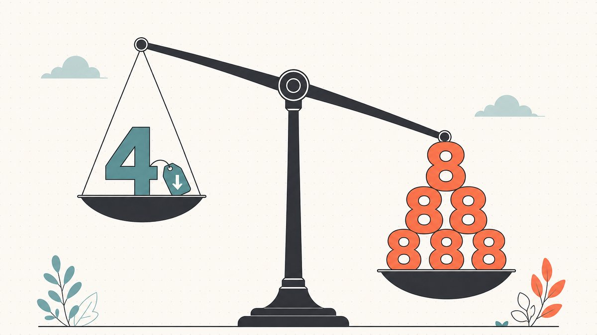

Für einen westlichen Flipper sieht `xqjz.com` aus wie Tastaturgeklimper und `5808.com` wie eine Telefonnummer. Für einen chinesischen Käufer könnte das Erste eine saubere, Pinyin-freundliche Vierbuchstaben-Marke sein und das Zweite eine Zeichenfolge, die gleich zweimal „Wohlstand" trägt. Genau dieser Bruch ist der springende Punkt. Eine Kategorie von Domains, die der eine Markt als wertlos liest, wird vom anderen als Anlageklasse bepreist — und die Flipper, die diesen zweiten Markt zu lesen lernten, erwischten eine der größten Neubewertungen, die der [Aftermarket](/de/glossary/aftermarket/) je gesehen hat.

Dies ist ein Beitrag darüber, warum kurze, vierbuchstabige (LLLL) und numerische Domains so gehandelt werden, wie sie gehandelt werden — und warum die Regeln überwiegend auf Mandarin geschrieben sind. Er ordnet sich unter [Was macht einen Domainnamen wertvoll](/de/blog/what-makes-a-domain-valuable/) in der Serie [Domain-Flipping: Wie man Domains mit Gewinn kauft und verkauft](/de/blog/domain-flipping/) ein und ist das Gegenstück zu [Domain-Hacks erklärt: Wie eine Webadresse über den Punkt hinweg ein Wort buchstabiert](/de/blog/domain-hacks-explained/): In beiden geht es um Wert, der in der *Form* eines Namens steckt statt in seiner Wörterbuchbedeutung.

## Warum kurz und numerisch eine eigene Anlageklasse ist

Der meiste Domainwert orientiert sich an einem Wort. `flowers.com` ist ein Vermögen wert, weil „flowers" ein stark nachgefragtes englisches Substantiv ist. Kurze und numerische Domains brechen dieses Modell. In `5808.com` oder `qkjz.com` steckt kein englisches Wort, und doch können beide liquide, bepreisbare Anlagen sein. Ihr Wert entsteht aus drei Dingen, die das Wörterbuch nicht misst: Knappheit, Universalität und kulturelle Resonanz.

Knappheit ist reine Arithmetik. Es gibt nur 100 mögliche zweistellige numerische `NN.com`-Domains, nur 1.000 `NNN.com` und 10.000 `NNNN.com`. Vierbuchstabige `LLLL.com`-Kombinationen erreichen höchstens 456.976. Das sind feste, vollständig registrierte Mengen — niemand prägt neue zweibuchstabige `.com`s — sodass die Angebotskurve senkrecht verläuft. Steigt die Nachfrage, kann sich allein der Preis bewegen.

Universalität ist die andere Hälfte. Eine Zahlenfolge trägt keine Sprachbarriere in sich. Ein Käufer in Shenzhen, São Paulo oder Stuttgart liest `163.com` auf dieselbe Weise — genau deshalb reist das Format. Das ist die Lesbarkeit, die der umfassendere Erklärtext [Was macht einen Domainnamen wertvoll](/de/blog/what-makes-a-domain-valuable/) als Länge und Einprägsamkeit fasst — kurz und numerisch drehen einfach beide Regler ins Extreme. Der dritte Faktor, die kulturelle Resonanz, ist der Punkt, an dem China die Preistabelle komplett neu schreibt.

## China setzte den Preis

Der moderne Markt für kurze und numerische `.com`s wurde faktisch von der chinesischen Nachfrage neu bepreist. Wie TechCrunch es auf dem Höhepunkt des Booms formulierte: [China has become the largest buyer of domain names](https://techcrunch.com/2015/12/12/china-making-domain-name-history/#:~:text=China%20has%20become%20the%20largest%20buyer%20of%20domain%20names) — und nannte es wahrscheinlich die größte Geschichte im Domain-Investing seit dem Beginn des Internets. Der Fußabdruck zeigt sich in den Registern: Bis Ende 2015 waren [136 of the 676 2-letter .com domain names are now owned by Chinese registrants](https://techcrunch.com/2015/12/12/china-making-domain-name-history/#:~:text=136%20of%20the%20676%202%2Dletter%20.com%20domain%20names%20are%20now%20owned%20by%20Chinese%20registrants), und der Boden unter minderwertigen dreibuchstabigen `.com`s verschob sich kräftig — Namen, die zuvor in der Spanne von 10.000 bis 15.000 US-Dollar verkauft worden waren, erzielten laut demselben Bericht plötzlich [catching upwards of $50,000, and more](https://techcrunch.com/2015/12/12/china-making-domain-name-history/#:~:text=catching%20upwards%20of%20%2450%2C000%2C%20and%20more).

Das „Warum" ist strukturell. Chinesische Unternehmen haben sich seit Langem mit Zahlen und Pinyin statt mit englischen Wörtern gebrandet, weil eine Zahl oder eine kurze lateinische Zeichenfolge für einen Mandarin-Sprecher leichter zu tippen, auszusprechen und zu merken ist als eine englische Wendung. Das meistzitierte Beispiel ist der E-Mail- und Nachrichtenriese des Landes, NetEase. Seine Adresse lautet `163.com`, und laut Wikipedia mussten [Chinese internet users had to dial "163" to access the Internet, before the availability of broadband](https://en.wikipedia.org/wiki/NetEase#:~:text=Chinese%20internet%20users%20had%20to%20dial%20%22163%22%20to%20access%20the%20Internet%2C%20before%20the%20availability%20of%20broadband) — die Einwahlnummer wurde zur Marke. Zahlen waren in diesem Markt heimisch, lange bevor Flipper es bemerkten.

## Die Pinyin-Logik hinter LLLL-„Chips"

Vierbuchstabige `.com`s haben ihre eigene Grammatik, und sie baut auf Pinyin auf. Im Westen wird eine `LLLL.com` danach bewertet, wie aussprechbar sie auf Englisch ist. In China ist das geschätzte Muster das Gegenteil dessen, was ein Englischsprecher erwartet.

Der Branchenbegriff lautet **CHIP** — Chinese Premium — geprägt vom Domainer Tim Schoon. Wie die Maklerfirma GGRG es erklärt, sind in China [ALL letters are considered premium with the exception of A,E,I,O,U,V](https://ggrg.com/llll-com/#:~:text=ALL%20letters%20are%20considered%20premium%20with%20the%20exception%20of%20A%2CE%2CI%2CO%2CU%2CV). Die Vokale werden aus einem präzisen sprachlichen Grund ausgeschlossen, nicht aus Aberglaube: Ein CHIP ist wertvoll, weil jeder Buchstabe für den Anfangsbuchstaben einer Pinyin-Silbe stehen kann (und damit für ein mögliches Firmenakronym), und [every syllable in Mandarin contains at least one vowel](https://ggrg.com/llll-com/#:~:text=every%20syllable%20in%20Mandarin%20contains%20at%20least%20one%20vowel). Eine Zeichenfolge voller Vokale lässt sich weit seltener auf echte Initialen abbilden. Der Buchstabe V fällt aus einem noch einfacheren Grund weg: Er [simply does not exist in pinyin](https://ggrg.com/llll-com/#:~:text=simply%20does%20not%20exist%20in%20pinyin).

So ist `xqjz.com` (lauter Konsonanten, lauter gültige Pinyin-Initialen, keine Vokale, kein V) ein sauberer Chip, während `aeio.com` — der „einfache" Name eines westlichen Käufers — keiner ist. Das ist die mit Abstand kontraintuitivste Sache, die ein neuer Flipper verinnerlichen muss: In diesem Markt sind Vokale ein Abschlag, kein Aufschlag. Die Cleverness hier reimt sich auf [Domain-Hacks erklärt](/de/blog/domain-hacks-explained/), wo der Wert ebenfalls in einem strukturellen Muster steckt statt in einem Wort — und dieselbe Vorsicht gilt: Dass ein Chip ein Chip ist, garantiert nicht, dass er etwas Echtes buchstabiert, also prüfe das Muster, unterstelle keine Bedeutung. Die Grundlagen von [markenfähige vs. Keyword-Domains](/de/blog/brandable-vs-keyword-domains/) gelten obendrein weiterhin: Ein Chip, der zufällig auch als echtes Pinyin-Wort oder bekanntes Akronym lesbar ist, ist mehr wert als ein zufälliger.

## Glückszahl 8, Unglückszahl 4: Numerologie als Preisgröße

Numerische Domains fügen eine Ebene hinzu, die kein westliches Bewertungsmodell kennt: Die Ziffern selbst tragen Bedeutung, weil sie im Mandarin und Kantonesischen wie andere Wörter klingen. Das ist keine Folklore, die ein Flipper ignorieren kann. Es bewegt Preise.

Die Schlagzeilen-Ziffer ist die **8**. Laut Wikipedia [sounds like "發" (pinyin: fā ... lit. 'to prosper')](https://en.wikipedia.org/wiki/Chinese_numerology#:~:text=sounds%20like%20%22%E7%99%BC%22%20%28pinyin%3A%20f%C4%81) die Zahl 8 (八, bā), sodass eine mit 8en gespickte Domain als „Wohlstand, Wohlstand" gelesen wird. Wie ein Erklärtext zusammenfasst, gilt [anything ending in 8 or containing lots of 8s is considered lucky](https://thechinaproject.com/2018/12/31/kuora-lucky-numbers-in-china-and-chinese-urls/#:~:text=anything%20ending%20in%208%20or%20containing%20lots%20of%208s%20is%20considered%20lucky). Auch die **6** ist geschätzt; im Mandarin [sounds like "slick" or "smooth"](https://en.wikipedia.org/wiki/Chinese_numerology#:~:text=sounds%20like%20%22slick%22%20or%20%22smooth%22) die 6 (六, liù) — die Grundlage für den Wunsch, dass alles glattläuft. Und die **9** (九, jiǔ) ist ein Homophon für „langanhaltend", weshalb sie in Namen auftaucht, die Beständigkeit signalisieren sollen.

Die Kehrseite ist die **4**, und sie ist gravierend. Die Zahl 4 (四, sì) ist laut Wikipedia [nearly homophonous to the word "death"](https://en.wikipedia.org/wiki/Chinese_numerology#:~:text=nearly%20homophonous%20to%20the%20word%20%22death%22). Die Vermeidung ist stark genug, um einen klinischen Namen zu tragen: [tetraphobia ... is the practice of avoiding instances of the digit number 4](https://en.wikipedia.org/wiki/Tetraphobia#:~:text=is%20the%20practice%20of%20avoiding%20instances%20of%20the%20digit%20number%204). Dieselben homophongetriebenen Vorlieben, die manche Gebäude das vierte Stockwerk überspringen lassen, machen `8888.com` zum Wunschobjekt und eine mit 4en beladene Zeichenfolge zum schweren Verkaufsfall. Als praktische Faustregel (keine gemessene Statistik): Unter ansonsten identischen numerischen Domains wird mehr 8en und 6en als Aufschlag gelesen, und eine 4 als Mangel. Dieselbe Logik schwappt über Domains hinaus auf Telefonnummern, Kfz-Kennzeichen und Wohnungsadressen in der ganzen Region.

Die Numerologie erklärt auch, warum manche „hässlichen" Zahlen tatsächlich Marken sind. Die Videoplattform `56.com` funktioniert, weil, wie ein Erklärtext anmerkt, [the number 6 is pronounced liu and sounds like the word for "stream," thus the website 56.com is a video sharing website](https://thechinaproject.com/2018/12/31/kuora-lucky-numbers-in-china-and-chinese-urls/#:~:text=The%20number%206%20is%20pronounced). Dieselbe Quelle erläutert die 51 ([sounds like "I want"](https://thechinaproject.com/2018/12/31/kuora-lucky-numbers-in-china-and-chinese-urls/#:~:text=51%2C%20or%20_wuyao_%2C%20sounds%20like%20%22I%20want%22)) hinter der Jobbörse 51job. Eine Zahl ist in diesem Markt nie nur eine Zahl.

## Wie man eine als Flipper tatsächlich bepreist

Diesen Markt zu lesen ist eine erlernbare Fähigkeit, und eine Handvoll Prüfungen trennt eine Anlage von einer Kuriosität:

1. **Zähle die Buchstaben oder Ziffern und prüfe die Menge.** Kürzer ist liquide, länger ist illiquide. Bei `LLLL.com` bestätige das Chip-Muster ohne Vokale und ohne V, bevor du es premium nennst. Bei Numerischen bestimmt die Ziffernlänge die Stufe (`NN.com` ist ein anderes Universum als `NNNN.com`).
2. **Lass die Numerologie durchlaufen.** Zähle die 8en, 6en und 9en als Pluspunkte und jede 4 als Abschlag. Eine Zeichenfolge mit wiederholten 8en und ohne 4 steht an der Spitze des numerischen Stapels; eine 4 irgendwo ist ein sofortiger Abschlag.
3. **Teste es als Pinyin, nicht als Englisch.** Frage, ob die Buchstaben oder Ziffern auf echte Pinyin-Initialen oder ein plausibles Mandarin-Homophon abbilden. `56` im Sinne von „Video" ist mehr wert als ein zufälliges Paar. Ein Chip, der ein echtes Akronym buchstabiert, schlägt einen, der nichts buchstabiert.
4. **Bleib bei der bewährten Endung.** Dieser Markt ist überwältigend ein `.com`-Markt. Der kulturelle Aufschlag ist auf alternativen Endungen am dünnsten, sodass ein numerischer oder Chip-Name auf [`.com`](/de/tld/com/) weit liquider ist als dieselbe Zeichenfolge auf [`.xyz`](/de/tld/xyz/), [`.co`](/de/tld/co/) oder [`.io`](/de/tld/io/) — auch wenn diese ihre eigenen, separaten Aufschläge für andere Käufer tragen. Die Wahl der Endung ist eine eigene Entscheidung, und [Warum sind .io-Domains so teuer?](/de/blog/why-are-io-domains-expensive/) zeigt, wie anders die Logik wird, sobald man `.com` verlässt.
5. **Preise die Volatilität ein.** Der Boom 2015–2016 war eine echte Blase, die teilweise platzte, und die Preise für chinesische Premium-Domains sind seither schwankungsanfälliger als die von einwortigen englischen `.com`s. [Liquidität](/de/glossary/domain-liquidity/) ist real, aber zyklisch. Kalkuliere einen Kauf am Höhepunkt eines Hype-Zyklus nicht so, als wäre er der Boden.

Die Mechanik, den Namen zu bewegen, sobald du ihn bepreist hast, ist dieselbe wie bei jedem hochwertigen Handel: den Käufer recherchieren, ein Format festlegen und sicher abwickeln. Das Verkaufshandwerk ist in [Wie man einen eigenen Domainnamen verkauft: Eine praktische Checkliste](/de/blog/how-to-sell-a-domain-name-you-own/) behandelt, und weil dies liquide, fungibel wirkende Anlagen sind, die oft grenzüberschreitend den Besitzer wechseln, zählt der [Treuhand](/de/glossary/escrow/)-Schritt — siehe [Domain-Treuhand erklärt: So funktionieren sichere Domain-Transaktionen](/de/blog/domain-escrow-explained/). Wenn du einen vierstelligen oder höheren numerischen Namen an einen Käufer übergibst, den du nie getroffen hast, ist der neutrale Mittelmann-Schritt nicht optional.

## Der Namefi-Blickwinkel

Kurze und numerische Domains kommen einem fungiblen Rohstoff so nahe, wie es die Domainwelt zulässt — klein, austauschbar wirkend, häufig grenzüberschreitend gehandelt. Genau diese Liquidität macht auch die Übergabe nervenaufreibend: hohe Umschlaghäufigkeit plus grenzüberschreitende Käufer plus Namen, die oft *tatsächlich* live betriebene Infrastruktur sind, bedeuten, dass die klassische Pattsituation (wer überträgt zuerst) bei fast jedem Deal auftaucht. Es ist dieselbe Reibung wie hinter jedem [Domain-Handel](/de/glossary/domain-trading/), nur mit höherer Frequenz.

Genau diese Lücke soll [Namefi](https://namefi.io) verkleinern: Tokenisierter Besitz macht die Kontrolle über eine echte [ICANN](/de/glossary/icann/)-Domain leichter überprüf- und übertragbar, mit DNS-Kontinuität, sodass der Name über die Übergabe hinweg weiter auflöst. Für einen Markt, der sich so schnell bewegt, bedeutet weniger Abwicklungsreibung, dass mehr deiner Geschäfte tatsächlich zustande kommen.

## Freundlicher Hinweis (bitte lesen!)

> Wir sind keine Anwälte, Buchhalter, Finanzberater oder Ärzte, und **nichts in diesem Artikel ist eine rechtliche, finanzielle, steuerliche, buchhalterische, medizinische oder sonstige Form professioneller Beratung.** Wir schreiben diese Beiträge, um uns selbst weiterzubilden, und als Service für unsere Kundschaft. Die Informationen hier können veraltet, geografisch spezifisch oder schlicht falsch sein. Auch wir machen Fehler.
>
> Für jede wichtige Entscheidung **konsultiere bitte eine echte Fachperson (im Ernst!)**. Oder, wenn das nicht dein Ding ist, frag eine Freundin oder einen Freund, frag Twitter, frag Reddit, frag eine KI oder frag eine Wahrsagerin. Kurz gesagt: **DOYR – Do Your Own Research (mach deine eigene Recherche)**. Lass uns lernen und Spaß haben.

## Quellen und weiterführende Literatur

- TechCrunch — [China Is Making Domain Name History (China als größter Käufer; Besitz zweibuchstabiger .com; Preise für dreibuchstabige)](https://techcrunch.com/2015/12/12/china-making-domain-name-history/#:~:text=China%20has%20become%20the%20largest%20buyer%20of%20domain%20names)
- GGRG — [Investing in LLLL.com (Definition des Chinese Premium „Chip"; keine Vokale, kein V; Pinyin-Logik)](https://ggrg.com/llll-com/#:~:text=ALL%20letters%20are%20considered%20premium%20with%20the%20exception%20of%20A%2CE%2CI%2CO%2CU%2CV)
- Wikipedia — [Chinese numerology (8 = Wohlstand, 4 = Tod, 6 = glatt)](https://en.wikipedia.org/wiki/Chinese_numerology#:~:text=sounds%20like%20%22%E7%99%BC%22%20%28pinyin%3A%20f%C4%81)
- Wikipedia — [Tetraphobia (Vermeidung der Ziffer 4)](https://en.wikipedia.org/wiki/Tetraphobia#:~:text=is%20the%20practice%20of%20avoiding%20instances%20of%20the%20digit%20number%204)
- Wikipedia — [NetEase (163.com aus der Einwahlnummer)](https://en.wikipedia.org/wiki/NetEase#:~:text=Chinese%20internet%20users%20had%20to%20dial%20%22163%22%20to%20access%20the%20Internet%2C%20before%20the%20availability%20of%20broadband)
- The China Project — [Kuora: Lucky numbers in China and Chinese URLs (8en als Glück; Beispiele 51 und 56)](https://thechinaproject.com/2018/12/31/kuora-lucky-numbers-in-china-and-chinese-urls/#:~:text=anything%20ending%20in%208%20or%20containing%20lots%20of%208s%20is%20considered%20lucky)
