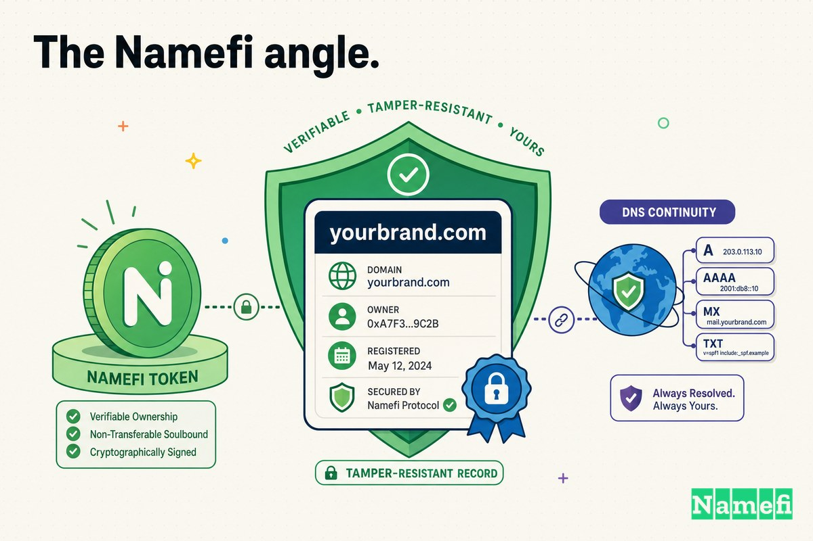

Der Domainname einer Zeitung ist ihre Eingangstür. Wenn Sie `nytimes.com` eingeben, vertrauen Sie einer unsichtbaren Kette — einem Domain-[Registry](/de/glossary/registry/), einem [Registrar](/de/glossary/registrar/), manchmal einem Wiederverkäufer unterhalb dieses Registrars — darauf, dass diese Sie zur echten Redaktion und nirgendwo sonst führt. An einem normalen Tag denken Sie nie an diese Kette. Am 27. August 2013 brach sie, und Millionen von Lesern traten an die Eingangstür der *New York Times* und fanden, dass diese gegen eine andere ausgetauscht worden war.

Der Austauscher war die **Syrische Elektronische Armee** (SEA), ein pro-Assad-Hacker-Kollektiv, das 2013 westliche Medienorganisationen ins Visier nahm. Diesmal verunstalteten sie keinen einzigen Artikel und drangen nicht in ein Content-Management-System ein. Sie gingen eine Ebene tiefer — in die **DNS-Einträge**, die bestimmen, wohin eine Domain zeigt — und besaßen für einige Stunden die Adresse einer der meistgelesenen Nachrichtenseiten der Welt.

## Eine Domain ist die Eingangstür – und das Schloss der Eingangstür liegt nicht in Ihrer Hand

Wenn ein Unternehmen wie die *New York Times* eine Domain registriert, liegt der maßgebliche Eintrag über „wer besitzt diese und wohin zeigt sie" beim Registry (für `.com` ist das Verisign) und wird über einen **Registrar** verwaltet. Große Registrare verkaufen auch über **Wiederverkäufer** — kleinere Firmen, die Domain-Dienste weiterverkaufen und über einen eigenen Login zu den Systemen des Registrars verfügen.

Diese Schichtung ist praktisch. Sie ist aber auch eine Vertrauenskette, bei der das schwächste Glied die [Sicherheit](/de/glossary/collateral/) des gesamten Systems bestimmt. Wenn ein Angreifer sich als *irgendjemanden* in dieser Kette authentifizieren kann — Domaininhaber, Registrar-Mitarbeiter oder Wiederverkäufer — werden die Systeme des Registrars diese Person designgemäß als legitimen Eigentümer behandeln. Der Vorstandsvorsitzende von Melbourne IT selbst brachte das Versagen in einem verheerenden Satz auf den Punkt: [„Sie kamen durch die Eingangstür,"](https://www.theregister.com/2013/08/27/twitter_ny_times_in_domain_hijack/#:~:text=They%20came%20in%20through%20the%20front%20door) sagte er gegenüber der AP. Wenn Sie einen gültigen Benutzernamen und ein Passwort haben, geht das System davon aus, dass Sie der autorisierte Eigentümer sind. Das ist das gesamte Problem in einer Nussschale.

## 27. August 2013: Der Tag, an dem nytimes.com woanders hinzeigte

Spät an einem Dienstagnachmittag konnten Leser die *Times* nicht mehr erreichen. [Die Website der New York Times war „für einige Nutzer nicht mehr erreichbar,"](https://abcnews.com/Technology/york-times-website-suspects-malicious-hack/story?id=20087043#:~:text=gone%20dark%20for%20some%20users) berichtete ABC News, und die Zeitung bestätigte, dass [ihre Seite „Lesern am Dienstagnachmittag nicht zugänglich"](https://abcnews.com/Technology/york-times-website-suspects-malicious-hack/story?id=20087043#:~:text=unavailable%20to%20readers%20on%20Tuesday%20afternoon) gewesen sei, infolge eines Angriffs auf ihren Domain-Registrar. Dies war kein kurzer Ausfall. [Besucher „wurden am Dienstag mehrere Stunden lang mit leeren Browser-Fenstern begrüßt,"](https://www.csmonitor.com/USA/2013/0827/New-York-Times-hacked-Syrian-Electronic-Army-takes-credit#:~:text=greeted%20with%20blank%20browser%20screens%20for%20several%20hours) berichtete der Christian Science Monitor — und erschwerend kam hinzu, dass es [„das zweite Mal in diesem Monat"](https://abcnews.com/Technology/york-times-website-suspects-malicious-hack/story?id=20087043#:~:text=second%20time%20this%20month) war, dass die Seite ausgefallen war.

Was tatsächlich geschehen war, war ein **DNS-Hijack** auf Registrar-Ebene. Die Angreifer griffen in die Einträge ein, die `nytimes.com` in eine [IP-Adresse](/de/glossary/ip-address/) übersetzen, und schrieben sie um. Laut dem Wikipedia-Bericht über den Vorfall hatte [`NYTimes.com` „seine DNS-Einträge umgeleitet auf eine Seite, die die Nachricht 'Hacked by SEA' anzeigte."](https://en.wikipedia.org/wiki/Syrian_Electronic_Army#:~:text=had%20its%20DNS%20redirected%20to%20a%20page%20that%20displayed%20the%20message) Die Eingangstür war über einem anderen Eingang aufgehängt worden.

Die *Times* war nicht das einzige Ziel in diesem Konto. TechCrunch stellte in Echtzeit fest, dass [sowohl „die Nameserver von The New York Times als auch von Twitter scheinbar über den Registrar Melbourne IT registriert worden waren,"](https://techcrunch.com/2013/08/27/syrian-electronic-army-apparently-hacks-dns-records-of-twitter-new-york-times-through-registrar-melboune-it/#:~:text=name%20servers%20appear%20to%20have%20been%20registered%20through%20the%20registrar%20Melbourne%20IT) und dass [die Domain `twimg.com`, „die Twitter-Bilder und Avatare bereitstellt, ebenfalls Änderungen aufweist, die auf Server zeigen, die offenbar der SEA gehören."](https://techcrunch.com/2013/08/27/syrian-electronic-army-apparently-hacks-dns-records-of-twitter-new-york-times-through-registrar-melboune-it/#:~:text=which%20serves%20up%20Twitter%20images%20and%20avatars) Twitters Hauptseite blieb weitgehend unversehrt, aber seine Bild-und-Avatar-Domain wackelte — genug, dass einige Nutzer kurzzeitig defekte Bilder sahen.

## Die Auswirkungen: Stunden der Dunkelheit und eine Weiterleitung, der man nicht vertrauen konnte

Für eine Nachrichtenorganisation wird der Schaden eines Hijacks nicht nur in verlorenen Seitenaufrufen gemessen. Er wird im Vertrauen gemessen. Während des Ausfalls wurde jeder, der `nytimes.com` aufrief, vom Angreifer geroutet. Der eigene Chief Information Officer der *Times*, Mark Frons, teilte den Mitarbeitern mit, dass die Störung [„das Ergebnis eines böswilligen externen Angriffs der Syrischen Elektronischen Armee oder jemanden, der sich sehr bemüht, sie zu sein"](https://www.csmonitor.com/USA/2013/0827/New-York-Times-hacked-Syrian-Electronic-Army-takes-credit#:~:text=was%20the%20result%20of%20a%20malicious%20external%20attack) gewesen sei — und warnte Mitarbeiter, beim Umgang mit E-Mails vorsichtig zu sein, solange die Domain nicht in den Händen der Zeitung sei.

Denken Sie daran, was ein gekaperter DNS-Eintrag tatsächlich ermöglicht. Der Angreifer kontrolliert, wohin der Name aufgelöst wird, was bedeutet, dass er eine Verunstaltungsseite bereitstellen kann (wie in diesem Fall), aber genauso gut eine überzeugende gefälschte Login-Seite anbieten, Zugangsdaten abgreifen oder Datenverkehr abfangen könnte. Eine Verunstaltung ist laut und offensichtlich. Ein *stiller* DNS-Hijack ist weitaus gefährlicher — und dieselbe Schwachstelle ermöglicht beides. Die Domain von Huffington Post UK war in denselben Vorfall verwickelt, was unterstreicht, dass dies ein Kompromittierung eines Registrar-Kontos war und kein einmaliger Streich gegen eine einzelne Redaktion.

## Wie es geschah: Den Wiederverkäufer phishen, nicht die Zeitung

Hier ist der Teil, über den es sich lohnt nachzudenken: Die SEA musste nie in die *New York Times* einbrechen. Sie haben die Server der Zeitung oder ihr CMS nie berührt. Sie griffen die Kette *unterhalb* des Registrars an.

Der Einstiegspunkt war eine **Spear-[Phishing](/de/glossary/phishing/)-E-Mail**, die an einen in den USA ansässigen Wiederverkäufer von Melbourne IT gesendet wurde. Wie The Next Web berichtete, [bestätigte Melbourne IT, dass die SEA „Phishing-Taktiken einsetzte, um an die Login-Daten zu gelangen"](http://thenextweb.com/news/this-is-how-the-syrian-electronic-army-hacked-the-new-york-times-and-twitter#:~:text=used%20phishing%20tactics%20to%20get%20hold%20of%20the%20log) — Mitarbeiter des Wiederverkäufers wurden dazu verleitet, ihre E-Mail-Zugangsdaten preiszugeben, und die Angreifer durchsuchten dann diese Postfächer nach den Registrar-Logins. Von dort aus war es einfach: [Die Zugangsdaten „eines Melbourne-IT-Wiederverkäufers (Benutzername und Passwort) wurden verwendet, um auf ein Wiederverkäuferkonto in Melbourne ITs Systemen zuzugreifen,"](https://techcrunch.com/2013/08/27/syrian-electronic-army-apparently-hacks-dns-records-of-twitter-new-york-times-through-registrar-melboune-it/#:~:text=credentials%20of%20a%20Melbourne%20IT%20reseller) und einmal drinnen [„änderten die Angreifer die DNS-Einträge mehrerer Domainnamen ... einschließlich derer der *Times*."](https://www.itnews.com.au/news/melbourne-it-compromise-redirects-ny-times-huffpo-readers-354935#:~:text=changed%20the%20DNS%20records%20of%20several%20domain%20names)

TechCrunchs Bericht ist ebenso direkt: [Die „DNS-Einträge mehrerer Domainnamen in diesem Wiederverkäuferkonto wurden geändert – einschließlich `nytimes.com`."](https://techcrunch.com/2013/08/27/syrian-electronic-army-apparently-hacks-dns-records-of-twitter-new-york-times-through-registrar-melboune-it/#:~:text=DNS%20records%20of%20several%20domain%20names%20on%20that%20reseller%20account%20were%20changed)

Dies ist die Asymmetrie, die Angriffe auf die Registrar-Kette so attraktiv macht. Die *Times* hätte ihre eigene Infrastruktur bis zum Äußersten absichern können und es hätte nichts genutzt, denn das verwundbare Konto gehörte einem Drittanbieter-Wiederverkäufer, der mehrere Schritte von der Redaktion entfernt war. Ein Spear-Phishing gegen einige Mitarbeiter bei einem kleinen Unternehmen reichte aus, um eine Zeitung umzuleiten, die von Millionen gelesen wird.

## Reaktion und Nachfolge

Sobald Melbourne IT verstanden hatte, was geschehen war, war die Behebung unkompliziert — und sie zeigt, wie umkehrbar diese Angriffe sind, *wenn man den Registrar kontrolliert*. Das Unternehmen stellte die richtigen Einstellungen wieder her: Es [stellte die geänderten DNS-Einträge wieder her und „sperrte" sie gegen weitere Änderungen](https://www.itnews.com.au/news/melbourne-it-compromise-redirects-ny-times-huffpo-readers-354935#:~:text=reverted%20the%20altered%20DNS%20records). Es änderte das Passwort des kompromittierten Wiederverkäuferkontos und untersuchte Protokolle, um den Einbruch zu verfolgen. Die *Times* stellte den Dienst bis früh am Mittwoch wieder her.

Das aufschlussreichste Detail im gesamten Vorfall ist jedoch *warum sich der Schaden in Grenzen hielt*. Einige Domains auf demselben Wiederverkäuferkonto waren überhaupt nicht betroffen — weil ihre Eigentümer einen stärkeren Schutz aktiviert hatten. In Melbourne ITs eigenen Worten: [Für „unternehmenskritische Namen empfehlen wir, dass Domain-Eigentümer die zusätzlichen Registry-Lock-Funktionen nutzen, die von Domain-Name-Registries einschließlich .com angeboten werden – einige der angegriffenen Domainnamen in dem Wiederverkäuferkonto hatten diese Lock-Funktionen aktiviert und waren daher nicht betroffen."](https://www.theregister.com/2013/08/27/twitter_ny_times_in_domain_hijack/#:~:text=For%20mission%20critical%20names%20we%20recommend%20that%20domain%20name%20owners%20take%20advantage%20of%20additional%20registry%20lock)

Ein Registry Lock versetzt die Domain in einen Zustand (in [WHOIS](/de/glossary/whois/) sichtbar als Flags wie `serverUpdateProhibited`), in dem der Registry Änderungen ablehnt, es sei denn, ein strengerer, Out-of-Band-Prozess wird befolgt. Wie Beobachter der Domain-Branche damals feststellten, trugen Twitters Einträge genau diese Art von [Verisign-Lock-Status](https://domainnamewire.com/2013/08/27/melbourneit-the-weak-link-as-twitter-and-ny-times-domain-names-compromised/#:~:text=serverUpdateProhibited). Ein gephishtes Wiederverkäufer-Passwort reicht nicht aus, um einen Registry Lock zu überwinden — und diese eine Konfigurationsentscheidung ist die Grenze zwischen „stundenlang ausgefallen" und „gar nicht betroffen."

## Was dies über Registrar- und Wiederverkäuferketten und Registry Locks lehrt

Der Hijack vom 27. August ist ein nahezu perfekter Lehrfall, weil jedes Glied in der Fehlerkette sichtbar ist.

1. **Ihre Domain ist nur so sicher wie das schwächste Konto, das sie ändern kann.** Das schließt die Mitarbeiter Ihres Registrars und alle Wiederverkäufer darunter ein — keiner davon ist von Ihnen direkt kontrollierbar. Die *Times* hat auf ihren eigenen Servern nichts falsch gemacht; die Kompromittierung war mehrere Schritte entfernt.
2. **Phishing schlägt Firewalls.** Es wurde kein ausgeklügelter Exploit verwendet. Eine gefälschte E-Mail an einige Wiederverkäufer-Mitarbeiter lieferte Zugangsdaten, die die Systeme des Registrars als vollständig autorisiert behandelten. [„Sie kamen durch die Eingangstür."](https://www.theregister.com/2013/08/27/twitter_ny_times_in_domain_hijack/#:~:text=They%20came%20in%20through%20the%20front%20door)
3. **Registry Lock ist die Kontrolle, die tatsächlich wichtig war.** Die Domains mit [zusätzlichen Registry-Lock-Funktionen](https://www.theregister.com/2013/08/27/twitter_ny_times_in_domain_hijack/#:~:text=additional%20registry%20lock%20features) „waren daher nicht betroffen." Für jede unternehmenskritische Domain ist ein Registry Lock (plus Registrar-Lock und 2FA am Registrar-Konto) kein optionaler Schutz — er ist die Grundvoraussetzung.
4. **DNS-Änderungen sind mächtig und schnell.** Eine einzige Umschreibung von [Nameserver](/de/glossary/nameserver/)- oder A-Einträgen leitet eine gesamte [Marke](/de/glossary/trademark/) sofort um. Der Schadenradius eines kompromittierten Kontos umfasst jede Domain, die es berühren kann.
5. **Überwachen Sie Ihre eigenen Einträge.** WHOIS- und DNS-Monitoring hätte die unbefugte Änderung in Minuten signalisiert. Je früher Sie eine unerwartete Nameserver-Änderung bemerken, desto kleiner ist der Ausfall.

## Der Namefi-Aspekt

Der SEA-Hijack war im Kern ein **Autoritäts**-Problem. Das System des Registrars konnte den echten Eigentümer nicht von jemandem unterscheiden, der ein gephishtes Passwort hält, und tat daher, wozu es gebaut wurde, und akzeptierte die Änderung. Jede Verteidigung, die funktionierte — Registry Locks, Out-of-Band-Bestätigung, sorgfältiges Monitoring — ist im Grunde eine Methode, die Messlatte für den *Nachweis* zu erhöhen, dass eine Änderungsanforderung wirklich vom Eigentümer kommt.

[Namefi](https://namefi.io) geht von genau dieser Prämisse aus: Domain-Eigentümerschaft und -Kontrolle sollten **verifizierbar und manipulationsresistent** sein, nicht ein einzelnes wiederverwendbares Passwort, das durch den Posteingang eines Wiederverkäufers schwimmt. Indem Namefi Domain-Eigentümerschaft als ein [On-Chain](/de/glossary/on-chain/), kryptografisch verifizierbares Asset repräsentiert, das mit DNS kompatibel bleibt, macht Namefi aus „wer darf diese Domain ändern" eine Frage mit einer starken, prüfbaren Antwort — anstatt eines impliziten Vertrauens in denjenigen, der sich eingeloggt hat. Kontrollwechsel werden zu expliziten, signierten Aktionen, die an den Eigentümer gebunden sind — eher wie ein Registry Lock, dessen Schlüssel Sie halten, als eine Eingangstür, deren Schloss jeder mit dem richtigen Passwort öffnen kann.

Der Domainname einer Zeitung ist ihre Eingangstür. Die Lehre des 27. August 2013 lautet: Das stärkste Sicherheitsschloss nützt nichts, wenn ein Fremder mehrere Gebäude entfernt dazu verleitet werden kann, eine Kopie des Schlüssels auszuhändigen. Die Lösung ist, Eigentümerschaft selbst nachweisbar zu machen — damit „kamen durch die Eingangstür" aufhört, etwas zu sein, das ein Fremder jemals sagen kann.

## Quellen und weiterführende Literatur

- The Register — [New York Times, Twitter domain hijackers 'came in through front door'](https://www.theregister.com/2013/08/27/twitter_ny_times_in_domain_hijack/)
- TechCrunch — [Syrian Electronic Army Apparently Hacks DNS Records Of Twitter, NYT Through Registrar Melbourne IT](https://techcrunch.com/2013/08/27/syrian-electronic-army-apparently-hacks-dns-records-of-twitter-new-york-times-through-registrar-melboune-it/)
- ABC News — [New York Times Website Hacked, Syrian Electronic Army Appears to Take Credit](https://abcnews.com/Technology/york-times-website-suspects-malicious-hack/story?id=20087043)
- Christian Science Monitor — [New York Times hacked, Syrian Electronic Army takes credit](https://www.csmonitor.com/USA/2013/0827/New-York-Times-hacked-Syrian-Electronic-Army-takes-credit)
- iTnews — [Melbourne IT compromise redirects NY Times, HuffPo readers](https://www.itnews.com.au/news/melbourne-it-compromise-redirects-ny-times-huffpo-readers-354935)
- The Next Web — [Here's How the New York Times and Twitter Got Hacked](http://thenextweb.com/news/this-is-how-the-syrian-electronic-army-hacked-the-new-york-times-and-twitter)
- Domain Name Wire — [Melbourne IT the weak link as Twitter and NY Times domain names compromised](https://domainnamewire.com/2013/08/27/melbourneit-the-weak-link-as-twitter-and-ny-times-domain-names-compromised/)
- Wikipedia — [Syrian Electronic Army](https://en.wikipedia.org/wiki/Syrian_Electronic_Army)
- NBC News — [Syrian group hacks Twitter, New York Times](https://www.nbcnews.com/id/wbna52864470)
- Al Jazeera — [Syria hackers target New York Times website](https://www.aljazeera.com/news/2013/8/28/syria-hackers-target-new-york-times-website)
