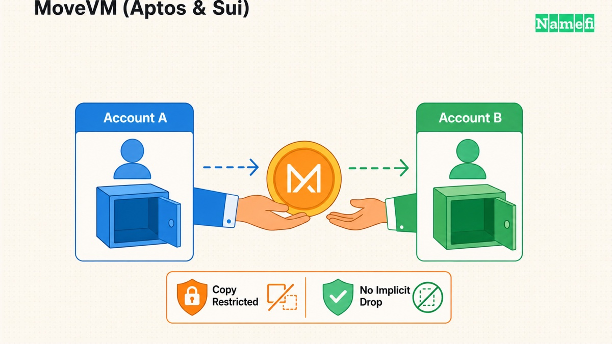

Every [smart contract](/en/glossary/smart-contract/) has to run somewhere. That "somewhere" is a blockchain virtual machine (VM) — the sandboxed program that every node on the network executes identically, so that the same input always produces the same output no matter who runs it. The VM you build on shapes almost everything about a chain: which languages you can write in, whether transactions can run at the same time or only one after another, and how much of the existing developer ecosystem you can plug into on day one.

This guide walks through five VM families that between them power much of the smart contract activity in [Web3](/en/glossary/web3/) today: the [Ethereum Virtual Machine](/en/glossary/ethereum-virtual-machine/) (EVM), Solana's SVM, MoveVM as used by Aptos and Sui, portable-bytecode VMs built on [WebAssembly](/en/glossary/webassembly/) or RISC-V such as CosmWasm and PolkaVM, and Starknet's CairoVM.

---

## What Is a Blockchain Virtual Machine, and Why Does It Matter?

A blockchain VM is a deterministic, sandboxed execution environment: every full node downloads the same transactions, runs them through the same VM, and arrives at the same resulting [on-chain](/en/glossary/on-chain/) state. Ethereum's own documentation describes the EVM as "a decentralized virtual environment that executes code consistently and securely across all Ethereum nodes" ([ethereum.org](https://ethereum.org/en/developers/docs/evm/#:~:text=The%20EVM%20is%20a%20decentralized,mechanics%20of%20how%20they%20work)) — a description that generalizes to every VM in this guide.

Two properties define a VM's design tradeoffs:

- **Language and toolchain.** What can developers write contracts in, and how large is the existing library of audited code, tooling, and hires who already know it?
- **Execution model.** Does the VM process transactions strictly one at a time (sequential), or can independent transactions run at once on multiple CPU cores (parallel execution)? Sequential execution is simpler to reason about; parallel execution raises theoretical throughput but adds scheduling complexity.

These choices ripple outward into gas costs, congestion behavior, and which existing contracts and tools port over without a rewrite — which is why "which VM" is one of the first questions any new chain, or any [tokenized](/en/glossary/tokenize/) asset built on top of one, has to answer.

---

## EVM (Ethereum Virtual Machine)

The EVM was introduced with [Ethereum](/en/glossary/ethereum/) in 2015 and is now one of the most widely deployed smart contract VMs. It is a **stack-based** machine: Ethereum's documentation specifies it operates as "a stack machine with a depth of 1024 items," where each item is a 256-bit word ([ethereum.org](https://ethereum.org/en/developers/docs/evm/#:~:text=The%20EVM%20executes%20as%20a,256%2Dbit%20word)). Contract state lives in a Merkle Patricia trie associated with each account, and the global chain state is likewise organized as a modified Merkle Patricia trie linking all accounts by hash ([ethereum.org](https://ethereum.org/en/developers/docs/evm/#:~:text=Ethereum%20uses%20a%20modified%20Merkle,linked%20by%20hashes)).

**Language.** Contracts are almost always written in **Solidity**, described by Ethereum's own docs as an "object-oriented, high-level language for implementing smart contracts," heavily influenced by C++ syntax ([ethereum.org](https://ethereum.org/en/developers/docs/smart-contracts/languages/#:~:text=Solidity)). **Vyper**, a "Pythonic" language that deliberately trims features to make contracts easier to audit, is the main alternative ([ethereum.org](https://ethereum.org/en/developers/docs/smart-contracts/languages/#:~:text=Vyper)).

**Execution model.** The EVM processes transactions within a block **sequentially** — one after another, in a fixed order — which keeps the state-transition logic simple and easy to audit but caps throughput on the base layer.

**Gas.** Every operation costs [gas](/en/glossary/gas/), Ethereum's unit for "the computational effort required for operations," which prices execution and protects the network from spam or infinite loops ([ethereum.org](https://ethereum.org/en/developers/docs/evm/#:~:text=Since%20each%20transaction%20is%20broadcast,uses%20gas)).

**Distinctive strength and reach.** The EVM's real moat is its ecosystem: it is the most-implemented VM in crypto, and dozens of Layer 2s and independent chains (Arbitrum, Optimism, Base, Polygon, BNB Chain, Avalanche C-Chain) ship **EVM-compatible** or **EVM-equivalent** environments so existing Solidity contracts, wallets, and tooling deploy with little or no change.

---

## SVM (Solana / Sealevel)

Solana's runtime, **Sealevel**, is built around a specific bet: most transactions touch disjoint pieces of state, so they can execute at the same time instead of one at a time. Solana's own announcement describes Sealevel as "Solana's parallel smart contracts runtime" capable of "processing thousands of contracts in parallel, using as many cores as are available to the Validator" ([solana.com](https://solana.com/news/sealevel---parallel-processing-thousands-of-smart-contracts#:~:text=Sealevel%E2%80%94Parallel%20Smart%20Contracts%20Runtime)).

**How parallelism works.** Solana transactions must declare upfront every account they will read or write. That declaration is what makes scheduling possible: the runtime can "sort millions of pending transactions" and "schedule all the non-overlapping transactions in parallel," including letting multiple transactions that only *read* the same account run concurrently ([solana.com](https://solana.com/news/sealevel---parallel-processing-thousands-of-smart-contracts#:~:text=Sort%20millions%20of%20pending%20transactions)). Two transactions serialize against each other when they access the same account and at least one of them writes to it; transactions that only read the same account can still run concurrently.

**Language and VM internals.** Solana programs (its term for smart contracts) are compiled to a variant of Berkeley Packet Filter bytecode — Solana Labs describes it as choosing "a variant of the Berkeley Packet Filter (BPF) bytecode" for the on-chain VM ([solana.com](https://solana.com/news/sealevel---parallel-processing-thousands-of-smart-contracts#:~:text=Berkeley%20Packet%20Filter)). Programs are most commonly written in **Rust**, with C and C++ also supported.

**Distinctive strength.** Because the account-level parallelism is a runtime property rather than something each contract author has to hand-roll, Solana can sustain high throughput without moving execution off-chain, at the cost of a stricter account-declaration model that changes how contracts are written compared to the EVM's free-form storage.

---

## MoveVM (Aptos & Sui)

**Move** is a smart contract language originally built for Meta's Diem project and now the base layer for **Aptos** and **Sui**, each running its own MoveVM variant. Aptos's documentation describes Move as "a safe and secure programming language for Web3 that emphasizes scarcity and access control" ([aptos.dev](https://aptos.dev/en/network/blockchain/move#:~:text=Move%20is%20a%20safe%20and,scarcity%20and%20access%20control)).

**The resource model.** Move's defining idea is treating digital assets as **resources** — special struct types that the language's type system guarantees "cannot be accidentally duplicated or dropped" ([aptos.dev](https://aptos.dev/en/network/blockchain/move#:~:text=Resources%20cannot%20be%20copied%2C%20they,structs%20cannot%20be%20accidentally%20duplicated)). A token or NFT modeled as a Move resource cannot be copied unless its type has the `copy` ability, or implicitly discarded unless it has the `drop` ability; the compiler rejects invalid uses. The module that defines the type can still pack new values and explicitly consume them by unpacking them, and can expose controlled mint or burn functions ([Aptos Move abilities](https://aptos.dev/en/build/smart-contracts/book/abilities), [Move structs and module privileges](https://aptos-labs.github.io/move-book/structs-and-enums.html)). The abilities prevent accidental copy-and-drop errors, but they do not prove the correctness of a contract's broader asset logic or rule out every possible double-spend or burn bug.

**Parallel execution.** Aptos runs Move contracts through **Block-STM**, which the docs describe as enabling "concurrent execution of transactions without any input from the user" — the runtime infers which transactions are independent at execution time rather than requiring the declared account lists Solana uses ([aptos.dev](https://aptos.dev/en/network/blockchain/move#:~:text=Parallelism%20via%20Block,input%20from%20the%20user)).

**Sui's object model.** Sui takes Move's resource idea further with an object-centric storage layer: "An object is a fundamental unit of storage on the network. Every resource, asset, or piece of data on-chain is an object," addressable by a unique ID rather than living inside an account's key-value store ([Sui object model](https://docs.sui.io/develop/sui-architecture/object-model)). Sui's current object model lists five ownership forms: **address-owned**, **immutable**, **consensus-address-owned** (party), **shared**, and **wrapped**. A transaction can take Sui's direct fast path without consensus ordering only when every mutable object input is address-owned and every other object input is immutable. Consensus-address-owned and shared objects are sequenced through consensus even when a transaction only reads them, although non-conflicting read-only accesses can still execute concurrently ([Sui address-owned objects](https://docs.sui.io/develop/objects/object-ownership/address-owned), [party objects](https://docs.sui.io/develop/objects/object-ownership/party), [Lutris paper](https://docs.sui.io/paper/sui-lutris.pdf)). Independent fast-path transactions can therefore be processed concurrently without treating every object as globally shared state.

**Distinctive strength.** Move's resource types prevent generic code from copying a value without `copy` or letting it fall out of scope without `drop`. The defining module can still mint values and explicitly destroy them by unpacking them, so these checks do not by themselves prove asset conservation or eliminate every asset-logic bug. Both Aptos and Sui pair that safety model with parallel execution designed in from the start rather than retrofitted.

---

## Portable-Bytecode VMs (CosmWasm and PolkaVM)

Rather than defining a blockchain-specific bytecode, some chains use portable, general-purpose instruction formats. **CosmWasm** executes WebAssembly, while **PolkaVM** executes RISC-V-derived bytecode; PolkaVM is therefore not a WASM-based VM. The WebAssembly standard describes Wasm as "a binary instruction format for a stack-based virtual machine," designed as "a portable compilation target for programming languages" that "aims to execute at native speed" ([webassembly.org](https://webassembly.org/#:~:text=WebAssembly%20(abbreviated%20Wasm)%20is%20a,wide%20range%20of%20platforms)). Using Wasm as the contract VM means any language with a Wasm compiler target — Rust, C, C++, Go — can, in principle, produce a deployable contract.

**CosmWasm.** The dominant Wasm-based smart contract platform in the Cosmos ecosystem, CosmWasm describes itself as a "secure, performant, interoperable smart contract platform for the multi-chain world" ([cosmwasm.com](https://www.cosmwasm.com/#:~:text=Secure%2C%20performant%2C%20interoperable%20smart%20contract,platform%20for%20the%20multi%2Dchain%20world)). Contracts are written in **Rust** and run on "a highly optimized Web Assembly runtime" ([cosmwasm.com](https://www.cosmwasm.com/#:~:text=highly%20optimized%20Web%20Assembly%20runtime)). CosmWasm is deployed across dozens of Cosmos SDK chains, including Osmosis, Neutron, Injective, Secret Network, and Terra, and inherits Cosmos's native IBC cross-chain messaging.

**PolkaVM.** Polkadot's newer smart-contract VM took a different route: instead of executing raw Wasm, Parity built PolkaVM as, in its own repository description, "a general purpose user-level RISC-V based virtual machine" ([github.com/paritytech/polkavm](https://github.com/paritytech/polkavm#:~:text=PolkaVM%20is%20a%20general%20purpose,level%20RISC%2DV%20based%20virtual%20machine)). The rationale, per the ink! smart-contract documentation, is performance: RISC-V execution "correlates with transaction throughput and transaction costs," giving faster, cheaper execution than the Wasm interpreter ink! previously used ([use.ink](https://use.ink/docs/v6/background/why-riscv-and-polkavm-for-smart-contracts/#:~:text=performance%20correlates%20with%20transaction%20throughput)). Notably, Polkadot's PolkaVM stack (branded "Revive") also ships an EVM interpreter layer, letting Solidity contracts run on the same RISC-V backend.

**Distinctive strength.** Portable-bytecode VMs trade a blockchain-specific bytecode for established general-purpose compilation targets. Rust in particular brings strong memory-safety guarantees to contract code, and both Wasm and RISC-V benefit from tooling built for far larger, non-blockchain use cases. CosmWasm and PolkaVM remain distinct architectures: the former executes Wasm, while the latter executes RISC-V-derived bytecode.

---

## CairoVM (Starknet)

**Cairo** is the smart contract language and VM built specifically for zero-knowledge proof generation, underpinning **Starknet**, an Ethereum [Layer 2](/en/glossary/layer-2/). Starknet's own documentation is explicit about the design goal: "Cairo is a STARK-friendly Von Neumann architecture capable of generating validity proofs for arbitrary computations" ([starknet.io](https://www.starknet.io/cairo-book/ch201-architecture.html#:~:text=Cairo%20is%20a%20STARK,for%20arbitrary%20computations)). Being "STARK-friendly" means the instruction set is "optimized for the STARK proof system, while remaining compatible with other proof system backends" ([starknet.io](https://www.starknet.io/cairo-book/ch201-architecture.html#:~:text=Being%20STARK,other%20proof%20system%20backends)) — the opposite priority from the EVM or SVM, which were designed first for execution and only later had proving systems bolted on for scaling.

**Execution model.** Cairo compiles down to a Turing-complete instruction set (the "Cairo machine") specified as a set of algebraic intermediate representations, so that any Cairo program's execution trace can be turned into a succinct STARK proof verifiable on Ethereum L1 ([starknet.io](https://www.starknet.io/cairo-book/ch201-architecture.html#:~:text=At%20its%20core%2C%20Cairo%20is,arbitrary%20code%29%20through%20the%20Cairo%20machine)). This is what lets Starknet batch thousands of transactions off-chain and post one compact proof of correctness back to Ethereum, rather than replaying every transaction.

**Distinctive strength.** Proof-friendliness was Cairo's starting design constraint: its instruction set and execution trace are designed for efficient STARK proving. Actual proving cost still depends on the program, prover implementation, proof-system parameters, and comparison target, so it is not universally lower than every zkEVM workload. The tradeoff is a newer, smaller language ecosystem and a steeper learning curve than Solidity for developers coming from Ethereum.

---

## Comparison Table

| VM | Contract language(s) | Execution / state model | Parallel execution | Ecosystem size | EVM-compatible |
|---|---|---|---|---|---|
| **EVM** | Solidity, Vyper | Stack machine; account/storage state in a Merkle Patricia trie | No — sequential within a block | Largest; the default target for L2s and app-chains | Native |
| **SVM (Solana)** | Rust, C, C++ | BPF-derived bytecode; account-based state with declared read/write sets | Yes — Sealevel schedules non-overlapping transactions concurrently | Large, fast-growing, mostly Solana-native | No (separate ecosystem) |
| **MoveVM (Aptos/Sui)** | Move | Resource-typed objects; Aptos uses Block-STM, Sui uses multiple ownership forms with direct and consensus-sequenced paths | Yes — inferred at runtime (Aptos) or via object ownership (Sui) | Smaller, growing; two independent Move ecosystems | No |
| **Portable bytecode (CosmWasm, PolkaVM)** | Rust (CosmWasm); Rust/C/RISC-V toolchains (PolkaVM) | Wasm bytecode (CosmWasm) or RISC-V bytecode (PolkaVM) | Chain-dependent; not a universal property of either instruction format | Medium; spread across many Cosmos chains and the Polkadot parachain set | PolkaVM/Revive adds an EVM interpreter layer; CosmWasm is not EVM-compatible |
| **CairoVM (Starknet)** | Cairo | Turing-complete AIR-based machine designed for STARK proving | Not the primary design goal — optimized for provability, not concurrency | Smallest of the five, but growing with Starknet's L2 activity | No (zkEVM projects bridge Solidity contracts in, separately) |

---

## How This Connects to Tokenized Domains

Which VM a chain runs on matters directly for [tokenized domain](/en/glossary/tokenized-domain/) infrastructure. A domain represented as an [NFT](/en/glossary/nft/) is, underneath, a smart contract enforcing who owns a token and what they can do with it — logic that benefits from Move's compile-time restrictions on copying resources and implicitly dropping them, and that the EVM's mature tooling makes easy to audit and integrate with existing wallets and marketplaces. Namefi's tokenization model deliberately targets the EVM ecosystem: EVM-compatibility means a tokenized `.com` or `.ai` domain's ownership NFT works with the existing universe of EVM wallets, marketplaces, and DeFi protocols out of the box, rather than requiring a bespoke integration for every new VM. Explore tokenized domains at [namefi.io](https://namefi.io).

---

## Sources and Further Reading

- [The Ethereum Virtual Machine (EVM) — ethereum.org](https://ethereum.org/en/developers/docs/evm/)
- [Smart Contract Languages — ethereum.org](https://ethereum.org/en/developers/docs/smart-contracts/languages/)
- [Sealevel — Parallel Processing Thousands of Smart Contracts — Solana](https://solana.com/news/sealevel---parallel-processing-thousands-of-smart-contracts)
- [Move — Aptos Documentation](https://aptos.dev/en/network/blockchain/move)
- [Move Abilities — Aptos Documentation](https://aptos.dev/en/build/smart-contracts/book/abilities)
- [Structs and Enums — Move Book](https://aptos-labs.github.io/move-book/structs-and-enums.html)
- [Object Model — Sui Documentation](https://docs.sui.io/develop/sui-architecture/object-model)
- [Address-Owned Objects — Sui Documentation](https://docs.sui.io/develop/objects/object-ownership/address-owned)
- [Party Objects — Sui Documentation](https://docs.sui.io/develop/objects/object-ownership/party)
- [Sui Lutris](https://docs.sui.io/paper/sui-lutris.pdf)
- [CosmWasm](https://www.cosmwasm.com/)
- [PolkaVM — GitHub (paritytech)](https://github.com/paritytech/polkavm)
- [Why RISC-V and PolkaVM for Smart Contracts — ink! docs](https://use.ink/docs/v6/background/why-riscv-and-polkavm-for-smart-contracts/)
- [Cairo Architecture — The Cairo Programming Language / Starknet](https://www.starknet.io/cairo-book/ch201-architecture.html)
- [WebAssembly](https://webassembly.org/)
