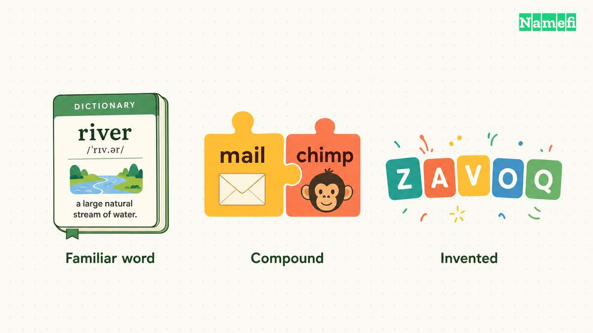
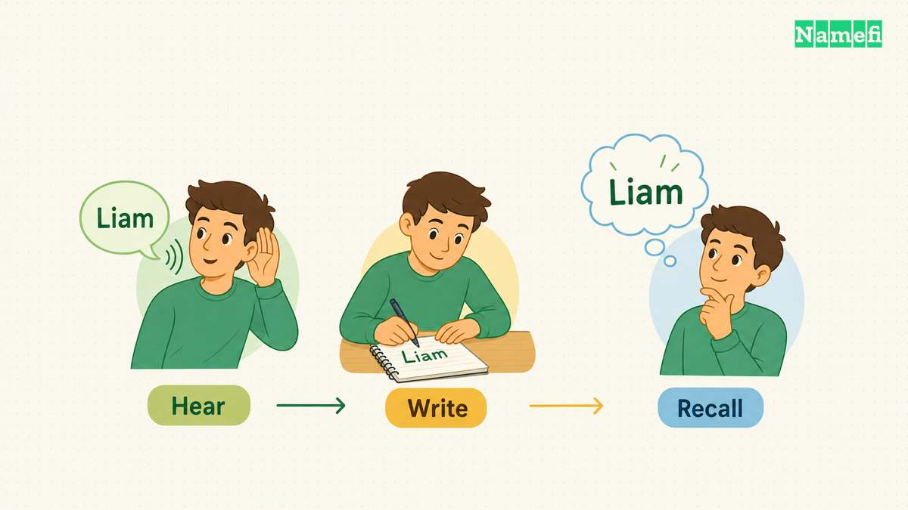
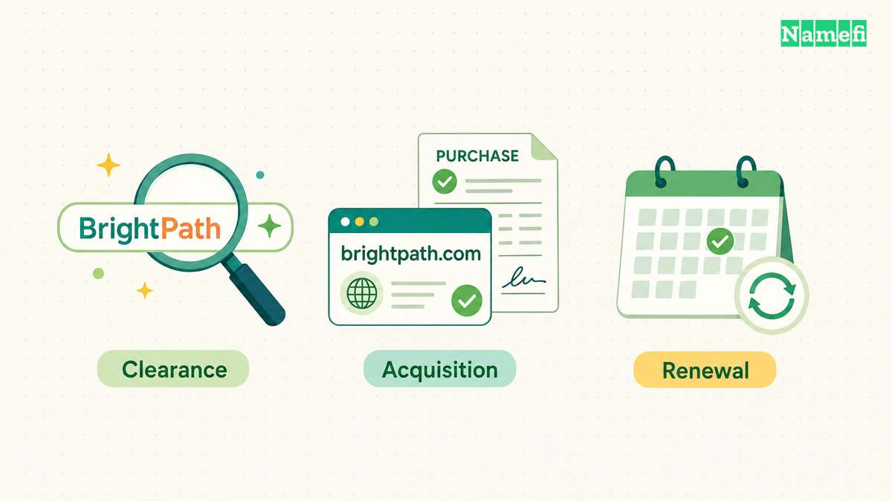

Names shown in illustrations are examples only; the pictures do not indicate domain availability, completed purchases, or trademark clearance.

A name can look convincing in a logo and still be awkward in a customer conversation. Before you buy a brandable domain, try saying it aloud, asking someone to write it down, and placing it in an ordinary sentence about your product.

The goal is to find a name you can use comfortably, with a meaning and identity you are willing to build. The examples below are established names to study, not domains offered for sale or suggestions to imitate. The naming analysis is editorial judgment; it does not establish that a particular name will convert, rank, or sell better.

## What real names can teach you

Consider two different naming patterns.

**Stripe uses an ordinary word outside the product category.** Stripe’s product page describes a payments platform. [See Stripe Payments.](#ref-stripe) The name itself does not explain payment processing. As a naming exercise, that makes it useful: the word can carry a visual association while a separate product description explains the service.

For your shortlist, try the same separation. Put each candidate next to a plain description of what you sell. Does the pair make sense without a paragraph explaining the name? A suggestive name has room for interpretation, but your customer should not have to solve a puzzle to understand the offer.

**Mailchimp combines a category cue with an unexpected word.** Its current marketing platform includes email marketing among other tools. [See Mailchimp’s platform description.](#ref-mailchimp) In the name, “mail” supplies a recognizable association and “chimp” gives you something distinctive to picture. That is a structural observation, not a claim about why the business succeeded.

A compound can give a new business an explanatory starting point. Test whether both parts still feel appropriate for the product you intend to build. An amusing second word might suit your tone, or it might get in the way during a serious sales conversation.

| Pattern to study | Useful question | A possible weakness to test |
| --- | --- | --- |
| Familiar word used as a brand | Can we pair it with a clear product description? | The word may suggest the wrong category |
| Category cue plus distinctive word | Does the combination sound natural aloud? | The cue may feel narrow if the product changes |
| Invented word | Can an unfamiliar listener pronounce and spell it? | The spelling may require repeated explanation |

Do not give an established name a high score merely because you recognize the company. You are testing the structure, not borrowing the reputation.

## Run your shortlist through ordinary conversations

Test with people who resemble the audience you actually expect to reach. If customers will use more than one language, include those languages in the exercise rather than assuming an English reading carries over.

Start by saying the proposed name and extension aloud without showing a logo. Ask the listener to write the address. Record the exact spelling they produce. A correction such as “one word, with an extra letter at the end” belongs in your notes; it is part of the name’s operating cost.

Next, show the name in plain lowercase text. Ask what the reader thinks it says and what kind of business they expect. Watch for unintended word boundaries, abbreviations, or associations. These are observations from your test, not a statistical measure of the market.

Finally, use the name in sentences you will actually need:

> “I work at [name]. We make [plain product description].”
>
> “You can find the instructions at [domain].”
>
> “Please send the invoice to [address].”

Leave time between the introduction and a later recall question. Write down what people remember rather than asking whether the name was “memorable.” The exercise is more useful when it captures behavior instead of polite opinions.

Compare the candidates using a short evidence sheet:

| Check | What to record |
| --- | --- |
| Pronunciation | The readings people tried without help |
| Spelling | The address they wrote after hearing it |
| Meaning | The product or feeling they associated with it |
| Recall | The wording they remembered later |
| Product fit | Whether your description made sense beside the name |
| Expansion | Whether the name still fits your next plausible product |

Avoid collapsing everything into an invented universal score. A spelling problem may be acceptable for a product mostly discovered through links and unacceptable for one acquired through phone calls. Make that tradeoff explicit.

## Check the name beyond domain availability

A domain search answers an acquisition question. It does not settle whether you can use the name as a brand.

In the United States, the USPTO explains that conflicting marks can be similar in sound, appearance, meaning, or commercial impression; the relationship between the goods and services also matters. [Read its likelihood-of-confusion guidance.](#ref-confusion) An exact-spelling search alone is therefore too narrow.

Search relevant variations and related products. The USPTO’s clearance guidance also includes sources beyond its federal database, including internet searches for common-law use. [See the clearance-search guidance.](#ref-clearance) If the purchase is material to your launch, have qualified counsel interpret the results for your intended markets and goods or services.

Then confirm the acquisition facts separately: whether the exact domain can be obtained, its quoted purchase price, recurring renewal cost, transfer conditions, and who will control the registration. Record quotes with their currency and date. This article does not provide availability checks or price estimates for the example names.

Choose a name when you can explain both its appeal and its compromises. A useful decision note might say: “The audience spelled it consistently, it fits the product description, and we accept that the name needs an introductory tagline.” That is a firmer basis for buying than “it feels premium.”

If you are evaluating names for resale rather than for your own company, the relevant questions change. Continue with [brandable versus keyword domains](/en/blog/brandable-vs-keyword-domains/) for that separate perspective.

## Sources and further reading

- Stripe — [Stripe Payments](https://stripe.com/payments), opening product description. Fetched 2026-09-10; redirected to the India regional page. No archive snapshot verified.
- Mailchimp — [Marketing platform](https://mailchimp.com/marketing-platform/), platform features and email-marketing sections. Fetched 2026-09-10. No archive snapshot verified.
- USPTO — [Likelihood of confusion](https://www.uspto.gov/trademarks/search/likelihood-confusion), similarity examples and “Related goods and services.” Fetched 2026-09-10. No archive snapshot verified.
- USPTO — [Comprehensive clearance search for similar trademarks](https://www.uspto.gov/trademarks/search/comprehensive-clearance-search-similar-trademarks), search sources and common-law use. Fetched 2026-09-10. No archive snapshot verified.
