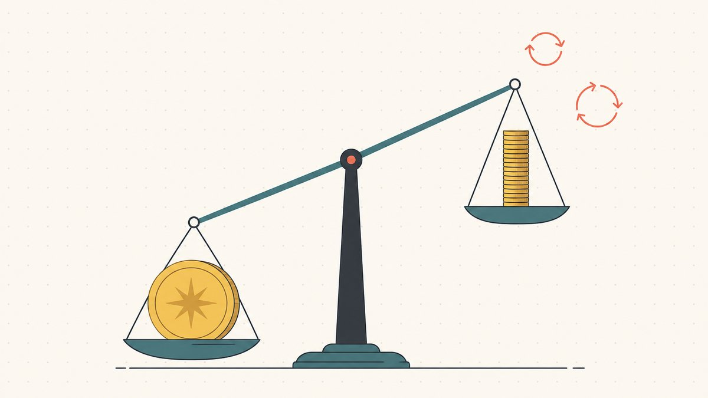
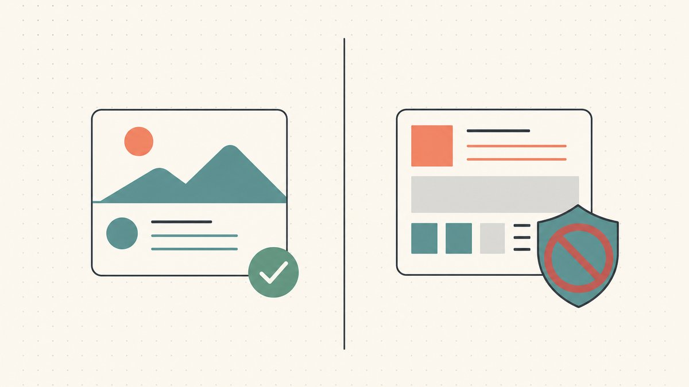

**Domain flipping means acquiring a domain with the intention of reselling it for more than the total cost of the trade.** A profit requires a buyer, a completed sale, and proceeds that exceed acquisition, renewal, marketplace or broker, and transfer costs. A name can remain unsold while those costs continue.

This guide follows the work from sourcing and appraisal through selling and portfolio management. Treat it as a way to evaluate a risky activity, not a promise of income.

## What domain flipping is (and an honest reality check)

Domain flipping is the short-turnaround corner of domain investing. The broader practice has a precise definition: as Wikipedia puts it, [domain name speculation ... is the practice of identifying and registering or acquiring generic Internet domain names as an investment with the intent of selling them later for a profit](https://en.wikipedia.org/wiki/Domain_name_speculation#:~:text=is%20the%20practice%20of%20identifying%20and%20registering%20or%20acquiring%20generic%20Internet%20domain%20names%20as%20an%20investment). Flipping is the fast version of that: [quick turnaround in the resale of domains is often called domain flipping](https://en.wikipedia.org/wiki/Domain_name_speculation#:~:text=Quick%20turnaround%20in%20the%20resale%20of%20domains%20is%20often%20called%20domain%20flipping). You are a middle-person in the [domain aftermarket](/en/glossary/domain-trading/) — buying names you think are underpriced and reselling them to a buyer who values them more.

A large sale can make the activity look easier than it is. MicroStrategy's own announcement records its **USD 30 million cash sale of Voice.com**, completed May 30, 2019. [Read the seller's announcement.](#ref-voice-sale) That is evidence of one transaction, not an expected outcome for a new portfolio.

There is no guaranteed profit or holding period. Record the full cost of each name and the costs of names that never sell. A profitable sale can coexist with an unprofitable portfolio when renewals and acquisition losses elsewhere exceed it.

## Find: sourcing names worth flipping

Everything downstream depends on what you buy, so sourcing is the first real skill. There are several supply channels — hand-registering brand-new names, catching expiring or dropped domains, buying at auction, and acquiring from other holders in the [aftermarket](/en/glossary/aftermarket/) — and each has a completely different risk and price profile. A freshly hand-registered name costs a registration fee but competes against an effectively infinite supply of other unregistered strings; an aged name caught at a drop [auction](/en/glossary/auction/) may carry existing traffic or backlinks but costs more and demands more diligence.

The discipline here is saying no. The fastest way to lose money flipping is to fall in love with names nobody will ever buy. Our deep dive on [how to find domains to flip](/en/blog/how-to-find-domains-to-flip/) walks each channel and the filters that separate a real opportunity from an expensive impulse.

## Appraise: knowing what a name is actually worth

Sourcing tells you what's available; appraisal tells you what it's worth, and the two together define your margin. Domain valuation is genuinely hard because domains are not commodities — there is no ticker price for "a five-letter `.com`," and the same name can be worthless to one buyer and strategically essential to another.

A defensible number comes from [comparable sales](/en/glossary/comparable-sales/), the strength and [liquidity](/en/glossary/domain-liquidity/) of the extension, the directness of the buyer use case, and any existing value like traffic or age — not from an automated appraisal tool you treat as gospel. Misjudge this and you overpay on the way in or underprice on the way out, and either error eats the whole trade. Our guide to [how to value a domain name](/en/blog/how-to-value-a-domain-name/) breaks down the inputs and the common traps.

## Name: understanding what makes a domain valuable

Underneath appraisal sits a more fundamental question: why is one string of letters worth thousands and a near-identical one worth nothing? This is the literacy that makes everything else possible. The fundamentals are knowable — length, memorability, whether the name reads as a real word, how easily it's spelled and said aloud, the keyword demand behind it, and the credibility of its extension. Our explainer on [what makes a domain valuable](/en/blog/what-makes-a-domain-valuable/) lays out those drivers.

One whole sub-craft lives here: the [domain hack](/en/blog/domain-hacks-explained/), where the extension itself becomes the last syllable of a word — `del.icio.us`, `youtu.be`, `bit.ly`. These clever [short domain](/en/glossary/short-domain/) names are prized by brands and flippers alike, but they carry their own country-code risks — the long-running question over the [`.io` extension](/en/tld/io/) is a live example — which is exactly why understanding the *name* as an asset class is its own skill. And for the upside case — a great name carrying a company through a rebrand — the move [from teslamotors.com to tesla.com](/en/blog/from-teslamotors-com-to-tesla-com/) shows what a clean, short domain is worth to a buyer who has outgrown their old one.

## Protect: staying on the right side of the law

Not every name that *looks* flippable is safe to flip. The single most important boundary in this business is the line between legitimate domaining and [cybersquatting](/en/glossary/cybersquatting/). Buying dictionary words, common phrases, acronyms, or memorable terms for resale can be bona fide and is not automatically illegitimate under the UDRP—but the label "dictionary" or "brandable" is not a safe harbor. Panels examine whether the registration and use target or trade off a third party's [trademark](/en/glossary/trademark/), along with the broader facts and circumstances. ([WIPO Overview 3.1, sections 2.1 and 2.10](https://www.wipo.int/en/web/amc/domain-name-disputes/search/overview/index))

This is governed by real policy with teeth, and it is worth internalizing before you spend a dollar. We cover the framework — and how to keep your portfolio clean — in [domain flipping and the law](/en/blog/domain-flipping-and-the-law/). It's the section that protects everything else you build.

## Sell: turning a name into a check

A name you can't sell is a name you don't really own — you're just renting it from a [registrar](/en/glossary/registrar/). Selling is its own discipline, distinct from valuing: you have to choose between inbound (make the name discoverable and wait) and outbound (research likely buyers and reach out), set the right price format, write outreach that doesn't read as spam, and close the deal without getting scammed.

Most of the actual money in flipping is made or lost in this stage, because a mediocre name sold well beats a great name nobody can find. Our dedicated playbook is [how to sell domains for profit](/en/blog/how-to-sell-domains-for-profit/), and for a hands-on, step-by-step checklist of a single sale, see [how to sell a domain name you own](/en/blog/how-to-sell-a-domain-name-you-own/). When a deal does close, the handoff usually runs through a neutral [escrow](/en/glossary/escrow/) workflow so neither side has to move first — we explain that mechanism in [domain escrow explained](/en/blog/domain-escrow-explained/).

## Manage: running the portfolio as a business

Once you hold more than a handful of names, flipping stops being a series of one-off trades and becomes inventory management. The core decisions are unglamorous and relentless: which names to renew, which to drop, how to track cost basis and holding period, and how to keep [DNS](/en/glossary/dns/) and renewals from quietly breaking on a name a buyer is about to inspect. Portfolio discipline is what keeps the renewal drag (more on that next) from eating your winners. Our guide to [domain portfolio management](/en/blog/domain-portfolio-management/) covers the systems that keep a growing book of names from turning into a money pit.

## Market: getting the right name in front of the right buyer

A great name with no audience is just a renewal bill. Marketing is how you shorten the time from acquisition to sale — landing pages that signal the name is for sale, listings on the right marketplaces, and targeted outreach to the narrow set of buyers for whom the name solves a real problem. The skill is precision, not volume: blasting a keyword-matched mailing list is how outreach becomes spam, while one well-researched message to a buyer with an obvious need can close a deal. See [marketing your domains for sale](/en/blog/marketing-your-domains-for-sale/) for the channels and the etiquette.

## A realistic look at the economics

Domain flipping has a recurring carrying cost. Before buying, write down the acquisition quote, renewal quote, selling fees, and any transfer or recovery charges. Our [domain cost guide](/en/blog/how-much-is-a-domain-understanding-holding-cost/) separates those operations and includes dated registrar examples.

**Net result = sale proceeds minus acquisition, renewals, selling fees, and other transaction costs.** Keep the currency consistent and include unsold inventory when assessing the whole portfolio.

Track your own annual **[sell-through rate](/en/glossary/sell-through-rate/)** rather than assuming an industry average applies to your names. Test a scenario with no sales during the holding period: can you afford the renewals, and when would you drop a name? A listing price or automated appraisal does not cover a bill. Actual sales and [holding costs](/en/glossary/holding-cost/) belong in the decision.

## Is it legal and ethical?

Domain investing can be lawful, but there is no name-category checklist that guarantees a registration is safe. Buying and selling descriptive, dictionary, acronym, or invented names is a long-established business; the [domain terminology guide](/en/blog/domain-terminology-guide/) is a good primer on the vocabulary if any of this is new. Risk turns on the actual name, trademark rights, timing, intent, use, jurisdiction, and applicable dispute policy. The UDRP addresses abusive registrations in covered domain spaces; national trademark and anti-cybersquatting laws, contracts, and ccTLD policies can create additional or different exposure.

That boundary is enforceable. Under [ICANN](/en/glossary/icann/)'s [Uniform Domain-Name Dispute-Resolution Policy](/en/glossary/udrp/), a complainant seeking transfer or cancellation must prove all three elements: the domain is identical or confusingly similar to a mark in which the complainant has rights; the [registrant](/en/glossary/registrant/) lacks rights or legitimate interests in the domain; and the domain was registered and is being used in [bad faith](/en/glossary/bad-faith/). ([ICANN UDRP, paragraph 4(a)](https://www.icann.org/resources/pages/policy-2012-02-25-en)) A dictionary meaning alone does not automatically establish a legitimate interest, while resale activity is not automatically unlawful when the evidence shows the registrant did not target a trademark. The practical takeaway is to research relevant marks and actual use—not to rely on "generic" or "brandable" labels—and to get qualified legal advice when the risk matters. We unpack the framework in [domain flipping and the law](/en/blog/domain-flipping-and-the-law/).

## The Namefi angle

The skill stack above is mostly about deciding *what* to buy and sell. The other half of every flip is the mechanics of actually moving the name — and that's where high-value trades get nervous. The classic standoff is simple: the seller doesn't want to transfer before getting paid, and the buyer doesn't want to pay before receiving the domain. That friction is the whole reason escrow exists, and it gets sharper the more a name is worth.

This is the gap [Namefi](https://namefi.io) is built to narrow. Tokenized ownership makes control of a real ICANN domain easier to verify and transfer, while the underlying registrar and DNS configuration still require separate checks during handover. For a flipper, less settlement friction means more trades that actually close, on names whose ownership is auditable rather than taken on trust.

## Friendly Disclaimer (Read Me!)

> We're not lawyers, accountants, financial advisors, or doctors, and **nothing in this article is legal, financial, tax, accounting, medical, or any other flavor of professional advice.** We write these posts to educate ourselves and as a convenience for our customers. Info here may be out of date, geography-specific, or just plain wrong. We make mistakes too.
>
> For any important decision, **please consult a real professional (seriously!)**. Or if that's not your vibe, ask a friend, ask Twitter, ask Reddit, ask an AI, or ask a psychic. In short: **DOYR - Do Your Own Research**. Let's learn and have fun.

## Sources and further reading

- Wikipedia — [Domain name speculation (definition of domaining and domain flipping)](https://en.wikipedia.org/wiki/Domain_name_speculation#:~:text=is%20the%20practice%20of%20identifying%20and%20registering%20or%20acquiring%20generic%20Internet%20domain%20names%20as%20an%20investment)
- MicroStrategy — [Voice.com sale announcement, SEC Exhibit 99.1](https://www.sec.gov/Archives/edgar/data/1050446/000119312519175320/d724928dex991.htm#:~:text=consummated%20on%20May), transaction amount and completion date. Fetched 2026-09-15.
- ICANN — [Uniform Domain-Name Dispute-Resolution Policy (the three elements of a UDRP claim)](https://www.icann.org/resources/pages/policy-2012-02-25-en)
- WIPO — [Overview of WIPO Panel Views on Selected UDRP Questions, Third Edition, version 3.1](https://www.wipo.int/en/web/amc/domain-name-disputes/search/overview/index)
