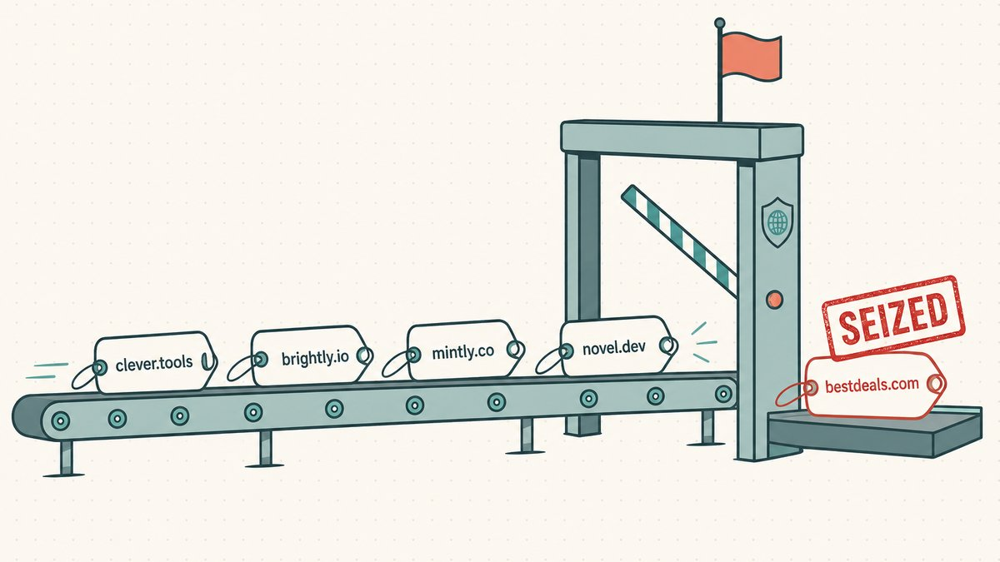
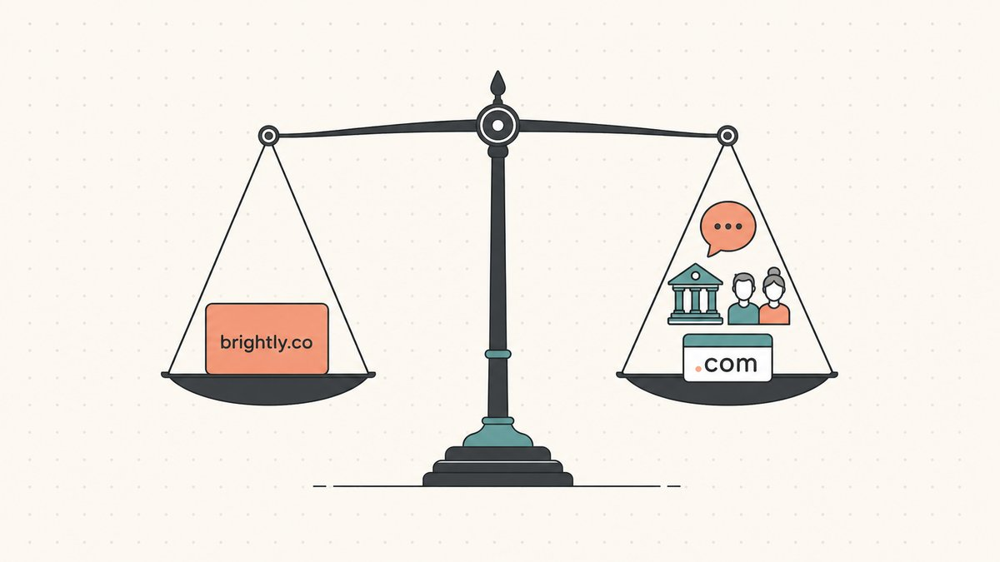

There is a kind of web address you don't read so much as *decode*. You see the letters, you see the dots, and then the whole string snaps into a single word that runs straight across the punctuation. The most famous one ever made was `del.icio.us`. Read it slowly and it falls apart into pieces; read it at speed and it just says "delicious."

That trick has a name. It's called a **domain hack**, and it's one of the oldest pieces of cleverness on the internet. This guide explains what a domain hack actually is, why brands and domain investors keep paying for them, the very real risks hiding behind the cleverest ones, and how to size up a domain hack as a flipper before you wire money for it.

## What a domain hack is

A domain hack is a domain name where the extension itself becomes part of the word. Instead of the address *pointing at* a word, the address *is* the word, spelled across the dot. Wikipedia defines it precisely: [a domain hack is a domain name that suggests a word, phrase, or name when concatenating two or more adjacent levels of that domain](https://en.wikipedia.org/wiki/Domain_hack#:~:text=A%20domain%20hack%20is%20a%20domain%20name%20that%20suggests%20a%20word).

The mechanism is the [top-level domain](/en/glossary/tld/) — the part after the final dot. Most famous domain hacks borrow a **country code top-level domain** (a ccTLD), the two-letter extension a country gets in the global DNS, and use it as if it were the last syllable of an English word. `del.icio.us` did exactly this: it took `.us` (the United States ccTLD), registered `icio.us`, stacked `del` in front as a subdomain, and the whole thing read as "delicious." We pulled that one apart in [the del.icio.us case study](/en/blog/from-del-icio-us-to-delicious-com/), and it remains the textbook example.

It works because ccTLDs were never designed to be word endings — that's an accident of which two letters each country happened to get. (If you've never thought about where these extensions come from, our explainer on [what a TLD is](/en/blog/what-is-a-tld/) covers the ground.) A domain hack is what happens when someone notices that a country's two-letter code also spells a useful suffix and decides to build a brand on the coincidence.

## How it works: ccTLDs that double as English suffixes

A handful of ccTLDs are gold for this because their two letters are common word endings or words in their own right. The catch — and we'll come back to it hard later — is that every one of these belongs to a real country with real rules. Here are the workhorses, with the famous addresses built on each:

- **`.ly` (Libya).** This is the engine behind the link-shortener era. `.ly` reads as the English adverb ending "-ly," and as Wikipedia notes, [many popular URL shortening services are registered in the .ly domain, such as bit.ly](https://en.wikipedia.org/wiki/.ly#:~:text=Many%20popular%20URL%20shortening%20services). Bitly is the giant here; per Wikipedia, [Bitly is a URL shortening service and a link management platform](https://en.wikipedia.org/wiki/Bitly#:~:text=Bitly%20is%20a%20URL%20shortening%20service), and it took off when [it became the default URL shortening service on the website on May 6, 2009](https://en.wikipedia.org/wiki/Bitly#:~:text=default%20URL%20shortening%20service%20on%20the%20website%20on%20May%206%2C%202009) for Twitter.
- **`.be` (Belgium).** YouTube's short links live here. As Wikipedia puts it, [YouTube uses the domain hack youtu.be for their URL shortening service](https://en.wikipedia.org/wiki/.be#:~:text=YouTube%20uses%20the%20domain%20hack).
- **`.gl` (Greenland).** Google's old shortener, `goo.gl`, was built on Greenland's code. Wikipedia records that [in December 2009, Google released a URL shortener service using the domain hack goo.gl](https://en.wikipedia.org/wiki/.gl#:~:text=Google%20released%20a%20URL%20shortener%20service%20using%20the%20domain%20hack), and that [the service was shut down on 30 March 2019](https://en.wikipedia.org/wiki/.gl#:~:text=The%20service%20was%20shut%20down%20on%2030%20March%202019). (That shutdown is its own cautionary tale, and we'll get to why a retired link domain is more than a footnote.)
- **`.co` (Colombia).** Twitter wraps every outbound link in `t.co`. Per Wikipedia, [t.co is a URL shortening service created by Twitter](https://en.wikipedia.org/wiki/T.co#:~:text=t.co%20is%20a%20URL%20shortening%20service%20created%20by%20Twitter), running on [the Internet country code top-level domain (ccTLD) assigned to Colombia](https://en.wikipedia.org/wiki/.co#:~:text=is%20the%20Internet%20country%20code%20top%2Dlevel%20domain%20%28ccTLD%29%20assigned%20to%20Colombia). `.co` is the rare ccTLD that reads as a generic word fragment ("co" for company, or just a shorter `.com`), which is part of why it sells so widely.
- **`.am` (Armenia).** This is the one behind Instagram's old short name. Wikipedia confirms `.am` is [the ccTLD for Armenia](https://en.wikipedia.org/wiki/.am#:~:text=is%20the%20internet%20country%20code%20top%2Dlevel%20domain%20%28ccTLD%29%20for%20Armenia) and that [the mobile photo sharing service Instagram uses the Armenian domain name Instagr.am](https://en.wikipedia.org/wiki/.am#:~:text=the%20mobile%20photo%20sharing%20service%20Instagram%20uses%20the%20Armenian%20domain%20name). We told that full story in [the instagr.am case study](/en/blog/from-instagr-am-to-instagram-com/).
- **`.me` (Montenegro).** The personal-namespace extension. Wikipedia notes that [most .me domain names were purchased as domain hacks in English](https://en.wikipedia.org/wiki/.me#:~:text=Most%20.me%20domain%20names%20were%20purchased%20as%20domain%20hacks), because "me" reads as the English pronoun.
- **`.gg` (Guernsey).** The gaming favorite. Per Wikipedia, [multiple video games, streamers and esports websites use Guernsey's domain (.gg) because "gg" is a common initialism](https://en.wikipedia.org/wiki/.gg#:~:text=Multiple%20video%20games%2C%20streamers%20and%20esports%20websites%20use%20Guernsey%27s%20domain) for "good game."
- **`.sh` (Saint Helena).** A developer in-joke, because `.sh` is also the file extension for Unix shell scripts. Wikipedia observes that [since the .sh filename extension is also used by Unix shell scripts, this domain has been used for websites about command-line interface programs](https://en.wikipedia.org/wiki/.sh#:~:text=Since%20the%20.sh%20filename%20extension%20is%20also%20used%20by%20Unix%20shell%20scripts) — think `brew.sh`, Homebrew's home.
- **`.tv` (Tuvalu) and `.fm` (Federated States of Micronesia).** The media pair. `.tv` is, in Wikipedia's words, [popular, and thus economically valuable, because TV also happens to be an abbreviation of the word television](https://en.wikipedia.org/wiki/.tv#:~:text=because%20TV%20also%20happens%20to%20be%20an%20abbreviation%20of%20the%20word%20television), and `.fm` does the same job for radio and audio brands.

And then there's the most successful "accidental suffix" of all: `.io`, the ccTLD for the British Indian Ocean Territory, which developers read as I/O. It's not strictly a word-spelling hack the way `del.icio.us` is, but it's the same coincidence at work — a country code that happens to mean something to the people typing it. We dig into why that extension commands such a premium in [why .io domains are expensive](/en/blog/why-are-io-domains-expensive/) and on the [.io TLD page](/en/tld/io/).

## Why brands and flippers value them

Strip away the cleverness and a domain hack is competing on the same thing every great domain competes on: it's short, it's memorable, and it carries meaning in fewer characters than anyone else can. A good hack is a whole word in three or four syllables of address, with nothing wasted.

For the kind of product that lives inside other people's text — a link shortener, a share button, an invite link — that brevity is the entire product. Every character in a shortened URL is a character the user didn't have to read, and the dot-as-suffix trick buys you a word's worth of meaning for the price of two letters. That's why an entire generation of infrastructure tools — Bitly, YouTube's `youtu.be`, Discord's invite links on `.gg` — chose hacks rather than long `.com`s. The hack *was* the feature.

For everyone else, the appeal is brandability. A name that reads as a real word but resolves to an unusual extension is distinctive almost by definition, and distinctiveness is exactly what a crowded category lacks. That's also what makes hacks a live market in [domain trading](/en/glossary/domain-trading/): the supply of clean, short, word-spelling combinations on a good ccTLD is genuinely finite, and demand from founders who want a name that doesn't sound like everyone else's is not. A strong hack on a popular extension is the kind of asset domainers track, the same way they track one-word `.com`s — and many of the same fundamentals from [what makes a domain valuable](/en/blog/what-makes-a-domain-valuable/) apply directly.

## The catch: a ccTLD is somebody else's country

Here is the part most "10 clever domain hacks" listicles skip, and it's the part that separates a hobbyist from someone who can actually value one of these. **When you register a domain hack, you are renting two letters of sovereign territory, and that territory makes the rules.** A `.com` is governed by a stable, globally neutral framework. A ccTLD is governed by a country, and countries change, restrict, and occasionally seize.

The starkest example is `.ly`. It's the ccTLD for Libya, and Libyan law applies to what sits on it. In 2010 that stopped being theoretical. As Wikipedia records, [in October 2010, the domain of "sex-positive" URL shortening service vb.ly ... was seized by the Libyan web authorities for not being compliant with the law of Libya](https://en.wikipedia.org/wiki/.ly#:~:text=the%20domain%20of%20%22sex%2Dpositive%22%20URL%20shortening%20service%20vb.ly), with the registry's explanation reported as blunt: [pornography and adult material aren't allowed under Libyan Law ... Therefore, we removed the domain](https://en.wikipedia.org/wiki/.ly#:~:text=Pornography%20and%20adult%20material%20aren%27t%20allowed%20under%20Libyan%20Law). The domain didn't expire and it wasn't sold. It was taken, because of what it pointed to, under rules that had nothing to do with the open internet and everything to do with one country's content law.

The second flavor of risk is the one a `.com` truly cannot carry: the country code itself can come into question. That's the open issue hanging over `.io`. Its existence depends on the British Indian Ocean Territory existing as a distinct entity, and that's exactly what's changing. The UK and Mauritius have agreed to transfer sovereignty of the Chagos Archipelago — per Wikipedia, [on 22 May 2025, the agreement was signed by the UK and Mauritius](https://en.wikipedia.org/wiki/Chagos_Archipelago_sovereignty_dispute#:~:text=the%20agreement%20was%20signed%20by%20the%20UK%20and%20Mauritius). Wikipedia spells out the domain-level consequence: [after the transfer, current IANA rules may require the .io domain to be phased out, which would take at least 5 years](https://en.wikipedia.org/wiki/.io#:~:text=current%20IANA%20rules%20may%20require%20the%20.io%20domain%20to%20be%20phased%20out). Nothing has shut down, and the timelines are long and uncertain — we lay out the measured version in [why .io domains are expensive](/en/blog/why-are-io-domains-expensive/) — but it's a category of risk that simply doesn't exist for a `.com`.

There's a third, quieter risk, and `goo.gl` is the monument to it: a registry or operator can simply decide to walk away. Google retired the `goo.gl` service in 2019, and the long tail of links built on it has been decaying ever since. A hack is only as durable as the institution running both the extension and the service on top of it. The lesson for a flipper isn't "never touch a ccTLD." It's "price the country in." Some registries are stable and liberal about third-party registration; others reserve the right to refuse or revoke based on local rules. How a given extension behaves is a fundamental, not a footnote — which is the whole point of understanding [how the TLD affects domain value](/en/blog/how-tld-affects-domain-value/).

## How to spot and value a domain hack as a flipper

If you're buying or holding hacks rather than just admiring them, a few practical heuristics separate the assets from the curiosities:

1. **Does it spell a real word the market wants?** The value is in the word, not the cleverness of the construction. `stud.io`, `rad.io`, and `delicious` are words people already search for and pay for. A hack that spells an obscure word, or that needs a subdomain and three dots to land, is a puzzle, not a brand.
2. **Can someone say it out loud and land on it?** The fatal flaw of `del.icio.us` was never how it looked — it was that you couldn't tell someone the name without spelling out every dot. A hack that reads as one clean word when spoken (the extension disappears into the word) is worth far more than one that requires punctuation instructions. If recommending it needs a spelling lesson, discount it hard.
3. **What's the registry's policy and stability?** Before you value a `.ly`, `.io`, or any ccTLD hack, learn whether the registry welcomes third-party registration, what content rules apply, and how politically stable the territory is. This is the diligence the vb.ly registrant didn't get to do. A beautiful hack on a volatile or restrictive ccTLD carries a discount a `.com` never would.
4. **Is the extension already a proven hack market?** `.io`, `.co`, `.me`, `.gg`, and `.ly` have established demand, liquidity, and a track record of brands paying for them. A novelty ccTLD with no buyers is a domain you'll hold forever. Liquidity is part of the price.
5. **Is there a clean exact-match `.com` fallback for the same word?** Often the most valuable position is owning *both* the hack and the matching `.com`. The hack wins the clever, in-product use; the `.com` wins the say-it-out-loud, mass-market use. A buyer who needs both will pay for the pair.

The short version: value the word, test it spoken, price in the country, and check that real buyers exist for that extension. A domain hack is a great asset when all four line up and a clever trap when they don't.

## The Namefi angle

When a premium hack does change hands, the hard part isn't agreeing on a price — it's the transfer. Moving a valuable name means proving who holds it, handing it over without the site going dark, and trusting that the other side actually delivers. That's the same friction behind any high-value [domain trade](/en/glossary/domain-trading/), and it's worse for a hack, where the name often *is* live infrastructure inside someone's product.

This is the gap [Namefi](https://namefi.io) is built to close: tokenized ownership makes control of a real ICANN domain easier to verify and transfer, with DNS continuity so the name keeps resolving through the handover. Clever is fun. A clean, auditable transfer of the asset underneath the cleverness is what lets you actually trade on it.

## Sources and further reading

- Wikipedia — [Domain hack](https://en.wikipedia.org/wiki/Domain_hack#:~:text=A%20domain%20hack%20is%20a%20domain%20name%20that%20suggests%20a%20word)
- Wikipedia — [.ly (Libya, and the vb.ly seizure)](https://en.wikipedia.org/wiki/.ly#:~:text=the%20domain%20of%20%22sex%2Dpositive%22%20URL%20shortening%20service%20vb.ly)
- Wikipedia — [Bitly](https://en.wikipedia.org/wiki/Bitly#:~:text=Bitly%20is%20a%20URL%20shortening%20service)
- Wikipedia — [.be (Belgium / youtu.be)](https://en.wikipedia.org/wiki/.be#:~:text=YouTube%20uses%20the%20domain%20hack)
- Wikipedia — [.gl (Greenland / goo.gl)](https://en.wikipedia.org/wiki/.gl#:~:text=Google%20released%20a%20URL%20shortener%20service%20using%20the%20domain%20hack)
- Wikipedia — [T.co (Twitter)](https://en.wikipedia.org/wiki/T.co#:~:text=t.co%20is%20a%20URL%20shortening%20service%20created%20by%20Twitter) · [.co (Colombia)](https://en.wikipedia.org/wiki/.co#:~:text=is%20the%20Internet%20country%20code%20top%2Dlevel%20domain%20%28ccTLD%29%20assigned%20to%20Colombia)
- Wikipedia — [.am (Armenia / instagr.am)](https://en.wikipedia.org/wiki/.am#:~:text=the%20mobile%20photo%20sharing%20service%20Instagram%20uses%20the%20Armenian%20domain%20name)
- Wikipedia — [.me (Montenegro)](https://en.wikipedia.org/wiki/.me#:~:text=Most%20.me%20domain%20names%20were%20purchased%20as%20domain%20hacks)
- Wikipedia — [.gg (Guernsey)](https://en.wikipedia.org/wiki/.gg#:~:text=Multiple%20video%20games%2C%20streamers%20and%20esports%20websites%20use%20Guernsey%27s%20domain)
- Wikipedia — [.sh (Saint Helena)](https://en.wikipedia.org/wiki/.sh#:~:text=Since%20the%20.sh%20filename%20extension%20is%20also%20used%20by%20Unix%20shell%20scripts)
- Wikipedia — [.tv (Tuvalu)](https://en.wikipedia.org/wiki/.tv#:~:text=because%20TV%20also%20happens%20to%20be%20an%20abbreviation%20of%20the%20word%20television)
- Wikipedia — [.io (British Indian Ocean Territory / IANA phase-out)](https://en.wikipedia.org/wiki/.io#:~:text=current%20IANA%20rules%20may%20require%20the%20.io%20domain%20to%20be%20phased%20out)
- Wikipedia — [Chagos Archipelago sovereignty dispute (UK–Mauritius agreement signed 22 May 2025)](https://en.wikipedia.org/wiki/Chagos_Archipelago_sovereignty_dispute#:~:text=the%20agreement%20was%20signed%20by%20the%20UK%20and%20Mauritius)
