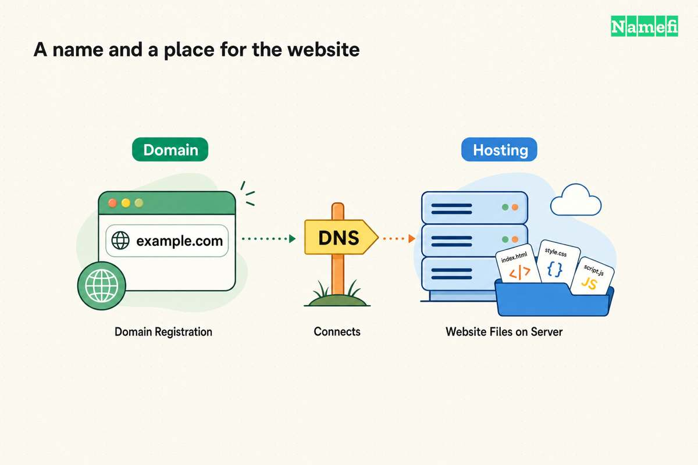
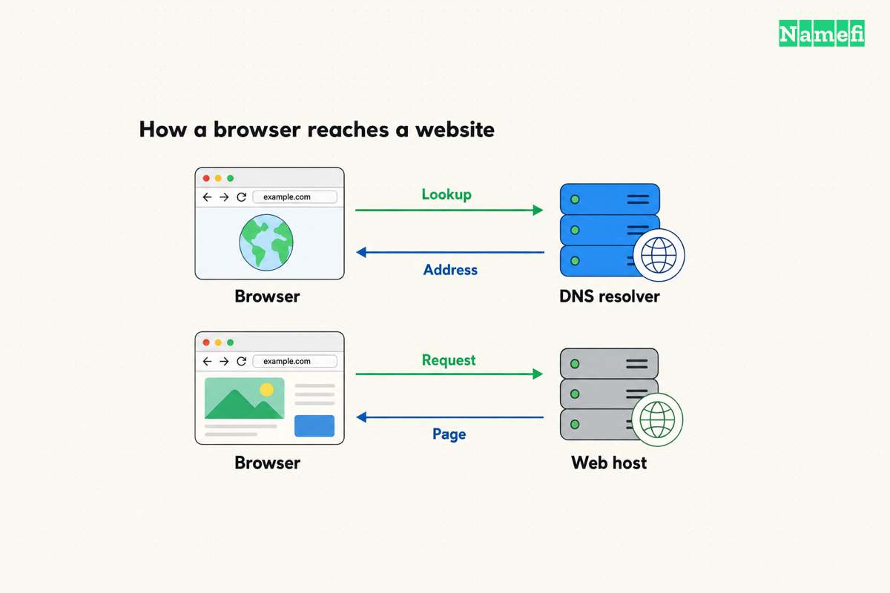

**A domain name gives your website an address. Web hosting supplies the service that stores or generates the pages at that address.** Registering a domain alone does not create a website or mailbox; those services must also be arranged. [ICANN makes this distinction explicitly.](#ref-domain-services)

If you already have a domain, the next question is whether your website builder or publishing service includes hosting. If it does, you may only need to connect the domain. If it does not, you need somewhere to publish the site. This guide explains how to tell which pieces you have and how they fit together. For the structure of a domain name itself, see [what a domain name is](/en/blog/what-is-domain/).

## Domain, hosting, DNS, and email: what each provides

Think of these as separate jobs, even when one company sells them in a bundle:

| Service | What it provides | What to look for in your account |
| --- | --- | --- |
| Domain registration | The right to use a particular name during its registration term | Registrant details, expiration date, renewal, and nameserver settings |
| Web hosting | The server service that delivers your website | Site files or publishing tools, deployment settings, and custom-domain setup |
| DNS hosting | Records that connect names to addresses and other services | The active DNS zone and its records |
| Email hosting | The service behind your mailboxes | Users, inboxes, sending settings, and mail-routing instructions |

The web-hosting role includes both straightforward file delivery and sites whose pages are generated by software. A site can therefore be hosted without presenting you with a traditional “upload files” control panel. [MDN explains static and dynamic web servers.](#ref-web-server)

[DNS](/en/glossary/dns/) hosting is another service, rather than another name for web hosting. For example, DNSimple explicitly lets customers use its DNS service while keeping their registration with another [registrar](/en/glossary/registrar/). [Its service documentation describes the separation.](#ref-dns-service)

Use the table to inspect a bundle before buying an extra plan. Ask whether it includes a published website, supports your custom domain, and provides actual mailboxes. A domain listed in the account does not answer those questions.

## Separate providers and the request path

Consider an illustrative setup: you keep `example.com` at your registrar, publish a site with GitHub Pages, and use an email provider for `hello@example.com`. The names are examples, not accounts to configure.

When a visitor opens the site, the browser uses DNS to find the destination address. It then requests content from the web server, which returns the page. DNS answers the address question; the website's content comes from the server. This is a simplified request path, omitting caches and other infrastructure. [MDN walks through these steps.](#ref-request-path)

The registrar's administrative job sits alongside that path. You do not have to transfer the registration to GitHub to use GitHub Pages: GitHub's documented setup asks you to configure the site and add the appropriate records at your DNS provider. [See its custom-domain instructions.](#ref-github-domain)

That separation is useful when deciding what to change:

- A new website design belongs in the publishing or hosting service.
- A new website destination may require a DNS update.
- A change of registrar is a registration-management task.
- A new mailbox belongs in the email service.

Write down which account handles each job. Otherwise, it is easy to contact the domain seller about a website problem that lives elsewhere.

## Connect the website without breaking email

Start in the **web host's custom-domain settings**. Add the exact hostname you intend to use, such as `www.example.com`, and obtain that host's current DNS instructions. Then identify where the domain's active DNS records are managed.

GitHub Pages provides a concrete example: configure the custom domain in the repository's Pages settings, then add the required DNS record. Its instructions distinguish an apex domain such as `example.com` from a subdomain such as `www.example.com`, and include HTTPS setup and DNS checks. Do not copy one host's target addresses into another host's setup. [Follow the matching GitHub instructions if that is your host.](#ref-github-domain)

Before saving any change, compare the proposed edit with your existing records:

1. Save a copy of the current DNS configuration.
2. Identify precisely which website record the host asks you to add or replace.
3. Keep unrelated mail and verification records in place.
4. If the host requires a nameserver change, plan a complete DNS migration first.
5. Afterward, test the intended website address, HTTPS, and mail delivery separately.

Changing nameservers changes where DNS is served. Google's guidance for connecting a website warns that its mail and verification records must be copied to the new DNS service when nameservers change. That is why a website setup can disrupt email even though the two services are separate. [See Google's nameserver-change instructions.](#ref-preserve-mail)

Incoming email uses **MX records** to identify its mail destination. A working website therefore does not prove that email is configured. [Google's MX documentation explains the lookup.](#ref-mx)

If the record labels are unfamiliar, use the [DNS record types reference](/en/glossary/dns-record-types/) before editing. Keep your provider's current instructions beside it; DNS dashboards differ in how they ask you to enter names and values.

## Check the bills and who controls the name

Before committing to a bundle, make a short account checklist:

- **Domain:** Who is listed as the registrant, who can sign in, and who receives renewal reminders?
- **Website:** Which plan keeps the site published, and what happens if that plan ends?
- **Email:** Are mailboxes included, and which subscription pays for them?
- **DNS:** Will the service continue if you move the registration or cancel another product?
- **Exit:** Can you export your site and DNS configuration, and what does the provider require to move?

Keep the domain's renewal separate in your records. ICANN explains that registration lasts for a term and must be renewed to keep using the name; renewal options and fees vary by registrar. A hosting payment is not evidence that the domain has renewed. [Read ICANN's renewal guidance.](#ref-renewal)

You can also keep a domain without publishing a website. You might be reserving a name or using it only for email. Choose services for the thing you want to operate, then verify that you control and can renew each piece. The useful distinction is concrete: **the name, the website, and the mailbox each need an owner and a working service behind them.**

## Sources and further reading

- ICANN — [About Domain Names](https://www.icann.org/resources/pages/about-domain-names-2018-08-30-en#:~:text=You%20must%20purchase), final paragraphs before “FAQs,” distinguishing a domain from web and email services. Fetched 2026-09-15.
- MDN — [What is a web server?](https://developer.mozilla.org/en-US/docs/Learn_web_development/Howto/Web_mechanics/What_is_a_web_server#summary), “Summary,” static and dynamic servers. Fetched 2026-09-15.
- DNSimple — [DNSimple Services](https://support.dnsimple.com/articles/dnsimple-services/#domain-registration-transfer-and-renewal), “Domain registration, transfer, and renewal,” independent DNS hosting. Fetched 2026-09-15.
- MDN — [How the web works](https://developer.mozilla.org/en-US/docs/Learn_web_development/Getting_started/Web_standards/How_the_web_works#so_what_happens_exactly), DNS lookup, HTTP request, and response sequence. Fetched 2026-09-15.
- GitHub — [Managing a custom domain for your GitHub Pages site](https://docs.github.com/en/pages/configuring-a-custom-domain-for-your-github-pages-site/managing-a-custom-domain-for-your-github-pages-site), “Configuring an apex domain” and “Configuring a subdomain.” Fetched 2026-09-15.
- Google Workspace — [Connect your website to a domain registered through Google](https://knowledge.workspace.google.com/admin/domains/connect-your-website-to-a-domain-registered-through-google), “If NS changed: add Google Workspace services to your web host.” Fetched 2026-09-15.
- Google Workspace — [Set up MX records](https://knowledge.workspace.google.com/admin/domains/set-up-mx-records-for-google-workspace), opening explanation of incoming mail routing. Fetched 2026-09-15.
- ICANN — [Domain Name Renewals and Expiration](https://www.icann.org/resources/pages/domain-name-renewal-expiration-faqs-2018-12-07-en), questions 1–2, registration terms and renewal options. Fetched 2026-09-15.
