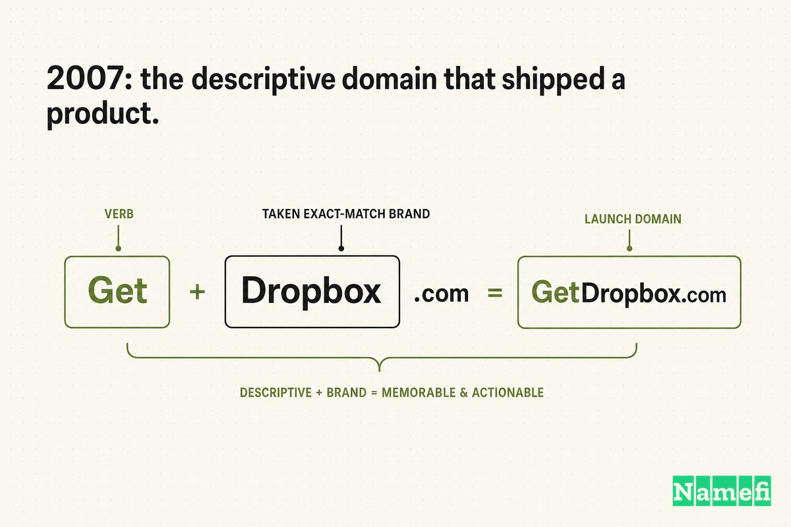
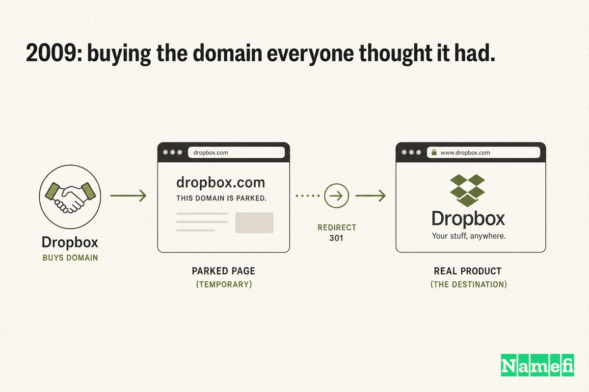
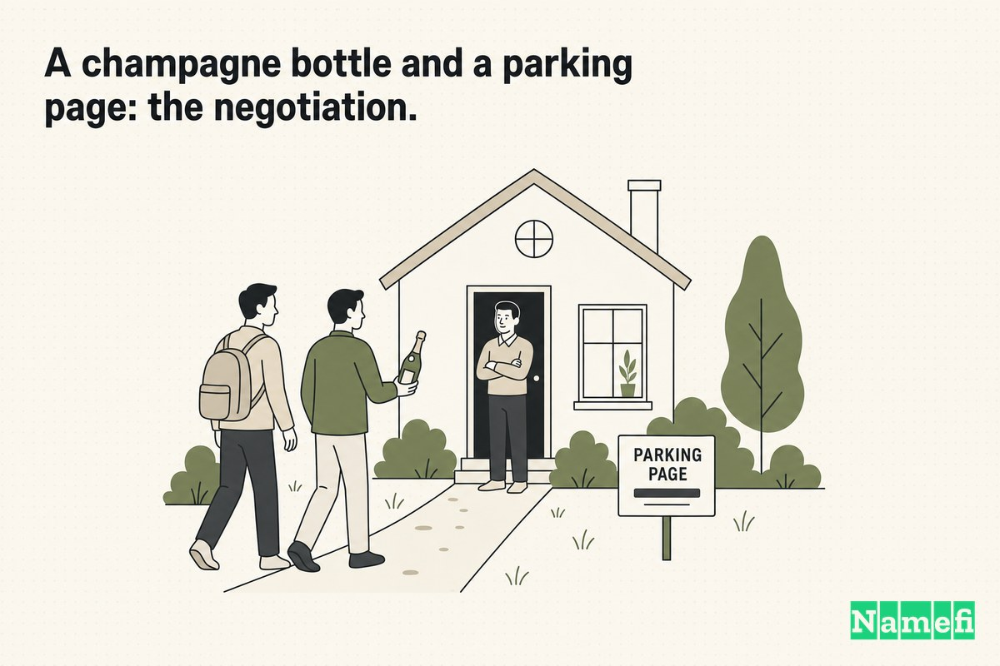
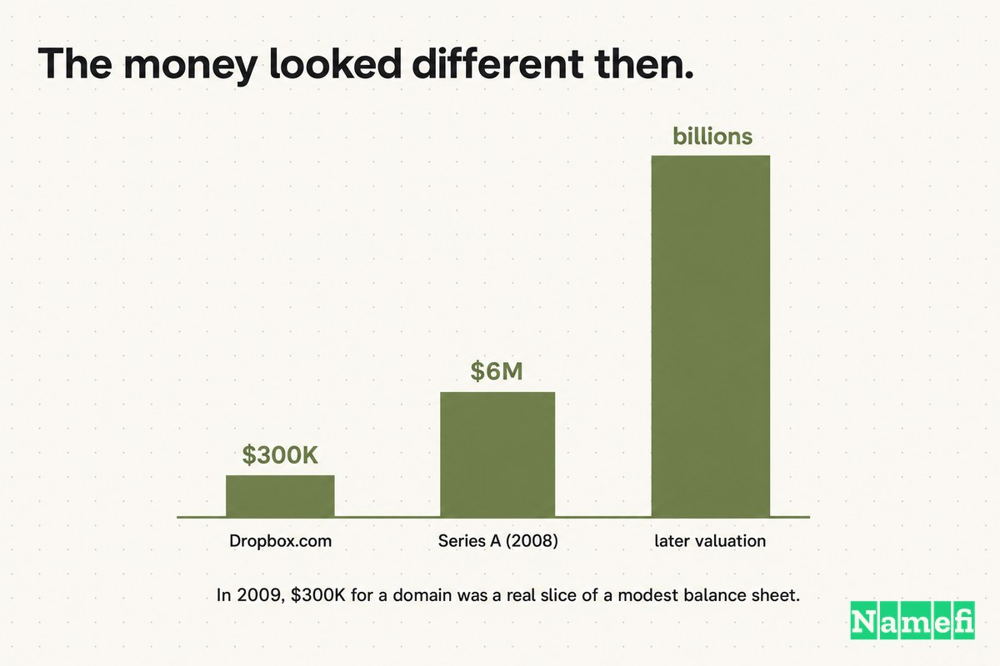
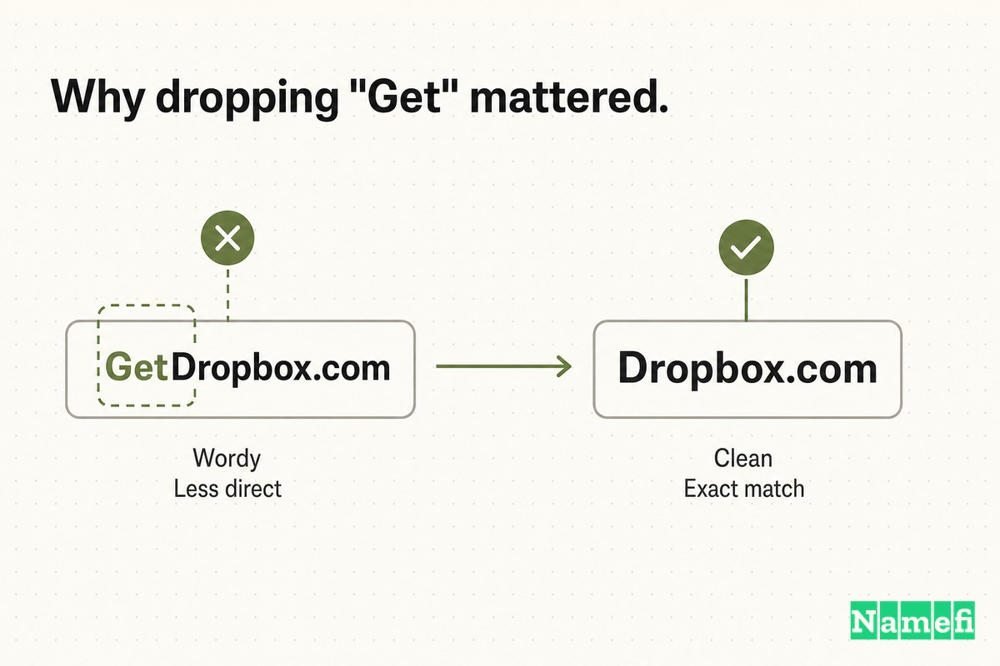
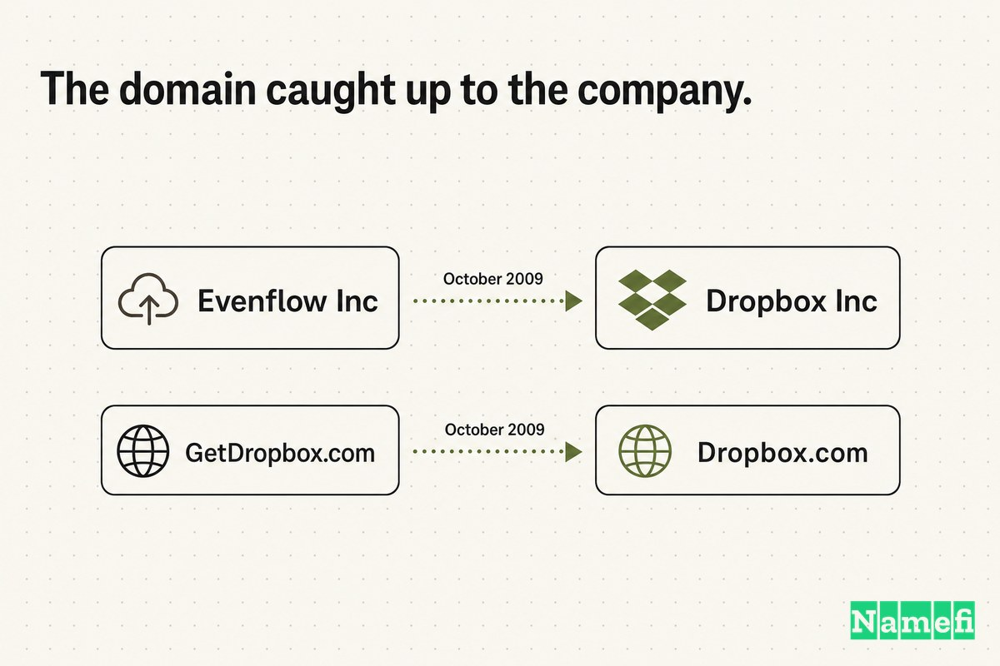
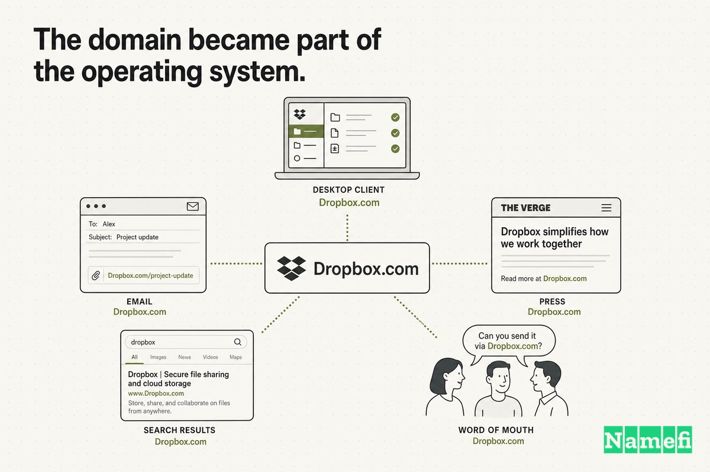
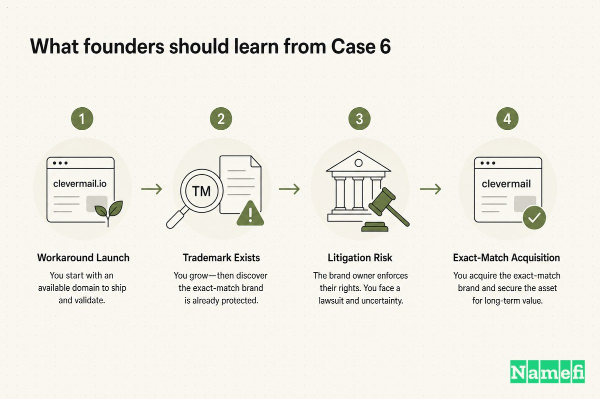
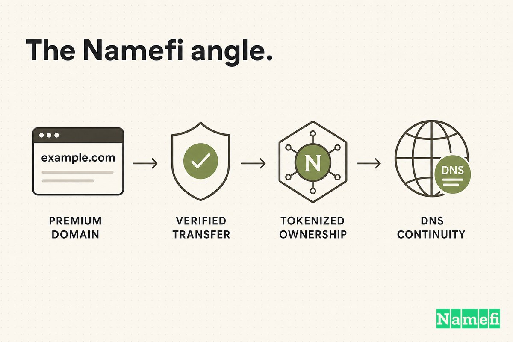

Before Dropbox was a verb for "put it in the cloud," it lived at a slightly longer address: **GetDropbox.com**.

The name was a workaround, not a choice. When Drew Houston filed Dropbox's Y Combinator application — the canonical [YC W07](https://www.ycombinator.com/library/6S-on-starting-and-scaling-dropbox-yc-w07) Winter 2007 batch — the company's web address was already [http://www.getdropbox.com/](https://finance.yahoo.com/news/heres-paperwork-drew-houston-filed-112526277.html#:~:text=http%3A%2F%2Fwww.getdropbox.com%2F), and that's where he hosted the demo and the installer. The application even pointed reviewers to a [screencast on getdropbox.com](https://finance.yahoo.com/news/heres-paperwork-drew-houston-filed-112526277.html#:~:text=getdropbox.com) and a downloadable build at the same domain.

Why "Get"? Because Dropbox.com was taken. The exact-match domain everyone *assumed* the company owned was sitting in someone else's account, parked, and — for years — out of reach. So Dropbox did what countless startups do when the clean .com is gone: it bolted a verb onto the front and shipped.

For its earliest, fast-growing era, that worked. The product idea came from Houston's now-famous frustration on the [Chinatown bus from Boston to New York](https://finance.yahoo.com/news/had-no-idea-become-drew-163000802.html#:~:text=Chinatown%20bus%2C%20forgot%20my%20thumb%20drive), where he forgot his thumb drive and decided he never wanted that problem again. The fix was a folder that synced everywhere — and a domain that, "Get" or not, told you exactly what to do.

Then, in October 2009, Dropbox finally bought **Dropbox.com**. The owner [took $300,000 in cash](https://domainnamewire.com/2018/09/19/dropbox-domain-name/#:~:text=He%20took%20%24300%2C000%20in%20cash) — over an offer that could have been stock instead.

This is the story of how a startup launched on a descriptive domain, fought a squatter and a trademark tangle to get the exact match, and learned that the most expensive part of a domain upgrade is rarely the deciding — it's the transferring.

## 2007: the descriptive domain that shipped a product

In the beginning, "Get" was a feature, not a bug.

Dropbox was [founded in 2007 by MIT students Drew Houston and Arash Ferdowsi](https://en.wikipedia.org/wiki/Dropbox#:~:text=Dropbox%20was%20founded%20in%202007%20by%20MIT%20students%20Drew%20Houston%20and%20Arash%20Ferdowsi), with [initial funding from seed accelerator Y Combinator](https://en.wikipedia.org/wiki/Dropbox#:~:text=initial%20funding%20from%20seed%20accelerator%20Y%20Combinator). The corporate shell behind it wasn't even called Dropbox yet: [Houston founded Evenflow, Inc. in May 2007 as the company behind Dropbox](https://en.wikipedia.org/wiki/Dropbox#:~:text=Houston%20founded%20Evenflow%2C%20Inc.%20in%20May%202007%20as%20the%20company%20behind%20Dropbox).

The product was deliberately simple. Houston's own application described it plainly: Dropbox synchronizes files across your team's computers, automatically and integrated into the OS. For an audience of early adopters, a descriptive domain did real work:

- "GetDropbox" read like a call to action: download this, get the box.
- It matched the product exactly — a dropbox you could *get*.
- It cost nothing to explain, which mattered when the company had no brand equity yet.

And critically, the company couldn't have the clean version anyway. GetDropbox.com wasn't a branding flourish; it was the best available address while Dropbox.com sat in someone else's hands. The famous demo video — the one whose [beta waiting list went from 5,000 people to 75,000 people literally overnight](https://techcrunch.com/2011/10/19/dropbox-minimal-viable-product/#:~:text=Our%20beta%20waiting%20list%20went%20from%205%2C000%20people%20to%2075%2C000%20people%20literally%20overnight) — drove that flood of signups straight to GetDropbox.com. The descriptive domain held a viral launch just fine.

## 2009: buying the domain everyone thought it had

By 2009, GetDropbox.com had a problem only success creates: the *better* address was right there, and everyone assumed Dropbox already owned it.

It didn't. As TechCrunch put it at the time, [Dropbox has been using the domain GetDropbox.com for years](https://techcrunch.com/2009/10/13/dropbox-acquires-the-domain-everyone-thought-it-had-dropbox-com/#:~:text=Dropbox%20has%20been%20using%20the%20domain), while Dropbox.com pointed somewhere else entirely. The exact-match domain was getting real, accidental traffic — [Dropbox.com had nearly 60,000 unique visitors last month](https://techcrunch.com/2009/10/13/dropbox-acquires-the-domain-everyone-thought-it-had-dropbox-com/#:~:text=Dropbox.com%20had%20nearly%2060%2C000%20unique%20visitors%20last%20month), according to Compete — people typing the obvious URL and landing on a page that wasn't Dropbox.

When the deal finally closed in October 2009, [Dropbox acquired the dropbox.com domain for $300,000 in cash](https://en.wikipedia.org/wiki/Timeline_of_Dropbox#:~:text=Dropbox%20acquires%20the%20dropbox.com%20domain%20for%20%24300%2C000%20in%20cash). The domain that had forwarded traffic away from the company now [forwarded to its web site](https://domainnamewire.com/2009/10/14/dropbox-buys-dropbox-com-domain-name/#:~:text=which%20forwards%20to%20its%20web%20site), and the same month, [Evenflow, Inc. was renamed Dropbox, Inc.](https://en.wikipedia.org/wiki/Dropbox#:~:text=Evenflow%2C%20Inc.%20was%20renamed%20Dropbox%2C%20Inc) — the corporate identity catching up to the domain.

$300,000 was not a vanity URL. It was the price of finally owning the address users already believed was yours.

## A champagne bottle and a parking page: the negotiation

The reason it took years — and a lawsuit — is that the owner didn't have to sell, and at first he didn't want to.

Years later, Houston told the story directly. Dropbox [started with GetDropbox.com but obviously wanted to drop the "get,"](https://domainnamewire.com/2018/09/19/dropbox-domain-name/#:~:text=They%20started%20with%20GetDropbox.com%20but%20obviously%20wanted%20to%20drop%20the%20%E2%80%98get%E2%80%99) and the founders chased the exact match the old-fashioned way. After [getting brushed off by the domain owner many times, Houston and his co-founder drove to the guy's house with a bottle of champagne](https://domainnamewire.com/2018/09/19/dropbox-domain-name/#:~:text=Houston%20and%20his%20co-founder%20drove%20to%20the%20guy%E2%80%99s%20house%20with%20a%20bottle%20of%20champagne). Charm didn't close it.

Then the leverage shifted in the wrong direction. As Dropbox grew, the owner started getting beta requests meant for the real company, added Whois privacy, and parked the page with ads. According to Houston, [the ads were for all of their competitors](https://domainnamewire.com/2018/09/19/dropbox-domain-name/#:~:text=the%20ads%20were%20for%20all%20of%20their%20competitors). TechCrunch confirmed the same dynamic: the defendant had begun to [serve not just ads, but ads for Dropbox competitors on the page](https://techcrunch.com/2009/10/13/dropbox-acquires-the-domain-everyone-thought-it-had-dropbox-com/#:~:text=ads%20for%20Dropbox%20competitors%20on%20the%20page).

That turned a naming preference into a trademark problem. Justia records show a [trademark dispute between Evenflow (Dropbox's parent company) and Domains by Proxy, Inc.](https://techcrunch.com/2009/10/13/dropbox-acquires-the-domain-everyone-thought-it-had-dropbox-com/#:~:text=trademark%20dispute%20between%20Evenflow), and Wikipedia summarizes the era bluntly: owing to [trademark disputes between Domains by Proxy, Inc. and Evenflow](https://en.wikipedia.org/wiki/Dropbox#:~:text=trademark%20disputes%20between%20Domains%20by%20Proxy%2C%20Inc.%20and%20Evenflow), Dropbox's official domain stayed GetDropbox.com until October 2009. Once Dropbox [began to take legal action](https://techcrunch.com/2009/10/13/dropbox-acquires-the-domain-everyone-thought-it-had-dropbox-com/#:~:text=after%20Dropbox%20began%20to%20take%20legal%20action), the privacy shield handed control back to the squatter, the suit pressured the seller, and — as Houston put it — that [led to further discussions to sell the domain](https://domainnamewire.com/2018/09/19/dropbox-domain-name/#:~:text=That%20led%20to%20further%20discussions%20to%20sell%20the%20domain).

The deal that champagne couldn't buy, a lawsuit did. And the closing detail is the one founders and sellers both remember: when the negotiation finally produced terms, [Dropbox offered him cash or stock. He took $300,000 in cash](https://domainnamewire.com/2018/09/19/dropbox-domain-name/#:~:text=Dropbox%20offered%20him%20cash%20or%20stock.%20He%20took%20%24300%2C000%20in%20cash). It was a rational choice for someone holding a parked domain — take the certain money. Except the certain money was the expensive option: Houston later noted that the [stock would be worth "hundreds of millions" at today's valuation](https://domainnamewire.com/2018/09/19/dropbox-domain-name/#:~:text=the%20stock%20would%20be%20worth%20%E2%80%98hundreds%20of%20millions%E2%80%99). The seller priced a dormant string of letters; the buyer was offering equity in a company that would IPO at a multibillion-dollar valuation.

## The money looked different then

It's tempting to call $300,000 a steal in hindsight. Dropbox became a public company worth billions, and Dropbox.com is one of its quietest, most permanent assets. Against that, $300,000 looks like a rounding error.

But it should be judged at the moment it was spent.

In late 2009, Dropbox was still a young startup proving it could grow. Its Series A had been modest and recent: [a $6 million round in October 2008, led by Sequoia, with Accel participating](https://techcrunch.com/2009/11/24/dropbox-sequoia-funding#:~:text=Dropbox%20did%20close%20a%20Series%20A%20funding%20round%2C%20but%20it%20was%20for%20%246%20million). Around the time of the domain deal, the company had [recently hit 3 million users, only two months after passing the 2 million user milestone](https://techcrunch.com/2009/11/24/dropbox-sequoia-funding#:~:text=They%E2%80%99ve%20also%20recently%20hit%203%20million%20users). Fast-growing, yes — but still spending venture money carefully.

In that context, $300,000 on a *domain name* — not engineers, not servers, not marketing — was a real capital-allocation decision. It only makes sense if you treat the exact-match domain as infrastructure: the address that every future signup, press mention, and word-of-mouth recommendation would land on. Dropbox was betting the name would be typed millions of times, and that each of those keystrokes should hit Dropbox.com cleanly instead of GetDropbox.com or a competitor's parking page.

## Why dropping "Get" mattered

The gap between GetDropbox.com and Dropbox.com is one short verb. Strategically, it's the difference between an instruction and an identity.

**GetDropbox.com** tells you to do something — go get the product. **Dropbox.com** simply *is* the product. One reads like a download link; the other reads like a company, a category, and eventually a verb.

| Before | After |
| --- | --- |
| GetDropbox.com | Dropbox.com |
| Reads like a call to action | Reads like a brand |
| Implies a thing you fetch | Names the thing itself |
| Carries launch-era scaffolding | Travels beyond the launch |
| Easy to mistype or mis-recall | The address users already guess |

This is the same pattern that shows up across domain upgrades: early names *explain* or *instruct*, great names *own*. A modifier like "Get," "The," or "Motors" is a perfectly reasonable on-ramp when the exact match is taken or the company is still unknown. The upgrade pays off once the brand is strong enough that the name should simply be the category — and once the company can finally pry the clean domain loose.

For Dropbox, "Get" was never the dream; Houston said they [obviously wanted to drop the "get."](https://domainnamewire.com/2018/09/19/dropbox-domain-name/#:~:text=obviously%20wanted%20to%20drop%20the%20%E2%80%98get%E2%80%99) It was scaffolding from day one, kept only because the better address was locked away.

## The domain caught up to the company

The sequence here is the tell. The domain and the corporate identity moved together, in the same month.

Dropbox spent its first two years as **Evenflow, Inc.** operating a product called Dropbox at GetDropbox.com — a three-way mismatch between legal name, product name, and web address. The October 2009 acquisition resolved all three at once: the company secured Dropbox.com, pointed it at the live product, and [renamed Evenflow, Inc. to Dropbox, Inc.](https://en.wikipedia.org/wiki/Dropbox#:~:text=Evenflow%2C%20Inc.%20was%20renamed%20Dropbox%2C%20Inc)

Imagine the alternative: a company called Dropbox, Inc. whose canonical web address is still GetDropbox.com, while Dropbox.com serves ads for its competitors. The brand can't fully consolidate until the domain does. The slow, externally-owned, litigated piece — the domain — had to be secured before the clean identity could lock into place.

That's why the upgrade wasn't cosmetic. It was the moment the product name, the company name, and the address finally became the same word.

## The domain became part of the operating system

Premium domains aren't about prestige. They're about repetition.

A company's core domain shows up in places the marketing team never directly controls:

- In the desktop client and every "your files are in Dropbox" prompt.
- In email addresses and employee signatures.
- In press headlines, App Store listings, and analyst reports.
- In search results and browser bars.
- In every spoken recommendation from one user to another.

Every one of those repetitions either adds friction or removes it. GetDropbox.com made each mention slightly longer, slightly more like an instruction, slightly easier to mistype as plain "Dropbox.com" — which, until October 2009, sent the user to a competitor's parking page. Dropbox.com made each mention shorter, exact, and self-correcting: the address people *already guessed* now resolved to the real thing.

Multiply that across millions of users typing the obvious URL — the same users who were already generating [nearly 60,000 visits a month](https://techcrunch.com/2009/10/13/dropbox-acquires-the-domain-everyone-thought-it-had-dropbox-com/#:~:text=Dropbox.com%20had%20nearly%2060%2C000%20unique%20visitors%20last%20month) to a domain Dropbox didn't even own — and $300,000 stops looking like a luxury. It looks like a permanent reduction in drag, plus the recapture of traffic the company was leaking every single day.

## What founders should learn from Case 6

The easy takeaway — "buy your exact-match .com on day one" — is the wrong one. Dropbox *couldn't*; the domain was taken and the owner wouldn't sell. The more useful lessons are about staging:

1. **A workaround domain is fine to launch on.** GetDropbox.com carried a viral demo, a YC batch, a Series A, and three million users. A "Get," "The," or "App" modifier isn't a failure — it's a reasonable on-ramp when the clean match is unavailable.
2. **Watch for the moment the workaround starts costing you.** The signal to upgrade wasn't aesthetic. It was traffic leaking to Dropbox.com, beta requests landing in a stranger's inbox, and competitor ads on the address users assumed was yours.
3. **Treat the exact-match domain as infrastructure, and expect the transfer to be the hard part.** Deciding to drop "Get" was easy. Champagne, years of "no," Whois privacy, a parking page, and a trademark suit were the actual cost.
4. **Secure the domain before consolidating the identity.** Dropbox renamed Evenflow to Dropbox, Inc. *the same month* it got Dropbox.com — because the corporate identity can change in an afternoon, but the domain can take a lawsuit.

The domain upgrade didn't make Dropbox win. Product, timing, the viral demo, and execution mattered far more. But Dropbox.com made the company's name, product, and address finally agree with each other — and stopped the brand from leaking traffic to its own competitors.

## The Namefi angle

Dropbox's story is, at its core, a transfer problem.

The strategic decision was never really in doubt — of course a company called Dropbox should own Dropbox.com. The hard part was everything around the asset: finding an owner hiding behind Whois privacy, getting brushed off, driving to his house, watching the domain get weaponized with competitor ads, filing suit to force a conversation, agreeing on a price with no public comparables, and moving control cleanly without disrupting a live, fast-growing product. Years of effort went not into *deciding* to upgrade, but into safely *executing* the upgrade.

[Namefi](https://namefi.io) is built around the idea that domains should behave like internet-native assets. Tokenized ownership can make domain control easier to verify, transfer, and integrate into modern workflows while staying compatible with DNS — turning the messiest parts of a deal like this (proving who really controls a privacy-shielded domain, and moving it safely) into something closer to a clean, auditable transaction.

Dropbox.com looks inevitable now because Dropbox became enormous. But the lesson lands long before that scale: when a name is going to carry the business, the domain isn't decoration. It's the part of the brand worth a lawsuit, a bottle of champagne, and $300,000 to finally get right.

## Sources and further reading

- Y Combinator — [On starting and scaling Dropbox (YC W07)](https://www.ycombinator.com/library/6S-on-starting-and-scaling-dropbox-yc-w07)
- Yahoo Finance / Business Insider — [This Is Drew Houston's 2007 Y Combinator Application For Dropbox](https://finance.yahoo.com/news/heres-paperwork-drew-houston-filed-112526277.html#:~:text=http%3A%2F%2Fwww.getdropbox.com%2F)
- Yahoo Finance — [Dropbox founder explains how his $10 billion startup was created on a Chinatown bus](https://finance.yahoo.com/news/had-no-idea-become-drew-163000802.html#:~:text=Chinatown%20bus%2C%20forgot%20my%20thumb%20drive)
- TechCrunch — [Dropbox Acquires The Domain Everyone Thought It Had: Dropbox.com](https://techcrunch.com/2009/10/13/dropbox-acquires-the-domain-everyone-thought-it-had-dropbox-com/#:~:text=Dropbox%20has%20been%20using%20the%20domain)
- TechCrunch — [Dropbox Raised $6 Million Sequoia-Led Series A In October 2008](https://techcrunch.com/2009/11/24/dropbox-sequoia-funding#:~:text=Dropbox%20did%20close%20a%20Series%20A%20funding%20round%2C%20but%20it%20was%20for%20%246%20million)
- TechCrunch — [How DropBox Started As A Minimal Viable Product](https://techcrunch.com/2011/10/19/dropbox-minimal-viable-product/#:~:text=Our%20beta%20waiting%20list%20went%20from%205%2C000%20people%20to%2075%2C000%20people%20literally%20overnight)
- Domain Name Wire — [How Dropbox got the Dropbox.com domain name](https://domainnamewire.com/2018/09/19/dropbox-domain-name/#:~:text=He%20took%20%24300%2C000%20in%20cash)
- Domain Name Wire — [Dropbox Buys Dropbox.com Domain Name](https://domainnamewire.com/2009/10/14/dropbox-buys-dropbox-com-domain-name/#:~:text=which%20forwards%20to%20its%20web%20site)
- Wikipedia — [Dropbox](https://en.wikipedia.org/wiki/Dropbox#:~:text=trademark%20disputes%20between%20Domains%20by%20Proxy%2C%20Inc.%20and%20Evenflow)
- Wikipedia — [Timeline of Dropbox](https://en.wikipedia.org/wiki/Timeline_of_Dropbox#:~:text=Dropbox%20acquires%20the%20dropbox.com%20domain%20for%20%24300%2C000%20in%20cash)
- Hacker News — [Discussion: Dropbox Acquires The Domain Everyone Thought It Had](https://news.ycombinator.com/item?id=880522)
