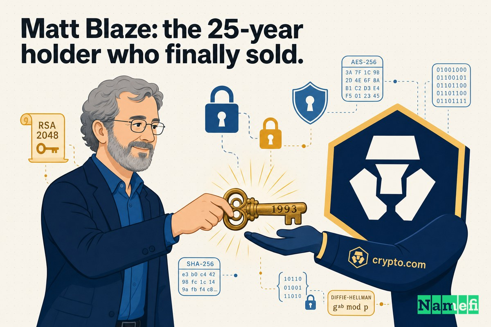
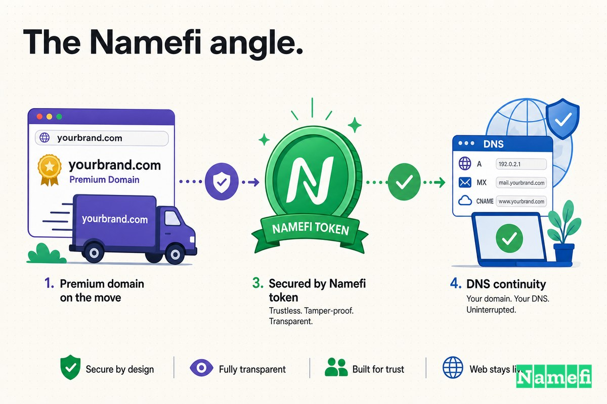

For its first couple of years, one of the most aggressive brands in crypto lived at a quietly clever address: **Mona.co** — the company "Monaco," spelled out across a domain and a country-code TLD, the way bit.ly or goo.gl turned a `.ly` or `.gl` into part of the word.

The name was a pun, and a good one. The startup, founded in Hong Kong in 2016, was building a Visa card and wallet for spending cryptocurrency. "Monaco" evoked wealth, luxury, the Riviera — and the `.co` let the brand sit on a short, memorable URL while the team waited to see how big the idea could get. Mona.co told you the company's name. It didn't tell you the category.

That was the gap. Monaco wasn't trying to be a luxury card company. It was trying to be *the* place ordinary people touched cryptocurrency for the first time. And the single word that named that entire category — the word every headline, every regulator, every newcomer already used — wasn't "Monaco." It was **crypto**.

The exact-match domain for that ambition was Crypto.com. And it had belonged, since 1993, to a man who spent 25 years refusing to sell it: the cryptographer Matt Blaze.

In July 2018, that finally changed. Monaco bought Crypto.com in a deal it never priced publicly — but which experts told The Verge could be worth as much as **[$10 million](https://techcrunch.com/2018/07/05/crypto-com-mco/#:~:text=Experts%20told%20The%20Verge%20that%20Crypto.com%20could%20have%20attracted%20as%20much%20as%20%2410%20million)** — and rebranded itself, top to bottom, as Crypto.com.

## 2016–2018: the Monaco era

When the company [was initially founded in Hong Kong by Bobby Bao, Gary Or, Kris Marszalek, and Rafael Melo in 2016 as "Monaco"](https://en.wikipedia.org/wiki/Crypto.com#:~:text=initially%20founded%20in%20Hong%20Kong%20by%20Bobby%20Bao%2C%20Gary%20Or%2C%20Kris%20Marszalek%2C%20and%20Rafael%20Melo%20in%202016), the pitch was concrete: a crypto debit card. TechCrunch described Monaco at the time as [a crypto project best-known for developing a crypto debit card](https://techcrunch.com/2018/07/05/crypto-com-mco/#:~:text=a%20crypto%20project%20best%2Dknown%20for%20developing%20a%20crypto%20debit%20card). You loaded crypto, you swiped a Visa, you spent it like cash. The company even ran an ICO and issued a token, MCO, to power the card's fee-and-rewards system.

"Monaco" did real work for that first product. It was short, it was premium-sounding, and the Mona.co construction gave the brand a clean URL without paying premium-domain money. For a young company that needed to look trustworthy enough to ask strangers to load real money onto a card, a name that whispered "luxury and discretion" was an asset, not a liability.

But the ambition kept widening past the name. Monaco's leadership didn't want to be a niche card issuer for crypto enthusiasts. They wanted the on-ramp for the whole category — the wallet, the card, the exchange, the brand a first-time buyer would type without thinking. And "Monaco" pointed in exactly the wrong direction. It named a principality on the Mediterranean, not the thing the company actually did.

Mona.co was the right domain for the first stage. It was the wrong domain for the company underneath it.

## July 2018: acquiring the category itself

The fix wasn't to invent a better name. The category already had one, and it was sitting on the most on-the-nose domain in the entire industry: Crypto.com.

So Monaco bought it. As TechCrunch reported, [Monaco, a crypto project best-known for developing a crypto debit card, bought the domain in an undisclosed deal](https://techcrunch.com/2018/07/05/crypto-com-mco/#:~:text=bought%20the%20domain%20in%20an%20undisclosed%20deal). The purchase wasn't a vanity URL bolted onto the side of the business — it was the centerpiece of a full corporate rebrand. The same TechCrunch report described how [the splashy purchase of the domain is part of a rebrand for Monaco that will see the parent company become Crypto.com](https://techcrunch.com/2018/07/05/crypto-com-mco/#:~:text=is%20part%20of%20a%20rebrand%20for%20Monaco%20that%20will%20see%20the%20parent%20company%20become%20Crypto.com), while the older Monaco-branded services — the Visa card, peer-to-peer transfers, the wallet — were folded under the MCO name.

CEO Kris Marszalek framed it not as buying a URL but as inheriting a category. [This is a very powerful identity that we are taking on. It's representative of the entire category so it comes with a huge responsibility on us to carry the torch](https://techcrunch.com/2018/07/05/crypto-com-mco/#:~:text=This%20is%20a%20very%20powerful%20identity%20that%20we%20are%20taking%20on.%20It%27s%20representative%20of%20the%20entire%20category%20so%20it%20comes%20with%20a%20huge%20responsibility%20on%20us%20to%20carry%20the%20torch), he said. That sentence is the whole strategy in one breath: Crypto.com wasn't a name for *a* company in crypto. It was a name that *claimed* crypto.

## Why moving to Crypto.com mattered

The gap between Mona.co and Crypto.com is not one word — it's an entire dimension. One names the company. The other names the market.

**Mona.co** is a clever brand URL: memorable, premium, but category-silent. A newcomer reading it learns nothing about what's inside. **Crypto.com** is the opposite — it carries almost no brand personality and instead radiates pure category. Type it, and you already know what you'll find. It's the address a person reaches for when they decide, for the first time, that they want to "get into crypto" and have no idea where to start.

| Before | After |
| --- | --- |
| Mona.co | Crypto.com |
| Names the company ("Monaco") | Names the category ("crypto") |
| Premium, but category-silent | Self-explanatory to a first-timer |
| A `.co` brand hack | The exact-match `.com` of the whole market |
| Reads like a luxury card | Reads like the front door of an industry |
| You must explain what it does | The name *is* what it does |

This is the same pattern that shows up again and again in domain upgrades — but pushed to its extreme. Most companies trade a descriptive name for their own brand name (UberCab to Uber, TeslaMotors to Tesla). Monaco did something rarer and more audacious: it traded its brand name for *the category's* name. It stopped being a company called Monaco that sold crypto cards, and became the company that *is* Crypto.com.

That only works if you can get the domain. And the domain had an owner who, for a quarter of a century, had said no.

## Matt Blaze: the 25-year holder who finally sold

The seller was not a domain investor. He was one of the most respected cryptographers alive.

Matt Blaze is [an American researcher who focuses on the areas of secure systems, cryptography, and trust management](https://en.wikipedia.org/wiki/Matt_Blaze#:~:text=an%20American%20researcher%20who%20focuses%20on%20the%20areas%20of%20secure%20systems%2C%20cryptography%2C%20and%20trust%20management) — the academic who, in the 1990s, publicly broke the U.S. government's Clipper chip, and who later sat on the board of the Tor Project. For him, "crypto" never meant Bitcoin. It meant *cryptography*: ciphers, keys, the mathematics of secrecy. And he had owned the domain for as long as the field had a web. As he put it in his own farewell note, [twenty five years ago, back in 1993, I registered the name crypto.com](http://www.mattblaze.org/blog/newaddress#:~:text=Twenty%20five%20years%20ago%2C%20back%20in%201993%2C%20I%20registered%20the%20name%20crypto.com).

For most of those 25 years, Blaze treated offers for the domain as an irritation, and sometimes as a joke. When the crypto-currency boom sent speculators hammering at his inbox, he answered publicly with a now-famous brush-off: [If you want my domain bc you're speculating on crypto currency, just send me all your bitcoins instead. I promise to lose them for you](https://technical.ly/software-development/penn-professor-matt-blaze-crypto/#:~:text=If%20you%20want%20my%20domain%20bc%20you%27re%20speculating%20on%20crypto%20currency%2C%20just%20send%20me%20all%20your%20bitcoins%20instead.%20I%20promise%20to%20lose%20them%20for%20you). His site spelled out the distinction in plain language: [this site does not trade in or provide services related to cryptocurrencies. It is concerned with cryptography, computer and network security, and technology policy research](https://technical.ly/software-development/penn-professor-matt-blaze-crypto/#:~:text=This%20site%20does%20not%20trade%20in%20or%20provide%20services%20related%20to%20cryptocurrencies.%20It%20is%20concerned%20with%20cryptography). He even tacked on a warning that [many cryptocurrencies are scams, and I strongly advise against their use as investment vehicles](https://technical.ly/software-development/penn-professor-matt-blaze-crypto/#:~:text=Many%20cryptocurrencies%20are%20scams%2C%20and%20I%20strongly%20advise%20against%20their%20use%20as%20investment%20vehicles).

So why, after 25 years, did he sell?

Not because the offers got bigger — though they did. Because the *word* changed underneath him. In his own account of the decision, Blaze acknowledged that [the word "crypto" has recently acquired an alternative new meaning, as a somewhat unfortunate shorthand for digital currencies such as Bitcoin](http://www.mattblaze.org/blog/newaddress#:~:text=the%20word%20%22crypto%22%20has%20recently%20acquired%20an%20alternative%20new%20meaning%2C%20as%20a%20somewhat%20unfortunate%20shorthand%20for%20digital%20currencies). The domain that once announced *his* field now mostly summoned a different one. He had [gotten a growing barrage of offers, many of which were obviously non-serious](http://www.mattblaze.org/blog/newaddress#:~:text=I%27ve%20gotten%20a%20growing%20barrage%20of%20offers%2C%20many%20of%20which%20were%20obviously%20non%2Dserious), and against that backdrop, [it became increasingly clear that holding on to the domain was making less and less sense for me](http://www.mattblaze.org/blog/newaddress#:~:text=it%20became%20increasingly%20clear%20that%20holding%20on%20to%20the%20domain%20was%20making%20less%20and%20less%20sense%20for%20me). The conclusion was almost anticlimactic: [last month, I reached an agreement to sell the domain](http://www.mattblaze.org/blog/newaddress#:~:text=Last%20month%2C%20I%20reached%20an%20agreement%20to%20sell%20the%20domain).

That is the quiet engine behind nearly every blockbuster premium-domain sale. The owner doesn't need the money and doesn't need to sell. What finally moves them is not a number but a shift in meaning — the day the asset stops belonging to *their* world and starts belonging to someone else's. Blaze sold not when crypto.com became most valuable to *him*, but when it stopped being *about* him at all.

## The money looked different then

It is tempting, in 2026, to call a reported eight-figure domain purchase an obvious bargain. Crypto.com later spent hundreds of millions on a Formula 1 sponsorship, a Matt Damon ad campaign, and the naming rights to the arena in Los Angeles formerly known as Staples Center. Against *that* later spending, a domain priced in the millions looks like a rounding error.

But it should be judged at the moment it was spent, not from the far end of the story.

In mid-2018, the crypto market was deep in a brutal post-2017 crash. Monaco was a startup with a card product and an ICO token, not a global brand. Spending what The Verge's experts pegged at up to [$10 million](https://techcrunch.com/2018/07/05/crypto-com-mco/#:~:text=Experts%20told%20The%20Verge%20that%20Crypto.com%20could%20have%20attracted%20as%20much%20as%20%2410%20million) on a *domain name* — not engineering, not licensing, not customer acquisition — was the kind of line item that should have been hard to defend. (Some outlets reported the figure even higher; Tech Startups claimed Monaco [paid $12 million for the URL](https://techstartups.com/2018/07/06/highly-sought-domain-name-crypto-com-sold-millions-dollars/#:~:text=paid%20%2412%20million%20for%20the%20URL), while noting the price was never confirmed by buyer or seller.)

The decision only makes sense if you treat the domain as positioning rather than real estate. Monaco wasn't buying a web address. It was buying the right to *be* the category in the mind of every person who would ever type "crypto.com" into a browser bar on instinct. That's an asset you can't build with a marketing budget, only purchase outright — and only if the one person who owns it is finally willing to let go.

## The timing nobody could have scheduled

The most underrated part of this deal is that neither side could have forced it a year earlier or a year later.

Monaco needed the domain in 2018 specifically: it had a working card, a token, and an ambition that had outgrown a `.co` pun, but it was not yet so large that the category name was out of reach. A few years on, after Crypto.com's arena deals and stadium-scale marketing, the same domain would have commanded a different conversation entirely — if it were available at all.

Blaze, for his part, didn't sell because someone finally met his number. He sold because the meaning of "crypto" had drifted far enough that the domain no longer represented his life's work, only its noisy namesake. The two timelines — a buyer ready to claim the category and a seller ready to release it — overlapped for a narrow window in mid-2018. Most category domains never get that window. The owner stays attached, or the would-be buyer never gets big enough to matter, and the two ships pass in the night for decades. This deal happened because, for one moment, both sides wanted the same transaction for opposite reasons.

## The domain became part of the operating system

Premium domains are not about prestige. They are about repetition.

A company's core domain shows up in places the marketing team never directly controls:

- In the app icon, the card, and every transaction confirmation.
- In press headlines and regulatory filings.
- In email addresses and employee signatures.
- In search results and the browser bar — where "crypto.com" is something a newcomer might type *before* they know any brand at all.
- In every word-of-mouth recommendation: "just go to crypto dot com."

Every one of those repetitions either adds friction or removes it. Mona.co required a tiny act of translation — *Monaco, spelled with the .co* — and told a first-timer nothing about the category. Crypto.com removed the translation entirely and pre-loaded the category into the name. For a company whose whole strategy was to be the default on-ramp for people who knew nothing about the space, that pre-loading was the product.

The domain didn't build Crypto.com's brand. But once Crypto.com was the address, every future mention of the category — in headlines, in conversations, in the panicked first search of someone who just heard about Bitcoin at a dinner party — had a chance of landing on the company's front door instead of someone else's.

## What founders should learn from Case 20

The easy takeaway — "buy the category-defining .com" — is the wrong lesson, because almost no founder *can*. Crypto.com existed for 25 years and was unbuyable for 24 of them. The useful lessons are narrower:

1. **A clever brand-hack domain is a fine on-ramp.** Mona.co did genuine work: short, premium, memorable, cheap relative to the exact match. A `.co` pun or a modifier domain is a reasonable starting line, not a failure.
2. **Know the difference between your name and your category.** Most domain upgrades trade a descriptive name for the brand. The rarest and most powerful upgrade trades the brand for the *category* — but it only pays off if you intend to be the default, not a boutique.
3. **The category domain has a human owner, and timing is everything.** You don't out-negotiate a 25-year holder; you wait for the moment the asset stops making sense *for them*. Blaze didn't sell to the highest bidder for two decades — he sold when the word's meaning shifted out from under him.
4. **Price the domain as positioning, not real estate.** Up to $10 million looks insane for a URL and cheap for ownership of an entire category's front door. Which one it is depends entirely on whether you can actually become the category.

The domain upgrade did not make Crypto.com win. Product, capital, marketing, exchange volume, and ruthless timing mattered far more. But Crypto.com made the company's ambition — to *be* the category, not a player in it — finally *nameable*, and it took 25 years of patience on the seller's side to even become possible.

## The Namefi angle

This case is, at its core, a transfer problem wrapped in a 25-year standoff.

The strategic decision was never really in doubt — of course a company that wanted to own the crypto category should own Crypto.com. The hard part was everything around the asset: finding terms a reluctant, ideologically-motivated long-term owner would finally accept, negotiating privately with no public comparables for a one-of-a-kind name, agreeing on a price that was never disclosed, and moving control of one of the most valuable domains on earth cleanly and safely from a cryptographer's personal registration into a company's hands. A quarter-century of "no" had to resolve into a single clean transfer.

[Namefi](https://namefi.io) is built around the idea that domains should behave like internet-native assets. Tokenized ownership can make domain control easier to verify, transfer, and integrate into modern workflows while staying compatible with DNS — turning the messiest parts of a deal like this (proving who owns what, agreeing on value with no comparables, and moving a singular asset safely) into something closer to a clean, auditable transaction. The irony is hard to miss: the company that bought *Crypto.com* did so through exactly the kind of slow, private, trust-heavy process that crypto-native infrastructure is meant to streamline.

Crypto.com looks inevitable now because Crypto.com became enormous. But the lesson lands long before that scale: when a name is going to carry not just a company but an entire category, the domain isn't decoration. It's the part of the brand worth waiting a generation — and paying millions — to get right.

## Sources and further reading

- TechCrunch — [Crypto Visa card company Monaco just spent millions to buy Crypto.com](https://techcrunch.com/2018/07/05/crypto-com-mco/#:~:text=Experts%20told%20The%20Verge%20that%20Crypto.com%20could%20have%20attracted%20as%20much%20as%20%2410%20million)
- Matt Blaze — [Exhaustive Search has moved (mattblaze.org/blog/newaddress)](http://www.mattblaze.org/blog/newaddress#:~:text=Twenty%20five%20years%20ago%2C%20back%20in%201993%2C%20I%20registered%20the%20name%20crypto.com)
- Technical.ly — [This Penn professor owns a domain name worth millions. Here's why he won't sell](https://technical.ly/software-development/penn-professor-matt-blaze-crypto/#:~:text=If%20you%20want%20my%20domain%20bc%20you%27re%20speculating%20on%20crypto%20currency%2C%20just%20send%20me%20all%20your%20bitcoins%20instead.%20I%20promise%20to%20lose%20them%20for%20you)
- Wikipedia — [Matt Blaze](https://en.wikipedia.org/wiki/Matt_Blaze#:~:text=an%20American%20researcher%20who%20focuses%20on%20the%20areas%20of%20secure%20systems%2C%20cryptography%2C%20and%20trust%20management)
- Wikipedia — [Crypto.com](https://en.wikipedia.org/wiki/Crypto.com#:~:text=initially%20founded%20in%20Hong%20Kong%20by%20Bobby%20Bao%2C%20Gary%20Or%2C%20Kris%20Marszalek%2C%20and%20Rafael%20Melo%20in%202016)
- Bitcoinist — [Crypto.com Bought by Monaco for Millions as Part of Rebranding Campaign](https://bitcoinist.com/monaco-buys-crypto-com-domain-millions/)
- Tech Startups — [Highly-sought after domain name Crypto.com sold for $12 million to Monaco](https://techstartups.com/2018/07/06/highly-sought-domain-name-crypto-com-sold-millions-dollars/#:~:text=paid%20%2412%20million%20for%20the%20URL)
- DomainInvesting.com — [Matt Blaze Comments About Crypto.com Sale](https://domaininvesting.com/matt-blaze-comments-about-crytpo-com-sale/)
