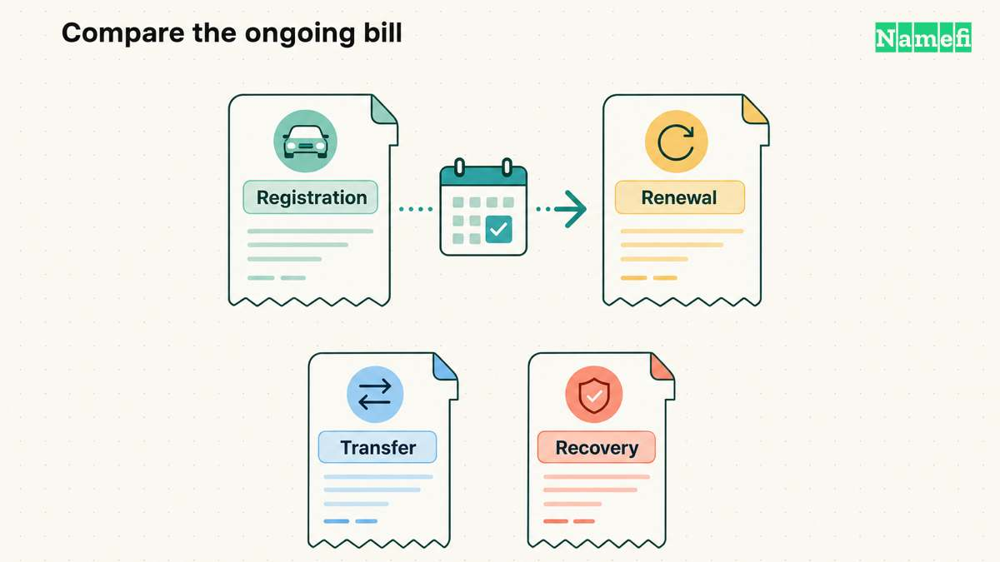

**A domain name has a registration price and a recurring renewal price; the two can differ substantially.** The extension, registrar, registration term, and whether the name is already owned or priced as premium determine the quote.

That is the first thing to understand before you register a name. The checkout price is only one line in the ledger. A domain has a first-year registration price, a renewal price, a transfer price, possible restore or redemption fees, privacy settings, taxes, payment-method costs, and sometimes surrounding product fees for DNS, email, hosting, or account services.

A promotional first year can be legitimate and still lead to a higher annual commitment. Compare both prices before checkout to understand the long-term [holding cost](/en/glossary/holding-cost/).

## The number you see first is not the cost

Most people ask "how much is a domain?" and expect one answer. A better question is: "What will this name cost if I keep it for three years and something goes wrong once?"

Here is the cost stack.

| Cost | What it means | Why it matters |
| --- | --- | --- |
| First-year registration | The price to register an available name for the first term | This is where promotions usually appear |
| Renewal | The recurring price to keep the domain after the first term | This is the real long-term cost |
| Transfer | The price to move the name to another registrar | It may differ from renewal and may extend the term |
| Restore / redemption | The fee to recover a name after it has expired and entered a recovery window | This can be many times the annual renewal |
| WHOIS privacy | Contact-data privacy or proxy service | It may be included, paid, unavailable, or handled differently by TLD |
| Taxes and regulatory fees | Sales tax, VAT, GST, local fees, ICANN fees, or other checkout additions | These depend on jurisdiction, currency, and registrar |
| Payment costs | Card foreign-exchange spread, wire costs, crypto network fees, delayed payment methods, refund friction | The registrar price may not be the exact amount that leaves your account |
| DNS / product fees | Hosted-zone, query, email, forwarding, SSL, or bundled service costs | A domain can be cheap while the surrounding account is not |

The line that trips people most often is renewal. ICANN's Expired Registration Recovery Policy requires registrars to make [renewal, post-expiration renewal, and redemption/restore fees reasonably available](https://www.icann.org/resources/pages/errp-2013-02-28-en#Notice), but the buyer still has to compare them before checkout. A low first-year number is not misleading by itself. It becomes a problem when the buyer treats it as the annual cost.

## Registration vs. renewal: a dated price comparison

The following are Namecheap public list-page examples checked **September 15, 2026**, in **USD per one-year term**. They are not Namefi quotes or a market average. Premium names, taxes, eligible promotions, and applicable checkout fees can change the total.

| Extension | First-year registration | One-year renewal | Transfer-in price | Source |
| --- | --- | --- | --- | --- |
| `.com` | USD 11.28 promotional | USD 18.48 | USD 11.48 promotional | [Namecheap `.com`](#ref-namecheap-com) |
| `.io` | USD 34.98 promotional | USD 75.98 | USD 65.98 | [Namecheap `.io`](#ref-namecheap-io) |

The same provider quotes different amounts for the first term, a later renewal, and a transfer. A transfer price also needs its own term-extension rules checked.

## Why introductory pricing differs from renewal

Introductory pricing is common because the first year and the renewal year are different economic events.

The first year may be discounted because the registry or registrar wants adoption, because a promotion is running, or because the registrar expects many customers to keep the domain for multiple years. The renewal year has a different job. It has to support the ongoing registry fee, registrar margin, payment processing, fraud controls, support, compliance, renewal notifications, and whatever product layer is bundled around the name.

This is normal across many industries: acquisition pricing is often lower than retention pricing. The domain-specific risk is that renewals are not optional if the name matters. If your website, email, brand, app, or portfolio depends on a domain, the renewal bill is the cost of keeping control.

The practical habit is simple: before you register, write down both numbers. Use the recurring renewal quote as your planning baseline and record the introductory discount separately.

## Registration, renewal, transfer, restore

The four domain operations to compare are registration, renewal, transfer, and restore.

**Registration** is the first term. It is the number marketing pages emphasize because it is the easiest one to understand. A discounted first year can be useful if you are testing an idea, but it is not the right number for long-term planning.

**Renewal** is the cost of continuing control. A small per-domain difference becomes more significant when multiplied across a portfolio. This is why domain investors obsess over [renewal cost and sell-through rate](/en/blog/domain-renewal-costs-and-sell-through-rate/).

**Transfer** is what you pay to [move the domain to another registrar](/en/blog/transfer-domain-to-another-registrar/). A transfer may include a one-year term extension, but that is not a universal shortcut you should assume without checking. Also watch transfer locks, recent-registration limits, authorization-code handling, and whether the transfer changes your DNS or privacy settings.

**Restore or redemption** is the expensive panic button. ICANN's recovery policy says gTLD registries generally must offer a [30-day Redemption Grace Period](https://www.icann.org/resources/pages/errp-2013-02-28-en#Redemption) after deletion, during which the deleted registration may be restored through the deleting registrar. During that period, recovery can cost much more than a normal renewal. The lesson is simple: auto-renew is cheaper than rescue.

## Privacy, taxes, and payment method costs

WHOIS privacy belongs in the cost comparison because it changes the practical value of the package. Some domains include privacy by default. Some make it optional. Some TLDs or registrant types may handle public contact data differently. If privacy matters to you, compare it as part of the domain cost rather than as an afterthought.

Taxes and regulatory fees are less tidy. Sales tax, VAT, GST, and local rules depend on where you are, where the registrar sells from, and how the service is classified. A checkout total may differ from the advertised base price, especially across currencies or jurisdictions.

Payment method can also change the real cost. A card may add foreign-exchange spread. A bank wire may carry bank fees or minimums. A local bank transfer may delay activation. A crypto payment may involve network fees, confirmation time, and refund limitations. If you are buying one inexpensive name, this may be minor. If you are buying or renewing a portfolio, payment rails become part of the operating model.

## Registrar pricing models

Registrars sell the same general object, but not the same experience. Comparing them only on one TLD's first-year price misses the business model.

### Cost-pass-through style

Some registrars position themselves around minimal markup. The appeal is obvious: if the registrar can pass through the underlying registry cost with little extra margin, the buyer may get a lower renewal price. This model tends to work best for buyers who already know what they need and do not require much support or bundling.

The tradeoff is that lower markup is not the only variable. You still care about supported TLDs, account recovery, DNSSEC, bulk controls, billing controls, transfer workflows, support responsiveness, and how well the registrar fits your security model.

### Infrastructure-first registrar

Some registrars are attached to a broader cloud or infrastructure platform. In that model, the domain is one part of a larger system that may include hosted DNS, query charges, access controls, audit logs, infrastructure automation, health checks, and other operational services.

This can be attractive for technical teams that want domains close to infrastructure and billing. It may be overkill for a casual buyer who only wants a simple domain and renewal reminder. The domain price can look reasonable while the surrounding product costs make the total bill harder to compare.

### Investor-focused registrar

Some registrars are optimized for domain investors and active traders. The features that matter there are bulk search, bulk renewals, portfolio exports, clear renewal columns, transfer tooling, aftermarket access, expiry controls, and account-level reporting.

For investors, a small renewal difference compounds quickly. A portfolio of names renews every year whether the names sell or not. That makes the registrar's renewal table, restore fees, bulk tooling, and payment workflow more important than a pleasant one-name checkout.

### Consumer retail registrar

Consumer retail registrars optimize for a broader buyer: small businesses, creators, local services, side projects, first-time domain owners, and teams that want support and adjacent products. The value may be a simpler search flow, reminders, customer support, privacy handling, email or hosting integrations, website tools, or easier account recovery.

Retail pricing is not automatically bad. The fair comparison is not "who has the lowest first-year price on one TLD?" It is "what will this registrar cost me over the life of the domain, and does the service layer justify the difference?"

### Marketplace and productized registrar experience

Some registrar experiences are built around domains as assets, not just domains as checkout items. That can include listings, transfers, ownership verification, financing, portfolio views, tokenized ownership, marketplace settlement, or domain handoff workflows.

The product layer can be useful, but it does not replace the basic cost check. A productized experience still has first-year pricing, renewal pricing, transfer rules, restore risk, privacy settings, taxes, and payment flows. The extra features are valuable only if the total holding cost still makes sense for the name.

## What to compare before choosing a registrar

Use this checklist before registering a name you intend to keep.

1. What is the first-year price?
2. What is the renewal price after the first term?
3. Is the name standard-price or premium-price?
4. Is WHOIS privacy included, optional, or unavailable?
5. What is the transfer-in price and does it extend the term?
6. What is the restore or redemption fee if the domain expires?
7. What happens after expiration: notices, grace period, DNS interruption, auction, redemption, pending delete?
8. Are taxes or local regulatory fees added at checkout?
9. Which payment methods are supported, and do they create extra cost, delay, or refund friction?
10. Are DNS, hosted zones, email, forwarding, SSL, or security products separate costs?
11. How easy is it to export, transfer, recover, or hand off the domain?
12. If you hold many domains, can you bulk renew, tag, filter, export, and forecast the portfolio?

For one personal project, the answer may be "pick the registrar you trust and keep auto-renew on." For a brand, the answer may be "pay more for better support and account security." For an investor, the answer may be "optimize renewal cost ruthlessly because the portfolio renews whether it sells or not."

## The practical answer

So, how much is a domain?

The dated table above gives concrete standard-price examples. For the name you want, obtain its exact registration and renewal quotes; an aftermarket purchase or premium registry tier needs a separate quote. If recovery becomes necessary, confirm the applicable restore fee with the registrar.

The practical answer is not the first-year price. It is:

> **Domain holding cost = registration + renewals + transfers + restore risk + privacy + taxes + payment costs + surrounding product fees.**

That is the number to compare. Compare the total cost of keeping control for as long as the name matters.

## Sources and further reading

- ICANN — [Expired Registration Recovery Policy](https://www.icann.org/resources/pages/errp-2013-02-28-en), sections 3.1 and 4.1: redemption period and fee disclosure. Fetched 2026-09-15.

- Namecheap — [`.com` prices](https://www.namecheap.com/domains/registration/gtld/com/#:~:text=Prices%20for%20.COM%20domains), registration, renewal, transfer, and disclaimers. Fetched 2026-09-15.
- Namecheap — [`.io` prices](https://www.namecheap.com/domains/registration/cctld/io/#:~:text=Discover%20.io%20domain%20prices), registration, renewal, transfer, and disclaimers. Fetched 2026-09-15.
