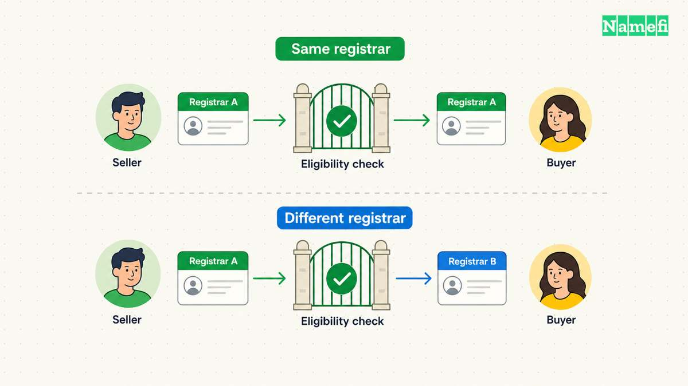

The buyer has agreed to your price. Before you send a transfer code, agree on what delivery means: which account will receive the domain, when payment is secured, and what the buyer must verify before the transaction closes.

The practical sequence is **agree on the handoff → confirm the payment milestone → transfer through the agreed route → verify control → complete settlement**. Keep website and email continuity on a separate checklist. A successful domain transfer is only one part of the handoff.

This guide begins after you have found a buyer. For pricing and finding prospects, start with [how to sell a domain name you own](/en/blog/how-to-sell-a-domain-name-you-own/).

## Choose the transfer route before changing contact details

There are two routes to investigate with your [registrar](/en/glossary/registrar/):

| Route | What the parties are arranging | What to confirm first |
| --- | --- | --- |
| Same-registrar account push | Delivery into the buyer’s account at the current registrar | Eligibility, recipient details, acceptance steps, and registrant changes |
| Transfer to another registrar | Moving the registration to the buyer’s chosen registrar | Eligibility, transfer authorization, fees, and how the buyer becomes the registrant |

An account push is provider-specific. For example, GoDaddy documents an account-to-account transfer that the recipient must accept. It says existing DNS settings remain, but connected website and email products do not move with the domain. [See the provider’s instructions.](#ref-account-push)

Check the order of operations carefully. ICANN’s published policy allows denial of certain transfers within 60 days of initial registration or a previous registrar transfer. A Change of Registrant can also trigger a 60-day inter-registrar lock; a registrar may offer an opt-out before that change. ICANN advises completing an intended registrar transfer before changing the registrant to avoid that lock when no opt-out applies. [Read the relevant policy sections.](#ref-transfer-locks)

These are gTLD policy rules, not a universal procedure for every extension. Ask both providers to confirm the route for your specific domain, particularly for a country-code extension. Do not promise that a push bypasses every restriction.

## Put payment and delivery instructions in one place

Create a shared closing note before either party starts the transfer. Include the exact domain spelling, buyer and seller identities, price and currency, fee split, receiving account, transfer route, and acceptance conditions. State whether the sale includes only the domain or also a website, content, email service, or other assets.

For an [escrow](/en/glossary/escrow/) transaction, follow the provider’s payment milestone. Escrow.com’s documented process instructs the seller to transfer after it verifies and secures the buyer’s payment. Its process then includes delivery, inspection, and payment to the seller. [That sequence is specific to its service.](#ref-escrow)

As a working precaution, check the transaction by signing in through your usual service address. Do not use a payment screenshot or an unexpected email as the sole reason to release the domain. If the payment status or instructions disagree with the closing note, resolve that discrepancy first.

Give the buyer access to the agreed domain through the registrar’s supported process. Keep your registrar password, unrelated domains, and personal recovery credentials out of the transaction.

## Execute the agreed handoff

For a same-registrar push, ask the buyer to prepare the receiving account. Confirm the recipient information through the communication channel you already use for the sale, then follow the registrar’s transfer and acceptance instructions. Check whether updating registrant details is a separate step.

For a cross-registrar transfer, confirm eligibility before requesting authorization. Follow the losing registrar’s unlocking process where applicable and provide the [AuthInfo code](/en/glossary/auth-code/) through the agreed secure channel. The buyer should initiate the receiving registrar’s process and complete its required confirmations. ICANN requires registrars without self-service facilities to provide the code within five calendar days of the registrant’s initial request. [See the AuthInfo requirements.](#ref-authinfo)

Do not treat “request submitted” as “delivered.” Keep the sale open until the receiving account shows the domain and the registrar confirms completion. If a transfer stalls, ask for the precise status and the next required action rather than repeatedly restarting it.

## Check website and email continuity separately

Before the handoff, record the current nameservers, DNS provider, and the records used by the website and email service. Agree who will maintain each service during the transition and who will pay for it afterward.

Use this practical acceptance checklist:

- The buyer sees the correct domain in the intended account.
- The registrar’s required registrant updates and confirmations are complete.
- The buyer can manage the settings and renewal arrangements they are supposed to control.
- The website and email services included in the agreement have been tested.
- Any DNS migration has its own agreed completion check.
- The buyer has recorded acceptance through the transaction service when appropriate.

Avoid making an unplanned nameserver change just to prove control. Arrange a low-impact verification method with the buyer or transaction provider instead. Also confirm whether existing DNS hosting continues after the transfer; do not infer that from the domain’s appearance in a new account.

For a domain-only sale, specify what happens to old mail and hosting. Do not assume the buyer is entitled to personal mailboxes or unrelated account data.

## Close with a receipt both parties can use

Keep the registrar completion notices, the buyer’s acceptance, the transaction reference, and the final payment record together. Record who now handles renewal, DNS, hosting, and email. Remove obsolete sale listings and seller access when doing so is consistent with the agreement and the completed settlement.

The useful closing question is: **Can the buyer operate what they bought, and can both parties show that the agreed exchange was completed?** If either answer is unclear, identify the missing check before declaring the sale finished.

## Sources and further reading

- GoDaddy — [Transfer my domain to another GoDaddy account](https://www.godaddy.com/help/transfer-my-domain-to-another-godaddy-account-822), opening eligibility/DNS paragraphs and recipient acceptance instructions. Fetched 2026-09-10; page served in Spanish during verification. No archive snapshot verified.
- ICANN — [Transfer Policy](https://www.icann.org/en/contracted-parties/accredited-registrars/resources/domain-name-transfers/policy), sections I.A.3.7.5–3.7.6, I.A.3.8.5, II.C.1.3 and II.C.2. Fetched 2026-09-10. No archive snapshot verified.
- ICANN — [Transfer Policy: AuthInfo requirements](https://www.icann.org/en/contracted-parties/accredited-registrars/resources/domain-name-transfers/policy#:~:text=5.2%20Registrars%20must%20provide), section I.A.5.2. Fetched 2026-09-10. No archive snapshot verified.
- Escrow.com — [How buying and selling domains works](https://www.escrow.com/domains/how-it-works), transaction steps. Fetched 2026-09-10. No archive snapshot verified.
