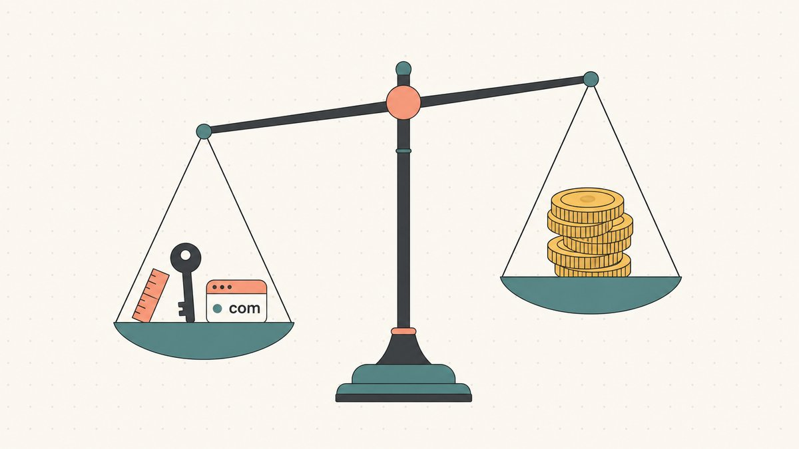
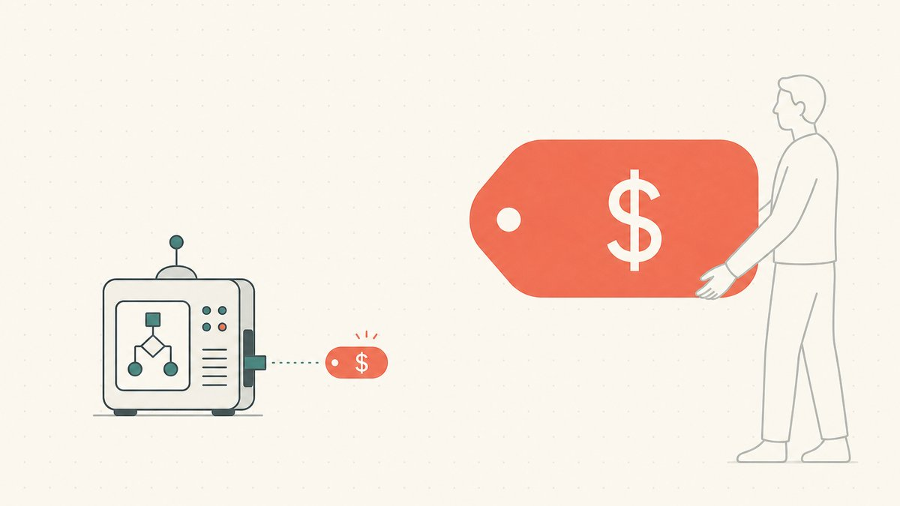

Sooner or later, everyone who owns a domain asks the same question: *what is my domain worth?* It's the first question a new flipper asks about an asset they just bought, and the last one they ask before they list it. It feels like it should have a clean, lookup-table answer — type the name in, get a number.

It doesn't. The honest answer is uncomfortable but freeing once you accept it: **a domain is worth what an [end user](/en/glossary/end-user/) will actually pay for it, and everything else is an estimate.** A tool's number, a comparable sale, your own gut — those are all attempts to predict that one real transaction. This guide walks through how professionals build that estimate: the factors that drive value, what automated tools are good for and where they break, how to read [comparable sales](/en/blog/how-to-read-comparable-domain-sales/), and why the same name can carry two completely different prices. It's the appraisal pillar for our wider guide to [domain flipping](/en/blog/domain-flipping/).

## A practical domain valuation process

1. **Define the buyer and time horizon.** Estimate an end-user asking range separately from a price intended to attract another reseller quickly.
2. **Collect comparable completed sales.** Match extension, naming structure, use case, and transaction date. Keep asking prices out of the completed-sales set.
3. **Evaluate the name itself.** Test spelling, pronunciation, meaning, and whether plausible buyers can actually use it. Availability of a domain does not settle trademark clearance.
4. **Record demand evidence.** Document relevant businesses, inquiries, or verified traffic; do not invent demand to justify a preferred number.
5. **Subtract holding and selling costs.** Renewal quotes and fees determine what a sale would leave after the wait.
6. **Use automated appraisals as another input.** Compare their results with your evidence and retain a range when the evidence is thin.

This is an evaluation method, not a formula that guarantees a sale. The sections below explain where its inputs can mislead you.

## What "value" even means for a domain

Before choosing a number, decide what you are estimating: an asking price, a likely negotiated sale, or an amount another reseller might pay. An appraisal is an estimate, while a completed sale records what particular parties agreed under particular terms.

Public sales databases can help, but a database cannot tell you the undisclosed terms of a private transaction. Note whether a reported price covers the domain alone, a website, a business, or a package of assets. The useful comparison is the one whose scope you understand.

## The factors that actually move a domain's price

Every appraisal, human or automated, is weighing roughly the same handful of fundamentals. Internalize these and most names sort themselves quickly.

**Length.** Treat brevity as one input, not a universal ranking rule. Fewer characters are easier to remember, type, say, and fit on a business card. One-word and short two-word names sit at the top; long, hyphenated, or number-padded strings sit at the bottom.

**The word itself.** This is the single biggest lever, and it has three tests. Is it a *real* word or an established term, not a made-up smash of letters? Is it *searched* — does it map to something people actually look for, with real commercial demand behind it? And is it *spoken* cleanly — can you say it out loud and have someone land on it without spelling it? A name that passes all three (`cars`, `loans`, `cloud`) is a different asset class from one that passes none.

**The extension.** Compare sales within the same [TLD](/en/glossary/tld/) before using a sale from another extension. A developer's use for [`.io`](/en/tld/io/) can differ from an AI product's use for [`.ai`](/en/tld/ai/) or a broader brand's use for [`.co`](/en/tld/co/). The exact name, audience, and renewal terms matter alongside the suffix. We unpack those inputs in [how the TLD affects domain value](/en/blog/how-tld-affects-domain-value/).

**Keyword and commercial intent.** A word tied to a transaction is worth more than a word tied to a hobby. `insurance`, `mortgage`, and `casino` are perennially expensive because each click can convert into real revenue for the owner. The closer a name sits to a moment where money changes hands, the more an end user will pay to own that front door — this is where [SEO](/en/glossary/seo/) value and brand value overlap.

**Brandability.** Not every valuable name is a dictionary word. A brandable name can be an ordinary word used in a new context or an invented word. Evaluate pronunciation, spelling, and product fit separately from [trademark](/en/glossary/trademark/) clearance; a distinctive sound does not establish legal availability. Brandability is the value a startup pays for when no exact-match keyword name is available or affordable.

**Extension stability.** A subtler factor flippers learn the hard way: the *durability* of the extension is part of the price. A country-code TLD is governed by a country, and that introduces risk a `.com` doesn't carry — the standing example being the open question hanging over `.io` in connection with Chagos sovereignty negotiations, which we cover in [why .io domains are expensive](/en/blog/why-are-io-domains-expensive/) and across our [ccTLD market-share breakdown](/en/blog/cctld-market-share-by-registration-volume/). Price the country in, not just the letters.

## Automated appraisal tools: what they're for, where they break

The first thing most people do is paste a name into an automated appraiser — GoDaddy's valuation tool, Estibot, or one of the many "domain value calculators." These are genuinely useful, and it helps to know what they're doing. GoDaddy describes its tool plainly: its [algorithm uses proprietary machine learning and real market sales data to estimate domain values, providing you with comparable domain name sales](https://www.godaddy.com/resources/skills/godaddy-domain-name-value-appraisal-tool#:~:text=algorithm%20uses%20proprietary%20machine%20learning%20and%20real%20market%20sales%20data%20to%20estimate%20domain%20values). In other words, it scores your name against a large database of prior sales and the same fundamentals listed above.

That makes automated tools good at a few specific jobs: triaging a big list quickly, sanity-checking whether a name is plausibly worth four figures versus two, and surfacing [comparable sales](/en/glossary/comparable-sales/) you might not have found yourself. As a *first filter*, they earn their keep.

Where they break is the thing that matters most: the **end user**. An algorithm doesn't know that a specific regional dentist desperately wants the exact-match `.com` of their town, or that a funded startup just rebranded and needs your one-word name this quarter. It can't see intent, timing, or strategic fit — factors that can make an individual buyer's offer differ from a model estimate. As an industry rule of thumb, automated appraisals are best treated as a wide, directional range rather than a price; experienced flippers routinely see real sales land well above or below the machine number, in both directions. Use the tool to *bracket* a name, never to *price* it. For a hands-on comparison of how the major tools differ and where each is strongest, see [domain appraisal tools compared](/en/blog/domain-appraisal-tools-compared/).

## Comparable sales: anchoring a price to reality

If automated tools are the first filter, comparable sales ("comps") are how professionals actually anchor a number. The logic is the same one real-estate appraisers use: find what *similar* assets recently sold for, then adjust for how your asset differs.

Search public sales records for names structurally like yours: the same length class, keyword family, extension, and intended use. Record the reported date, venue, and sale scope alongside each amount so that your range can be traced back to its inputs.

Two cautions keep comps honest. First, **the public record contains only the transactions reported to it.** Missing private deals limit what you can infer from the available examples. Second, **no two domains are truly identical**, so every comp needs adjustment — `flowers.com` is not `flowerz.net`, even though a naive match would pair them. The skill is in the adjusting, which is why we wrote a dedicated guide on [how to read comparable domain sales](/en/blog/how-to-read-comparable-domain-sales/) without fooling yourself.

A famous sale needs the same source discipline. GetYourDomain.com [announced a USD 70 million AI.com sale](https://www.prnewswire.com/news-releases/getyourdomaincom-brokers-the-70-million-sale-of-aicom-the-largest-domain-name-transaction-in-history-302682315.html#:~:text=successfully%20brokered) in February 2026; [AI.com's own launch announcement](https://ai.com/company-news/ai-com-launch#:~:text=Since%20acquiring) places its acquisition in 2025. MicroStrategy's [Voice.com announcement](https://www.sec.gov/Archives/edgar/data/1050446/000119312519175320/d724928dex991.htm#:~:text=consummated%20on%20May) records USD 30 million in cash and a May 30, 2019 completion date. Keep announcement dates separate from acquisition dates, and treat these as exceptional transactions rather than automatic comparables for an ordinary name.

## End-user price vs. reseller price: why one name has two numbers

This is the concept that confuses more new flippers than any other, so be precise about it. The same domain has two legitimate, very different prices depending on *who's buying*:

- **End-user (retail) price** is what the business that will actually *use* the name pays. They're not buying an asset to resell; they're buying the front door to their company, and they price it against what a name like that is worth to *their* operation. This is the high number.
- **[Reseller](/en/glossary/reseller/) (wholesale) price** is what another investor pays you, knowing they have to resell it later at a profit. They're buying inventory, so they bake in their margin, their holding costs, and the risk it sits unsold. This is the low number.

The gap between them is the **spread**, and it's the entire business model of flipping: buy at or near wholesale, sell at retail. As a working rule of thumb (not a fixed law), end-user prices commonly run several multiples of wholesale for the same name — which is exactly why a reseller comp and an end-user comp for an identical string can look like they're describing two different assets. They are, in a sense: they're pricing two different *buyers*. When you appraise, always ask which number you're estimating. A price that's right for a wholesale flip is wrong for an end-user sale, and vice versa. We dig into the full mechanics in [end-user vs reseller domain pricing](/en/blog/end-user-vs-reseller-domain-pricing/), and into converting a value into a closed deal in [how to sell a domain name you own](/en/blog/how-to-sell-a-domain-name-you-own/).

## Common appraisal mistakes

Most bad valuations come from a short list of repeat offenders:

**Pricing on hope.** The most common error: anchoring to the one stratospheric comp you found and ignoring the hundred ordinary ones. Voice.com sold for $30 million; your two-word `.net` did not just become a million-dollar name. Price to the *distribution* of comps, not the dream at the top of it.

**Ignoring renewal cost.** A domain isn't a one-time purchase — it's a subscription. Every name you hold costs money every year, and premium extensions or [registry](/en/glossary/registry/)-tiered names can carry steep renewals. A sale that looks profitable before several years of renewals can leave little after costs. Net the carry cost out of every appraisal.

**Confusing traffic with value — and missing when it *is* value.** This one cuts both ways. [Type-in traffic](/en/glossary/type-in-traffic/) and existing search rankings can be real, payable value — when QuinStreet bought CarInsurance.com for [$49.7 million in cash](https://www.globenewswire.com/news-release/2010/11/08/433738/12254/en/QuinStreet-Announces-Acquisition-of-CarInsurance-com-Inc.html#:~:text=for%20%2449.7%20million%20in%20cash), Domain Name Wire reported that [the value comes primarily from the organic traffic the site receives and how that converts into leads](https://domainnamewire.com/2010/11/09/quinstreet-bought-carinsurance-com-for-the-organic-traffic/#:~:text=the%20value%20comes%20primarily%20from%20the%20organic%20traffic). But notice what that means: at that point you're appraising a *business* — traffic, leads, conversion — not a *name*. The mistake is pricing a bare, parked domain *as if* it carried that traffic. If the value is in the visitors, value the visitors and verify them; if it's in the name, value the name. Don't quietly charge for one and deliver the other.

## Once you know the value: protecting the deal at closing

Appraisal answers "how much." It doesn't answer the harder operational question that follows: how do both sides actually trade a five- or six-figure name without one of them getting hurt? The buyer has to wire money before they truly control the asset; the seller has to release control before they've confirmed the money. That trust gap is where high-value [domain trading](/en/glossary/domain-trading/) gets risky, and it's separate from — and downstream of — getting the price right. (We've watched that gap play out in real rebrands, like the [TeslaMotors.com to Tesla.com](/en/blog/from-teslamotors-com-to-tesla-com/) acquisition.)

This is the gap [Namefi](https://namefi.io) is built to close. Tokenizing a real [ICANN](/en/glossary/icann/) domain makes ownership easier to verify and transfer, so the token handoff can be audited while registrar transfer requirements and DNS continuity still need separate verification — the appraisal tells you the number, and a clean transfer protects both sides once you've agreed on it. Value the name honestly; then make the trade safe.

## Sources and further reading

- GetYourDomain.com — [AI.com sale announcement](https://www.prnewswire.com/news-releases/getyourdomaincom-brokers-the-70-million-sale-of-aicom-the-largest-domain-name-transaction-in-history-302682315.html#:~:text=successfully%20brokered), broker-reported amount and February 2026 announcement. Fetched 2026-09-15.
- AI.com — [Launch announcement](https://ai.com/company-news/ai-com-launch#:~:text=Since%20acquiring), 2025 acquisition date. Fetched 2026-09-15.
- MicroStrategy — [Voice.com sale announcement, SEC Exhibit 99.1](https://www.sec.gov/Archives/edgar/data/1050446/000119312519175320/d724928dex991.htm#:~:text=consummated%20on%20May), price and completion date. Fetched 2026-09-15.

- GetYourDomain.com via PR Newswire — [AI.com sale announced at $70M](https://www.prnewswire.com/news-releases/getyourdomaincom-brokers-the-70-million-sale-of-aicom-the-largest-domain-name-transaction-in-history-302682315.html)
- AI.com — [2026 launch announcement (domain acquired in 2025)](https://ai.com/company-news/ai-com-launch)
- GlobeNewswire — [QuinStreet Announces Acquisition of CarInsurance.com, Inc.](https://www.globenewswire.com/news-release/2010/11/08/433738/12254/en/QuinStreet-Announces-Acquisition-of-CarInsurance-com-Inc.html#:~:text=for%20%2449.7%20million%20in%20cash) ($49.7M cash)
- Domain Name Wire — [QuinStreet Bought CarInsurance.com for the Organic Traffic](https://domainnamewire.com/2010/11/09/quinstreet-bought-carinsurance-com-for-the-organic-traffic/#:~:text=the%20value%20comes%20primarily%20from%20the%20organic%20traffic)
- GoDaddy — [Domain Name Value & Appraisal: a domain valuation tool](https://www.godaddy.com/resources/skills/godaddy-domain-name-value-appraisal-tool#:~:text=algorithm%20uses%20proprietary%20machine%20learning%20and%20real%20market%20sales%20data%20to%20estimate%20domain%20values) (machine learning + real market sales data)
