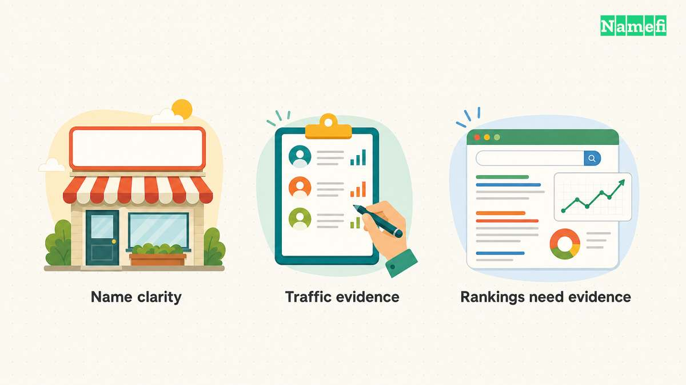
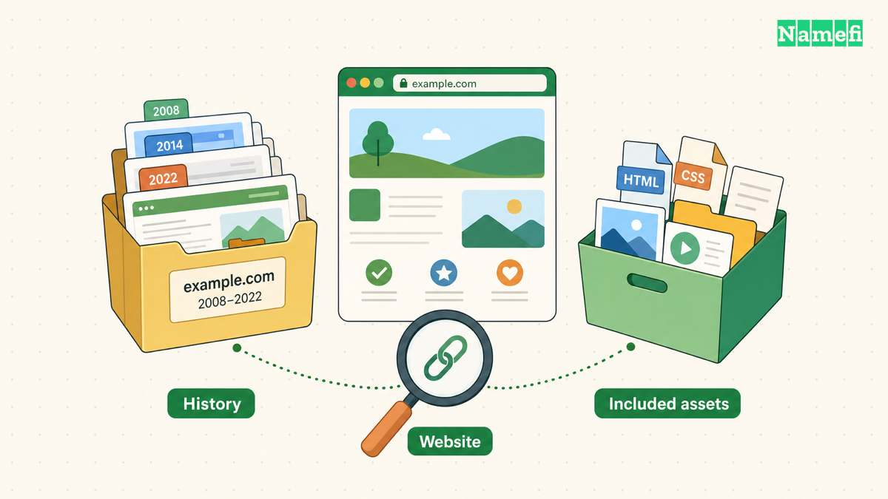
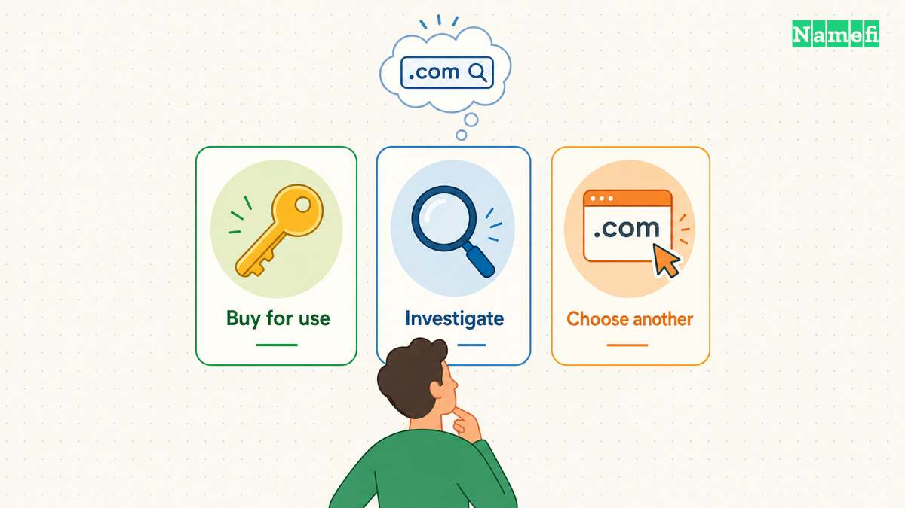

A keyword domain may describe your business clearly. That does not make it a shortcut to the top of Google.

Google says words in domain names are one of many factors used to judge relevance. It also has an exact-match domain system designed to prevent domains that match particular queries from receiving too much credit. [Read Google’s explanation.](#ref-google-emd)

That gives a buyer a useful starting point: evaluate the name as a business address, then evaluate any traffic or search claims separately. Do not make the purchase depend on a ranking improvement you cannot verify.

## What are you actually paying for?

A [keyword domain](/en/glossary/keyword-domain/) contains words describing a topic, product, or service. An exact-match name follows a particular query closely. Whether it is exact-match depends on the query you are comparing it with; the label is not a quality rating.

As an illustration, consider a hypothetical bicycle repair shop choosing between a descriptive phrase, an invented brand name, and a combination of a brand with a service word. None of these examples represents an available domain or a measured ranking outcome.

The descriptive phrase gives the shop something concrete to test: can a new customer understand the service from the address? The invented name raises a different question: can the shop explain and establish that identity comfortably? A combined name lets the owner test whether the added context is worth the extra length.

Use those questions to separate possible benefits:

| Potential value | Evidence to seek before paying for it |
| --- | --- |
| Clear service description | Feedback from prospective customers shown the name |
| Easier spoken referrals | What listeners type after hearing the address |
| Existing visitors | Dated analytics with sources, landing pages, and exclusions |
| Existing search visibility | Query-and-page evidence for the site currently operating there |
| Fit for a long-term brand | Whether the address still suits your planned business scope |

Treat each benefit as a hypothesis until you have evidence. Search demand for a phrase does not tell you how many people visit a matching domain, and a seller’s label of “SEO domain” does not answer either question.

## Separate the name from the site’s history

When a seller shows rankings, ask what is included in the sale. Is there an operating website with content, or are you buying only the registration? Which pages receive the impressions? What will remain after the handoff?

Request a consistent reporting period and identify the market being measured. For example, ask for country, search type, query, page, clicks, and impressions together rather than accepting an isolated position screenshot. Use the evidence to describe the current site, not to promise the performance of the site you plan to build.

Review historical uses of the domain and ask the seller to explain material changes in topic. If an expired domain is being pitched mainly as a way to reuse old search signals for low-value content, compare that plan with Google’s policy: it defines expired domain abuse as buying and repurposing an expired name primarily to manipulate rankings while providing little or no value to users. [See the policy.](#ref-expired-abuse)

This does not mean every previously registered domain is unsuitable. It means your plan needs a useful purpose beyond inheriting a name’s past. Ask what you will publish, who it will help, and why that content belongs at this address.

Also check whether the phrase could conflict with another business’s mark. Descriptive wording is not an automatic clearance result. In the United States, similarity and related goods or services are part of the USPTO’s confusion analysis. [See the guidance.](#ref-trademarks)

## Make the decision without assuming an SEO uplift

Write a purchase case that still works if Google gives you no incremental benefit for the words in the domain. This is a conservative planning assumption, not a prediction of Google’s treatment.

For the hypothetical repair shop, the case might be: “The address describes our service, listeners can reproduce it, and the total cost fits our launch budget.” That could justify considering the name. “The address contains our keyword, so it should rank first” cannot carry the same weight.

Compare the seller’s quoted price and recurring costs with an acceptable alternative. Include transfer costs and any work needed to move an existing site. Keep the currency explicit. If your case depends on existing traffic, distinguish what has been observed from what you expect to retain.

Then make one of three decisions:

- **Buy for a demonstrated business use.** The address solves an identified naming or customer-communication problem at an acceptable cost.
- **Investigate before committing.** The seller’s traffic or search claims matter to your price, but the underlying evidence is incomplete.
- **Choose an alternative.** The premium only makes sense if an unsupported ranking promise comes true.

You do not need to reject descriptive names to be skeptical of SEO claims. You need to know which part of the purchase case is supported. Before negotiating, work through [how to value a domain name](/en/blog/how-to-value-a-domain-name/) and keep the asking price separate from your own valuation.

## Sources and further reading

- Google Search Central — [Exact match domain system](https://developers.google.com/search/docs/appearance/ranking-systems-guide#exact-match-domain), in the ranking systems guide. Fetched 2026-09-10. No archive snapshot verified.
- Google Search Central — [Expired domain abuse](https://developers.google.com/search/docs/essentials/spam-policies#expired-domain-abuse). Fetched 2026-09-10. No archive snapshot verified.
- USPTO — [Likelihood of confusion](https://www.uspto.gov/trademarks/search/likelihood-confusion), “Related goods and services.” Fetched 2026-09-10. No archive snapshot verified.
