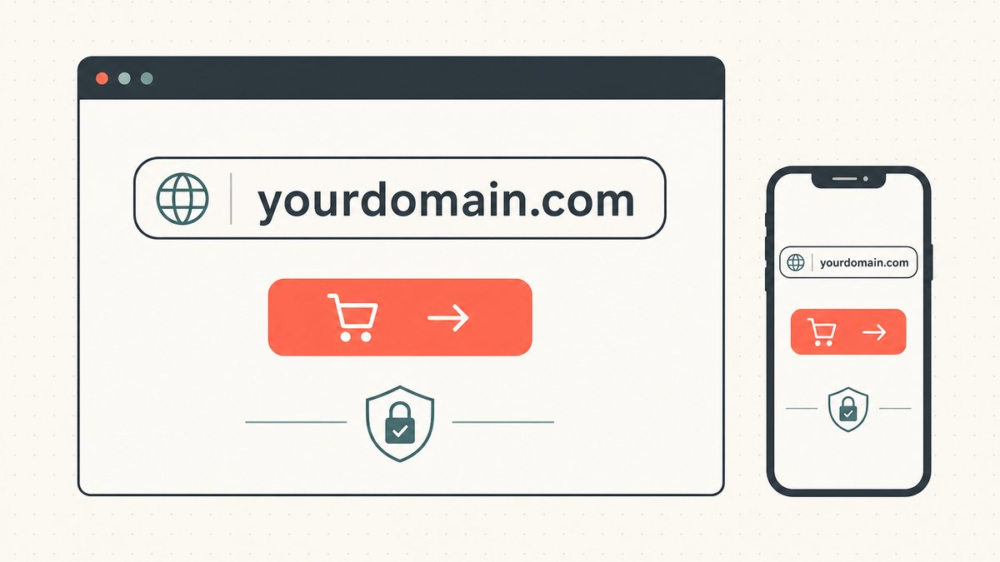

You can own the perfect name and still never sell it. Appraisal tells you what a domain is worth; marketing is what closes the gap between that number and a buyer who has never heard of you. Most names in a flipper's portfolio don't sell because nobody who needs them ever finds out they're available. The fix is rarely a louder pitch. It's putting the name where the right buyer is already looking.

This guide covers the inbound side of selling: the marketing layer that makes a name discoverable and signals, clearly and early, that it's for sale. Three channels do most of the work — the parking page, the for-sale landing page, and the way your listing shows up in search. Get those right and a meaningful share of your sales will arrive without you sending a single email. It's a pillar in our wider guide to [domain flipping](/en/blog/domain-flipping/), and it pairs with the outbound discipline of [how to sell a domain name you own](/en/blog/how-to-sell-a-domain-name-you-own/).

## Inbound vs outbound: two ways a name finds a buyer

There are only two directions a sale can come from. **Outbound** is you reaching out — researching likely buyers and pitching them directly. **Inbound** is the buyer reaching you — they type your domain into a browser, search for it, or stumble onto your listing, see it's for sale, and start the conversation.

Marketing your domains for sale is the inbound machine. Its whole job is to convert the attention a name already attracts into an inquiry. A surprising amount of that attention is free: people type memorable domains directly into the address bar to see what's there, and a name with any history may still pull traffic or rank for something. Every one of those visitors is a potential buyer who arrived on their own. The only question is whether your page tells them the name is for sale and makes it trivial to act. If it shows a [registrar](/en/glossary/registrar/) error or a blank holding page, that intent evaporates. Inbound marketing is about never wasting a visitor.

## Channel one: the parking page

The default state of an unused domain is parked. As Wikipedia defines it, [domain (TLD) parking is the registration of an Internet domain name without that domain being associated with any services such as e-mail or a website](https://en.wikipedia.org/wiki/Domain_parking#:~:text=is%20the%20registration%20of%20an%20Internet%20domain%20name%20without%20that%20domain%20being%20associated%20with%20any%20services). A parked name typically [resolve[s] to a web page containing advertising listings and links](https://en.wikipedia.org/wiki/Domain_parking#:~:text=resolve%20to%20a%20web%20page%20containing%20advertising%20listings%20and%20links), and the holder is usually [paid based on how many links have been visited (e.g. pay per click)](https://en.wikipedia.org/wiki/Domain_parking#:~:text=paid%20based%20on%20how%20many%20links%20have%20been%20visited). Most registrars run their own systems for this — as Wikipedia notes, [some hosters such as Godaddy have their own domain parking systems and allow unused domains to be parked with the registrant receiving a share of the PPC revenue](https://en.wikipedia.org/wiki/Domain_name_speculation#:~:text=have%20their%20own%20domain%20parking%20systems).

For a flipper, parking does two jobs at once, and it's worth being honest about which one matters. The first is monetization: ad clicks defray your renewal costs. On a name with real type-in traffic that revenue can be meaningful, but on the average hand-registered name it's pennies, and treating parking as an income strategy is a beginner's mistake. The second job is the one that actually moves names: a parking page is a place to plant a "for sale" message in front of every visitor who lands on the domain. The most valuable thing a parked page does is convert a curious visitor into a buyer, not earn a few cents from one who clicks an ad and leaves. We go deeper on the revenue mechanics in [domain parking and monetization](/en/blog/domain-parking-and-monetization/).

The practical rule: never leave a flippable name on a generic ad-only park. If the page doesn't make the for-sale status obvious, you've turned free buyer attention into someone else's ad revenue.

## Channel two: the for-sale landing page

This is where most inbound sales are won or lost. A for-sale landing page (a "lander") is a page built for one purpose — to tell a visitor the name is available and make acting on it effortless. GoDaddy describes its version plainly: [a For Sale Lander for your domain listing lets interested buyers know your domain is for sale and provides all the information they need to purchase your domain](https://www.godaddy.com/help/add-a-for-sale-lander-to-my-domain-listing-41624#:~:text=lets%20interested%20buyers%20know%20your%20domain%20is%20for%20sale%20and%20provides%20all%20the%20information%20they%20need%20to%20purchase). That sentence is the entire spec. Everything good about a lander follows from it.

A few things separate a lander that converts from one that loses the visitor:

- **State the obvious immediately.** The domain name, the words "for sale," and a way to act should be visible without scrolling. A buyer who has to hunt for whether the name is even available will leave.
- **Pick a clear price posture.** Either show a Buy-It-Now price or invite an offer, and be deliberate about which. A fixed price removes friction and closes fast on lower-value names; "make an offer" is the norm for premium names where you'd rather negotiate than cap your upside. Don't make the visitor guess what you want.
- **Capture the inquiry with as little friction as possible.** A one-field offer box or a buy button beats a long contact form. Every extra step is a buyer you lose.
- **Build trust at the moment of payment.** A serious buyer's first worry is getting scammed. Naming a neutral [escrow](/en/glossary/escrow/) path on the page calms that instantly — we cover the mechanism in [domain escrow explained](/en/blog/domain-escrow-explained/).
- **Make it work on a phone.** A large share of this traffic is mobile, and a lander that's unreadable on a small screen quietly throws away inquiries.

The full anatomy of a high-converting page — layout, copy, price display, and the offer flow — is its own topic, covered in [domain for sale landing pages](/en/blog/domain-for-sale-landing-pages/). For now, the takeaway is that the lander is not decoration. It is the single highest-leverage piece of marketing you control, because it's the one page every inbound buyer sees.

## Channel three: marketplaces and listing SEO

A lander captures buyers who already found the name. Marketplaces are how buyers find it in the first place. The [domain aftermarket](/en/glossary/domain-trading/) is, in Wikipedia's words, [the secondary resale market for Internet domain names in which a party interested in acquiring a domain that is already registered bids or negotiates a price](https://en.wikipedia.org/wiki/Domain_aftermarket#:~:text=the%20secondary%20resale%20market%20for%20Internet%20domain%20names), and most of it runs through a handful of platforms: [transactions are facilitated by aftermarket platforms such as Afternic and Sedo](https://en.wikipedia.org/wiki/Domain_aftermarket#:~:text=Transactions%20are%20facilitated%20by%20aftermarket%20platforms%20such%20as%20Afternic%20and%20Sedo). Listing on a major [marketplace](/en/glossary/marketplace/) puts your name into a network of buyers, brokers, and partner registrars you could never reach alone, and it's where serious buyers go to look first.

That market is large enough to take seriously. Per the figures cited on Wikipedia, [according to NameBio, 144,700 domain name sales totaling US$185 million were recorded in 2024](https://en.wikipedia.org/wiki/Domain_aftermarket#:~:text=144%2C700%20domain%20name%20sales%20totaling%20US%24185%20million%20were%20recorded%20in%202024) — and the demand concentrates hard on the default extension: [sales of .com domains accounted for 74.4% of the year's total dollar volume](https://en.wikipedia.org/wiki/Domain_aftermarket#:~:text=accounted%20for%2074.4%25%20of%20the%20year%27s%20total%20dollar%20volume). That's a marketing signal in itself. A clean [`.com`](/en/tld/com/) listing competes in the deepest, most liquid pool of buyers; a name on a thinner extension like [`.xyz`](/en/tld/xyz/) or even a strong developer [TLD](/en/glossary/tld/) like [`.io`](/en/tld/io/) needs sharper targeting and more patience to find its narrower audience.

Then there's the part most flippers ignore: **how your listing gets found in search.** When a buyer searches the exact name, or a phrase like "[name] for sale," your listing or lander should be the result they land on. That's [SEO](/en/glossary/seo/) applied to a single product page — a clean, indexable page with the domain in the title, an unambiguous for-sale signal, and a price or offer path. The same fundamentals that help any page rank apply to a domain listing, and getting them right means the buyer who's already searching for your exact name actually finds your page instead of a competitor's. We dig into the specifics in [marketplace SEO for domain listings](/en/blog/marketplace-seo-for-domain-listings/).

## A few rules that keep marketing from becoming spam

The inbound channels above are mostly safe by design — the buyer comes to you. The risk shows up the moment you push outward, and it's worth stating the line clearly because crossing it costs you more than a sale.

The first rule is precision over volume. One well-researched message to a buyer with an obvious need for the name will outperform a thousand blasted to a keyword-matched mailing list, and the blast is how outreach becomes spam that gets you blocked. The second rule is to never market a name you shouldn't own. Aggressively advertising a domain that leans on someone else's trademark doesn't just risk a [UDRP](/en/glossary/udrp/) complaint — it documents your intent to profit from it. Marketing makes a clean name more findable and a dirty name more indefensible. Keep the portfolio clean first; the deepest treatment of that line is in [what is UDRP](/en/blog/what-is-udrp/). The third rule, mostly about etiquette: answer inquiries fast and like a human. A slow or robotic reply to a real buyer is a sale you let cool.

One honest caveat on the numbers floating around this space. You'll see confident claims that landers lift inquiries by some specific percentage, or that a given share of aftermarket sales start from direct navigation. Treat those as vendor rules of thumb, not measured fact — the underlying data is rarely public or independently verified. The principle holds regardless: a clear for-sale page beats a blank one, and a listed name beats an unlisted one. You don't need a statistic to act on that.

## How the channels work together

These three channels aren't alternatives; they're a funnel. The marketplace listing and listing SEO bring buyers in. The lander converts them into an inquiry. The parking page makes sure even an accidental visitor — someone who just typed the name to see what's there — gets pulled into the same funnel instead of hitting a dead end. Set up well, the system runs while you sleep, and your outbound effort goes only toward the highest-value names that deserve a personal pitch.

The honest expectation: even a great marketing setup won't sell most of a hand-registered portfolio, because marketing can't manufacture demand for a name nobody wants. What it does is guarantee that the names people *do* want sell, and sell faster, instead of dying quietly behind a holding page. That alone is the difference between a portfolio that turns over and one that just accrues renewal bills — which is exactly why this sits alongside the rest of the [domain flipping](/en/blog/domain-flipping/) skill stack.

## The Namefi angle

Marketing gets a buyer to "yes." The next problem is settlement, and it's where high-value inbound deals get nervous: the buyer found your lander, agreed on a price, and now neither side wants to move first. The seller won't transfer before payment; the buyer won't pay before transfer. The better your marketing works, the more often you hit exactly this standoff on a name worth real money.

This is the gap [Namefi](https://namefi.io) is built to narrow. Tokenized ownership makes control of a real [ICANN](/en/glossary/icann/) domain easier to verify and transfer, with [DNS](/en/glossary/dns/) continuity so the name keeps resolving cleanly through the handover — no dark window where a live site goes down mid-deal. Market the name well to create the demand; then make the close itself something a first-time buyer can trust.

## Friendly Disclaimer (Read Me!)

> We're not lawyers, accountants, financial advisors, or doctors, and **nothing in this article is legal, financial, tax, accounting, medical, or any other flavor of professional advice.** We write these posts to educate ourselves and as a convenience for our customers. Info here may be out of date, geography-specific, or just plain wrong. We make mistakes too.
>
> For any important decision, **please consult a real professional (seriously!)**. Or if that's not your vibe, ask a friend, ask Twitter, ask Reddit, ask an AI, or ask a psychic. In short: **DOYR - Do Your Own Research**. Let's learn and have fun.

## Sources and further reading

- Wikipedia — [Domain parking (definition; advertising listings and links; pay-per-click revenue)](https://en.wikipedia.org/wiki/Domain_parking#:~:text=is%20the%20registration%20of%20an%20Internet%20domain%20name%20without%20that%20domain%20being%20associated%20with%20any%20services)
- Wikipedia — [Domain name speculation (registrar parking systems and PPC revenue share)](https://en.wikipedia.org/wiki/Domain_name_speculation#:~:text=have%20their%20own%20domain%20parking%20systems)
- GoDaddy — [Add a For Sale Lander to my domain listing (what a for-sale lander does)](https://www.godaddy.com/help/add-a-for-sale-lander-to-my-domain-listing-41624#:~:text=lets%20interested%20buyers%20know%20your%20domain%20is%20for%20sale%20and%20provides%20all%20the%20information%20they%20need%20to%20purchase)
- Wikipedia — [Domain aftermarket (definition; Afternic and Sedo; NameBio 144,700 sales / US$185M in 2024; .com = 74.4% of dollar volume)](https://en.wikipedia.org/wiki/Domain_aftermarket#:~:text=the%20secondary%20resale%20market%20for%20Internet%20domain%20names)
