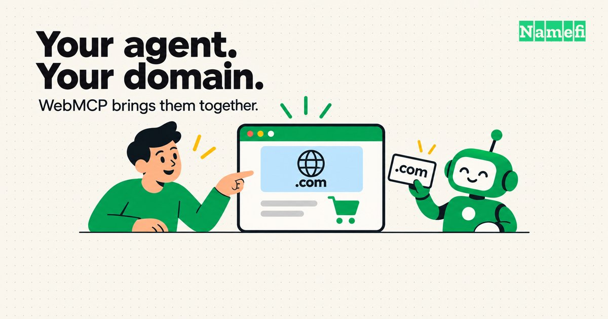
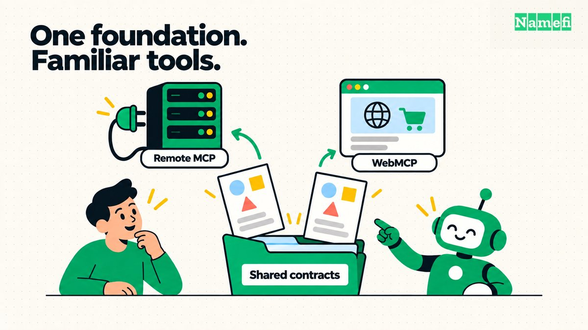
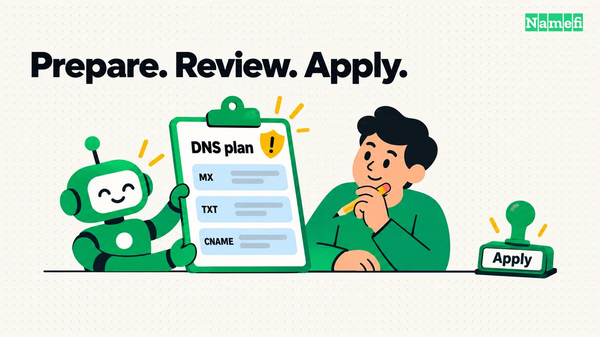

*Bring your agent to the domain page you’re already using.*

Namefi already has an MCP server, a CLI, and authentication for agents and automation. WebMCP brings that work onto the website, where you and your agent can use the same page.

## From MCP and the CLI to the website

We already give agents several ways to work with Namefi. Our [MCP server](https://namefi.io/mcp) exposes domain operations as callable tools, and our [command-line tool](https://namefi.io/cli) lets people, scripts, and agents work from the terminal. The CLI includes domain and dynamic DNS workflows, plus commands generated from our API for operations beyond those everyday tasks.

Authentication is already part of that setup. MCP clients can connect using OAuth or an API key. The CLI supports browser-based login, a headless login option, and API keys for automation. Those paths let users authorize access to their account and give developers a practical foundation to build on.

We also package the MCP connection with guidance for agents in our plugins for [Codex](https://github.com/d3servelabs/namefi-codex-plugins), [Claude Code](https://github.com/d3servelabs/namefi-claude-plugins), [ZCode](https://github.com/d3servelabs/namefi-zcode-plugins), and [Antigravity](https://github.com/d3servelabs/namefi-antigravity-plugins). Our [plugin setup guide](https://namefi.io/mcp#plugins) includes installation steps and the shared marketplace setup for opencode.

We wanted people to be able to use their agents directly on our website as well. If you’re already looking at a domain in Namefi, you should be able to ask your agent to help with it right there. The agent can work with the page you have open, and you can see the result in the interface you already know.

That’s where WebMCP comes in.

## What WebMCP brings to Namefi

WebMCP is a proposed web standard that lets a website tell an [AI agent](/en/glossary/ai-agent/) what it can do and how to do it. A domain registrar can expose actions such as searching for a name, reading DNS records, or updating a cart. The agent gets a defined operation with clear inputs, reducing the work of interpreting buttons, opening menus, and filling out forms. [Google Chrome’s WebMCP overview](https://developer.chrome.com/docs/ai/webmcp) explains the approach and its current experimental status.

As a domain registrar and AI tool provider, we want the work of finding, using, and selling domains to fit naturally into the tools people already use. On the website, that means your agent can help while the search results, cart, and proposed DNS changes remain visible to you.

OpenAI calls this capability **site tools** in the ChatGPT desktop app. Its [official guide to using site tools](https://help.openai.com/en/articles/20001423-using-site-tools-in-the-chatgpt-desktop-app) describes how ChatGPT discovers tools on the page and works with its current state and signed-in session. Availability depends on your account, selected model, and the website. ChatGPT’s site tools run in its built-in browser; Chrome’s WebMCP implementation is a separate way to explore the standard.

Namefi’s WebMCP tools cover two workflows: [DNS management](/en/glossary/dns/) and domain search with cart operations.

## Shared contracts across interfaces

The implementation builds on the same contract-driven approach as our remote MCP server, whose tools are derived from existing API procedures. A contract is the definition of an operation: what information it accepts and the rules that information must satisfy. Keeping those definitions together helps us avoid maintaining a separate version of the same rules for every interface.

We carried that approach into WebMCP. The browser tools reuse our shared cart contracts and the operations already used by the visible cart. For DNS, they reuse the proposal schema and validation-and-review flow behind our DNS setup assistant. A small shared adapter connects those definitions to browser tools and validates their inputs before execution.

The remote MCP connection and the browser integration still have different jobs. Remote MCP gives an agent a connection to Namefi’s backend. WebMCP gives it selected actions within the page you have open, using the app’s existing session and state. The shared foundation is in the contracts and operations; the browser doesn’t need to route its work through the remote MCP server.

*Shared contracts provide a foundation for different interfaces; each keeps its own way of connecting.*

## Preparing DNS changes for review

DNS made the benefit especially easy to see.

In our first recording, we asked an agent to add the DNS records supplied for a Gmail setup without WebMCP available. It succeeded, but it had to inspect the interface, work out the form controls, and add the records individually. Anyone who has copied an email provider’s setup instructions into a registrar dashboard will recognize the process.

[Watch: setting up Gmail DNS without WebMCP](https://www.loom.com/share/af6636b401984c7bbdf4f0e49977464e)

With WebMCP available, the same kind of request takes a more direct path. The agent could read the current DNS records and settings through a tool, then submit the proposed changes to Namefi’s existing review flow. It no longer had to enter every proposed record through an individual form.

[Watch: setting up Gmail DNS with WebMCP](https://www.loom.com/share/a96e2775e66e43f683fd8747af6e1e05)

The DNS tool stages a plan. It doesn’t apply that plan itself. Namefi validates the proposals, puts accepted changes into the visible review panel, and keeps applying them as a separate, explicit action in the interface. That distinction matters when a change can affect someone’s website or email.

We also mark the DNS plan tool with WebMCP’s new `consequentialHint` annotation. It signals that the operation deserves extra attention, so supporting browsers and agents can require confirmation before invoking it. [Chrome’s tool annotation documentation](https://developer.chrome.com/docs/ai/webmcp/imperative-api#tool-annotations-optional) explains how the hint supports confirmation for consequential actions. We use it conservatively even at the proposal stage: preparing a DNS change is part of a workflow that can affect a live service. The tool still only stages the plan, and Namefi’s separate review-and-apply step remains in place.

*The agent prepares the proposal. Review and applying changes remain explicit steps.*

These recordings show the difference in interaction. They use different environments and starting configurations, so they don’t establish a measured speedup. The useful change is that the agent can hand Namefi a structured proposal using the same review mechanism already available to people.

For a domain owner, the request becomes straightforward: give your agent the records your provider supplied and ask it to prepare the changes on the domain page. You can then review what will change before applying it. For someone managing domains regularly, that removes repetitive entry while keeping the decision visible.

## Searching domains and managing the cart

Search and cart management follow the same idea. In the other demo, we first asked the agent to clear the cart. Then we asked it to search for a specific domain and add it for the requested registration period if it was available. The agent used the tools, and the result appeared in the app without it typing into the search box or clicking an add-to-cart button.

[Watch: domain search and cart operations with WebMCP](https://www.loom.com/share/e61f989959c9443680cedacb2424a8b3)

The tools can search, read the cart, add a domain, update an item, and remove items. Search checks live availability and pricing. Before adding a domain, Namefi checks availability again, verifies the price, and checks the registrar’s allowed registration duration. If the information can’t be verified, the tool reports that instead of filling in a plausible answer. Prices shown in this development demo aren’t production quotes.

For domainers, this makes an agent useful during the practical work of checking names and assembling a cart. The cart stays visible and editable, and adding a name doesn’t reserve it or buy it. Checkout remains a separate step.

## Keeping the integration light and state consistent

We also wanted this integration to be light for people who aren’t using an agent. Namefi checks whether the browser supports WebMCP before loading the tool components. Those components load lazily on the relevant pages, so the search page doesn’t need to load the DNS tools and unsupported browsers don’t load the integration.

Registering DNS tools also doesn’t automatically fetch the whole DNS workspace. The assistant’s background queries stay inactive while its panel is closed; a tool call fetches fresh records and settings when it needs them. Those independent reads run together and update the same cache the interface uses. Validating an agent’s DNS proposal reuses our existing validator without starting another AI conversation inside Namefi.

There are practical safeguards around that shared state, too. Pending cart operations for the same domain can’t overlap through these tools, and account changes invalidate pending cart work. DNS work is also invalidated when its page or workspace changes. An agent’s result needs to belong to the account and domain you’re actually looking at.

What we’ve added is a way for your agent to participate in familiar domain tasks. It can bring a proposed DNS setup into review or turn a domain search into an editable cart. You can keep working in the same page, with the result in front of you.
