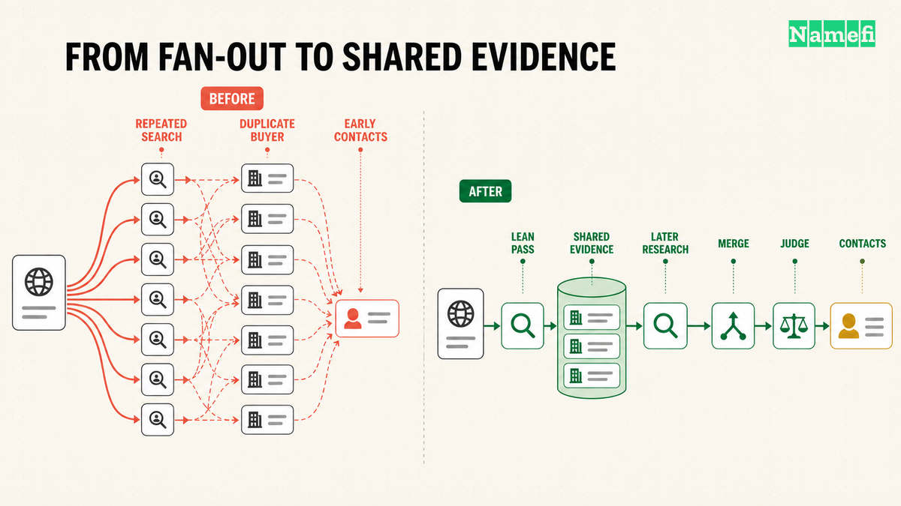
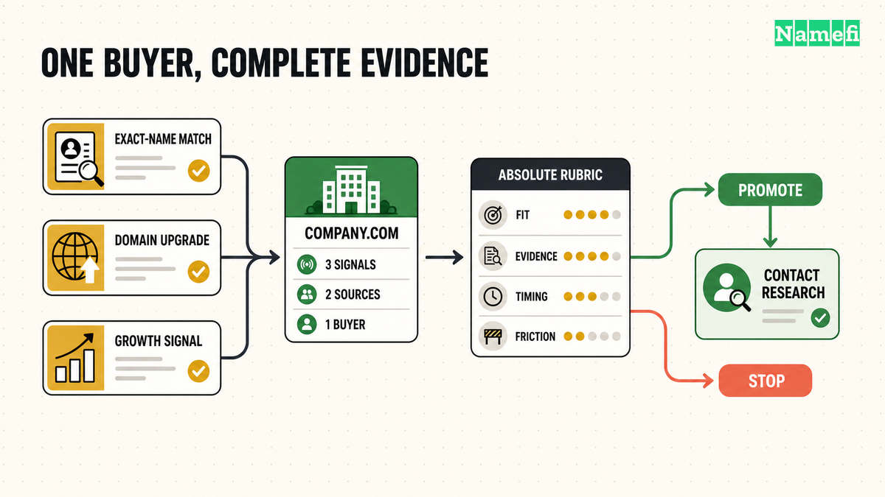
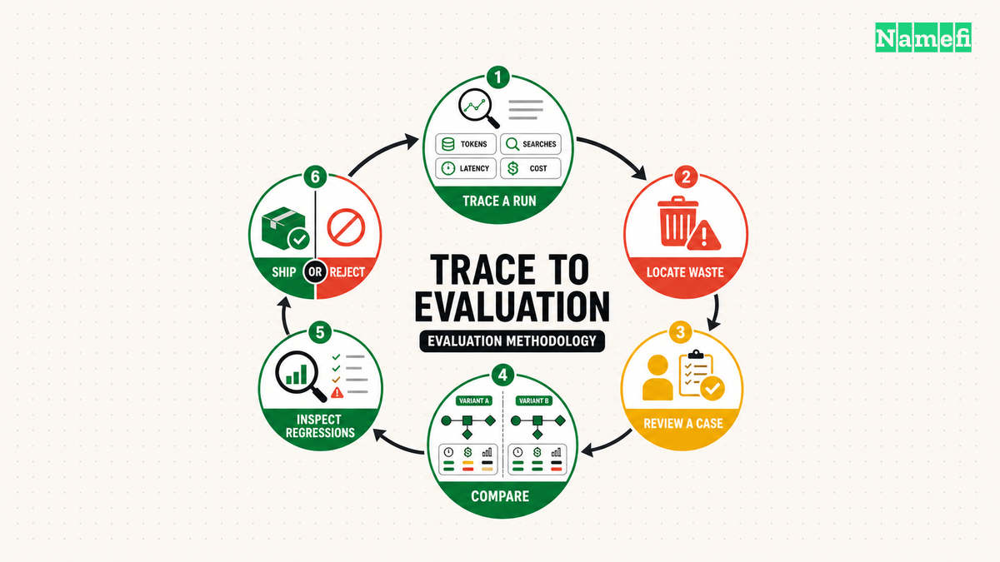
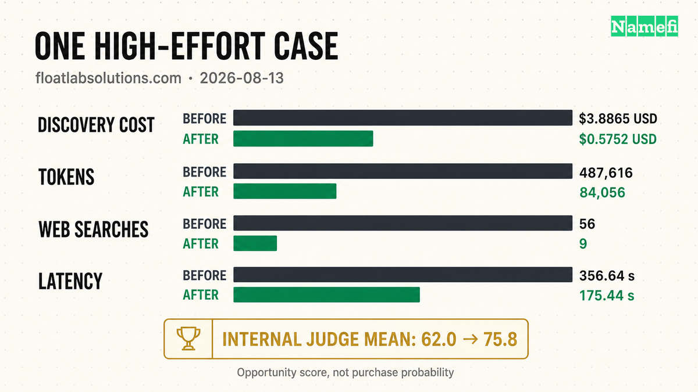

AI buyer discovery is the research between a domain name and a defensible list of companies that may have a reason to acquire it. It is not contact scraping. The output should answer three questions before anyone writes an email:

1. Which company could use this domain?
2. What evidence supports that specific use?
3. Is the opportunity strong enough to justify researching a person at the company?

For a domain seller, that work replaces broad keyword lists with buyer-specific hypotheses. For a prospective buyer, it should mean fewer irrelevant messages: the seller reaches out only when the company's product, brand, launch, current domain, or growth activity creates a plausible acquisition case.

[Namefi Outbound](https://namefi.io/features/outbound) turns that research into a workflow. The seller enters a domain and chooses a search depth. The system profiles the asset, develops buyer theses, searches for official company domains, attaches source evidence, merges duplicate findings, ranks the resulting opportunities, and then looks for relevant contacts at the strongest companies. The final report shows the buyer, the reason it may care, the supporting evidence, an opportunity score, and any source-backed contact information found.

This article is about how we changed the AI architecture behind that workflow. In a controlled High-effort benchmark on `floatlabsolutions.com`, the revised discovery stage reduced measured cost from $3.8865 USD to $0.5752 USD, an 85.2% reduction. Tokens fell 82.8%, web searches fell 83.9%, and mean opportunity score increased from 62.0 to 75.8.

The important change was not a shorter prompt. We changed how the system allocates model capability, evaluates semantic quality, and learns from traces and evals.

## What a reasoning mode controlled before optimization

Outbound exposes three search depths: **Fast**, **Balanced**, and **Deep**. A reasoning mode was never just a model dropdown. It controlled several levers at once:

- how many distinct buyer theses the system developed;
- the maximum candidate pool;
- how many specialized discovery recipes ran;
- model tier and reasoning effort;
- web-search tool budgets;
- how many companies received contact research; and
- how many contacts the system attempted to find per company.

Before the optimization, the configured ceilings were:

| Lever | Fast | Balanced | Deep |
|---|---:|---:|---:|
| Buyer theses | 2 | 3 | 5 |
| Raw candidate ceiling | 20 | 45 | 90 |
| Specialized discovery recipes | 1 | 3 | 5 |
| Companies eligible for contact research | 2 | 5 | 8 |
| Domain-profile web-search budget | 1 | 1 | 2 |
| Contact-research web-search budget per company | 4 | 6 | 9 |
| Target contacts per company | 1 | 2 | 3 |

Fast and Balanced used the faster research tier for primary discovery. Deep used the stronger research tier for discovery and contact research, while also widening every major budget.

Those levers multiplied rather than added. A Deep run could develop more theses, launch more independent research agents, give each agent more reasoning and search capacity, admit more candidates, and start contact work for more companies. The old High architecture used seven independent discovery agents in the benchmarked run. Each agent could repeat searches, rediscover a company found by another agent, and return overlapping evidence under a different recipe.

The workflow also began limited contact research before the final buyer set was complete. That meant an expensive person-level search could run for a company that later ranked below another candidate.

The original design made intuitive product sense: deeper research should explore more angles and return richer results. The cost problem was architectural. Search depth expanded too many coupled levers at the same time, and no shared view of completed coverage prevented duplicated work.

## The revised architecture

The optimized workflow has four control points:

1. **Progressive model escalation:** begin with a lean research pass; add stronger reasoning, context, or tool budget only in later passes.
2. **Cumulative evidence:** every pass receives prior coverage, existing candidates, and unresolved research questions.
3. **LLM-as-judge ranking:** a separate model evaluates the complete evidence set against an absolute opportunity rubric.
4. **Trace-and-eval feedback:** [Laminar traces](https://laminar.sh/docs/tracing/introduction#:~:text=Tracing%20records%20what%20your%20agent%20does) explain individual runs; [Laminar evals](https://laminar.sh/docs/evaluations/introduction#:~:text=Evaluations%20are%20how%20you%20answer%20one%20question) compare candidate architectures on the same reviewed cases.

Only after the judge promotes a company does the workflow spend money finding a person and drafting outreach.

**Domain profile → lean discovery → targeted escalation → evidence merge → LLM judge → contact research → outreach**

## Escalate model capability progressively

Buyer discovery is not one uniform reasoning task. The first pass usually needs to test the clearest commercial interpretations, identify official company websites, and collect basic evidence. A stronger pass becomes useful when the domain is ambiguous, an initial buyer thesis remains underexplored, or early evidence suggests a less obvious acquisition case.

Running the strongest configuration from the start makes every easy decision pay the cost of a hard one. Running only a small model creates the opposite failure: the workflow is inexpensive, but subtle buyer cases can disappear.

The initial pass receives a domain profile containing commercial meanings, buyer theses, evidence requirements, search directions, and cautions such as ambiguity or [trademark](/en/glossary/trademark/) risk. Its job is to test the strongest theses, return official company domains with source-backed evidence, and summarize what it covered.

A deeper pass does not restart the research. It receives the previous coverage summary, company domains to exclude, evidence already collected, and specific unresolved research missions. It can spend its additional capability on gaps instead of rediscovering the same obvious companies.

Depending on the research mission, “beefing up” the next pass can mean a stronger model, more reasoning effort, a larger tool budget, or richer context. The system should increase only the dimension that the next decision requires. This avoids both one cheap model everywhere, which can miss difficult cases, and one frontier model everywhere, which pays frontier cost for routine work.

## Preserve evidence instead of rerunning research

Progressive models help only if each pass can use the work already completed. Without cumulative state, a multi-pass system is just repeated prompting.

Every discovered company is stored as a structured signal:

- canonical root domain;
- buyer thesis or signal type;
- search query;
- supporting URL;
- evidence excerpt; and
- a candidate-specific reason the seller's domain could matter.

Directories, [marketplaces](/en/glossary/marketplace/), social profiles, review pages, job boards, and news articles may help locate a company, but they are not accepted as the buyer's identity. The candidate resolves to an official root domain, and the supplied evidence must support the proposed use case.

Signals are normalized and merged before evaluation. If the same company appears as an exact-name match, a growth event, and a domain-upgrade case, that becomes one buyer with three pieces of evidence, not three leads.

This is where much of the efficiency gain comes from. The system stops paying multiple agents to rediscover, re-explain, and rerank the same organization.

## Use an LLM judge for semantic quality

Discovery and evaluation should not be the same model decision.

A discovery model should be allowed to surface credible hypotheses. If it must also decide whether each candidate deserves outreach, it tends to suppress uncertain cases before the complete evidence set exists. A separate judge can evaluate every candidate after evidence has been merged.

Our judge uses absolute score anchors rather than ranking companies relative to the current list. It considers:

- fit between the seller's domain and the buyer's business;
- a concrete buyer pain or use case;
- timing or growth evidence;
- capacity to act;
- likely adoption friction; and
- strength of the source evidence.

An absolute rubric prevents a weak candidate from receiving a high score merely because the rest of the list is worse. It also makes eval results comparable across domains and pipeline versions.

The judge returns a structured decision for every candidate and selects the strongest supporting signal. Contact research is gated on both score and evidence: a high score alone is not enough when the source does not establish a buyer-specific reason for outreach.

An LLM judge is appropriate here because “does this company have a concrete, commercially plausible reason to acquire this domain?” is a semantic question. Deterministic code still handles facts it can verify reliably: schema validity, domain normalization, duplicate removal, source allowlisting, score bounds, and workflow state. The judge does not override those checks.

Model-judge scores are an internal opportunity-quality measure, not a prediction that a company will buy a domain. They require calibration against human review and should be read alongside individual cases, not only as an average.

## Use Laminar traces to find waste

Provider invoices reveal spend. They do not explain the architecture that produced it.

A useful Laminar trace connects one outbound run across the API, Temporal workflow, activities, agent loops, web searches, model calls, and structured outputs. For each paid operation, we record the model, input and output tokens, cached-token details, tool calls, latency, stage, and attributed cost.

That lets us inspect the earliest point where a run became inefficient. In the previous architecture, traces made several patterns visible:

- independent research agents executed overlapping searches;
- the same companies arrived through several recipes;
- partial candidate sets triggered repeated evaluation work; and
- contact research could begin before the final buyer set was known.

Those are pipeline problems, not prompt-writing problems. A shorter prompt would not remove them.

Trace context also survives Temporal boundaries so one product operation remains inspectable as one execution. Durable checkpoints and generation fingerprints prevent a retry from silently paying for a completed model call again.

The operational rule is simple: **every paid call must be attributable, and every completed paid result must be reusable on retry.**

## Use Laminar evals to decide whether cheaper is actually better

Cost reduction is easy to demonstrate. Quality preservation is harder.

For model, prompt, or pipeline experiments, we compare a baseline and candidate on the same reviewed domain cases. Each run records the model configuration, pipeline version, dataset version, code revision, tokens, tool use, latency, cost, and judge outputs.

The evaluation stack separates two kinds of checks:

### Deterministic evaluators

These verify conditions with a factual answer:

- output conforms to the schema;
- a candidate is an official company domain;
- the seller's own domain is excluded;
- evidence URLs came from the research tools;
- candidates are deduplicated; and
- contact research starts only after promotion.

### Model-based evaluators

These assess qualities that cannot be reduced to a stable rule:

- the buyer reason is specific rather than generic;
- the evidence supports the claimed commercial use;
- the lead is actionable enough to justify outreach; and
- the final ordering reflects buyer pain, timing, and adoption friction.

The judge rubric is written, narrow, and calibrated against human review. Eval datasets include ordinary cases and strong positive controls, not only known failures. Otherwise a cost-saving change can “improve” its score by rejecting every difficult candidate.

We review per-case regressions as well as aggregate scores. An average can hide a severe failure on a commercially important buyer thesis.

The resulting loop is:

**Trace a real run → identify waste or a quality failure → add a reviewed eval case → change one architectural variable → compare baseline and candidate → inspect regressions → ship or reject**

This keeps optimization evidence-driven and reduces the temptation to patch one domain with brittle production rules.

## Rank before researching contacts

Contact enrichment is a downstream expense, not a discovery primitive.

An email address does not make a company a good buyer. Starting contact research early favors organizations whose employees are easy to find, even when another company has a stronger reason to acquire the domain.

After discovery is complete, the LLM judge evaluates the merged candidate set once. Contact research then runs only for promoted companies and targets a person whose role could plausibly evaluate a domain acquisition: a founder, executive, or leader in brand, marketing, growth, partnerships, or business development.

This is an important efficiency gain, but it is downstream of the larger architecture: progressive model allocation creates the evidence, the judge gates spending, and traces plus evals show whether the trade was sound.

## The controlled benchmark

We compared two High-effort discovery architectures on `floatlabsolutions.com` on 2026-08-13:

- **Before:** seven independent discovery agents using a fixed multi-recipe fan-out.
- **After:** cumulative progressive discovery, one complete LLM-judge pass, and contact research only after promotion.

Both runs used the same seller domain and opportunity-scoring rubric. The table reports measured discovery-stage usage and latency. It does not claim that every domain or run will reproduce the same percentages.

| Metric | Before | After | Change |
|---|---:|---:|---:|
| Discovery cost | $3.8865 USD | $0.5752 USD | -85.2% |
| Tokens | 487,616 | 84,056 | -82.8% |
| Web searches | 56 | 9 | -83.9% |
| Discovery latency | 356.64 seconds | 175.44 seconds | -50.8% |
| Mean opportunity score | 62.0 | 75.8 | +13.8 points |
| Median opportunity score | 61 | 77 | +16 points |

The result supports an architectural conclusion, not a universal performance claim: allocating model capability progressively can remove duplicated work without forcing buyer discovery into deterministic shortcuts.

## A practical review checklist

If you are building an agentic research pipeline, ask:

1. Can a lean model complete the routine first pass?
2. Does every later pass receive prior coverage and explicit research gaps?
3. What evidence causes the workflow to escalate capability?
4. Is semantic quality judged separately from discovery?
5. Are judge scores absolute and calibrated against human review?
6. Which facts are enforced deterministically instead of delegated to a model?
7. Can one trace explain every model call, tool call, token, cost, and handoff?
8. Does the eval compare the same cases and rubric across architectures?
9. Are important per-case regressions visible behind the aggregate score?
10. Can a retry reuse completed paid work?
11. Does contact research happen only after a buyer earns it?

The core principle is not “always use a smaller model.” It is **use the least expensive capable configuration at each stage, escalate with evidence, and make quality measurable before declaring the system cheaper.**

That is the methodology we are applying to [Namefi Outbound](https://namefi.io/features/outbound): progressive models for research, an LLM judge for opportunity quality, and Laminar traces and evals for the engineering feedback loop.

## Sources and further reading

- Namefi Resources — [Inbound vs Outbound Domain Sales](/en/blog/inbound-vs-outbound-domain-sales/)
- Namefi Resources — [How to Sell a Domain Name You Own](/en/blog/how-to-sell-a-domain-name-you-own/)
- Namefi Resources — [End-User Price vs Reseller Price](/en/blog/end-user-vs-reseller-domain-pricing/)
- Namefi Resources — [Working With Domain Brokers](/en/blog/working-with-domain-brokers/)
- Namefi — [Outbound buyer discovery](https://namefi.io/features/outbound)
- Laminar — [Tracing overview](https://laminar.sh/docs/tracing/introduction)
- Laminar — [Evaluations](https://laminar.sh/docs/evaluations/introduction)
