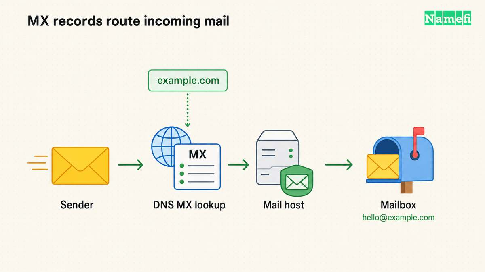
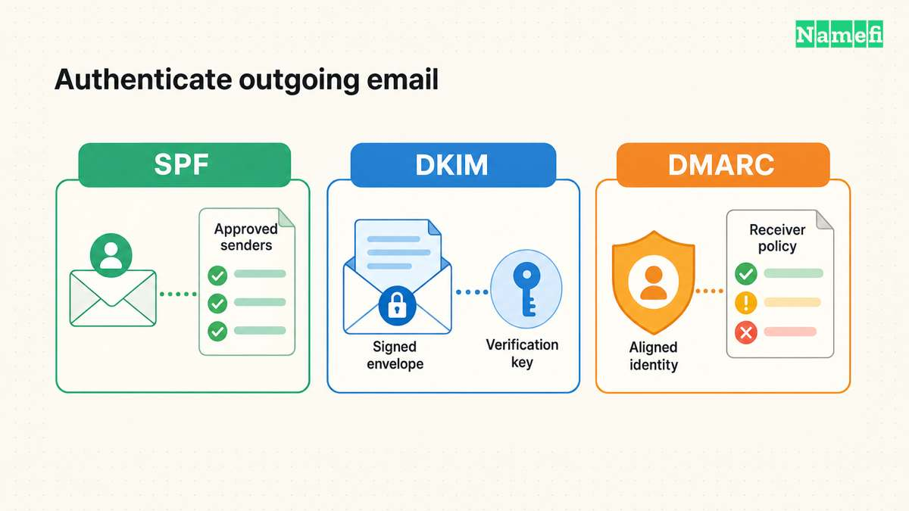

**To create an address such as `hello@example.com`, you need control of the domain, an email service, and access to the domain's DNS settings.** The practical sequence is to prepare the mailboxes, verify the domain, route incoming mail, configure sending authentication, and test the result. Google's setup checklist explicitly puts user accounts before the MX change that starts directing mail to its service. [See the documented order.](https://knowledge.workspace.google.com/admin/gmail/activate-gmail-with-google-workspace-your-company)

This guide uses Google Workspace as a worked documentation example while explaining the decisions that apply across providers. Always take record values from your own provider's setup screen.

## Prepare the mailbox and DNS access

First decide whether you need a **mailbox** or **forwarding**. A mailbox service gives each user an account and address. Forwarding routes incoming messages to an existing inbox; for example, Cloudflare documents rules that forward mail for a custom address to a verified destination. [Compare Google's user-account setup](https://knowledge.workspace.google.com/admin/gmail/activate-gmail-with-google-workspace-your-company) with [Cloudflare's forwarding workflow](https://developers.cloudflare.com/email-service/get-started/route-emails/). If you want to reply using the custom address, explicitly confirm how your chosen service supports outgoing mail before relying on forwarding alone.

Make a short preparation sheet:

- The domain you control and the person authorized to change its DNS.
- The active DNS provider, which may differ from the registrar.
- Every address that must receive mail: people, aliases, and shared addresses.
- Every service that sends as your domain, including forms, newsletters, and billing tools.
- The existing DNS records and the previous mail provider, if any.

Keep the website records in that saved copy too. The [DNS record types reference](/en/glossary/dns-record-types/) helps distinguish mail settings from web settings. If registration and DNS are separate, use the active DNS provider's account; DNSimple's documentation confirms that this arrangement is supported by its service. [See the independent DNS-hosting example.](https://support.dnsimple.com/articles/dnsimple-services/#domain-registration-transfer-and-renewal)

For an existing mail service, decide how to preserve old messages, recreate aliases, and handle mail arriving during the transition before moving delivery. Treat the old mailbox's contents as a separate migration job. Google's checklist links importing existing mail as an additional setup task. [See the setup checklist.](https://knowledge.workspace.google.com/admin/gmail/activate-gmail-with-google-workspace-your-company)

## Verify the domain, then route incoming mail

Domain verification proves control to the email provider. In Google's documented TXT method, copy the unique verification value from **Account → Domains → Manage domains**, add it in DNS, and return to the Admin console to verify. Keep the exact record name and value supplied to your account. [Follow Google's TXT-verification procedure.](https://knowledge.workspace.google.com/admin/domains/verify-your-domain-with-a-txt-record)

Verification does not route mail. When the mailboxes are ready, make the planned **MX-record** change. Preserve unrelated TXT, A, AAAA, and CNAME records.

Google Workspace currently specifies `smtp.google.com` with priority `1`, followed by Gmail activation in the Admin console. Working configurations using older `aspmx` targets remain supported and need no change. [See Google's MX instructions and legacy-record note.](https://knowledge.workspace.google.com/admin/domains/set-up-mx-records-for-google-workspace)

Google's normal setup calls for removing other MX records during the switch. Do not combine providers' records expecting each to receive a copy of every message. [Follow the intended MX configuration.](https://knowledge.workspace.google.com/admin/domains/set-up-mx-records-for-google-workspace)

Check public MX answers against the intended values. Google documents Admin Toolbox Dig for this check and allows up to 72 hours for recognition. Fix incorrect records rather than waiting on them. [See its troubleshooting steps.](https://knowledge.workspace.google.com/admin/domains/set-up-mx-records-for-google-workspace)

## Authenticate outgoing mail

Receiving a message proves only one direction works. Configure the mechanisms your host supplies for sending, and account for other legitimate senders too.

| Mechanism | What to configure | Mistake to avoid |
| --- | --- | --- |
| SPF | A DNS TXT policy authorizing the services that send for the domain | Creating separate SPF policies for different providers at the same name |
| DKIM | Provider-supplied DNS information used to verify signatures on outgoing mail | Publishing the record but never enabling signing in the mail service |
| DMARC | A policy and reporting configuration that checks alignment with the visible From domain | Enforcing rejection before legitimate senders authenticate correctly |

For **SPF**, inventory all your senders before editing. Google's guidance distinguishes a Workspace-only setup from one that also uses third-party senders. Its troubleshooting guide says to consolidate them into **one SPF record**. That restriction applies to SPF records at the same name, not to every TXT record in the zone. [Read the SPF setup](https://knowledge.workspace.google.com/admin/security/set-up-spf) and [duplicate-SPF guidance](https://knowledge.workspace.google.com/admin/security/troubleshoot-spf-issues#:~:text=Note%20that%20each%20domain).

For **DKIM**, follow the host's sequence for generating or obtaining the record, publishing it, and enabling signing. Google's procedure requires publishing the public key before selecting **Start authentication**; its guide also notes a 24–72-hour wait after turning on Gmail before a DKIM key can be obtained. The private signing key does not belong in public DNS. [See the DKIM steps.](https://knowledge.workspace.google.com/admin/security/set-up-dkim)

For **DMARC**, a passing message needs SPF with alignment or DKIM with alignment to the visible From domain. Google's rollout guidance starts with `p=none` so you can review reports before moving toward quarantine or rejection. It also asks for SPF and DKIM to authenticate for at least 48 hours before turning on DMARC. [Follow the DMARC setup and rollout guidance.](https://knowledge.workspace.google.com/admin/security/set-up-dmarc#:~:text=When%20you%20start%20using%20DMARC)

If a domain already has an enforced DMARC policy, preserve that policy while planning the migration. Do not automatically replace it with a tutorial example. Check the new host and every other sender against the existing policy first, then make any policy change deliberately.

## Test both directions and investigate the failing step

Use external accounts you control or cooperating testers. Send from the new mailbox to an external inbox, reply, and separately send a fresh message into the custom address. Include aliases and the actual website or billing tools on your preparation sheet.

Inspect an outgoing message at the receiving end. In Gmail, **Show original** exposes authentication results. Google's DKIM test specifically calls for a different recipient and checking the received message's `Authentication-Results`; sending a message to yourself is not its verification method. [See “Turn on & verify DKIM.”](https://knowledge.workspace.google.com/admin/security/set-up-dkim)

Use the failure to choose the next check:

| Symptom | Check next |
| --- | --- |
| Verification fails | The full verification value, correct DNS zone, and record name |
| Incoming mail goes to the old service | Public MX answers and the intended MX change |
| Mail reaches one address but not an alias | The address or alias configuration at the new host |
| Outgoing authentication fails | The actual sender, SPF policy, DKIM signing, and DMARC alignment |
| Mail works but the website fails | Whether a website record or nameserver was changed accidentally |

Keep the previous service available until your migration checks are complete. Save the final record set and provider confirmation with the person responsible for renewals. The finishing condition is concrete: the intended addresses receive mail, the intended services can send it, and the received messages show the expected authentication results.

For the narrower question of how these records relate to tokenization, see [DNS on a tokenized domain](/en/blog/dns-on-tokenized-domains/).

## Sources and further reading

- Google Workspace — [Activate Gmail with Google Workspace](https://knowledge.workspace.google.com/admin/gmail/activate-gmail-with-google-workspace-your-company), required checklist and additional migration options. Fetched 2026-09-15.
- Cloudflare — [Route emails](https://developers.cloudflare.com/email-service/get-started/route-emails/), incoming routing and destination-address workflow. Fetched 2026-09-15.
- DNSimple — [DNSimple Services](https://support.dnsimple.com/articles/dnsimple-services/#domain-registration-transfer-and-renewal), using hosted DNS with another registrar. Fetched 2026-09-15.
- Google Workspace — [Verify your domain with a TXT record](https://knowledge.workspace.google.com/admin/domains/verify-your-domain-with-a-txt-record), steps 1–3. Fetched 2026-09-15.
- Google Workspace — [Set up MX records](https://knowledge.workspace.google.com/admin/domains/set-up-mx-records-for-google-workspace), record table, legacy-record note, Gmail activation, and troubleshooting. Fetched 2026-09-15.
- Google Workspace — [Set up SPF](https://knowledge.workspace.google.com/admin/security/set-up-spf), “Before you begin” and “Determine your SPF record.” Fetched 2026-09-15.
- Google Workspace — [Troubleshoot SPF issues](https://knowledge.workspace.google.com/admin/security/troubleshoot-spf-issues#:~:text=Note%20that%20each%20domain), “Make sure you have an SPF record (and only one)” and third-party senders. Fetched 2026-09-15.
- Google Workspace — [Set up DKIM](https://knowledge.workspace.google.com/admin/security/set-up-dkim), key generation, public-key publication, and “Turn on & verify DKIM.” Fetched 2026-09-15.
- Google Workspace — [Set up DMARC](https://knowledge.workspace.google.com/admin/security/set-up-dmarc#:~:text=When%20you%20start%20using%20DMARC), recommended starting policy, alignment, and prerequisites to publishing the record. Fetched 2026-09-15.
