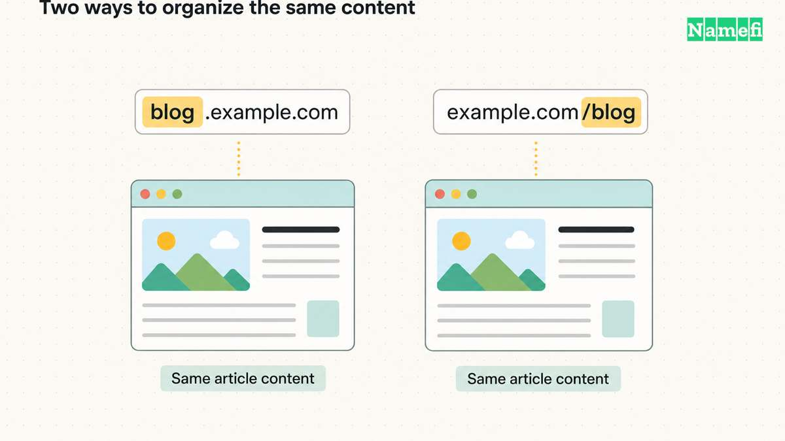

**A subdomain changes the hostname: `blog.example.com`. A subdirectory adds a path to the existing hostname: `example.com/blog/`.** The choice affects how you organize and operate the site. It does not come with an automatic Google ranking advantage: Google's published guidance says it has no indexing or ranking preference and recommends choosing what is easiest to organize and manage. [Read Google's answer.](https://developers.google.com/search/help/crawling-index-faq#:~:text=From%20an%20indexing%20and%20ranking%20perspective)

For a blog run inside the same publishing system as your main site, a subdirectory is a reasonable starting point. For an independently operated application, a subdomain may fit better. Those are practical planning judgments, not predictions about search performance. Start with the work each choice creates for your team.

## Compare the URLs and the management work

Here is an illustrative pair for the same article:

| URL | Hostname | Path | What changed? |
| --- | --- | --- | --- |
| `https://blog.example.com/launch/` | `blog.example.com` | `/launch/` | A separate hostname under `example.com` |
| `https://example.com/blog/launch/` | `example.com` | `/blog/launch/` | A path under the existing hostname |

The [subdomain glossary](/en/glossary/subdomain/) explains the naming hierarchy. The important distinction here is between the **host** and the **path** in a URL. A path can be handled by application software; it need not match a physical folder on a server. [MDN explains URL components and resource paths.](https://developer.mozilla.org/en-US/docs/Learn_web_development/Howto/Web_mechanics/What_is_a_URL)

That gives you different questions to ask during setup:

| Decision | Subdomain | Subdirectory |
| --- | --- | --- |
| Publishing | Can the service accept and serve the new hostname? | Can the existing site serve the section at this path? |
| DNS | Check how the hostname resolves to the intended service | A path such as `/blog/` is handled by the website, not a separate DNS name |
| Editorial management | Decide whether it needs separate navigation, templates, or publishing permissions | Decide how it fits the existing site's navigation and publishing rules |
| Ongoing ownership | Name the team responsible for this hostname and service | Name the team responsible for this part of the site |

Do not infer a separate physical server from a subdomain. The URL identifies the host you request, not a diagram of the provider's infrastructure. Equally, do not assume a subdirectory will work with any service just because you can type the path. Confirm support with the people running the site before choosing an address. [MDN's explanation separates the server destination from the resource path.](https://developer.mozilla.org/en-US/docs/Learn_web_development/Howto/Web_mechanics/What_is_a_URL)

There is also a browser boundary to consider for applications. URLs with different hosts have different **origins**; changing only the path preserves the origin when the protocol and port also match. This matters when applications share data across pages. [MDN defines the same-origin policy.](https://developer.mozilla.org/en-US/docs/Web/Security/Defenses/Same-origin_policy#definition_of_an_origin) Ask the application owner to review sign-in and data access explicitly. Neither a path name nor a subdomain name is a substitute for access controls.

## Choose for a blog, an app, or a language version

### A blog within an existing site

Suppose the same editor publishes your product pages and articles, using the same site navigation and publishing system. Try a path such as `/blog/` first if that system supports it. The reason is operational: it may avoid creating another publishing setup for the same team.

If the blog service instead supports a custom hostname and cannot serve a path inside the existing site, a subdomain may be the simpler supported option. Compare the cost of integrating a path with the cost of maintaining the separate service. Record that reason so a later redesign does not mistake the address choice for an SEO rule.

### An application with its own release process

An application at `app.example.com` can have a different job from the public pages at `example.com`: users sign in to use the product, while visitors read the main site. A subdomain is worth considering when different teams own those surfaces or when the application provider expects a hostname.

Test the boundary the user will cross: signing in, opening links, returning to the public site, and accessing any shared data. The separate origin is a technical fact; whether it simplifies your particular application is a design decision. [Use the browser's origin rules when reviewing that boundary.](https://developer.mozilla.org/en-US/docs/Web/Security/Defenses/Same-origin_policy#definition_of_an_origin)

### Language or regional versions

Google documents both `de.example.com` and `example.com/de/` as options for international sites. Its comparison describes subdomains as easier to separate and subdirectories as lower maintenance when using the same host. It also cautions that a label such as `de` may not tell users whether it means a language or a country. [See Google's locale-specific URL comparison.](https://developers.google.com/search/docs/specialty/international/managing-multi-regional-sites#locale-specific-urls)

Decide which audience each version serves and who maintains it before choosing the URL pattern. A language folder does not, by itself, explain whether prices, availability, or other regional content differ. Keep the navigation and labels understandable to readers.

### What the SEO evidence does and does not say

Google's stated lack of preference answers the narrow question: **does one URL arrangement inherently win at indexing and ranking?** Its answer is no. That does not prove two differently implemented sites will produce identical results. [The official FAQ addresses the URL-choice question.](https://developers.google.com/search/help/crawling-index-faq#:~:text=From%20an%20indexing%20and%20ranking%20perspective)

Treat claims about gains after a move as a prompt to investigate the whole change. Were the articles rewritten? Did navigation, redirects, templates, or crawlability change too? Without separating those changes, you cannot attribute the outcome to the dot or slash alone. That is an evidence standard for your evaluation, not a claim that every migration behaves alike.

## Plan migration and measurement before moving

A move from `blog.example.com/launch/` to `example.com/blog/launch/` changes an existing URL. Treat it as a migration with a clear reason and a checkable result.

Google's site-move guidance recommends mapping old URLs to new ones, using permanent server redirects where possible, updating internal links and canonical annotations, and checking indexing and traffic afterward. It also warns that search visibility may fluctuate during a move. [Follow the migration guidance.](https://developers.google.com/search/docs/crawling-indexing/site-move-with-url-changes)

For your planning sheet, record:

- **Purpose:** The publishing or maintenance problem the move should solve.
- **Mapping:** The intended destination of each old page, including images and downloads that move.
- **Readiness:** Who will verify redirects, links, and the new pages' accessibility to search crawlers?
- **Measurement:** How will you compare the same content before and after the move?
- **Responsibility:** Who investigates unexpected errors or lost pages?

Look at exposure using the same page set and query scope across both locations. Record the migration date and other material site changes. If you compare only the new location with its own empty history, the resulting increase tells you little about whether the content's overall visibility improved.

Choose the structure your team can publish, maintain, and measure reliably. Keep a working structure unless you have a concrete reason to move; changing it solely to chase an assumed SEO preference is not supported by Google's guidance.

## Sources and further reading

- Google Search Central — [Crawling and indexing FAQ](https://developers.google.com/search/help/crawling-index-faq#:~:text=From%20an%20indexing%20and%20ranking%20perspective), “Is it better to use subfolders or subdomains?” Fetched 2026-09-15.
- MDN — [What is a URL?](https://developer.mozilla.org/en-US/docs/Learn_web_development/Howto/Web_mechanics/What_is_a_URL), “Authority” and “Path to resource,” host and path semantics. Fetched 2026-09-15.
- MDN — [Same-origin policy](https://developer.mozilla.org/en-US/docs/Web/Security/Defenses/Same-origin_policy#definition_of_an_origin), protocol/host/port comparison and same-origin restrictions. Fetched 2026-09-15.
- Google Search Central — [Managing multi-regional and multilingual sites](https://developers.google.com/search/docs/specialty/international/managing-multi-regional-sites#locale-specific-urls), subdomain and subdirectory comparison table. Fetched 2026-09-15.
- Google Search Central — [How to move a site](https://developers.google.com/search/docs/crawling-indexing/site-move-with-url-changes), “Prepare URL mapping,” “Start the site move,” and “Monitor traffic.” Fetched 2026-09-15.
