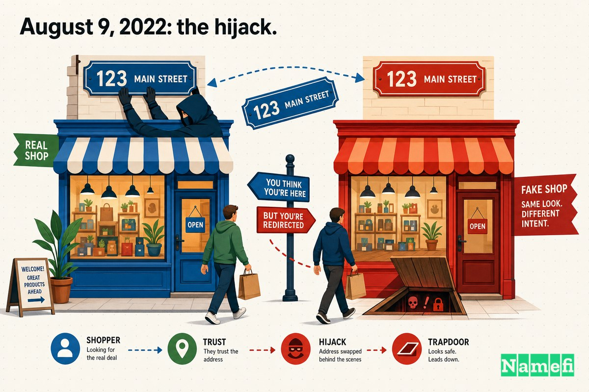
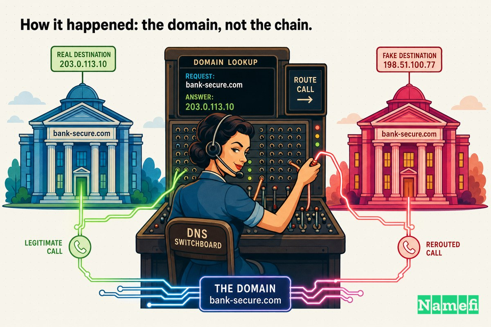
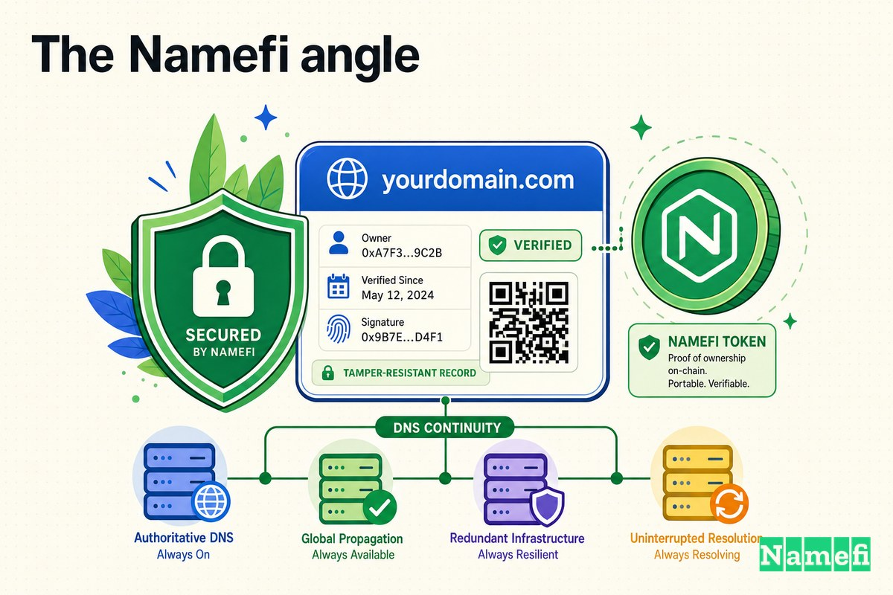

The smart contracts were fine.

That is the first thing to understand about what happened to Curve Finance on August 9, 2022, and it is the part that still unsettles security engineers years later. Curve's [on-chain](/en/glossary/on-chain/) code — the audited, battle-tested automated market maker holding billions in stablecoins — was never touched. No reentrancy bug. No oracle manipulation. No flash-loan exploit. The [blockchain](/en/glossary/blockchain/) did exactly what it was supposed to do.

And users still lost roughly **$570,000**.

The attack didn't come through the contracts. It came through the **domain**. Someone took control of `curve.fi` at the [registrar](/en/glossary/registrar/) level, pointed it at a cloned website wired to a [wallet](/en/glossary/wallet/)-drainer, and let the protocol's own reputation do the rest. Every security audit Curve had ever passed was irrelevant, because the attacker never knocked on that door. They walked in through the front — the web address users typed without thinking.

This is *Domain Mayday* Episode 13. It's a story about how the most secure part of a system can be perfectly safe while the part everyone *trusts without checking* — the domain name — quietly becomes the attack surface.

## "Audited contracts" don't protect the front door

[DeFi](/en/glossary/defi/) spent years building a culture of contract security. Audits became table stakes. Bug bounties scaled into the millions. "Verified on Etherscan" became a trust signal. The collective mental model hardened into something like: *if the contracts are safe, the protocol is safe.*

But a user almost never interacts with a contract directly. They go to a website. They type `curve.fi`, their browser resolves that name to an [IP address](/en/glossary/ip-address/), it loads a page, and that page tells their wallet what to sign. Every one of those steps happens *before* a single line of audited Solidity executes — and every one of them lives in infrastructure the audit never covered.

The domain name is the very first link in that chain. It's also the link most teams treat as set-and-forget: register it once, point the DNS, never think about it again. As one explainer put it after the incident, this kind of attack ["exploits the trust layer" between the user and a decentralized app's interface](https://www.tradingview.com/news/cointelegraph:9a15fa371094b:0-what-is-dns-hijacking-how-it-took-down-curve-finance-s-website/) rather than breaching the protocol's blockchain at all. The contracts can be flawless. If an attacker controls where `curve.fi` *points*, none of that matters.

## August 9, 2022: the hijack

On the afternoon of August 9, 2022, Curve's main front end stopped being Curve's.

CertiK's post-incident analysis pinned the timeline precisely: ["At approximately 4:20 PM EST Aug. 09 2022, Curve Finance's DNS record was compromised and pointed to a cloned malicious site."](https://www.certik.com/resources/blog/curve-finance-hack-incident-analysis) To anyone visiting `curve.fi`, nothing looked wrong. The page rendered. The logo was there. The pools, the interface, the colors — all faithfully reproduced.

The difference was invisible and total: the site loading in the user's browser was no longer served by Curve. It was a clone, sitting on the attacker's infrastructure, waiting for someone to connect a wallet.

Security researcher Lefteris Karapetsas described the mechanics bluntly — the attackers had ["cloned the site, made the DNS point to their IP where the cloned site is deployed, and added approval requests to a malicious contract."](https://cryptopotato.com/curve-finance-issues-warning-about-compromised-front-end-amid-570k-theft/) Cointelegraph's later explainer described the same pattern: ["The attackers had cloned the Curve Finance website and interfered with its DNS settings to send users to a duplicate version of the website."](https://www.tradingview.com/news/cointelegraph:9a15fa371094b:0-what-is-dns-hijacking-how-it-took-down-curve-finance-s-website/)

Then they waited.

## What users lost

When a user landed on the clone and tried to use it, the page asked their wallet to do something it does thousands of times a day on legitimate DeFi sites: approve a token. Per CertiK, ["the attacker injected malicious code into that site that asked users to give token approvals to an unverified contract."](https://www.certik.com/resources/blog/curve-finance-hack-incident-analysis) Coingape described the trap in plainer terms: ["The hackers managed to deploy a malicious contract on the home page, which when approved by the victim would completely drain the user wallets."](https://coingape.com/crv-tanks-over-10-as-attackers-stole-570k-from-curve-finances-users-wallets/)

Approving a token allowance feels routine. It's the same click users make to swap on a legitimate exchange. But here the contract being approved belonged to the attacker — and once approved, it could move the victim's stablecoins out.

The on-chain accounting was specific. CertiK reported that ["in total, 7 users were affected by the exploit culminating in ~$612k losses,"](https://www.certik.com/resources/blog/curve-finance-hack-incident-analysis) with the figure broken down as ["$612,724.16 in USDC and DAI"](https://www.certik.com/resources/blog/curve-finance-hack-incident-analysis) that the hacker then swapped for ETH. rekt.news settled on a rounder, widely-cited number: ["The stolen funds (340 ETH, or ~$575k, in total)."](https://rekt.news/curve-finance-rekt) Most contemporaneous coverage landed in the same band — Cryptopotato reported that [hackers stole around $570,000 worth of ETH](https://cryptopotato.com/curve-finance-issues-warning-about-compromised-front-end-amid-570k-theft/); CryptoDaily noted [the hacker had stolen over $573,000](https://cryptodaily.co.uk/2022/08/curve-finance-asks-users-to-revoke-recent-contracts-after-dns-hack). The exact total drifts a little depending on when the snapshot was taken and how ETH was priced. The shape of it doesn't: low-to-mid six figures, taken from a handful of users, by a site that looked exactly like the one they trusted.

And here is the part worth sitting with. Tronweekly captured it cleanly: this attack ["did not touch Curve's Ethereum smart contracts or any of the $5.7B of assets stored in them."](https://www.tronweekly.com/curve-finance-dns-hijacking/) Five point seven billion dollars of protocol assets, completely safe. Curve itself, as the same piece noted, ["is unharmed and has incurred no losses."](https://www.tronweekly.com/curve-finance-dns-hijacking/) The protocol won. The users lost. Because the attack was never aimed at the protocol.

## How it happened: the domain, not the chain

So how does an attacker make `curve.fi` resolve to *their* server instead of Curve's?

Start with what DNS does. A domain name like `curve.fi` is a human-friendly label. Computers need an IP address. The [Domain Name System](/en/glossary/dns/) is the lookup layer that translates one into the other — Cointelegraph's explainer compares it to ["a phonebook"](https://www.tradingview.com/news/cointelegraph:9a15fa371094b:0-what-is-dns-hijacking-how-it-took-down-curve-finance-s-website/) that ["converts these user-friendly domain names into the IP addresses computers require to connect."](https://www.tradingview.com/news/cointelegraph:9a15fa371094b:0-what-is-dns-hijacking-how-it-took-down-curve-finance-s-website/) [DNS hijacking](/en/glossary/dns-hijacking/) means tampering with that lookup so the phonebook gives the wrong number — ["altering how DNS queries are resolved, rerouting users to malicious sites without their knowledge."](https://www.tradingview.com/news/cointelegraph:9a15fa371094b:0-what-is-dns-hijacking-how-it-took-down-curve-finance-s-website/)

Crucially, you don't break the user's computer to do this. You change the authoritative answer at its source — the **[nameserver](/en/glossary/nameserver/)** that the domain delegates to. And that source sits with the domain's registrar.

Curve's founder Michael Egorov was direct about where the failure lived. As quoted by rekt.news, ["dns registrar iwantmyname had their ns compromised,"](https://rekt.news/curve-finance-rekt) and the team's read was that ["Curve believes that the underlying nameserver was compromised, rather than a vulnerability at the account level."](https://rekt.news/curve-finance-rekt) In other words: this wasn't (as far as Curve could tell) a stolen password on Curve's own registrar account. It was a problem one layer deeper — at the nameserver infrastructure the registrar itself operated. Cointelegraph's explainer later confirmed the registrar by name, noting the project ["was using the same registrar, 'iwantmyname,' at the time of the previous attack."](https://www.tradingview.com/news/cointelegraph:9a15fa371094b:0-what-is-dns-hijacking-how-it-took-down-curve-finance-s-website/)

That distinction matters enormously for the lesson. A team can enforce a strong password, enable two-factor authentication, and lock down its own registrar login perfectly — and *still* lose its domain if the nameserver beneath it is compromised. The domain owner did not necessarily make a mistake. The trust they placed in the layer below them was simply broken. Cointelegraph's framing of how these attacks work generalizes the risk: ["If a site's mapping changes due to stolen credentials or a registrar's vulnerability, users may be redirected to harmful servers without realizing it."](https://www.tradingview.com/news/cointelegraph:9a15fa371094b:0-what-is-dns-hijacking-how-it-took-down-curve-finance-s-website/)

Once the nameserver answered with the attacker's IP, the rest was automatic. Every user typing `curve.fi` was quietly handed the clone. The phonebook had been edited, and almost no one checks the phonebook.

## Response and aftermath

Curve's team moved fast, and the response is instructive precisely because of what they could and couldn't do.

What they *could* do immediately was warn. The team told users plainly: ["Please do not perform any approvals or swaps. We're trying to locate the issue, but for now, for your safety, do not use curve.fi or curve.exchange."](https://www.tronweekly.com/curve-finance-dns-hijacking/) They pointed users to the still-clean fallback — ["Please use https://curve.exchange for now until the propagation for https://curve.fi reverts to normal"](https://coingape.com/crv-tanks-over-10-as-attackers-stole-570k-from-curve-finances-users-wallets/) — because `curve.exchange` rode different infrastructure and wasn't poisoned.

What they *couldn't* do instantly was un-ring the bell. They changed the nameserver, but DNS doesn't update everywhere at once. As rekt.news noted, ["The hacker's mirrored site was taken down quickly, however some nameservers are still to be updated."](https://rekt.news/curve-finance-rekt) For a window of time, even after the fix was in, caches around the world kept serving the old, malicious answer. That propagation delay is a built-in property of DNS — and a built-in advantage for the attacker.

For users who had already approved the malicious contract, the only defense was revocation. The message repeated everywhere: ["If you have approved any contracts on Curve in the past few hours, please revoke immediately."](https://cryptopotato.com/curve-finance-issues-warning-about-compromised-front-end-amid-570k-theft/) rekt.news published the specific drainer address users needed to revoke — `0x9eb5f8e83359bb5013f3d8eee60bdce5654e8881` — so victims could cut off the allowance before more was taken.

The stolen funds scattered through the usual laundering rails. CertiK traced the flow — ["FixedFloat: 292 ETH, Tornado Cash: 27.7 ETH, Binance: 20 ETH"](https://www.certik.com/resources/blog/curve-finance-hack-incident-analysis) — and noted a twist of timing: with Tornado Cash freshly sanctioned by OFAC days earlier, ["the recent sanctioning of Tornado Cash from OFAC likely concerned the hacker enough to send the majority of the stolen funds to FixedFloat,"](https://www.certik.com/resources/blog/curve-finance-hack-incident-analysis) a centralized exchange. That choice helped: rekt.news reported that of the funds sent to FixedFloat, [112 ETH were frozen](https://rekt.news/curve-finance-rekt). Within hours, Curve confirmed ["the issue has been found and reverted."](https://cryptodaily.co.uk/2022/08/curve-finance-asks-users-to-revoke-recent-contracts-after-dns-hack)

## What this teaches about DNS for DeFi front-ends

The Curve incident is a compact lesson in where DeFi's real attack surface lives. A few takeaways generalize well beyond Curve:

1. **Your domain is part of your security perimeter.** It's tempting to treat the domain as marketing infrastructure — a label, not a system. But the domain is the first instruction a user's browser follows. If it's wrong, everything downstream is wrong. Audits that stop at the contract boundary leave the most-trusted link uncovered.

2. **Registrar and nameserver security is upstream of you.** Curve's own account hygiene may have been fine; the compromise was believed to be at the nameserver layer. You inherit the security posture of every provider in your DNS chain. Choose registrars and DNS hosts that support registrar locks, strong account protections, and ideally [DNSSEC](/en/glossary/dnssec/) — and understand that even then, you're trusting a layer you don't fully control.

3. **Users can't see DNS.** The clone looked identical because the *name* was identical. The padlock was green; the URL was right. Nothing a careful user normally checks would have flagged it. This is what makes DNS hijacking so effective against even sophisticated audiences — the deception happens below the layer humans inspect.

4. **Have a clean fallback.** Curve's saving grace was `curve.exchange` on separate infrastructure. A second front-end path — a different domain, a different DNS provider, an [IPFS](/en/glossary/ipfs/) or [ENS](/en/glossary/ens/)-based mirror — gives you somewhere to send users when your primary name is poisoned.

5. **Token approvals are the payload.** Every front-end attack in this family ends the same way: a routine-looking approval to a hostile contract. Wallets, interfaces, and users all need to treat approval prompts on a freshly-loaded page as the high-risk action they are.

## The Namefi angle

The Curve hijack is, at its root, a question of **who controls the name** — and how cleanly that control can be verified, held, and recovered.

In the traditional model, control of a domain is a brittle bundle: a registrar account, a set of nameserver records, and a chain of providers you have to trust silently. When any link in that chain is compromised — as the iwantmyname nameserver was believed to be — the legitimate owner can lose effective control of their own name without ever making a mistake, and without an obvious, tamper-evident record of *what changed and when*.

[Namefi](https://namefi.io) is built around the idea that domains should behave like internet-native assets — that ownership and control can be made verifiable, auditable, and tamper-resistant while staying compatible with DNS. The deeper lesson of Curve is not "DeFi is unsafe." It's that **the domain layer is load-bearing security infrastructure**, and for years it has been treated as decoration. Whether you run a DeFi protocol, a storefront, or a blog, the name your users type is a promise — and the integrity of that promise is only as strong as the control surface behind it.

Curve's contracts held five point seven billion dollars without a scratch. The domain gave up half a million in an afternoon. That gap is the whole story.

## Sources and further reading

- CertiK — [Curve Finance Hack Incident Analysis](https://www.certik.com/resources/blog/curve-finance-hack-incident-analysis)
- rekt.news — [Curve Finance — REKT](https://rekt.news/curve-finance-rekt)
- Cointelegraph (via TradingView) — [What is DNS hijacking? How it took down Curve Finance's website](https://www.tradingview.com/news/cointelegraph:9a15fa371094b:0-what-is-dns-hijacking-how-it-took-down-curve-finance-s-website/)
- Cryptopotato — [Curve Finance Issues Warning About Compromised Front End Amid $570K Theft](https://cryptopotato.com/curve-finance-issues-warning-about-compromised-front-end-amid-570k-theft/)
- Coingape — [Curve Finance DNS Hijacked, Attackers Stole $570K from User Wallets](https://coingape.com/crv-tanks-over-10-as-attackers-stole-570k-from-curve-finances-users-wallets/)
- Tronweekly — [Curve Finance's Hackers Loot $570K Via DNS Hijacking](https://www.tronweekly.com/curve-finance-dns-hijacking/)
- CryptoDaily — [Curve Finance Asks Users To Revoke Recent Contracts After DNS Hack](https://cryptodaily.co.uk/2022/08/curve-finance-asks-users-to-revoke-recent-contracts-after-dns-hack)
