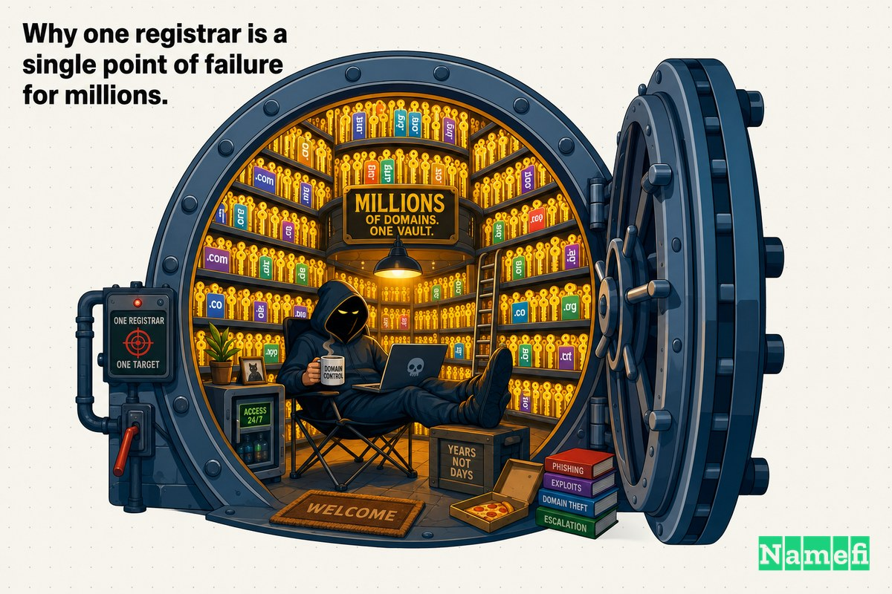
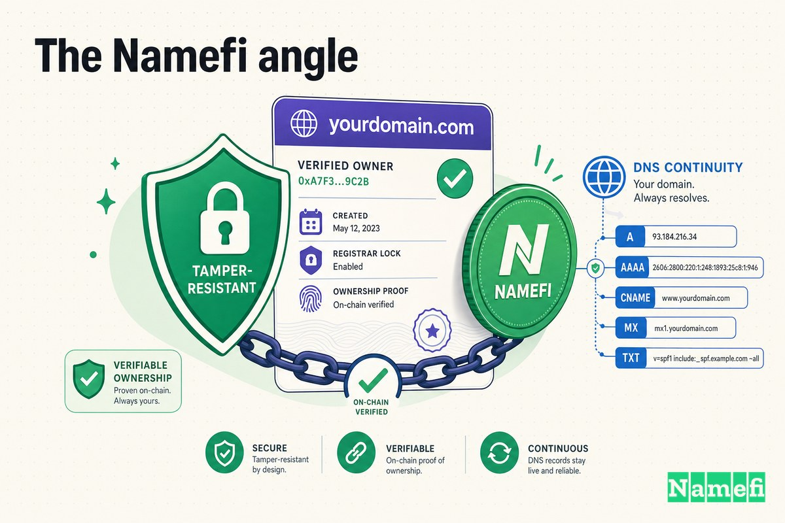

A domain registrar is the most boring company you will ever depend on completely.

You pay it once a year. You log in maybe twice. And in exchange it holds the one thing that makes your business reachable: the right to say "this name points here." Email, website, login, payments — every digital thread you own runs through whoever controls your domain's DNS. Most people never think about that company again after checkout.

For more than two years, a sophisticated threat actor group thought about GoDaddy constantly. They were living inside it.

GoDaddy is the largest domain registrar on earth, with tens of millions of customers and well over 80 million domains under management. And between at least early 2020 and the end of 2022, GoDaddy now believes, the same persistent intruder moved through its systems repeatedly — stealing source code, exposing the data of 1.2 million Managed WordPress customers, and at one point quietly rewiring random customer websites to redirect visitors to malicious destinations. The company did not describe it as a single break-in. It described, in a filing with the U.S. Securities and Exchange Commission, [a multi-year campaign by a sophisticated threat actor group](https://www.bleepingcomputer.com/news/security/godaddy-hackers-stole-source-code-installed-malware-in-multi-year-breach/#:~:text=Based%20on%20our%20investigation%2C%20we%20believe%20these%20incidents%20are%20part%20of%20a%20multi%2Dyear%20campaign%20by%20a%20sophisticated%20threat%20actor%20group).

This is what it looks like when the boring company at the bottom of your stack turns out to be a single point of failure for millions of other people too.

## Why one registrar is a single point of failure for millions

Concentration is the whole business model of a mass-market registrar. The economics only work at enormous scale: one provisioning system, one control panel, one credential store, one set of hosting servers, serving everybody. That efficiency is exactly what makes GoDaddy convenient — and exactly what makes it dangerous when an attacker gets in.

When a single small business gets hacked, one business has a bad week. When the platform holding millions of businesses' domains, websites, and certificates gets hacked, the blast radius is no longer one company. It is everyone who trusted that company with their name.

That is the asymmetry at the heart of registrar risk. The customer experiences GoDaddy as their own private dashboard. The attacker experiences it as a vault holding millions of keys at once — and you only have to pick the lock once.

It is worth being precise about what "single point of failure" means here, because it operates on two layers at once. The first is the registrar layer: the authority that decides where your domain's DNS points. If that is compromised, an attacker can redirect your entire domain — email and all — somewhere else. The second is the hosting and certificate layer: the servers, credentials, and SSL keys that serve and authenticate your actual website. GoDaddy is one of the rare companies that sits on both layers for the same customer at the same time. So when the same intruder touched its provisioning systems, its hosting servers, and its certificate material across the campaign, they were not pivoting between unrelated victims. They were moving around inside one company that happened to hold several different kinds of keys to the same millions of doors.

## The timeline: 2019 → 2022

The unsettling part of the GoDaddy story is not any single incident. It is that the incidents, examined together, line up into a years-long occupation. GoDaddy itself connected the dots only in retrospect.

**Late 2019 / March 2020 — the first foothold.** After a breach disclosed in 2020, GoDaddy [alerted 28,000 customers that an attacker used their web hosting account credentials in October 2019](https://www.bleepingcomputer.com/news/security/godaddy-hackers-stole-source-code-installed-malware-in-multi-year-breach/#:~:text=GoDaddy%20alerted%2028%2C000%20customers%20that%20an%20attacker%20used%20their%20web%20hosting%20account%20credentials%20in%20October%202019) to connect to their hosting accounts via SSH. The attacker did not need a zero-day; they needed credentials, and they got them. Security reporting later attributed this wave to social engineering — attackers [posing over the phone](https://krebsonsecurity.com/2023/02/when-low-tech-hacks-cause-high-impact-breaches/) to trick staff and customers into handing over access. As GoDaddy summarized for InformationWeek, [in March 2020, a threat actor compromised the login credentials of 28,000 customers](https://www.informationweek.com/cyber-resilience/godaddy-hit-with-multiyear-breach-#:~:text=In%20March%202020%2C%20a%20threat%20actor%20compromised%20the%20login%20credentials%20of%2028%2C000%20customers).

**September–November 2021 — the big one.** On November 22, 2021, GoDaddy disclosed a breach of its Managed WordPress hosting environment. The math was brutal: [the incident was discovered by GoDaddy](https://www.bleepingcomputer.com/news/security/godaddy-data-breach-hits-12-million-managed-wordpress-customers/#:~:text=The%20incident%20was%20discovered%20by%20GoDaddy%20last%20Wednesday%2C%20on%20November%2017%2C%20but%20the%20attackers%20had%20access%20to%20its%20network%20and%20the%20data%20contained%20on%20the%20breached%20systems%20since%20at%20least%20September%206%2C%202021) on November 17, 2021 — but the attackers had held access since at least September 6, 2021. That is roughly two and a half months of undetected presence. As TechCrunch reported, [the unauthorized person used a compromised password to get access to GoDaddy's systems around September 6](https://techcrunch.com/2021/11/22/godaddy-breach-million-accounts/#:~:text=the%20unauthorized%20person%20used%20a%20compromised%20password%20to%20get%20access%20to%20GoDaddy%27s%20systems%20around%20September%206).

**December 2022 — the malware and the redirects.** A year later, the pattern surfaced again. GoDaddy [received customer reports in early December 2022 that their sites were being used to redirect to random domains](https://www.bleepingcomputer.com/news/security/godaddy-hackers-stole-source-code-installed-malware-in-multi-year-breach/#:~:text=customer%20reports%20in%20early%20December%202022%20that%20their%20sites%20were%20being%20used%20to%20redirect%20to%20random%20domains). The investigation that followed is what produced the February 2023 disclosure — and the realization that this was not a new attacker, but the same campaign that had been recurring since 2020.

Read in sequence, these are not three breaches. They are three sightings of one long-term resident.

What makes the timeline so striking is the gaps between sightings. Months, then a year. Each individual incident, at the time it was disclosed, looked like a discrete event with a beginning and an end — a password reset here, a certificate reissue there. It was only when GoDaddy's investigators traced the December 2022 malware back through its tooling and methods that the events stopped looking like coincidences and started looking like a pattern. The most chilling sentence in the whole disclosure is the quiet admission that this had been going on for years before anyone connected it.

## What was exposed — and the websites that turned on their owners

The 2021 Managed WordPress breach is the incident with the cleanest, most quantified damage. GoDaddy's own notice, filed with the SEC, laid it out plainly.

Up to 1.2 million active and inactive Managed WordPress customers had their email address and customer number exposed. Worse, [the original WordPress Admin password that was set at the time of provisioning was exposed](https://www.bleepingcomputer.com/news/security/godaddy-data-breach-hits-12-million-managed-wordpress-customers/#:~:text=The%20original%20WordPress%20Admin%20password%20that%20was%20set%20at%20the%20time%20of%20provisioning%20was%20exposed) — the master key to those WordPress installs. For active customers, sFTP and database usernames and passwords were exposed, the credentials that let you upload files and read the database directly. And for the most sensitive subset, [the SSL private key was exposed](https://www.bleepingcomputer.com/news/security/godaddy-data-breach-hits-12-million-managed-wordpress-customers/#:~:text=For%20a%20subset%20of%20active%20customers%2C%20the%20SSL%20private%20key%20was%20exposed) — the cryptographic secret that proves a site is really itself.

Stack those up and you have a worst-case kit. Admin password gets you into the site. sFTP and database access let you alter it at the file and data layer. And the SSL private key — as Wordfence noted in its [analysis of the breach](https://www.wordfence.com/blog/2021/11/godaddy-breach-plaintext-passwords/) — could let an attacker impersonate a site or decrypt its traffic. A registrar that is supposed to anchor trust had instead handed an intruder the materials to forge it.

| What leaked | Who was affected | What it unlocks |
| --- | --- | --- |
| Email + customer number | Up to 1.2M active and inactive customers | Targeted phishing, account mapping |
| Original WordPress admin password | Affected customers (if still in use) | Full control of the WordPress install |
| sFTP + database credentials | Active customers | File-level and database-level site tampering |
| SSL private key | A subset of active customers | Site impersonation, traffic decryption |

The reach of the exposure tells you why this was different in kind from a normal site hack. A normal hack compromises one site. Here, a single break in a shared provisioning system exposed the keys to over a million of them in one motion.

Then there is the part that turns a data breach into something visceral: customer websites that began redirecting visitors to malicious sites. In December 2022, [an unauthorized third party gained access to and installed malware on our cPanel hosting servers](https://www.sophos.com/en-us/blog/godaddy-admits-crooks-hit-us-with-malware-poisoned-customer-websites/#:~:text=an%20unauthorized%20third%20party%20gained%20access%20to%20and%20installed%20malware%20on%20our%20cPanel%20hosting%20servers), GoDaddy said, and [the malware intermittently redirected random customer websites to malicious sites](https://www.sophos.com/en-us/blog/godaddy-admits-crooks-hit-us-with-malware-poisoned-customer-websites/#:~:text=The%20malware%20intermittently%20redirected%20random%20customer%20websites%20to%20malicious%20sites). "Intermittently" and "random" are the cruel words here. A redirect that fires every time is easy to catch. A redirect that fires sometimes, for some visitors, on some sites, is the kind of thing a small-business owner reports and then can't reproduce — and that their host can dismiss as a fluke. It is camouflage built into the attack.

## How it happened: borrowed keys, not broken locks

The most uncomfortable lesson of the GoDaddy story is how unglamorous the entry was.

There is no exotic zero-day at the center of this. The first wave ran on stolen credentials. The 2021 breach ran on [a compromised password](https://www.bleepingcomputer.com/news/security/godaddy-hackers-stole-source-code-installed-malware-in-multi-year-breach/#:~:text=1.2%20million%20Managed%20WordPress%20customers%20after%20attackers%20breached%20GoDaddy%27s%20WordPress%20hosting%20environment%20using%20a%20compromised%20password). Krebs on Security titled its analysis of the campaign ["When Low-Tech Hacks Cause High-Impact Breaches"](https://krebsonsecurity.com/2023/02/when-low-tech-hacks-cause-high-impact-breaches/) — exactly because the impact was so disproportionate to the sophistication of the entry. You don't need to defeat a vault if someone hands you the key.

Once inside, the attacker did the patient, professional thing: they stayed. Over the course of the campaign GoDaddy said the actors [installed malware on our systems and obtained pieces of code related to some services within GoDaddy](https://www.bleepingcomputer.com/news/security/godaddy-hackers-stole-source-code-installed-malware-in-multi-year-breach/#:~:text=installed%20malware%20on%20our%20systems%20and%20obtained%20pieces%20of%20code%20related%20to%20some%20services%20within%20GoDaddy). Stolen source code is not a one-time loss; it is a map. It tells an attacker how the systems they're already inside actually work — where the weak joints are, how authentication flows, what to target next. Combined with persistent malware, it is the difference between a smash-and-grab and a long-term occupation. As BleepingComputer summarized GoDaddy's own conclusion, [the threat actors were able to install malware on the company's systems and steal code](https://www.informationweek.com/cyber-resilience/godaddy-hit-with-multiyear-breach-#:~:text=Threat%20actors%20were%20able%20to%20install%20malware%20on%20the%20company%27s%20systems%20and%20steal%20code) repeatedly across years.

The detection gap is the other half of the story. Two and a half months in the 2021 incident. Years across the campaign as a whole. The attacker was not faster than GoDaddy's defenses so much as quieter than its monitoring.

## Response and aftermath

GoDaddy's immediate technical response to the 2021 breach was the standard playbook: reset the exposed sFTP and database passwords, and begin reissuing and installing new SSL certificates for the customers whose private keys had leaked. For the February 2023 disclosure, the company said it engaged external forensics experts and law enforcement, and characterized the actor as a sophisticated, organized group targeting hosting providers — not a lone opportunist.

But the reputational and regulatory aftermath outlasted the incident response. The series of breaches drew scrutiny from the U.S. Federal Trade Commission, which in 2025 [finalized an order with GoDaddy over data security failures](https://www.ftc.gov/news-events/news/press-releases/2025/05/ftc-finalizes-order-godaddy-over-data-security-failures), alleging the company had failed to implement reasonable security despite marketing its services with security assurances, and requiring it to stand up a comprehensive information-security program. A breach that began with a borrowed password ended, years later, as a federal consent order.

The disclosure timeline itself drew criticism: the multi-year framing only became public through an SEC 10-K filing in February 2023, which meant customers learned the 2020, 2021, and 2022 incidents were connected long after each had been individually reported.

There is a deeper accountability problem buried in that sequencing. Each disclosure, on its own, invited a small response — change a password, accept a new certificate, move on. But a customer who had been told three separate "isolated incident" stories had no way to understand that they might be dealing with one persistent adversary who had been near their data for years. The framing of a breach shapes how seriously the people downstream take it. Three small fires read very differently from one long-burning one.

## What this teaches about registrar concentration risk

Strip away the specifics and the GoDaddy campaign is a clinic in why registrar concentration is its own category of risk.

1. **The platform is the prize.** Attackers don't have to target you. They target the company that holds you and a million others. Your security posture barely matters if your registrar's provisioning system is the soft target — you inherit its blast radius whether you like it or not.

2. **Credentials are the front door, not exploits.** A compromised password did most of the damage here. Multi-factor authentication, credential hygiene, and aggressive anomaly detection matter more than any single fancy defense — because the entry point is almost always borrowed access, not a broken lock.

3. **Dwell time is the real metric.** Exposure of data is bad. An attacker living undetected in your provisioning system for months or years is catastrophically worse, because persistence compounds. The damage is a function of how long they stay, not just that they got in.

4. **Centralized secrets are centralized failure.** Storing admin passwords, sFTP credentials, and SSL private keys in one place, recoverable, is convenient right up until it is the single worst-case loss. When the same store holds the keys for 1.2 million customers, one breach is 1.2 million breaches.

5. **The website redirect is the customer's nightmare, not the registrar's.** When GoDaddy's servers redirected customer sites to malicious destinations, it was the customers' brands, customers, and SEO that paid — even though they did nothing wrong. Concentration risk is largely the risk of being harmed by someone else's mistake.

None of this means "never use a big registrar." Scale brings real security investment, and small providers fail too. It means understanding that when you hand your domain to a platform, you are accepting that platform's worst day as a possible version of your own.

## The Namefi angle

The deepest problem the GoDaddy campaign exposes is not malware. It is that ownership and control of a domain lived entirely inside one provider's private database — a database that, for years, an intruder could read, alter, and impersonate from the inside, while the rightful owners had no independent way to know.

[Namefi](https://namefi.io) is built around a different default: domains should behave like internet-native assets whose ownership is verifiable and tamper-resistant, not a row in a single company's account system that you can only confirm by logging in and hoping. Tokenized ownership makes the question "who actually controls this domain?" answerable from outside any one provider — auditable, portable, and harder to silently rewrite — while staying compatible with DNS so the name keeps resolving.

That doesn't make a registrar un-hackable. Nothing does. But it changes what a breach can quietly do. When proof of ownership lives in a verifiable, independent layer rather than solely inside the platform that was compromised, "the intruder lived in the database for two years" stops being the same thing as "the intruder controlled who owns what." The GoDaddy story is what happens when control and proof are the same fragile thing, held in one place. The lesson is to stop keeping them there.

## Sources and further reading

- BleepingComputer — [GoDaddy: Hackers stole source code, installed malware in multi-year breach](https://www.bleepingcomputer.com/news/security/godaddy-hackers-stole-source-code-installed-malware-in-multi-year-breach/)
- BleepingComputer — [GoDaddy data breach hits 1.2 million Managed WordPress customers](https://www.bleepingcomputer.com/news/security/godaddy-data-breach-hits-12-million-managed-wordpress-customers/)
- Krebs on Security — [When Low-Tech Hacks Cause High-Impact Breaches](https://krebsonsecurity.com/2023/02/when-low-tech-hacks-cause-high-impact-breaches/)
- Sophos — [GoDaddy admits: Crooks hit us with malware, poisoned customer websites](https://www.sophos.com/en-us/blog/godaddy-admits-crooks-hit-us-with-malware-poisoned-customer-websites)
- The Hacker News — [GoDaddy Discloses Multi-Year Security Breach Causing Malware Installations and Source Code Theft](https://thehackernews.com/2023/02/godaddy-discloses-multi-year-security.html)
- TechCrunch — [GoDaddy says data breach exposed over a million user accounts](https://techcrunch.com/2021/11/22/godaddy-breach-million-accounts/)
- SecurityWeek — [GoDaddy Breach Exposes 1.2 Million Managed WordPress Customer Accounts](https://www.securityweek.com/godaddy-breach-exposes-12-million-managed-wordpress-customer-accounts/)
- InformationWeek — [GoDaddy Hit with Multiyear Breach](https://www.informationweek.com/cyber-resilience/godaddy-hit-with-multiyear-breach-)
- BankInfoSecurity — [GoDaddy Confirms Breach Affects 1.2 Million Customers](https://www.bankinfosecurity.com/godaddy-confirms-breach-affects-12-million-customers-a-17974)
- Wordfence — [GoDaddy Breach — Plaintext Passwords — 1.2M Affected](https://www.wordfence.com/blog/2021/11/godaddy-breach-plaintext-passwords/)
- U.S. Federal Trade Commission — [FTC Finalizes Order with GoDaddy over Data Security Failures](https://www.ftc.gov/news-events/news/press-releases/2025/05/ftc-finalizes-order-godaddy-over-data-security-failures)
- GoDaddy (via SEC) — [Notice of Security Incident, November 22, 2021](https://www.sec.gov/Archives/edgar/data/1609711/000160971121000122/gddyblogpostnov222021.htm)
