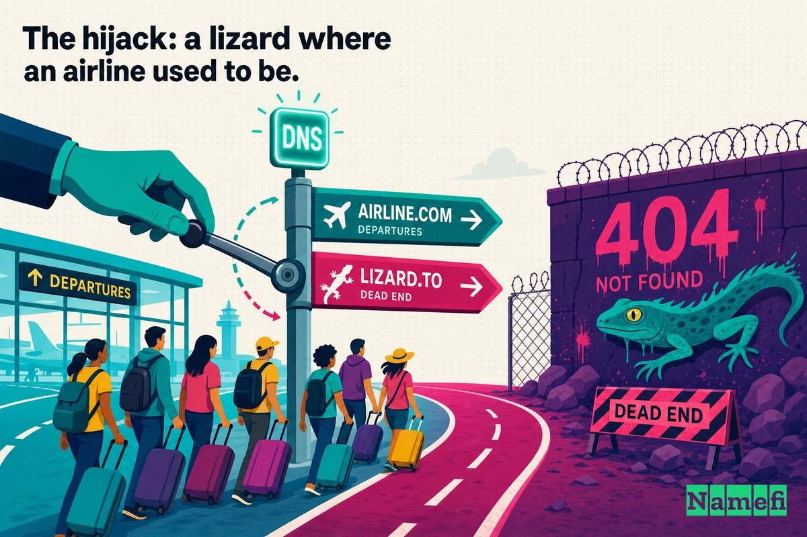

The plane was never found. In January 2015, neither was the website.

On the morning of January 26, 2015, anyone who typed **malaysiaairlines.com** into a browser did not reach the airline. They reached a hacker. The familiar booking page was gone, replaced by an image of a lizard in a top hat and monocle and a single, cruel headline: **"404 — Plane Not Found."** Below it: *"Hacked by Lizard Squad — Official Cyber Caliphate."* One browser title bar read, simply, *"ISIS will prevail."*

It was a joke about a graveyard. Less than a year earlier, Malaysia Airlines Flight 370 had vanished from radar with 239 people aboard. Four months after that, Flight 17 was shot out of the sky over Ukraine. Now a group of teenagers had turned the airline's own grief into a punchline served on its own front door — without ever touching its servers.

That last part is the whole story. Malaysia Airlines was not "hacked" in the way most people pictured it. Its booking systems were intact. Its passenger data sat untouched. What the attackers seized was something more fundamental and, it turns out, far easier to take: the **domain name itself** — the address that tells the entire internet where "Malaysia Airlines" lives.

This is a Domain Mayday case about the part of your infrastructure you probably never think about until it points somewhere else.

## An airline is its domain

For a global carrier, the website is not a brochure. It is the cash register, the check-in desk, and the call center, all keyed to one string of text: `malaysiaairlines.com`.

Every booking, every loyalty login, every "manage my flight" link in every confirmation email resolves through that domain. When a passenger in Kuala Lumpur or London types it in, an invisible chain fires: the browser asks the [Domain Name System (DNS)](/en/glossary/dns/) "where does malaysiaairlines.com live?", DNS answers with an [IP address](/en/glossary/ip-address/), and the browser connects. The airline's brand, its revenue, and its customers' trust all ride on that one lookup returning the *right* answer.

DNS is the internet's address book. It is also, for most organizations, the least-watched door in the building. You can spend millions hardening your servers, encrypting your databases, and training your staff against [phishing](/en/glossary/phishing/) — and none of it matters if someone can quietly change the line in the address book that says where your name points. Redirect the address, and you have redirected the company, without ever breaking into the building.

That is exactly what happened.

## The hijack: a lizard where an airline used to be

The defacement was crafted for maximum cruelty. The image of a lizard in formalwear was Lizard Squad's calling card; the group had spent the previous December knocking the [Xbox Live and Sony PlayStation Network](https://techcrunch.com/2015/01/25/malaysia-airlines-site-hacked-by-lizard-squad/#:~:text=Hacker%20group%20Lizard%20Squad%2C%20which%20took%20down%20Xbox%20Live%20and%20the%20Sony%20PlayStation%20Network%20last%20month) offline over the holidays. By January it had wrapped itself in the imagery of a "Cyber Caliphate," posturing as ISIS-aligned even as researchers treated the claim with deep skepticism.

The site, as visitors found it, [displayed a picture of a lizard in a top hat and monocle, as well as the text "404-Plane Not Found"](https://techcrunch.com/2015/01/25/malaysia-airlines-site-hacked-by-lizard-squad/#:~:text=The%20site%20currently%20displays%20a%20picture%20of%20a%20lizard%20in%20a%20top%20hat%20and%20monocle%2C%20as%20well%20as%20the%20text%20%27404%2DPlane%20Not%20Found%27). Wikipedia's account of the group records the same scene: users were [redirected to another page bearing an image of a tuxedo-wearing lizard](https://en.wikipedia.org/wiki/Lizard_Squad#:~:text=Users%20were%20redirected%20to%20another%20page%20bearing%20an%20image%20of%20a%20tuxedo%2Dwearing%20lizard), and the page [carried the headline "404 - Plane Not Found", an apparent reference to the airline's loss of flight MH370 the previous year](https://en.wikipedia.org/wiki/Lizard_Squad#:~:text=The%20page%20also%20carried%20the%20headline%20%22404%20%2D%20Plane%20Not%20Found%22%2C%20an%20apparent%20reference%20to%20the%20airline%27s%20loss%20of%20flight%20MH370%20the%20previous%20year).

The cruelty was the point. MH370 had [disappeared from radar on 8 March 2014](https://en.wikipedia.org/wiki/Malaysia_Airlines_Flight_370#:~:text=disappeared%20from%20radar%20on%208%20March%202014), all 239 people aboard eventually presumed dead, and the wreckage never conclusively located. MH17 had been [shot down by Russian-backed forces with a Buk 9M38 surface-to-air missile on 17 July 2014](https://en.wikipedia.org/wiki/Malaysia_Airlines_Flight_17#:~:text=shot%20down%20by%20Russian%2Dbacked%20forces%20with%20a%20Buk%209M38%20surface%2Dto%2Dair%20missile%20on%2017%20July%202014), killing all 298 aboard. To stamp "Plane Not Found" across the airline's homepage was to weaponize the worst year in the company's history — and to broadcast it to every customer trying to reach the site.

Then came the threat. The group [tweeted that it would "dump some loot found on www.malaysiaairlines.com servers soon,"](https://www.theregister.com/2015/01/26/lizard_squad_threaten_data_dump_after_attack_on_malaysia_airlines_site/#:~:text=Going%20to%20dump%20some%20loot%20found%20on%20www.malaysiaairlines.com%20servers%20soon) and even posted a screenshot it claimed showed passenger itineraries. For an airline already drowning in a year of catastrophe, the idea that customer data was loose was its own kind of disaster.

## How it happened: the address book, not the building

Here is the technical heart of it, and the reason this case belongs in a domain-security series rather than a server-breach one.

Malaysia Airlines' own statement, repeated across the coverage, drew the distinction precisely: [Malaysia Airlines confirms that its Domain Name System (DNS) has been compromised where users are re-directed to a hacker website when www.malaysiaairlines.com URL is keyed in](https://techcrunch.com/2015/01/25/malaysia-airlines-site-hacked-by-lizard-squad/#:~:text=Malaysia%20Airlines%20confirms%20that%20its%20Domain%20Name%20System%20%28DNS%29%20has%20been%20compromised%20where%20users%20are%20re%2Ddirected%20to%20a%20hacker%20website). The airline insisted its [website was not hacked and this temporary glitch does not affect their bookings and that user data remains secured](https://techcrunch.com/2015/01/25/malaysia-airlines-site-hacked-by-lizard-squad/#:~:text=Malaysia%20Airlines%20assures%20customers%20and%20clients%20that%20its%20website%20was%20not%20hacked%20and%20this%20temporary%20glitch%20does%20not%20affect%20their%20bookings%20and%20that%20user%20data%20remains%20secured), adding that its [web servers are intact](https://www.bankinfosecurity.com/malaysia-airlines-website-hacked-a-7833#:~:text=Malaysia%20Airlines%27%20Web%20servers%20are%20intact).

Both things were true at once: the site was wrecked, *and* the servers were fine. The attackers never needed the servers. As The Register put it, [DNS records for the site have been interfered with so that surfers are being redirected to a hacker-controlled site](https://www.theregister.com/2015/01/26/lizard_squad_threaten_data_dump_after_attack_on_malaysia_airlines_site/#:~:text=DNS%20records%20for%20the%20site%20have%20been%20interfered%20with%20so%20that%20surfers%20are%20being%20redirected%20to%20a%20hacker%2Dcontrolled%20site). They changed the address book entry, not the building it pointed to. Even the malice was filed in the metadata: a [Whois](/en/glossary/whois/) check at the time showed [ISIS will prevail](https://www.computerworld.com/article/1621206/malaysia-airlines-claim-dns-hijacked-site-not-hacked-but-attackers-threaten-data-dump.html#:~:text=ISIS%20will%20prevail) listed as the site's title.

Where was that domain registered? Contemporary coverage said it [appeared to be registered with Web Commerce Communications Limited — a.k.a. Webnic](https://www.bankinfosecurity.com/malaysia-airlines-website-hacked-a-7833#:~:text=registered%20with%20Web%20Commerce%20Communications%20Limited%20%2D%20a.k.a.%20Webnic%20%2D%20which%20has%20offices%20in%20Singapore%2C%20Malaysia%20and%20China). But the public reporting on this incident did not establish how the Malaysia Airlines DNS records were changed or confirm that Webnic itself was compromised.

About a month later, Webnic was at the center of reported redirects affecting **[Lenovo](/en/blog/the-lenovo-com-dns-hijack/)** and **Google Vietnam**. Brian Krebs reported statements from researchers who said attackers had seized control of Webnic.cc and used a command-injection flaw to upload a rootkit. Webnic said it was investigating and did not publicly confirm that mechanism. Those later incidents show why the registrar layer deserved scrutiny, but they do not prove that the same exploit caused the earlier Malaysia Airlines hijack.

You do not have to break into an airline's web server to redirect its homepage. You can instead compromise an account or provider that can change the domain's DNS. The Malaysia Airlines incident demonstrates that boundary even though its exact initial-access path was not publicly established.

## Impact and response

For the airline, the damage was reputational and operational rather than data-theft. Customers trying to book or check in hit a defacement. Headlines worldwide paired the words "Malaysia Airlines" with "hacked" — a brand already in crisis now associated with a lizard taunting it about its missing plane.

The airline moved to contain it the only way a DNS hijack can be contained: by working through the layer that had been subverted. It said it had [resolved the issue with its service provider](https://www.infosecurity-magazine.com/news/malaysia-air-site-back-hackers/#:~:text=resolved%20the%20issue%20with%20its%20service%20provider) and that the [system is expected to be fully recovered within 22 hours](https://www.infosecurity-magazine.com/news/malaysia-air-site-back-hackers/#:~:text=The%20system%20is%20expected%20to%20be%20fully%20recovered%20within%2022%20hours). That timeline is itself a DNS tell: even after you fix the records, the bad answer can linger in caches around the world until it expires. A hijack is fast to commit and slow to fully unwind.

On the data-dump threat, the airline held its line — bookings unaffected, user data secured — and the catastrophic leak the group boasted about never materialized as described. But "we weren't really breached, the attackers only controlled our entire public identity for the better part of a day" is a difficult message to land with the traveling public. To a customer staring at "404 — Plane Not Found," the distinction between a server breach and a DNS hijack is invisible. The site was the airline. And for a day, the site belonged to someone else.

## What this teaches about DNS as your front door

The Malaysia Airlines hijack is a textbook lesson precisely because *nothing was breached* in the conventional sense. The takeaways generalize to almost every organization online:

1. **Your domain is a single point of failure you don't control alone.** Registrar, registry, and DNS-hosting systems can each affect where a name points. Hardened web servers do not prevent a DNS-layer redirect, and the public record here does not identify which provider or credential was the initial point of compromise.

2. **A DNS hijack needs no breach of you.** Attackers redirected the address book, not the building. Defenses that watch your servers, your code, and your network can miss an attack that happens entirely at the naming layer.

3. **Use controls matched to the layer.** `clientTransferProhibited` blocks inter-registrar transfer; it does not block nameserver or hosted-zone changes. A [Registry Lock](/en/glossary/registry-lock/) service may add out-of-band approval for registry-object changes such as delegation, while DNS-host records need separate provider access controls. Confirm exactly which operations each lock covers.

4. **Use phishing-resistant authentication and understand [DNSSEC](/en/glossary/dnssec/).** Strong authentication protects management accounts. DNSSEC lets validating resolvers detect answers that do not match the signed delegation, but it does not prevent every authorized registrar, registry, or DNS-provider change; a bad change can also cause validation failure and an outage.

5. **Recovery is slower than the attack.** TTLs and global caches mean a hijack outlives its fix. Plan for the cleanup window, not just the patch.

The uncomfortable summary: most companies guard the building and leave a sticky note on the front door telling everyone which building to walk into. Change the note, and you have moved the company.

## The Namefi angle

The Malaysia Airlines hijack was a DNS-resolution incident: someone changed where the name pointed. That DNS administration is separate from [domain ownership](/en/glossary/domain-ownership/). An ownership record does not automatically record, prevent, or reverse changes made through a registrar, registry, or DNS-hosting control plane.

[Namefi](https://namefi.io) provides an on-chain ownership and transfer layer for tokenized domains. It can make the tokenized ownership state auditable while remaining compatible with DNS, but tokenization alone would not have prevented or necessarily exposed this DNS redirect. The relevant defenses are strong provider authentication, update-prohibiting controls where available, continuous monitoring of delegation and hosted-zone records, and a tested multi-provider recovery process.

Malaysia Airlines never lost its servers. It lost the answer to a single question — *where does this name point?* — for about a day. The plane was never found. The website should never have been lost either. The lesson of Domain Mayday is that the address book is part of the perimeter, and the day you forget that is the day a lizard in a top hat moves into your front door.

## Sources and further reading

- TechCrunch — [Malaysia Airlines Site Hacked By Lizard Squad](https://techcrunch.com/2015/01/25/malaysia-airlines-site-hacked-by-lizard-squad/)
- The Register — [Lizard Squad threatens Malaysia Airlines with data dump](https://www.theregister.com/2015/01/26/lizard_squad_threaten_data_dump_after_attack_on_malaysia_airlines_site/)
- BankInfoSecurity — [Malaysia Airlines Website Hacked](https://www.bankinfosecurity.com/malaysia-airlines-website-hacked-a-7833)
- Computerworld — [Malaysia Airlines claim DNS hijacked, site not hacked, but attackers threaten data dump](https://www.computerworld.com/article/1621206/malaysia-airlines-claim-dns-hijacked-site-not-hacked-but-attackers-threaten-data-dump.html)
- Infosecurity Magazine — [Malaysia Airlines Site Back Up as Hackers Threaten Data Dump](https://www.infosecurity-magazine.com/news/malaysia-air-site-back-hackers/)
- Krebs on Security — [Webnic Registrar Blamed for Hijack of Lenovo, Google Domains](https://krebsonsecurity.com/2015/02/webnic-registrar-blamed-for-hijack-of-lenovo-google-domains/)
- Help Net Security — [Lenovo.com hijacking made possible by compromise of Webnic registrar](https://www.helpnetsecurity.com/2015/02/26/lenovocom-hijacking-made-possible-by-compromise-of-webnic-registrar/)
- ABC News — [Malaysia Airlines Hit by Lizard Squad Hack Attack](https://abcnews.go.com/Technology/malaysia-airlines-hit-lizard-squad-hack-attack/story?id=28489244)
- NBC News — [Lizard Squad Claims It Hacked Malaysia Airlines Website](https://www.nbcnews.com/storyline/isis-terror/lizard-squad-claims-it-hacked-malaysia-airlines-website-n293461)
- IT Security Guru — [Lizard Squad hijacks Malaysia Airline DNS](https://www.itsecurityguru.org/2015/01/26/lizard-squad-hijacks-malaysia-airline-dns/)
- Wikipedia — [Lizard Squad](https://en.wikipedia.org/wiki/Lizard_Squad)
- Wikipedia — [Malaysia Airlines Flight 370](https://en.wikipedia.org/wiki/Malaysia_Airlines_Flight_370)
- Wikipedia — [Malaysia Airlines Flight 17](https://en.wikipedia.org/wiki/Malaysia_Airlines_Flight_17)
