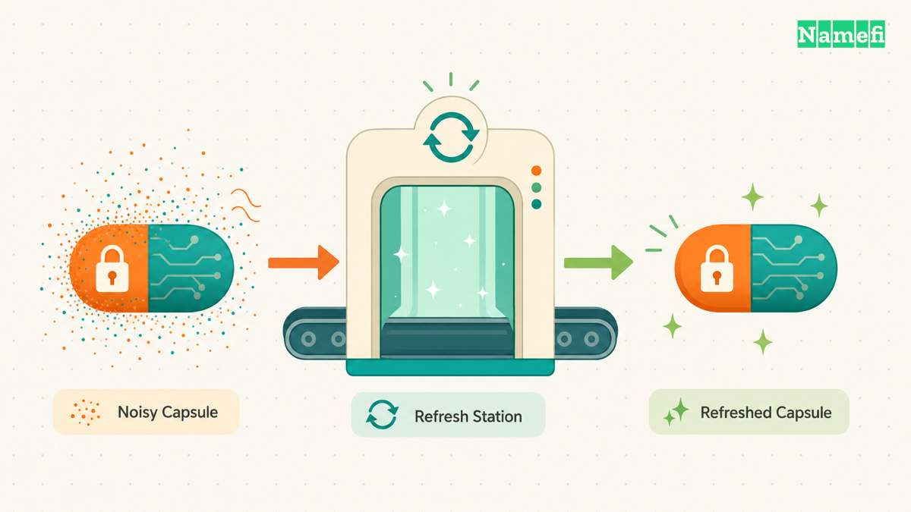
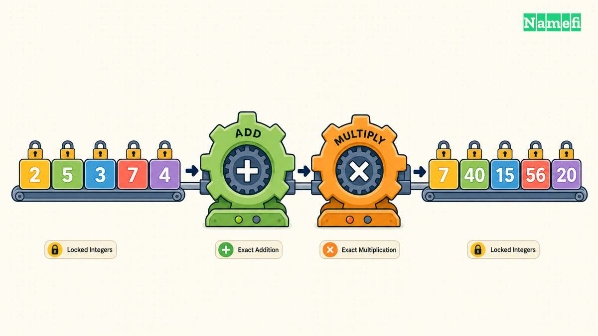
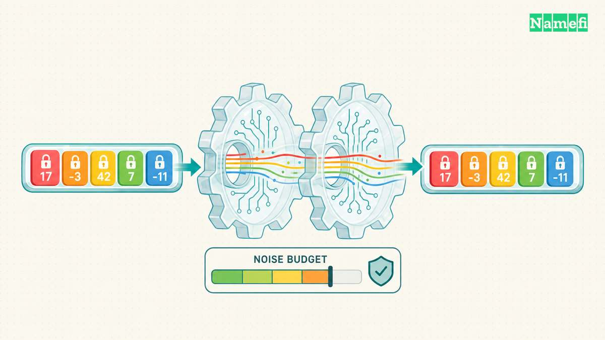
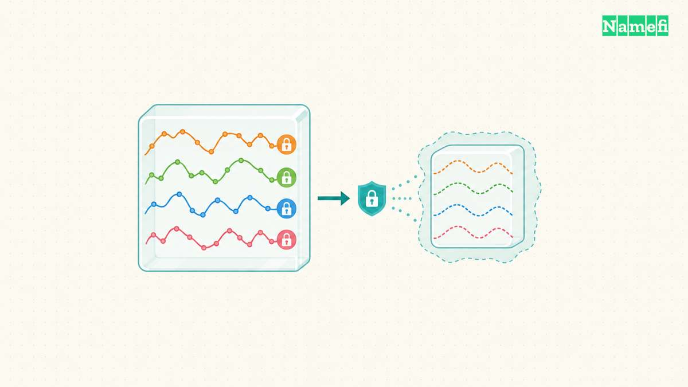
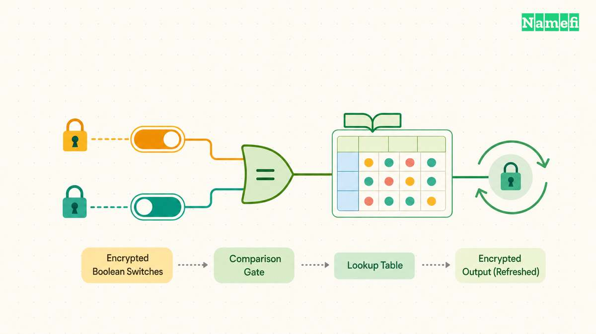

[Fully homomorphic encryption](/en/glossary/fully-homomorphic-encryption/) (FHE) lets a server compute on ciphertexts without receiving the decryption key. The result stays encrypted until an authorized key holder decrypts it. That common promise hides a major design choice: **what kind of plaintext computation does the application need?**

[BFV](/en/glossary/bfv/) and [BGV](/en/glossary/bgv/) target exact modular integers. [CKKS](/en/glossary/ckks/) targets approximate real or complex numbers. [TFHE](/en/glossary/tfhe/) began with Boolean gates and now supports fixed-precision integers and programmable lookup-style functions. Choosing the wrong family can turn a natural workload into an expensive collection of workarounds.

This guide compares the four families by data type, bootstrapping cost, workload fit, and implementation maturity. The ratings are directional, not universal benchmarks. FHE performance changes by orders of magnitude with parameter selection, multiplicative depth, packing, hardware, library version, and acceptable security level. Microsoft SEAL warns that the gap between efficient and inefficient implementations can itself be several orders of magnitude ([Microsoft SEAL](https://github.com/microsoft/SEAL#:~:text=the%20difference%20between%20efficient%20and%20inefficient%20implementations%20can%20be%20several%20orders%20of%20magnitude)).

---

## First, Understand Noise and Bootstrapping

Homomorphic operations increase noise inside a ciphertext. If noise grows past the selected parameter budget, decryption fails or loses too much precision. A **leveled** deployment chooses parameters large enough for a known circuit depth and stops before that limit. A **bootstrapped** deployment homomorphically refreshes a ciphertext so computation can continue.

Bootstrapping is what turns a bounded-depth scheme into a fully homomorphic one in practice, but it is usually one of the most expensive operations. It is also implementation-specific. A scheme may support bootstrapping in research while a particular library exposes only leveled evaluation. OpenFHE, for example, lists approximate CKKS bootstrapping and TFHE-style functional bootstrapping in its current feature set ([OpenFHE](https://github.com/openfheorg/openfhe-development#:~:text=Cheon%2DKim%2DKim%2DSong%20%28CKKS%29%20scheme%20for%20real%2Dnumber%20arithmetic)). HElib separately implements BGV with bootstrapping ([HElib](https://ibm.github.io/fhe-toolkit-linux/html/helib/index.html#:~:text=BGV%20scheme%20with%20bootstrapping)).

That is why the comparison table describes both the scheme family and the mature libraries available today rather than pretending “supports bootstrapping” is a single yes-or-no property.

---

## BFV: Exact Modular Integer Arithmetic

BFV, named for Brakerski, Fan, and Vercauteren, encrypts integers in a chosen plaintext modulus. Additions and multiplications produce the same modular result that plaintext arithmetic would produce. Microsoft SEAL groups BFV with BGV as the right family when exact values are required, in contrast to CKKS's approximate results ([Microsoft SEAL](https://github.com/microsoft/SEAL#:~:text=For%20applications%20where%20exact%20values%20are%20necessary)).

BFV works well when the algorithm is naturally a bounded arithmetic circuit: private counts, exact sums, set-membership helpers, database statistics, or batched calculations over small integers. Ciphertext packing can place many plaintext slots in one ciphertext, so the same operation runs across a vector of values in parallel.

The modulus is not a cosmetic parameter. Arithmetic wraps modulo the selected plaintext modulus, and the ciphertext parameters must accommodate the circuit's depth and noise growth. Comparisons, branches, and division are not native integer-program instructions; they must be represented as circuits or handled through a different scheme. Microsoft SEAL notes that encrypted comparison and sorting are generally not feasible with its BFV/BGV/CKKS arithmetic interface ([Microsoft SEAL](https://github.com/microsoft/SEAL#:~:text=Other%20operations%2C%20such%20as%20encrypted%20comparison%2C%20sorting)).

**Bootstrapping profile:** expensive and less commonly exposed than leveled BFV. Many production-style BFV workloads size parameters for a known depth and avoid bootstrapping entirely.

**Best fit:** exact, vectorizable integer arithmetic with a known circuit depth.

**Libraries:** Microsoft SEAL and OpenFHE both provide BFV examples and APIs; OpenFHE also supports threshold BFV ([OpenFHE](https://github.com/openfheorg/openfhe-development#:~:text=Threshold%20FHE%20for%20BGV%2C%20BFV%2C%20and%20CKKS)).

---

## BGV: Exact Arithmetic with a Deep Optimization History

BGV, named for Brakerski, Gentry, and Vaikuntanathan, also targets exact modular integer arithmetic. For a newcomer, its application-level capability can look nearly identical to BFV: both support packed additions and multiplications over encrypted integers, and both require parameters that control modulus, depth, noise, and [cryptographic security](/en/glossary/cryptographic-security/).

The families manage scaling and noise differently under the hood, so their performance can diverge for the same circuit. There is no honest rule that BGV always beats BFV or vice versa. The implementation, modulus structure, packing pattern, and operation mix decide. A sensible workflow is to model the circuit, benchmark both in the same library at the same security level, and choose from measured results.

BGV's practical advantage is a long optimization record for deep exact circuits. HElib implements BGV with packing, automatic noise management, multithreading, and improved bootstrapping ([HElib](https://ibm.github.io/fhe-toolkit-linux/html/helib/index.html#:~:text=HElib%20supports%20an%20%22assembly%20language%20for%20HE%22)). Microsoft SEAL and OpenFHE also expose BGV alongside BFV, making cross-scheme testing possible.

**Bootstrapping profile:** still costly, but BGV has mature bootstrapping implementations such as HElib. For bounded circuits, leveled BGV remains simpler.

**Best fit:** exact modular computations, especially deeper packed circuits where an established BGV implementation benchmarks well.

**Libraries:** HElib, OpenFHE, and Microsoft SEAL.

---

## CKKS: Approximate Real and Complex Arithmetic

CKKS, named for Cheon, Kim, Kim, and Song, is designed for approximate arithmetic. It encodes real or complex values into ciphertext slots, then supports vectorized additions and multiplications while carrying controlled approximation error. Microsoft SEAL explicitly recommends CKKS for tasks such as encrypted real-number sums, machine-learning inference, and distance calculations ([Microsoft SEAL](https://github.com/microsoft/SEAL#:~:text=summing%20up%20encrypted%20real%20numbers)).

Approximation is the feature, not a defect. Statistical analysis and neural-network inference already tolerate bounded numerical error, and CKKS avoids forcing every decimal into an exact integer representation. It also packs many values into one ciphertext, making linear algebra and SIMD-style polynomial evaluation natural.

CKKS is a poor default for values that must match bit-for-bit, such as account balances, vote counts, or exact equality tests. Rescaling consumes levels and reduces precision; comparisons and discontinuous functions usually require polynomial approximation or switching into a TFHE/FHEW-style scheme. OpenFHE documents scheme switching from CKKS to FHEW/TFHE for non-smooth functions such as comparison ([OpenFHE](https://github.com/openfheorg/openfhe-development#:~:text=Switching%20between%20CKKS%20and%20FHEW%2FTFHE%20to%20evaluate%20non%2Dsmooth%20functions)).

**Bootstrapping profile:** expensive and approximate, but available in mature implementations. OpenFHE ships simple, advanced, and iterative CKKS bootstrapping examples ([OpenFHE](https://github.com/openfheorg/openfhe-development#:~:text=Simple%20CKKS%20Bootstrapping%20Example)).

**Best fit:** privacy-preserving analytics, numerical simulation, signal processing, and machine-learning inference over encrypted vectors.

**Libraries:** Microsoft SEAL, OpenFHE, and HElib.

---

## TFHE: Boolean Logic, Integers, and Programmable Bootstrapping

TFHE, short for Fully Homomorphic Encryption over the Torus, approaches computation at a smaller granularity. It became known for evaluating Boolean gates and refreshing ciphertexts frequently. Modern variants extend that model to fixed-precision signed and unsigned integers and use **programmable bootstrapping** to refresh a ciphertext while applying a lookup function.

Zama's TFHE-rs documentation describes a Rust implementation for Boolean and integer arithmetic and says its variant supports function evaluation through programmable bootstrapping ([TFHE-rs](https://docs.zama.ai/tfhe-rs/get-started#:~:text=function%20evaluation%20via%20Programmable%20Bootstrapping)). OpenFHE similarly describes TFHE-family schemes as tools for Boolean circuits and arbitrary functions over larger plaintext spaces using lookup tables ([OpenFHE](https://github.com/openfheorg/openfhe-development#:~:text=schemes%20for%20evaluating%20Boolean%20circuits%20and%20arbitrary%20functions)).

That makes TFHE a natural fit for control-heavy logic: comparisons, thresholds, bit operations, table lookups, and conditional selection. These operations are awkward in BFV, BGV, or CKKS because arithmetic ciphertexts do not directly expose branching.

The trade-off is throughput for wide numerical workloads. Bootstrapping remains expensive even when highly optimized, and bitwise or small-integer evaluation may require many operations for large-precision arithmetic. GPU and dedicated-hardware acceleration can change the practical result, so TFHE performance claims should always name the precision, parameter set, hardware, and library version.

**Bootstrapping profile:** frequent and central to the design; programmable bootstrapping combines noise refresh with function evaluation.

**Best fit:** encrypted comparisons, Boolean circuits, fixed-precision integer logic, and lookup-heavy applications.

**Libraries:** TFHE-rs, Concrete, and OpenFHE's FHEW/TFHE module. TFHE-rs exposes Rust, C, [WebAssembly](/en/glossary/webassembly/), GPU, and HPU backends ([TFHE-rs](https://docs.zama.ai/tfhe-rs#:~:text=TFHE%2Drs%20is%20a%20pure%20Rust%20implementation)).

---

## Comparison Table

| Scheme | Native data type | Bootstrapping cost / pattern | Best-fit workload | Maturity | Example libraries / projects |
|---|---|---|---|---|---|
| **BFV** | Exact integers modulo a plaintext modulus; packed vectors | High; often avoided with a pre-sized leveled circuit | Exact sums, counts, private database arithmetic, bounded integer circuits | Mature leveled implementations; bootstrapping support varies by library | Microsoft SEAL, OpenFHE |
| **BGV** | Exact modular integers; packed vectors | High; mature but specialized implementations exist | Deep exact arithmetic and packed integer circuits | Mature research and library ecosystem | HElib, OpenFHE, Microsoft SEAL |
| **CKKS** | Approximate real or complex numbers; packed vectors | High and approximate; practical implementations available | Machine-learning inference, statistics, signal processing, numerical analytics | Mature for approximate arithmetic | Microsoft SEAL, OpenFHE, HElib |
| **TFHE** | Boolean values and fixed-precision integers; lookup functions | Frequent programmable bootstrapping; still expensive but highly optimized | Comparisons, thresholds, bitwise logic, conditional and lookup-heavy programs | Active library ecosystem with hardware acceleration | TFHE-rs, Concrete, OpenFHE FHEW/TFHE |

The table is a starting point, not a substitute for benchmarking. The same application may also combine schemes: CKKS for vector arithmetic, then scheme switching into TFHE for a comparison, or BFV/BGV for exact accounting around a smaller Boolean control circuit.

---

## How This Connects to Blockchains and Tokenized Domains

FHE can hide [smart contract](/en/glossary/smart-contract/) inputs and intermediate state from the machine performing the computation. A confidential blockchain application might use BFV or BGV for exact encrypted quantities, CKKS for private analytics, or TFHE for rules containing comparisons and branching.

For [tokenized domains](/en/blog/what-are-tokenized-domains/), that could eventually mean evaluating a private reserve threshold, eligibility rule, or sealed-bid condition without revealing every input. It does **not** mean an existing domain NFT becomes private merely because a service uses FHE: key management, access control, ciphertext availability, contract integration, and proof of correct decryption remain separate design problems.

The practical selection rule is simple. Start with the plaintext computation's data type and operations, then benchmark a mature library under the required security parameters. Choosing a scheme by brand recognition reverses the engineering process.

---

## Sources and Further Reading

- [Microsoft SEAL](https://github.com/microsoft/SEAL) — fetched 2026-09-19
- [OpenFHE Development Repository and Capability Overview](https://github.com/openfheorg/openfhe-development) — fetched 2026-09-19
- [HElib Documentation](https://ibm.github.io/fhe-toolkit-linux/html/helib/index.html) — fetched 2026-09-19
- [Welcome to TFHE-rs](https://docs.zama.ai/tfhe-rs) — fetched 2026-09-19
- [What Is TFHE-rs?](https://docs.zama.ai/tfhe-rs/get-started) — fetched 2026-09-19
