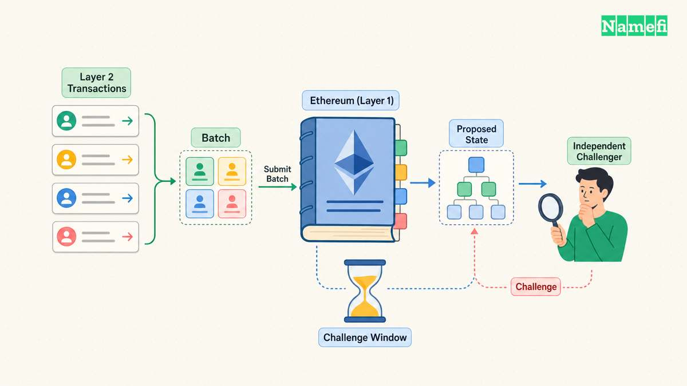
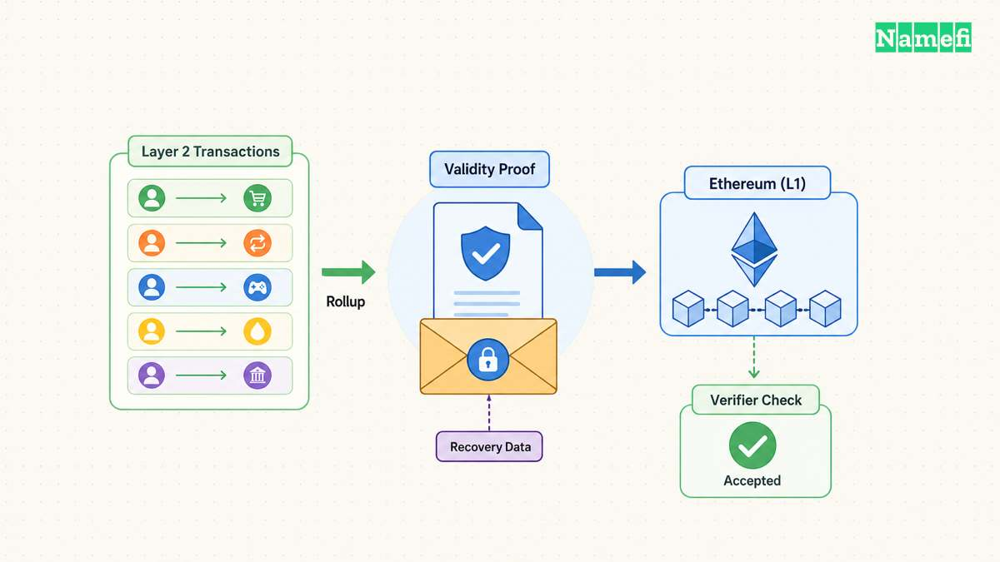
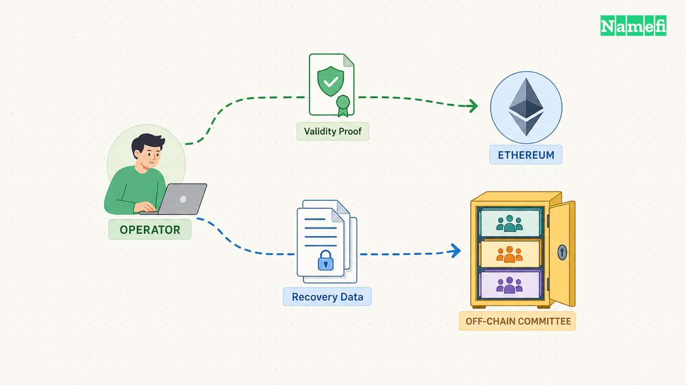
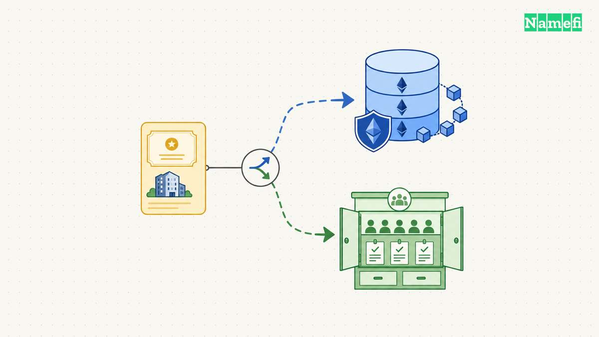

A [rollup](/en/glossary/rollup/) executes transactions away from a base chain, compresses the results, and settles them back to that chain. The two strict rollup families are **optimistic rollups**, which let challengers dispute an invalid state transition, and **ZK or validity rollups**, which attach a cryptographic proof of correctness.

[Validium](/en/glossary/validium/) and [volition](/en/glossary/volition/) are often included in the same comparison because they reuse validity proofs while changing where transaction data lives. Strictly speaking, a validium is **not** a rollup: its data is held off-chain instead of being made available by the settlement chain. A volition lets users or applications choose between the rollup and validium data paths. The proof may be identical; the [data availability](/en/glossary/data-availability/) guarantee is not.

That distinction drives security, withdrawal behavior, and cost. “ZK” describes how execution is proven. It does not, by itself, tell you where the data needed to reconstruct state is stored.

---

## Optimistic Rollups: Verify When Challenged

An [optimistic rollup](/en/glossary/optimistic-rollup/) posts compressed transaction data and state commitments to Ethereum but does not attach a validity proof to every batch. It is “optimistic” because the protocol accepts a proposed state unless someone challenges it during a fixed window. Ethereum's documentation says a successful challenge triggers fraud-proof computation and correction of the rollup state ([ethereum.org](https://ethereum.org/en/developers/docs/scaling/optimistic-rollups/#:~:text=Optimistic%20rollups%20instead%20rely%20on%20a%20fraud%2Dproving%20scheme)).

The security model therefore needs available data and at least one honest, functioning challenger. Transaction data is published to Ethereum as calldata or blobs so independent nodes can reconstruct the rollup and detect an invalid claim. Ethereum's documentation calls data availability critical because challengers cannot construct fraud proofs without the state data ([ethereum.org](https://ethereum.org/en/developers/docs/scaling/optimistic-rollups/#:~:text=Data%20availability%20is%20critical%20because%20without%20access%20to%20state%20data)).

The visible trade-off is exit latency. A canonical withdrawal to L1 generally waits through the challenge period, which Ethereum describes as roughly seven days ([ethereum.org](https://ethereum.org/en/developers/docs/scaling/optimistic-rollups/#:~:text=challenge%20period%E2%80%94lasting%20roughly%20seven%20days)). Liquidity providers can advance funds sooner for a fee, but that changes the route, not the canonical protocol delay.

**Cost profile:** no validity prover is required for every batch, and EVM equivalence is mature. The rollup still pays to publish data to Ethereum and to operate sequencers, batchers, proposers, and challengers.

**Example networks:** OP Mainnet uses Ethereum data availability; the [OP Stack derivation specification](https://specs.optimism.io/protocol/derivation.html) describes how an L2 chain is reconstructed from L1 data. Other OP Stack chains can use alternative DA configurations, so the stack name alone does not guarantee Ethereum DA. Arbitrum One runs Nitro, which Arbitrum describes as a second-generation optimistic rollup ([Arbitrum Nitro whitepaper](https://docs.arbitrum.io/nitro-whitepaper.pdf#page=1)).

---

## ZK or Validity Rollups: Prove Every State Transition

A [ZK-rollup](/en/glossary/zk-rollup/), more precisely called a **validity rollup**, submits a cryptographic proof that the new state follows from the old state and the batch's transactions. The L1 verifier checks the proof instead of waiting for a challenger to find fraud. Ethereum's documentation says validity proofs confirm off-chain state transitions without re-executing those transactions on Ethereum ([ethereum.org](https://ethereum.org/en/developers/docs/scaling/zk-rollups/#:~:text=ZK%2Drollups%20use%20validity%20proofs%20to%20confirm)).

The “ZK” label can be misleading. A scaling proof needs soundness, but it does not always hide transaction data. Many validity rollups publish state differences or transaction data so anyone can reconstruct the chain. Starknet, for example, publishes compressed state diffs to Ethereum while using aggregated [STARK](/en/glossary/stark/) proofs to establish correct execution ([Starknet documentation](https://docs.starknet.io/learn/protocol/intro#:~:text=publishing%20compressed%20state%20diffs%20to%20Ethereum)).

Once L1 verifies the proof and the required withdrawal data is available, a canonical exit does not need a week-long fraud window. The delay is instead governed by batch inclusion, proof generation and aggregation, L1 submission, and finality. That can still take time, but it is not an optimistic challenge delay.

**Cost profile:** data publication remains an L1 cost, and proving requires substantial compute. The advantage is succinct verification and faster cryptographic finality. Batch size, proof recursion, and specialized prover hardware can amortize that cost across many transactions.

**Example networks:** Starknet is a permissionless Ethereum validity rollup using STARK proofs ([Starknet documentation](https://docs.starknet.io/learn/protocol/intro#:~:text=Starknet%20is%20a%20decentralized%2C%20permissionless%20Layer%202)). ZKsync Era generates validity proofs for off-chain batches and submits them to Ethereum ([ZKsync documentation](https://docs.zksync.io/zksync-network/zksync-era#:~:text=generates%20a%20succinct%20zero%2Dknowledge%20validity%20proof)). Scroll describes itself as a general-purpose ZK rollup that uses the EVM for off-chain computation ([Scroll documentation](https://docs.scroll.io/en/technology/zkevm/intro-to-zkevm/#:~:text=Scroll%20is%20a%20general%2Dpurpose%20ZK%20rollup)).

---

## Validium: Valid Execution, Off-Chain Data

A **validium** uses the same kind of validity proof for execution but keeps the data needed to reconstruct state outside Ethereum. The L1 contract can reject an invalid state transition, yet it cannot guarantee that an off-chain operator or committee will reveal the data users need to prove balances and exit.

Ethereum's validium guide states the distinction directly: validiums use validity proofs like ZK-rollups but do not store transaction data on Mainnet ([ethereum.org](https://ethereum.org/en/developers/docs/scaling/validium/#:~:text=doesn%E2%80%99t%20store%20transaction%20data%20on%20the%20Ethereum%20Mainnet)). It also identifies the failure mode: if data-availability managers withhold state, users may be unable to compute the Merkle proofs required for withdrawal ([ethereum.org](https://ethereum.org/en/developers/docs/scaling/validium/#:~:text=validium%20users%20can%20have%20their%20funds%20frozen)).

Designs try to reduce that risk with a data-availability committee (DAC), bonded providers, or a separate decentralized data-availability network. Those mechanisms can be robust, but the security is no longer inherited solely from Ethereum. A careful system description must name the DA provider and the threshold or economic assumption behind it.

**Withdrawal profile:** no fraud window is necessary after proof verification, so exits can be fast **if the required data is available**. Data withholding can delay or block the user's ability to construct an exit proof.

**Cost profile:** lower than an equivalent validity rollup because the system avoids publishing full recovery data to Ethereum. The saving is payment for accepting an additional DA assumption.

**Example networks and applications:** StarkEx supports a Validium mode in which a DAC stores off-chain state. StarkWare says Validium requires trusting the committee but saves L1 gas relative to Rollup mode ([StarkWare](https://starkware.co/blog/starkex-version-4-5-is-here/#:~:text=Validium%20applications%20have%20a%20Data%20Availability%20Committee)). StarkEx deployments have included Sorare, Immutable X, and other application-specific systems; deployment status and chosen DA mode should be checked per application rather than inferred from the shared proving engine.

---

## Volition: Let the User Choose the DA Path

A **volition** combines rollup and validium state inside one system. An application or user can place one asset or account on the on-chain DA tree and another on the off-chain DA tree. The execution proof covers both, but the recovery guarantee follows the chosen tree.

StarkEx 4.5 describes Volition as a choice, for each asset, between Rollup mode with on-chain data and Validium mode with off-chain data ([StarkWare](https://starkware.co/blog/starkex-version-4-5-is-here/#:~:text=lets%20your%20users%20choose%20between%20Rollup%20mode)). Its implementation uses two state trees and moves an account between modes by transferring funds to the other tree.

This is more than a fee toggle. Assets on the rollup side retain the stronger L1 data-availability guarantee and pay the corresponding publication cost. Assets on the validium side are cheaper but depend on the external DA mechanism. A wallet must communicate that difference clearly; otherwise two balances shown in the same interface can have materially different exit guarantees.

**Withdrawal profile:** depends on the selected mode. The rollup side exits after proof verification and L1 finality; the validium side also needs its off-chain data to remain available.

**Cost profile:** selectable per asset or account. The application gains flexibility but must operate, audit, and explain both DA paths.

**Example network / engine:** StarkEx Spot Trading introduced Volition in version 4.5. StarkWare says rollup users pay the on-chain publication cost while validium users pay less ([StarkWare](https://starkware.co/blog/starkex-version-4-5-is-here/#:~:text=Rollup%20users%20pay%20more)).

---

## Comparison Table

| Type | Where data lives | Security inheritance | Canonical withdrawal delay | Relative cost | Example networks / engines |
|---|---|---|---|---|---|
| **Optimistic rollup** | Transaction data on Ethereum as blobs or calldata | Ethereum DA and settlement, plus an honest/available challenger and working fault-proof path | Usually about seven days for L2→L1; fast bridges add a liquidity-provider assumption | Low; pays L1 data, no per-batch validity prover | OP Mainnet, Arbitrum One |
| **ZK / validity rollup** | Recovery data on Ethereum as blobs, calldata, or state diffs | Ethereum DA and settlement plus sound validity-proof implementation | No fraud window; waits for proof generation, L1 verification, and finality | Low to moderate; pays L1 data and prover compute | Starknet, ZKsync Era, Scroll |
| **Validium** | Off-chain DAC or external DA system; commitments and proofs settle on L1 | L1 enforces valid execution, but data recovery depends on the external DA assumption | Potentially fast after proof verification; may be blocked by unavailable data | Very low relative to on-chain DA | StarkEx Validium deployments; application-specific validiums |
| **Volition** | User/application chooses on-chain rollup DA or off-chain validium DA | Per-position: rollup guarantee on one tree, external DA assumption on the other | Depends on the selected DA mode | Selectable; higher for on-chain DA, lower for off-chain DA | StarkEx Spot Volition |

These rows describe protocol ideals. A real network may add upgrade keys, a centralized sequencer, permissioned provers, emergency councils, custom bridges, or delayed escape hatches. Those controls can dominate the risk in practice, so the rollup label should begin—not end—a security review.

---

## How This Connects to Tokenized Domains

A [tokenized domain](/en/blog/what-are-tokenized-domains/) can move across an L2 like any other on-chain asset, but the DA model determines whether an owner can independently reconstruct state and exit if the operator disappears. For a high-value ownership record, the difference between “execution was valid” and “the data needed to prove my balance is available” is fundamental.

An optimistic rollup offers mature EVM tooling but a slow canonical exit. A validity rollup offers proof-based finality but pays for proving and L1 data. A validium reduces cost by adding an external DA assumption. A volition could let users choose, but the interface must make that security choice visible before an asset moves.

The useful question is therefore not “Is this a ZK chain?” It is: **Where is the recovery data, who can withhold it, what does L1 verify, and how can a user exit without the sequencer?**

---

## Sources and Further Reading

- [Optimistic Rollups — ethereum.org](https://ethereum.org/en/developers/docs/scaling/optimistic-rollups/) — fetched 2026-09-19
- [Zero-Knowledge Rollups — ethereum.org](https://ethereum.org/en/developers/docs/scaling/zk-rollups/) — fetched 2026-09-19
- [Validium — ethereum.org](https://ethereum.org/en/developers/docs/scaling/validium/) — fetched 2026-09-19
- [L2 Chain Derivation — OP Stack Specification](https://specs.optimism.io/protocol/derivation.html) — fetched 2026-09-19
- [Introduction to Starknet's Protocol — Starknet Documentation](https://docs.starknet.io/learn/protocol/intro) — fetched 2026-09-19
- [StarkEx Version 4.5 Is Here — StarkWare](https://starkware.co/blog/starkex-version-4-5-is-here/) — fetched 2026-09-19
- [Arbitrum Nitro Whitepaper — Arbitrum](https://docs.arbitrum.io/nitro-whitepaper.pdf) — fetched 2026-09-19
- [About ZKsync Era — ZKsync Documentation](https://docs.zksync.io/zksync-network/zksync-era) — fetched 2026-09-19
- [Intro to zkEVM — Scroll Documentation](https://docs.scroll.io/en/technology/zkevm/intro-to-zkevm/) — fetched 2026-09-19
