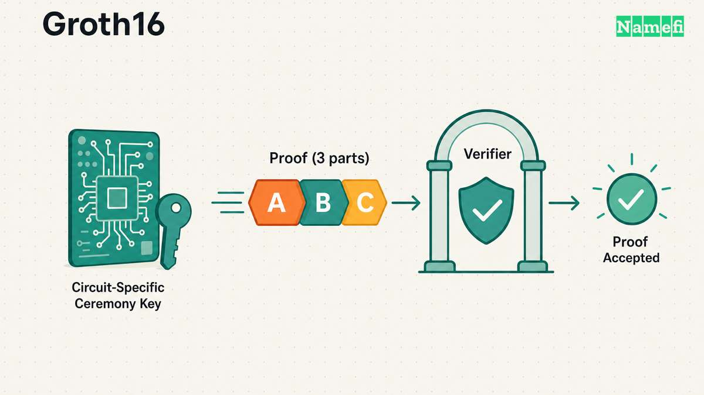
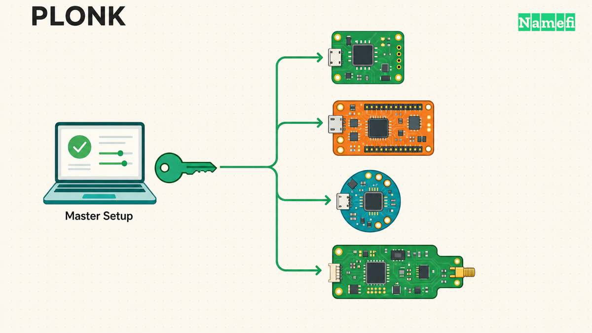
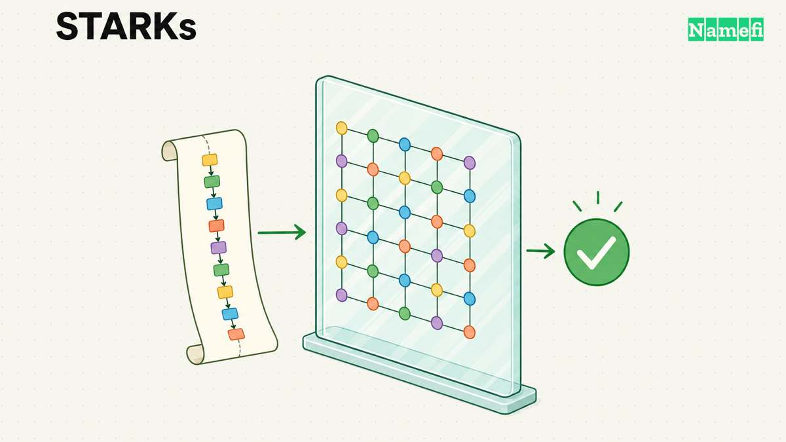
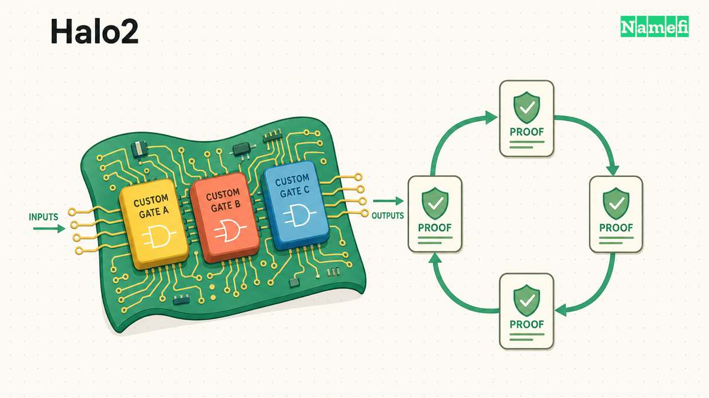
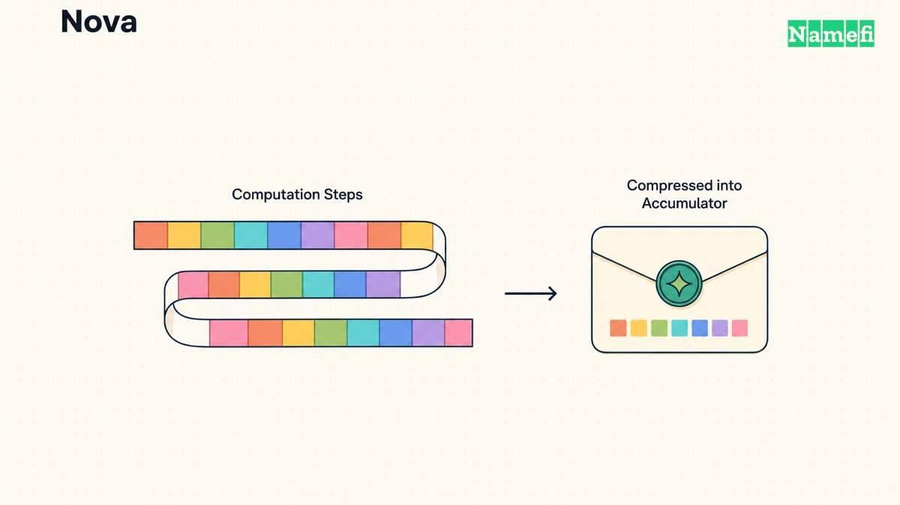

A [zero-knowledge proof](/en/glossary/zero-knowledge-proof/) can show that a computation was performed correctly without exposing the private inputs behind it. That definition sounds like one tool, but builders actually choose among several proof-system families. Each makes a different trade: tiny proofs may require a setup ceremony; transparent systems may produce larger proofs; recursion-friendly systems may be awkward to verify directly on the [Ethereum Virtual Machine](/en/glossary/ethereum-virtual-machine/) (EVM).

This guide compares five influential choices: [Groth16](/en/glossary/groth16/), [PLONK](/en/glossary/plonk/), [STARKs](/en/glossary/stark/), Zcash's [Halo2](/en/glossary/halo2/) construction, and [Nova](/en/glossary/nova/)-style folding schemes. They are not perfectly interchangeable. Groth16, PLONK, STARKs, and Halo2 are proof systems for circuit or trace statements. Nova is primarily an incrementally verifiable computation design that folds repeated steps and can later compress the result into a succinct proof. That distinction matters more than any single benchmark.

The size and speed labels below are relative. Real results depend on the circuit, curve, security level, hardware, implementation, batching strategy, and whether recursion or proof wrapping is involved.

---

## Groth16: The Small-Proof Baseline

Groth16 remains the reference point when proof size and on-chain verification cost dominate the decision. Jens Groth's paper specifies a proof of only **three group elements** and verification using **three pairings** ([IACR ePrint](https://eprint.iacr.org/2016/260#:~:text=a%20proof%20is%20only%203%20group%20elements)). In common Ethereum deployments, that structure makes Groth16 proofs compact and comparatively cheap for a Solidity verifier to check.

The price is setup rigidity. A Groth16 deployment needs parameters specialized to the circuit. The [snarkjs documentation](https://github.com/iden3/snarkjs#:~:text=Groth16%20requires%20a%20trusted%20ceremony%20for%20each%20circuit) distinguishes its universal Powers of Tau phase from the circuit-specific Groth16 ceremony. Changing the circuit means generating new circuit-specific parameters.

That does not mean one organizer must be trusted. A multiparty ceremony can distribute the setup across contributors; Ethereum's ZK-rollup guide explains that the resulting parameters remain secure as long as one honest participant destroys their sampled randomness ([ethereum.org](https://ethereum.org/en/developers/docs/scaling/zk-rollups/#:~:text=As%20long%20as%20one%20honest%20participant%20destroys%20their%20input)). It does mean the ceremony, its software, and its transcript become part of the deployment's security story.

**Best fit:** stable circuits that will be verified many times on Ethereum, such as membership, identity, mixer, bridge, or application-specific proofs where minimal calldata and gas outweigh upgrade flexibility.

**Examples:** Circom and snarkjs provide an established Groth16 toolchain, and [snarkjs can export a Solidity verifier](https://github.com/iden3/snarkjs#:~:text=snarkjs%20zkey%20export%20solidityverifier).

---

## PLONK: A Reusable Setup and Flexible Arithmetization

PLONK changed the setup trade-off. Its paper presents a **universal** SNARK with fully succinct verification: one structured reference string can support many circuits up to a configured size instead of requiring a fresh ceremony for each circuit ([IACR ePrint](https://eprint.iacr.org/2019/953#:~:text=We%20present%20a%20universal%20SNARK%20construction)). The setup is also updatable, so additional participants can contribute fresh randomness.

“Universal” does not mean “no trusted setup.” Classic KZG-based PLONK still relies on a structured reference string. The improvement is operational: the same ceremony output can be reused, while circuit-specific proving and verification keys can be derived afterward.

PLONK-style arithmetization is also more expressive than a plain multiplication-gate circuit. Custom gates and lookup arguments let implementations encode recurring operations efficiently. That flexibility has produced a broad family rather than one fixed protocol: UltraPLONK, TurboPLONK, FFLONK, and newer “Honk” descendants change the prover, verifier, or commitment details while keeping the PLONKish programming model.

**Best fit:** evolving applications and general-purpose proving platforms that want small proofs, practical EVM verification, and freedom to add circuits without repeating a circuit-specific ceremony.

**Examples:** Aztec's documentation says its stack uses SNARK protocols including **UltraPlonk and Honk**, with proofs verified on-chain for private state transitions ([Aztec documentation](https://docs.aztec.network/developers/docs/resources/glossary#:~:text=Aztec%20uses%20various%20ZK%2DSNARK%20protocols%20including%20UltraPlonk%20and%20Honk)).

---

## STARKs: Transparent and Hash-Based

STARK stands for Scalable Transparent Argument of Knowledge. “Transparent” is the critical word: the original STARK construction was designed with no trusted party and no secret trapdoor in setup ([IACR ePrint](https://eprint.iacr.org/2018/046#:~:text=be%20set%20up%20with%20no%20reliance%20on%20any%20trusted%20party)). Its security rests mainly on [hash functions](/en/glossary/hash-function/) and error-correcting-code techniques rather than elliptic-curve pairings, giving STARKs a plausible path to post-quantum security.

STARK provers work especially well for large, regular execution traces. The same paper reports a transparent system whose verification scales exponentially faster than the size of the underlying database ([IACR ePrint](https://eprint.iacr.org/2018/046#:~:text=verification%20scales%20exponentially%20faster%20than%20database%20size)). In practice, modern STARK provers use highly parallel polynomial and hashing workloads.

The trade-off is proof bulk. A STARK proof usually contains many hash commitments and query responses, making it much larger than a pairing-based Groth16 proof. Ethereum can verify STARKs, but a native STARK verifier is generally more calldata- and computation-heavy than a compact pairing verifier. Some systems therefore aggregate STARKs recursively or wrap them in a smaller pairing-based proof before L1 settlement.

**Best fit:** large execution traces, transparent setup requirements, proof aggregation, and systems that value hash-based assumptions more than minimum proof bytes.

**Examples:** Starknet describes itself as an Ethereum validity rollup that uses STARK-based proofs, aggregates many blocks, and submits the resulting artifact to Ethereum for verification ([Starknet documentation](https://docs.starknet.io/learn/protocol/intro#:~:text=These%20proofs%20%28with%20further%20proof%20aggregation)).

---

## Halo2: No Ceremony and Recursion-Friendly Design

Halo2 is best understood as a PLONKish proving system paired, in Zcash's implementation, with an inner-product-argument polynomial commitment. That commitment communicates in logarithmic rather than constant size: the Halo2 book says its polynomial commitment uses **O(log n) communication** ([Halo2 Book](https://zcash.github.io/halo2/background/pc-ipa.html#:~:text=Our%20polynomial%20commitment%20scheme%20gets%20the%20job%20done%20using)). Proofs are therefore larger and verification involves more curve operations than the smallest KZG- or Groth16-based alternatives.

The benefit is removing toxic-waste setup in Zcash's implementation. [Zcash's explanation](https://z.cash/learn/what-are-zk-snarks/#:~:text=removing%20the%20trusted%20setup) says Orchard uses Halo2 without a trusted setup while meeting its private-payment performance goals. Halo2's PLONKish custom gates and lookups also make it a flexible circuit framework.

EVM verification is not Halo2's natural strength. The Zcash implementation uses the Pasta curve cycle rather than Ethereum's native pairing precompiles. Projects targeting Ethereum often use a KZG-flavored Halo2 fork, recursion, or a final proof wrapper; those choices change both the setup answer and the table's cost profile. “Halo2” should therefore never be treated as one universal set of byte and gas numbers.

**Best fit:** privacy protocols and recursive proof pipelines that want flexible circuits without a trusted ceremony and can accept a heavier direct verifier.

**Examples:** Zcash introduced Halo2 for its Orchard shielded protocol; Zcash's own explainer says Orchard uses Halo2 to remove trusted setup while meeting private-payment performance goals ([Zcash](https://z.cash/learn/what-are-zk-snarks/#:~:text=Orchard%20shielded%20payment%20protocol%2C%20which%20utilizes%20the%20Halo%202)).

---

## Nova and Folding Schemes: Prove Long Computations Incrementally

Nova attacks a different bottleneck. Instead of generating a fresh monolithic proof for every longer computation, a folding scheme combines two constraint-system instances into one accumulated instance. The prover updates the proof one step at a time; Nova's implementation notes that the work for each update does not depend on how many steps have already been executed, and the verifier's work does not grow with the computation's length ([Microsoft Nova](https://github.com/microsoft/Nova#:~:text=the%20prover%27s%20work%20to%20update%20the%20proof%20does%20not%20depend)).

This makes folding attractive for recursive state machines, virtual-machine execution, rollups, and other long sequential computations. The Nova paper likewise states that neither the incrementally verifiable computation verifier's work nor the proof size depends on the number of steps ([IACR ePrint](https://eprint.iacr.org/2021/370)).

Nova is not automatically a tiny, cheap Ethereum proof. A folded accumulator is commonly compressed with another SNARK before external verification. Setup and EVM cost therefore depend on the selected commitment and compression layer. Microsoft's implementation supports transparent IPA-based commitments as well as HyperKZG and Mercury options that require a universal Powers of Tau setup; it also exposes optional EVM support ([Microsoft Nova](https://github.com/microsoft/Nova#:~:text=Both%20HyperKZG%20and%20Mercury%20require%20a%20universal%20setup)).

**Best fit:** repeated or unbounded computations where incremental proving and recursion matter more than producing the smallest standalone proof at every step.

**Examples:** Microsoft's `nova-snark` library supports circuits over several curve cycles and explicitly lists rollups, EVM and RISC-V state-machine proofs among the intended applications ([Microsoft Nova](https://github.com/microsoft/Nova#:~:text=IVC%20schemes%20including%20Nova%20have%20a%20wide%20variety%20of%20applications)).

---

## Comparison Table

| System | Proof size | Prover time | Verifier cost | Trusted setup | EVM-friendliness | Example projects / tools |
|---|---|---|---|---|---|---|
| **Groth16** | Very small: three group elements | Fast and highly optimized for fixed circuits | Very low; three pairings plus public-input work | **Yes, per circuit** | **Excellent** on pairing-friendly curves | Circom, snarkjs, many application-specific Solidity verifiers |
| **PLONK (KZG family)** | Small, constant-size; usually larger than Groth16 | Moderate; custom gates and lookups can reduce circuit work | Low to moderate; pairing-based | **Yes, universal and updatable** | **Good** | Aztec UltraPLONK, Barretenberg, PLONKish zkEVM stacks |
| **STARKs** | Large relative to SNARKs | Scales well for large, parallelizable traces | Moderate off-chain; comparatively high natively on EVM | **No** | **Limited natively**; aggregation or wrapping helps | Starknet, StarkEx, Cairo proving stack |
| **Zcash Halo2 (IPA)** | Medium; logarithmic commitment openings | Moderate to high; circuit-dependent and parallelizable | Higher direct curve work than pairing SNARKs | **No** | **Limited natively**; variants or wrappers change the result | Zcash Orchard, `zcash/halo2` |
| **Nova / folding** | Constant with respect to accumulated steps; final size depends on compression | Low incremental cost per step; compression adds work | Constant with step count; on-chain cost depends on wrapper | **Depends** on commitment and compression choice | **Emerging**; BN254 compression paths can target EVM | Microsoft `nova-snark`, folding-based VM and rollup research |

No row wins every column. Groth16 optimizes the final proof and verifier. PLONK optimizes ceremony reuse and circuit flexibility. STARKs optimize transparency and large traces. Halo2 combines ceremony-free commitments with a rich PLONKish circuit model. Nova optimizes repeated computation over time.

---

## How This Connects to Tokenized Domains

A [tokenized domain](/en/blog/what-are-tokenized-domains/) is an [on-chain](/en/glossary/on-chain/) ownership object, so any private or compressed domain workflow eventually needs a proof that a state transition followed the ownership rules. The proof-system choice would depend on the job: Groth16 could minimize the cost of checking a stable eligibility circuit; PLONK or Halo2 could support a rule set that changes; a STARK could prove a large marketplace execution trace; and folding could accumulate a long sequence of state updates before settlement.

These are architectural possibilities, not claims about features deployed in domain tokenization today. The practical lesson is narrower: “uses zero knowledge” is not a complete design description. Builders also need to name the proof system, setup, data-availability model, verifier, and upgrade path.

---

## Sources and Further Reading

- [On the Size of Pairing-based Non-interactive Arguments — IACR ePrint](https://eprint.iacr.org/2016/260) — fetched 2026-09-19
- [snarkjs proving and setup guide — iden3](https://github.com/iden3/snarkjs) — fetched 2026-09-19
- [PLONK — IACR ePrint](https://eprint.iacr.org/2019/953) — fetched 2026-09-19
- [Scalable, Transparent, and Post-Quantum Secure Computational Integrity — IACR ePrint](https://eprint.iacr.org/2018/046) — fetched 2026-09-19
- [Introduction to Starknet's Protocol — Starknet Documentation](https://docs.starknet.io/learn/protocol/intro) — fetched 2026-09-19
- [Polynomial Commitment Using Inner Product Argument — The Halo2 Book](https://zcash.github.io/halo2/background/pc-ipa.html) — fetched 2026-09-19
- [What Are zk-SNARKs? — Zcash](https://z.cash/learn/what-are-zk-snarks/) — fetched 2026-09-19
- [Nova: Recursive Zero-Knowledge Arguments from Folding Schemes — IACR ePrint](https://eprint.iacr.org/2021/370) — fetched 2026-09-19
- [Nova Reference Implementation — Microsoft](https://github.com/microsoft/Nova) — fetched 2026-09-19
- [Aztec Glossary and Proving-System Overview — Aztec Documentation](https://docs.aztec.network/developers/docs/resources/glossary) — fetched 2026-09-19
- [Zero-Knowledge Rollups — ethereum.org](https://ethereum.org/en/developers/docs/scaling/zk-rollups/) — fetched 2026-09-19
