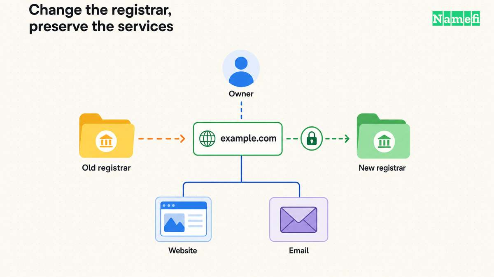

**To change registrars while keeping your domain, check transfer eligibility, prepare DNS continuity, unlock the domain when appropriate, obtain its authorization code, and start the receiving registrar's transfer process.** Complete the required confirmations, then verify the registration and your website and email separately. ICANN directs registrants to begin with the registrar they want to move to. [See its transfer FAQ.](https://www.icann.org/resources/pages/name-holder-faqs-2017-10-10-en)

This guide covers a **[cross-registrar transfer](/en/glossary/cross-registrar-transfer/) by the same domain holder**. If you are selling the name or handing it to a buyer, use [the buyer-transfer guide](/en/blog/how-to-transfer-a-domain-to-a-buyer/) for the ownership and payment workflow.

## Check what is changing and whether the domain can move

Keep these tasks distinct:

| Task | What you are changing |
| --- | --- |
| Registrar transfer | The registrar managing the domain registration |
| Change of registrant | The recorded domain holder's qualifying details |
| DNS migration | The service answering DNS queries for the domain |
| Website or email migration | The service delivering the site or handling mail |

ICANN's Transfer Policy has separate sections for registrar transfers and changes of registrant. A move to a different [registrar](/en/glossary/registrar/) should not be treated as a shortcut for changing the owner. [See the policy's two workflows.](https://www.icann.org/en/contracted-parties/accredited-registrars/resources/domain-name-transfers/policy)

For generic top-level domains covered by that policy, the current published rules permit denial within 60 days of creation or a previous registrar transfer, subject to the policy's qualifications. A qualifying Change of Registrant can trigger a 60-day inter-registrar lock; any offered opt-out must occur before that change. [Check the exact lock provisions.](https://www.icann.org/en/contracted-parties/accredited-registrars/resources/domain-name-transfers/policy#:~:text=3.7.5%20The%20transfer)

Check eligibility in both providers' current instructions for your exact extension. Country-code domains may follow different rules; DNSimple's transfer guide explicitly distinguishes them from gTLDs. [See its limitations.](https://support.dnsimple.com/articles/domain-transfer/)

Ask the current registrar to identify the lock and its release condition before you edit contact details. An ordinary transfer-lock toggle does not tell you whether a policy lock or dispute also applies. Keep contact information accurate, but plan any necessary correction with the registrar rather than making a last-minute change without checking its effect.

Also inspect the expiration date. ICANN says expiration alone is not grounds to deny a transfer, while a domain in the Redemption Grace Period must first be restored by its current registrar. [See the expiration FAQ.](https://www.icann.org/resources/pages/domain-name-renewal-expiration-faqs-2018-12-07-en) If time is tight, resolve the domain's current status and renewal options before assuming a transfer will finish in time.

## Prepare DNS and account access

Create a before-transfer record containing the nameservers, active DNS provider, DNS records, DNSSEC status, and the accounts responsible for the website and mail. Confirm you can sign in to both registrar accounts and receive the current registrar's messages.

The critical question is: **Will the existing DNS service keep answering after the registration moves?** DNSimple says it preserves nameservers on transfer, but warns that some DNS providers stop serving a domain when it leaves their registration service. Unchanged nameservers alone are therefore insufficient evidence of continuity. [Read its after-transfer notes.](https://support.dnsimple.com/articles/domain-transfer/)

If the DNS service will continue and the destination registrar supports that arrangement, keeping it in place can reduce the work in this move. If a DNS change is required, prepare and verify the new zone as its own step. Compare every record with the saved configuration rather than trusting an automatic import to be complete.

Provider requirements can change the sequence. Cloudflare, for example, requires the domain to be active on Cloudflare before transferring its registration. Its instructions cover moving nameservers and handling existing [DNSSEC](/en/glossary/dnssec/) before the switch; it also warns that its record scan may miss existing records. [Follow that sequence only when moving to Cloudflare.](https://developers.cloudflare.com/registrar/get-started/transfer-domain-to-cloudflare/)

For any DNSSEC-enabled domain, confirm how the chosen providers handle the signing keys and parent DS records. A provider's instruction to disable DNSSEC for a DNS migration is not a universal instruction to disable it for every registrar transfer. Write down the required sequence and the final verification step.

Keep the previous website and mail subscriptions active during the move. Do not cancel an account merely because the domain has appeared in the receiving registrar's list.

## Authorize the move through the receiving registrar

Once the domain is eligible and service continuity is prepared:

1. **Unlock the domain** through the current registrar's supported process.
2. **Obtain the [AuthInfo code](/en/glossary/auth-code/)**, sometimes called an authorization, EPP, or transfer code.
3. **Start the transfer in the intended receiving account**, checking the spelling, domain extension, and registrant information.
4. **Review the charge and registration term** before submitting.
5. **Complete the provider's required confirmations** and monitor its transfer status.

These are the core steps in DNSimple's documented workflow; labels and confirmation requirements vary by registrar. [See its preparation and initiation instructions.](https://support.dnsimple.com/articles/domain-transfer/)

Treat the authorization code as sensitive. Enter it only in the receiving registrar's intended transfer form, and do not paste it into a public support thread or share your entire registrar login. Request a fresh code through the registrar if the existing one is rejected as invalid or expired; Cloudflare's documentation notes that code validity can be limited. [See its authorization-code guidance.](https://developers.cloudflare.com/registrar/get-started/transfer-domain-to-cloudflare/)

ICANN requires a registrar without self-service facilities to provide the AuthInfo code and remove the applicable `clientTransferProhibited` status within five calendar days of the registrant's initial request. [Read the qualified requirement.](https://www.icann.org/en/contracted-parties/accredited-registrars/resources/domain-name-transfers/policy#:~:text=5.2%20Registrars%20must%20provide) That is not a promise that the entire move finishes five days after you begin preparing it.

Save the transfer reference and the completion notice. Use the provider's actual pending status to decide whether there is an action to take; a submitted request is not confirmation that the registrar has changed.

## Verify completion and resolve delays

Check the completed move in the receiving account. If you need an independent registrar lookup, ICANN's FAQ directs you to ICANN Lookup and its **Registrar** field. [See the lookup guidance.](https://www.icann.org/resources/pages/name-holder-faqs-2017-10-10-en)

Then work through this acceptance checklist:

- The domain is in the intended account and the transfer shows as complete.
- Registrant details and renewal arrangements are correct.
- The intended nameservers and DNS records still resolve.
- The website loads at its normal address with working HTTPS.
- Mail can be sent and received using the intended addresses.
- DNSSEC is in the intended, verified state.
- Transfer protection is restored where available, and obsolete access is removed.

If something stalls, ask for the **specific domain status, blocking reason, and next action**. Useful checks include a remaining lock, an expired code, an outstanding confirmation, or a restriction for the extension. Avoid repeatedly starting new requests before understanding the current one.

For a DNS or email failure after the registrar reports success, compare against the saved configuration and confirm that the DNS service is still active. Repeating the registrar transfer is not a diagnostic step for a missing mail record.

If you believe a registrar has improperly denied a transfer covered by ICANN's policy, its FAQ describes the Transfer Complaint route. Keep the request, dates, and stated denial reason so the issue can be reviewed. [See the complaint guidance.](https://www.icann.org/resources/pages/name-holder-faqs-2017-10-10-en)

The move is complete when the new registrar manages the correct registration **and** the services you intend to preserve still work. Those are separate checks, and both belong in your handoff record.

## Sources and further reading

- ICANN — [FAQs for Registrants: Transferring Your Domain Name](https://www.icann.org/resources/pages/name-holder-faqs-2017-10-10-en), questions on starting a transfer, identifying the registrar, and filing a complaint. Fetched 2026-09-15.
- ICANN — [Transfer Policy](https://www.icann.org/en/contracted-parties/accredited-registrars/resources/domain-name-transfers/policy), sections I and II; updated February 21, 2024, with implementation required by August 21, 2025. Fetched 2026-09-15.
- ICANN — [Transfer Policy: transfer restrictions](https://www.icann.org/en/contracted-parties/accredited-registrars/resources/domain-name-transfers/policy#:~:text=3.7.5%20The%20transfer), sections I.A.3.7.5–3.7.6, I.A.3.8.5 and II.C.2. Fetched 2026-09-15.
- ICANN — [Transfer Policy: AuthInfo requirements](https://www.icann.org/en/contracted-parties/accredited-registrars/resources/domain-name-transfers/policy#:~:text=5.2%20Registrars%20must%20provide), section I.A.5.2. Fetched 2026-09-15.
- ICANN — [Domain Name Renewals and Expiration](https://www.icann.org/resources/pages/domain-name-renewal-expiration-faqs-2018-12-07-en), question 4, expiration and restoration before transfer. Fetched 2026-09-15.
- DNSimple — [Transfer a Domain to DNSimple](https://support.dnsimple.com/articles/domain-transfer/), “Limitations,” “Initiating the transfer,” and “After the transfer.” Fetched 2026-09-15.
- Cloudflare — [Transfer your domain to Cloudflare](https://developers.cloudflare.com/registrar/get-started/transfer-domain-to-cloudflare/), domain activation, DNSSEC, authorization codes, and record-review guidance. Fetched 2026-09-15.
