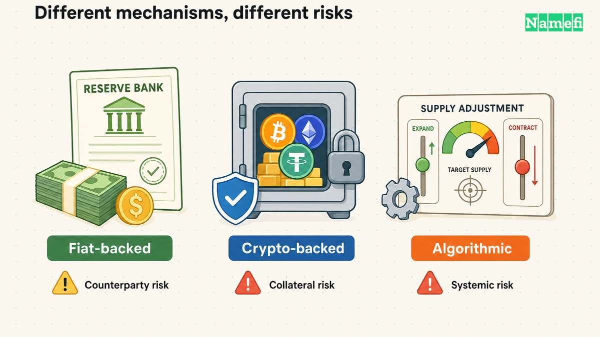

A **[stablecoin](/en/glossary/stablecoin/)** is a cryptocurrency designed to track a reference value, commonly one U.S. dollar. “Stable” describes the target, not a guarantee. A token can trade below its peg, and exchanging it for dollars depends on its redemption terms and the services available to the holder.

Stablecoins differ in what backs them and how they try to maintain that target. This guide compares fiat-backed, crypto-backed, and algorithmic designs, then explains the reserve, redemption, and depeg risks that matter when using them.

## The Core Concept: A Target Price and a Way Back to It

For a redeemable dollar token, the peg depends partly on eligible participants being able to exchange tokens for dollars. That mechanism can encourage trading toward the target, but it does not ensure that every holder can redeem directly with the issuer.

For example, [Circle's USDC terms for users outside the EEA](https://www.circle.com/legal/usdc-terms) condition direct redemption on eligibility and a Circle Mint account in good standing. Selling USDC on an exchange is a separate transaction at an available market price. A wallet balance, a reserve report, and a direct redemption right answer different questions.

## How Do Stablecoins Maintain Their Value?

Not all stablecoins are created equal. To try to maintain a peg, they use different reserve, collateral, redemption, and incentive mechanisms. Three broad categories are useful, although some products use hybrid designs:

### 1. Fiat-Collateralized Stablecoins
These tokens are issued against reserves intended to support redemption at or near the reference value. The reserve is not necessarily one unit of cash in a bank for every token: its composition can include cash, government securities, repurchase agreements, or other assets permitted by the issuer's framework.
*   **Examples**: [Tether (USDT)](https://tether.to/en/transparency/) and [USD Coin (USDC)](https://www.circle.com/usdc).
*   **Why it matters**: Reserve composition, liquidity, custody, attestations, legal redemption rights, and issuer risk all matter. For example, [Circle's current disclosures](https://www.circle.com/transparency) describe USDC reserves as cash and highly liquid cash-equivalent assets, with most of the reserve held in a government money-market fund that may hold short-dated US Treasuries and overnight Treasury repurchase agreements.

### 2. Crypto-Collateralized Stablecoins
These use crypto assets as collateral, often with a buffer above the value of the tokens issued. If collateral prices fall, a protocol may liquidate the position under its rules; [Sky's liquidation documentation](https://developers.skyeco.com/protocol/vaults/collateral-liquidation/) describes this for insufficiently collateralized vaults. Requirements vary by asset and system; a crypto-backed label does not establish a universal collateral ratio.
*   **Design caveat**: Systems can mix crypto assets, stablecoins, and off-chain assets. Check the actual collateral composition instead of assuming that every token marketed as decentralized uses only crypto collateral.
*   **Why it matters**: On-chain collateral and smart contracts can make parts of the system transparent and programmable, but governance, collateral composition, price oracles, custodians, and centralized assets may still introduce dependencies.

### 3. Algorithmic Stablecoins
These rely substantially on smart-contract incentives, supply changes, arbitrage, or a related token rather than only on directly redeemable fiat reserves. Some are uncollateralized; others are partially collateralized or hybrid, so "algorithmic" is not one uniform design.
*   **Note**: These mechanisms can fail abruptly if confidence and arbitrage incentives collapse. The [Federal Reserve's study of algorithmic-stablecoin runs](https://www.federalreserve.gov/econres/notes/feds-notes/runs-on-algorithmic-stablecoins-evidence-from-iron-titan-and-steel-20220602.html) explains that a peg can break and trigger run dynamics.

## What Can Make a Stablecoin Lose Its Peg?

A depeg occurs when the market price diverges from the target. The [Federal Reserve's analysis of algorithmic-stablecoin runs](https://www.federalreserve.gov/econres/notes/feds-notes/runs-on-algorithmic-stablecoins-evidence-from-iron-titan-and-steel-20220602.html) shows how large sell orders and flaws in the arbitrage mechanism contributed to the IRON token losing its peg. Reserve-backed tokens have different mechanisms, but reserve liquidity, custody, redemption access, and market confidence still matter.

Before relying on a stablecoin, distinguish:

- **Reserve value from reserve liquidity.** Assets may exist but be difficult to sell or access quickly.
- **Disclosure from a guarantee.** [Circle publishes reserve information and monthly third-party assurance](https://www.circle.com/transparency); a report does not promise an unchanged secondary-market price.
- **Redemption from exchange liquidity.** Direct issuer redemption can have eligibility requirements; an exchange needs a willing counterparty.
- **A token from the platform holding it.** A custodian, bridge, lending protocol, or wallet can add risks beyond the stablecoin itself.

## Common Uses of Stablecoins

Stablecoins can be useful where participants want a blockchain-based payment or settlement asset that targets a familiar unit of account.

*   **On-chain settlement**: Supported networks can operate outside bank hours and may settle quickly, but actual time and cost depend on the chain, congestion, bridges, exchanges, compliance checks, and the issuer's minting or redemption process.
*   **[DeFi](/en/glossary/defi/) (Decentralized Finance)**: Stablecoins are widely used for trading, lending, and collateral in [DeFi](https://ethereum.org/en/defi/). Advertised yields are not bank interest or guaranteed returns; users can lose funds through depegs, liquidations, smart-contract failures, protocol insolvency, or counterparty risk.
*   **Trading and cash management**: Traders often move from volatile crypto assets into stablecoins without first using a bank. That may reduce exposure to the original asset, but it replaces that exposure with the stablecoin's own peg, reserve, issuer, custody, and liquidity risks; a stablecoin is not a risk-free safe harbor or an insured bank deposit.

## The Namefi Angle: Stable Payments for On-Chain Assets

At **Namefi**, we are bridging the gap between the traditional internet (DNS) and the decentralized web (blockchain). We allow users to buy, manage, and transfer domains [on-chain](/en/glossary/on-chain/) as NFTs. Stablecoins play a pivotal role in this ecosystem.

### 1. Price Predictability
When you buy a premium [domain name](/en/blog/what-is-domain/), quoting the price in a dollar-pegged asset can reduce the checkout's exposure to ETH price movements. It still does not guarantee a fiat-dollar value: the stablecoin can depeg, and network or settlement conditions can change.

### 2. Cross-Border Payments
Domain investing is a global industry. Traditionally, buying a high-value domain may involve [Escrow](/en/glossary/escrow/) services, bank wires, and currency conversion. Namefi currently documents a wallet-signed **USDC** checkout for supported domain registrations through its [x402 flow](/en/blog/wallet-checkout/). Availability, accepted networks and assets, finality, fees, registration completion, and compliance requirements depend on the live product and transaction; this article does not establish a general USDT checkout or instant secondary-market settlement.

### 3. Future DeFi Integrations
Because Namefi represents supported domains with on-chain tokens, a compatible protocol could choose to evaluate a [domain portfolio](/en/blog/domain-portfolio-management/) as [collateral](/en/glossary/collateral/). That is an emerging possibility, not an automatic feature or a promise of liquidity: it depends on protocol support, valuation, loan-to-value limits, oracle design, legal and registration constraints, and liquidation risk.

## Conclusion

Stablecoins are widely used as settlement and trading assets in crypto markets and as building blocks for programmable applications. Their usefulness comes from targeting a reference value and integrating with blockchains, not from being equivalent to cash or eliminating risk.

Whether you are buying a domain through a supported wallet-payment flow or managing digital assets, evaluate the specific stablecoin, issuer, reserve and redemption terms, network, protocol, and jurisdiction before relying on it.

For the domain-specific context, see [what tokenized domains are](/en/blog/what-are-tokenized-domains/) and the supported [wallet-checkout flow](/en/blog/wallet-checkout/).

## Sources and further reading

- Sky Protocol — [Collateral Liquidation](https://developers.skyeco.com/protocol/vaults/collateral-liquidation/), opening definition and “Vault Liquidation” — fetched 2026-09-15.

- Circle — [USDC Terms](https://www.circle.com/legal/usdc-terms), sections 1–2, 4 and 8; these terms apply outside the EEA — fetched 2026-09-15.
- Circle — [Transparency](https://www.circle.com/transparency), “Monthly assurance and transparency” and “How we manage USDC” — fetched 2026-09-15.
- Federal Reserve — [Runs on Algorithmic Stablecoins](https://www.federalreserve.gov/econres/notes/feds-notes/runs-on-algorithmic-stablecoins-evidence-from-iron-titan-and-steel-20220602.html), June 2, 2022, analysis of the Iron/Titan run — fetched 2026-09-15.
- Federal Reserve — [Christopher Waller on stablecoins](https://www.federalreserve.gov/newsevents/speech/waller20250212a.htm), February 12, 2025, payment uses and risks — fetched 2026-09-15.
