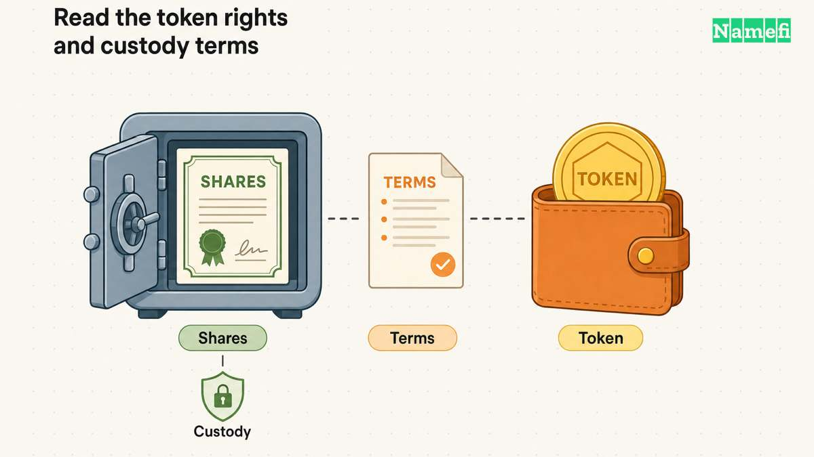

**xStocks are blockchain tokens that provide economic exposure to selected stocks and ETFs. They are not direct ownership of those companies' shares.** The [issuer's documentation](#ref-xstocks-overview) describes backing by the underlying securities, while the [exchange risk disclosure](#ref-xstocks-risks) explains the rights holders do not receive.

This guide covers the mechanism, differences from shares, custody and trading risks, and eligibility limits. xStocks are not a Namefi product; their relevance here is the broader discussion of real-world asset tokenization, including [tokenized domains](/en/blog/what-are-tokenized-domains/).

## The Short Definition

An **xStock** is a tokenized representation of a particular stock or ETF that is intended to be **backed 1:1** by the underlying security held in regulated custody. xStocks are **tokenized stocks** (also called *tokenized equities*): a blockchain-based way for eligible users to obtain economic exposure to securities such as Apple or Tesla. The token is not the issuer company's share itself and does not by itself confer ordinary shareholder rights.

In plain terms:

> An xStock is a crypto token that mirrors the economic value of an underlying security (for example, `AAPLx` tracks Apple and `TSLAx` tracks Tesla). On supported chains, it can be held in a self-custodial [wallet](/en/glossary/wallet/) and traded through eligible exchanges or decentralized protocols, subject to venue, liquidity, and jurisdiction restrictions.

**As checked September 15, 2026**, the [product disclosure](#ref-xstocks-products) names **Backed Assets (JE) Limited**, a Jersey company, as issuer. It identifies Payward Digital Solutions Ltd. for eligible Kraken customers and Payward Europe Digital Solutions (CY) Ltd. for eligible EU/EEA customers. These distribution entities are distinct from the underlying companies whose securities the tokens track.

The [issuer-wide documentation](#ref-xstocks-overview) lists Ethereum, Solana, Arbitrum, Mantle, TON, Ink, and other EVM-compatible networks. That list does not mean every exchange supports deposits or withdrawals on every chain. Check the exact token contract, network, and receiving platform before transferring.

---

## How xStocks Work

The mechanics are simpler than the marketing sometimes makes them sound:

1. **A real share is custodied.** For each xStock token in circulation, the issuer is meant to hold one corresponding real share (or ETF unit) with a regulated custodian—so the supply is collateralized 1:1.
2. **A token is minted on-chain.** That holding is represented as a token (e.g. `AAPLx`) on a supported blockchain and can be held in a compatible self-custodial wallet.
3. **Trading hours depend on the venue.** Kraken describes xStocks trading as **24/5**, while on-chain venues can operate continuously; actual execution still depends on liquidity, market conditions, and platform access.
4. **Some venues integrate xStocks into DeFi.** Depending on the token and protocol, xStocks may be paired in liquidity pools, accepted as [collateral](/en/glossary/collateral/), or used in other on-chain strategies. Support is protocol-specific, not automatic.

On **dividends**: xStocks do not send a cash dividend to the holder's wallet. The [dividend and stock-split documentation](#ref-xstocks-dividends) describes a token-rebasing mechanism; dividends are reinvested net of applicable withholding taxes and reflected in an increased equity-adjusted balance. On Solana and TON, wallet software applies a metadata multiplier rather than receiving an increased raw token balance. Splits and other corporate actions are also reflected through the rebasing design.

The catalog and reported volume have continued to change since the initial 60-asset launch. Use the [current xStocks product list](https://xstocks.com/products) and the issuer's legal documents for the current instruments, contracts, and terms rather than relying on a fixed count in an article.

---

## How xStocks Differ From Traditional Stocks

The legal instrument, custody arrangement, and trading venue matter more than the token's familiar ticker. Here are the main differences:

| Feature | Traditional Stock | xStock (Tokenized Stock) |
|---|---|---|
| What you legally hold | A share in the company | A token tracking the share's value |
| Voting rights | Yes (typically) | No |
| Dividends | Commonly paid in cash | Passed through by increasing the equity-adjusted balance through rebasing, not as wallet cash |
| Where it lives | Usually a brokerage account | Exchange account or compatible self-custodial wallet |
| Trading hours | Exchange and broker hours | Venue-dependent; 24/5 on Kraken and potentially continuous on-chain |
| Settlement | Market and broker settlement rules apply | Blockchain confirmation is separate from issuer redemption or a venue's processing |
| DeFi use | Ordinary brokerage holdings do not move directly into a DeFi protocol | Available only where a protocol supports the token |
| Who you rely on | Broker, clearinghouse | Token issuer + custodian + blockchain |

The crucial point: **an xStock is not the share itself.** It gives you *economic exposure* to the share's price (and dividend value) but generally **does not convey shareholder rights** such as voting, and it adds exposure to the token issuer and its custodians. Ordinary brokerage holdings have their own intermediary and custody risks; tokenization changes those dependencies rather than eliminating them.

---

## Risks and Considerations

xStocks are an interesting innovation, but they are not risk-free, and a balanced explainer has to say so:

- **Issuer & counterparty risk.** Your token's value depends on the issuer actually holding and maintaining the backing shares with its custodians. You take on the issuer's creditworthiness, operational, and solvency risk.
- **No ordinary shareholder rights.** No voting or direct shareholder claim against the underlying public company. Separate contractual token and redemption rights, if any, depend on the issuer's prospectus and applicable terms.
- **Liquidity risk.** On-chain markets for a given xStock may be thin, making it hard to exit at a fair price when you want to.
- **Legal and eligibility restrictions.** Tokenized-security rules and offering terms vary by country and venue. The [product disclosure](#ref-xstocks-products) excludes the United States and U.S. persons. [Kraken's disclosure](#ref-xstocks-risks) also identifies Canada, the UK, and Australia as unavailable on its platform. Eligibility and offering entities can change, so consult the applicable prospectus and risk disclosure.
- **Smart-contract & platform risk.** As with any on-chain asset, bugs, exploits, or platform downtime are possible.

Always check current eligibility and the issuer's risk disclosures for your jurisdiction before acting.

---

## Why Should Domainers and Namefi Users Care?

Here's the connection. xStocks aren't a domain story—but they *are* a vivid example of the same megatrend that **tokenized domains** belong to: the **tokenization of real-world assets (RWAs)**.

The broad pattern is similar across asset classes, but the legal and operational mechanics are not identical. A specialized off-chain system—securities custody for **equities**, registrar and registry records for **domains**—can be coordinated with an on-chain token layer. Depending on the product and its agreements, that layer may make the asset:

- **Wallet-native** — you hold it yourself instead of inside a hosted account.
- **Faster to settle on-chain** — while any separate legal, registrar, registry, compliance, payment, or [escrow](/en/glossary/escrow/) steps still apply.
- **Potentially composable** — when a marketplace, lender, or [DeFi](/en/glossary/defi/) protocol supports that token.
- **Accessible through more venues** — subject to product, jurisdiction, liquidity, and platform restrictions.

A [tokenized domain](/en/blog/what-are-tokenized-domains/) uses an NFT as a token-control layer coordinated with an [ICANN](/en/glossary/icann/) domain's off-chain registration and DNS records. Possession or transfer of that NFT is not, by itself, unconditional legal title or proof that every registrar, [registry](/en/glossary/registry/), policy, contact, or agreement step has completed. On-chain settlement can be fast, but it is only one part of a supported domain transfer or collateral workflow.

If you want to see the domain workflows this model may support, [Tokenized Domain Use Cases in 2026](/en/blog/tokenized-domain-use-cases-2026/) discusses collateralized lending, [fractional ownership](/en/glossary/fractional-ownership/), on-chain marketplaces, [leasing](/en/glossary/leasing/), and their limits. Availability depends on product support, agreements, policy, and counterparties.

One important difference worth keeping straight: an xStock represents exposure backed by a security held in custody. A Namefi domain NFT is instead a token-control record coordinated with a particular domain registration. It is not merely a price tracker, but neither does the token alone replace the registrar, registry, registration agreement, applicable policy, disputes, or legal rights. Namefi's [Terms of Service](https://namefi.io/tos) expressly preserve those limits and allow specified platform actions involving domain NFTs.

---

## Frequently Asked Questions

**What are xStocks?** xStocks are blockchain tokens issued by Backed Assets (JE) Limited that represent particular stocks and ETFs and are intended to be backed 1:1 by the underlying securities held in custody. The current product supports multiple blockchains; availability depends on chain, venue, and jurisdiction.

**Are xStocks the same as owning shares?** No. Economic exposure does not provide the underlying company's voting rights or a direct claim to its shares. Token terms, fees, custody arrangements, and redemption access can also affect the outcome.

**Are xStocks the same as crypto?** xStocks are crypto *tokens*, but unlike Bitcoin or a [stablecoin](/en/glossary/stablecoin/) they track an individual equity's price. (For how dollar-pegged tokens differ, see [What Are Stablecoins?](/en/blog/what-are-stablecoins/).)

**Who issues xStocks?** Current official product pages identify Backed Assets (JE) Limited as issuer. Distribution through Kraken or another venue is a separate role, governed by the applicable offering terms.

**Can U.S. persons buy xStocks?** The current official disclosure says xStocks are unavailable in the United States or to U.S. persons. Other restrictions depend on the offering and venue; Kraken additionally excludes Canada, the UK, and Australia. This educational article does not establish trading eligibility.

**Do xStocks give voting rights or cash dividends?** They do not provide ordinary shareholder voting rights or pay wallet cash dividends. The official design passes dividend benefits through by increasing equity-adjusted balances via rebasing.

---

## The Bigger Picture

xStocks are evidence that **real-world-asset tokenization is attracting material market activity**. The provider reports substantial exchange and on-chain transaction volume, but those figures are provider metrics and change over time. Equities and domains remain different asset classes with different rights, controls, and failure modes; the useful comparison is the addition of an on-chain coordination layer, not legal equivalence.

If you want to go deeper on the domain side of this trend, start with [What Are Tokenized Domains?](/en/blog/what-are-tokenized-domains/) and then explore [Tokenized Domain Use Cases in 2026](/en/blog/tokenized-domain-use-cases-2026/). To put it into practice, visit [namefi.io](https://namefi.io) and follow us on X at [@namefi_io](https://x.com/namefi_io).

## Sources and further reading

- xStocks — [Introduction](https://docs.xstocks.fi/docs#overview), collateral, native networks, and venue-dependent availability — fetched 2026-09-15.
- xStocks — [Dividends and Stock Splits](https://docs.xstocks.fi/docs/dividends-and-stock-splits), rebasing mechanism — fetched 2026-09-15.
- Kraken — [xStocks Risk Disclosure](https://www.kraken.com/legal/xstocks), rights, custody risks, and eligibility FAQ — fetched 2026-09-15.
- xStocks — [Current product list](https://xstocks.com/products), footer issuer and distribution disclosure — fetched 2026-09-15.
- Namefi — [Terms of Service](https://namefi.io/tos) (domain-token limits, ICANN compliance, and platform rights)
