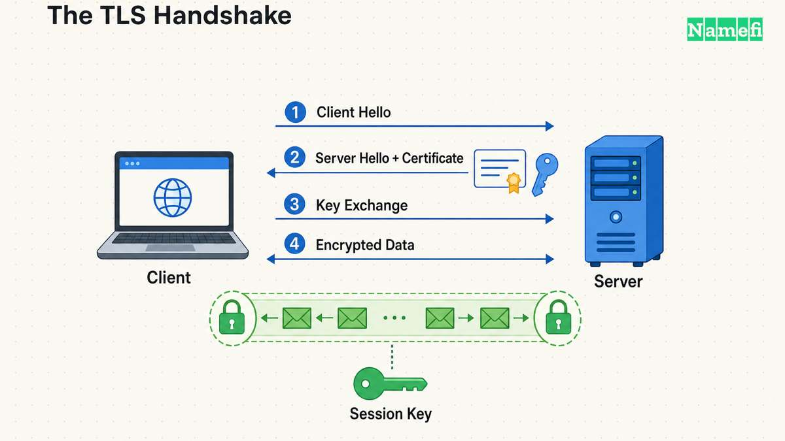
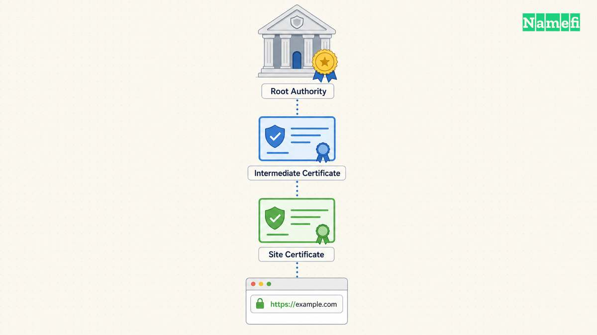
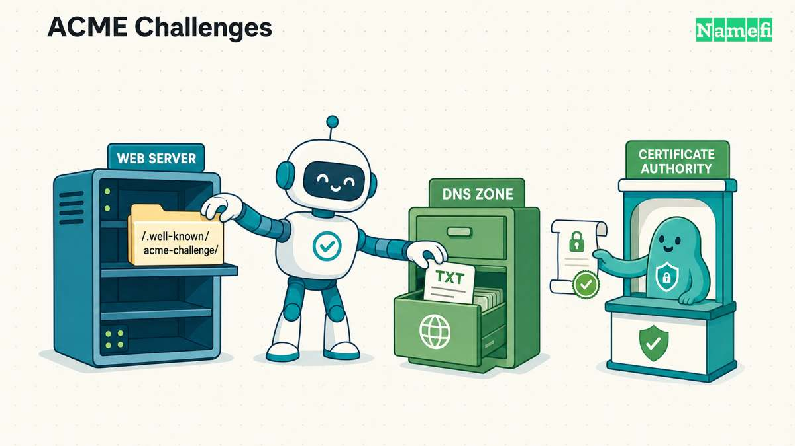

Every time a browser shows a padlock, a whole machine of cryptography, bureaucracy, and automation has just run to completion in a few hundred milliseconds. HTTPS is the name of that machine. Technically it is nothing more exotic than ordinary HTTP carried inside an encrypted TLS session — the specification says to use it [precisely as you would use HTTP over TCP](https://datatracker.ietf.org/doc/html/rfc2818#:~:text=Simply%20use%20HTTP%20over%20TLS%20precisely%20as%20you%20would%20use%20HTTP%20over%20TCP) — but that one wrapper changes what the web is: from a network where every message is a postcard anyone can read, to one where the envelope is sealed and the recipient proves who they are.

This article explains what HTTPS actually does, and walks through the concepts it is built from: encryption, ports, certificates, certificate authorities, and the ACME protocol that now automates the issuance of most of the world's certificates. It ends where every HTTPS chain ends if you follow it far enough down: at control of a domain name.

## What plain HTTP leaves exposed

HTTP, the protocol browsers and web servers speak, was designed as cleartext. A request for a page, the cookies attached to it, the form data in it, and the page that comes back all travel across the network as readable bytes. Anyone positioned on the path — the operator of a coffee-shop Wi-Fi network, an ISP, a backbone carrier, a compromised router — can read all of it.

Worse, they can change it. Cleartext HTTP has no integrity protection, so an intermediary can inject advertising into pages, rewrite a download link to point at malware, or swap the account number on a payment page, and neither side can tell. And because plain HTTP has no notion of server identity, the browser is simply trusting that whatever machine answered — usually whatever [IP address](/en/glossary/ip-address/) the [DNS](/en/glossary/dns/) lookup returned — really is the site it asked for. As our case studies of [DNS hijacking](/en/glossary/dns-hijacking/) incidents show, that assumption fails in practice, and it fails expensively.

## The three guarantees of HTTPS

HTTPS wraps HTTP in TLS — Transport Layer Security — whose current version, TLS 1.3, was standardized in 2018 as RFC 8446. The specification states the goal directly: TLS lets applications communicate in a way [designed to prevent eavesdropping, tampering, and message forgery](https://datatracker.ietf.org/doc/html/rfc8446#:~:text=eavesdropping%2C%20tampering%2C%20and%20message%20forgery). Those three verbs map to three concrete guarantees:

- **Confidentiality.** The traffic is encrypted, so an observer on the path sees only which server you connected to and roughly how much data moved — not the URLs, cookies, credentials, or content.
- **Integrity.** Every record is protected by a [hash function](/en/glossary/hash-function/)-based cryptographic check, so a modified byte anywhere in transit is detected and the connection fails rather than silently delivering tampered data.
- **Authentication.** The server proves, using a certificate and a [private key](/en/glossary/private-key/), that it is the legitimate holder of the domain name you asked for — this is the guarantee the padlock actually represents.

A useful way to remember the division of labor: encryption seals the envelope, integrity checks catch a resealed envelope, and authentication confirms you are talking to the right address at all.

## Ports: the internet's door numbers

An IP address identifies a machine, but a machine runs many networked programs at once. A **port** is the number, from 1 to 65535, that identifies *which* program a connection is for — the apartment number after the street address. A web server, a mail server, and an SSH daemon can share one machine because each listens on its own port.

The [IANA port registry](https://www.iana.org/assignments/service-names-port-numbers/service-names-port-numbers.xhtml?search=https) assigns well-known defaults so clients don't have to guess: port 80 for HTTP, and port 443 — registered as "http protocol over TLS/SSL" — for HTTPS. That is why URLs don't mention them; when a browser opens `https://example.com`, [the default port is 443](https://datatracker.ietf.org/doc/html/rfc2818#:~:text=the%20default%20port%20is%20443) unless the URL says otherwise.

One caveat worth knowing: encrypting traffic on port 443 does not make the connection invisible. An observer still sees which IP you connected to, and the TLS handshake has historically sent the server's hostname (the SNI field) unencrypted — [any intermediary can view which website you're visiting simply by checking the first packet for a connection](https://blog.cloudflare.com/announcing-encrypted-client-hello/#:~:text=any%20intermediary%20can%20view%20which%20website%20you%27re%20visiting), as Cloudflare puts it. Encrypted Client Hello (ECH) is the emerging fix, and encrypted DNS closes the parallel leak on the lookup side — a shift with its own consequences, which we cover in [DNS over HTTPS vs enterprise split-horizon DNS](/en/blog/dns-over-https-vs-enterprise-split-horizon-dns/).

## Inside the TLS handshake

Encryption comes in two flavors, and HTTPS needs both. **Symmetric** encryption uses one shared key for both sealing and opening messages — fast, but it assumes the two sides already share a secret, which strangers on the internet do not. **Asymmetric** (public-key) cryptography solves that bootstrap problem: the server holds a private key, publishes the matching [public key](/en/glossary/public-key/), and anything encrypted to the public key can only be opened with the private one, while a [digital signature](/en/glossary/digital-signature/) made with the private key can be verified by anyone holding the public one.

The TLS handshake is the choreography that combines them. In brief:

1. The browser opens a connection and announces what cryptography it supports.
2. The server responds with its **certificate** — its public key, bound to its domain name, vouched for by a certificate authority.
3. The browser verifies the certificate (more on that next) and the two sides use asymmetric key-agreement to derive fresh **session keys** that no eavesdropper can compute.
4. Everything after that — the actual HTTP requests and responses — is encrypted symmetrically with those session keys, at full speed.

A note on names: this protocol family began life as SSL (Secure Sockets Layer) in the 1990s, was renamed TLS when standardization moved to the IETF, and modern browsers now speak TLS 1.2 and 1.3 only. The old name survives in everyday phrases like "SSL certificate," which today always means a TLS certificate.

## Certificates and certificate authorities

Encryption without identity would be a private conversation with a possible impostor. The identity half of HTTPS rests on **certificates**: signed digital documents that bind a domain name to a public key. The signer is a **certificate authority (CA)** — an organization whose own signing keys are pre-trusted by browsers and operating systems through their *root stores*. Trust flows down a chain: a root CA signs an intermediate, the intermediate signs the certificate for `example.com`, and the browser accepts the site's key because the chain terminates in a root it already trusts — [cryptographic security](/en/glossary/cryptographic-security/) by delegation.

Before signing, the CA must validate that the requester actually controls the domain named in the certificate — that validation is the entire meaning of a standard (domain-validated) certificate. If a browser receives a certificate that doesn't chain to a trusted root, doesn't match the hostname, or has expired, it interrupts the page with a full-screen warning instead of the padlock.

That warning is not theater. In the [2018 MyEtherWallet attack](/en/blog/the-myetherwallet-bgp-dns-attack/), attackers hijacked internet routing and DNS so thoroughly that victims' browsers fetched a pixel-perfect [phishing](/en/glossary/phishing/) clone from the attackers' server — but the one thing the attackers could not do was get a trusted CA to sign a certificate for `myetherwallet.com`. Every victim saw a certificate warning; the users who lost funds were the ones who clicked through it.

Two developments keep the CA system honest at scale. **Certificate Transparency** (RFC 6962) records issued certificates in public, append-only logs — a protocol [for publicly logging the existence](https://datatracker.ietf.org/doc/html/rfc6962#:~:text=for%20publicly%20logging%20the%20existence) of TLS certificates — so a domain owner can monitor the logs and detect a certificate issued for their name that they never requested. And certificate **lifetimes keep shrinking**: under CA/Browser Forum Ballot SC-081v3, adopted in April 2025, the maximum validity of a public TLS certificate — 398 days for most of the CA/Browser Forum's history — [dropped to 200 days on March 15, 2026](https://www.digicert.com/blog/tls-certificate-lifetimes-will-officially-reduce-to-47-days#:~:text=the%20maximum%20lifetime%20for%20a%20TLS%20certificate%20will%20be%20200%20days), and steps down again to 100 days in March 2027 and 47 days in March 2029, shrinking the window during which a stolen or mis-issued certificate stays dangerous. Nobody will renew certificates by hand every six weeks — which is why the last piece matters most.

## ACME: certificates on autopilot

For the web's first two decades, getting a certificate meant paying a CA, generating a signing request by hand, proving control of the domain over email, and repeating the ritual every year or two. The cost and friction showed: as late as February 2018, Google's telemetry put [Chrome traffic on Android and Windows at just over 68% protected](https://blog.chromium.org/2018/02/a-secure-web-is-here-to-stay.html#:~:text=Over%2068%25%20of%20Chrome%20traffic%20on%20both%20Android%20and%20Windows%20is%20now%20protected).

**ACME** — the Automatic Certificate Management Environment, standardized in 2019 as RFC 8555 and pioneered by the nonprofit CA Let's Encrypt — removed both the cost and the friction. It is a protocol a CA and an applicant use to [automate the process of verification and certificate issuance](https://datatracker.ietf.org/doc/html/rfc8555#:~:text=automate%20the%20process%20of%20verification%20and%20certificate%20issuance). An ACME client (such as EFF's [Certbot](https://certbot.eff.org/)) proves control of a domain by completing a **challenge**, and Let's Encrypt's documentation describes the two that matter:

- **HTTP-01:** the CA hands the client a token, and the client [puts a file on your web server](https://letsencrypt.org/docs/challenge-types/#:~:text=puts%20a%20file%20on%20your%20web%20server) at `http://<your-domain>/.well-known/acme-challenge/<token>`. If the CA can fetch it from the public internet, whoever runs that server controls the domain. This challenge [cannot be used to issue wildcard certificates](https://letsencrypt.org/docs/challenge-types/#:~:text=cannot%20be%20used%20to%20issue%20wildcard%20certificates).
- **DNS-01:** the client proves control of the domain's DNS by [putting a specific value in a TXT record](https://letsencrypt.org/docs/challenge-types/#:~:text=putting%20a%20specific%20value%20in%20a%20TXT%20record) at `_acme-challenge.<your-domain>`. Because it demonstrates control of the zone itself, this is the challenge that can issue wildcard certificates covering every [subdomain](/en/glossary/subdomain/).

Issuance and renewal then run on a timer with no human involved. The result is one of the quietest infrastructure victories of the modern internet: Let's Encrypt reports it is now [frequently issuing ten million certificates per day](https://letsencrypt.org/2025/12/09/10-years#:~:text=ten%20million%20certificates%20per%20day) and on track to serve [a billion active sites](https://letsencrypt.org/2025/12/09/10-years#:~:text=a%20billion%20active%20sites). Encryption went from a paid add-on to the default state of the web.

Notice what both challenges have in common: the *only* identity being verified is control of a domain name — via its web server or via its DNS zone. In the HTTPS trust model, the domain is the identity.

## Why HTTPS became non-negotiable

The browsers did not wait politely for adoption. [Beginning in July 2018 with the release of Chrome 68](https://blog.chromium.org/2018/02/a-secure-web-is-here-to-stay.html#:~:text=Beginning%20in%20July%202018%20with%20the%20release%20of%20Chrome%2068), Chrome marked every plain-HTTP page "not secure" in the address bar, and other browsers followed the same arc. Google had already put a thumb on the scale years earlier, announcing in August 2014 that it was [starting to use HTTPS as a ranking signal](https://developers.google.com/search/blog/2014/08/https-as-ranking-signal#:~:text=starting%20to%20use%20HTTPS%20as%20a%20ranking%20signal) in search — [only a very lightweight signal](https://developers.google.com/search/blog/2014/08/https-as-ranking-signal#:~:text=only%20a%20very%20lightweight%20signal) at the time, but a clear statement of direction.

Two more mechanisms lock the ratchet. **HSTS** (HTTP Strict Transport Security, RFC 6797) lets a site [declare itself accessible only via secure connections](https://datatracker.ietf.org/doc/html/rfc6797#:~:text=declare%20themselves%20accessible%20only%20via%20secure%20connections): once a browser has seen that header, it refuses to load the site over plain HTTP again for as long as the declared `max-age` policy stays cached — a first-ever visit, or one after the policy expires, isn't covered unless the domain is also on browsers' hardcoded HSTS preload list. And browser vendors gate modern web capabilities to secure pages — in Chrome's words, HTTPS [unlocks both performance improvements and powerful new features that are too sensitive for HTTP](https://blog.chromium.org/2018/02/a-secure-web-is-here-to-stay.html#:~:text=unlocks%20both%20performance%20improvements%20and%20powerful%20new%20features). For any domain that serves users, HTTPS stopped being a security upgrade and became the price of admission.

## What HTTPS does not do

Clarity about the guarantees requires clarity about the gaps:

- **It does not vouch for the site's honesty.** A domain-validated certificate proves you reached the domain in the address bar — not that the domain is trustworthy. Phishing sites routinely serve valid HTTPS on lookalike domains they legitimately registered. The padlock means *private*, not *safe*.
- **It does not hide that a connection happened.** Destination IPs, timing, traffic volume, and (until ECH is universal) the SNI hostname remain observable metadata.
- **It does not protect data at rest.** TLS secures the pipe; a breached or malicious server exposes whatever you sent regardless of how well it was encrypted in transit.
- **It is only as strong as control of the domain.** ACME's challenges are honest about the trust model: whoever controls a domain's DNS or its [registrar](/en/glossary/registrar/) account can pass validation and obtain flawless, browser-trusted certificates for it. A domain hijacker doesn't need to break TLS — they *become* the identity TLS attests to, as our breakdown of [how domain hijacking actually happens](/en/blog/how-domain-hijacking-actually-happens/) shows with real incidents.

## The domain is the root of the chain

Follow HTTPS all the way down and every guarantee bottoms out in the same place. The certificate names a domain. The CA validated control of that domain. The ACME challenge was answered by that domain's web server or [nameserver](/en/glossary/nameserver/)s. Encryption, integrity, authentication — all of it is anchored not in the server hardware or the company behind the site, but in the domain name and the [DNS that steers it](/en/blog/dns-is-the-control-plane/).

That is why domain security is not adjacent to HTTPS — it is underneath it. Protecting the registrar account, locking transfers, controlling who can edit DNS records: these are certificate-security measures, whether or not they are labeled that way. It is also the lens behind how [Namefi](https://namefi.io) approaches domains: treating the domain as a first-class, verifiable asset — with [tokenized ownership](/en/blog/what-are-tokenized-domains/) that can be cryptographically proven — hardens the layer that every certificate authority, every ACME challenge, and every padlock ultimately relies on.

The padlock is the last link in the chain. The domain is the first.

## Sources and further reading

- IETF — [RFC 2818: HTTP Over TLS](https://datatracker.ietf.org/doc/html/rfc2818) — defines HTTPS and the default port 443.
- IETF — [RFC 8446: The Transport Layer Security (TLS) Protocol Version 1.3](https://datatracker.ietf.org/doc/html/rfc8446) (August 2018).
- IETF — [RFC 8555: Automatic Certificate Management Environment (ACME)](https://datatracker.ietf.org/doc/html/rfc8555) (March 2019).
- IETF — [RFC 6962: Certificate Transparency](https://datatracker.ietf.org/doc/html/rfc6962) and [RFC 6797: HTTP Strict Transport Security](https://datatracker.ietf.org/doc/html/rfc6797).
- IANA — [Service Name and Transport Protocol Port Number Registry](https://www.iana.org/assignments/service-names-port-numbers/service-names-port-numbers.xhtml?search=https) — the port 443 registration.
- Let's Encrypt — [Challenge Types](https://letsencrypt.org/docs/challenge-types/) and [10 Years of Let's Encrypt Certificates](https://letsencrypt.org/2025/12/09/10-years) (December 2025).
- Chromium Blog — [A secure web is here to stay](https://blog.chromium.org/2018/02/a-secure-web-is-here-to-stay.html) (February 2018).
- Google Search Central — [HTTPS as a ranking signal](https://developers.google.com/search/blog/2014/08/https-as-ranking-signal) (August 2014).
- CA/Browser Forum — [Ballot SC-081v3: Introduce Schedule of Reducing Validity and Data Reuse Periods](https://cabforum.org/2025/04/11/ballot-sc081v3-introduce-schedule-of-reducing-validity-and-data-reuse-periods/) (April 2025); schedule detail via DigiCert — [TLS Certificate Lifetimes Will Officially Reduce to 47 Days](https://www.digicert.com/blog/tls-certificate-lifetimes-will-officially-reduce-to-47-days).
- Cloudflare — [Encrypted Client Hello: the last puzzle piece to privacy](https://blog.cloudflare.com/announcing-encrypted-client-hello/) (September 2023).
- EFF — [Certbot](https://certbot.eff.org/), the ACME client.
