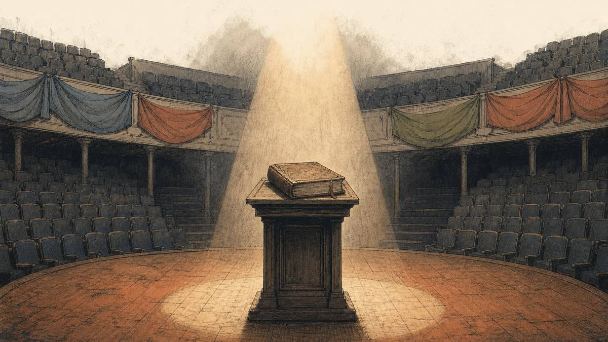
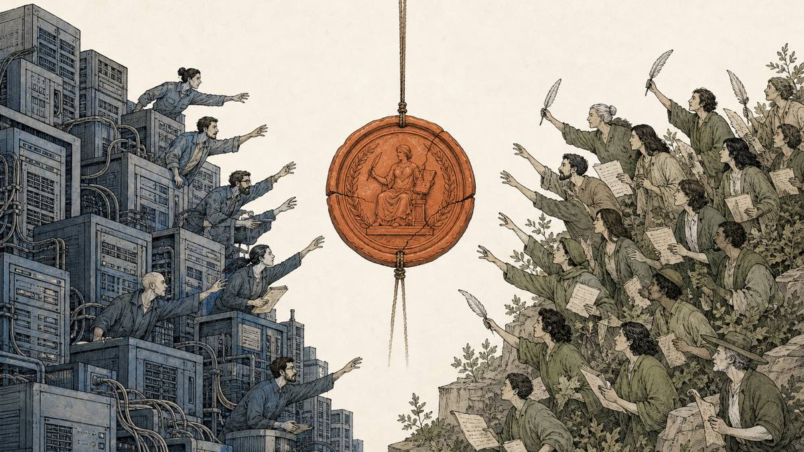
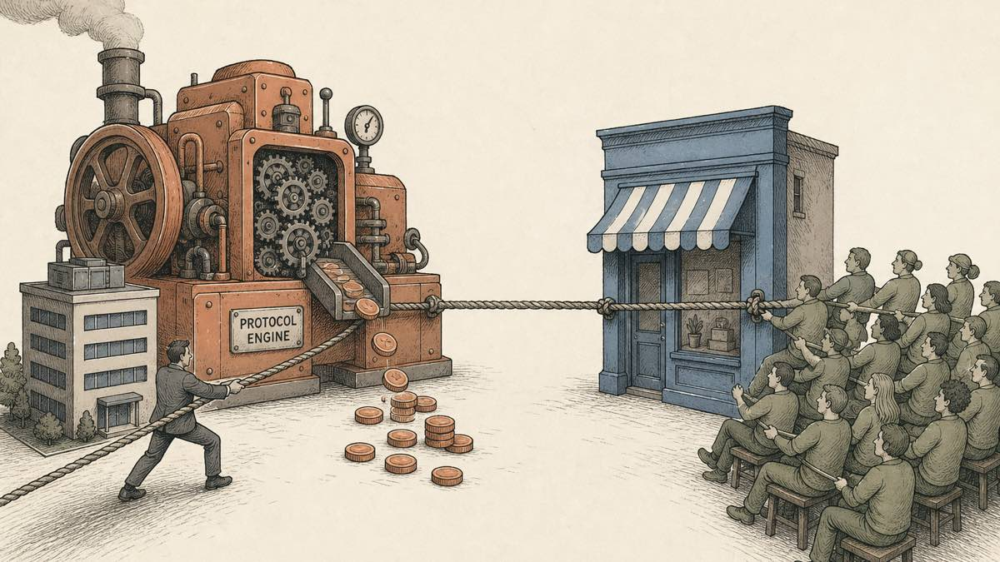
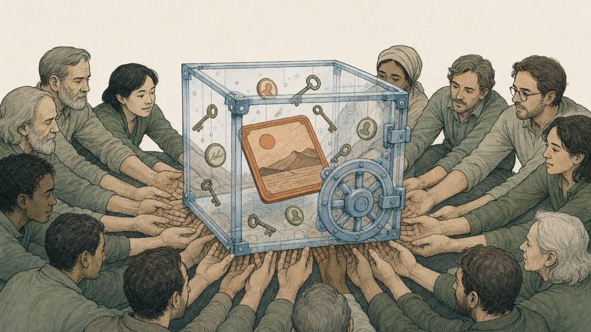

By the Namefi Team — June 2026

Most of the time, nobody asks who is in charge. The work gets done, the site stays up, the votes pass, and the question of ultimate authority stays politely unexamined. Then something breaks — a contested decision, a money dispute, a schism — and suddenly the only question that matters is the one nobody wanted to answer out loud: *who actually speaks for this thing?*

That is a constitutional-crisis moment. And for any online movement, the place where it gets settled is almost never a courtroom or a charter. It is a domain name.

## The constitutional-crisis moment

A constitution is the document nobody needs to read in calm weather. You can run a country, a company, or a community for years without anyone consulting it. Its job is to sit there, boring and ignored, until the day the normal rules run out — a disputed election, a contested succession, a leader who won't step down — and everyone reaches for it at once to answer a single question: when we disagree about who decides, who decides?

The crisis is never really about the immediate fight. It is about *legitimacy* — who is authoritative, who is recognized, who gets to stand at the center of the stage and say "I speak for us" while everyone else accepts it. Countries answer this with constitutions, courts, and elections. The answer is rarely clean, but the machinery exists.

Movements that are not countries have no such machinery by default. They improvise it — and the improvisation usually fails at the worst possible moment.

## Non-countries have constitutional crises too

You do not need a flag and a border to have a succession crisis. You just need enough people, enough value, and a moment where two parties each believe they are the legitimate voice.

Wikipedia — a volunteer encyclopedia, about as far from a nation-state as an institution gets — has had several. The first came early. In February 2002, the Spanish-language community, working off a [perceived expectation that Wikipedia would soon start hosting advertisements](https://en.wikipedia.org/wiki/Enciclopedia_Libre_Universal_en_Espa%C3%B1ol#:~:text=soon%20start%20hosting%20advertisements), simply walked out. [Led by Edgar Enyedy, they left Wikipedia on 26 February 2002, and created the new website](https://en.wikipedia.org/wiki/Enciclopedia_Libre_Universal_en_Espa%C3%B1ol#:~:text=Led%20by%20Edgar%20Enyedy) Enciclopedia Libre. The encyclopedia's content was free to copy; what could not be copied was the question of which project was the *real* Spanish Wikipedia.

A decade later the fight inverted — community against foundation. In 2014, the Wikimedia Foundation built a new administrative power called "superprotect" and used it to [force the installation of a new software feature on the German Wikipedia against the wishes of the Wikimedia community](https://en.wikipedia.org/wiki/Superprotect#:~:text=force%20the%20installation%20of%20a%20new%20software%20feature). [This conflict was unprecedented](https://en.wikipedia.org/wiki/Superprotect#:~:text=This%20conflict%20was%20unprecedented): for the first time the Foundation that ran the servers was overriding the volunteers who wrote the encyclopedia, by technical force. The episode's lasting lesson was that [the Wikimedia Foundation was unable to control the Wikimedia community with technical features](https://en.wikipedia.org/wiki/Superprotect#:~:text=unable%20to%20control%20the%20Wikimedia%20community) — superprotect was eventually removed.

Then came 2019. When the Foundation's Trust & Safety team banned an established editor known as Fram from English Wikipedia, the community's objection was not really about Fram. It was jurisdictional. As one administrator put it, [banning from en.wiki only seems like something ArbCom gets to do, not WMF](https://en.wikipedia.org/wiki/Wikipedia:Fram#:~:text=something%20ArbCom%20gets%20to%20do%2C%20not%20WMF) — a flat assertion that the Foundation had reached past its authority into territory the community governed. The dispute consumed the project for months.

Three different fights, one recurring question: when the people who *run the infrastructure* and the people who *are the community* disagree about who has the final word, who wins? That is a constitutional crisis, flag or no flag.

## The domain is where the crisis lands

Here is the part that is easy to miss until you have lived through it: a DAO is not a building you can occupy or a town square you can stand in. Almost everything it does happens online — the proposals, the debate, the votes, the announcements. So the questions that actually decide who holds power are never territorial. They are about channels: *Which account is the "official" one? Where does the community actually gather to discuss? Who can log in and post under the project's name?* Whoever can answer those three questions in their own favor **is** the project in practice — regardless of what any vote said.

And all three resolve to the same root asset: the main domain. The `.com`, the `.org`, the `.eth` that people type from memory, that wallets resolve, that Google ranks first — it is the center of the stage made concrete. Whoever controls it does not have to *win* the legitimacy argument; they get to *be* the legitimate one by default, because it is the address everyone already trusts. The fork can have the better claim, the bigger community, the original contributors — and still lose, because the audience keeps walking through the door it already knows.

The domain is not just the website, either. It is the root of everything downstream. The "official" email runs on it, and that email is what resets the password on the X account, the Discord, the governance forum, the mailing list. Control the domain and you control the inbox; control the inbox and you control every official channel that hangs off it. That is why, in a schism, the domain is the first thing both sides grab. It is the one asset where soft questions of legitimacy collapse into a hard question of access control — who holds the login, who can change the nameservers, whose signature moves the asset. The constitution you actually run on is whoever can point the domain.

This is also what turns a nice principle into a hard requirement. A DAO that cannot hold its own domain cannot *enforce* its own decisions. Governance can vote to change direction, remove a contributor, or disown a rogue front end — but if the domain and the accounts it gates stay in someone else's hands, that vote is a press release, not an instruction. Enforcement lives wherever the domain lives. If you want the DAO's word to be final, the DAO has to hold the front door.

## Crypto's version: which one is the real one?

Crypto has run this experiment in the open, with money attached.

In 2016, after the theft of funds from "The DAO," Ethereum executed a hard fork to reverse it. Not everyone agreed. The chain split, and [the altered history was named [Ethereum](/en/glossary/ethereum/) (ETH) and the unaltered history was named Ethereum Classic (ETC)](https://en.wikipedia.org/wiki/Ethereum_Classic#:~:text=the%20altered%20history%20was%20named%20Ethereum). The Classic side's entire claim was a legitimacy claim — that it, not the larger fork, [maintains the original, unaltered history of the Ethereum network](https://en.wikipedia.org/wiki/Ethereum_Classic#:~:text=unaltered%20history%20of%20the%20Ethereum%20network). Both chains were technically real. Only one got to keep the name "Ethereum" in the world's mind, and it was the one the ecosystem's front doors — exchanges, wallets, the main site — pointed at.

The cautionary version is `bitcoin.org`, the canonical front door originally registered in Satoshi's era. By 2020 its actual control sat with a single pseudonymous owner, "Cobra," who removed the site's longtime maintainer in a unilateral ownership dispute. The maintainer's account was blunt: [Cobra has removed my access and seized control of the site and accompanying code repositories](https://decrypt.co/33703/bitcoin-orgs-secret-owner-kicks-out-the-sites-maintainer#:~:text=seized%20control%20of%20the%20site). One anonymous person, holding the keys to a movement's most famous address, answerable to no one. That is the failure mode in its purest form: the most important domain in the room governed by whoever happened to control the [registrar](/en/glossary/registrar/) account.

## Aave's identity crisis: does "Labs" speak for the DAO?

The clearest recent case is Aave, and it is almost too on-the-nose: a DAO arguing, in public, that it — not the company that builds the software — should control its own main domain and brand.

In late 2025 a governance proposal asked Aave tokenholders to take the protocol's brand, naming rights, web domains, and social accounts into the DAO, after a dispute over a deal that routed fees to Aave Labs rather than the DAO. Notice what got bundled together — *web domains and social accounts* — because in the real world they travel as one parcel: the entity that holds the domain holds the keys to the channels. The argument was about who the front door really belongs to. As the proposal framed it, [we should not have to fear that the implicit steward of the brand may at any point leverage that brand for their own benefit](https://www.dlnews.com/articles/defi/aave-dao-proposal-to-take-control-of-brand-from-aave-labs-gains-traction/#:~:text=implicit%20steward%20of%20the%20brand) without the DAO's consent. The phrase that matters there is *implicit steward* — nobody had ever voted to make Labs the voice of Aave; it simply was, because it held the assets.

And the assets included the website. Labs' own defense made the control explicit: it argued it needed the new revenue stream to cover the cost of running the protocol's website, [which it controls](https://www.dlnews.com/articles/defi/aave-dao-proposal-to-take-control-of-brand-from-aave-labs-gains-traction/#:~:text=which%20it%20controls). Commentators reaching for the right metaphor landed on exactly the one this article is built around: the DAO is the engine that ships the upgrades and earns the revenue, while the [brand assets function as the storefront](https://www.coindesk.com/tech/2025/12/23/most-important-tokenholder-rights-debate-aave-faces-identity-crisis#:~:text=brand%20assets%20function%20as%20the%20storefront) — and called it [the most important live debate around tokenholder rights today](https://www.coindesk.com/tech/2025/12/23/most-important-tokenholder-rights-debate-aave-faces-identity-crisis#:~:text=the%20most%20important%20live%20debate). A multi-billion-dollar protocol discovered, in the middle of a fee fight, that it had never actually settled who owned its own front door.

## ENS's answer: write down who's authoritative

Aave shows the crisis arriving unannounced. ENS shows a movement trying to answer the question *before* the crisis — which is the entire point.

ENS already separates the roles cleanly. [The ENS DAO governs the ENS protocol and treasury](https://docs.ens.domains/dao#:~:text=governs%20the%20ENS%20protocol%20and%20treasury), while [ENS Labs is a non-profit organization responsible for the core software development of ENS](https://basics.ensdao.org/ens-labs#:~:text=responsible%20for%20the%20core%20software%20development%20of%20ENS). Labs builds; the DAO governs. But a 2024 temp-check on the "next era" of ENS governance went further and tried to write the authority map down explicitly. Under the proposed structure, [protocol control such as smart contract upgrades, ENS pricing and fee structures, root key and registry control, and constitutional amendments remain exclusively with tokenholders](https://discuss.ens.domains/t/temp-check-next-era-of-ens-dao-empowering-the-ens-foundation/22175#:~:text=remain%20exclusively%20with%20tokenholders) — while a chartered Foundation, not the operating company, holds the trademarks and brand assets and [licenses them to Labs](https://discuss.ens.domains/t/temp-check-next-era-of-ens-dao-empowering-the-ens-foundation/22175#:~:text=licenses%20them%20to%20Labs).

Read that carefully. The most contested asset in a crisis — the brand, the name, the identity everyone fights over — is placed under the chartered body answerable to tokenholders, and merely *licensed* to the company that does the day-to-day work. That is a movement deciding, in calm weather, who stands at the center of the stage, so that no one has to improvise it under fire.

## Why the DAO, specifically

Granting that *someone* should hold the main domain on purpose rather than by accident — why the DAO, and not the founder, or the Labs company, or a trusted multisig of insiders?

Because the DAO is the only candidate whose authority is, at once, explicit, verifiable, and survivable.

- **Explicit.** A token-holder vote is the closest thing a decentralized movement has to a written constitution plus an election. Nobody is the "implicit steward." Authority is a recorded outcome, not an inherited default.
- **Verifiable.** Who can move the asset, and under what threshold, is visible [on-chain](/en/glossary/on-chain/). You do not have to trust that the right people hold the registrar password — you can read the rule.
- **Survivable.** Founders leave, change their minds, or, as `bitcoin.org` showed, turn out to be a pseudonym answerable to no one. Companies develop interests that diverge from their community, as Aave found. A DAO's legitimacy does not evaporate when one person walks away, because it never lived in one person.

Put the main domain anywhere else and you have reintroduced exactly the single point of capture the movement was supposed to eliminate. The domain becomes the one centralized asset propping up a decentralized story — fine until the crisis, and decisive during it. Putting it under the DAO means the answer to "who speaks at the center of the stage" is produced by the same legitimacy machine that governs everything else, instead of by whoever holds the login.

There is one honest objection: historically, a DAO simply *couldn't* hold a `.com`. Domains live in Web2 registrars behind a username, a password, and a credit card. The best a DAO could do was trust a human — or a Labs company — to log in on its behalf. That gap is precisely how the "implicit steward" gets created in the first place.

Tokenized domains close it. When a domain is an on-chain asset, a governance contract or DAO-controlled multisig can hold it and transfer it by vote, under the same rules and the same thresholds as the treasury. The front door stops being a password in someone's personal vault and becomes a governable asset under the movement's actual constitution. This is the problem [Namefi](https://namefi.io) exists to solve: bringing real domains on-chain so the body that governs the protocol can also, verifiably, hold its front door.

## Decide before the crisis

The thing about a constitutional crisis is that it is a terrible time to write a constitution. Everyone is already fighting, every choice looks partisan, and whoever holds the asset when the music stops tends to keep it.

So decide now, while it is calm and boring and nobody is fighting about it: who controls the main domain? If the honest answer is "the founder's registrar account," or "the Labs company that happens to run the site," then the movement has an implicit steward and an unwritten constitution — and it will discover both at the worst possible moment.

Give the front door to the body that is supposed to speak for the whole movement. Make it explicit, make it verifiable, make it survive any one person. A DAO that holds its own domain can enforce its own decisions; a DAO that does not can only ask nicely and hope whoever holds the login agrees. Put the main domain under the DAO before you need to.

## Sources and further reading

- Wikipedia — [Enciclopedia Libre Universal en Español](https://en.wikipedia.org/wiki/Enciclopedia_Libre_Universal_en_Espa%C3%B1ol#:~:text=soon%20start%20hosting%20advertisements) (the 2002 Spanish Wikipedia fork)
- Wikipedia — [Superprotect](https://en.wikipedia.org/wiki/Superprotect#:~:text=This%20conflict%20was%20unprecedented) (the 2014 Foundation-vs-community override)
- Wikipedia — [Wikipedia:Fram](https://en.wikipedia.org/wiki/Wikipedia:Fram#:~:text=something%20ArbCom%20gets%20to%20do%2C%20not%20WMF) (the 2019 "Framgate" jurisdiction dispute)
- Wikipedia — [Ethereum Classic](https://en.wikipedia.org/wiki/Ethereum_Classic#:~:text=the%20altered%20history%20was%20named%20Ethereum) (the 2016 "which chain is the real Ethereum" split)
- Decrypt — [Bitcoin.org's Secret Owner Kicks Out the Site's Maintainer](https://decrypt.co/33703/bitcoin-orgs-secret-owner-kicks-out-the-sites-maintainer#:~:text=seized%20control%20of%20the%20site) (the 2020 `bitcoin.org` control dispute)
- DLNews — [Aave DAO proposal to take control of brand from Aave Labs gains traction](https://www.dlnews.com/articles/defi/aave-dao-proposal-to-take-control-of-brand-from-aave-labs-gains-traction/#:~:text=implicit%20steward%20of%20the%20brand)
- CoinDesk — [The most important tokenholder-rights debate: Aave faces an identity crisis](https://www.coindesk.com/tech/2025/12/23/most-important-tokenholder-rights-debate-aave-faces-identity-crisis#:~:text=brand%20assets%20function%20as%20the%20storefront)
- Aave Governance Forum — [Temp Check: The Aave Interface Transparency Act](https://governance.aave.com/t/temp-check-the-aave-interface-transparency-act/23647)
- ENS — [Temp Check: Next era of ENS DAO — Empowering the ENS Foundation](https://discuss.ens.domains/t/temp-check-next-era-of-ens-dao-empowering-the-ens-foundation/22175#:~:text=remain%20exclusively%20with%20tokenholders)
- ENS Docs — [The ENS DAO](https://docs.ens.domains/dao#:~:text=governs%20the%20ENS%20protocol%20and%20treasury) · ENS DAO Basics — [ENS Labs](https://basics.ensdao.org/ens-labs#:~:text=responsible%20for%20the%20core%20software%20development%20of%20ENS)
