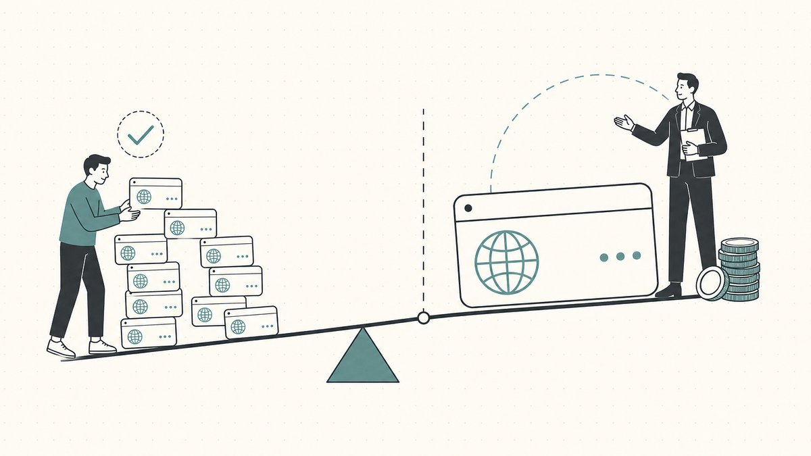
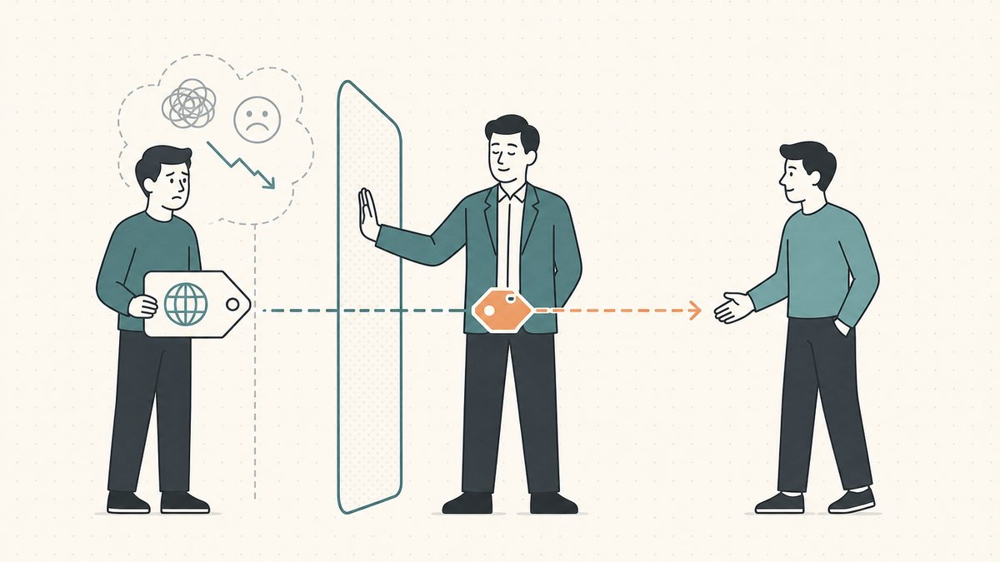
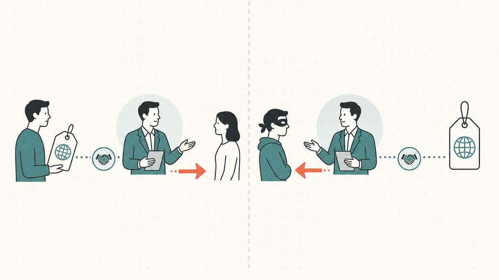

Most of the names you flip, you should sell yourself. List it, set a price, answer the inbound, close in escrow. A broker on a $400 name is a stranger taking a cut of money you could have kept. But there is a band of deals where a broker stops being overhead and starts being the difference between a sale and a stalemate, and knowing where that band starts is its own skill. This is the broker chapter of our [domain flipping](/en/blog/domain-flipping/) series, and it sits one level down from the selling pillar, [how to sell domains for profit](/en/blog/how-to-sell-domains-for-profit/). Here we'll cover when to hand a name to a broker, what a good one actually does, the difference between buy-side and sell-side brokerage, what commissions look like, and how to tell a real broker from someone who just wants your listing.

## When a broker is worth the cut

A broker is leverage, and leverage only pays when the stakes are high enough to clear the fee. The rough threshold most experienced sellers use is five figures and up, or any single name with one obvious institutional buyer. Below that, the math rarely works: a broker's commission on a $1,200 sale is real money for service you could have performed in an afternoon with a listing and an [escrow](/en/glossary/escrow/) account.

The deals that justify a broker share a shape:

- **High absolute value.** When a name might sell for $30,000 or $300,000, a few extra points of negotiated price more than covers the commission. The fee is a rounding error against the upside a skilled negotiator unlocks.
- **A narrow, identifiable buyer pool.** If exactly one company in the world should own the name, you have leverage and a problem at once. The leverage is obvious; the problem is that the buyer knows they're the only buyer, and an amateur seller telegraphs desperation in the first email. A broker is a buffer.
- **A buyer who must not know it's you.** A startup, a public company, or a well-funded acquirer will quietly raise their internal budget the moment they sense the seller is eager, or that the seller is a person rather than a portfolio. Brokers approach on your behalf without ever revealing how badly you want the sale.
- **A name where the approach itself is delicate.** Reaching out about a name a company arguably should have registered years ago is a conversation that can curdle fast. Done wrong, [outbound](/en/blog/inbound-vs-outbound-domain-sales/) outreach to a brand reads as a shakedown rather than an offer. A broker who does this for a living knows how to frame it as a business opportunity, not a threat.

Below the threshold, sell it yourself. Brokers earn their keep on names where the buyer pool is small and the dollars are large, not on the long tail of $300 flips you could list in five minutes. The selling pillar walks the full do-it-yourself path in [how to sell a domain name you own](/en/blog/how-to-sell-a-domain-name-you-own/).

## What a good broker actually does

The word "broker" undersells the job. A good one is not a middleman who forwards emails. They are a negotiator, a researcher, and a deal closer, and the value lives in the parts of the transaction an owner is worst positioned to handle.

**They create negotiating distance.** This is the single biggest thing you're buying. When you negotiate your own name, every signal you send about how much you want the deal becomes a price discount. A broker sits between you and the buyer, so your eagerness never reaches the other side of the table. They can float a number, walk it back, go quiet for a week, and let silence do work that a personally invested owner can't stomach.

**They know who the real buyer is.** On the buy side especially, a broker's job is to identify the actual decision-maker inside a company and the actual current holder of a name, then open a line to both. Domains often sit in the [domain aftermarket](/en/glossary/domain-trading/), defined by Wikipedia as [the secondary resale market for Internet domain names in which a party interested in acquiring a domain that is already registered bids or negotiates a price](https://en.wikipedia.org/wiki/Domain_aftermarket#:~:text=the%20secondary%20resale%20market%20for%20Internet%20domain%20names), and finding the right counterparty in that market is a relationship game brokers play full-time.

**They anchor and shape the price.** A broker has seen comparable sales you haven't and can defend a number with data rather than hope. They set the opening anchor, manage the concession schedule, and keep the conversation from collapsing into a single take-it-or-leave-it figure. This is the pricing craft we cover in [domain pricing psychology: buy now vs make offer](/en/blog/domain-pricing-psychology-buy-now-vs-make-offer/), applied by someone who does it for a living.

**They run the close.** The riskiest part of any deal is the handover, where the seller doesn't want to transfer before getting paid and the buyer doesn't want to pay before receiving the name. A broker manages the [escrow](/en/blog/domain-escrow-explained/) workflow, coordinates the transfer, and keeps a deal from dying over the awkward mechanics. They know that a domain name transfer is, per Wikipedia, [the process of changing the designated registrar of a domain name](https://en.wikipedia.org/wiki/Domain_name_transfer#:~:text=A%20domain%20name%20transfer%20is%20the%20process%20of%20changing%20the%20designated%20registrar%20of%20a%20domain%20name), that the buyer's new [registrar](/en/glossary/registrar/) needs the [auth code](/en/glossary/auth-code/) the seller [supplies](https://en.wikipedia.org/wiki/Domain_name_transfer#:~:text=supplies%20the%20authentication%20code), and that a freshly moved name sits under a transfer lock for a stretch afterward. An owner closing their first big deal learns those traps the hard way; a broker has hit them all before.

## Inbound vs outbound brokerage

"Broker" covers two distinct jobs, and the one you need depends on which side of the table you're on. This maps directly onto the [inbound vs outbound](/en/blog/inbound-vs-outbound-domain-sales/) split that runs through the whole selling discipline.

**Sell-side (inbound) brokerage** is what most flippers mean. You own a strong name, a buyer has surfaced or is likely to, and you hand the negotiation to a broker to maximize the price and run the close. The broker works for you, takes a commission on the sale, and earns it by getting a higher number and a cleaner deal than you would alone. This is the model behind the marketplaces, where some platforms layer brokerage on top of [listings](/en/glossary/marketplace/) — see [where to sell domains: marketplaces compared](/en/blog/where-to-sell-domains-marketplaces-compared/) for how the big venues differ.

**Buy-side (outbound) brokerage** is the mirror image and a different animal. Here a company wants a specific name it doesn't own, and it hires a broker to go get it. The broker researches who holds the name, opens an anonymous line, and negotiates the acquisition without revealing the principal. Anonymity is the whole product: if a recognizable brand asks about a name directly, the price triples on the spot. Buy-side brokers protect their client by never naming them until terms are agreed.

If you're the flipper, you're usually on the sell side. But it's worth understanding the buy side, because the broker who approaches you about one of your names may be working for a deep-pocketed client they will not name, and that changes how you read the offer. An anonymous "interested party" represented by a broker is often a sign the name is worth more than the opening bid suggests.

## What commissions look like

Treat every number here as a rule of thumb, not a posted rate. Brokerage commissions are negotiated and vary by broker, deal size, and how much work the name requires, so the figures below are industry norms rather than fixed tariffs.

The common structure is a percentage of the final sale price, paid by the seller on a successful deal. The often-quoted range sits in the low-to-mid double digits in percent, frequently scaling down as the deal grows: a broker who takes a larger cut of a $10,000 sale will usually take a smaller percentage of a $500,000 one. Many set a minimum commission so small deals are still worth their time, another reason brokerage rarely makes sense on cheap names. Buy-side engagements are sometimes a flat fee, a success fee, or a percentage of the acquisition price.

A few things to pin down in writing before you sign anything:

- **The exact percentage and any minimum.** Get the number and the floor.
- **Whether the engagement is exclusive,** and if so for how long. An exclusive listing means you can't also sell the name yourself or list it elsewhere during the term.
- **What counts as a commissionable sale.** Specifically, whether the broker is owed a fee if a buyer they introduced closes after the engagement ends. This "tail" clause catches sellers off guard.
- **Who pays escrow and transfer fees,** and how the money flows at close.

There's no universally correct rate, and a higher commission from a broker who actually delivers a bigger price beats a lower one from someone who lists your name and waits. Run the math on the net you'd clear, not the percentage you'd pay.

## How to vet a broker

The barrier to calling yourself a domain broker is roughly zero, which means vetting is on you. The good ones are worth far more than their fee; the bad ones are a worse outcome than selling it yourself, because they tie up your name under an exclusive and then do nothing. Before you sign:

1. **Ask for a verifiable track record.** Real brokers have closed deals and can speak to comparable sales, even if confidentiality keeps them from naming every buyer. Vague claims of "many large transactions" with nothing concrete behind them are a flag.
2. **Check how they get paid, and when.** A legitimate broker is paid a commission on a successful sale, through a neutral [escrow](/en/glossary/escrow/) process. Anyone asking for a large upfront fee to "appraise," "list," or "market" your name before any sale exists is running a different business, and it's frequently the appraisal-scam business. Legitimate sell-side brokerage is overwhelmingly success-based.
3. **Confirm they use real escrow and a clean transfer.** The broker should insist on a neutral third party holding funds, and should understand the [transfer mechanics](/en/blog/how-to-sell-a-domain-name-you-own/) and the lock windows cold. A broker who's casual about the handover is a broker who'll lose you a deal, or a name. For how those handovers get attacked, [how domain hijacking actually happens](/en/blog/how-domain-hijacking-actually-happens/) is the cautionary read.
4. **Read the exclusivity and tail terms before you sign, not after.** A long exclusive with a broad tail clause and no performance commitment is the worst deal in the business: you've handed away your name and your time for nothing.
5. **Talk to the wider community.** The [domain trader forums](/en/blog/top-domain-trader-forums/) and the [domainer blogs and newsletters](/en/blog/famous-domainer-blogs-and-newsletters/) are full of people who've worked with specific brokers and will tell you, often bluntly, who's real. The broader [domain industry media](/en/blog/domain-industry-media/) is another reputation check. Reputation in this business travels.

The through-line: a broker should be paid for outcomes, transparent about terms, and rigorous about the close. Anyone who wants money before there's a deal, or who's vague about how they get paid, is selling something other than your domain.

## The Namefi angle

The reason brokers loom so large in high-value deals is that the handover is genuinely scary: proving who holds the name, transferring it without the site going dark, and trusting the other side to deliver. A good broker manages that friction with relationships and process. [Namefi](https://namefi.io) attacks the friction itself. Tokenized ownership makes control of a real ICANN domain easier to verify and transfer, with DNS continuity so the name keeps resolving cleanly through the handover. That doesn't replace a great negotiator on a seven-figure name, but it does shrink the part of the deal where trust used to be the only thing holding it together. If you want the longer view, see [how tokenized marketplaces replace escrow](/en/blog/how-tokenized-marketplaces-replace-escrow/).

## Friendly Disclaimer (Read Me!)

> We're not lawyers, accountants, financial advisors, or doctors, and **nothing in this article is legal, financial, tax, accounting, medical, or any other flavor of professional advice.** We write these posts to educate ourselves and as a convenience for our customers. Info here may be out of date, geography-specific, or just plain wrong. We make mistakes too.
>
> For any important decision, **please consult a real professional (seriously!)**. Or if that's not your vibe, ask a friend, ask Twitter, ask Reddit, ask an AI, or ask a psychic. In short: **DOYR - Do Your Own Research**. Let's learn and have fun.

## Sources and further reading

- Wikipedia — [Domain aftermarket](https://en.wikipedia.org/wiki/Domain_aftermarket#:~:text=the%20secondary%20resale%20market%20for%20Internet%20domain%20names) (definition of the secondary resale market where brokers operate)
- Wikipedia — [Domain name transfer](https://en.wikipedia.org/wiki/Domain_name_transfer#:~:text=A%20domain%20name%20transfer%20is%20the%20process%20of%20changing%20the%20designated%20registrar%20of%20a%20domain%20name) (transfer process and the authentication code handover a broker coordinates)
